# 一、软件平台和 API

2018 年 10 月 28 日，IBM 宣布以 340 亿美元收购红帽、 [1](#Fn1) 红帽企业 Linux (RHEL)背后的公司，以及最近的红帽 OpenShift，一个企业 Docker/Kubernetes 应用平台。我们看到的是 340 亿美元的证据表明，以 Linux 生态系统为中心并由 Kubernetes 支持的云原生和开源技术正在引领企业软件应用平台的颠覆。

任何对企业软件营销的接触都会呈现主要云提供商几乎每天发布的稳定的平台服务流，包括谷歌云机器学习引擎、微软的 Azure 机器学习服务、亚马逊管理的区块链和 IBM Watson 物联网平台等产品。像亚马逊、微软、IBM 和谷歌这样的大提供商不仅对这些技术的市场需求做出了回应，而且让人们更加意识到这些技术可以解决各种行业的问题。大型软件供应商正在快速响应对这些功能的需求，并通过提炼和营销展示其价值的产品来延续其需求。这些供应商通常只是在开源软件中包装最新的服务，添加精致的用户界面和专有中间件。窥视这些超级云服务的内幕，你经常会发现一系列云原生甚至供应商中立的机器学习(ML)技术，如 TensorFlow、Keras 和 PyTorch，或以太坊和 Hyperledger 支持的区块链功能，以及 Prometheus 和 Kafka 等高性能物联网数据收集器。这些供应商并没有从开源社区窃取这项技术；在这个生态系统中，一些最重要的贡献是供应商本身。

从头开始开发一个具有区块链和机器学习等多种功能的企业级平台，仅在几年前还需要付出巨大的努力。你的另一个选择是对一个商业平台的重大投资和长期承诺。谷歌用 Kubernetes 颠覆了整个商业平台业务，Kubernetes 是一个免费、开源、云原生和厂商中立的系统，用于快速开发新平台，可以轻松支持几乎任何具有企业级安全性、稳定性和规模的技术。随着 Kubernetes 的成熟，软件和平台开发人员可以将更多的时间放在特性上，减少基础设施、网络、扩展、监控甚至安全方面的定制工作，预计将会看到另一波重大的平台创新。

这本书旨在使用 Kubernetes 以独立于供应商的方式构建一个简单的演示平台。只需进行最少的修改，这个新平台就可以在任何能够运行 Kubernetes 的主要云提供商上运行，并提供少量广泛可用的依赖项，如存储、内存和 CPU。在这个平台上实现的每一种现有的开源技术都专门关注一个特定的解决方案。提供机器学习、区块链或基于物联网的服务本身不会成为平台的核心优势。然而，在 Kubernetes 中一起操作这些技术提供了一个基础，在这个基础上通过他们的共同努力来构建和提供新的解决方案，并为将来的添加提供一个模板。

在 20 世纪 90 年代早期，数据库通常作为独立的应用进行操作和访问。数据库和 web 服务器的结合通过动态数据库驱动的网站彻底改变了互联网。这些组合现在似乎显而易见，Kubernetes 与 Istio 和 Linkerd 等服务网格技术一起在不同的应用之间建立连接，即使存在相互冲突的依赖关系，这不仅是可能的，而且为平台增加了安全性和遥测功能。

## 软件应用与软件平台

你可能是一名软件开发人员，对某个特定行业的某个问题有解决方案。对于封闭和开放源代码软件的特定组合，您希望将这些功能组合在一个 API 下，并公开它们以支持特定的应用。或者，你可能是一个增值经销商，希望为客户提供一个应用开发平台，该平台带有一套预打包的功能，如机器学习、区块链或物联网数据摄取。像 Kubernetes 这样的软件平台是开发单一应用或平台即服务(PaaS)的理想环境，为客户提供了一个开发和扩展应用的环境(图 [1-1](#Fig1) )。

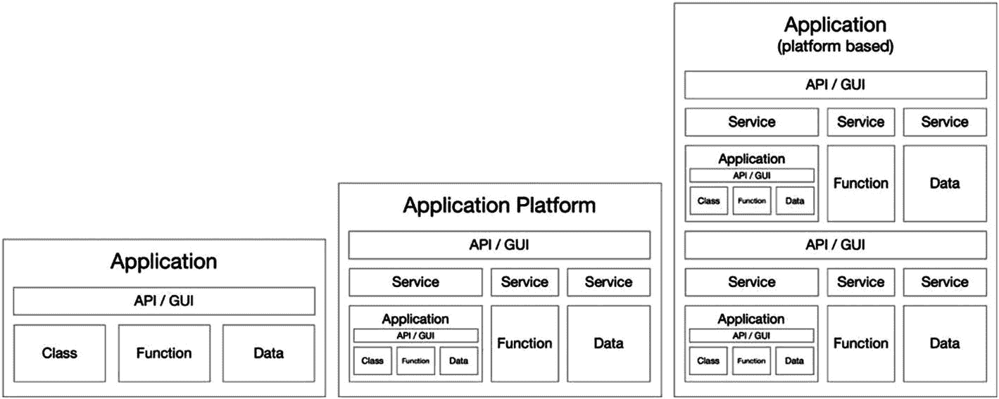

图 1-1

软件应用、作为应用集合的平台以及基于平台的应用

### 依赖性管理和封装

容器化通过创建一个单一的依赖项，即容器运行时，使得运行的软件应用比以往任何时候都更加可移植。然而，应用通常需要访问复杂的资源组合，包括外部数据库、GPU(用于机器学习的图形处理单元)或持久存储，并且可能需要与其他应用通信以进行身份验证、数据库访问和配置服务。即使是一个容器化的应用，通常也需要某种形式的管理来控制它和它对外部资源的访问。管理连接容器的问题就是 Kubernetes 的用武之地；Kubernetes 编排应用的容器，并管理它们与资源的关系。

### 应用网络

并非所有的软件应用都需要复杂的平台架构。大多数软件应用可以在满足其操作依赖性的计算机上开发和运行。当您希望一起操作多个应用并形成一个互连的服务网络时，或者当多个应用可以从共享的功能、配置或资源管理中受益时，平台就开始发挥作用了(图 [1-2](#Fig2) )。

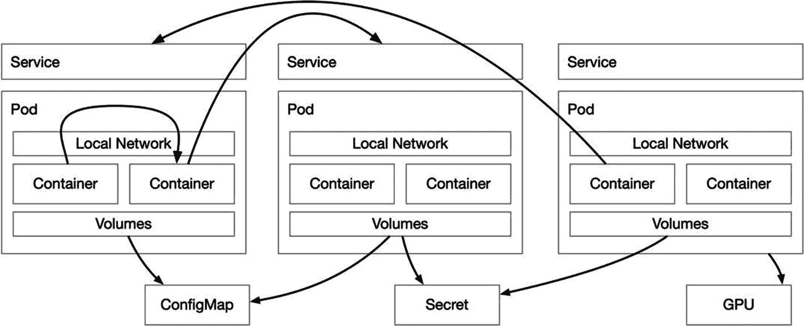

图 1-2

容器化应用网络

### 应用平台

即使您的目标是开发一个单一用途的在线应用，也有几个理由着手在 Kubernetes 中开发一个软件平台。大型和小型、复杂和简单、企业和小型应用在软件平台环境中实现时都会受益。软件平台提供了一个解决常见问题的架构，并减少了对几个领域的定制开发的需求，包括通信、存储、可伸缩性、安全性和可用性。

将应用设计为一个平台意味着，从一开始，软件就应该扩展到基本需求之外，能够独立地升级和部署新的组件。一个合适的平台欢迎开源最新趋势的加入，当创新出现，开源产品发布时，成功的软件平台包装并利用它们的功能来保持最新。一个合适的软件平台不应该被贴上传统的标签；它应该保持在一个不断迭代的改进周期中。

下一节将更深入地探讨如何使用 Kubernetes 作为核心组件来实现这一点。Kubernetes 解决了传统企业解决方案(如面向服务的体系结构(SOA ))几十年来一直试图解决的问题，只有 Kubernetes 使用支持全球互联网的协议和方法(如 DNS、TCP 和 HTTP)做到了这一点，并将它们包装在一个优雅而健壮的 API 中，可通过这些协议访问。该平台是围绕 Kubernetes 的服务概念及其与容器化应用的关系构建的(图 [1-3](#Fig3) )。

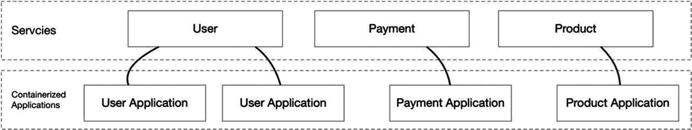

图 1-3

服务和应用之间的关系

## 平台要求

本书专注于实现基础数据驱动、数据科学和机器学习平台，主要但不限于物联网数据，并提供与区块链技术互联的机会。如果这听起来像是大肆宣传，确实如此，随着宣传的消退，是时候开始工作了。随着这些技术离开实验室，它们开始退居幕后，在未来十年，它们将开始在新的创新产品背后默默提供它们的解决方案。

如果你熟悉 2018 年的“Gartner 新兴技术炒作周期”(图 [1-4](#Fig4) )、 [2](#Fn2) ，你会看到深度神经网络(深度学习)、物联网平台和区块链仍然处于“膨胀的预期的顶峰”，并朝着“幻灭的低谷”滚动幻灭听起来很可怕，但 Gartner 将这些技术的以下阶段标记为“启蒙斜坡”和未来 5-10 年的平台期。许多创新发生在这些技术达到稳定状态之前，由 Kubernetes 管理的一系列连接容器构建的灵活架构应该可以轻松地让您在未来十年或更长时间内保持相关性。

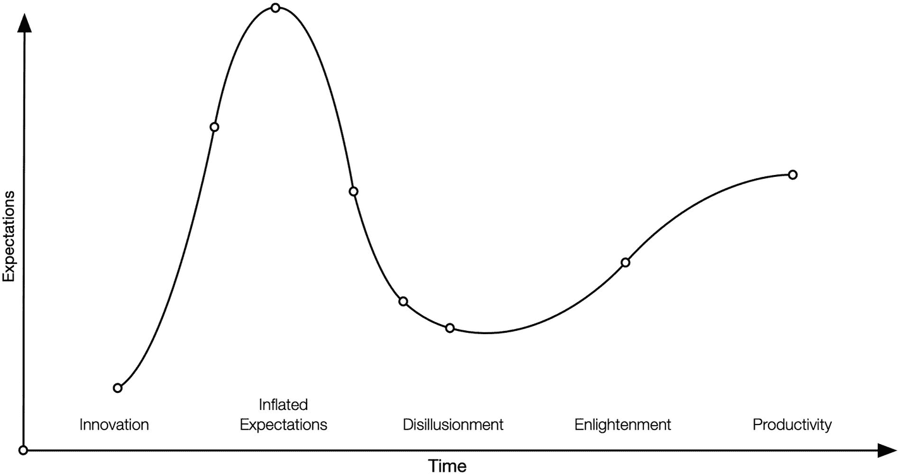

图 1-4

Gartner 对新兴技术的炒作周期，2018 [3](#Fn3)

虽然单个组件可能会随着趋势的高峰和平台期来来去去，但数据会一直存在；该平台需要存储它，转换它，并通过最新的创新提供对它的访问，从而从它那里产生价值。如果对 Kubernetes 的高级平台开发有一个核心要求，那就是通过物联网、机器学习、区块链等领域的最新创新技术持续获取数据的价值。

使用 Kubernetes 进行高级平台开发的最后一个要求是保持开源、云原生和厂商中立。一个拥有这些原则的平台可以利用开源来利用贡献软件开发人员的全球社区来解决和我们一样的问题。保持云的原生性和供应商中立性意味着不受特定供应商的束缚或约束，并且随着“混合云”概念的普及，它在私有数据中心中的功能与在 AWS、GKE、Azure 或所有这些平台上的功能一样。

## 平台架构

在 Kubernetes 中，从一组专门的组件中构建软件平台是很常见的，这些组件用多种语言编写，并且具有非常不同甚至冲突的依赖关系。一个好的平台可以封装不同的组件，并将它们的接口抽象成一个标准的 API 或一组 API。

面向对象的软件概念是整个平台架构的一个很好的参考工具。微服务架构的趋势鼓励开发几个最小的应用，通常采用对象类的形式，在特定的问题域中提供有限数量的操作，让更大的平台负责聚合业务逻辑。为了实现这种方法，采用对象的概念，并将其应用到服务的 Kubernetes 实现中(图 [1-5](#Fig5) )。像软件接口一样，Kubernetes 服务代表了应用的一个或多个入口点。抽象、封装、继承和多态的面向对象软件原则可以表达平台架构的每一层。

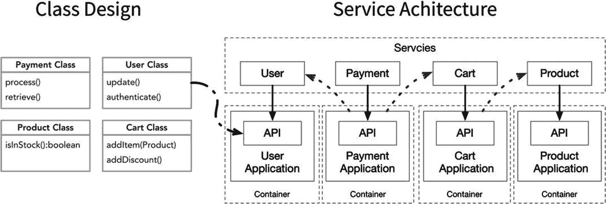

图 1-5

类设计和服务架构

Kubernetes 非常适合平台开发，对于任何较次要的任务来说可能有些过头了。我相信，正如我希望您在本书中发现的那样，Kubernetes 对于平台开发的适用性没有太多争议。容器通过隔离和封装组件解决了依赖管理的许多问题；Kubernetes 管理这些容器，并以此形成软件平台的框架。

## 平台功能

本书中概述的平台的目的是展示 Kubernetes 如何让开发人员能够将各种不同的技术组合在一起，并使用 Kubernetes API 管理它们。使用 Kubernetes 开发平台降低了采用最新趋势的风险和费用。Kubernetes 不仅支持快速开发，还可以轻松支持并行工作。我们开发一个软件平台，只需要尽可能少的编程。我们使用声明性配置来告诉 Kubernetes 我们想要什么。我们使用开源应用来构建基础软件平台，提供物联网数据收集、机器学习功能以及与私人管理的区块链交互的能力。

从数据的摄取、存储和检索开始，该平台的核心功能是一个健壮的数据层(图 [1-6](#Fig6) )。该平台必须能够从物联网设备和其他外部来源(包括私人管理的区块链)获取大量数据。Elasticsearch、Kafka 和 Prometheus 等应用管理数据索引、消息排队和指标聚合。特定的服务从以太坊 Geth 节点等应用中捕获区块链交易，并将其发送到 Apache Kafka 进行排队，以及 Elasticsearch 进行索引。

在数据层之上是一个应用层(图 [1-6](#Fig6) )，提供利用这些数据的能力，比如机器学习自动化。平台服务连接在一起，并公开数据源，这些数据源导出并提供可用于机器学习实验、生产人工智能推理和商业分析的持久和流式数据。

该平台自然支持通过 Kubernetes 对容器的管理来扩展特性。包括 OpenFaaS 在内的无服务器技术提供了更高级别的功能扩展。无服务器支持允许快速开发和部署实时数据处理器、以特定间隔运行的操作和新的 API 端点，允许专门访问数据、执行 AI 操作或修改平台本身的状态。

本书中设想的平台形成了与趋势技术合作的数据驱动基础，专门研究机器学习、区块链和物联网。用于数据接收、存储、索引和排队的组件被集合在一起，并允许在专门的技术之间高效地访问数据。该平台为数据科学家提供了执行机器学习实验和开发生产就绪型神经网络模型所需的数据和工具，通过无服务器功能进行部署，能够进行预测，执行分类，并从现有和入站数据中检测异常。区块链技术用于演示第三方总账交易和智能合同执行如何无缝地内部连接到数据处理流水线。

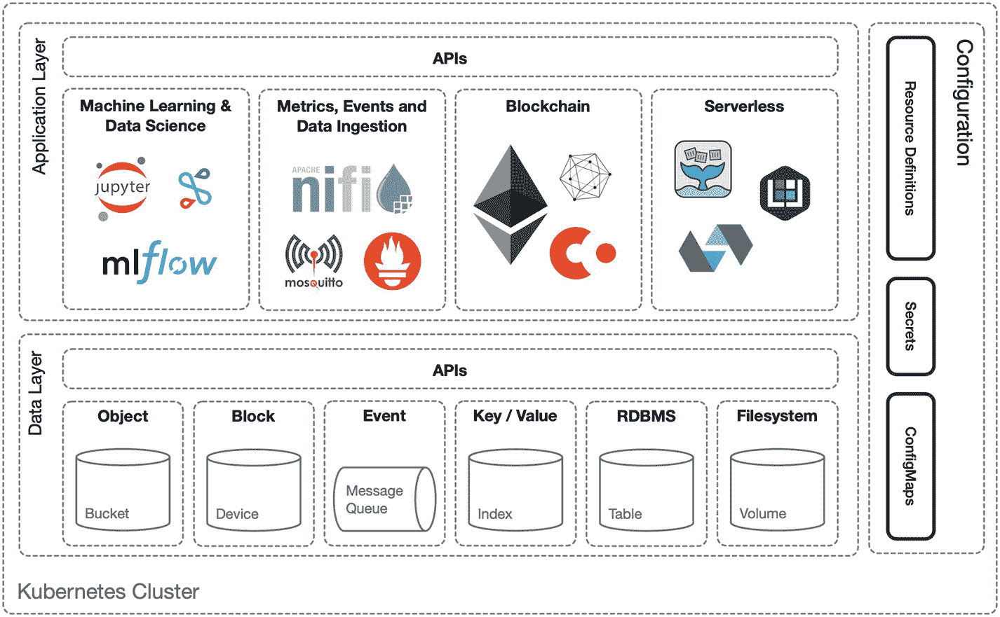

图 1-6

平台应用和数据层

迭代开发的平台最终由大量的服务组成，这些服务的规模和复杂性各不相同，混合了巨型独石和小型无服务器功能。有些服务由一个 Java 应用集群组成，而有些服务只执行几行 Python。如果这听起来像一场噩梦，其实不是。幸运的是，容器化帮助我们隔离了应用的操作和依赖性，暴露了配置、控制和与应用通信所需的内容。然而，容器化只能给我们提供有限的可见性和对服务集合的控制。Kubernetes 为我们提供了对基础设施资源、安全性和网络的强大配置访问控制，但将平台应用级问题(如服务间的加密通信、遥测、可观察性和跟踪)留给了应用本身或更高级别的专用系统(如 Istio 或 Linkerd)。本书中开发的平台是一个服务集合，无论有没有 Istio 或 Linkerd 都可以运行。Istio 和 Linkerd 还很年轻，实现它们的最佳实践还在不断成熟。

接下来的几个部分更详细地定义了平台的三个主要需求:物联网、区块链和机器学习(图 [1-7](#Fig7) )。

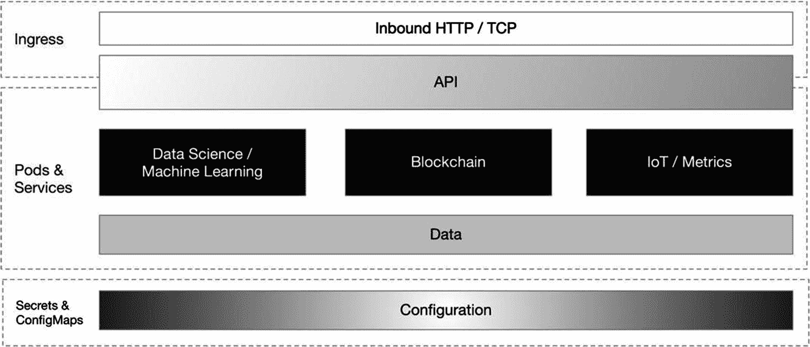

图 1-7

*物联网、* *区块链* *、Kubernetes* 中的 *机器学习*

 *### 物联网

物联网(IoT)和更新的工业物联网(IIoT)是已经过了炒作阶段的成熟技术。一个行业的物理设备不仅要通过互联网连接和控制，还要与更大的数据平台有更密切的关系。Kubernetes 能够管理物联网各个方面的数据和控制面板。这本书重点介绍了 Kubernetes 在物联网领域的三种主要用途，包括数据摄取、作为边缘网关，甚至是操作系统(图 [1-8](#Fig8) )。

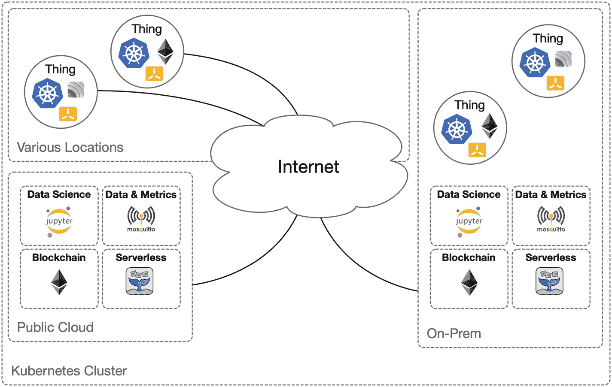

图 1-8

Kubernetes 平台在物联网中的三种用途

#### 数据摄取

Kubernetes 的第一个也是最明显的用途是编排一个数据接收平台。物联网设备有可能产生大量指标。收集指标只是问题的一部分。将指标收集、转换和处理成有价值的数据并对这些数据执行操作需要一个复杂的数据流水线。物联网设备利用广泛的通信协议，针对特定设备和协议构建的各种软件产品提供不同质量的支持。为了有效地支持来自一系列物联网和 IIoT 设备的数据，该平台需要使用 AMQP(高级消息队列协议)、MQTT(消息队列遥测传输)、CoAP(受限应用协议)、原始 TCP 和 HTTP 等协议。

HTTP 上的 JSON (JavaScript Object Notation)是互联网上最受欢迎和支持的消息传递协议。每一种重要的编程语言都支持 JSON。JSON 以这样或那样的方式驱动了几乎所有的公共云 API。Kubernetes 自己的 API 是基于 JSON 的，而 JSON 的超集 YAML 是声明期望状态的首选方法。

JSON 可能不像二进制消息那样高效，也不像 XML 那样具有描述性；然而，将所有入站消息转换成 JSON 允许平台在当今最灵活和可移植的标准上统一数据接收。该平台由实现各种协议的定制微服务组成，解析入站消息或查询和抓取远程源，并将这些消息转换为 JSON。HTTP 收集服务接受 JSON 转换的数据进行缓冲和批处理。这种架构(图 [1-9](#Fig9) )允许无限制的水平扩展，容纳大量数据。

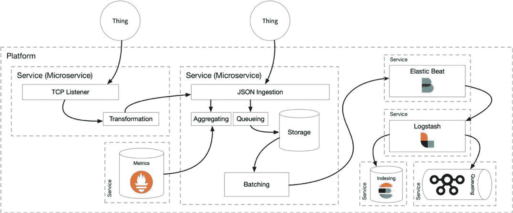

图 1-9

物联网数据摄取

章节*“Pipeline”*涵盖了摄取和转换服务的实现:Apache NiFi、Prometheus、Logstash、Elasticsearch 和 Kafka。

#### 边缘网关

物联网领域的 Kubernetes 开始包括内部部署和边缘部署。这些是小型集群，通常只包含一个节点。本地集群通常运行较大平台的缩小版本，通常负责与局域网上的物联网设备进行通信，或者节点本身连接到专有硬件和协议、传统控制系统或较低层的串行通信接口。数据收集的工业用例通常包括设备传感器的亚秒级采样，或者仅仅是对分类、异常检测或聚合有用的大量数据。

内部平台(图 [1-10](#Fig10) )可以处理指标的初始收集和处理，并将结果反馈给更大的数据处理平台。新的 Kubernetes 发行版，如 Minikube、Microk8s、k3s 和 KubeEdge，专门研究商用硬件上的小型或单节点实现。

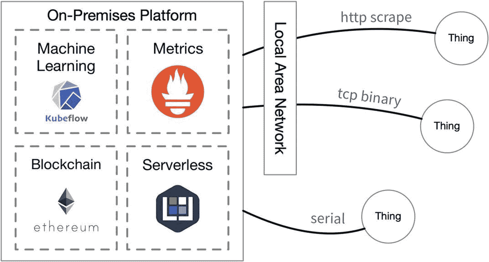

图 1-10

内部 Kubernetes 平台

在内部运行缩减的平台解决了许多数据处理的安全性和合规性问题。在数据必须按照严格的合规性规则保留在本地的情况下，本地集群可以处理数据，其产生的元数据、推断和指标聚合可以传输到远程平台，以进行进一步的处理、分析或操作。

#### 伊托勒斯

本书中提到的 Kubernetes 对于物联网的第三种用途才刚刚开始生根发芽，即 Kubernetes 作为物联网操作系统(图 [1-11](#Fig11) )。ARM 处理器既便宜又节能。像 Raspberry Pi 这样的产品使它们在业余爱好者、教育和商业原型制作中非常受欢迎。对基于 ARM 的系统的容器支持已经存在了几年，在物联网设备上运行容器化的应用几乎拥有在更强大和更复杂的硬件上运行它们的所有优势。运行 Kubernetes 编排的容器的物联网设备可以利用滚动更新等功能来消除升级应用时的停机时间。在物联网设备上运行 Kubernetes 中的一个小型容器集合，可以让您利用微服务应用架构、资源分配、监控和自修复。小型低功耗设备的软件开发曾经需要使用专有操作系统，并编写大量代码来支持固件更新、崩溃报告和资源分配等活动。随着越来越多的开发人员开始看到物联网软件通过 Kubernetes 等平台解决许多常见挑战的潜力，支持缩小版 Kubernetes 的物联网设备仍然是新的，并有望增长。

像 40mb k3s 这样的精简发行版使 Kubernetes 成为当今市场上 Raspberry Pi 和大型 SOC 板家族等资源有限的小型设备的绝佳选择。

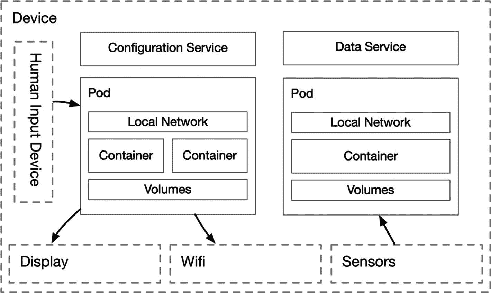

图 1-11

物联网设备上的 Kubernetes 平台

### 区块链

随着智能合约的成熟， [4](#Fn4) 区块链技术现在已经是一类平台 [5](#Fn5) 本身。智能合约允许在区块链的分布式、不可变账本内存储和执行代码(参见第 [9](09.html) 和 [10](10.html) 章)。区块链技术的引入为平台提供了与不可信参与者进行交易通信的能力。在这个上下文中，不可信意味着不需要个人或法律契约信任来传输以数据表示的值。区块链提供了交易的永久记录，在共享的账本中进行验证。外部各方只需要操作能够执行共享数学算法的区块链节点。对交易完整性的信任来自更广泛的节点网络的一致验证。描述区块链的深入概念、哲学和技术细节超出了本书的范围。

#### 私人管理的区块链

区块链技术是一个分布式的节点网络，在封闭的系统中，区块链的用例非常少。然而，私有或受保护区块链的概念是该平台的焦点，它代表了参与受管网络的基本能力。

该平台在其选定的节点网络中提供第三方参与者的分配和引导(图 [1-12](#Fig12) )。私人区块链并不意味着超出允许参与的信任程度。在封闭系统中，这种信任是一种方式。传统平台允许第三方创建账户并使用系统。然而，第三方也必须信任平台运营商。我们相信谷歌不会编辑和修改我们收到的电子邮件；我们相信 Twitter 不会代表我们发微博。区块链参与者依赖于大多数参与者来验证交易，而不是中央权威机构。有了区块链技术，平台只负责参与者的平等参与和管理。将区块链技术直接整合到平台中，使其处于与其他服务的统一通信网络之下，并随着其概念和功能的快速成熟，促进了该技术的管理和配置。“平台化区块链”一章描述了实现的技术细节。

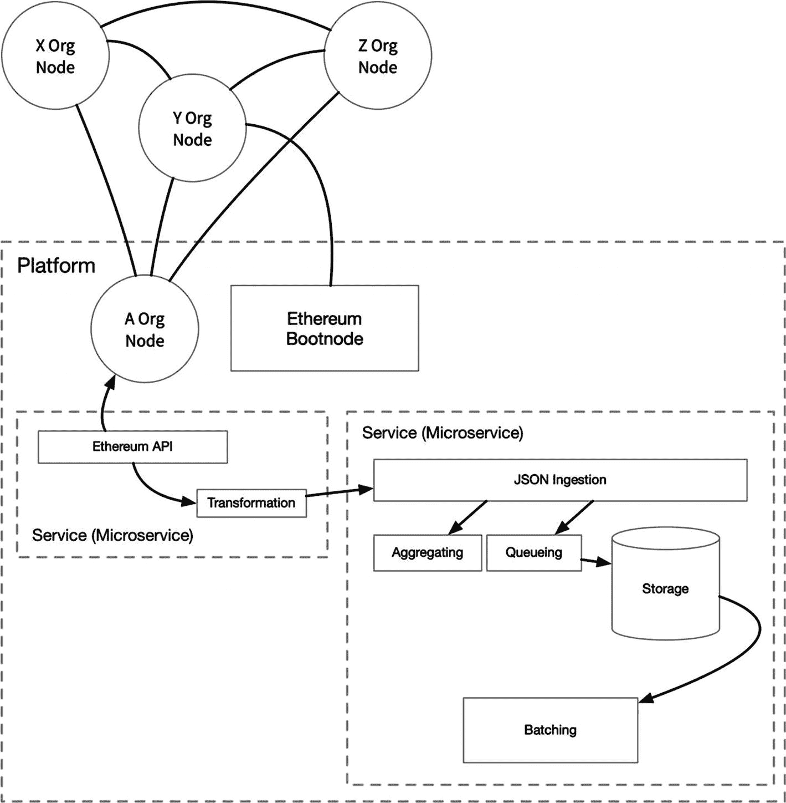

图 1-12

区块链引导和区块链交易的摄取

#### 用例

包括金融、供应链、物流、制造、流程合规性等在内的垂直行业都在寻找区块链功能提供的解决方案，尤其是围绕智能合同的执行。智能合同是位于区块链中的不可变代码块，可以由连接的区块链节点网络中的任何人执行，只要能够满足合同界面的标准。与智能合同和智能合同的执行相关的流式交易事件提供了除记录第三方的主动意图之外的大量机会；它们可以交流物联网设备的状态，或者从机器学习中得出的人工智能的自动化结果。X 公司可以验证 Z 公司发送了数据，而 Z 公司可以验证平台处理了数据并向 X 公司提供了结果，同时其他实体可以执行与此活动相关的智能合同(图 [1-13](#Fig13) )。该平台不仅有助于访问这种不可信的网络，而且通过流式实时数据队列与之交互。该平台可以对交易进行索引，并提供对交易类型、频率和价值的深入分析。

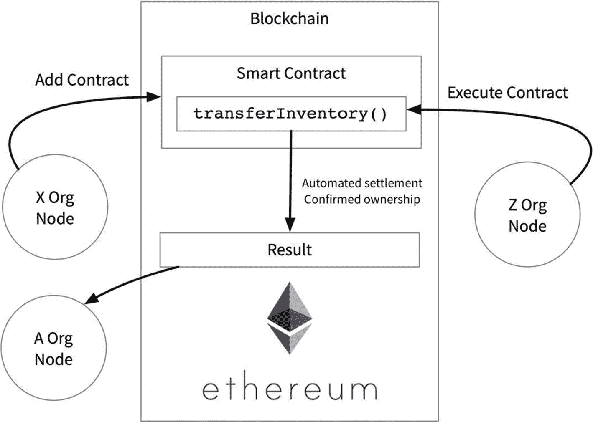

图 1-13

区块链智能合约的添加、执行和观察

以太坊和 Hyperledger 是支持智能合约的私有/许可区块链的流行选择。Hyperledger 是专门为区块链私营企业设计的，不包含货币功能。尽管该平台的企业用例不太可能需要区块链货币，但这也不是一种威慑。本书中的平台使用以太坊，使其功能与公共或私人区块链兼容，无论是否需要货币。该平台不局限于以太坊，可以轻松扩展到支持 Hyperledger 或区块链的最新趋势。

“区块链”一章涵盖了以太坊节点在平台中的实现，并提供了与平台数据层互连的示例。

### 机器学习

根据 Gartner 的说法，机器学习，特别是深度学习，是另一个接近或处于巅峰状态的技术领域。包括 Google、IBM、AWS 和 Azure 在内的所有主要超级云提供商要么提供具有 TensorFlow、PyTorch、Keras 的服务包装版本的平台，要么提供他们内部开发的机器学习开发和生产自动化工具。主要的云提供商对这种炒作反应迅速，但这种反应也表明该技术已经成熟到了商品化的程度。商品技术可能已经失去了一点它的新颖性和兴奋性，但是如果它熬过了最初的阶段，那么它就可以投入商业使用了。对于机器学习，我们可能处于期望的冰山一角，但它能够也确实解决了当今的行业问题，因此它的能力属于平台，并暴露于其连接的数据。

为 Kubeflow 提供一个简单的服务包装，加上一些有限的定制配置，就足以称之为数据科学平台了。Kubeflow 即服务本身就是超级云的有力竞争对手。包装 Kubeflow 将花费不到一章的时间来描述，更重要的是，它错过了区块链和物联网数据的相邻功能的组合能力，所有这些都位于核心组件之上，将在下一节中讨论。

行业希望从实时数据中获得实时答案。数据科学需要静态数据以及执行可重复实验和从已知数量中学习的能力。机器学习是数据科学的一个应用，机器在固定的数据集上学习得最好。该平台通过提供对持久数据的访问以及对数据子集进行标记和快照的能力来提供这两种功能，以形成经过训练的神经网络模型，然后可以立即部署这些模型并针对实时数据流进行尝试(图 [1-14](#Fig14) )。当数据科学实验室的技术生态系统与企业的生产问题格格不入时，迭代实验的成本很高。Kubeflow 和其他云原生技术有助于将这些环境更紧密地结合在一起，降低与实验相关的成本和风险。风险的降低为实验和测试机器学习和人工智能的新理论或方法带来了新的机会。

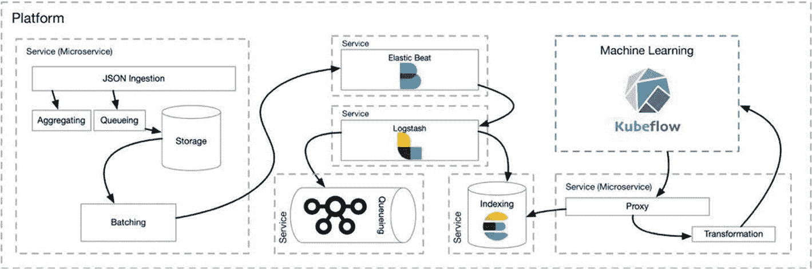

图 1-14

机器学习的高速数据流水线

#### 自动化和管理

有了像 Keras 或 PyTorch 这样的软件框架，您现在可以用几十行代码轻松地配置一个简单但可训练的神经网络。整个机器学习生命周期(图 [1-15](#Fig15) )需要的不仅仅是几个移动部分，从数据访问、转换和实验到训练模型的部署。与 Kubernetes 兼容的解决方案，如 Apache Airflow 和 Kubeflow，正在自动化领域取得巨大进步。这本书主要关注 Kubeflow 作为数据科学子平台的几个组件。Kubeflow 来自谷歌的内部解决方案，用于自动使用 TensorFlow，这是一个流行的机器学习框架，也是由谷歌和开源开发的。“In-Platform CI/CD”、“Indexing and Analytics”和“Platforming AIML”等章节探讨了为 Kuberflow 提供支持的一些技术，包括 JupyterLab、JupyterHub、MLflow 和 Seldon Core。

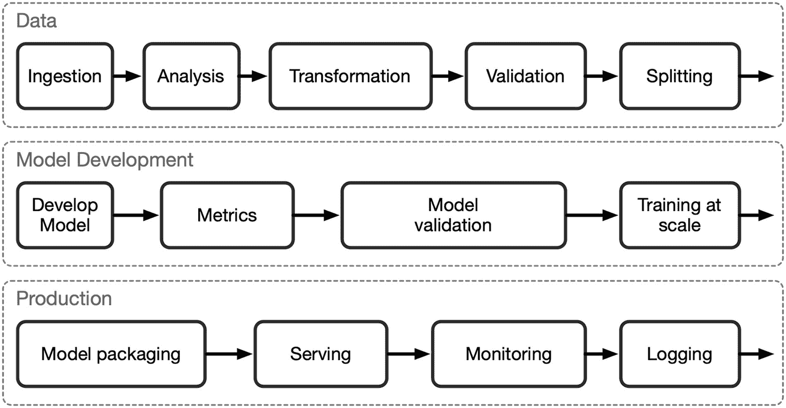

图 1-15

库伯弗洛过程

## 核心组件

以下部分涵盖了您可能永远不会在 Gartner 的宣传图表上看到的平台组件。然而，这些核心组件形成了将平台结合在一起的基本粘合剂。这些组件包括配置、入口、数据管理、指标、API 和协议。

容器、配置、入口、数据管理和指标收集是构成平台核心基础设施的核心组件，将在后面讨论。下面简要回顾了它们的用途、它们解决的问题以及它们在将专门的应用结合在一起时的作用。实现物联网、机器学习、区块链和未来创新趋势的潜力只有在整合到一个可以结合他们专注的专业知识的平台时才能得到放大。跨新领域解决问题，利用其特定解决方案的组合效应-例如，利用通过深度学习从物联网设备收集的指标开发的模型驱动的人工智能，这些设备在区块链上执行智能合同，其结果传达其他物联网设备运行状态的变化。独立于区块链和物联网技术发展起来的机器学习当然不依赖于其中任何一个。各种各样的语言被用来开发这些技术，每种语言都有不同的依赖关系。然而，不费吹灰之力，它们都可以在容器中运行，并以可靠性和无限规模得到证明的协议进行通信，因为它们扩展了互联网本身。TCP/IP、HTTP 和 DNS 是互联网的底层协议，在 Kubernetes 中，它们是通信和服务发现的方法。容器之间的这种关系来自容器 API 和它的编排器 Kubernetes。Kubernetes 使容器的配置、缩放和维护变得简单而优雅。因此，Kubernetes 本身以及容器构成了平台的主要核心组件。如果您正在阅读一本关于高级平台开发的书，您可能已经对容器的优势以及 Kubernetes 提供的许多支持对象有了深刻的理解，包括强大的 ConfigMap 和 Secret。

### 配置

两种形式的配置构成了平台:平台本身的配置，一组以 YAML 文件表示的 Kubernetes 对象，以及平台内各种应用的配置。这本书使用`kubectl`工具来配置 Kubernetes。`kubectl`实用程序提供了三种对象管理:命令性命令、命令性对象配置和声明性对象配置。这本书主要依靠声明性对象配置，通过在一系列 YAML 文件中描述期望的状态，并使用`kubectl`来应用它们。“开发环境”一章介绍了组织和维护 Kubernetes 配置清单的方法，这是保持您的平台配置有组织和有文档记录的一个重要方面。

这里关注的是平台内各个应用的配置，这也是为什么配置被视为核心组件的原因。Kubernetes 提供了对象类型 ConfigMap 和 Secret，为应用配置提供了丰富的选项。

#### 应用参数

容器几乎可以包装任何应用，配置应用的三种最常见方式包括命令行参数、配置文件、环境变量以及三者的组合。如果您曾经使用过 Docker 或 Kubernetes，那么指定一长串配置应用执行所需的参数，或者填充一系列环境变量，或者挂载一个配置目录，这种情况并不少见。有了这三种配置方法，几乎任何应用都可以进行配置，并有一个标准的方法来管理平台所有组件的配置。这是平台核心基础设施的重要组成部分。

ConfigMaps 和 Secrets 是 Kubernetes 提供的配置对象类型；它们在整个集群中是持久的和可用的。配置映射和秘密的键/值对可以作为 Pod 内的文件系统安装，键是文件名，值是数据，其安装点由 Pod 中的一个或多个容器共享。ConfigMaps 和 Secrets 可以填充容器中的环境变量，或者填充容器应用执行中使用的命令行参数。

关于基础设施的“开发环境”一章更详细地介绍了配置映射和秘密的管理和组织，如果您有使用 Kubernetes 的经验，您可能会非常熟悉它们的使用。这里的目的是更清楚地定义它们作为平台核心基础设施组件的价值。

### 进入

入口被定义为“进入的行为”,是接受平台入站数据的基本概念。然而，入口是框架中最关键的组件之一。入口负责提供一种通过传输层安全(TLS)等协议保护入站通信的方法，根据各种配置的规则将 HTTP 流量路由到各种服务。虽然与平台的大多数交互是通过 HTTP 协议进行的，包括来自外部系统或 web 和本机应用的 REST 风格 API 调用，但该平台还为特定物联网设备和协议的自定义入站 TCP 流量提供了监听器。在一些软件平台中，基础设施级别的入口是事后才想到的；大型整体式有状态应用通常假设与入站请求直接交互，并期望上面的入口层很薄。不幸的是，使用 Nginx 和 Envoy 等流行和有影响力的代理的这些更传统的方式经常无法利用它们在这个专门化中的优势，或者作为一种绕过实现需求的方法。

本书中描述的平台只是利用 Nginx 管理入口的皮毛。然而，它是一个核心组件，对于平台的网络和架构布局至关重要。Envoy 是反向代理支持的另一个新的流行选择，也是 Istio 的核心组件之一。本书描述的平台将使用 Nginx 进行公共 HTTP 入口。

### 数据管理

数据管理是企业平台的基本核心组件。平台必须在数据通过入口接受并通过 API 检索后对其进行管理。平台的数据管理层也是沟通各种处理器结果的必要手段。原始数据以来自物联网设备的指标、区块链交易的结果以及通过 HTTP APIs 和 TCP 端口的通信的形式进入平台。这些数据被检索和处理，以形成新的区块链交易，向物联网设备发送命令，并形成从机器学习模型中导出的预测；其结果成为新的数据，在这个递归的生态系统中传播并不断改进。

该平台可以利用同类最佳的技术来进行消息队列、索引和指标聚合，方法是采用现代的、成熟的开源技术，包括 Apache Kafka、Elasticsearch 和 Prometheus。在“流水线”和“索引和分析”两章中，我们将分别介绍这些技术的实现从软件平台的角度来看，核心组件是包装所有专用功能的底层基础设施。该平台的目的不仅仅是服务包装技术，如 Apache Kafka 或 Elasticsearch，以获得外部平台功能。将这些技术集成到平台基础设施中，通过 Kubernetes 提供了标准化管理功能的优势，但通过它们的深度集成简化了通信和可观察性。这些技术形成了更高级别的栈基础设施，并通过自定义中介提供其功能，通过规范化对结果数据的访问，连接物联网数据、机器学习和区块链的专业应用。

### 韵律学

不缺少愿意收集您的指标的托管 PaaS 产品，它们为开发报告、业务分析和智能提供 API 和漂亮的仪表板。聚合、分类和组织指标是一项大业务，感谢开源社区和 SoundCloud，我们有了 Prometheus 这个免费的开源解决方案。SoundCloud 在 2015 年开发并开源了 Prometheus，之后在 2016 年成为继 Kubernetes 之后的第二个云原生计算基金会孵化项目。Prometheus 现在是云原生计算基金会的研究生项目，正在积极开发。

当 SoundCloud 确定 StatsD 和 Graphite 等解决方案无法满足他们的需求时，他们开发了 Prometheus。Prometheus 是一个高性能指标聚合器，将实时指标记录到时间序列数据库中。Prometheus 不仅可以根据我们未来的需求进行扩展，还拥有一种健壮灵活的查询语言。本书中的平台利用 Grafana 构建视觉上令人惊叹的仪表盘，查询我们由 Prometheus 收集的指标。

Prometheus 从应用中抓取指标，并在 Ruby 上提供 Go、Java 和 Python 的官方和成熟客户端库，以及 Bash、C++、Common Lisp、Elixir、Erlang、Haskell、Lua、.Net，C#，Node.js，Perl，PHP，Rust。这个 SDK 集合意味着您可以向几乎任何现代应用添加深度工具。客户端库编写得很好，并且易于实现。Prometheus 在该平台的数据流水线中形成了一个重要的分支，用于丰富的分析仪表盘，并允许区块链和机器学习功能不仅可以输入数据流，还可以对其做出反应。

## API 和协议

应用编程接口(或平台 API)提供与平台交互的外部访问。API 是一个宽泛的术语，可用于描述软件的一部分如何与另一部分通信，企业如何访问其数据，或者如何在内部或外部调用编程驱动的业务逻辑。后者，即外部访问，是平台 API 所关心的。这个平台的外部接口涉及数据的存储和检索、事件的记录、所需平台状态的配置、业务逻辑的调用以及平台功能的扩展。平台 API 支持构建针对特定垂直行业定制的基于 web 的本地应用，或者允许现有 IT 系统与其功能进行交互，或者报告数据和事件。该平台使用其 API 来执行提供帐户和用户所需的多种操作，为业务分析和智能解决方案提供数据，并提供前端用户界面来扩展和增加数据科学和机器学习的数据流水线。

本书中介绍的平台反映了许多现实世界的数据平台实现，是单片应用、微服务和(无服务器)功能的集合。平台的每个组件可能有不同的交互方法。Elasticsearch 使用 RESTful API 处理用户请求，并使用异步传输协议与其节点进行内部通信。与 Kafka 的通信是通过基于 TCP 的二进制协议执行的，此外还提供了一个 REST 代理。本书在“流水线”和“索引和分析”章节中涵盖了 Elasticsearch 和 Kafka 实现。在 API 开发的世界里，不缺少解决方案；像 gRPC 和 GraphQL 这样的新的和创新的协议正在变得成熟并获得关注，因为在新的开发中不太可能考虑像 SOAP 这样的旧思想。

本书中的平台在涉及配置的基本交互时采取了中间路线。REST，或者说表述性状态转移，是目前最流行的 API 实现，因为它非常简单，在互联网上无处不在，并且有很多工具和客户端可以使用它。REST 可能不像 gRPC 那样快速紧凑，也不像 GraphQL 那样灵活，但是 REST 除了 HTTP 和它的动词 POST、GET、PUT、PATCH 和 DELETE 之外，对它的客户机没有任何要求。该平台使用 JSON (JavaScript 对象符号)通过 REST 进行通信。REST 之所以能被广泛访问，主要是因为 HTTP 是唯一的需求，一个普遍建立的、成熟的、稳定的协议。

尽管该平台的核心 API 是 REST 的一个实现，通过 Ingress 公开的 HTTP 端点建立，但仍有机会开发定制的、低级别的 TCP 侦听器，并通过 gRPC 和 GraphQL 提供专门的服务。该平台不受实现任何特定 API 协议的限制或约束；在 Kubernetes 中构建平台使得添加额外的接口比以往更加容易。传统上，企业通常很难看到其端点之外的 API，这通常表现为单片应用演变为 API 和底层数据之间高度耦合的大型且笨拙的集合。虽然有可能在 Kubernetes 中开发一个传统的单片系统，但是您可能会设计出一个反模式，并且不能充分利用 Kubernetes 的最佳特性之一，服务。Kubernetes 服务可能由一系列单片和微型应用架构支持。

关于平台 API 架构，Kubernetes 服务与面向对象设计(OOD)中的类的概念进行了比较，尽管这是一个牵强的类比。在微服务架构的世界中，已经有很多思想和理论投入到服务的描述和组织中，这已经超出了本书的范围，但是将服务视为提供对相应动词的访问的名词是平台设计的良好起点。Kubernetes 服务是所有 API 调用、JSON-REST、gRPC、GraphQL、基于二进制或文本的 TCP 和 UDP 的持久网关。事实上，任何可以监听分配给 IP 地址的端口的东西都可以是服务的端点，无论是平台内部还是外部。该平台围绕 Kubernetes 服务进行设计。

## 摘要

这本书的目的是给你一些例子和灵感，让你利用 Kubernetes 开发高效的、引人注目的软件平台和分布式应用，这些例子结合了一系列技术的能力。本章定义了一种数据驱动的软件平台，旨在结合物联网技术、机器学习和区块链的功能。虽然对特定功能的需求来来去去，但该平台的核心组件以配置、入口、数据管理和指标为中心。这些核心能力形成了基本服务的框架，支持新技术及其与数据关系的无限组合。

基础设施通常是运营的唯一领域。随着近年来开发和运营之间的差距缩小，术语 DevOps 越来越流行。虽然一些组织将 DevOps 视为一个角色，但更准确的表述可能是由许多不同角色执行的一系列职责和任务。DevOps 包括硬件供应、服务器集群的安装和管理、配置管理、持续集成和持续部署等等。关于基础设施的下一章涵盖了基本核心组件所需的开发运维，以及平台的配置管理、集成、运营、监控和维护。

<aside aria-label="Footnotes" class="FootnoteSection" epub:type="footnotes">Footnotes [1](#Fn1_source)

IBM 将以 340 亿美元收购 Linux 顶级经销商 Red Hat。“纽约时报，2018 年 10 月 28 日，sec。生意。[T2`https://www.nytimes.com/2018/10/28/business/ibm-red-hat-cloudcomputing.html`](https://www.nytimes.com/2018/10/28/business/ibm-red-hat-cloudcomputing.html)

  [2](#Fn2_source)

沃克迈克。“新兴技术的炒作周期，2018 年。”高德纳。 [`https://www.gartner.com/en/documents/3885468/hype-cycle-for-emerging-technologies-2018`](https://www.gartner.com/en/documents/3885468/hype-cycle-for-emerging-technologies-2018) 。

  [3](#Fn3_source)

沃克迈克。“新兴技术的炒作周期，2018 年。”高德纳。 [`https://www.gartner.com/en/documents/3885468/hype-cycle-for-emerging-technologies-2018`](https://www.gartner.com/en/documents/3885468/hype-cycle-for-emerging-technologies-2018) 。

  [4](#Fn4_source)

[T2`https://en.wikipedia.org/wiki/Smart_contract`](https://en.wikipedia.org/wiki/Smart_contract)

  [5](#Fn5_source)

街区极客。“智能合约平台[深度调查]”，2018 年 5 月 11 日。 [`https://blockgeeks.com/guides/different-smart-contract-platforms/`](https://blockgeeks.com/guides/different-smart-contract-platforms/) 。

 </aside>*