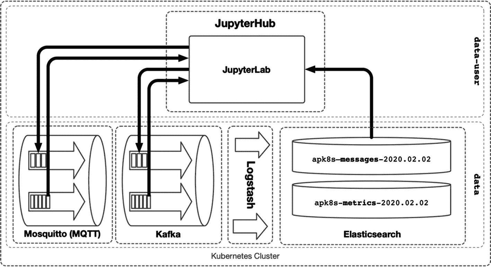

# 五、索引和分析

Kubernetes 的现代分布式数据平台远远超出了数据的收集、存储和传输。搜索、索引、分析和数据科学应用是以数据为中心的平台的基本要素。本章重点关注网络规模的 <sup>1</sup> 技术，这是一个在大数据主流关注之外成熟的生态系统。 <sup>2</sup> 在大数据假设有限数量的同时请求处理近乎无限的数据湖 <sup>3</sup> 的情况下，网络规模假设最终无限的同时数据需求。网络规模的分析和大数据正变得越来越紧密，并在组合能力方面快速发展。本章涵盖了为 web 级架构构建的一般数据索引、指标、分析和数据科学。下一章将介绍 Kubernetes 如何通过支持现代数据湖和数据仓库的发展来融入大数据环境。Kubernetes 构建健壮的分布式集群的能力带来了在这两个不同问题领域(web 级的大数据)的数据和控制面板之间架起桥梁的机会。

本章重点介绍了一些应用，这些应用涵盖了通信、索引和数据科学要求的一个通用而有效的范围。专注于特定问题领域的应用可能会受益于更高级别的技术；然而，一般搜索、分析和数据科学技术通常是开发集中数据驱动解决方案的多层方法的基础。

## 搜索和分析

数据以结构化、半结构化和非结构化的形式存在。非结构化数据包括各种数据类型，如映像、视频、音频、pdf 和原始文本。下一章将介绍如何开发数据湖来存储非结构化数据。然而，本章关注的是由 Elasticsearch 支持的半结构化、基于文档的数据，elastic search 是一种基于文档的数据索引，能够存储、检索和分析数十亿条记录。

## 数据科学环境

在“数据实验室”一节中，本章将数据收集、排队索引和分析操作结合到一个数据科学环境中。JupyterHub 被配置为提供 JupyterLab 实例(在第四章中介绍),以通过利用对 Kafka、Elasticsearch、Mosquitto 等的集群内访问来增强数据科学活动。

## 发展环境

前几章利用了来自低成本主机提供商 Vultr 和 Scaleway 的通用计算资源。本章通过选择 Hetzner 的折扣计算产品延续了这一趋势。Hetzner 是构建低成本开发和实验性 Kubernetes 集群的另一个绝佳选择。

本章中的 Kubernetes 集群利用了 Hetzner 的一个 CX21 (2 个 vCPU/8G RAM/40G SSD)和四个 CX41 (4 个 vCPU/16G RAM/160G SSD)实例。在写这篇文章的时候，Hetzner 的定价是每天不到 4 美元。

Note

Hetzner 上的 Ubuntu server 实例不包含某些包或内核模块`rbd`(Ceph 要求)所需的内核头。在每台 Hetzner 服务器上使用以下命令安装内核头文件并加载清单 6-1 中所示的`rbd`。

```
$ # install kernel headers
$ apt install -y linux-headers-$(uname -r)

$ # load the Ceph rbd kernel module
$ modprobe rbd

Listing 6-1Installing kernel headers and the rdb kernel module

```

本章中的自定义 Kubernetes 集群标记为`dev4`，按照第三章中的安装说明以及第五章中的清单进行设置。如果遵循上一章的内容，将清单从`cluster-apk8s-dev3`复制并应用到`cluster-apk8s-dev4`，如清单 6-2 所示。

```
.
└── cluster-apk8s-dev3
└── cluster-apk8s-dev4
    ├── 000-cluster
    │   ├── 00-ingress-nginx
    │   ├── 10-cert-manager
    │   ├── 20-rook-ceph
    │   └── 30-monitoring
    └── 003-data
        ├── 000-namespace
        ├── 010-zookeeper
  ├── 020-kafka
        └── 050-mqtt

Listing 6-2Development environment prerequisites

```

### TLS 证书

本章使用子域`kib`表示 Kibana，`auth`表示 Keycloak，`lab`表示 JupyterHub/JupyterLab。通过生成证书，确保 TLS Kubernetes Secret `data-production-tls`可供 ingress 使用。清单 6-3 列出了定义文件`cluster-apk8s-dev4/003-data/000-namespace/05-certs.yml`的示例证书管理器配置。

```
apiVersion: cert-manager.io/v1alpha2
kind: Certificate
metadata:
  name: data-cert
  namespace: data
spec:
  secretName: data-production-tls
  issuerRef:
    name: letsencrypt-production
    kind: ClusterIssuer
  commonName: data.dev4.apk8s.dev
  dnsNames:
    - data.dev4.apk8s.dev
    - auth.data.dev4.apk8s.dev
    - lab.data.dev4.apk8s.dev
    - kib.data.dev4.apk8s.dev

Listing 6-3cluster-apk8s-dev4 TLS Certificate

```

### 基本认证

创建一个包含基本身份验证凭证的 Kubernetes 秘密。稍后，Ingress Nginx 被配置为使用这个秘密来保护对 Kibana 的访问。

首先，使用`htpasswd` <sup>4</sup> 实用程序在名为`auth`的文件中创建一个用户名/密码组合。

```
$ cd cluster-apk8s-dev4/003-data/000-namespace
$ htpasswd -c auth sysop

```

使用 kubectl 命令`create secret`从按照 Ingress 的预期构建的`auth`文件中创建一个名为`sysop-basic-auth`的秘密。

```
$ kubectl create secret generic sysop-basic-auth \
   --from-file auth -n data

```

## 麋鹿

麋鹿栈 <sup>5</sup> 由 Elasticsearch、Logstash 和 Kibana 组成。ELK 是一个流行的应用套件，用于索引、搜索、路由、转换和可视化数据。Elasticsearch B.V .维护这个开源栈，并提供托管服务以及许多其他流行的开源和商业软件。

Note

Elasticsearch b . v .*Elastic License*对于包含 Elastic search 的平台即服务(PaaS)产品来说可能过于严格。亚马逊在 Apache 2.0 软件许可下(尽管有些争议 <sup>7</sup> )分叉了该项目并创建了用于弹性搜索 <sup>6</sup> 的*开放发行版。尽职调查是选择适合特定用例的发行版的一个要求。*

### 弹性搜索

Elasticsearch 是一个基于 Apache Lucene <sup>8</sup> 的数据索引器和分析引擎，它是一个专门为横向可伸缩性和高可用性而设计的分布式系统。Elasticsearch 接受任何形式的基于 JSON 的数据结构，这使得它非常适合与现代 web APIs 进行互操作。Elasticsearch 可以自动检测许多数据类型，但也可以提供自定义模板来断言需要转换的不明确字段的数据类型，例如表示为字符串或日期格式的数字。Elasticsearch 具有广泛的数据聚合和统计分析功能，可以将数据与其索引一起存储。尽管旨在数据索引和聚合，Elasticsearch 是一个有能力的 NoSQL 数据库。

本章设置了一个单节点 Elasticsearch 实例。Elasticsearch 的生产部署由多个节点组成，每个节点都致力于一个特定的任务:数据节点存储、索引和查询数据；主节点更新集群状态；客户端节点采用负载均衡器的形式，执行索引和搜索。

Note

Elasticsearch 的官方维护者 Elasticsearch B.V .开发了一个解决方案，他们称之为“Kubernetes 上的弹性云， <sup>9</sup> ”，实现了安装和管理 Elasticsearch 集群的 Kubernetes 操作模式。考虑将此解决方案用于生产实施。

创建目录`cluster-apk8s-dev4/003-data/030-elasticsearch`。在新的`030-elasticsearch`目录中，从清单 6-4 中创建一个名为`10-service.yml`的文件。

```
apiVersion: v1
kind: Service
metadata:
  namespace: data
  name: elasticsearch
spec:
  type: ClusterIP
  selector:
    app: elasticsearch
  ports:
    - name: http-es
      port: 9200
      targetPort: http-es
      protocol: TCP

Listing 6-4Elasticsearch Service

```

应用弹性搜索服务配置:

```
$ kubectl apply -f 10-service.yml

```

接下来，在清单 6-5 中名为`40-statefulset.yml`的文件中为 Elasticsearch 创建一个 StatefulSet 配置。

```
apiVersion: apps/v1
kind: StatefulSet
metadata:
  name: elasticsearch
  namespace: data
  labels:
    app: elasticsearch
spec:
  serviceName: elasticsearch
  replicas: 1 # single-node cluster
  selector:
    matchLabels:
      app: elasticsearch
  template:
    metadata:
      labels:
        app: elasticsearch
    spec:
      initContainers:
        - name: init-sysctl
          image: busybox:1.27.2
          command: ["sysctl", "-w", "vm.max_map_count=262144"]
          securityContext:
            privileged: true
        - name: init-chown
          image: busybox:1.27.2
          command: ["/bin/sh"]
          args: ["-c", "chown -R 1000:1000 /usr/share/elasticsearch/data"]
          securityContext:
            privileged: true
          volumeMounts:
            - name: es-data
              mountPath: /usr/share/elasticsearch/data
      containers:
        - name: elasticsearch
          image: docker.elastic.co/elasticsearch/elasticsearch:7.1.1
          imagePullPolicy: IfNotPresent
          env:
          - name: "discovery.type"
            value: "single-node"
          - name: "cluster.name"
            value: "apk8s"
          - name: "transport.host"
            value: "127.0.0.1"
          - name: "ES_JAVA_OPTS"
            value: "-Xms512m -Xmx512m"
          - name: "http.host"
            value: "0.0.0.0"
          - name: "http.port"
            value: "9200"
          - name: "http.cors.allow-origin"
            value: "http://localhost:1358"
          - name: "http.cors.enabled"
            value: "true"
          - name: "http.cors.allow-headers"
            value: "X-Requested-With,X-Auth-Token,Content-Type,Content-Length,Authorization"
          - name: "http.cors.allow-credentials"
            value: "true"

          ports:
            - containerPort: 9200
              name: http-es
            - containerPort: 9300
              name: tcp-es
          volumeMounts:
            - name: es-data
              mountPath: /usr/share/elasticsearch/data
  volumeClaimTemplates:
    - metadata:
        name: es-data
      spec:
        storageClassName: rook-ceph-block
        accessModes: [ ReadWriteOnce ]
        resources:
          requests:
            storage: 50Gi

Listing 6-5Elasticsearch StatefulSet

```

应用弹性搜索状态集配置:

```
$ kubectl apply -f 40-statefulset.yml

```

使用`kubectl`将 Elasticsearch 服务移植到本地工作站。

```
$ kubectl port-forward elasticsearch-0 9200:9200 -n data

```

使用`curl`检查新的单节点 Elasticsearch 集群的健康状况。成功的安装会返回一个 JSON 对象，其状态键报告消息`green`。

```
$ curl http://localhost:9200/_cluster/health

```

Elasticsearch 被设计成分片 <sup>10</sup> 并跨大型节点集群复制数据。单节点开发集群只支持每个索引一个分片，并且不能复制数据，因为没有其他节点可用。使用`curl`，`POST`一个(JSON)模板到这个单节点集群，通知 Elasticsearch 用一个 shard 和零个副本配置任何新的索引。

```
$ cat <<EOF | curl -X POST \
-H "Content-Type: application/json" \
-d @- http://localhost:9200/_template/all
{
  "index_patterns": "*",
  "settings": {
    "number_of_shards": 1,
    "number_of_replicas": 0
  }
}
EOF

```

### logstash(日志记录)

Logstash 是弹性生态系统中的中心枢纽。“Logstash 是一个开源的服务器端数据处理流水线，它可以同时从多个来源获取数据，对其进行转换，然后将其发送到您最喜欢的‘stash’。” <sup>11</sup> 本书使用 Logstash 将数据注入到 Elasticsearch 中。将大量数据高速注入到弹性搜索中具有挑战性；然而，Logstash 缓冲数据并管理由索引过程引起的背压。Logstash 有一大套有用的输入插件，包括 Apache Kafka，本章稍后将利用这些插件将 Kafka 主题中的记录(事件/消息)索引到 Elasticsearch 中。

要运行本章中的示例，请确保 Apache Kafka 正在 Kubernetes 集群中运行。如有必要，查看第章至第章的 Kafka 安装说明。

创建目录`cluster-apk8s-dev4/003-data/032-logstash`。在新的`032-logstash`目录中，从清单 6-6 中创建一个名为`10-service.yml`的文件。

```
kind: Service
apiVersion: v1
metadata:
  name: logstash
  namespace: data
spec:
  selector:
    app: logstash
  ports:
  - protocol: TCP
    port: 5044
  type: ClusterIP

Listing 6-6Logstash Service

```

应用日志存储服务配置:

```
$ kubectl apply -f 10-service.yml

```

接下来，在清单 6-7 中的一个名为`30-configmap-config.yml`的文件中创建一个包含 Logstash 配置设置的 ConfigMap。要在资源受限的环境中限制内存使用(如本章中定义的开发集群)，请将 Java JVM -Xms512m 和-Xmx523m 设置配置为相对较小的值。

```
apiVersion: v1
kind: ConfigMap
metadata:
  name: logstash-config
  namespace: data
data:
  logstash.yml: |
    http.host: "0.0.0.0"
    xpack.monitoring.enabled: false

  pipelines.yml: |
    - pipeline.id: main
      path.config: "/usr/share/logstash/pipeline"
  log4j2.properties: |
    status = error
    name = LogstashPropertiesConfig

    appender.console.type = Console
    appender.console.name = plain_console
    appender.console.layout.type = PatternLayout
    appender.console.layout.pattern = [%d{ISO8601}][%-5p][%-25c] %m%n

    appender.json_console.type = Console
    appender.json_console.name = json_console
    appender.json_console.layout.type = JSONLayout
    appender.json_console.layout.compact = true
    appender.json_console.layout.eventEol = true

    rootLogger.level = ${sys:ls.log.level}
    rootLogger.appenderRef.console.ref = ${sys:ls.log.format}_console
  jvm.options: |
    ## JVM configuration

    -Xms512m
    -Xmx523m

    -XX:+UseParNewGC
    -XX:+UseConcMarkSweepGC
    -XX:CMSInitiatingOccupancyFraction=75
    -XX:+UseCMSInitiatingOccupancyOnly
    -Djava.awt.headless=true
    -Dfile.encoding=UTF-8
    -Djruby.compile.invokedynamic=true
    -Djruby.jit.threshold=0
    -XX:+HeapDumpOnOutOfMemoryError
    -Djava.security.egd=file:/dev/urandom

Listing 6-7Logstash configuration

ConfigMap

```

应用日志存储配置配置图:

```
$ kubectl apply -f 30-configmap-config.yml

```

Logstash 分三个阶段处理事件:输入、过滤和输出。清单 6-8 中的配置演示了使用 Kafka 输入插件来消费来自主题消息和指标的数据。输出配置检查 Kafka 主题是否存在，如果找到，则将数据从主题路由到以当前日期为前缀的相应索引中。


图 6-1

Kafka 到 Elasticsearch Logstash 流水线配置

在清单 6-8 中的一个名为`30-configmap-pipeline.yml`的文件中创建一个包含 Logstash 流水线设置的 ConfigMap。

```
apiVersion: v1
kind: ConfigMap
metadata:
  name: logstash-pipeline
  namespace: data
data:
  logstash.conf: |
    input {
      kafka {
        bootstrap_servers => "kafka-headless:9092"
        topics => [ "messages", "metrics"]
        auto_offset_reset => "latest"
        auto_commit_interval_ms => "500"
        enable_auto_commit => true
        codec => json
        decorate_events => true
      }
    }

    output {
      if [@metadata][kafka][topic] {
        elasticsearch {
            hosts => [ "elasticsearch:9200" ]
            index => "apk8s-%{[@metadata][kafka][topic]}-%{+YYYY.MM.dd}"
        }
      }
    }

Listing 6-8Logstash pipeline configuration ConfigMap

```

应用 Logstash 流水线配置配置图:

```
$ kubectl apply -f 30-configmap-pipeline.yml

```

最后，在清单 6-9 中的一个名为`40-deployment.yml`的文件中创建一个 Logstash 部署。

```
apiVersion: apps/v1
kind: Deployment
metadata:
  name: logstash
  namespace: data
  labels:
    app: logstash
spec:
  replicas: 1
  selector:
    matchLabels:
      app: logstash
  template:
    metadata:
      labels:
        app: logstash
    spec:
      containers:
      - name: logstash
        image: docker.elastic.co/logstash/logstash:7.1.1
        ports:
        - containerPort: 5044
        env:
        - name: ES_VERSION
          value: 7.1.1
        volumeMounts:
        - name: config-volume
          mountPath: /usr/share/logstash/config
        - name: logstash-pipeline-volume
          mountPath: /usr/share/logstash/pipeline
      volumes:

      - name: config-volume
        configMap:
          name: logstash-config
      - name: logstash-pipeline-volume
        configMap:
          name: logstash-pipeline

Listing 6-9Logstash Deployment

```

应用 Logstash 部署:

```
$ kubectl apply -f 40-deployment.yml

```

集群现在运行单个 Logstash 实例，可以通过按需增加副本来轻松扩展。从单个节点开始对早期调试很有用。

如前所述，Logstash 流水线接受来自 Kafka 主题消息和指标的 JSON 数据输入。输出配置指示 Logstash 根据主题名称和日期填充 Elasticsearch 索引。

Note

参见第五章，了解设置 Apache Kafka 和本章示例所需的`kafka-test-client` Pod 的说明。

通过向由`kafka-test-client`提供的`kafka-console-producer`脚本回显一个简单的 JSON 消息来测试新的 Logstash 流水线。

```
$ kubectl -n data exec -it kafka-test-client -- \
bash -c "echo '{\"usr\": 1, \"msg\": \"Hello ES\" }' | \
kafka-console-producer --broker-list kafka:9092 \
--topic messages"

```

使用`kubectl`将 Elasticsearch 服务移植到本地工作站。

```
$ kubectl port-forward elasticsearch-0 9200:9200 -n data

```

接下来，确保 Logstash 将 Kafka 主题消息中的数据事件正确地路由到正确的索引中。使用`curl`获取索引模式`apk8s-messages-*`的所有记录。以下命令从以`apk8s-messages-`开头的索引中返回所有记录:

```
$ curl http://localhost:9200/apk8s-messages-*/_search
Example response:
{
    "took": 1,
    "timed_out": false,
    "_shards": {
        "total": 1,
        "successful": 1,
        "skipped": 0,
        "failed": 0
    },
    "hits": {
        "total": {
            "value": 1,
            "relation": "eq"
        },
        "max_score": 1.0,
        "hits": [
            {
                "_index": "apk8s-messages-2020.03.02",
                "_type": "_doc",
                "_id": "IDn7mXABZUrIUU7qdxAr",
                "_score": 1.0,
                "_source": {
                    "@version": "1",
                    "usr": 1,
                    "@timestamp": "2020-03-02T06:42:38.545Z",
                    "msg": "Hello ES"
                }
            }
        ]
    }
}

```

在本章的前面，模板`all`被定义为匹配所有索引并设置默认分片和复制。可以添加额外的模板来定义特定索引或索引集上的字段的数据类型。然而，当没有模板匹配字段或索引时，Elasticsearch 会尽最大努力猜测数据类型。使用以下 curl 命令查看为新索引生成的默认映射:

```
$ curl http://localhost:9200/apk8s-messages-*/_mapping

```

对于在该集群中配置的 Elasticsearch 7.1.1，字段`user`接收数字赋值 *long* ，字段`msg`索引为*文本*。

Logstash 缓冲和管理来自弹性搜索索引操作的反压力的能力，在以非常高的速度消耗和处理大量数据的平台中可以发挥重要作用。即使在本章定义的小型集群中，Logstash 也可能将 <sup>12</sup> 扩展到十几个或更多的节点，每个节点都将数据消耗和缓冲到这个单一的 Elasticsearch 节点中。

### 巴拉人

Kibana 是 ELK 栈的前端组件，与 Elasticsearch 无缝集成，是调试、开发和可视化 Elasticsearch 数据的优秀工具。然而，Kibana 也仅限于与 Elasticsearch 合作。现代分析、可视化和仪表板通常需要收集、处理和可视化来自各种提供商的数据。利用 Kibana 作为 Elasticsearch 的内部开发和调试工具，同时使用更通用的解决方案进行跨平台的可视化和分析，这种情况并不少见。

创建目录`cluster-apk8s-dev4/003-data/034-kibana`。在新的`034-kibana`目录中，从清单 6-10 中创建一个名为`10-service.yml`的文件。

```
apiVersion: v1
kind: Service
metadata:
  name: kibana
  namespace: data
  labels:
    app: kibana
spec:
  selector:
    app: kibana
  ports:
    - protocol: "TCP"
      port: 80
      targetPort: 5601
  type: ClusterIP

Listing 6-10Kibana Service

```

应用 Kibana 服务:

```
$ kubectl apply -f 10-service.yml

```

接下来，在清单 6-11 中的一个名为`20-configmap.yml`的文件中创建一个包含 Kibana 配置设置的 ConfigMap。

```
apiVersion: v1
kind: ConfigMap
metadata:
  name: kibana
  namespace: data
  labels:
    app: kibana
data:
  kibana.yml: |-
    server.name: kib.data.dev4.apk8s.dev
    server.host: "0"
    elasticsearch.hosts: http://elasticsearch:9200

Listing 6-11Kibana configuration ConfigMap

```

应用基巴纳配置图:

```
$ kubectl apply -f 20-configmap.yml

```

接下来，在清单 6-12 中的一个名为`30-deployment.yml`的文件中创建一个 Kibana 部署。

```
apiVersion: apps/v1
kind: Deployment
metadata:
  name: kibana
  namespace: data
  labels:
    app: kibana
spec:
  replicas: 1
  revisionHistoryLimit: 1
  selector:
    matchLabels:
      app: kibana
  template:
    metadata:
      labels:
        app: kibana
    spec:
      volumes:
        - name: kibana-config-volume
          configMap:
            name: kibana
      containers:
        - name: kibana
          image: docker.elastic.co/kibana/kibana-oss:7.1.1
          imagePullPolicy: IfNotPresent
          volumeMounts:
            - name: kibana-config-volume
              mountPath: /usr/share/kibana/config
          env:
            - name: CLUSTER_NAME
              value: apk8s
          ports:
            - name: http
              containerPort: 5601

Listing 6-12Kibana Deployment

```

应用 Kibana 部署:

```
$ kubectl apply -f 30-deployment.yml

```

接下来，在清单 6-13 中的一个名为`50-ingress.yml`的文件中为 Kibana 创建一个入口。

```
apiVersion: networking.k8s.io/v1beta1
kind: Ingress
metadata:
  name: kibana
  namespace: data
  labels:
    app: kibana
  annotations:
    nginx.ingress.kubernetes.io/auth-type: basic
    nginx.ingress.kubernetes.io/auth-secret: sysop-basic-auth
    nginx.ingress.kubernetes.io/auth-realm: "Authentication Required"
spec:
  rules:
    - host: kib.data.dev4.apk8s.dev
      http:
        paths:
          - backend:
              serviceName: kibana
              servicePort: 5601
            path: /
  tls:
    - hosts:
        - kib.data.dev4.apk8s.dev
      secretName: data-production-tls

Listing 6-13Kibana Ingress

```

应用基巴纳入口:

```
$ kubectl apply -f 50-ingress.yml

```

下面的 ingress 在 [`https://kib.data.dev4.apk8s.dev`](https://kib.data.dev4.apk8s.dev) 将 Kibana 公开，并使用基本 Auth 进行安全保护。秘密`sysop-basic-auth`包含基本认证的用户名和密码。

如果继续，新的 Elasticsearch 实例只包含一条记录。本章的其余部分将演示如何配置 JupyterLab 环境，该环境能够与本章中配置的 Elasticsearch 和前面配置的 Kafka 进行数据通信。

## 数据实验室

本章和上一章介绍了数据驱动平台的基本功能，包括 Kafka 的事件流、Mosquitto 的物联网消息代理、数据路由以及通过 Elasticsearch 在 Logstash 和持久索引数据中的转换。本章的剩余部分将创建一个用户提供的数据实验室，直接连接到集群中的这些系统，如图 6-2 所示。

JupyterLab 在第四章中首次介绍，它带来了一套健壮且可扩展的数据科学功能以及一个命令行终端。在集群中运行 JupyterLab 为传统的数据科学、分析和实验创建了一个非常高效的环境，并通过与 Kubernetes API 更紧密的交互提供了开发和运营的机会。

以下部分演示了允许 JupyterLab 访问 Kubernetes 资源的 Kubernetes 名称空间、示例 RBAC 和 ServiceAccount 权限的设置。JupyterHub <sup>13</sup> 被配置为提供 JupyterLab 环境，针对 Keycloak 进行身份验证。



图 6-2

名称空间中的 JupyterLab

### 凯克洛克

Keycloak <sup>14</sup> 是由红帽赞助的免费开源身份和访问管理应用。Keycloak 提供了创建和管理用户帐户的能力，或者连接到现有的 LDAP 或 Active Directory。第三方应用可以通过 OpenID Connect、OAuth 2.0 和 SAML 2.0 对用户进行身份验证。

Keycloak 为身份管理和第三方认证提供了一个交钥匙解决方案，非常适合本书中描述的数据平台的要求。以下部分实现了一个单节点 Keycloak 实例，本章稍后将使用该实例在为用户提供 JupyterLab 实例之前对用户进行身份验证。

创建目录`cluster-apk8s-dev4/003-data/005-keycloak`。在新的`005-keycloak`目录中，从清单 6-14 中创建一个名为`10-service.yml`的文件。

```
apiVersion: v1
kind: Service
metadata:
  name: web-keycloak
  namespace: data
spec:
  selector:
    app: web-keycloak
  ports:
    - name: http-web
      protocol: "TCP"
      port: 8080
      targetPort: http-web
  type: ClusterIP

Listing 6-14Keycloak Web Service

```

应用 Keycloak Web 服务:

```
$ kubectl apply -f 10-service.yml

```

接下来，在清单 6-15 中的一个名为`15-secret.yml`的文件中创建一个包含 Keycloak 管理员凭证的秘密。

```
apiVersion: v1
kind: Secret
metadata:
  name: keycloak
  namespace: data
  labels:
    app: keycloak
type: Opaque
stringData:
  keycloak_user: "sysop"
  keycloak_password: "verystrongpassword"
  keystore_password: "anotherverystrongpassword"

Listing 6-15Keycloak administrator and keystore credentials

```

应用密钥锁密码:

```
$ kubectl apply -f 10-service.yml

```

接下来，在清单 6-16 中的一个名为`30-deployment.yml`的文件中创建一个 Keycloak 部署。

```
apiVersion: apps/v1
kind: StatefulSet
metadata:
  name: web-keycloak
  namespace: data
spec:
  serviceName: web-keycloak
  replicas: 1
  revisionHistoryLimit: 1
  selector:
    matchLabels:
      app: web-keycloak
  template:
    metadata:
      labels:
        app: web-keycloak
    spec:
      initContainers:
        - name: keycloak-init-chown
          image: alpine:3.10.1
          imagePullPolicy: IfNotPresent
          volumeMounts:
            - name: keycloak-db
              mountPath: /data
          command: ["chown"]
          args: ["-R","1000:1000","/data"]
      containers:
      - name: web-keycloak
        image: jboss/keycloak:6.0.1
        imagePullPolicy: IfNotPresent
        env:

          - name: PROXY_ADDRESS_FORWARDING
            value: "true"
          - name: KEYCLOAK_HOSTNAME
            value: "auth.data.dev4.apk8s.dev"
          - name: KEYCLOAK_USER
            valueFrom:
              secretKeyRef:
                name: keycloak
                key: keycloak_user
          - name: KEYCLOAK_PASSWORD
            valueFrom:
              secretKeyRef:
                name: keycloak
                key: keycloak_password
          - name: KEYSTORE_PASSWORD
            valueFrom:
              secretKeyRef:
                name: keycloak
                key: keystore_password
        ports:
          - name: http-web
            containerPort: 8080
        volumeMounts:
          - name: keycloak-db
            mountPath: /opt/jboss/keycloak/standalone/data
  volumeClaimTemplates:
    - metadata:
        name: keycloak-db
      spec:
        storageClassName: rook-ceph-block
        accessModes: [ ReadWriteOnce ]
        resources:
          requests:
            storage: 5Gi

Listing 6-16Keycloak deployment

```

应用键盘锁部署:

```
$ kubectl apply -f 30-deployment.yml

```

最后，在清单 6-17 中的一个名为`50-ingress.yml`的文件中为 Keycloak 创建一个入口。

```
apiVersion: networking.k8s.io/v1beta1
kind: Ingress
metadata:
  name: web-auth
  namespace: data
  labels:
    app: web-auth
spec:
  rules:
  - host: auth.data.dev4.apk8s.dev
    http:
      paths:
      - backend:
          serviceName: web-keycloak
          servicePort: 8080
        path: /
  tls:
  - hosts:
    - auth.data.dev4.apk8s.dev
    secretName: data-production-tls

Listing 6-17Keycloak Ingress

```

应用钥匙锁入口:

```
$ kubectl apply -f 50-ingress.yml

```

#### 领域、客户机和用户

Keycloak 通过领域的配置为多个租户提供身份管理和身份验证。 <sup>15</sup> JupyterHub 在本章稍后配置为使用属于领域`datalab`的 Oauth2、 <sup>16</sup> 对用户进行身份验证。与一个领域相关联的 Keycloak 客户端向诸如 JupyterHub 之类的应用授予访问权限，以便对用户进行身份验证。本节将设置一个领域、客户机和用户，以便在本章后面提供 JupyterLab 服务器。

使用网络浏览器，按照上一节中的设置访问新入口 [`https://auth.data.dev4.apk8s.dev/auth/`](https://auth.data.dev4.apk8s.dev/auth/) 。使用清单 6-15 中定义的`sysop`凭证登录到 Keycloak。登录后，master 是用户界面左上角显示的默认领域，如图 6-3 所示。通过单击领域标题右侧的下拉菜单打开“添加领域”菜单，并创建新的领域 datalab。


图 6-3

添加领域

接下来，在新的 Datalab 领域的左侧导航中导航到客户端。点击“创建”并填写“添加客户端”表单，添加一个名为 datalab 的新客户端，如图 6-4 所示。


图 6-4

添加客户端

添加新的 datalab 客户端后，点击 Credentials 选项卡，检索生成的秘密，如图 6-5 所示。后来，JupyterHub 被配置为使用客户端 ID datalab 和生成的机密来获得根据 Keycloak datalab 领域对用户进行身份验证的权限。


图 6-5

客户端凭据

通过在上将授权启用切换到*来配置新的 datalab 客户端(在设置选项卡下)。提供有效的重定向 URIs，在本例中， [`https://lab.data.dev4.apk8s.dev/hub/oauth_callback`](https://lab.data.dev4.apk8s.dev/hub/oauth_callback) 稍后在" JupyterHub "一节中定义。复习图 6-6 。*


图 6-6

客户端配置

最后，通过在左侧菜单的 Manage 部分下选择 users，在 datalab 领域中创建一个或多个用户。添加用户后，在“凭据”选项卡下分配密码。使用强密码；分配给该领域的任何用户以后都可以访问 JupyterLab 环境，有权在集群中读写数据和执行代码。

### 命名空间

大多数 Kubernetes 对象都与一个名称空间相关联，包括 pod、部署、状态集、作业、入口、服务等等，换句话说:“一个*名称空间*为多个*种类的*资源定义了一个逻辑命名的组。” <sup>17</sup> 名称空间不仅有助于组织已配置的对象，它们还为安全性、资源分配和资源约束提供了选项。

Tip

使用 Kubernetes resource quota<sup>18</sup>对象对给定名称空间的资源进行细粒度限制，包括允许的 pod 和 PersistentVolumeClaims 的总数、CPU、内存和存储类限制。

本节设置名称空间`data-lab`以及 JupyterLab 和 JupyterHub 使用的 ServiceAccount 和 RBAC 权限。

创建目录`cluster-apk8s-dev4/005-data-lab/000-namespace`来包含名称空间范围的配置清单。接下来，在清单 6-18 中名为`00-namespace.yml`的文件中创建一个 Kubernetes 名称空间。

```
apiVersion: v1
kind: Namespace
metadata:
  name: data-lab

Listing 6-18data-lab Namespace

```

应用命名空间配置:

```
$ kubectl apply -f 00-namespace.yml

```

分配给该集群中的 pod 的默认服务帐户无权访问 Kubernetes API。下面创建一个分配给由 JupyterHub 提供的 JupyterLab Pods 的服务帐户。

从清单 6-19 中创建文件`05-serviceaccount.yml`。

```
apiVersion: v1
kind: ServiceAccount
metadata:
  name: data-lab
  namespace: data-lab

Listing 6-19data-lab ServiceAccount

```

应用 ServiceAccount 配置:

```
$ kubectl apply -f 05-serviceaccount.yml

```

接下来，为新的`datalab` ServiceAccount 创建一个角色，稍后分配给 JupyterLab，并为 hub ServiceAccount 创建一个角色，稍后由 JupyterHub 使用。从清单 6-20 中创建文件`07-role.yml`。

```
apiVersion: rbac.authorization.k8s.io/v1beta1
kind: Role
metadata:
  name: data-lab
  namespace: data-lab
rules:
  - apiGroups: [""]
    resources: ["pods","events","services"]
    verbs: ["get","watch","list","endpoints","events"]
---
apiVersion: rbac.authorization.k8s.io/v1
kind: Role
metadata:
  name: hub
  namespace: data-lab
rules:
  - apiGroups: [""]
    resources: ["pods", "persistentvolumeclaims"]
    verbs: ["get","watch","list","create","delete"]
  - apiGroups: [""]
    resources: ["events"]
    verbs: ["get", "watch", "list"]

Listing 6-20data-lab and hub Roles

for the data-lab Namespace

```

Note

Kubernetes 将“(`apiGroups: [""]`)解释为核心 API 组。<sup>19</sup><sup><sup>20</sup></sup>

应用角色配置:

```
$ kubectl apply -f 07-role.yml

```

最后，创建 RoleBinding 对象，将新角色与其对应的 ServiceAccounts 关联起来。从清单 6-21 中创建文件`08-rolebinding.yml`。

```
apiVersion: rbac.authorization.k8s.io/v1beta1
kind: RoleBinding
metadata:
  name: data-lab
  namespace: data-lab
roleRef:
  apiGroup: rbac.authorization.k8s.io
  kind: Role
  name: data-lab
subjects:
  - kind: ServiceAccount
    name: data-lab
    namespace: data-lab
---
apiVersion: rbac.authorization.k8s.io/v1beta1
kind: RoleBinding
metadata:
  name: hub
  namespace: data-lab
roleRef:
  apiGroup: rbac.authorization.k8s.io
  kind: Role
  name: hub
subjects:
  - kind: ServiceAccount
    name: hub
    namespace: data

Listing 6-21data-lab and hub RoleBindings

```

应用角色绑定配置:

```
$ kubectl apply -f 08-rolebinding.yml

```

### JupyterHub

JupyterHub“产生、管理和代理单用户 Jupyter 笔记本服务器的多个实例。” <sup>21</sup> 本节将 JupyterHub 安装到开发集群中，并将其配置为使用 Keycloak 对用户进行身份验证，并将 JupyterLab(笔记本)服务器生成到`data-lab`名称空间中。此外，上一节中定义的`data-lab`角色授予 JupyterHub 对 Kubernetes API 的有限访问权。

*零到 JupyterHub*<sup>22</sup>带 Kubernetes 是一个稳定的 JupyterHub 掌 Helm 图，文档全面详细。尽管为了学习和清晰起见，本书的大部分内容选择使用普通的 YAML 文件，但是 JupyterHub 是一个复杂的系统，这个图表很好地抽象了它，同时提供了任何必要的配置覆盖。

Note

Helm 是 Kubernetes 的一个成功且维护良好的软件包管理器，但也在快速发展中；因此，请参考官方文档 <sup>23</sup> 以获得简单的安装说明以及*附加注释* <sup>24</sup> *从零到 JupyterHub* 。

创建目录`cluster-apk8s-dev4/003-data/100-jupterhub`来包含 Helm 使用的`values.yml`清单。用清单 6-22 的内容填充。

注意`values.yml`Helm 配置中的下列粗体元素:

1.  在`proxy`部分，将`secretToken`设置为一个 32 个字符的随机十六进制值字符串。官方文档建议使用以下命令:

    ```
    $ openssl rand -hex 32.25

    ```

2.  在`singleuser`部分，注意容器映像`apk8s/datalab` **。**这里可以使用各种 <sup>26</sup> 的 Jupyter 笔记本图片；然而，在这种情况下，指定的映像代表在第四章中开发的高度定制的版本。

3.  在`hub`部分，`extraConfig`用于注入 Helm 表没有直接暴露的附加配置。在这种情况下，配置指示 KubeSpawner <sup>27</sup> 在`data-lab`名称空间中生成 JupyterLab Pods，并配置为使用本章前面定义的`data-lab` ServiceAccount。

    此外，在`hub`部分中，`extraEnv`用于填充后面在 values.yml 中定义的`GenericOAuthenticator`所需的环境变量。注意 Keycloak 领域`datalab`，它在本章前面创建，并在环境变量 **OAUTH2_AUTHORIZE_URL** 和 **OAUTH2_TOKEN_URL** 中定义。

4.  在`auth`版块中，`GenericOAuthenticator` <sup>28</sup> 配置了在键盘锁`datalab`领域中较早设置的`client_id`和`client_secret`。注意，数据实验室领域是`token_url`和`userdata_url`路径的一部分。

```
proxy:
  secretToken: "large_random_hex_string"
  service:
    type: ClusterIP

singleuser:
  image:
    name: apk8s/datalab
    tag: v0.0.5
  defaultUrl: "/lab"
  storage:
    dynamic:
      storageClass: rook-ceph-block
      capacity: 10Gi

hub:
  image:
    name: jupyterhub/k8s-hub
    tag: 0.9-dcde99a
  db:
    pvc:
      storageClassName: rook-ceph-block
  extraConfig:
    jupyterlab: |-
      c.Spawner.cmd = ['jupyter-labhub']
      c.KubeSpawner.namespace = "data-lab"
      c.KubeSpawner.service_account = "data-lab"
    jupyterhub: |-
      c.Authenticator.auto_login = True
  extraEnv:

    OAUTH2_AUTHORIZE_URL: https://auth.data.dev4.apk8s.dev/auth/realms/datalab/protocol/openid-connect/auth
    OAUTH2_TOKEN_URL: https://auth.data.dev4.apk8s.dev/auth/realms/datalab/protocol/openid-connect/token
    OAUTH_CALLBACK_URL: https://lab.data.dev4.apk8s.dev/hub/oauth_callback

scheduling:
  userScheduler:
    enabled: true
    replicas: 2
    logLevel: 4
    image:
      name: gcr.io/google_containers/kube-scheduler-amd64
      tag: v1.14.4

auth:
  type: custom
  custom:
    className: oauthenticator.generic.GenericOAuthenticator
    config:
      login_service: "Keycloak"
      client_id: "datalab"
      client_secret: "from_keycloak_client_config"
      token_url: https://auth.data.dev4.apk8s.dev/auth/realms/datalab/protocol/openid-connect/token
      userdata_url: https://auth.data.dev4.apk8s.dev/auth/realms/datalab/protocol/openid-connect/userinfo
      userdata_method: GET
      userdata_params: {'state': 'state'}
      username_key: preferred_username

Listing 6-22JupyterHub Helm values

```

将 JupyterHub 库 <sup>29</sup> 添加到 Helm 并更新。

```
$ helm repo add jupyterhub \
   https://jupyterhub.github.io/helm-chart/

$ helm repo update

```

安装(或升级/更新)JupyterHub 头盔包。

```
$ helm upgrade --install lab-hub jupyterhub/jupyterhub \
  --namespace="data" \
  --version="0.9-dcde99a" \
  --values="values.yml"

```

Note

JupyterHub 需要几分钟来拉取和初始化大型容器。如果在安装过程中超时，您可能需要重新运行 Helm 命令。

最后，在清单 6-23 中名为`50-ingress.yml`的文件中为 JupyterHub web 代理配置一个入口。

```
apiVersion: networking.k8s.io/v1beta1
kind: Ingress
metadata:
  name: jupyterhub
  namespace: data
spec:
  rules:
    - host: lab.data.dev4.apk8s.dev
      http:
        paths:
          - backend:
              serviceName: proxy-public
              servicePort: 80
            path: /
  tls:
    - hosts:
        - lab.data.dev4.apk8s.dev
      secretName: data-production-tls

Listing 6-23JupyterHub Ingress

```

应用入口配置:

```
$ kubectl apply -f 50-ingress.yml

```

JupyterHub 被配置为在集群和名称空间`data`中运行，并被配置为在`data-lab`名称空间中生成单用户 JupyterLab 服务器(pod)。应用配置后，JupyterHub 可能需要几分钟才能启动，因为它必须预加载大型 JupyterLab 映像。一旦 JupyterHub 完全启动，通过访问 [`https://lab.data.dev4.apk8s.dev`](https://lab.data.dev4.apk8s.dev) ，启动一个新的 JupyterLab 实例(在`datalab`领域下的 Keycloak 中创建一个用户)。

### JupyterLab

在第五章中首次介绍，JupyterLab 是“Jupyter 项目的下一代基于网络的用户界面”， <sup>30</sup> 一个功能丰富的数据科学环境。Jupyter 项目始于 2014 年，已被大量采用；2018 年，GitHub 上公开分享的 <sup>31</sup> Jupyter 笔记本超过 250 万台。Kubernetes 非常适合通过 JupyterHub 提供和服务 JupyterLab 环境，如前一节所述。

简化机器学习和统计模型的开发推动了 Jupyter 项目的成功。许多数据科学活动，如机器学习，需要静态的、不变的数据集来从实验中获得可重复的结果。然而，在 Jupyter 环境中运行静态数据以及实时事件流、索引和 Kubernetes 分布式计算的全部功能是一个直接在数据平台中心提供各种数据科学功能的机会。

以下部分演示了从集群内部直接使用数据和控制面板的简短示例，将 JupyterLab 笔记本电脑与 Kubernetes API、Kafka、Elasticsearch 和 Mosquitto MQTT 连接起来。

#### 库伯勒斯 API

默认的 JupyterLab 环境包括一个 CLI(命令行界面)终端，在本章中使用的定制的 JupyterLab(在第四章中开发)提供了`kubectl`。图 6-7 展示了`kubectl`与 Kubernetes API 通信以检索当前名称空间中运行的 pod 列表。`kubectl`被允许通过自定义服务帐户和本章前面应用的 RBAC 配置访问 Kubernetes API。


图 6-7

在 JupyterLab 终端中运行 kubectl

图 6-8 描述了使用 Kubernetes 的官方 Python 客户端库，通过运行在基于 Python 的 Jupyter 笔记本中的代码与 Kubernetes API 进行通信。 <sup>32</sup> 将权限扩展到 JupyterLab Pod 使用的服务帐户可以允许 Python 执行任何 Kubernetes API 操作，例如，创建 Pod、Jobs、 <sup>33</sup> CronJobs、 <sup>34</sup> 或与数据科学、分析或 ETL 活动相关的部署。


图 6-8

集群中运行 Python Kubernetes API 的 Jupyter 笔记本

从 Kubernetes 内部创建、管理和监控 Kubernetes 资源促进了机器学习自动化、深度学习和基于人工智能的解决方案部署方面的重大进展。Kubeflow(在第一章中描述)就是这样一个应用，它是一个“Kubernetes 的机器学习工具包”， <sup>35</sup> ，它充分利用 Kubernetes API 来自动化许多与机器学习相关的复杂任务。

#### Kafka

图 6-9 描绘了一个基于 Python 的 Jupyter 笔记本向 Kafka 主题`metrics`发布模拟设备传感器数据。从 Kafka 主题生成和消费数据只需要几行代码。Kafka 是服务之间交流事件和数据的强大渠道，包括 Jupyter 笔记本。在本章的前面，Logstash 被配置为消费来自选定 Kafka 主题的事件，并将它们交付给 Elasticsearch 进行索引和长期持久化。下一节演示如何从 Elasticsearch 的目的地检索图 6-9 中产生的数据。


图 6-9

Jupyter 笔记本运行 Python Kafka 制作人

#### 弹性搜索

图 6-10 描述了一个针对任何以`apk8s-metrics-`开头的弹性搜索索引的简单`match_all`查询。在该示例中展示的查询可以被构建来执行跨越数十亿条记录的高级搜索、过滤、<sup>、T5 36</sup>和聚合 <sup>37</sup> 。 <sup>38</sup>


图 6-10

用 Python 进行 Jupyter 笔记本弹性搜索

数据挖掘 Elasticsearch 的结果可以形成新的索引或导出为基于 CSV 的数据集，以便与机器学习结果一起打包和共享。

#### 蚊子(MQTT)

MQTT 是物联网通信和指标收集的流行选择。第五章介绍了 Mosquitto 为数据流水线提供 MQTT 支持。图 6-12 只描绘了需要从 MQTT 主题中消费事件的几行代码。这个例子显示了从 MQTT.fx 应用发送到`dev/apk8s/lightbulb`主题的测试 JSON 消息，如图 6-11 所示，运行在本地工作站上。命令`kubectl port-forward svc/mqtt 1883:1883 -n data`允许 MQTT.fx 从本地端口连接到集群。


图 6-12

Jupyter 笔记本 Python MQTT 消费者


图 6-11

MQTT 测试实用程序

## 摘要

本章配置并演示了 ELK 栈(Elasticsearch、Logstash 和 Kibana ),以提供企业级的数据流水线、索引、分析和持久性。该集群现在支持 SSO、身份管理和通过 Keycloak 进行授权，key cloak 最初由 JupyterHub 用来对用户进行身份验证，并为 JupyterLab 实例提供对 Kubernetes API 的有限访问。如果您继续学习，Kubernetes 清单的结构应该类似于清单 6-24 。

这本书应该展示 Kubernetes 赋予平台架构师、软件开发人员、研究人员甚至爱好者的力量，让他们从各种一流的应用中快速构建现代数据平台。这本书是开发新颖解决方案的粗略草图和演示，这些解决方案将来自物联网、区块链和大数据技术的事件和数据通信到机器学习模型中，为基于推理的业务逻辑提供动力。

下一章继续通过数据湖和数据仓库的概念来支持数据。

```
.
└── cluster-apk8s-dev4
    ├── 000-cluster
    ├── 003-data
    │   ├── 000-namespace
    │   ├── 005-keycloak
    │   │   ├── 10-service.yml
    │   │   ├── 15-secret.yml
    │   │   ├── 30-deployment.yml
    │   │   └── 50-ingress.yml
    │   ├── 010-zookeeper
    │   ├── 020-kafka
    │   ├── 030-elasticsearch
    │   │   ├── 10-service.yml
    │   │   └── 40-statefulset.yml
    │   ├── 032-logstash
    │   │   ├── 10-service.yml
    │   │   ├── 20-configmap-config.yml
    │   │   ├── 20-configmap-pipeline.yml
    │   │   └── 30-deployment.yml
    │   ├── 034-kibana
    │   │   ├── 10-service.yml
    │   │   ├── 20-configmap.yml
    │   │   ├── 30-deployment.yml
    │   │   └── 50-ingress.yml
    │   └── 050-mqtt
    └── 005-data-lab
        └── 000-namespace
            ├── 00-namespace.yml
            ├── 05-serviceaccount.yml
            ├── 07-role.yml
            └── 08-rolebinding.yml

Listing 6-24Indexing and analytics development cluster configuration layout

```

<aside aria-label="Footnotes" class="FootnoteSection" epub:type="footnotes">Footnotes 1

海特，卡梅隆。"输入网络规模的信息."Gartner 博客网，2013 年 5 月 16 日。 [`https://blogs.gartner.com/cameron_haight/2013/05/16/enter-web-scale-it/`](https://blogs.gartner.com/cameron_haight/2013/05/16/enter-web-scale-it/) 。

  2

洛尔，史蒂夫。"“大数据”的起源:一个词源侦探故事."比特博客(Blog)，2013 年 2 月 1 日。 [`https://bits.blogs.nytimes.com/2013/02/01/the-origins-of-big-data-an-etymological-detective-story/`](https://bits.blogs.nytimes.com/2013/02/01/the-origins-of-big-data-an-etymological-detective-story/) 。

  3

迪克森詹姆斯。Pentaho、Hadoop 和数据湖詹姆斯·狄克逊的博客(Blog)，2010 年 10 月 14 日。 [`https://jamesdixon.wordpress.com/2010/10/14/pentaho-hadoop-and-data-lakes/`](https://jamesdixon.wordpress.com/2010/10/14/pentaho-hadoop-and-data-lakes/) 。

  4

[T2`https://httpd.apache.org/docs/current/programs/htpasswd.html`](https://httpd.apache.org/docs/current/programs/htpasswd.html)

  5

[T2`www.elastic.co/what-is/elk-stack`](http://www.elastic.co/what-is/elk-stack)

  6

[T2`https://opendistro.github.io/for-elasticsearch/`](https://opendistro.github.io/for-elasticsearch/)

  7

伦纳德安德鲁。"开源开发者说，亚马逊已经从中立平台变成了残酷的竞争对手."中，2019 年 4 月 24 日。 [`https://onezero.medium.com/open-source-betrayed-industry-leaders-accuse-amazon-of-playing-a-rigged-game-with-aws-67177bc748b7`](https://onezero.medium.com/open-source-betrayed-industry-leaders-accuse-amazon-of-playing-a-rigged-game-with-aws-67177bc748b7) 。

  8

[T2`https://lucene.apache.org/`](https://lucene.apache.org/)

  9

[T2`www.elastic.co/elasticsearch-kubernetes`](http://www.elastic.co/elasticsearch-kubernetes)

  10

[T2`www.elastic.co/blog/how-many-shards-should-i-have-in-my-elasticsearch-cluster`](http://www.elastic.co/blog/how-many-shards-should-i-have-in-my-elasticsearch-cluster)

  11

[T2`www.elastic.co/products/logstash`](http://www.elastic.co/products/logstash)

  12

[T2`www.elastic.co/guide/en/logstash/current/deploying-and-scaling.html`](http://www.elastic.co/guide/en/logstash/current/deploying-and-scaling.html)

  13

[T2`https://jupyterhub.readthedocs.io/en/stable/`](https://jupyterhub.readthedocs.io/en/stable/)

  14

[T2`www.keycloak.org/`](http://www.keycloak.org/)

  15

[T2`www.keycloak.org/docs/latest/server_admin/index.html#_create-realm`](http://www.keycloak.org/docs/latest/server_admin/index.html%2523_create-realm)

  16

[T2`https://oauth.net/2/`](https://oauth.net/2/)

  17

[T2`https://github.com/kubernetes/community/blob/master/contributors/design-proposals/architecture/namespaces.md#design`](https://github.com/kubernetes/community/blob/master/contributors/design-proposals/architecture/namespaces.md%2523design)

  18

[T2`https://kubernetes.io/docs/concepts/policy/resource-quotas/`](https://kubernetes.io/docs/concepts/policy/resource-quotas/)

  19

[T2`https://kubernetes.io/docs/concepts/overview/kubernetes-api/#api-groups`](https://kubernetes.io/docs/concepts/overview/kubernetes-api/%2523api-groups)

  20

[T2`https://kubernetes.io/docs/reference/access-authn-authz/rbac/#role-examples`](https://kubernetes.io/docs/reference/access-authn-authz/rbac/%2523role-examples)

  21

朱庇特项目团队。" JupyterHub 文档。"2019 年 10 月 21 日。[T2`https://jupyterhub.readthedocs.io/en/stable/`](https://jupyterhub.readthedocs.io/en/stable/)

  22

[T2`https://zero-to-jupyterhub.readthedocs.io/en/latest/`](https://zero-to-jupyterhub.readthedocs.io/en/latest/)

  23

[T2`https://helm.sh/docs/`](https://helm.sh/docs/)

  24

[T2`https://zero-to-jupyterhub.readthedocs.io/en/latest/setup-helm.html`](https://zero-to-jupyterhub.readthedocs.io/en/latest/setup-helm.html)

  25

[www. openssl. org/](http://www.openssl.org/)

  26

[T2`https://jupyter-docker-stacks.readthedocs.io/en/latest/using/selecting.html`](https://jupyter-docker-stacks.readthedocs.io/en/latest/using/selecting.html)

  27

[T2`https://jupyterhub-kubespawner.readthedocs.io/en/latest/spawner.html`](https://jupyterhub-kubespawner.readthedocs.io/en/latest/spawner.html)

  28

[T2`https://github.com/jupyterhub/oauthenticator`](https://github.com/jupyterhub/oauthenticator)

  29

[T2`https://zero-to-jupyterhub.readthedocs.io/en/latest/setup-jupyterhub/setup-helm.html`](https://zero-to-jupyterhub.readthedocs.io/en/latest/setup-jupyterhub/setup-helm.html)

  30

朱庇特计划。" JupyterLab 文档。"2019. [`https://jupyterlab.readthedocs.io/`](https://jupyterlab.readthedocs.io/) 。

  31

为什么 Jupyter 是数据科学家的计算笔记本的选择。“自然 563(2018 年 10 月 30 日):145–46。 [`https://doi.org/10.1038/d41586-018-07196-1`](https://doi.org/10.1038/d41586-018-07196-1) 。

  32

[T2`https://github.com/kubernetes-client/python`](https://github.com/kubernetes-client/python)

  33

[T2`https://kubernetes.io/docs/concepts/workloads/controllers/jobs-run-to-completion/`](https://kubernetes.io/docs/concepts/workloads/controllers/jobs-run-to-completion/)

  34

[T2`https://kubernetes.io/docs/concepts/workloads/controllers/cron-jobs/`](https://kubernetes.io/docs/concepts/workloads/controllers/cron-jobs/)

  35

[T2`www.kubeflow.org`](http://www.kubeflow.org)

  36

[T2`www.elastic.co/guide/en/elasticsearch/reference/current/query-filter-context.html`](http://www.elastic.co/guide/en/elasticsearch/reference/current/query-filter-context.html)

  37

[T2`www.elastic.co/guide/en/elasticsearch/reference/current/search-aggregations.html`](http://www.elastic.co/guide/en/elasticsearch/reference/current/search-aggregations.html)

  38

约多克·巴特洛格。“在 900 毫秒内查询 240 亿条记录。”弹性博客。2012. [`www.elastic.co/videos/querying-24-billion-records-in-900ms`](http://www.elastic.co/videos/querying-24-billion-records-in-900ms) 。

 </aside>