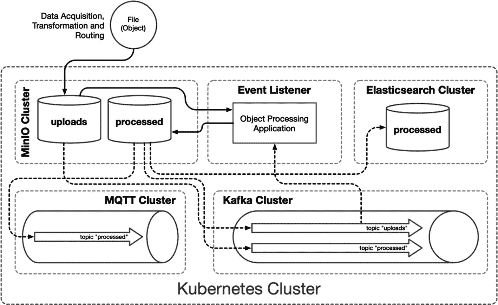

# 七、数据湖

数据仓库、数据集市和数据湖的概念在许多企业中已经变得司空见惯。大数据技术使组织能够收集、存储和处理不断增长的数据流。物联网、社交媒体和业务各个方面的数字化转型只会继续增加组织可用数据的数量和速度。

传统上，大数据概念侧重于为大型组织或数据收集和分析项目管理海量和各种收集数据的问题。大数据技术，特别是 Apache Hadoop 及其生态系统，使组织能够消费和存储其组织产生或相关的所有数据。然而，许多大数据解决方案是在容器和容器编排的可用性和受欢迎程度上升之前出现的，特别是 Kubernetes。过去，采用大数据技术通常意味着配置专用集群，并且通常需要一个团队来操作和维护它们。关于数据湖和数据仓库的单独一章很难触及这个充满活力的成熟生态系统的表面。以下练习旨在展示小规模的一组微小的大数据概念，利用 Kubernetes 在静态和事务性数据以及各种工作负载之间统一控制面板的优势。

所有数据都对组织有一定的价值；无论是研究地区销售报告的分析师，还是审计库存水平的采购经理，获取这一价值的成本一直是一个挑战。然而，在过去的二十年里，可用数据的数量和频率急剧增加，从消费和工业物联网到社交媒体、IT 系统和定制应用都产生了大量数据。大型组织需要解决大数据问题的解决方案。2006 年，Hadoop 项目通过将任意数量的商用服务器集群成一个大数据解决方案来解决这些问题。Hadoop 分布式文件系统(HDFS)及其 MapReduce 概念的实现允许将数据无限制地收集到巨大的“湖泊”中，并在它们的源头进行分析。对于许多组织来说，Hadoop 是一项有价值且强大的技术。然而，许多 Hadoop 功能可以在 Kubernetes 中实现，包括高度分布式工作负载、容错和自修复，以及更广泛和快速扩展的生态系统的好处。Kubernetes 不是大数据技术，但下一代支持大数据的系统可能会由此诞生。

本章并不试图说服已建立大数据管理应用的企业考虑将它们迁移到 Kubernetes 相反，目标是为在 Kubernetes 上开发的各种新应用平台中实现这些概念打下基础。

## 数据处理流水线

图 7-1 描绘了一个典型的数据处理流水线，包括原始和已处理数据存储、事件系统、元数据系统以及用于分析和转换的应用工作负载。本章中描述的大部分架构并不是专门为 Kubernetes 设计的，也不依赖于 Kubernetes 来运行。但是，将这些专门的集群包装在 Kubernetes 集群中可以建立统一的控制面板、网络、监控、安全策略和细粒度的资源管理，包括配置和限制存储、内存和 CPU。尽管诸如 Elasticsearch、Kafka、MQTT 和其他企业解决方案等技术需要广泛的知识来在要求苛刻的生产环境中有效地配置和管理它们，但 Kubernetes 抽象了所有人都通用的底层基础设施。



图 7-1

目标处理流水线

## 发展环境

本章通过包含用于对象存储的 MinIO 和作为对象元数据、原始数据仓库和已处理数据的键/值存储的 Apache Cassandra，在前面章节的基础上构建了数据处理和管理功能。

以下练习利用了第六章中提到的廉价 Hetzner 集群，包括一个用于 Kubernetes 主节点的 CX21 (2 个 vCPU/8G RAM/40G SSD)和四个用于 worker 节点的 CX41 (4 个 vCPU/16G RAM/160G SSD)实例，但任何等效的基础架构都可以容纳。此外，本章还利用了第 3 、 5 和 6 章中安装的应用和集群配置；见表 7-1 。本章在文件夹`cluster-apk8s-dev5`下组织新集群`dev5`的配置清单。

表 7-1

从前面章节收集的关键应用和配置

<colgroup><col class="tcol1 align-left"> <col class="tcol2 align-left"> <col class="tcol3 align-left"></colgroup> 
|   | 

资源

 | 

组织

 |
| --- | --- | --- |
| 第三章 | 进入证书管理器仓库监视 | `000-cluster/00-ingress-nginx``000-cluster/10-cert-manager``000-cluster/20-rook-ceph``000-cluster/30-monitoring` |
| 第五章 | 命名空间动物园管理员 Kafka 蚊子蚊子蚊子蚊子蚊子蚊子蚊子蚊子蚊子蚊子蚊子蚊子蚊子蚊子蚊子蚊子蚊子蚊子蚊子蚊子蚊子蚊子蚊子蚊子蚊子蚊子蚊子蚊子蚊子蚊子蚊子蚊子蚊子蚊子蚊子蚊子蚊子蚊子蚊子蚊子蚊子蚊子蚊子蚊子蚊子蚊子蚊子蚊子蚊子 | `003-data/000-namespace``003-data/010-zookeeper``003-data/020-kafka``003-data/050-mqtt` |
| 第六章 | 弹性搜索 logstash(日志记录)巴拉人凯克洛克 JupyterHub | `003-data/030-elasticsearch``003-data/032-logstash``003-data/034-kibana``003-data/005-keycloak``005-data-lab/000-namespace``003-data/100-jupyterhub` |

本章的剩余部分将重点介绍如何读写数据到现代概念的数据湖，数据湖是由 MinIO 实现的对象存储。MinIO 能够发出与对象(文件)的添加、状态和删除相关的事件，这使它成为任何数据处理流水线的一个引人注目的补充。最后，本章演示了应用的快速原型，该应用利用运行在 JupyterLab 实例中的基于 Python 的 Jupyter 笔记本，对 MinIO 生成的 Kafka 和 MQTT 中的对象相关事件做出反应。

## 作为对象存储的数据湖

事务数据库、数据仓库和数据集市都是旨在以已知的结构存储和检索数据的技术。组织经常需要存储新的和各种类型的数据，这些数据的形式通常是未知的或不适合结构化数据系统。以任何可能的形式管理无限数据的概念被称为数据湖。传统上，文件系统和块存储解决方案存储组织希望在其数据库管理系统之外收集和维护的大多数基于文件的数据。文件系统和数据块存储系统很难扩展，它们具有不同程度的容错、分布以及对元数据和分析的有限支持。

HDFS (Hadoop 分布式文件系统)一直是需要数据湖概念优势的组织的热门选择。HDFS 的设置和维护非常复杂，通常需要专用的基础架构和一名或多名专家来保持其运行和性能。

本章构建了一个带有对象存储的数据湖，用 MinIO 实现。MinIO 提供了一个与亚马逊 S3 兼容的分布式容错对象存储系统。MinIO 是水平可伸缩的，支持高达 5tb 的对象，它可以存储的对象数量没有限制。这些功能本身就满足了数据湖的基本概念要求。然而，MinIO 是可扩展的，尽管它支持事件和强大的 S3 兼容查询系统。

### 迷你操作员

Kubernetes 操作员是一种资源管理器，在这种情况下，安装和管理一个或多个 MinIO 集群。

Note

Kubernetes 运营商的概念产生于 2016 年。CoreOS 开始开发代表控制器的定制资源定义，旨在管理有状态应用的生命周期，并将它们称为操作符。操作员通过管理安装前和安装后的条件、监控和运行时操作，超越了 Helm 等软件包管理人员和安装人员的有限关注。操作符是定制的 Kubernetes 资源，像其他资源一样以声明方式安装，或者通过 Helm 之类的包管理器安装。收购 CoreOs 后，红帽在 2018 年发布了运营商框架 <sup>1</sup> ，后来又与贡献者亚马逊、微软、谷歌推出了 OperatorHub <sup>2</sup> 。

MinIO 项目提供了一个官方的 Kubernetes 运营商。以下配置安装 MinIO 操作符，管理用于声明新 MinIO 集群的新定制资源定义`Tenant`。

创建目录`cluster-apk8s-dev5/000-cluster/22-minio`以包含 MinIO 操作器安装文档。接下来，从清单 7-1 中创建一个名为`README.md`的文件。

```
# MinIO Operator Installation
see: https://github.com/minio/operator
Quick Start:
```shell script
kubectl apply -k github.com/minio/operator
```

Listing 7-1MinIO operator installation documentation

```

应用 MinIO 操作员配置:

```
$ kubectl apply -k github.com/minio/operator

```

Kubernetes 集群现在包含名称空间`minio-system`，以及名为`minio-operator`的 ServiceAccount 和部署。“操作员是 Kubernetes API 的客户端，充当定制资源的控制器，” <sup>3</sup> 在本例中，是新的资源类型`Tenant`。下一节通过声明一个`Tenant`资源来建立一个 MinIO 集群。

### 小型群集

MinIO 是一个 S3 兼容的对象存储系统，能够为平台提供一种数据湖功能。清单 7-2 中定义的小型 Minio 集群包括四个节点，支持基本级别的高可用性。`Tenant`资源描述了四个各有 10gb 的 MinIO 节点，使用在第三章中创建的`rook-ceph-block`存储类。标准存储配置将一半的可用磁盘(在本例中为永久卷)用于数据，另一半用于奇偶校验，允许在失去一个节点时进行完整的读/写活动，以及在失去两个节点时进行只读活动。这种配置对于小型开发集群或概念验证来说已经足够。

为清单 7-2 中定义的密码的用户名和密码部分生成一个大的随机字符串。此用户名和密码等同于 AWS S3 凭据，可以在任何 S3 兼容的客户端中使用，以与 MinIO 进行交互。

创建目录`cluster-apk8s-dev5/003-data/070-minio`以包含 MinIO 集群配置。接下来，从清单 7-2 中创建一个名为`90-cluster.yml`的文件。

```
apiVersion: v1
kind: Secret
metadata:
  namespace: data
  name: minio-creds-secret
type: Opaque
stringData:
  accesskey: REPLACE_WITH_STRONG_PASSWORD
  secretkey: REPLACE_WITH_STRONG_PASSWORD
---
apiVersion: minio.min.io/v1
kind: Tenant
metadata:
  name: minio
  namespace: data
spec:
  metadata:
    annotations:
      prometheus.io/path: /minio/prometheus/metrics
      prometheus.io/port: "9000"
      prometheus.io/scrape: "true"
  image: minio/minio:RELEASE.2020-08-18T19-41-00Z
  serviceName: minio-internal-service
  zones:
    - name: "zone-0"
      servers: 4
      volumesPerServer: 1
      volumeClaimTemplate:
        metadata:
          name: miniodata
        spec:
          storageClassName: rook-ceph-block
          accessModes:
            - ReadWriteOnce
          resources:
            requests:
              storage: 10Gi
  ## Secret with credentials to be used by MinIO instance.
  credsSecret:
    name: minio-creds-secret
  podManagementPolicy: Parallel
  requestAutoCert: false
  certConfig:
    commonName: ""
    organizationName: []
    dnsNames: []
  liveness:
    initialDelaySeconds: 10
    periodSeconds: 1
    timeoutSeconds: 1

Listing 7-2MinIO cluster configuration

```

应用 MinIO 群集配置:

```
$ kubectl apply -f 90-cluster.yml

```

在应用了集群配置(包括`Secret`和`Tenant`资源)之后，可以在 Kubernetes 集群内的服务地址`minio-internal-service:9000`或无头服务地址`minio-hl:9000`访问 MinIO。

如清单 7-3 所示，入口配置提供对 MinIO 的外部访问。MinIO 与 AWS S3 对象存储服务兼容；因此，能够与 AWS S3 交互的现有系统可以利用新的`minio.data.dev5.apk8s.dev`作为替代端点。

接下来，从清单 7-3 中创建一个名为`50-ingress.yml`的文件。

```
apiVersion: networking.k8s.io/v1beta1
kind: Ingress
metadata:
  name: minio
  namespace: data
  annotations:
    cert-manager.io/cluster-issuer: letsencrypt-production
    nginx.ingress.kubernetes.io/proxy-body-size: "0"
    nginx.ingress.kubernetes.io/proxy-read-timeout: "600"
    nginx.ingress.kubernetes.io/proxy-send-timeout: "600"
spec:
  rules:
    - host: minio.data.dev5.apk8s.dev
      http:
        paths:
          - backend:
              serviceName: minio-internal-service
              servicePort: 9000
            path: /
  tls:
    - hosts:
        - minio.data.dev5.apk8s.dev
      secretName: minio-data-tls

Listing 7-3MinIO cluster Ingress

```

为新的 MinIO 群集应用入口配置:

```
$ kubectl apply -f 50-ingress.yml

```

除了兼容 S3 的 API 之外，MinIO 还是一个有用且有吸引力的基于网络的用户界面，可通过位于 [`https://minio.data.dev5.apk8s.dev/`](https://minio.data.dev5.apk8s.dev/) 的网络浏览器访问。

下一节配置命令行 MinIO 客户机，用于创建存储桶、配置 MinIO 服务器和设置通知事件。

### 微型客户端

MinIO 客户端 <sup>4</sup> 是一个命令行实用程序，用于与 MinIO 集群进行交互(大部分与 AWS S3 兼容)。MinIO 客户端支持与对象存储相关的任何操作，从创建存储桶和列出对象到完整的管理和配置功能。在下一节中，MinIO 客户机用于在下面创建的存储桶上配置与对象状态相关的通知。

有关任何特定工作站的安装说明，请参考 MinIO 客户端快速入门指南。在本地工作站上安装 MinIO 客户端(mc)后，使用清单 7-3 中定义的入口主机和清单 7-2 中定义的凭证为名为`apk8s-dev5`的新集群创建一个别名:

```
$ mc config host add apk8s-dev5 \
      https://minio.data.dev5.apk8s.dev \
      username password

```

创建桶，`upload`、`processed,`和`twitter`，在本章后面和下一章中使用:

```
$ mc mb apk8s-dev5/upload
$ mc mb apk8s-dev5/processed
$ mc mb apk8s-dev5/twitter

```

列出三个新桶:

```
$ mc ls apk8s-dev5

```

MinIO 客户端可以轻松地从本地工作站或 AWS S3、谷歌云存储等复制文件。首先创建新的主机别名或列出现有别名:

```
$ mc config host list

```

MinIO 客户端是与对象存储集群进行手动交互的强大工具。为了对对象集群进行编程控制，MinIO 提供了 JavaScript、Java、Python、Golang、.NET 和 Haskell。MinIO 集群还兼容 AWS S3 API 和许多库，如 Amazon 的 Boto3 for Python、AWS。JavaScript 的 s3 类，或者 Golang 的 S3 包。Boto3 将在本章后面用于处理 CSV 文件。

下一节将利用 MinIO 发出与对象相关的事件的能力。

### 迷你活动

与对象相关的事件通知允许任意数量的服务使用这些通知并执行任务，从而为以数据为中心的平台提供了一种复杂的可扩展性。MinIO 支持配置对象状态通知给 AMQP、 <sup>5</sup> Elasticsearch、Kafka、MQTT、MySQL、NATS、 <sup>6</sup> NSQ、 <sup>7</sup> PostgreSQL、Redis 和 webhooks。 <sup>8</sup>

以下练习利用第 5 和 6 章中安装的技术，为 MinIO 配置通知 Elasticsearch、Kafka 和 MQTT 的能力。在为 Elasticsearch、Kafka 和 MQTT 配置连接设置之后，MinIO 服务器需要重新启动；但是，在此初始配置之后，在配置任意数量的通知设置时，不需要进一步重新启动。

通过请求当前配置并将其保存为 JSON 文件，开始配置 MinIO。使用前一节中安装的 MinIO 客户端命令行实用程序(`mc`)。

为 MinIO 服务器配置创建目录:

```
$ cd ./005-cluster-apk8s-dev5/003-data
$ mkdir -p ./070-minio/cfg

```

接下来，以 JSON 文件的形式获取现有的服务器配置(上一节描述了配置`the apk8s-dev5`别名)。以下多行命令将 JSON 输出通过流水线传输到 Python，以便对其进行格式化，从而更易于编辑:

```
$ mc admin config get apk8s-dev5 | \
     python -m json.tool > config.json

```

在`config.json`的`"notify"`部分下，编辑 Elasticsearch、Kafka 和 MQTT 的部分以匹配清单 7-4 。

```
"elasticsearch": {
            "1": {
                "enable": true,
                "format": "namespace",
                "index": "processed",
                "url": "http://elasticsearch:9200"
            }
      },
"kafka": {
            "1": {
                "brokers": ["kafka-headless:9092"],
                "enable": true,
                "sasl": {
                    "enable": false,
                    "password": "",
                    "username": ""
                },
                "tls": {
                    "clientAuth": 0,
                    "enable": false,
                    "skipVerify": false
                },
                "topic": "upload"
            }
        },
        "mqtt": {
            "1": {
                "broker": "tcp://mqtt:1883",
                "enable": true,
                "keepAliveInterval": 0,
                "password": "",
                "qos": 0,
                "queueDir": "",
                "queueLimit": 0,
                "reconnectInterval": 0,
                "topic": "processed",
                "username": ""
            }
        },

Listing 7-4MinIO server external connection configuration

```

应用编辑过的`config.json`并重启 MinIO 服务器:

```
$ mc admin config set apk8s-dev5 < config.json
$ mc admin service restart apk8s-dev5

```

MinIO 产生与对象的创建、删除和访问相关的事件通知类型，如表 7-2 所示。MinIO 支持按存储桶进行事件通知配置，并支持按事件类型、对象名前缀或对象名后缀进行细粒度过滤。

表 7-2

MinIO 支持的对象事件

<colgroup><col class="tcol1 align-left"> <col class="tcol2 align-left"></colgroup> 
| 

种类

 | 

事件

 |
| --- | --- |
| 创造 | `s3:ObjectCreated:Put``s3:ObjectCreated:Post``s3:ObjectCreated:Copy``s3:ObjectCreated:CompleteMultipartUpload` |
| 删除 | `s3:ObjectRemoved:Delete` |
| 接近 | `s3:ObjectAccessed:Get``s3:ObjectAccessed:Head` |

下一节将演示在 Kubernetes 中处理对象相关事件的方法。

### 流程对象

JupyterLab，如第六章中所述，为数据科学活动提供了一个便利且高效的环境，这主要是因为它靠近集群内数据和事件源。同样，在 Kubernetes 中运行的 JupyterLab 简化了组合基于数据的事件、基于集群的数据和 Kubernetes API 的实验能力。Jupyter 笔记本是快速构建和记录复杂原型的有用工具。

以下练习构建了事件侦听器的原型，创建了一个大型 CSV 文件并将其放入 MinIO bucket，通过生成 Kubernetes 作业来压缩 CSV，并演示了如何从压缩的 CSV 中提取数据。

#### 配置通知

首先，配置 MinIO 在特定的 bucket 事件发生时通知 Kafka 和 MQTT 主题，特别是在后缀为`.csv`的`upload` bucket 中创建任何对象时，以及在后缀为`.gz`的`processed` bucket 中创建任何对象时。在本练习中，Kafka 和 MQTT 的使用只是为了说明各种事件队列:

```
$ mc event add apk8s-dev5/upload \
      arn:minio:sqs::1:kafka \
--event put --suffix=".csv"

$ mc event add apk8s-dev5/processed \
      arn:minio:sqs::1:mqtt \
--event put --suffix=".gz"

```

此外，配置 MinIO 在 Elasticsearch 中保留一个文档索引，描述`processed`桶中所有对象的状态:

```
$ mc event add apk8s-dev5/processed \
      arn:minio:sqs::1:elasticsearch \

```

#### 事件笔记本

打开一个 JupyterLab 环境并启动一个 Python 笔记本来测试由 MinIO 产生的新的 bucket 通知事件。在第一个单元格中，确保 kafka-python 库可用:

```
!pip install kafka-python==1.4.7

```

导入标准的 JSON 库来解析 MinIO 通知，从 kafka-python 库中导入 KafkaConsumer <sup>9</sup> 类，最后，从 IPython.display 中导入`clear_output`函数来帮助清除循环之间的单元格输出:

```
import json
from kafka import KafkaConsumer
from IPython.display import clear_output

```

将 KafkaConsumer 连接到数据名称空间中 Kafka 集群上的上传主题。将`group_id`设置为`data-bucket-processor`:

```
consumer = KafkaConsumer('upload',
    bootstrap_servers="kafka-headless.data:9092",
    group_id='data-bucket-processor')

```

最后，在消费者消息上创建一个`for`循环。循环无限继续，用当前事件替换最后一个事件:

```
for msg in consumer:
    jsmsg = json.loads(msg.value.decode("utf-8"))
    clear_output(True)
    print(json.dumps(jsmsg, indent=4))

```

通过从本地工作站创建一个测试 CSV 文件并上传到`upload`桶来测试事件监听器:

```
$ touch test.csv
$ mc cp test.csv apk8s-dev5/upload

```

JupyterLab 事件笔记本现在应该显示类似于清单 7-5 的`s3:ObjectCreated:Put`事件通知。

```
{
    "EventName": "s3:ObjectCreated:Put",
    "Key": "upload/test.csv",
    "Records": [
        {
            "eventVersion": "2.0",
            "eventSource": "minio:s3",
            "awsRegion": "",
            "eventTime": "2019-12-27T08:27:40Z",
            "eventName": "s3:ObjectCreated:Put",
            "userIdentity": {
                "principalId": "3Fh36b37coCN3w8GAM07"
            },
            "requestParameters": {
                "accessKey": "3Fh36b37coCN3w8GAM07",
                "region": "",
                "sourceIPAddress": "0.0.0.0"
            },
            "responseElements": {
                "x-amz-request-id": "15E42D02F9784AD2",
                "x-minio-deployment-id": "0e8f8...",
                "x-minio-origin-endpoint": "http://10.32.128.13:9000"
            },
            "s3": {
                "s3SchemaVersion": "1.0",
                "configurationId": "Config",
                "bucket": {
                    "name": "upload",
                    "ownerIdentity": {
                        "principalId": "3Fh36b378GAM07"
                    },
                    "arn": "arn:aws:s3:::upload"
                },
                "object": {
                    "key": "test.csv",
                    "eTag": "d41d8cd98f998ecf8427e",
                    "contentType": "text/csv",
                    "userMetadata": {
                        "content-type": "text/csv",
                        "etag": "d41d8cd90998ecf8427e"
                    },
                    "versionId": "1",
                    "sequencer": "15E42D02FD98E21B"
                }
            },
            "source": {
                "host": "0.0.0.0",
                "port": "",
                "userAgent": "MinIO (darwin"
            }
        }
    ]
}

Listing 7-5Example bucket event notification

```

#### 测试数据

Python 是收集、规范化甚至生成数据的优秀工具。下面的练习生成了一个包含一百万个虚构献血者的 CSV 文件，每个献血者都包含一个假的电子邮件地址、姓名、血型、生日和州名。最后，脚本将生成的 CSV 数据上传到新 MinIO 集群上的上传桶中。

本节继续使用集群内 JupyterLab 环境；然而，这不是必需的。在 Kubernetes 集群的 JupyterLab 中创建新的 Jupyter 笔记本，或者在本地工作站上创建 Python 脚本。

示例 Python 脚本使用 Faker Python 库创建假数据，并使用 MinIO 客户端库连接到 MinIO。通过将以下 pip 安装指令添加到 Jupyter 笔记本的第一个单元，确保开发环境包含所需的依赖项:

```
!pip install Faker==2.0.3
!pip install minio==5.0.1

```

在下一个单元格中，导入以下库:

```
import os
from faker import Faker
from minio import Minio
from minio.error import ResponseError

```

在下一个单元格中，添加以下代码以打开一个名为`donors.csv`的文件，为数据编写一个初始标题，并创建一个增量为一百万的`while`循环:

```
%%time
fake = Faker()

f_customers = open("./donors.csv","w+")
f_customers.write(
    "email, name, type, birthday, state\n"
)

i = 0
while i < 1000000:
    fp = fake.profile(fields=[
        "name",
        "birthdate",
        "blood_group"])

    st = fake.state()
    bd = fp["birthdate"]
    bg = fp["blood_group"]
    ml = fake.ascii_safe_email()

    f_customers.write(
        f'{ml},{fp["name"]},{bg},{bd},{st}\n'
    )
    i += 1

f_customers.close()

```

在 Jupyter 笔记本的最后一个单元格中，连接本章前面设置的 MinIO 集群，将新生成的`donors.csv`上传到`upload`桶中；用 MinIO 集群设置中定义的值替换**用户名**和**密码**:

Note

如果从本地工作站开发，用`'minio.data.dev5.apk8s.dev'`替换`'minio-internal-service.data:9000'`，用`secure=True`替换`secure=False`。

```
%%time
minioClient = Minio('minio-internal-service.data:9000',
                    access_key='username',
                    secret_key='password',
                    secure=False)

try:
    with open("./donors.csv", 'rb') as file_data:
        file_stat = os.stat('./donors.csv')
        minioClient.put_object('upload',
                               'donors.csv',
                               file_data,
                               file_stat.st_size,
                               content_type='application/csv')

except ResponseError as err:
    print(err)

```

如果前一部分的事件笔记本正在运行，将显示一个名为`s3:ObjectCreated:CompleteMultipartUpload`的新事件，带有键`upload/donors.csv`。MinIO 集群现在拥有大约 60 兆字节的对象，包含测试数据，代表假献血者，他们的电子邮件，姓名，出生日期，血型和州。

此时，事件系统可能会触发大范围的数据处理操作。下一节使用一个定制的数据压缩应用来演示一个典型的对象处理流程。

#### 容器化应用

在 Kubernetes 上，所有工作负载都在 Pod 的一个容器中执行。最后几个练习使用一个运行 JupyterLab 容器的 Pod 来执行在 Jupyter 笔记本中编写的代码，这是一种用于实验、构建概念验证或快速原型制作的优秀方法。随着原型化过程迭代到稳定的生产系统，识别独立的工作单元，开发并将其包装在容器中，测试，版本化，并使它们可用于编排。

下面的练习在 Go 中开发了一个通用对象压缩器，构建并版本化了一个容器，并使该容器在 Docker Hub 上公开可用。在本地工作站上，确保存在 Go 版本 1.13+和 Docker 版本 19+。使用 GitLab 和 Docker Hub 上的新帐户或现有帐户(都是免费的)来存储源代码和生成的容器。

在本地工作站上为新的 Go 应用创建一个文件夹；这个例子使用了文件夹`~/workspace/apk8s/compressor`。在新文件夹中，初始化 Go 模块 <sup>10</sup> (替换为任何定制的 Git 库):

```
$ go mod init github.com/apk8s/compressor

```

Note

从 Go 1.14 开始， <sup>11</sup> Go 模块已准备好投入生产使用，并被视为 Go 的正式依赖管理系统。鼓励所有开发人员在迁移任何现有项目的同时，为新项目使用 Go 模块。

创建目录`cmd`来存储主要的 Go 源代码——这种约定通常用于表示命令行应用，而不是共享库的组件。在 cmd 目录下创建一个名为`compressor.go`的文件，并用清单 7-6 中的源代码填充它。

```
package main

import (
      "bufio"
      "compress/gzip"
      "flag"
      "io"
      "log"
      "os"

      minio "github.com/minio/minio-go/v6"
)

var (
      endpoint        = os.Getenv("ENDPOINT")
      endpointSSL     = os.Getenv("ENDPOINT_SSL")
      accessKeyID     = os.Getenv("ACCESS_KEY_ID")
      accessKeySecret = os.Getenv("ACCESS_KEY_SECRET")
)

func main() {
      var (
            fmBucket = flag.String("f", "", "From bucket.")
            toBucket = flag.String("t", "", "To bucket.")
            fmObjKey = flag.String("k", "", "From key.")
      )
      flag.Parse()

      useSSL := true
      if endpointSSL == "false" {
            useSSL = false
      }

      mc, err := minio.New(
            endpoint, accessKeyID,
            accessKeySecret, useSSL)
      if err != nil {
            log.Fatalln(err)
      }

      obj, err := mc.GetObject(
            *fmBucket,
            *fmObjKey,
            minio.GetObjectOptions{},
      )
      if err != nil {
            log.Fatalln(err)

      }

      log.Printf("Starting download stream %s/%s.",
            *fmBucket,
            *fmObjKey)

      // synchronous in-memory pipe
      pipeR, pipeW := io.Pipe()

      // reads from object, writes to pipe
      bufIn := bufio.NewReader(obj)

      // gzip buffers to memory and flushes on close
      gzW, err := gzip.NewWriterLevel(pipeW, 3)
      if err != nil {
            log.Fatalln(err)
      }

      go func() {
            log.Printf("Compress and stream.")
            n, err := bufIn.WriteTo(gzW)
            if err != nil {
                  log.Fatalln(err)
            }
            gzW.Close()
            pipeW.Close()
            log.Printf("Compressed: %d bytes", n)
      }()

      // data will not be sent until gzW.Close() and
      // the gzip buffer flushes
      log.Print("BEGIN PutObject")
      _, err = mc.PutObject(
            *toBucket, *fmObjKey+".gz",
            pipeR, -1, minio.PutObjectOptions{})
      if err != nil {
            log.Fatalln(err)
      }
      log.Print("COMPLETE PutObject")

}

Listing 7-6Go application: compressor

```

前面定义的新 Go 应用连接到一个 MinIO 集群，压缩一个对象，并将压缩后的输出放在一个单独的桶中的新对象中。这个应用只是对象处理的一个简单例子，它利用 Go 编程语言创建一个小型的、静态编译的二进制文件，不依赖于外部操作系统。

通过设置以下环境变量，在本地工作站上测试新的 compressor 应用；用本章前面定义的值替换端点、用户名和密码:

```
$ export ENDPOINT=minio.data.dev5.apk8s.dev
$ export ACCESS_KEY_ID=username
$ export ACCESS_KEY_SECRET=password

```

编译并执行配置了桶`upload`和`processed`的 compressor 应用，以及前面部分生成并添加到 MinIO 的对象`upload/donors.csv`:

```
$ go run ./cmd/compressor.go -f upload -k donors.csv -t processed

```

在完成执行后，一个新对象包含一个名为`donors.csv.gz`的`donors.csv`的压缩版本，在`processed`桶中可用，大约 20 兆字节。此外，MinIO 向 MQTT 集群发送了一条主题为`processed`的消息，并向 Elasticsearch 索引`processed`添加了一个新文档。参见第 5 和 6 章，了解 MQTT (Mosquitto)和 Elasticsearch。

接下来，本章使用 Docker Hub 组织`apk8s`来存储和服务公共容器。为下面的练习设置一个免费的 Docker Hub 帐户或确保访问合适的容器注册表。

在代表 compressor 项目的文件夹`~/workspace/apk8s/compressor`中，创建文件`Dockerfile`并用清单 7-7 的内容填充它。

```
FROM golang:1.13.3 AS builder

WORKDIR /go/src

COPY . /go/src

RUN go mod download

RUN CGO_ENABLED=0 \
    GOOS=linux \
    GOARCH=amd64 \
    GO111MODULE=on \
    go build -ldflags "-extldflags -static" \
        -o /go/bin/compressor /go/src/cmd

RUN echo "nobody:x:65534:65534:Nobody:/:" > /etc_passwd

FROM scratch

ENV PATH=/bin

COPY --from=builder /etc/ssl/certs/ca-certificates.crt /etc/ssl/certs/
COPY --from=builder /etc_passwd /etc/passwd
COPY --from=builder /go/bin/compressor /bin/compressor

WORKDIR /

USER nobody
ENTRYPOINT ["/bin/compressor"]

Listing 7-7Dockerfile for the compressor application

```

新的 Dockerfile 代表了一个多阶段的构建过程。第一阶段使用名为`builder`的`golang:1.13.3`容器下载依赖项并编译静态二进制文件。构建器容器还创建了一个`/etc_passwd`文件来支持用户 Nobody 执行下面的暂存容器中的二进制文件，这被定义为 Docker 构建的第二阶段。

除了是一个很小的容器，重约 10 兆字节，这个基于`scratch`的容器(列表 7-7 )以用户`Nobody`的身份执行单个二进制文件，没有其他用户帐户，也没有操作系统。这种方法将攻击面缩小到二进制文件本身，以及用于编译它的库。允许攻击者逃离容器的利用将作为相对良性的用户`Nobody`来完成。没有完美的安全；然而，任何潜在攻击面和复杂性的减少都会减少在生产系统中运行数十万个容器的累积效应。

最后，构建、标记容器，并将其推送到 Docker Hub 或任何合适的容器注册中心:

```
$ docker build -t apk8s/compressor:v0.0.1 .
$ docker push apk8s/compressor:v0.0.1

```

测试新容器，首先确保环境变量`ENDPOINT`、`ACCESS_KEY_ID`和`ACCESS_KEY_SECRET`仍然在当前 shell 中导出(如前面所定义的)，然后执行以下命令:

```
$ docker run -e ENDPOINT=$ENDPOINT \
      -e ACCESS_KEY_ID=$ACCESS_KEY_ID \
      -e ACCESS_KEY_SECRET=$ACCESS_KEY_SECRET \
      apk8s/compressor:v0.0.1 \
      -f=upload -k=donors.csv -t=processed

```

新容器已经准备好在 Kubernetes 集群中运行并处理对象，在本例中是压缩它们。然而，本练习的目标是展示开发小型、集中的应用的简易性，以及它们在基于 Kubernetes 的数据平台中所扮演的角色。下一节将演示如何构建这个(或任何)新对象处理容器的基于事件的部署的原型。

#### 程序化部署

计算集群所需状态的声明性配置是在 Kubernetes 中部署应用的惯用方法。这本书主要使用 YAML 直接定义理想状态，或者使用 Helm 间接填充和应用 YAML 模板。甚至命令式命令如`kubectl run` <sup>12</sup> 也在幕后调用声明式 API 调用。本节中的练习在 Jupyter 笔记本中开发了一个原型应用，它侦听 MinIO bucket 事件，并通过定义 Kubernetes 作业和用 Kubernetes API 应用它们来处理对象。

在将任何执行附加到事件流之前，下面的练习使用由 JupyterHub 提供的 JupyterLab 环境提供的集群内 Jupyter 笔记本来开发一个原型 Kubernetes 作业部署器。

为 Pod 中的容器指定 serviceAccount 时，Kubernetes 会将其关联的访问令牌以及集群证书 ca.crt 装入/var/run/secrets/Kubernetes . io/serviceaccount 中。未指定 service account 的 Pod 会装入运行它们的命名空间的默认服务帐户。第六章配置了一个名为 data-lab 的服务帐户和角色，它拥有对 Kubernetes API 的扩展权限，供 JupyterLab 容器使用。确保以下权限、 **pods/log** 、 **jobs** 和 **jobs/status** (如清单 7-8 所示)可用于分配给`data-lab`名称空间中`data-lab` ServiceAccount 的`data-lab`角色。

```
apiVersion: rbac.authorization.k8s.io/v1beta1
kind: Role
metadata:
  name: data-lab
  namespace: data-lab
rules:
  - apiGroups: ["","batch"]
    resources: ["pods",
                "pods/log",
                "events",
                "services",
                "jobs",
                "jobs/status"]
    verbs: ["delete",
            "create",
            "get",
            "watch",
            "list",
            "endpoints",
            "patch",
            "events"]

Listing 7-8Update 005-data-lab/000-namespace/07-role.yml

```

参观在第六章中设置的木星实验室环境`lab.data.dev5.apk8s.dev`。在单个单元格中添加并执行以下代码示例，以测试和试验每个步骤。

添加一个单元格安装最新的 Python Kubernetes 客户端库: <sup>13</sup>

```
!pip install kubernetes

```

导入以下依赖项:

```
from os import path
import yaml
import time
from kubernetes import client, config
from kubernetes.client.rest import ApiException
from IPython.display import clear_output

```

使用类`V1EnvVar` <sup>14</sup> 创建一个环境变量集合，供以后在压缩器容器中使用。用本章前面“MinIO 集群”一节中定义的值替换用户名和密码。当前集群内配置的`ENDPOINT_SSL`设置为假:

```
envs = [
    client.V1EnvVar("ENDPOINT", "minio-internal-service.data:9000"),
    client.V1EnvVar("ACCESS_KEY_ID", "username"),
    client.V1EnvVar("ACCESS_KEY_SECRET", "password"),
    client.V1EnvVar("ENDPOINT_SSL", "false"),
]

```

使用类`V1Container,` <sup>15</sup> 配置一个容器，其中包含在前面部分构建并标记的映像`apk8s/compressor:v0.0.1`。compressor 应用需要之前配置的环境变量，以及指定要处理的桶的参数`-f`、对象键的参数`-k`和目的桶的参数`-t`:

```
container = client.V1Container(
    name="compressor",
    image="apk8s/compressor:v0.0.1",
    env=envs,
    args=["-f=upload",
          "-k=donors.csv",
          "-t=processed"])

```

使用类`V1PodTemplateSpec,`<sup>16</sup>`V1ObjectMeta,`<sup>17</sup>和`V1PodSpec,` <sup>18</sup> 配置一个 Pod 来运行之前配置的容器:

```
podTmpl = client.V1PodTemplateSpec(
    metadata=client.V1ObjectMeta(
        labels={"app": "compress-donors"}
    ),
    spec=client.V1PodSpec(
        restart_policy="Never",
        containers=[container]))

```

Kubernetes 为 Pods 提供作业资源，旨在运行到完成。只有当 Pod 返回非零值时，作业才会重新启动它。使用类别`V1Job,` <sup>19</sup> `V1ObjectMeta`和`V1JobSpec,` <sup>20</sup> 用之前配置的 Pod 配置作业:

```
job = client.V1Job(
    api_version="batch/v1",
    kind="Job",
    metadata=client.V1ObjectMeta(
        name="compress-donors"
    ),
    spec=client.V1JobSpec(
        template=podTmpl,
        backoff_limit=2)
    )

```

接下来，配置 Python 客户机并加载负责管理作业资源的 Kubernetes 批处理 API。方法`load_incluster_config()`将 Python 客户端配置为利用 Kubernetes 配置，该配置可用于运行当前 JupyterLab 环境的 Pod。

```
config.load_incluster_config()
batch_v1 = client.BatchV1Api()

```

使用 Kubernetes 批处理 API 来应用作业配置:

```
resp = batch_v1.create_namespaced_job(
    body=job,
    namespace="data-lab")

```

在执行了前面 Jupyter 笔记本单元中的代码后，Kubernetes 在 data-lab 名称空间中创建了一个名为 compress-donors 的作业。成功执行后，作业保持完成状态。但是，任何失败都会导致两次重试，如前面使用`backoff_limit`指令配置的那样。在这两种情况下，清单 7-9 中的代码轮询已配置作业的状态，并在完成后删除它；如果作业返回错误，最终代码将显示与作业关联的 Pod 中的日志。将清单 7-9 中的代码添加到 Jupyter 笔记本的最后一个单元格中，并执行它。

```
completed = False

while completed == False:
    time.sleep(1)

    try:
        resp = batch_v1.read_namespaced_job_status(
            name="compress-donors",
            namespace="data-lab", pretty=False)
    except ApiException as e:
        print(e.reason)
        break

    clear_output(True)
    print(resp.status)

    if resp.status.conditions is None:
        continue

    if len(resp.status.conditions) > 0:

        clear_output(True)
        print(resp.status.conditions)

        if resp.status.conditions[0].type == "Failed":
            print("FAILED -- Pod Log --")
            core_v1 = client.CoreV1Api()
            pod_resp = core_v1.list_namespaced_pod(
                namespace="data-lab",
                label_selector="app=compress-donors",
                limit=1
            )

            log_resp = core_v1.read_namespaced_pod_log(
                name=pod_resp.items[0].metadata.name,
                namespace='data-lab')

            print(log_resp)

        print("Removing Job...")
        resp = batch_v1.delete_namespaced_job(
            name="compress-donors",
            namespace="data-lab",
            body=client.V1DeleteOptions(
                propagation_policy='Foreground',
                grace_period_seconds=5))
        break

Listing 7-9Monitor Job state and cleanup

```

这本书把剩下的基于事件的对象处理练习留给了读者。将本章前面定义的事件记录单与前面定义的用于处理对象的作业的编程部署结合起来。这种组合为几乎任何形式的基于事件的数据处理创建了一个原型框架，包括分析、标准化、衍生和合成数据的生成，以及内务处理任务，如前面演示的组织和压缩。

#### 无服务器对象处理

自动化前一部分开发的流程是这里简要介绍的无服务器 <sup>21</sup> (或功能即服务)技术的核心。

云供应商提供的解决方案抽象出了所有复杂的活动部分，这些部分支持任何孤立工作负载的编译、执行、缩放和错误处理，这些工作负载足够小且足够集中，可以被视为一个功能。使用 AWS Lambda、 <sup>22</sup> Azure 函数、 <sup>23</sup> 或谷歌云函数 <sup>24</sup> 构建关键业务逻辑是快速开发或寻求尽可能减少运营复杂性的小型团队的有效方法。然而，这些无服务器产品确实是以强大的供应商锁定为代价的，并且相信它们的支持产品线在未来仍然是供应商的优先选择。

在 Kubernetes 生态系统中， <sup>25</sup> 越来越多的无服务器技术提供了云本地和厂商中立的方法。Kubeless、 <sup>26</sup> OpenFaaS、 <sup>27</sup> 裂变、<sup>28</sup>Apache open whisk、 <sup>29</sup> 和 Nuclio <sup>30</sup> 都提供了非常适合公共云或定制 Kubernetes 集群的交钥匙无服务器平台。项目 Knative <sup>31</sup> 为开发新的基于无服务器的平台提供了一个灵活的组件平台。第八章展示了使用 OpenFaaS 进行无服务器风格的数据转换。

由于 Kubernetes 抽象了底层基础设施问题，MinIO 提供了对象存储和访问，再加上一个强大的无服务器平台来自动化部署和执行基于事件的对象处理，本书中描述的数据湖在为生产进行扩展时能够满足许多企业需求。

## 摘要

本章组装了一种类型的数据湖，具体来说就是上传桶，负责摄取任何形式和数量的数据 <sup>32</sup> ，具有几乎无限扩展的能力。数据湖满足了任何组织在确定任何特定目的之前获取或保留数据的愿望。数据湖不仅仅是简单的数据存储引擎；它们必须支持为各种利益相关者提供受控访问的能力，支持用于探索和分析的工具，并在需要时扩展处理能力和容量。MinIO 是在 Kubernetes 中构建数据湖的绝佳选择。MinIO 的 S3 兼容 API，以及支持各种外部系统的事件通知系统，为构建现代数据湖提供了一个广泛而强大的平台。 <sup>33</sup> 此外，本章还展示了利用集群内 Jupyter 笔记本电脑快速构建基于事件的对象处理原型的强大功能和便利性。

一旦组织、处理或转换了数据湖中的任何数据，就出现了数据仓库的概念。数据仓库是商业智能、分析和数据科学活动(包括机器学习)的关键组件。下一章用数据仓库概念叠加并扩展了本章中的功能。

<aside aria-label="Footnotes" class="FootnoteSection" epub:type="footnotes">Footnotes 1

[T2`https://github.com/operator-framework`](https://github.com/operator-framework)

  2

[T2`https://operatorhub.io/`](https://operatorhub.io/)

  3

[T2`https://kubernetes.io/docs/concepts/extend-kubernetes/operator/`](https://kubernetes.io/docs/concepts/extend-kubernetes/operator/)

  4

[T2`https://docs.min.io/docs/minio-client-complete-guide`](https://docs.min.io/docs/minio-client-complete-guide)

  5

[T2`www.amqp.org/`](http://www.amqp.org/)

  6

[T2`https://nats.io/`](https://nats.io/)

  7

[T2`https://nsq.io/`](https://nsq.io/)

  8

[T2`www.programmableweb.com/news/what-are-webhooks-and-how-do-they-enable-real-time-web/2012/01/30`](http://www.programmableweb.com/news/what-are-webhooks-and-how-do-they-enable-real-time-web/2012/01/30)

  9

[T2`https://kafka-python.readthedocs.io/en/master/apidoc/KafkaConsumer.html`](https://kafka-python.readthedocs.io/en/master/apidoc/KafkaConsumer.html)

  10

[T2`https://github.com/golang/go/wiki/Modules`](https://github.com/golang/go/wiki/Modules)

  11

[T2`https://golang.org/doc/go1.14`](https://golang.org/doc/go1.14)

  12

[T2`https://kubernetes.io/docs/tasks/manage-kubernetes-objects/imperative-command/`](https://kubernetes.io/docs/tasks/manage-kubernetes-objects/imperative-command/)

  13

[T2`https://github.com/kubernetes-client/python`](https://github.com/kubernetes-client/python)

  14

[T2`https://github.com/kubernetes-client/python/blob/master/kubernetes/docs/V1EnvVar.md`](https://github.com/kubernetes-client/python/blob/master/kubernetes/docs/V1EnvVar.md)

  15

[T2`https://github.com/kubernetes-client/python/blob/master/kubernetes/docs/V1Container.md`](https://github.com/kubernetes-client/python/blob/master/kubernetes/docs/V1Container.md)

  16

[T2`https://github.com/kubernetes-client/python/blob/master/kubernetes/docs/V1PodTemplateSpec.md`](https://github.com/kubernetes-client/python/blob/master/kubernetes/docs/V1PodTemplateSpec.md)

  17

[T2`https://github.com/kubernetes-client/python/blob/master/kubernetes/docs/V1ObjectMeta.md`](https://github.com/kubernetes-client/python/blob/master/kubernetes/docs/V1ObjectMeta.md)

  18

[T2`https://github.com/kubernetes-client/python/blob/master/kubernetes/docs/V1PodSpec.md`](https://github.com/kubernetes-client/python/blob/master/kubernetes/docs/V1PodSpec.md)

  19

[T2`https://github.com/kubernetes-client/python/blob/master/kubernetes/docs/V1Job.md`](https://github.com/kubernetes-client/python/blob/master/kubernetes/docs/V1Job.md)

  20

[T2`https://github.com/kubernetes-client/python/blob/master/kubernetes/docs/V1JobSpec.md`](https://github.com/kubernetes-client/python/blob/master/kubernetes/docs/V1JobSpec.md)

  21

[T2`https://martinfowler.com/articles/serverless.html`](https://martinfowler.com/articles/serverless.html)

  22

[T2`https://aws.amazon.com/lambda/`](https://aws.amazon.com/lambda/)

  23

[T2`https://azure.microsoft.com/en-us/services/functions/`](https://azure.microsoft.com/en-us/services/functions/)

  24

[T2`https://cloud.google.com/functions/`](https://cloud.google.com/functions/)

  25

[T2`https://landscape.cncf.io/format=serverless`](https://landscape.cncf.io/format%253Dserverless)

  26

[T2`https://kubeless.io/`](https://kubeless.io/)

  27

[T2`www.openfaas.com/`](http://www.openfaas.com/)

  28

[T2`https://fission.io/`](https://fission.io/)

  29

[T2`https://openwhisk.apache.org/`](https://openwhisk.apache.org/)

  30

[T2`https://nuclio.io/`](https://nuclio.io/)

  31

[T2`https://knative.dev/`](https://knative.dev/)

  32

[T2`www.dataversity.net/data-lakes-101-overview/`](http://www.dataversity.net/data-lakes-101-overview/)

  33

[T2`https://blog.minio.io/modern-data-lake-with-minio-part-1-716a49499533`](https://blog.minio.io/modern-data-lake-with-minio-part-1-716a49499533)

 </aside>