# 九、路由和转换

前面的章节介绍了数据库、数据湖和数据仓库的构建，这些都是数据平台的基础元素，全部来自 Kubernetes，展示了一个健壮的分布式服务平台。本章着重于数据的收集、提取、移动和处理，完善了任何以数据为中心的应用所需的大部分功能。从一个不同的系统高效地提取、转换和加载数据到另一个系统的能力对于利用消费者和工业物联网、社交媒体和许多组织中发生的数字转换的数据爆炸式增长至关重要。快速构建移动、转换和处理数据的路径的能力对于利用不断进步的数据驱动趋势至关重要，例如基于机器学习的人工智能，这些技术特别渴望大量处理的数据。一个有效的数据平台提供了跨数据管理系统**提取、转换和加载**数据所需的所有通用机制，并提供了支持专门处理和定制业务逻辑的应用层。

本章使用 ETL/ELT(提取、转换、加载)和 FaaS(功能即服务，也称为无服务器)功能扩展了基于 Kubernetes 的数据平台，该平台是在前面章节的基础上构建的。专注于 ETL 的技巧和技术已经成熟很多年了。数据工程师现在可以将 ETL 与无服务器平台相结合，快速开发、集成并直接部署到数据流水线中。

## ETL 和数据处理

本章介绍了 Kubernetes 中的两项新技术:Apache NiFi 和 OpenFaaS，展示了一种提取、加载、转换和处理数据的纯开源方法，不需要特定领域的语言和复杂的配置文件。Apache NiFi 提供了数百个预构建的数据“处理器”,用于从几乎任何标准网络协议或 API 实现中提取和加载数据，并能够将其转换为几乎任何所需的形式。OpenFaaS 是对无服务器/FaaS(作为服务的功能)概念的厂商中立的方法；在这种情况下，FaaS 通过用任何语言开发的定制的、高度集中的代码，允许 ETL 流水线的无限可扩展性。

图 9-1 描述了贯穿本章的 ETL、数据处理和可视化演示。最终目标是可视化一段时间内在一组特定的 Twitter 消息上表达的情绪范围。下面几节安装 OpenFaaS 并部署一个预打包的情绪分析功能。后面的部分介绍了 Apache NiFi，并配置了从 Twitter 到 Kafka 以及从 Kafka 到 OpenFaaS 情绪分析函数的数据路由和转换的有向图，最后将结果记录在 Elasticsearch 中，供 Jupyter 笔记本进行分析。虽然这些技术都不需要 Kubernetes，但本演示旨在阐明统一控制面板、网络、监控的优势及其基于容器的应用平台功能的可扩展性。

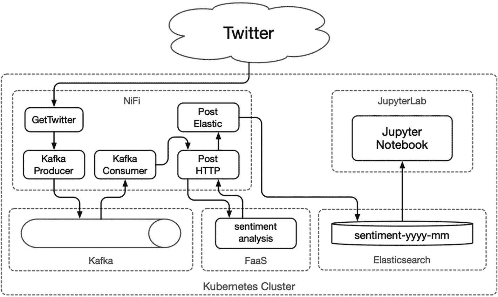

图 9-1

NiFi 和 OpenFaaS 演示架构

本书中的一些技术，即数据库，在抽象的基础设施上运行时可能会牺牲一定程度的性能；然而，一些应用会发现这是一种可接受的折衷，可以减少管理许多具有完全不同的依赖关系的系统时所产生的技术负担。根据组织的规模或项目的预算问题，将基础设施专业知识应用于每项企业级技术(如 Apache NiFi、Kafka 和 Elasticsearch)可能不可行。这本书希望通过利用 Kubernetes 在几乎任何项目都可能利用的规模上展示这些技术，从概念的启动证明到网络规模的社交网络。

## 发展环境

以下练习继续利用第六章中提到的廉价 Hetzner 集群，包括一个用于 Kubernetes 主节点的 CX21 (2 个 vCPU/8G RAM/40G SSD)和四个用于 worker 节点的 CX41 (4 个 vCPU/16G RAM/160G SSD)实例，但任何等效的基础架构都可以容纳。此外，本章还利用了第 3 、 5 和 6 章中安装的应用和集群配置；参见第七章中的表 7-1 。本章要求在第三章中配置入口、证书管理器、存储和监控；第五章中的命名空间、动物园管理员和 Kafka；以及第六章的 Elasticsearch、Kibana、Keycloak、JupyterHub。

本章在项目文件夹`cluster-apk8s-dev5`下组织名为`dev5`的集群的配置清单。

## 无服务器

无服务器的概念，也称为 FaaS (functions as a service)，已经不断成熟，满足了小单元功能代码的简化部署需求。单一应用、微服务和(无服务器)功能之间的区别在于实现、操作基础设施和更广泛架构的上下文。例如，许多微服务和基于功能的架构仍然依赖于单片数据库。术语“无服务器”意味着开发人员应该很少或根本不需要关心服务器端的实现。无服务器或 FaaS (functions as a service)旨在抽象出集成、部署和运行时操作的几乎所有方面，将功能性业务逻辑作为开发人员的唯一职责。

云供应商推销无服务器技术的核心吸引力，即允许开发人员专注于业务逻辑、抽象和管理基础设施、操作系统、运行时和应用层的能力。主要云厂商的产品包括亚马逊的 AWS Lambda、 <sup>1</sup> 微软的 Azure 函数、 <sup>2</sup> 谷歌云函数、 <sup>3</sup> 和 IBM 云函数。 <sup>4</sup> 这些产品可以显著缩短上市时间，减少许多组织的技术债务，尽管是以锁定供应商为代价。然而，已经投资 Kubernetes 的组织可以利用越来越多的开源、厂商中立的无服务器平台，如 Apache OpenWhisk、 <sup>5</sup> Kubeless、 <sup>6</sup> 和 OpenFaaS。<sup>7</sup>Knative<sup>8</sup>对于那些寻求开发定制无服务器平台的人来说是一个流行的选择。

本章展示了 OpenFaaS 在一个示例 ETL 应用中的使用，以及无服务器/功能即服务如何对任何数据平台进行出色的补充。

### OpenFaaS

OpenFaaS 是一个稳定的、维护良好的、无服务器的应用平台，被越来越多的组织所使用。OpenFaaS 几乎可以在任何地方运行，但可以与 Kubernetes 很好地集成，支持 Go、Java、Python、PHP、Rust、Perl、C#和 Ruby 等语言，以及包括 Express.js、Django 和 ASP.NET 核心在内的应用平台。OpenFaaS 支持定制容器来包装强大的二进制文件，如 FFmpeg <sup>9</sup> 和 ImageMagick。 <sup>10</sup>

管理容器化的工作负载是 Kubernetes 的核心能力；然而，像 OpenFaaS 这样的平台提供了一个正式的工具和操作框架，用于开发、编目、集成、部署、扩展和监控用函数表示的工作负载。

无服务器/功能即服务是 ETL 和数据处理流水线的天然选择，这一点将在本章的后面介绍。

#### 安装 openafs

用 OpenFaaS 库更新 Helm:

```
$ helm repo add openfaas \
        https://openfaas.github.io/faas-netes/
$ helm repo update

```

接下来，使用 Helm 将 OpenFaaS 网关安装到带有参数`--namespace data`的`data`名称空间中。OpenFaaS 网关可以设置函数在另一个名称空间中运行，但是对于这个例子，通过设置`functionNamespace=data`来使用`data`名称空间。OpenFaaS 能够利用 Kubernetes 节点端口和负载均衡器； <sup>11</sup> 然而，这个例子通过设置`exposeServices=false`和`ingress.enabled=true`使用 Ingress 来公开部署的函数。最后，设置选项`generateBasicAuth=true`以使用基本认证保护入口暴露网关用户界面:

```
$ helm upgrade apk8s-data-openfaas –install \
        openfaas/openfaas \
        --namespace data \
        --set functionNamespace=data \
        --set exposeServices=false \
        --set ingress.enabled=true \
        --set generateBasicAuth=true

```

创建目录`cluster-apk8s-dev5/003-data/120-openfaas`。在新的`120-openfaas`目录中，从清单 9-1 中创建一个名为`50-ingress.yml`的文件。

```
apiVersion: networking.k8s.io/v1beta1
kind: Ingress
metadata:
  name: faas
  namespace: data
  annotations:
    cert-manager.io/cluster-issuer: letsencrypt-production
spec:
  rules:
    - host: faas.data.dev5.apk8s.dev
      http:
        paths:
          - backend:
              serviceName: gateway
              servicePort: 8080
            path: /
  tls:
    - hosts:
        - faas.data.dev5.apk8s.dev
      secretName: faas-data-production-tls

Listing 9-1OpenFaaS Ingress

```

应用 OpenFaaS 入口配置:

```
$ kubectl apply -f 50-ingress.yml

```

成功应用 Ingress 后，使用以下命令检索由 OpenFaaS Helm 安装生成的基本身份验证凭据:

```
$ echo $(kubectl -n data get secret basic-auth -o jsonpath="{.data.basic-auth-password}" | base64 --decode)

```

前面的命令返回用于登录 OpenFaaS UI 门户的基本 Auth 密码；用户名是`admin`。在本例中，浏览至入口 URL(见图 9-2 ):

[`https://faas.data.dev5.apk8s.dev`](https://faas.data.dev5.apk8s.dev) 。

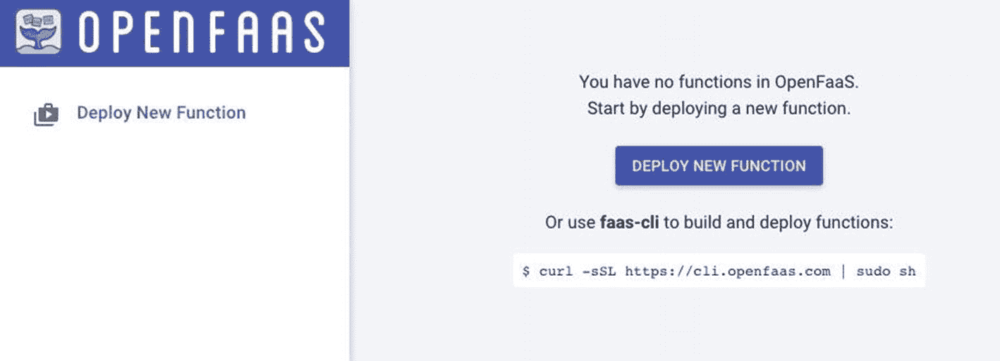

图 9-2

openfans 用户界面门户

OpenFaaS UI 门户是一个方便的基于 web 的可视化界面，用于安装和管理功能。然而，CLI 实用程序 faas-cli 通常是与 OpenFaaS 交互的首选方法，能够支持开发、测试、部署、管理和自动化功能即服务的所有方面。在本地工作站上安装 OpenFaaS CLI:

```
$ curl -sLSf https://cli.openfaas.com | sudo sh

```

执行 OpenFaaS CLI 获取顶级命令列表:

```
$ faas-cli

```

虽然本书推荐将 CLI 实用程序用于常规用途，但以下部分使用基于 web 的界面作为安装 OpenFaaS 功能并与之交互的简单直观演示。

#### 安装情感分析

情感分析， <sup>12</sup> 又称为情感识别 <sup>13</sup> 或观点挖掘， <sup>14</sup> 是自然语言处理(NLP)的一种形式。NLP 将语言学、人工智能和信息工程应用于自然(人类)语言。本节部署一个预建的 OpenFaaS 函数容器， <sup>15</sup> 实现 Python 库 TextBlob <sup>16</sup> 对原始文本的一个或多个句子进行情感分析。本章稍后将使用部署的情感分析功能来分析实时的 Twitter 消息流，这些消息都标有与新冠肺炎相关的关键词。

浏览到上一节设置的 OpenFaaS UI 门户( [`https://faas.data.dev5.apk8s.dev`](https://faas.data.dev5.apk8s.dev) )，点击屏幕中央的`DEPLOY NEW FUNCTION`按钮。接下来，使用`Search for Function`功能，搜索如图 9-3 所示的术语`SentimentAnalysis`，选择功能`SentimentAnalysis`，点击对话框左下方的`DEPLOY`。

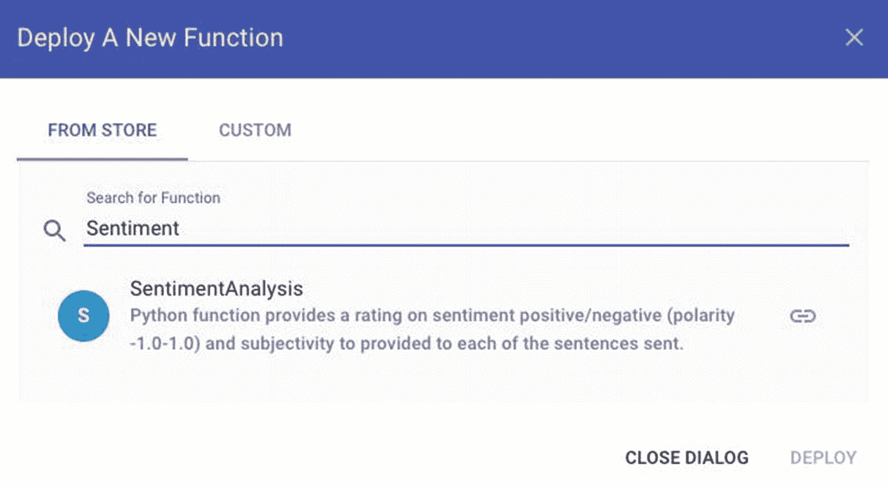

图 9-3

openfans 部署预建的情绪分析功能

部署 OpenFaaS 情绪分析功能后，从左侧导航中选择它。UI 门户在页面的上半部分显示功能的状态、副本、调用计数、映像和 URL(参见图 9-4 )。URL 是公开的端点。OpenFaaS 网关默认不保护函数端点； <sup>17</sup> 安全是功能本身的责任。OpenFaaS 文档通过使用 Kubernetes Secrets 实现 HMAC 安全性来指导开发自定义函数身份验证。 <sup>18</sup>

OpenFaaS UI 门户提供了一个方便的 web 表单，用于测试图 9-4 中显示的调用功能部分下部署的功能。或者，使用上一节中安装的`faas-cli`实用程序调用情绪分析功能:

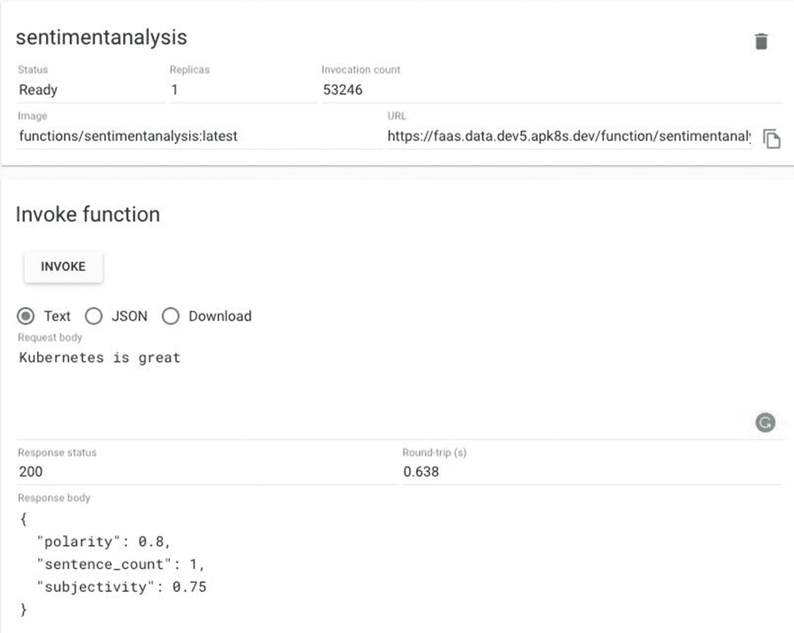

图 9-4

使用 OpenFaaS UI 门户测试情感分析功能

```
$ echo "Kubernetes is easy" | faas-cli invoke \
    sentimentanalysis -g https://faas.data.dev5.apk8s.dev/

```

最后，用 cURL 测试新函数的公共访问:

```
$ curl -X POST -d "People are kind" \
https://faas.data.dev5.apk8s.dev/function/sentimentanalysis

```

示例输出:

```
{"polarity": 0.6, "sentence_count": 1, "subjectivity": 0.9}

```

OpenFaaS 情绪分析功能是一个很好的例子，它是由 OpenFaaS 在 Kubernetes 上部署和管理的一个集中的、独立的处理逻辑。OpenFaaS 文档包含一组编写良好的关于构建、测试和实现函数的教程。 <sup>19</sup> 函数是持续扩展本书中开发的数据平台的一个伟大方式。下一节将介绍用于 ETL 类型操作的 Apache NiFi，并将情感分析功能的使用作为示例数据处理流程的一部分(参见图 9-5 )。

## 抽取、转换、加载至目的端（extract-transform-load 的缩写）

ETL(提取、转换、加载)的实践可以追溯到 20 世纪 70 年代。从一个来源提取数据并转换为另一个来源使用的需求是一个永恒的问题，今天有大量的现有技术来解决这个问题。Pentaho、 <sup>21</sup> Talend、 <sup>22</sup> CloverETL、 <sup>23</sup> 和 JasperETL <sup>24</sup> 是少数几个开源、社区驱动选项有限的商业产品。然而，ETL 是一个如此普遍的问题，以至于新的方法和通用的解决方案，如开源(厂商中立)Apache NiFi，因为易于使用和简单、直观的数据收集、路由和转换方法而越来越受欢迎。

### Apache 尼菲

Apache NiFi 是本书中描述的以数据为中心的平台的数据接收前端选择。" Apache NiFi 支持强大且可伸缩的数据路由、转换和系统中介逻辑的有向图." <sup>25</sup>

NiFi 附带了近 300 个独特的数据处理器，可用于收集、转换、处理和建模来自 Twitter、SMTP、HDFS、Redis、UDP、HBase 和 HTTP API 端点等不同来源的数据。 <sup>26</sup>

在本书出版时，在 Kubernetes 中运行 NiFi 的官方文档和支持很少。然而，NiFi 维护者意识到对一流 Kubernetes 支持需求的快速增长，读者应该期待在未来几年中对这一努力的重大贡献。

以下部分在 Kubernetes 中安装了一个多节点 Apache NiFi 集群，并演示了从 Twitter 中提取数据的流程，包括转换、处理和利用 OpenFaaS、Kafka 和 Elasticsearch，如图 9-5 所示。

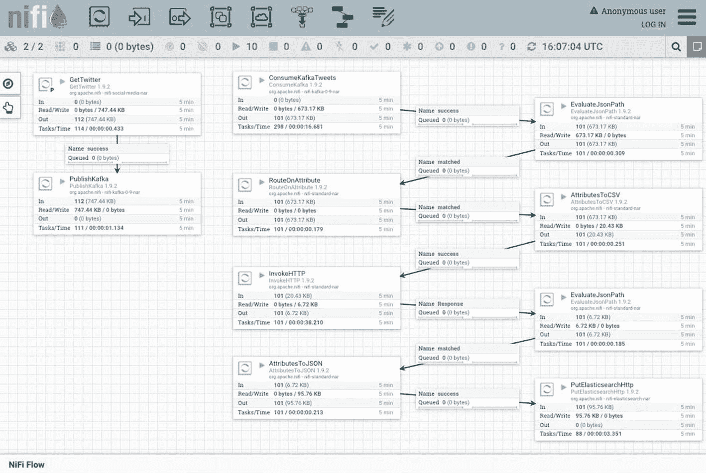

图 9-5

Apache NiFi 流概述

#### 安装 Apache NiFi

本节安装 Apache NiFi 和三个 Kubernetes 资源，包括一个 Headless 服务、StatefulSet 和 Ingress。回顾本章前面的“开发环境”部分，了解需求，包括入口 Nginx、Ceph 存储、证书管理器和 Apache Zookeeper。

虽然这本书有时会避免使用 Helm 安装，而是通过手工制作的清单来更详细地描述概念，但读者也应该考虑一下由 Cetic 编写的 Apache NiFi Helm 图表。 <sup>27</sup>

创建目录`cluster-apk8s-dev5/003-data/060-nifi`。在新的`060-nifi`目录中，从清单 9-2 中创建一个名为`10-service-headless.yml`的文件。下面定义的 StatefulSet 调用运行 apache/nifi:1.9.2 容器的 Pod `nifi`的两个副本。集群中的每个 NiFi 实例在引导时都需要一些定制配置。`command:`部分不允许运行标准的启动脚本，而是调用脚本中的 Bash 和 pipes 来根据 Kubernetes 分配给 Pod 的主机名定制一些属性。

```
apiVersion: v1
kind: Service
metadata:
  name: nifi
  namespace: data
  labels:
    app: nifi
  annotations:
    service.alpha.kubernetes.io/tolerate-unready-endpoints: "true"
spec:
  type: ClusterIP
     clusterIP: None
  selector:
    app: nifi
  ports:
  - port: 8080
    name: http
  - port: 6007
    name: cluster

Listing 9-2NiFi Headless Service

```

应用 NiFi Headless 服务配置:

```
$ kubectl apply -f 10-service-headless.yml

```

接下来，在清单 9-3 中的文件`40-statefulset.yml`中为 NiFi 创建一个 StatefulSet 配置。

```
apiVersion: apps/v1
kind: StatefulSet
metadata:
  name: nifi
  namespace: data
  labels:
    app: nifi
spec:
  replicas: 2
  revisionHistoryLimit: 1
  selector:
    matchLabels:
      app: nifi
  serviceName: nifi
  template:
    metadata:
      labels:
        app: nifi
    spec:
      affinity:
        podAntiAffinity:
          requiredDuringSchedulingIgnoredDuringExecution:
            - labelSelector:
                matchExpressions:
                  - key: "app"
                    operator: In
                    values:
                      - "nifi"
              topologyKey: "kubernetes.io/hostname"
      containers:
        - name: nifi
          imagePullPolicy: IfNotPresent
          image: apache/nifi:1.9.2
          command:
            - bash
            - -ce
            - |
              FQDN=$(hostname -f)
              PROP_FILE=${NIFI_HOME}/conf/nifi.properties

              p_repl () {
                echo "setting ${1}=${2}"
                sed -i -e "s|^$1=.*$|$1=$2|" ${PROP_FILE}
              }

              p_repl nifi.remote.input.host ${FQDN}
              p_repl nifi.cluster.is.node true
              p_repl nifi.cluster.node.protocol.port 6007
              p_repl nifi.cluster.node.address ${FQDN}
              p_repl nifi.cluster.protocol.is.secure false
              p_repl nifi.security.user.authorizer managed-authorizer
              p_repl nifi.web.http.host ${FQDN}
              p_repl nifi.web.http.port 8080
              p_repl nifi.zookeeper.connect.string ${NIFI_ZOOKEEPER_CONNECT_STRING}
              p_repl nifi.cluster.flow.election.max.wait.time "1 mins"

              tail -F "${NIFI_HOME}/logs/nifi-app.log" & exec bin/nifi.sh run
          env:
            - name: NIFI_ZOOKEEPER_CONNECT_STRING
              value: "zookeeper-headless:2181"
          ports:
            - containerPort: 8080
              name: http
              protocol: TCP
            - containerPort: 6007
              name: cluster
              protocol: TCP

Listing 9-3NiFi StatefulSet

```

应用 NiFi StatefulSet 配置:

```
$ kubectl apply -f 40-statefulset.yml

```

最后，在清单 9-4 中的文件`50-ingress.yml`中为 NiFi 创建一个入口配置。Apache NiFi 支持认证； <sup>28</sup> 然而，这需要它在 SSL 模式下运行，并且需要额外的组件配置来管理证书和入口。为了保持演示的简洁，入口配置使用存储在 Kubernetes Secret `sysop-basic-auth`中的基本 Auth 凭证来保护 NiFi。

```
apiVersion: extensions/v1beta1
kind: Ingress
metadata:
  name: nifi
  namespace: data
  annotations:
    cert-manager.io/cluster-issuer: letsencrypt-production
    nginx.ingress.kubernetes.io/auth-type: basic
    nginx.ingress.kubernetes.io/auth-secret: sysop-basic-auth
    nginx.ingress.kubernetes.io/auth-realm: "Authentication Required"
spec:
  rules:
    - host: nifi.data.dev3.apk8s.dev
      http:
        paths:
          - backend:
              serviceName: nifi
              servicePort: 8080
            path: /
  tls:
    - hosts:
       - nifi.data.dev3.apk8s.dev
      secretName: data-production-tls

Listing 9-4NiFi Ingress

```

应用 NiFi 入口配置:

```
$ kubectl apply -f 50-ingress.yml

```

浏览至 [`https://nifi.data.dev3.apk8s.dev/nifi`](https://nifi.data.dev3.apk8s.dev/nifi) ，打开用户界面左上角的全局菜单，选择项目集群，验证新的 NiFi 集群已启动并正在运行。查看运行节点列表，如图 9-6 所示。

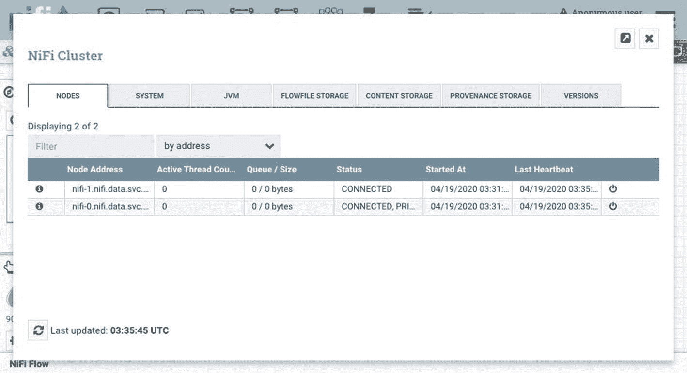

图 9-6

Apache NiFi 集群状态

下一节展示了一个 ETL/ELT 数据流水线的例子，它使用了本章前面安装的 OpenFaaS，以及前面章节介绍的 Apache Kafka、Elasticsearch 和 JupyterLab。

### ETL 数据流水线示例

ETL(提取、转换、加载)操作的传统示例可能会展示在大数据系统中收集和存储的数据的提取，如 HDFS 或任何种类的商业和开源数据湖以及传统或现代企业数据管理系统。虽然下面的例子演示了从 Twitter 中提取数据，但是应该很容易理解 NiFi 的各种预构建数据处理器的灵活性，并将这些基本功能应用于几乎所有 ETL 挑战。

这个例子需要 OpenFaaS 和本章前面安装的 SentimentAnalysis 函数；ApacheKafka，配置在第五章；以及在第六章中介绍的 Elasticsearch、Kibana、Keycloak 和 JupyterHub。

以下示例 ETL 数据流水线使用 NiFi Twitter 处理器从 Twitter 中提取消息，并将它们发布到 Apache Kafka 主题。随后，Kafka 处理器使用主题中的消息，准备并将其发送到 OpenFaaS SentimentAnalysis 函数，最后将结果存储在 Elasticsearch 索引中，以便在 JupyterLab 环境中进行分析。这个例子展示了 Kubernetes 如何在一个分布式、高可用、受监控和统一的控制面板中轻松管理所有必需的工作负载(见图 9-1 和 9-5 )。

#### NiFi 模板

Apache NiFi 为希望扩展其功能的用户、管理员和开发人员提供了详细的文档。 <sup>29 因此，为了快速演示其用法，以及利用本书中配置和安装的组件，可以在 [`https://github.com/apk8s/nifi-demo`](https://github.com/apk8s/nifi-demo) 找到一个预构建的模板。</sup>

克隆`apk8s/nifi-demo`存储库:

```
git clone git@github.com:apk8s/nifi-demo.git

```

在 [`https://nifi.data.dev3.apk8s.dev/nifi`](https://nifi.data.dev3.apk8s.dev/nifi) 浏览到正在运行的 NiFi 集群后，点击屏幕左侧操作面板中显示的模板上传按钮(见图 9-7 )。当出现提示时，上传在`apk8s/nifi-demo`库的`templates`目录中找到的文件`Twitter_Sentiment.xml`。

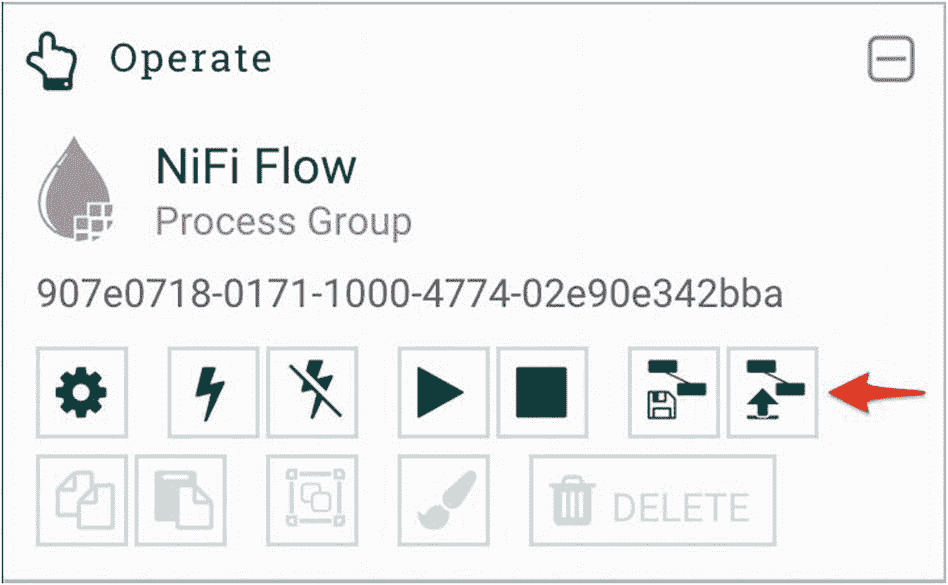

图 9-7

Apache NiFi 上传模板

上传模板后，将模板图标(三个相连的方框)从组件工具栏(顶部导航)拖动到画布(网格)中，如图 9-8 所示。在完成之前，模板组件向用户提示可用模板的列表；选择“Twitter 情绪 v2”并点击添加按钮。

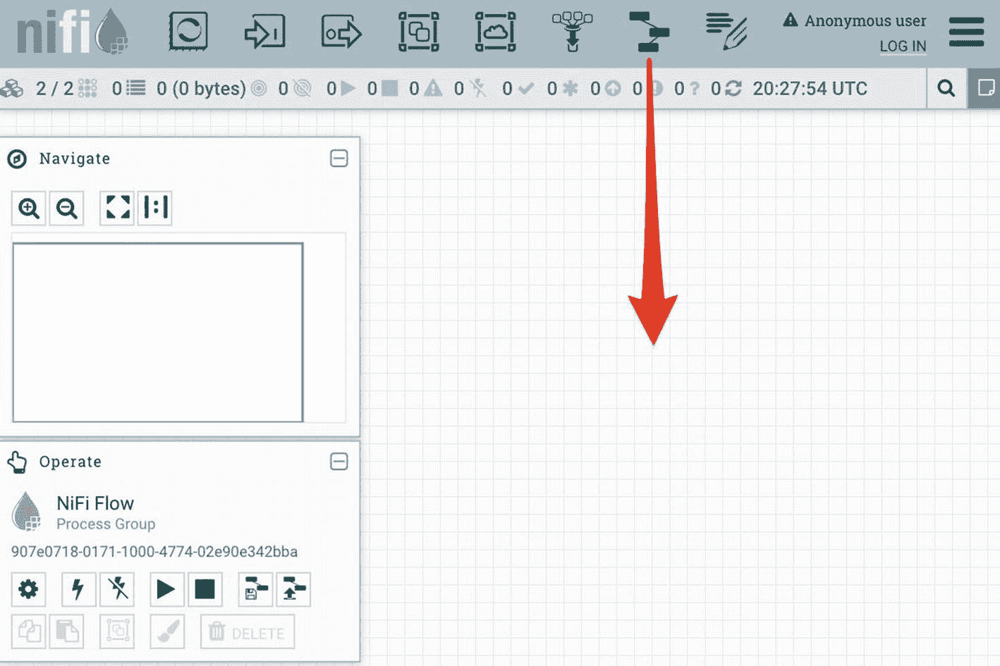

图 9-8

Apache NiFi 添加模板

添加模板后，画布现在包含 10 个 NiFi 处理器，如图 9-5 所示。模板提供的处理器被预先配置为利用前面章节中安装的组件，比如 Apache Kafka 和 Elasticsearch。双击任意处理器，并选择属性选项卡以查看其配置。

在激活新数据流之前，处理器*get witter*需要 Twitter 提供的消费者密钥、消费者秘密、访问令牌和访问令牌秘密。通过创建 Twitter 帐户、访问门户网站，然后从下拉导航中选择应用来生成这些值。 <sup>30</sup> 在 Twitter 开发者应用页面上， <sup>31</sup> 点击创建应用按钮，完成所需步骤。一旦 Twitter 批准了新的应用，检索图 9-9 所示的令牌、密钥和秘密。

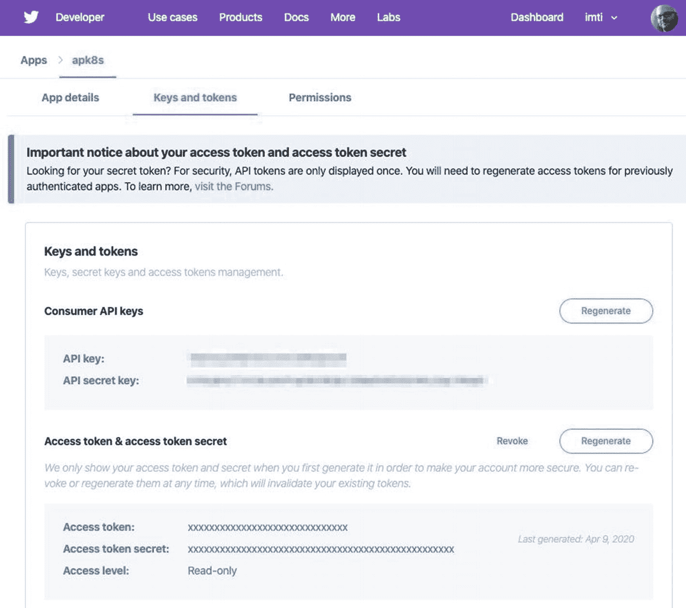

图 9-9

Apache NiFi Twitter 密钥和令牌

填充图 9-10 所示*get witter*处理器所需的值。

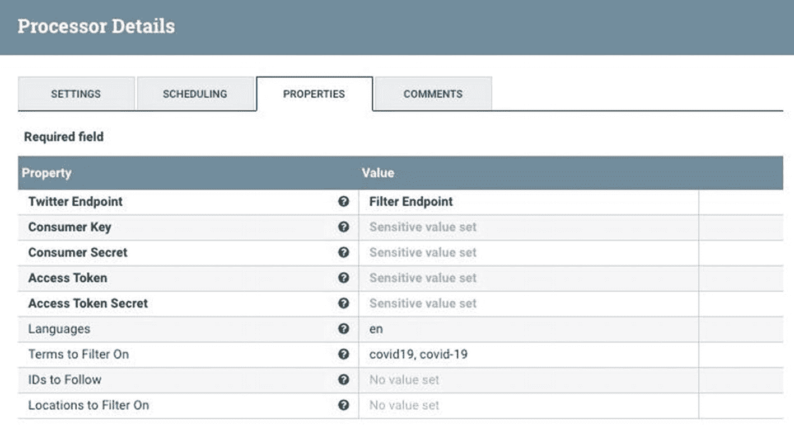

图 9-10

配置 Apache NiFi GetTwitter 处理器

新数据流已准备好运行。然而，Elasticsearch 是最终的端点，需要一个索引模板来适当地存储数据字段。下一节将向 Elasticsearch 添加一个索引模板。

#### 准备弹性搜索

模板提供的 NiFi 处理器`PutElasticsearchHttp`将最终处理的数据放入一个 Elasticsearch 索引中，匹配模式`sentiment-${now():format('yyyy-MM')}`，为一年中的每个月创建一个新的索引。`PutElasticsearchHttp`接收并放置由之前的处理器组装的 JSON 数据。这个 JSON 数据结构包含文本、数字和日期值。Elasticsearch 可以检测并自动设置数据类型，但它并不完美，容易被各种日期格式混淆。Elasticsearch 自然无法确定诸如数字零这样的值是整数还是浮点数。通过为 Elasticsearch 提供一个索引模板来实现正确的索引。 <sup>32</sup>

索引模板由基于 JSON 的配置组成，定义了一个或多个字段应该如何被索引。以下命令将端口转发弹性搜索并发布一个与处理后的数据所产生的数据类型相匹配的索引模板。

打开终端和端口转发弹性搜索:

```
$ kubectl port-forward elasticsearch-0 9200:9200 -n data

```

打开另一个终端，通过发出清单 9-5 中的命令发布索引模板。

```
cat <<EOF | curl -X POST \
-H "Content-Type: application/json" \
-d @- http://localhost:9200/_template/all
{
  "index_patterns": ["sentiment-*"],
  "settings": {
    "number_of_shards": 1
  },
  "mappings": {
    "_source": {
      "enabled": true
    },
    "properties": {
      "polarity": {
        "type": "float"
      },
      "subjectivity": {
        "type": "float"
      },
      "sentence_count": {
        "type": "integer"
      },
      "Content-Length": {
        "type": "integer"
      },
      "X-Start-Time": {
        "type": "date",
        "format": "epoch_millis"
      },
      "X-Duration-Seconds": {
        "type": "float"
      },
      "twitter.created_at": {
        "type": "date",
        "format": "EEE MMM dd HH:mm:ss Z yyyy",
        "null_value": ""
      },
      "Date": {
        "type": "date",
        "format": "EEE, dd MMM yyyy HH:mm:ss z"
      }
    }
  }
}

EOF
```

Listing 9-5HTTP post an Elasticsearch index template

```

Elasticsearch 现在能够正确地索引来自数据流的处理过的数据，该数据流由前一节中加载的 NiFi 模板定义。下面的部分启动数据流并查询处理后的数据。

#### 数据流

本章前面作为模板加载的示例 ETL 数据流水线从 Twitter 提取数据，并将其发布到 Apache Kafka 主题。另一组处理器消耗来自 Kafka 主题的数据，获得 Twitter 消息的文本，并将其发送到 OpenFaaS 情感分析功能。最后一组处理器将情感分析的结果与来自原始数据的字段结合起来，并将结果作为 JSON 发布到 Elasticsearch 进行索引。

Twitter 产生了高速、无休止的半结构化数据流，代表了典型的数据处理场景。在这个例子中使用 Apache Kafka 不是必须的，只是用来演示附加的 NiFi 处理器。然而，Kafka 的使用允许外部系统有机会对其数据事件流进行操作，从而为扩展流水线提供了更多的机会。

要启动新的数据流，单击 NiFi 画布(网格)上的任意位置，并通过单击 Operate Palette 提供的 play 按钮启动所有数据处理器。

几分钟后，打开终端，端口转发弹性搜索:

```
$ kubectl port-forward elasticsearch-0 9200:9200 -n data

```

打开另一个终端，通过发出清单 9-6 中的命令发布一个 Elasticsearch 查询。以下查询将情绪分析中最后一个小时的极性度量聚合到直方图桶中，从-1 到 1，每 0.5 个间隔一次。Elasticsearch 支持一组强大的聚合功能。<sup>T3】33T5】</sup>

```
cat <<EOF | curl -X POST \
-H "Content-Type: application/json" \
-d @- http://localhost:9200/sentiment-*/_search
{
  "size": 0,
  "aggs": {
    "polarity": {
      "histogram" : {
          "field" : "polarity",
          "interval" : 0.5,
          "extended_bounds" : {
              "min" : -1,
              "max" : 1
          }
      }
    }
  },
  "query": {
      "range": {
          "Date": {
              "gt": "now-1h"
          }
      }
  }
}
EOF

Listing 9-6HTTP post an Elasticsearch Sentiment Analysis query

```

示例结果(见清单 9-7 )显示，在过去的一个小时里，关于新冠肺炎的负面推特帖子`("doc_count": 40`是正面帖子`("doc_count": 4`的十倍。

```
{
  "took": 5,
  "timed_out": false,
  "_shards": {
    "total": 1,
    "successful": 1,
    "skipped": 0,
    "failed": 0
  },
  "hits": {
    "total": {
      "value": 2276,
      "relation": "eq"
    },
    "max_score": null,
    "hits": []
  },
  "aggregations": {
    "polarity": {
      "buckets": [
        {
          "key": -1,
          "doc_count": 40
        },
        {
          "key": -0.5,
          "doc_count": 404
        },
        {
          "key": 0,
          "doc_count": 1718
        },
        {
          "key": 0.5,
          "doc_count": 110
        },
        {
          "key": 1,
          "doc_count": 4
        }
      ]
    }
  }
}

Listing 9-7Example aggregation output from Elasticsearch Sentiment Analysis query

```

示例 ETL 数据流试图展示 Apache NiFi 提供的众多特性中的一小部分，以及 Kubernetes 为数据管理、存储和处理系统的近乎无缝的互连提供理想平台的能力。本书中的平台展示了 Kubernetes 对各种各样的应用的处理，从 NiFi、Elasticsearch 和 Kafka 等大型应用到无服务器功能，这些应用被包装在容器中，通过统一的网络和控制面板跨多个服务器进行部署、监控和管理。

下一节利用 JupyterLab 环境，展示实时实验和与平台数据交互的能力。

### 分析和程序控制

在第六章中安装和配置的 JupyterHub 提供了 JupyterLab 环境，方便了一个或多个直接在集群中运行的 Jupyter 笔记本的操作。以下两个练习演示了在 Elasticsearch 中索引数据的简单查询和可视化，以及以编程方式开发 NiFi 数据流的能力。

#### 分析和可视化

这个例子使用了 JupyterHub 提供的基于 Python 的 Jupyter 笔记本(见第六章)。当数据流入 Elasticsearch 时，它会立即被索引，并可通过其所有字段进行搜索。该示例从 Elasticsearch 索引中返回多达 10，000 条记录，以情绪开始，并且日期字段值在最后一个小时内。

打开一个新的基于 Python 的 Jupyter 笔记本，将下面的每个代码块添加到单独的单元格中。

通过向第一个单元添加以下命令来安装 Elasticsearch 包版本 7.6.0:

```
!pip install elasticsearch==7.6.0

```

导入`elasticsearch`、`pandas`和`matplotlib`:

```
from elasticsearch import Elasticsearch
import pandas as pd
from matplotlib import pyplot

```

创建一个连接到在 Kubernetes 名称空间数据中运行的 Elasticsearch 服务的 elasticsearch 客户端:

```
es = Elasticsearch(["elasticsearch.data"])

```

使用 Elasticsearch 客户端的搜索功能来查询索引模式“情绪-*”，并将结果存储在变量 response 中:

```
response = es.search(
    index="sentiment-*",
    body={
        "size": 10000,
        "query": {
            "range": {
                "Date": {
                    "gt": "now-1h"
                }
            }
        },
        "_source": [
            "Date",
            "polarity",
            "subjectivity" ],
    }
)

```

将 Elasticsearch 的回答映射并转置到 Pandas 数据框架中:

```
df = pd.concat(map(pd.DataFrame.from_dict,
                   response['hits']['hits']),
               axis=1)['_source'].T

```

将日期列转换为 Python 日期时间数据类型:

```
datefmt = '%a, %d %b %Y %H:%M:%S GMT'
df['Date'] = pd.to_datetime(df['Date'], format=datefmt)

```

将日期字段分配给数据帧索引，并将所有数值转换为浮点数:

```
df = df.set_index(['Date'])
df = df.astype(float)

```

打印前五条记录(如图 9-11 ):

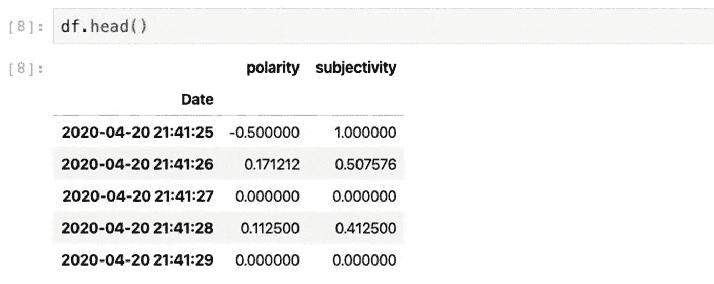

图 9-11

情感分析数据框架行示例

```
df.head()

```

最后，通过调用数据帧的绘图函数绘制情绪，将极性分配给 y 轴(见图 9-12 ):

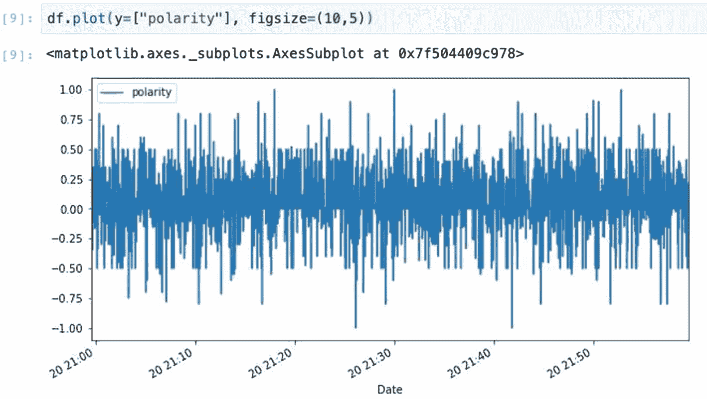

图 9-12

情感分析数据框架图

```
df.plot(y=["polarity"], figsize=(13,5))

```

前面的例子是数据分析和可视化的基本示例。数据科学家或分析师的第一步可能包括类似的任务，以形成对可用数据的粗略了解。机器学习等数据科学活动通常需要不可变/固定的数据集，以促进可重复的实验。将集群内 Jupyter 笔记本电脑与 MinIO 对象存储(在第七章中安装)以及事件队列、数据管理和 ETL 系统相连接的能力，为高效构建和共享这些有价值的数据集提供了许多机会。

Kubernetes 支持的 JupyterLab 环境提供了一个合适的平台，通过内部公开的 API(如 Apache NiFi)对集群资源进行交互式编程控制；下一节将介绍一个简单的例子。

#### 编程 NiFi

Apache NiFi 支持通过用 Java 编写的定制控制器和处理器进行扩展。然而，NiFi 强大的标准处理器意味着许多项目将会找到一套适用于多种情况的处理器。NiFi 功能的另一个扩展是通过 API， <sup>35</sup> 促进自动化和监控。本节包含一个创建 NiFi 进程组并使用单个处理器填充它的简短示例。

打开一个新的基于 Python 的 Jupyter 笔记本，将下面的每个代码块添加到单独的单元格中。

通过向第一个单元添加以下命令，安装 NiPyApi<sup>36</sup>Python 包版本 1.14.3:

```
!pip install nipyapi==0.14.3

```

导入包:

```
import nipyapi

```

用 API 端点配置 NiFi 客户机，在本例中是在`data`名称空间中的 Kubernetes 服务`nifi`:

```
api_url = "http://nifi.data:8080/nifi-api"
nipyapi.utils.set_endpoint(api_url)

```

通过检索群集中第一个节点的信息来测试客户端连接；图 9-13 描述了示例输出:

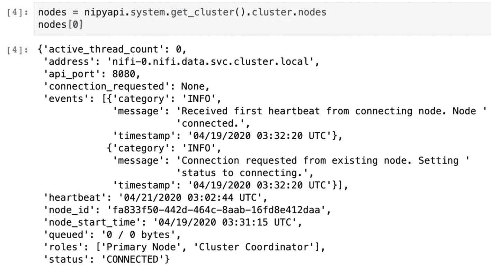

图 9-13

NiFi Python 客户端节点输出

```
nodes = nipyapi.system.get_cluster().cluster.nodes
nodes[0]

```

创建一个 NiFi 进程组 <sup>37</sup> ，并将其放置在画布上(在本章前面添加的处理器之上):

```
pg0id = nipyapi.canvas.get_process_group(
    nipyapi.canvas.get_root_pg_id(),
    'id'
)

pg0 = nipyapi.canvas.create_process_group(
    pg0id,
    "apk8s_process_group_0",
    location=(800.0, 200.0)
)

```

在使用前一个示例中的代码执行单元格后，访问 NiFi web 界面，注意前面添加的处理器上方的新`apk8s_process_group_0`进程组，如图 9-14 所示。双击新的流程组会显示一个空白的画布。

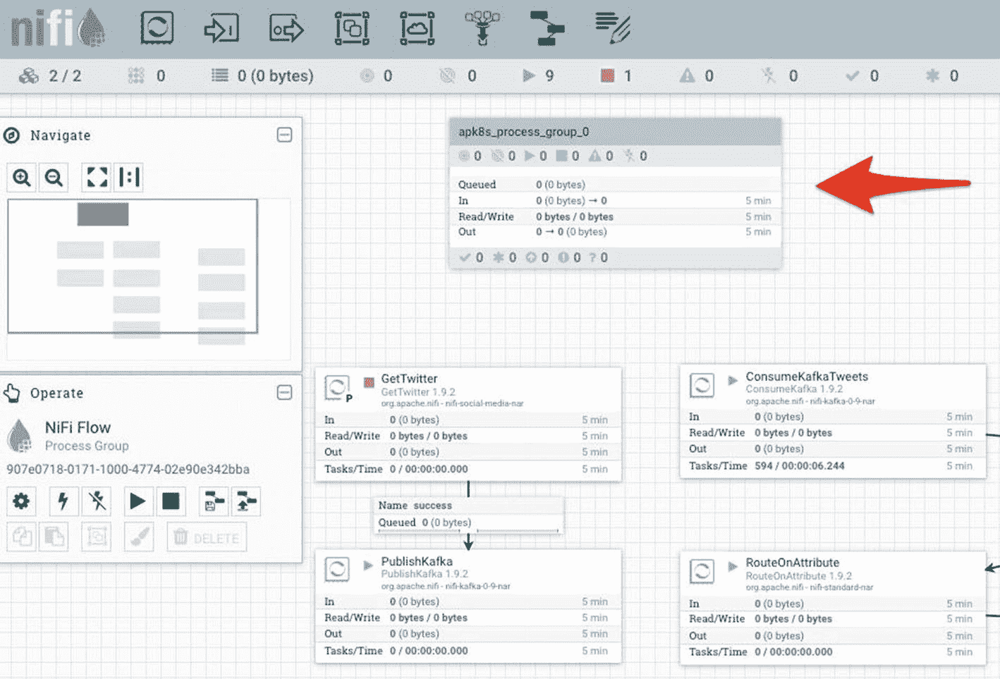

图 9-14

Python API 客户端添加的 NiFi 进程组

在之前创建的新 NiFi 进程组中创建一个 GenerateFlowFile<sup>38</sup>处理器，并将其放置在画布上:

```
gf = nipyapi.canvas.get_processor_type('GenerateFlowFile')

p0 = nipyapi.canvas.create_processor(
    parent_pg=pg0,
    processor=gf,
    location=(250.0, 0.0),
    name="apk8s_processor_0",
    config=nipyapi.nifi.ProcessorConfigDTO(
        scheduling_period='1s',
        auto_terminated_relationships=['success']
    )
)

```

在使用前面示例中的代码执行单元格后，访问 NiFi web 界面，双击新的流程组，并查看新创建的 GenerateFlowFile，如图 9-15 所示。

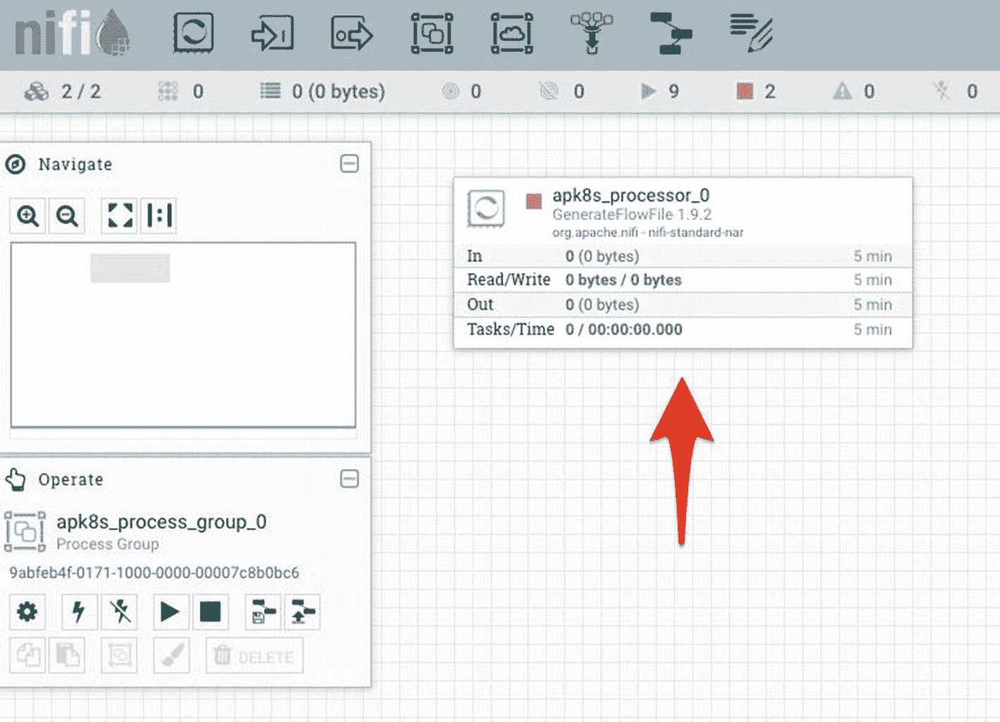

图 9-15

Python API 客户端添加的 NiFi 处理器

这个部分自动创建一个 NiFi 进程组和一个 NiFi GenerateFlowFile 处理器。这个例子展示了数据流开发的粒度方法。NiFi API 和 NiPyApi Python 包还支持模板的安装和配置，允许开发人员设计各种完整的数据流并将其保存为模板，如 Twitter 情感 v2(在本章前面添加)，使它们可用于编程配置、部署和监控。

## 摘要

本章安装了无服务器平台 OpenFaaS 和数据路由和转换平台 Apache NiFi(参见清单 9-8 )，展示了与前几章安装的其他数据管理组件的互连性，特别是 Apache Kafka、Elasticsearch 和 JupyterLab。本章展示了 Twitter 消息的提取、转换、加载、处理和分析，所有这些都不需要定制代码，但提供了许多代码扩展方法，从为 OpenFaaS 编写定制(无服务器)函数，到通过 JupyterLab 中的 Python 与 Elasticsearch、Kafka 和 NiFi 交互。

本书旨在展示在 Kubernetes 上快速组装、管理和监控数据平台的简易性。与 Kubernetes 的集成程度非常广泛。OpenFaaS 和 JupyterHub 等软件利用 Kubernetes API 本身来部署和扩展 pod，而 NiFi 等其他软件在运行时并不了解 Kubernetes。

本书中开发的 Kubernetes 数据平台运行在一个小规模、资源受限、四节点的开发集群上，每天只需花费几美元。然而，这个小集群涵盖了许多基本的数据处理概念，包括数据事件、索引、处理、数据库、数据湖、数据仓库、分布式查询执行、现代 ETL 操作和数据科学环境。这些能力对于希望收集、处理和分析各种数据的组织来说是必不可少的。物联网和机器学习是对数据管理有大量需求的概念的例子，从高速实时非结构化和半结构化数据的收集到用于训练和提炼机器学习模型的经过处理、标准化、结构良好的数据目录。

```
./009-cluster-apk8s-dev5
├── 000-cluster
├── 003-data
│   ├── 000-namespace
│   ├── 005-keycloak
│   ├── 010-zookeeper
│   ├── 020-kafka
│   ├── 030-elasticsearch
│   ├── 032-logstash
│   ├── 034-kibana
│   ├── 050-mqtt
│   ├── 060-cassandra
│   ├── 070-minio
│   ├── 080-mysql
│   ├── 085-hive
│   ├── 095-presto
│   ├── 100-jupyterhub
│   ├── 120-openfaas
│   └── 150-nifi
└── 005-data-lab
    └── 000-namespace

Listing 9-8Organization of Kubernetes-based data platform components

```

<aside aria-label="Footnotes" class="FootnoteSection" epub:type="footnotes">Footnotes 1

[T2`https://aws.amazon.com/lambda/`](https://aws.amazon.com/lambda/)

  2

[T2`https://azure.microsoft.com/en-us/services/functions/`](https://azure.microsoft.com/en-us/services/functions/)

  3

[T2`https://cloud.google.com/functions/docs/`](https://cloud.google.com/functions/docs/)

  4

[T2`www.ibm.com/cloud/functions`](http://www.ibm.com/cloud/functions)

  5

[T2`https://openwhisk.apache.org/`](https://openwhisk.apache.org/)

  6

[T2`https://kubeless.io/`](https://kubeless.io/)

  7

[T2`www.openfaas.com/`](http://www.openfaas.com/)

  8

[T2`https://knative.dev/`](https://knative.dev/)

  9

[T2`https://ffmpeg.org/`](https://ffmpeg.org/)

  10

[T2`https://imagemagick.org/`](https://imagemagick.org/)

  11

[T2`https://kubernetes.io/docs/concepts/services-networking/service/#publishing-services-service-types`](https://kubernetes.io/docs/concepts/services-networking/service/%2523publishing-services-service-types)

  12

古普塔沙申克。"情感分析:概念、分析和应用."中等，2018 年 1 月 19 日。 [`https://towardsdatascience.com/sentiment-analysis-concept-analysis-and-applications-6c94d6f58c17`](https://towardsdatascience.com/sentiment-analysis-concept-analysis-and-applications-6c94d6f58c17) 。

  13

科萨科夫斯卡、阿加塔、阿格尼耶斯卡·兰多芙斯卡、马留什·什沃奇、维奥莱塔·什沃奇和米哈尔·罗贝尔。"情感识别及其应用."智能系统和计算进展 300(2014 年 7 月 1 日):51–62。 [`https://doi.org/10.1007/978-3-319-08491-6_5`](https://doi.org/10.1007/978-3-319-08491-6_5) 。

  14

分析 Vidhya。“使用主题建模挖掘在线评论的 NLP 方法”，2018 年 10 月 16 日。 [`www.analyticsvidhya.com/blog/2018/10/mining-online-reviews-topic-modeling-lda/`](http://www.analyticsvidhya.com/blog/2018/10/mining-online-reviews-topic-modeling-lda/) 。

  15

[T2`https://github.com/openfaas/faas/tree/master/sample-functions/SentimentAnalysis`](https://github.com/openfaas/faas/tree/master/sample-functions/SentimentAnalysis)

  16

[T2`https://textblob.readthedocs.io/en/dev/`](https://textblob.readthedocs.io/en/dev/)

  17

[T2`https://docs.openfaas.com/reference/authentication/#for-functions`](https://docs.openfaas.com/reference/authentication/%2523for-functions)

  18

[T2`https://github.com/openfaas/workshop/blob/master/lab11.md`](https://github.com/openfaas/workshop/blob/master/lab11.md)

  19

[T2`https://github.com/openfaas/workshop`](https://github.com/openfaas/workshop)

  20

健康催化剂。“医疗保健信息系统:过去、现在和未来”，2014 年 5 月 20 日。 [`www.healthcatalyst.com/insights/healthcare-information-systems-past-present-future`](http://www.healthcatalyst.com/insights/healthcare-information-systems-past-present-future) 。

  21

[T2`https://wiki.pentaho.com/`](https://wiki.pentaho.com/)

  22

[T2`www.talend.com/products/talend-open-studio`](http://www.talend.com/products/talend-open-studio)

  23

[T2`www.cloverdx.com/`](http://www.cloverdx.com/)

  24

[T2`https://community.jaspersoft.com/project/jaspersoft-etl`](https://community.jaspersoft.com/project/jaspersoft-etl)

  25

[T2`https://nifi.apache.org/`](https://nifi.apache.org/)

  26

[T2`https://nifi.apache.org/docs.html`](https://nifi.apache.org/docs.html)

  27

[T2`https://github.com/cetic/helm-nifi`](https://github.com/cetic/helm-nifi)

  28

[T2`https://nifi.apache.org/docs/nifi-docs/html/administration-guide.html#user_authentication`](https://nifi.apache.org/docs/nifi-docs/html/administration-guide.html%2523user_authentication)

  29

[T2`https://nifi.apache.org/docs.html`](https://nifi.apache.org/docs.html)

  30

[T2`https://developer.twitter.com/en`](https://developer.twitter.com/en)

  31

[T2`https://developer.twitter.com/en/apps`](https://developer.twitter.com/en/apps)

  32

[T2`www.elastic.co/guide/en/elasticsearch/reference/current/indices-templates.html`](http://www.elastic.co/guide/en/elasticsearch/reference/current/indices-templates.html)

  33

[T2`www.elastic.co/guide/en/elasticsearch/reference/current/search-aggregations.html`](http://www.elastic.co/guide/en/elasticsearch/reference/current/search-aggregations.html)

  34

[T2`https://medium.com/hashmapinc/creating-custom-processors-and-controllers-in-apache-nifi-e14148740ea`](https://medium.com/hashmapinc/creating-custom-processors-and-controllers-in-apache-nifi-e14148740ea)

  35

[T2`https://nifi.apache.org/docs/nifi-docs/rest-api/index.html`](https://nifi.apache.org/docs/nifi-docs/rest-api/index.html)

  36

[T2`https://github.com/Chaffelson/nipyapi`](https://github.com/Chaffelson/nipyapi)

  37

[T2`https://nifi.apache.org/docs/nifi-docs/html/user-guide.html#process_group_anatomy`](https://nifi.apache.org/docs/nifi-docs/html/user-guide.html%2523process_group_anatomy)

  38

[T2`https://nifi.apache.org/docs/nifi-docs/components/org.apache.nifi/nifi-standard-nar/1.11.4/org.apache.nifi.processors.standard.GenerateFlowFile/index.html`](https://nifi.apache.org/docs/nifi-docs/components/org.apache.nifi/nifi-standard-nar/1.11.4/org.apache.nifi.processors.standard.GenerateFlowFile/index.html)

 </aside>