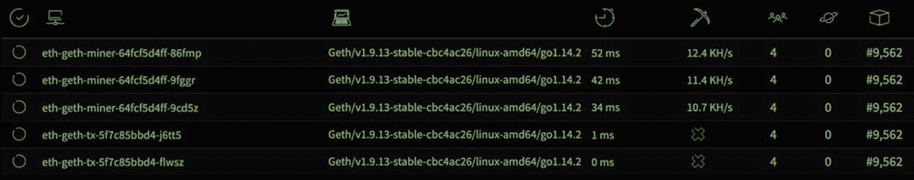

# 十、平台化区块链

区块链是一个概念，能够维护分散和不可信的交易数据库。2009 年发布的比特币网络 <sup>1</sup> 通过实现一种在共享公共账本上生成和交易加密货币的方法，普及了区块链技术。尽管比特币仍然是最受欢迎的加密货币形式，但新的区块链技术已经崛起，将功能扩展到货币兑换之外。

这本书关注以太坊，比特币最成功的替代品之一。虽然比特币对智能合约有一些能力，但以太坊原生支持从 Solidity 编译的分布式应用的存储和执行，Solidity 是其用于智能合约的 DSL(域特定语言)。

以业务为中心的区块链技术越来越多，包括 Hyperledger Fabric、 <sup>3</sup> Corda、 <sup>4</sup> 和 Quorum。 <sup>5</sup> 这些区块链应用直接关注许可或私有的区块链网络，是一些组织的绝佳选择。然而，以太坊 <sup>6</sup> 支持私有和许可的区块链及其巨大成功的公共网络。 <sup>7</sup> 开发基于 Solidity 的 <sup>8</sup> 应用意味着可以移植到任何以太坊实现:公共的、私有的或许可的。许可以太网将在本章后面讨论。

这本书实现了一个封闭的、私有的以太坊网络，适合实验和开发。由于一方控制节点的一致性，私有集中式以太网几乎没有生产应用。开发环境如 Truffle Suite 为个人开发者提供了优秀的交钥匙解决方案；然而，运行私有以太网有助于理解公共网络，并提供一个受控的多租户开发环境。

## 私有区块链平台

本章重点介绍构建一个私有以太坊区块链网络，其操作类似于全球公共以太坊网络。在 Kubernetes 中运行 Ethereum 节点，无论是公共的、私有的还是受保护的，都可以提供这个优雅的应用平台的所有优势，包括统一的网络和控制面板、容错和自修复、声明式配置、监控以及跨大量服务器扩展的工作负载的透明分布。

图 10-1 代表了本章的一个高级目标，通过无服务器功能(使用 OpenFaaS)的应用开发和多租户 JupyterHub 提供的 Jupyter 笔记本的实验和开发，使以太坊节点平台化并与之交互。Kubernetes 促进了这些不同应用的混合，并为组装支持新技术的奇异平台提供了许多机会。


图 10-1

区块链网络开发平台

图 10-1 表示在数据平台的背景下汇集在一起的无服务器、区块链和数据科学环境。

## 发展环境

以下区块链开发平台利用了第六章中首次提到的廉价 Hetzner 集群，包括一个用于 Kubernetes 主节点的 CX21 (2 个 vCPU/8G RAM/40G SSD)和四个用于 worker 节点的 CX41 (4 个 vCPU/16G RAM/160G SSD)实例。任何等效的基础设施都将适应以下练习。

本章创建了一个名为`eth`的新 Kubernetes 集群，并利用了第 3 、 5 和 6 章中安装的应用和集群配置(如表 10-1 中所述)。本章将所有配置清单组织在文件夹`cluster-apk8s-eth`下。

表 10-1

从前面章节收集的关键应用和配置

<colgroup><col class="tcol1 align-left"> <col class="tcol2 align-left"> <col class="tcol3 align-left"></colgroup> 
|   | 

资源

 | 

组织

 |
| --- | --- | --- |
| 第三章 | 进入证书管理器仓库监视 | `000-cluster/00-ingress-nginx``000-cluster/10-cert-manager``000-cluster/20-rook-ceph``000-cluster/30-monitoring` |
| 第五章 | 命名空间 | `003-data/000-namespace` |
| 第六章 | 凯克洛克 JupyterHub | `003-data/005-keycloak``005-data-lab/000-namespace``003-data/100-jupyterhub` |
| 第九章 | OpenFaaS | `003-data/120-openfaas` |

## 私有以太网

下面几节组装一个以太坊区块链开发集群(见图 10-2 )，模仿一个公共以太坊网络的一般操作。公共、私有或许可系统的基本组件是相同的。

Miner 节点(也称为 Full 节点)是以太网的核心组件。以太坊节点可以是实现以太坊协议的任何应用。本章使用 Go 中开发的 Geth， <sup>9</sup> 作为以太坊协议最初的三个实现之一。Geth 提供了一个独立的二进制文件和一个开源库，适合构建实现以太坊协议的定制应用/节点。本章使用包装在容器(`ethereum/client-go`)中的 Geth 二进制文件，表示三种类型的节点:boot nodes(Geth 包中的一个单独的二进制文件)、矿工和事务节点。


图 10-2

私有以太网

以太坊是一个点对点的节点网络，使用已建立的启动节点 <sup>10</sup> 将新节点连接到网络。boot nodes<sup>11不挖掘或提交事务；它们只负责初始对等体发现。Geth 附带一个主网络和测试网络 Bootnode 地址列表；但是，本章中的私有以太坊网络要求 Geth 使用本地 Bootnodes。本章使用 Bootnode 注册服务来提供本地 boot node 的地址。</sup>

事务节点是可选的；任何节点，包括矿工，都可以提交预先设计的交易，以纳入区块链。矿工节点使用附属以太坊账户 <sup>12</sup> 来签署他们的交易；允许远程连接到这些节点为任何人提供了提交由矿工签名的事务的访问权。交易节点只能发送由最终用户签名的交易，因为没有附加的私人帐户。

最后，Geth 提供了向 API 端点报告其当前状态和指标的能力。本章利用 Ethstats 项目 <sup>13</sup> 来收集节点指标，并将它们呈现在 web 仪表板上。

### 根节点

以太坊引导节点通过提供一组初始对等点来帮助新节点引导到以太坊网络中。Bootnodes 是以太坊客户端实现的子集，只参与网络节点发现协议。Bootnodes 不实现任何更高级别的以太坊应用协议。

以下配置设置了 eth-bootnode 服务。对这个无头服务的 DNS 请求返回匹配选择器`app: eth-bootnode`的任何 pod 的内部主机名。这个服务可以方便地为 Bootnodes 生成注册表，这将在下一节中介绍。

创建目录`cluster-apk8s-eth/003-data/200-eth/10-bootnode`。在新的`10-bootnode`目录中，从清单 10-1 中创建一个名为`10-service.yml`的文件。

```
apiVersion: v1
kind: Service
metadata:
  name: eth-bootnode
  namespace: data
  labels:
    app: eth-bootnode
spec:
  selector:
    app: eth-bootnode
  clusterIP: None
  ports:
    - name: discovery
      port: 30301
      protocol: UDP
    - name: http
      port: 8080

Listing 10-1Bootnode Service

```

应用以太坊 Bootnode 服务配置:

```
$ kubectl apply -f 10-service.yml

```

接下来，在清单 10-2 中的文件`30-deployment.yml`中为以太坊引导节点创建一个部署。以下 Bootnode 部署由两个容器和一个用于初始化的容器组成。初始化容器生成一个密钥，并将其存储在与 Pod 中的其他容器共享的卷挂载`data`中。Bootnode 使用该密钥创建其 enode 标识符(以太坊节点的唯一 ID)。

这两个容器中的第一个是 Ethereum Bootnode，它安装在初始化容器中生成的密钥，并在端口 30301/UDP 上通信。第二个容器名为`bootnode-server`，使用 netcat 执行一个小 shell 脚本，通过端口 8080 回显 Bootnode 的完整以太坊地址。 <sup>14</sup> 完整地址由 enode 标识符、IP 地址和端口组成。下一节中的 Bootnode 注册器使用 headless 服务(在上一节中配置)来发现 Bootnode Pods，然后通过 HTTP 端口 8080 检索它们的每个以太网地址，由`bootnode-server`容器提供服务。

```
apiVersion: apps/v1
kind: Deployment
metadata:
  name: eth-bootnode
  namespace: data
  labels:
    app: eth-bootnode
spec:
  replicas: 2
  revisionHistoryLimit: 1
  selector:
    matchLabels:
      app: eth-bootnode
  template:
    metadata:
      labels:
        app: eth-bootnode
    spec:
      volumes:
        - name: data
          emptyDir: {}
      initContainers:
        - name: genkey
          image: ethereum/client-go:alltools-v1.9.13
          imagePullPolicy: IfNotPresent
          command: ["/bin/sh"]
          args:
            - "-c"
            - "bootnode --genkey=/etc/bootnode/node.key"
          volumeMounts:
            - name: data

              mountPath: /etc/bootnode
      containers:
        - name: bootnode
          image: ethereum/client-go:alltools-v1.9.13
          imagePullPolicy: IfNotPresent
          resources:
            limits:
              cpu: ".5"
            requests:
              cpu: "0.25"
          command: ["/bin/sh"]
          args:
            - "-c"
            - "bootnode --nodekey=/etc/bootnode/node.key --verbosity=4"
          volumeMounts:
            - name: data
              mountPath: /etc/bootnode
          ports:
            - name: discovery
              containerPort: 30301
              protocol: UDP
        - name: bootnode-server
          image: ethereum/client-go:alltools-v1.9.13
          imagePullPolicy: IfNotPresent
          command: ["/bin/sh"]
          args:
            - "-c"
            - "while [ 1 ]; do echo -e \"HTTP/1.1 200 OK\n\nenode://$(bootnode -writeaddress --nodekey=/etc/bootnode/node.key)@$(POD_IP):30301\" | nc -l -v -p 8080 || break; done;"
          volumeMounts:
            - name: data
              mountPath: /etc/bootnode
          env:
            - name: POD_IP
              valueFrom:
                fieldRef:
                  fieldPath: status.podIP
          ports:
            - containerPort: 8080

Listing 10-2Bootnode Deployment

```

该集群现在包含两个以太坊启动节点；然而，新的以太坊节点需要完整的 enode 地址(`enode://ENODE_IDENTIFIER@POD_IP:30301`)才能使用。如前所述，Kubernetes headless 服务 eth-bootnode 提供各个节点的主机名，而容器`bootnode-server`通过 HTTP 在端口 8080 上报告其 enode 地址。下一节中定义的 Bootnode 注册器结合了这两个操作。

### bootmode registrar(引导模式注册)

Bootnode 注册器是一个小型 Golang 应用，用于查找由`eth-bootnode` headless 服务公开的 DNS 条目，查询每个 Pod 的 enode 地址，并通过一个简单的 HTTP 请求返回一个逗号分隔的字符串。后面的部分用这个 Bootnode 注册器的 enode 地址串配置每个 Geth 节点。

Note

潘石屹 <sup>15</sup> 写了 Bootnode 注册商申请，<sup>16</sup>连同 Kubernetes 以太坊的掌 Helm 图。 <sup>17</sup> 本章的概念和灵感来自这些项目和微软开发者博客文章*构建私有以太坊联盟*。 <sup>18</sup>

创建目录`cluster-apk8s-eth/003-data/200-eth/20-bootnode-reg`。在新的`20-bootnode-reg`目录中，从清单 10-3 中创建一个名为`10-service.yml`的文件。

```
apiVersion: v1
kind: Service
metadata:
  name: eth-bootnode-registrar
  namespace: data
  labels:
    app: eth-bootnode-registrar
spec:
  selector:
    app: eth-bootnode-registrar
  type: ClusterIP
  ports:
    - port: 80
      targetPort: 9898

Listing 10-3Bootnode Registrar Service

```

应用以太坊 Bootnode Regis.trar 服务配置:

```
$ kubectl apply -f 10-service.yml

```

接下来，在清单 10-4 中名为`30-deployment.yml`的文件中为以太坊 Bootnode 注册器创建一个部署。

```
apiVersion: apps/v1
kind: Deployment
metadata:
  name: eth-bootnode-registrar
  namespace: data
  labels:
    app: eth-bootnode-registrar
spec:
  replicas: 1
  revisionHistoryLimit: 1
  selector:
    matchLabels:
      app: eth-bootnode-registrar
  template:
    metadata:
      labels:
        app: eth-bootnode-registrar
    spec:
      containers:
        - name: bootnode-registrar
          image: jpoon/bootnode-registrar:v1.0.0
          imagePullPolicy: IfNotPresent
          env:
            - name: BOOTNODE_SERVICE
              value: "eth-bootnode.data.svc.cluster.local"
          ports:
            - containerPort: 9898

Listing 10-4Bootnode Deployment

```

Kubernetes 集群现在包含一个 Bootnode 注册服务。稍后，Geth miner 和事务节点部署在初始化时调用此服务，以提供 Ethereum Bootnode 地址列表。

### Ethstats

Geth 节点在配置了 Ethstats 端点时会发出度量。本节配置的 Ethstats web dashboard<sup>19</sup>摄取以太坊指标并呈现在一个有吸引力的 web 界面 <sup>20</sup> (如图 10-3 )。本节设置稍后在提供给 Geth 节点的命令行参数中使用的 Ethstats 服务、部署和机密。


图 10-3

ethstats.net 以太坊网络统计

创建目录`cluster-apk8s-eth/003-data/200-eth/30-ethstats`。在新的`30-ethstats`目录中，从清单 10-5 中创建一个名为`10-service.yml`的文件。

```
apiVersion: v1
kind: Service
metadata:
  name: eth-ethstats
  namespace: data
  labels:
    app: eth-ethstats
spec:
  selector:
    app: eth-ethstats
  type: ClusterIP
  ports:
    - port: 8080
      targetPort: http

Listing 10-5Ethstats Service

```

应用 Ethstats 服务配置:

```
$ kubectl apply -f 10-service.yml

```

接下来，在清单 10-6 中的一个名为`15-secret.yml`的文件中为 Ethstats 创建一个秘密。

```
apiVersion: v1
kind: Secret
metadata:
  name: eth-ethstats
  namespace: data
  labels:
    app: eth-ethstats
type: Opaque
stringData:
  WS_SECRET: "uGYQ7lj55FqFxdyIwsv1"

Listing 10-6Ethstats Secret

```

应用 Ethstats 服务配置:

```
$ kubectl apply -f 15-secret.yml

```

接下来，在清单 10-7 中的一个名为`30-deployment.yml`的文件中为 Ethstats 创建一个部署。

```
apiVersion: apps/v1
kind: Deployment
metadata:
  name: eth-ethstats
  namespace: data
  labels:
    app: eth-ethstats
spec:
  replicas: 1
  revisionHistoryLimit: 1
  selector:
    matchLabels:
      app: eth-ethstats
  template:
    metadata:
      labels:
        app: eth-ethstats
    spec:
      containers:
        - name: ethstats
          image: ethereumex/eth-stats-dashboard:v0.0.1
          imagePullPolicy: IfNotPresent
          ports:
            - name: http
              containerPort: 3000
          env:
            - name: WS_SECRET
              valueFrom:
                secretKeyRef:
                  name: eth-ethstats
                  key: WS_SECRET

Listing 10-7Ethstats Deployment

```

应用 Ethstats 部署配置:

```
$ kubectl apply -f 30-deployment.yml

```

接下来，在清单 10-8 中的一个名为`50-ingress.yml`的文件中为 Ethstats 创建一个入口配置。

```
apiVersion: networking.k8s.io/v1beta1
kind: Ingress
metadata:
  name: eth-ethstats
  namespace: data
  labels:
    app: eth-ethstats
  annotations:
    cert-manager.io/cluster-issuer: letsencrypt-production
spec:
  rules:
    - host: stats.data.eth.apk8s.dev
      http:
        paths:
          - backend:
              serviceName: eth-ethstats
              servicePort: 8080
            path: /
  tls:
    - hosts:
        - stats.data.eth.apk8s.dev
      secretName: eth-ethstats-production-tls

Listing 10-8Ethstats Ingress

```

应用 Ethstats 入口配置:

```
$ kubectl apply -f 50-ingress.yml

```

最后，在网络浏览器中访问 [`https://stats.data.eth.apk8s.dev`](https://stats.data.eth.apk8s.dev) 。在 Geth 节点按照以下部分中的配置开始报告之前，应该没有数据。

### Geth 矿工

本书不探究以太坊协议的细节。不过这一节和下一节安装了 Geth 支持的两种以太坊节点:矿工节点 <sup>21</sup> 和事务节点。以太网上的所有节点都进行对等通信，共享网络拓扑、区块链状态和事务。Miner 节点致力于在由任何未决事务组成的区块链上创建新的区块。 <sup>22</sup>

创建目录`cluster-apk8s-eth/003-data/200-eth/40-miner`。在新的`40-miner`目录中，从清单 10-9 中创建一个名为`15-secret.yml`的文件。Geth 矿工需要一个以太坊帐户，用于签署交易和接收采矿奖励。一个初始化容器，稍后在每个 Geth 部署中定义，用清单 10-9 中定义的密码创建一个以太坊帐户。

```
apiVersion: v1
kind: Secret
metadata:
  name: eth-geth-miner
  namespace: data
  labels:
    app: eth-geth-miner
type: Opaque
stringData:
  accountsecret: "strongpassword"

Listing 10-9Geth Secret

```

应用 Geth Secret 配置:

```
$ kubectl apply -f 15-secret.yml

```

按照在线安装文档在本地工作站上安装 Geth。 <sup>23</sup> Geth 提供所有主流操作系统和大部分软件包管理系统的安装程序。例如，装有自制软件的 MAC 可能会发出这样的命令:

```
$ brew install geth.

```

创建两个或更多以太坊账户。以下配置图中定义的以太坊起源文件指示新的区块链向这些账户(在第一个区块中)预注入指定数量的以太坊(以太坊加密货币)以供在专用网络中使用。

```
$ geth account new

```

使用`geth account new`命令创建多个帐户后，从输出中复制并保存“密钥的公共地址:”。接下来，在清单 10-10 中名为`20-configmap.yml`的文件中为 Geth 创建一个 ConfigMap。用新创建的账户更新`genesis.json`的`alloc`部分。

清单 10-10 中的 ConfigMap 中定义的`genesis.json`文件配置以太坊区块链的第一个区块。任何希望加入私有网络的节点必须首先根据这个以太坊起源文件进行初始化。 <sup>24</sup> 下面描述的 miner 和 transaction 节点都被配置为挂载在 ConfigMap 中定义为 key 的 genesis.json 文件(清单 10-10 )。

```
apiVersion: v1
kind: ConfigMap
metadata:
  name: eth-geth
  namespace: data
  labels:
    app: eth-geth
data:
  networkid: "27587"
  genesis.json: |-
    {
        "config": {
            "chainId": 27587,
            "homesteadBlock": 0,
            "eip150Block": 0,
            "eip155Block": 0,
            "eip158Block": 0
        },
        "difficulty": "0x400",
        "gasLimit": "0x8000000",
        "nonce"   : "0x0000000000000000",
        "alloc": {
          "0xFa4087D3688a289c9C92e773a7b46cb9CCf80353": { "balance": "100000000000000000000" },
          "0x8ab8F3fc6c660d3f0B22490050C843cafd2c0AAC": { "balance": "200000000000000000000" }
        }
    }

Listing 10-10Geth ConfigMap

```

应用 Geth 配置映射配置:

```
$ kubectl apply -f 20-configmap.yml

```

接下来，在清单 10-11 中名为`30-deployment.yml`的文件中为 Geth 创建一个部署配置。清单 10-11 中的 Geth miner 部署建立了一个由所有容器挂载的`data`卷，以及一个先前从清单 10-10 中的配置映射应用的配置卷。

第一个初始化容器`init-genesis`针对从 ConfigMap 挂载的 Genesis 文件运行 Geth `init`命令，并在挂载为`/root/.ethereum`的共享`data`卷中创建新的以太坊区块链数据库。

第二个初始化容器`create-account`使用清单 10-9 中应用的秘密`eth-geth-miner`中定义的密码为 Geth miner 创建一个唯一的以太坊账户。Geth 将新的以太坊账户存储在`/root/.ethereum`中，挂载为共享的`data`卷。

最后的初始化容器`get-bootnodes`运行一个小的 shell 脚本，试图通过调用本章前面配置的 Bootnode 注册器的`curl`来检索 boot node 列表。如果成功，`curl`调用的输出将返回的(用逗号分隔的)bootnodes 列表写入安装在共享卷`data`中的文件`/geth/bootnodes`。

初始化后，`eth-geth-miner`部署中定义的 pod 启动`geth-miner`容器并挂载共享卷`data` ( `/root/.ethereum`)，其中初始化容器初始化区块链数据库，创建以太坊帐户，并存储一个包含 Bootnode 地址列表的文件。`geth-miner`容器使用以下参数执行`geth`:`--bootnodes`定义初始的 bootnodes 集合来查找对等体。`--mine`指示`geth`作为矿工操作，尝试创建砖块。`--minerthreads`设置并行挖掘线程的数量。`--nousb`禁用 USB 硬件钱包检查。`--miner.etherbase`取一个指向以太坊账户的索引，用来收集采矿奖励；在这种情况下，初始化容器 create-account 生成了第一个(也是唯一一个)帐户(索引为零)。`--networkid`指示`geth`连接到特定网络，在这种情况下，如`eth-geth`配置图中所定义。`--ethstats`接受能够从`geth;`接收指标的端点，在本例中，是前面部分配置的 Ethstats 仪表板。最后，`--verbosity`设置要输出的测井深度。

```
apiVersion: apps/v1
kind: Deployment
metadata:
  name: eth-geth-miner
  namespace: data
  labels:
    app: eth-geth-miner
spec:
  replicas: 3
  revisionHistoryLimit: 1
  selector:
    matchLabels:
      app: eth-geth-miner
  template:
    metadata:
      labels:
        app: eth-geth-miner
    spec:
      volumes:
        - name: data
          emptyDir: {}
        - name: config
          configMap:
            name: eth-geth
      initContainers:
        - name: init-genesis
          image: ethereum/client-go:v1.9.13
          imagePullPolicy: IfNotPresent
          args:
            - "init"
            - "/var/geth/genesis.json"
          volumeMounts:
            - name: data
              mountPath: /root/.ethereum
            - name: config
              mountPath: /var/geth
        - name: create-account
          image: ethereum/client-go:v1.9.13
          imagePullPolicy: IfNotPresent
          command: ["/bin/sh"]
          args:
            - "-c"
            - "printf '$(ACCOUNT_SECRET)\n$(ACCOUNT_SECRET)\n' | geth account new"
          env:
            - name: ACCOUNT_SECRET
              valueFrom:
                secretKeyRef:
                  name: eth-geth-miner
                  key: accountsecret
          volumeMounts:

            - name: data
              mountPath: /root/.ethereum
        - name: get-bootnodes
          image: ethereum/client-go:v1.9.13
          imagePullPolicy: IfNotPresent
          command: ["/bin/sh"]
          args:
            - "-c"
            - |-
              apk add --no-cache curl;
              CNT=0;
              echo "retrieving bootnodes from $BOOTNODE_REGISTRAR_SVC"
              while [ $CNT -le 90 ]
              do
                curl -m 5 -s $BOOTNODE_REGISTRAR_SVC | xargs echo -n >> /geth/bootnodes;
                if [ -s /geth/bootnodes ]
                then
                  cat /geth/bootnodes;
                  exit 0;
                fi;

                echo "no bootnodes found. retrying $CNT...";
                sleep 2 || break;
                CNT=$((CNT+1));
              done;
              echo "WARNING. unable to find bootnodes.";
              exit 0;
          env:
            - name: BOOTNODE_REGISTRAR_SVC
              value: eth-bootnode-registrar
          volumeMounts:
            - name: data
              mountPath: /geth
      containers:

        - name: geth-miner
          image: ethereum/client-go:v1.9.13
          imagePullPolicy: IfNotPresent
          command: ["/bin/sh"]
          args:
            - "-c"
            - "geth --bootnodes=\"`cat /root/.ethereum/bootnodes`\" --mine --minerthreads=1 --nousb --miner.etherbase=0 --networkid=${NETWORK_ID} --ethstats=${HOSTNAME}:${ETHSTATS_SECRET}@${ETHSTATS_SVC} --verbosity=3"
          env:
            - name: ETHSTATS_SVC
              value: eth-ethstats:8080
            - name: ETHSTATS_SECRET
              valueFrom:
                secretKeyRef:
                  name: eth-ethstats
                  key: WS_SECRET
            - name: NETWORK_ID
              valueFrom:
                configMapKeyRef:
                  name: eth-geth
                  key: networkid
          ports:
            - name: discovery-udp
              containerPort: 30303
              protocol: UDP
            - name: discovery-tcp
              containerPort: 30303
          volumeMounts:
            - name: data
              mountPath: /root/.ethereum
          resources:
            limits:
              cpu: "400m"
            requests:
              cpu: "400m"

Listing 10-11Geth Deployment

```

应用 Geth 部署配置:

```
$ kubectl apply -f 30-deployment.yml

```

在应用 eth-geth-miner 部署并且三个副本 pod 已经初始化之后，矿工开始生成 DAG(有向非循环图),表示为以太坊的 PoW(工作证明)协议中使用的一个或多个千兆字节的数据。在这个高度受限的开发集群上，预计这些过程需要 20 分钟到一个小时。一旦 geth 矿工完成 DAG 生成，采矿开始，并且随着矿工添加区块，区块链开始增长。

新的采矿池大约每 15 `–` 30 秒向链中添加块，这取决于 CPU 资源和网络校准的以太坊 PoW 难度等级。虽然最初在早期定义的 Genesis 文件中设置为低 0x400，但以太坊网络根据添加到链中的块之间的时间差来校准难度。

最初的一组矿工继续无限期地构建区块链，无论每个区块中是否包含交易。下一节添加了专门用于与私有以太坊区块链交互的节点，包括提交事务。

### 获取事务节点

本节配置启用了 RPC(远程过程调用)管理 API 的 Geth 节点。以下事务节点实现了完整的以太坊协议，但没有启用挖掘，因此不需要以太坊帐户。交易节点可能只提交由外部以太坊账户预先设计的交易，使其成为与区块链进行外部通信的合适网关。稍后，本章将通过 Jupyter 笔记本和无服务器功能演示与区块链的交互。

创建目录`cluster-apk8s-eth/003-data/200-eth/50-tx`。在新的`50-tx`目录中，从清单 10-12 中创建一个名为`10-service.yml`的文件。

```
apiVersion: v1
kind: Service
metadata:
  name: eth-geth-tx
  namespace: data
  labels:
    app: eth-geth-tx
spec:
  selector:
    app: eth-geth-tx
  type: ClusterIP
  ports:
    - name: rpc
      port: 8545
    - name: ws
      port: 8546

Listing 10-12Geth transaction node Service

```

应用 Geth 事务节点服务配置:

```
$ kubectl apply -f 10-service.yml

```

接下来，在清单 10-13 中名为`30-deployment.yml`的文件中为 Geth 事务节点创建一个部署配置。

`eth-geth-tx`部署与前一节中配置的`eth-geth-miner`几乎相同，只有一些关键的不同。Geth `eth-geth-tx`部署不初始化以太坊帐户，也不设置`--mine`、`--minerthreads`和`--miner.etherbase`命令行选项。(事务模式)geth 的新命令行选项包括: **- rpc** 启用 HTTP-RPC <sup>25</sup> 服务器，支持端口 8548 上的远程连接； **- rpcaddr** 设置 HTTP-RPC 服务器监听接口，这里是全部(IP 0 . 0 . 0 . 0)； **- rpcapi** 设置 api 以通过 HTTP-RPC 接口启用，在本例中为 eth、net 和 web3<sup>26</sup>**-rpcvhosts**设置允许连接的域列表(由服务器强制执行)；并且 **- rpccorsdomain** 为跨来源请求设置(由 web 浏览器强制)允许的域。

```
apiVersion: apps/v1
kind: Deployment
metadata:
  name: eth-geth-tx
  namespace: data
  labels:
    app: eth-geth-tx
spec:
  replicas: 2
  selector:
    matchLabels:
      app: eth-geth-tx
  template:
    metadata:
      labels:
        app: eth-geth-tx
    spec:
      volumes:
        - name: data
          emptyDir: {}
        - name: config
          configMap:
            name: eth-geth
      initContainers:
        - name: init-genesis
          image: ethereum/client-go:v1.9.13
          imagePullPolicy: IfNotPresent
          args:
            - "init"
            - "/var/geth/genesis.json"
          volumeMounts:
            - name: data
              mountPath: /root/.ethereum
            - name: config
              mountPath: /var/geth
        - name: get-bootnodes
          image: ethereum/client-go:v1.9.13
          imagePullPolicy: IfNotPresent
          command: ["/bin/sh"]
          args:

            - "-c"
            - |-
              apk add --no-cache curl;
              COUNT=0;
              echo "calling $BOOTNODE_REGISTRAR_SVC"
              while [ $COUNT -le 100 ]
              do
                curl -m 5 -s $BOOTNODE_REGISTRAR_SVC | xargs echo -n >> /geth/bootnodes;
                if [ -s /geth/bootnodes ]
                then
                  cat /geth/bootnodes;
                  exit 0;
                fi;

                echo "Attempt $COUNT. No bootnodes found...";
                sleep 2 || break;
                COUNT=$((COUNT+1));
              done;
              echo "ERROR: Unable to find bootnodes.";
              exit 0;
          env:
            - name: BOOTNODE_REGISTRAR_SVC
              value: eth-bootnode-registrar
          volumeMounts:
            - name: data
              mountPath: /geth
      containers:
        - name: geth-tx
          image: ethereum/client-go:v1.9.13
          imagePullPolicy: IfNotPresent
          command: ["/bin/sh"]
          args:
            - "-c"
            - "geth --nousb --bootnodes=`cat /root/.ethereum/bootnodes` --rpc --rpcaddr='0.0.0.0' --rpcapi=eth,net,web3 --rpcvhosts='*' --rpccorsdomain='*' --ws --networkid=${NETWORK_ID} --ethstats=${HOSTNAME}:${ETHSTATS_SECRET}@${ETHSTATS_SVC} --verbosity=2"

          env:
            - name: ETHSTATS_SVC
              value: eth-ethstats:8080
            - name: ETHSTATS_SECRET
              valueFrom:
                secretKeyRef:
                  name: eth-ethstats
                  key: WS_SECRET
            - name: NETWORK_ID
              valueFrom:
                configMapKeyRef:
                  name: eth-geth
                  key: networkid
          ports:
            - name: rpc
              containerPort: 8545
            - name: ws
              containerPort: 8546
            - name: discovery-udp
              containerPort: 30303
              protocol: UDP
            - name: discovery-tcp
              containerPort: 30303
          volumeMounts:
            - name: data
              mountPath: /root/.ethereum

Listing 10-13Geth transaction node Deployment

```

应用 Geth 事务节点部署配置:

```
$ kubectl apply -f 30-deployment.yml

```

在这个阶段，现在应该有五个节点向之前配置的 Ethstats 仪表板报告(见图 10-4 )，包括三个矿工和两个事务节点。



图 10-4

Ethstats 私有以太坊节点报告

这个网络是一个高度受限的公共以太网的微型复制品。诸如此类的私有区块链网络对于构建和部署实验节点、智能合约 <sup>27</sup> 开发，以及将区块链运营的任何方面连接到贯穿本书开发的更广泛的数据和应用平台都是有用的。在向第三方节点开放该网络之前，请考虑以下关于专用网络的部分。

### 专用网络

通过外部组织运营的远程节点来扩展这一网络的价值有限。基于电力区块链在小范围内很少有意义。任何能够提供超过 50%的网络挖掘散列率的组织都可以验证一个本来无效的交易，这被称为 51%攻击。希望与一组精选的其他组织一起参与的组织可以将本章中的概念改编为由 Geth 支持的以太坊的新团体共识协议。集团配置节点不挖掘 PoW，而是使用 PoA(权威证明 <sup>29</sup> )。

转换此网络以使用 Clique 涉及创建一个新的 Genesis 块，该块具有允许对块进行签名的节点的初始列表。请参阅 Ethereum 的详细说明指南，了解如何将该网络转换为 Clique consensus 协议。 <sup>三十</sup>

## 区块链互动

通过与节点通信来执行与区块链的交互。全以太坊节点(本书上下文中的 miner 节点)管理区块链的完整副本，并与网络上的其他节点(对等体)进行事务和状态通信。Geth 提供了一个提供外部访问的 HTTP-RPC API。本章前面配置的五个节点中的两个，称为事务节点，提供由服务`eth-geth-tx`公开的 HTTP-RPC 访问。

### 获取附件

Geth 提供了一个交互控制台 <sup>31</sup> 用于与其 API 进行交互。试验该 API 最简单的方法之一是使用 geth 附加到 geth 的另一个本地实例。以下示例在三个 miner 节点之一上执行 geth，并与正在运行的 miner 进行交互:

```
$ kubectl exec -it -n data eth-geth-miner-789dd75565-gk25b -- geth attach

```

geth 控制台输出示例:

```
Welcome to the Geth JavaScript console!

instance: Geth/v1.9.13-stable-cbc4ac26/linux-amd64/go1.14.2
coinbase: 0x284f99f929b49da9d85b2a3dbf606ed38eec393e
at block: 1134 (Fri May 08 2020 06:19:03 GMT+0000 (UTC))
 datadir: /root/.ethereum
 modules: admin:1.0 debug:1.0 eth:1.0 ethash:1.0 miner:1.0 net:1.0 personal:1.0 rpc:1.0 txpool:1.0 web3:1.0

> eth.blockNumber
1159

```

通过端口转发本章前面设置的`eth-geth-tx`服务，从本地工作站与 geth 通信，并将本地`geth`附加到转发的服务。

```
$ kubectl port-forward svc/eth-geth-tx 8545 -n data
Forwarding from 127.0.0.1:8545 -> 8545
Forwarding from [::1]:8545 -> 8545

```

在本地工作站上打开另一个终端，并连接 geth:

```
$ geth attach http://localhost:8545

```

Geth 的交互式 JavaScript 控制台是探索 API 的好方法。但是，以太坊提供了各种成熟的客户端库，用于构建与以太坊区块链交互的应用。接下来的部分将通过 Jupyter Notebook 提供的交互式 Python 环境和在无服务器平台 OpenFaaS 中开发的小函数来研究 Ethereum 的 Web3 Python 库，返回链中最新块的信息。

### 木星环境

针对复杂和精密的云架构进行的软件实验和开发通常会在将开发人员和分析师与服务联系起来方面带来独特的挑战。基于云的架构中的许多(如果不是大多数)应用与其他应用进行系统间通信，而没有明确的外部访问方法。端口转发是从本地工作站访问 Kubernetes 集群内部服务的典型方法；然而，基于 web 的 ide 可以作为平台本身的扩展。

Jupyter 笔记本是一个基于浏览器(或基于 web)的 IDE，需要在 Kubernetes 集群中运行以下示例。第六章描述了 JupyterHub(以及 Keycloak)的配置，该配置用作管理一台或多台 Jupyter 笔记本电脑的 JupyterLab 环境的多租户供应器。从集群中创建新的 Python 3 Jupyter 笔记本；在单个单元格内复制并执行以下代码示例。

导入 Python 库 web3、 <sup>32、</sup> json，时间:

```
import web3, json, time
import pandas as pd
from IPython.display import clear_output
from web3.contract import ConciseContract
from web3 import Web3
from web3.auto.gethdev import w3

```

连接到 Geth 事务节点:

```
rpc_ep = "http://eth-geth-tx.data:8545"
web3 = Web3(Web3.HTTPProvider(rpc_ep))

if web3.isConnected():
    print(f"Connected: {rpc_ep}")
    print(f"Peers: {web3.net.peerCount}")
    print(f"Chain ID: {web3.net.version}")
    print(f"Last block: {web3.eth.blockNumber}")
else:
    print("Not connected")

```

示例输出:

```
Connected: http://eth-geth-tx.data:8545
Peers: 4
Chain ID: 27587
Last block: 5549

```

检查在本章前面定义的创世模块中预先注资的账户的 eth 余额:

```
account_1 = "0xFa4087D3688a289c9C92e773a7b46cb9CCf80353"
account_2 = "0x8ab8F3fc6c660d3f0B22490050C843cafd2c0AAC"

a1_bal = web3.eth.getBalance(account_1)
a2_bal = web3.eth.getBalance(account_2)

print(f"Account 1: {web3.fromWei(a1_bal, 'ether')} ether")
print(f"Account 2: {web3.fromWei(a2_bal, 'ether')} ether")

```

示例输出:

```
Account 1: 100 ether
Account 2: 200 ether

```

添加以下代码以创建一个事务，将一个以太网转移到 account_2:

```
nonce = web3.eth.getTransactionCount(account_1)
print(f"Account 1 nonce: {nonce}")

tx = {
    'nonce': nonce,
    'to': account_2,
    'value': web3.toWei(1, 'ether'),
    'gas': 2000000,
    'gasPrice': web3.toWei('50', 'gwei'),
}

tx

```

示例输出:

```
{'nonce': 15,
 'to': '0x8ab8F3fc6c660d3f0B22490050C843cafd2c0AAC',
 'value': 1000000000000000000,
 'gas': 2000000,
 'gasPrice': 50000000000}

```

Warning

不要使用本章生成的以太坊账户在公共/主以太坊网络上进行任何交易。本书中的示例没有为保护这些帐户提供足够的安全性。

作为`account_1`签署交易需要私钥文件和密码。在 JupyterLab 环境中，创建一个名为`pass1.txt`的文本文件，并用本章前面创建`account_1`时使用的密码填充该文件，这是在`genesis.json`配置的 alloc 部分中使用的第一个预注资帐户。此外，上传从`geth account new`命令生成的密钥文件(在本章前面执行以创建预注资以太坊账户)。命名密钥`account1.json`(见图 10-5 )。


图 10-5

以太坊账户私钥和密码

加载 account_1 的私钥和密码，并对之前创建的事务进行签名:

```
with open('pass1.txt', 'r') as pass_file:
    kf1_pass = pass_file.read().replace('\n', '')

with open("account1.json") as kf1_file:
    enc_key = kf1_file.read();

p_1 = w3.eth.account.decrypt(enc_key, kf1_pass)
signed_tx = web3.eth.account.signTransaction(tx, p_1)
signed_tx

```

示例输出:

```
AttributeDict({'rawTransaction': HexBytes('0xf86d0f850ba43b7400831e8480948ab8f3fc6c660d3f0b22490050c843cafd2c0aac880de0b6b3a7640000801ca0917ae987a8c808cf01221dad4571fd0b1b8f5429d13c469c72bc13647e9c1744a068507c8542ccdebb96e534d13a140ddcbdaedbfa3ba82dcbf86d4b196cc41b1f'),
 'hash': HexBytes('0x9de62dc620274e2c9dba2194d90c245a933af8468ace5f2d38e802da09c06769'),
 'r': 65802530150742945852115878650256413649726940478651153584824595116007827969860,
 's': 47182743427096773798449059805443774712403275692049277894020390344384483433247,
 'v': 28}

```

将签名的事务发送到事务节点，并检索结果哈希。这个哈希是以太坊区块链上交易的唯一标识符:

```
signed_tx = signed_tx.rawTransaction
tx_hash = web3.eth.sendRawTransaction(signed_tx)
web3.toHex(tx_hash)

```

示例输出:

```
'0x9de62dc620274e2c9dba2194d90c245a933af8468ace5f2d38e802da09c06769'

```

一个节点收到事务后，它会传播到所有节点进行验证，并包含到未决事务池中，准备好与下一个块一起挖掘。 <sup>33</sup> 下面的代码每秒查询一次连接的事务节点，直到事务返回一个块号:

```
%%time
blockNumber = None
check = 0

while type(blockNumber) is not int:
    check += 1
    tx = web3.eth.getTransaction(tx_hash)
    blockNumber = tx.blockNumber
    clear_output(wait=True)

    print(f"Check #{check}\n")
    if type(blockNumber) is not int:
        time.sleep(1)

tx

```

示例输出:

```
Check #12

CPU times: user 129 ms, sys: 904 μs, total: 130 ms
Wall time: 11.1 s
AttributeDict({'blockHash': HexBytes('0x676a24aa8117b51958031a2863b17f91ed3356276036a9de7c596124a6234986'),
 'blockNumber': 8050,
 'from': '0xFa4087D3688a289c9C92e773a7b46cb9CCf80353',
 'gas': 2000000,
 'gasPrice': 50000000000,
 'hash': HexBytes('0xa3f02c685ff05b13b164afcbe11d2aa83d2dab3ff972ee7008cc931282587cee'),
 'input': '0x',
 'nonce': 16,
 'to': '0x8ab8F3fc6c660d3f0B22490050C843cafd2c0AAC',
 'transactionIndex': 0,
 'value': 1000000000000000000,
 'v': 28,
 'r': HexBytes('0x89d052927901e8a7a727ebfb7709d4f9b99362c0f0001f62f37300ed17cb7414'),
 's': HexBytes('0x3ea3b4f5f8e4c10e4f30cc5b8a7ff0a833d8714f20744c289dee86006af420c8')})

```

交易现已完成，其记录永久存储在私有区块链上。网络通过调整所需的难度，每 10 到 15 秒 <sup>34</sup> 尝试创建一个新的块； <sup>35</sup> 然而，这个只有三个矿工的资源受限网络可能会有很大的波动。本练习中的最后一个代码块查询事务节点中的最后 100 个数据块，并绘制数据块时间戳之间的时间增量:

```
df = pd.DataFrame(columns=['timestamp'])
for i in range (0,100):
    block = web3.eth.getBlock(tx.blockNumber - i)
    df.loc[i] = [block.timestamp]

df['delta'] = df.timestamp.diff().shift(-1) * -1

df.reset_index().plot(x='index', y="delta", figsize=(12,5))

```

参见图 10-6 查看块时间戳增量图的输出示例。


图 10-6

块时间戳增量图

本节演示了在 Kubernetes 集群中与专用区块链网络的程序交互性。在 Kubernetes 集群中运行一个或多个以太坊节点，通过简化与现有和定制应用的互连，为扩展和利用区块链概念提供了大量机会。最后一部分部署无服务器功能，创建用于访问区块链数据的公共 API。

### 无服务器/OpenFaaS

本书在第九章中介绍了无服务器平台 OpenFaaS，并安装了预置的情感分析功能。本节构建并部署一个自定义函数，用于将公共 API 公开到私有区块链网络中。关于使用头盔的安装说明，请参见第九章。以下练习使用入口 URL [`https://faas.data.eth.apk8s.dev`](https://faas.data.eth.apk8s.dev) 。

登录并配置 faas-cli，以便在本地工作站上使用新的 eth 区块链集群:

```
$ export OPENFAAS_PASS=$(kubectl -n data get secret basic-auth -o jsonpath="{.data.basic-auth-password}" | base64 --decode)

$ export OPENFAAS_URL=https://faas.data.eth.apk8s.dev

$ faas-cli login --gateway=$OPENFAAS_URL \
--password=$OPENFAAS_PASS

```

拉 OpenFaaS 函数模板`python3-http-debian`:

```
$ faas-cli template store pull python3-http-debian

```

创建目录`cluster-apk8s-eth/003-data/200-eth/functions`。在新的`functions`目录中，使用`the python3-http-debian`模板创建一个名为 last-block 的新 OpenFaaS 函数:

```
$ faas-cli new last-block --lang python3-http-debian

```

`faas-cli`命令创建了文件夹 last-block 和 yaml 文件`last-block.yml`。如果需要，在本地工作站上安装 Python 3。将目录切换到`last-block`并创建一个 Python 虚拟环境。这有助于生成一个`requirements.txt`,稍后用于配置带有所需 Python 包的 OpenFaaS 函数。最后，激活虚拟环境:

```
$ cd last-block
$ python3 -m venv venv
$ source ./venv/bin/activate

```

安装 Python 包`hexbytes`和`web3`:

```
$ pip install hexbytes==0.2.0 web3==5.9.0

```

`pip`将把`hexbytes`和`web3`以及所有依赖包安装到虚拟环境中。新的虚拟环境仅包含运行该功能所需的包。使用`pip`在`requirements.txt`文件中创建所需包的列表:

```
$ pip freeze > requirements.txt

```

通过用清单 10-14 替换 handler.py 中的内容来创建函数。

```
#!/usr/bin/env python3
""" handler.py
OpenFaaS Blockchain function returning the last block
in the chain.
"""
import os
import json
import hexbytes
from web3 import Web3

def handle(event, context):
    """
    handle a request to the function
    """
    ep_url = "http://eth-geth-tx:8545"
    ep = os.getenv('GETH_RPC_ENDPOINT', ep_url)

    w3 = Web3(Web3.HTTPProvider(ep))
    latest_block = w3.eth.getBlock('latest')
    lbd = latest_block.__dict__

    return {
        "statusCode": 200,
        "body": json.loads(
            json.dumps(lbd, cls=CustomEncoder)
        )
    }

class CustomEncoder(json.JSONEncoder):
    """
    CustomEncoder decodes HexBytes
    in Geth response dict.
    """

    def default(self, o):
        if isinstance(o, hexbytes.main.HexBytes):
            return o.hex()

        return json.JSONEncoder.default(self, o)

if __name__ == '__main__':
    """
    Run code from command line for testing.
    Mock event and context.
    """

    print(handle(event={}, context={}))

Listing 10-14OpenFaaS function for returning details on the last block in the Blockchain

```

通过在一个终端端口转发`eth-geth-tx`服务，并在另一个终端执行 Python 脚本`handler.py`，在本地工作站上测试新功能。打开一个单独的终端和端口转发`eth-geth-tx`:

```
$ kubectl port-forward svc/eth-geth-tx 8545:8545 -n data

```

从当前(启用虚拟环境)终端执行 Python 脚本`handler.py`:

```
$ export GETH_RPC_ENDPOINT=http://localhost:8545
$ python3 ./handler.py

```

示例输出:

```
{'statusCode': 200, 'body': {'difficulty': 471861, 'extraData': '0xd88301090d846765746888676f312e31342e32856c696e7578', 'gasLimit': 8000000, 'gasUsed': 0, 'hash': '0x8b4ebaca1d3606630c872cba9ccf4a968c43af24e02800b0a182ef89b149f08b', 'logsBloom': '0x000000000000000000000', 'miner': '0x284F99f929B49Da9D85b2a3dbF606Ed38EeC393E', 'mixHash': '0xd92b8eaa4a7f103f9c76bf7bf9b13b90271fed7f1f25c72f81e429f2108755bc', 'nonce': '0x1f110a5f5dc69827', 'number': 9107, 'parentHash': '0xd40382cd4c2e75cc919d11318672820aab10854951ee4ee137a08d97e84aa4c7', 'receiptsRoot': '0x56e81f171bcc55a6ff8345e692c0f86e5b48e01b996cadc001622fb5e363b421', 'sha3Uncles': '0x1dcc4de8dec75d7aab85b567b6ccd41ad312451b948a7413f0a142fd40d49347', 'size': 538, 'stateRoot': '0xbe54d463bf9ffeda68975ff839eec7ecabd42c2f88cfc75372765891f43b1f18', 'timestamp': 1589012313, 'totalDifficulty': 3333037812, 'transactions': [], 'transactionsRoot': '0x56e81f171bcc55a6ff8345e692c0f86e5b48e01b996cadc001622fb5e363b421', 'uncles': []}}

```

接下来，`build`，`push`，`deploy`该功能。OpenFaaS CLI 使用 Docker 构建并推送函数的容器镜像到`last-block.yml`中自动配置的库；参见 OpenFaaS 配置选项<sup>?? 36自定义默认值。如果使用默认配置，请在本地工作站上安装 Docker，并注册一个免费的 Docker Hub <sup>37</sup> 帐户:</sup>

```
$ faas-cli build --build-arg ADDITIONAL_PACKAGE=gcc -f ./last-block.yml

$ faas-cli push -f ./last-block.yml
$ faas-cli deploy -f ./last-block.yml

```

示例输出:

```
Deploying: last-block.

Deployed. 202 Accepted.
URL: https://faas.data.eth.apk8s.dev/function/last-block

```

最后，使用 web 浏览器或 curl 访问新的公共 last-block 函数:

```
$ curl https://faas.data.eth.apk8s.dev/function/last-block

```

输出示例(截断):

```
{"difficulty":474599,"extraData":"0xd88301090d846765746888676f312e31342e32856c696e7578","gasLimit":8000000,"gasUsed":0,"hash":"0x8154d9edf431821a239fbb72bc2636304e254663b11cddc6987095d391f35248","logsBloom":"0x000…","miner":"0xcc7ADDFC03cb5ec2E3894583895C1bE385625c62","mixHash":"0xd20bf313f1834ec333d7d5cb2870b42487b462ee322aeccdd699fc017f86be51","nonce":"0x1a11af75e7ff468f","number":11694,"parentHash":"0x930d5f7340997cc1f0cd4be6e22aefe02c136c2e93b38ce75eff1815455f730d","receiptsRoot":"0x56e81f171bcc55a6ff8345e692c0f86e5b48e01b996cadc001622fb5e363b421","sha3Uncles":"0x1dcc4de8dec75d7aab85b567b6ccd41ad312451b948a7413f0a142fd40d49347","size":538,"stateRoot":"0x51a5a7bb73dd5bd6ebb3a96606e115033e6b3bdcdb4a326b5a6c67718969f6cc","timestamp":1589048551,"totalDifficulty":4550348128,"transactions":[],"transactionsRoot":"0x56e81f171bcc55a6ff8345e692c0f86e5b48e01b996cadc001622fb5e363b421","uncles":[]}

```

最后一个块函数代表了基于 Kubernetes 和 OpenFaaS 的应用开发的简单明了的演示。OpenFaaS 管理、监控和扩展功能。Kubernetes 将多种多样的技术结合在一起，如无服务器、区块链和基于网络的 ide(集成开发环境)。

## 摘要

本章安装了一个以太坊区块链网络，该网络由两个 Bootnode、一个 boot node 注册器、一个 Ethstats 仪表板、三个 miner 节点和两个事务节点组成(参见清单 10-15 )，所有这些节点都运行在一个三节点 Kubernetes 集群上。调整本章中的以太坊区块链网络以支持受保护的公共网络涉及暴露 bootnodes 和矿工以供外部第三方访问，并从以太坊标准工作证明共识协议转移到新团体，即权威证明。共享生产区块链网络的配置取决于业务目标和需求，因此超出了本书的范围。然而，演示的 Kubernetes 实现适用于许多类型的区块链和无服务器平台。

在 Kubernetes 内部实现区块链技术起初可能看起来违反直觉；这是一个技术本身不需要 Kubernetes 提供的任何功能的例子。然而，Kubernetes 在这里并不是作为运行区块链的解决方案，甚至不是无服务器技术。本书将 Kubernetes 作为一个标准化的统一平台，用于扩展数据管理、无服务器、数据科学和区块链平台，由统一存储、网络和控制面板支持，通过声明式配置实现。

本书的下一章也是最后一章涵盖了跨云和内部基础架构的数据科学和机器学习工作负载的管理。

```
./010-cluster-apk8s-eth/
├── 000-cluster
│   ├── 00-ingress-nginx
│   ├── 10-cert-manager
│   ├── 20-rook-ceph
│   └── 30-monitoring
├── 003-data
│   ├── 000-namespace
│   ├── 005-keycloak
│   ├── 100-jupyterhub
│   ├── 120-openfaas
│   └── 200-eth
│       ├── 10-bootnode
│       │   ├── 10-service.yml
│       │   └── 30-deployment.yml
│       ├── 20-bootnode-reg
│       │   ├── 10-service.yml
│       │   └── 30-deployment.yml
│       ├── 30-ethstats
│       │   ├── 10-service.yml
│       │   ├── 15-secret.yml
│       │   ├── 30-deployment.yml
│       │   └── 50-ingress.yml
│       ├── 40-miner
│       │   ├── 15-secret.yml
│       │   ├── 20-configmap.yml
│       │   └── 30-deployment.yml
│       ├── 50-tx
│       │   ├── 10-service.yml
│       │   └── 30-deployment.yml
│       └── functions
│           ├── build
│           ├── last-block
│           ├── last-block.yml
│           └── template
└── 005-data-lab

Listing 10-15Chapter 10 organization of Kubernetes-based Blockchain platform components

```

<aside aria-label="Footnotes" class="FootnoteSection" epub:type="footnotes">Footnotes 1

马尔伯纳德。"每个人都应该读一读比特币和加密货币的简史."福布斯。访问时间是 2020 年 5 月 12 日。 [`www.forbes.com/sites/bernardmarr/2017/12/06/a-short-history-of-bitcoin-and-crypto-currency-everyone-should-read/`](http://www.forbes.com/sites/bernardmarr/2017/12/06/a-short-history-of-bitcoin-and-crypto-currency-everyone-should-read/) 。

  2

巴卡达斯，马丁。“在减半事件之前，比特币突破 10，000 美元；都铎-琼斯支持通货膨胀竞赛中“最快的马”街道。访问时间是 2020 年 5 月 12 日。 [`www.thestreet.com/investing/bitcoin-tops-10000-ahead-of-halving-tudor-jones-gives-ok`](http://www.thestreet.com/investing/bitcoin-tops-10000-ahead-of-halving-tudor-jones-gives-ok) 。

  3

[`www.hyperledger.org/projects/fabric`](http://www.hyperledger.org/projects/fabric)

  4

[`www.corda.net/`](http://www.corda.net/)

  5

[`www.goquorum.com/`](http://www.goquorum.com/)

  6

[`https://ethereum.org/`](https://ethereum.org/)

  7

比特币新闻直播。“安永:以太坊可以为企业做很多事情”，2020 年 4 月 27 日。 [`www.livebitcoinnews.com/ernst-young-ethereum-can-do-a-lot-for-businesses/`](http://www.livebitcoinnews.com/ernst-young-ethereum-can-do-a-lot-for-businesses/) 。

  8

[`https://github.com/ethereum/solidity`](https://github.com/ethereum/solidity)

  9

[`https://geth.ethereum.org/`](https://geth.ethereum.org/)

  10

[`https://github.com/ethereum/go-ethereum/blob/master/params/bootnodes.go`](https://github.com/ethereum/go-ethereum/blob/master/params/bootnodes.go)

  11

[`https://geth.ethereum.org/docs/interface/peer-to-peer`](https://geth.ethereum.org/docs/interface/peer-to-peer)

  12

[`https://blockgeeks.com/how-to-create-an-ethereum-account/`](https://blockgeeks.com/how-to-create-an-ethereum-account/)

  13

[`https://github.com/cubedro/eth-netstats`](https://github.com/cubedro/eth-netstats)

  14

[`https://en.wikipedia.org/wiki/Netcat`](https://en.wikipedia.org/wiki/Netcat)

  15

[`https://devblogs.microsoft.com/cse/author/jason-poon/`](https://devblogs.microsoft.com/cse/author/jason-poon/)

  16

[`https://github.com/jpoon/bootnode-registrar`](https://github.com/jpoon/bootnode-registrar)

  17

[`https://github.com/helm/charts/tree/master/stable/ethereum`](https://github.com/helm/charts/tree/master/stable/ethereum)

  18

[`https://devblogs.microsoft.com/cse/2018/06/01/creating-private-ethereum-consortium-kubernetes/`](https://devblogs.microsoft.com/cse/2018/06/01/creating-private-ethereum-consortium-kubernetes/)

  19

[`https://github.com/cubedro/eth-netstats`](https://github.com/cubedro/eth-netstats)

  20

[`https://imti.co/ethereum-ethstats/`](https://imti.co/ethereum-ethstats/)

  21

[`https://github.com/ethereum/go-ethereum/wiki/Mining`](https://github.com/ethereum/go-ethereum/wiki/Mining)

  22

[`https://geth.ethereum.org/docs/interface/mining`](https://geth.ethereum.org/docs/interface/mining)

  23

[`https://geth.ethereum.org/downloads/`](https://geth.ethereum.org/downloads/)

  24

婷，李婷婷李婷。“以太坊初学者指南(3)——解释创世纪文件，并用它来定制你的区块链。”中，2018 年 11 月 23 日。 [`https://medium.com/taipei-ethereum-meetup/beginners-guide-to-ethereum-3-explain-the-genesis-file-and-use-it-to-customize-your-blockchain-552eb6265145`](https://medium.com/taipei-ethereum-meetup/beginners-guide-to-ethereum-3-explain-the-genesis-file-and-use-it-to-customize-your-blockchain-552eb6265145) 。

  25

[`https://github.com/ethereum/wiki/wiki/JSON-RPC`](https://github.com/ethereum/wiki/wiki/JSON-RPC)

  26

[`https://github.com/ethereum/go-ethereum/wiki/Management-APIs`](https://github.com/ethereum/go-ethereum/wiki/Management-APIs)

  27

[`https://coinsutra.com/smart-contracts/`](https://coinsutra.com/smart-contracts/)

  28

[`www.investopedia.com/terms/1/51-attack.asp`](http://www.investopedia.com/terms/1/51-attack.asp)

  29

[`https://blockonomi.com/proof-of-authority/`](https://blockonomi.com/proof-of-authority/)

  30

[`https://geth.ethereum.org/docs/interface/private-network`](https://geth.ethereum.org/docs/interface/private-network)

  31

[`https://github.com/ethereum/go-ethereum/wiki/JavaScript-Console`](https://github.com/ethereum/go-ethereum/wiki/JavaScript-Console)

  32

[`https://github.com/ethereum/web3.py`](https://github.com/ethereum/web3.py)

  33

默西，马赫什。"以太坊交易的生命周期."中等，2018 年 4 月 18 日。 [`https://medium.com/blockchannel/life-cycle-of-an-ethereum-transaction-e5c66bae0f6e`](https://medium.com/blockchannel/life-cycle-of-an-ethereum-transaction-e5c66bae0f6e) 。

  34

[`https://etherscan.io/chart/blocktime`](https://etherscan.io/chart/blocktime)

  35

西里瓦德纳，普拉巴。"块时间背后的秘密"中等，2018 年 7 月 8 日。 [`https://medium.facilelogin.com/the-mystery-behind-block-time-63351e35603a`](https://medium.facilelogin.com/the-mystery-behind-block-time-63351e35603a) 。

  36

[`https://docs.openfaas.com/reference/yaml/`](https://docs.openfaas.com/reference/yaml/)

  37

[`https://hub.docker.com/`](https://hub.docker.com/)

 </aside>