# 十一、平台化 AIML

在本书的背景下，平台化 AI/ML(人工智能/机器学习)涉及实现所有必要的组件，以利用 Kubernetes 开发和部署基于机器学习的人工智能。本章使用具体的技术来说明广泛的概念，从在物联网设备上分发和管理数据收集应用和 ETL 操作，到使用内部 GPU 构建和训练机器学习模型，以及将基于推理的人工智能部署到分布式云环境中。

TensorFlow、Keras、scikit-Learn 和 PyTorch 等数据科学框架简化了机器学习模型的开发和训练。这些框架通过机器学习降低了人工智能概念的入门门槛。这些现代数据科学框架促进了快速实验和开发。Kubernetes 通过简化管理和连接负责收集、存储、分发、处理和分析数据的应用和处理数据的工作负载的复杂问题来补充这一生态系统，使 Kubernetes 非常适合作为端到端机器学习平台的基础。

AIML 的生命周期始于原始数据，止于根据这些数据做出的有价值的推论。关于这一过程的几乎每个阶段都有许多书籍；这本以 Kubernetes 为中心的书在单个章节中只能触及皮毛，但旨在展示在构建基于前几章的定制 AIML 平台时有用的概念(见图 [11-1](#Fig1) )。

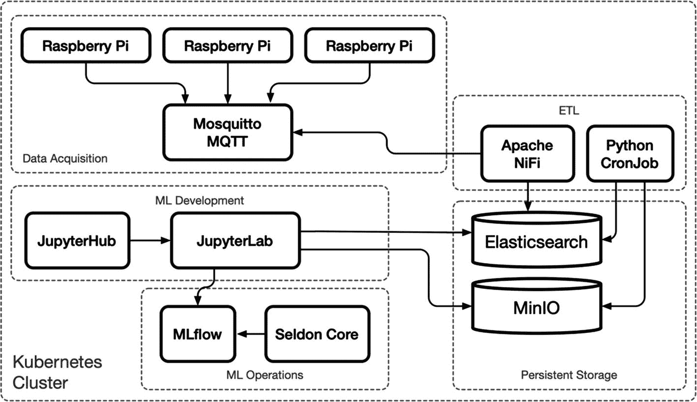

图 11-1

端到端 AIML 平台演示

## 数据

这本书的很大一部分涵盖了数据管理应用:第 5 章[到第 9 章](05.html)[涵盖了数据流水线、数据索引和分析、数据湖、数据仓库和数据转换。本章向集群添加原始数据采集。它展示了 Kubernetes 在减少原始数据收集和访问适合数据科学活动的打包数据集之间的概念距离方面的能力，包括基于机器学习的人工智能的开发。](09.html)

## 混合基础设施

基于机器学习的人工智能(AIML)的应用远远超出了打包数据集和最新算法。完整的 AIML 生命周期通常涉及数据采集、ETL、处理，以及在不同位置和基础设施之间基于推理/预测的工作负载之间的数据路由。

图 [11-2](#Fig2) 描绘了许多组织熟悉的基础设施，包括包含传感器设备的内部设施、配备服务器和工作站的办公室，以及在多个公共云中的多区域存在。

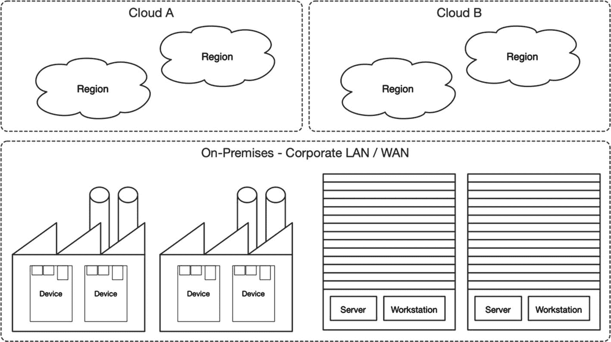

图 11-2

企业基础设施示例

Kubernetes 提供了一个平台，能够支持 AIML 驱动的计划的整个端到端生命周期，从设备及其传感器收集的原始数据到高度可扩展的分布式推理工作负载的部署和管理。以下部分实现了图 [11-2](#Fig2) 中所示的基础设施广泛范围的代表性样本。

## 发展环境

本章中的练习利用了图 [11-3](#Fig3) 中所示的以下按比例缩小的演示基础设施。要遵循本章中的示例，请使用以下资源或等效资源:

*   来自数字海洋的一个液滴提供 2 个 CPU、2 GB 内存、60 GB 磁盘存储，运行 Ubuntu 18.04，部署在 NYC3 地区

*   来自 Hetzner 的三台 CX31 云服务器，每台提供 2 个 CPU、2 GB 内存、80 GB 磁盘存储，运行 Ubuntu 18.04，部署在纽伦堡地区

*   一个物理工作站，提供 4 个 CPU、16 GB 内存、80 GB 磁盘存储、1 个 NVIDIA GPU (GeForce GTX 1070 或更高版本)，运行 Ubuntu 18.04，部署在内部

*   三个 Raspberry Pi 设备(版本 3 或 4)，运行 Raspberry Pi OS Lite (32 位)minimal，并基于 Debian Buster<sup>[1](#Fn1)T3】</sup>

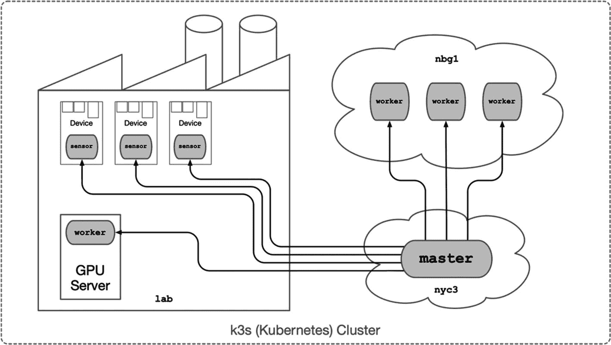

图 11-3

企业基础设施示例

本章中的混合集群因其规模而故意复杂化；然而，这种复杂性展示了 Kubernetes 在各种基础设施挑战中的灵活性。

### 域名服务器(Domain Name Server)

本章使用 Cloudflare <sup>[2](#Fn2)</sup> 来管理名为`hc1`的新开发集群的以下 DNS A 条目(参见图[11-4](#Fig4)):`*.hc1`指向分配给用作工作节点的 Hetzner 云实例的三个 IP 地址。`master.hc1`指向为 Kubernetes 主节点创建的数字海洋水滴。`nbg1-n1.hc1`、`nbg1-n2.hc1`和`nbg1-n3.hc1`是指向每个工作者节点的可选条目。最后，`lab-gpu.hc1`指向内部互联网路由器；如果此路由器有动态 IP 地址(家庭互联网服务通用)，请使用动态 DNS 服务。 <sup>[3](#Fn3)</sup>

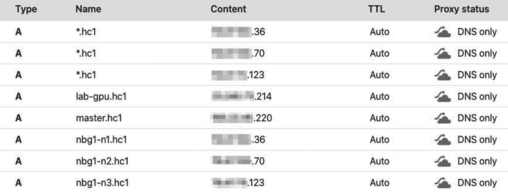

图 11-4

`hc1`开发集群的 DNS 条目

下一节将介绍使用 k3s 在三个地区安装八个 Kubernetes 节点、本地设备和服务器以及纽约和纽伦堡的公共云。

## k3s 混合云

本章使用 k3s 来演示跨各种硬件的全功能 Kubernetes 集群。k3s 是经过认证的轻量级 Kubernetes 发行版，非常适合混合基础架构，支持范围从云计算资源到物联网设备。

以下部分创建了一个八节点 Kubernetes 集群，该集群由三个用于传感器数据收集的 Raspberry Pi 设备、一个用于机器学习的 GPU 工作站、三个用于分布式工作负载的公共云节点和一个处于主角色的公共云节点组成。

这三个 Raspberry Pi 设备代表任何负责收集传感器数据并将其传输到 MQTT 代理的物联网设备。后来，它被存储在运行在 worker 节点上的 Elasticsearch 和 MinIO 对象存储中。GPU 服务器从收集的数据中训练机器学习模型，并将训练好的模型部署到云节点以用于推断/预测工作负载。一个单一的 Kubernetes 集群管理这个小型但全球化的集群中的所有工作负载和通信。

### 公斤流水标

在跨多个公共网络运行 Pod 网络时，需要格外注意安全性。任何通过开放互联网的通信都必须加密，VPN 是确保这一点的方法之一。前几章使用专用网络进行跨节点通信；私有网络是每个主要云供应商提供的标准功能。然而，这些专用网络通常仅限于供应商，在某些情况下，还受地区限制。

WireGuard(在第 [3](03.html) 章中首次介绍)是一种高性能 VPN，能够为跨公共网络的 Pod 通信提供高效的加密隧道。然而，配置和管理去往和来自每个区域上的节点的公共网络接口之间的路由和隧道是一项复杂而乏味的任务。

Kilo <sup>[4](#Fn4)</sup> 项目使用 WireGuard 创建加密的第 3 层 <sup>[5](#Fn5)</sup> 网络覆盖。Kilo 为 Kubernetes 集群中的每个节点管理 IP 路由以及 WireGuard 公钥/私钥对。Kilo 支持全集群和基于区域的节点到节点加密。全群集加密可能会在已经在专用网络中通信的节点之间增加不必要的开销。因此，以下示例使用基于区域的 Kilo 网络，仅在区域之间创建 VPN 隧道，如图 [11-5](#Fig5) 所示。

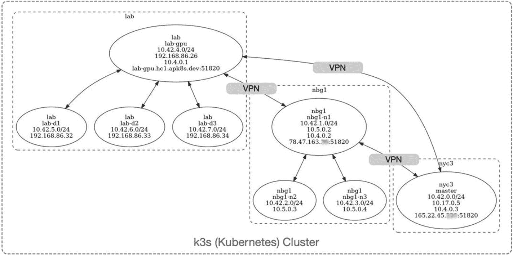

图 11-5

具有拓扑感知 VPN 隧道的混合 Kubernetes 集群

图 [11-6](#Fig6) 描述了每个节点使用的网络接口，用于与集群中的每个其他节点进行内部和外部通信。

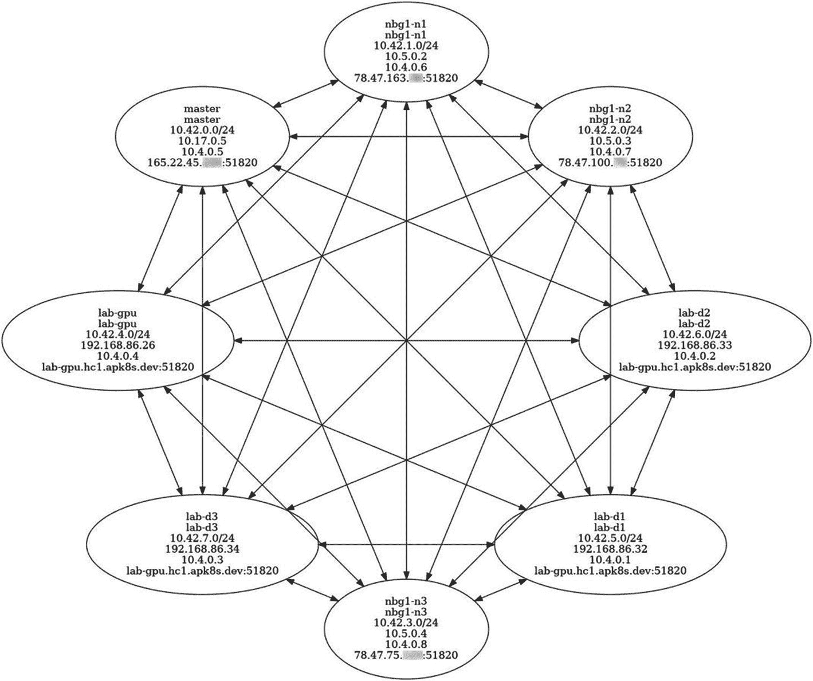

图 11-6

千 VPN 全集群网络连接

本节描述的复杂混合集群简要概述了每个节点在接下来的几节中创建的网络拓扑。安装每个节点后，请回头参考这些图以供参考。这个网络展示了 Kubernetes 对广泛的网络环境的支持，并解决了许多组织面临的共同挑战:标准化和统一不同的开发和生产环境的需要。

### 主网点

为了演示一个按比例缩小的混合云网络，下面的示例使用 k3s 在 Digital Ocean 上安装了一个 Kubernetes `master`节点。在数字海洋上创建一个 Droplet，提供 2 个 CPU，2 GB 内存，60 GB 磁盘存储，配置 Ubuntu 18.04，部署到 NYC3 地区。

升级 Droplet 上的软件包，并在新的 Droplet 上安装 WireGuard(后来被 Kilo 用来创建 VPN 隧道):

```
$ apt upgrade -y
$ apt install -y apt-transport-https \
ca-certificates gnupg-agent \
software-properties-common

$ add-apt-repository -y ppa:wireguard/wireguard

$ apt update

$ apt -o Dpkg::Options::=--force-confnew \
install -y wireguard

```

接下来，为集群创建一个共享秘密，并将生成的值存储在一个安全的地方。额外的节点使用共享秘密由`master`节点接受到 k3s 集群中:

```
$ export K3S_CLUSTER_SECRET=$(head -c48 /dev/urandom | base64)

# copy the echoed secret
$ echo $K3S_CLUSTER_SECRET

```

不用默认法兰绒 Pod 网络安装 k3sKilo 将在本章后面安装，它将处理第 3 层网络:

```
$ curl -sfL https://get.k3s.io | \
sh -s - server --no-flannel

```

k3s 支持单节点和多节点操作；本章构建了一个具有专用主节点的八节点集群。污染主节点以阻止常规工作负载的调度:

```
$ kubectl taint node master dedicated=master:NoSchedule

```

Kilo 使用名称标签`topology.kubernetes.io/region`创建地区间的 VPN 隧道；用区域标记`master`节点，在本例中为`nyc3`:

```
$ kubectl label node master \
topology.kubernetes.io/region=nyc3

```

接下来，将位于`/etc/rancher/k3s/k3s.yaml`的 k3s `kubectl`配置文件复制到 root home:

```
$ cp /etc/rancher/k3s/k3s.yaml ~

```

为`master`节点创建一个 DNS 条目，在本例中为`master.hc1.apk8s.dev,`，并用新的公共 DNS 更新复制的`~/k3s.yml`文件。手动编辑文件或使用`sed`进行快速替换:

```
$ sed -i "s/127.0.0.1/master.hc1.apk8s.dev/" k3s.yaml
$ sed -i "s/default/apk8s-hc1/" k3s.yaml

```

最后，将修改后的`k3s.yaml`复制到安装了 kubectl 的本地工作站上。从本地工作站，使用安全拷贝:

```
$ scp root@master.hc1.apk8s.dev:~/k3s.yaml ~/.kube/apk8s-hc1

```

使用新的 kubectl 配置文件查询主节点:

```
$ export KUBECONFIG=~/.kube/apk8s-hc1
$ kubectl describe node master

```

本节在数字海洋位于 nyc3 地区的公共云上安装了一个主节点。下一节将在纽伦堡地区的 Hetzner 公共云上创建三个 worker 节点。

### 工作节点

本节继续混合云网络的开发，将三个工作节点连接到上一节中创建的主节点。在 Hetzner 上启动三台 CX31 (2 个 CPU，2 GB 内存，80 GB 磁盘存储)云服务器，运行 Ubuntu 18.04，部署在纽伦堡地区。将新实例命名为`nbg1-n1`、`nbg1-n2`和`nbg1-n3`。

为了避免演示集群上负载均衡器的成本和复杂性，为每个新实例的 IP 地址创建一个通配符 DNS A 记录`*.hc1.apk8s.dev`。子域`hc1.apk8s.dev`的所有入口规则现在都路由到三个 Hetzner 实例之一。

登录每个新的云服务器实例，并在每个实例上升级和安装所需的软件包以及 WireGuard:

```
$ apt upgrade -y
$ apt install -y apt-transport-https \
ca-certificates gnupg-agent \
software-properties-common

# Install kernel headers (missing on Hetzner instances)
$ apt install -y linux-headers-$(uname -r)

# Ceph block device kernel module (for Ceph support)
$ modprobe rbd

$ add-apt-repository -y ppa:wireguard/wireguard

$ apt update

$ apt -o Dpkg::Options::=--force-confnew \
install -y wireguard

```

接下来，在每个新的 Hetzner 实例上安装 k3s。首先填充环境变量`K3S_CLUSTER_SECRET`，即上一节中在主节点上生成的集群机密，以及主节点地址`K3S_URL`，在本例中为`master.hc1.apk8s.dev`。将 k3s 安装程序脚本连同命令行参数`agent`(以非工作人员身份运行)和网络拓扑标签一起传送到`sh`:

```
$ export K3S_CLUSTER_SECRET="<PASTE VALUE>"
$ export K3S_URL="https://master.hc1.apk8s.dev:6443"

$ curl -sfL https://get.k3s.io | \
sh -s - agent --no-flannel \
--node-label=\"topology.kubernetes.io/region=nbg1\"

```

`hc1.apk8s.dev`集群现在由四个节点组成，一个位于 Digital Ocean 的主节点和三个位于 Hetzner 的工作节点。在本地工作站上，复制并修改了上一节中的 kubectl 配置文件，列出四个节点:

```
$ export KUBECONFIG=~/.kube/apk8s-hc1
$ kubectl get nodes -o wide

```

`kubectl`列出了集群中的四个节点。集群缺少 Pod 网络，因此将为每个节点报告一个`NotReady`状态。本章在配置完所有八个节点后安装 Kilo Pod 网络。接下来的部分开始研究混合星团的第三个也是最后一个区域，即`lab`。

### 内部

术语“内部”可以指数据中心或云之外的任何特定物理位置。本节继续构建一个混合 Kubernetes 集群，最后一个区域称为`lab`。新的实验室区域可以是单个公司 WAN 或 LAN 上的一个或多个物理位置。以下演示配置了一台裸机服务器，配有一个用于处理机器学习工作负载的 NVIDIA GPU，以及三个用于从板载传感器收集数据的 Raspberry Pi 设备。

#### 国家政治保卫局。参见 OGPU

以下示例 GPU 服务器使用通用主板、英特尔 CPU、120 GB 固态硬盘和 16 GB 内存，以及 NVIDIA GeForce 1070(游戏)GPU。 <sup>[6](#Fn6)</sup> NVIDIA 并未授权 GeForce 1070 GPUs 的驱动程序在数据中心使用。然而，这些卡价格低廉，适合小规模的现场实验和测试。希望将 NVIDIA 硬件用于生产的组织应该仔细检查 NVIDIA 的许可条款。参考英伟达的云与数据中心硬件产品线，进行生产规模的机器学习。 <sup>[7](#Fn7)</sup>

公共云通常提供的 NVIDIA GPU 型号包括 K80、P100 和 V100。

##### GPU/CUDA

由于在主要框架和软件库中对 CUDA <sup>[8](#Fn8)</sup> 的广泛支持，NVIDIA GPUs 在机器学习项目中很受欢迎。CUDA(计算统一设备架构)是英伟达的专有 API，仅受英伟达 GPU 支持。CUDA 的开放替代方案是 OpenCL<sup>T5 9T7】在 NVIDIA 和 AMD GPUs 上都支持。然而，截至 2020 年，数据科学生态系统中对 open OpenCL 的支持有限，并且没有最流行的框架 TensorFlow 和 PyTorch 的支持。 <sup>[10](#Fn10)</sup></sup>

##### 安装 Ubuntu

以下示例为采用 NVIDIA GeForce 1070 GPU 的全新或重新设计的桌面工作站创建了 Ubuntu 18.04.4 的全新安装。

下载 Ubuntu 18.04.4 LTS(仿生海狸)64 位 PC (AMD64)服务器安装镜像 <sup>[11](#Fn11)</sup> 并创建一个可引导的 USB 拇指驱动器。 <sup>[12](#Fn12)</sup> 这个例子使用的是 MSI 主板，在开机时按住 F11 启动引导菜单；查阅其他制造商的手册。从新的拇指驱动器启动工作站，并遵循标准安装说明。

为 Kilo 支持安装 WireGuard，为 Ceph 支持安装`rbd`内核模块:

```
$ sudo su
$ apt update && apt upgrade -y
$ apt install -y apt-transport-https \
ca-certificates gnupg-agent \
software-properties-common

$ apt install -y linux-headers-$(uname -r)

# Ceph block device kernel module (for Ceph support)
$ modprobe rbd

$ add-apt-repository -y ppa:wireguard/wireguard

$ apt update

$ apt -o Dpkg::Options::=--force-confnew \
install -y wireguard

```

分配静态 IP 地址或保留 DHCP 分配的地址，并从面向互联网的路由器上的公共 IP 地址转发端口`5180`(用于 WireGuard VPN 隧道)。最后，创建一个名为`lab-gpu.hc1.apk8s.dev`的 DNS A 记录，指向本地互联网路由器的公共 IP。如果这个地址可能改变，使用动态 DNS 服务 <sup>[13](#Fn13)</sup> 。Kilo 在本章稍后部分进行配置，以便通过此节点将外部 Pod 网络流量路由到任何其他内部节点或从任何其他内部节点路由。

##### NVIDIA GPU 支持

上一节在名为`lab-gpu`的本地工作站上安装了 Ubuntu 18.04.4。以下练习安装 NVIDIA GPU 驱动程序以及用于 containerd 的`nvidia-container-runtime`插件，<sup>T3】14T5】k3s 的默认容器运行时。</sup>

以 root 用户身份执行以下所有命令:

`$ sudo su`

更新`apt`，升级现有包，安装常用 Ubuntu 驱动包:

```
$ apt update && apt upgrade -y
$ apt install ubuntu-drivers-common

```

启用智能平台管理界面内核模块:

```
$ modprobe ipmi_devintf

```

将专有 GPU 驱动程序库添加到`apt`:

```
$ add-apt-repository -y ppa:graphics-drivers

```

将 NVIDIA 的 GPG 密钥添加到`apt`:

```
$ curl -s -L \
   https://nvidia.github.io/nvidia-docker/gpgkey \
   | sudo apt-key add -

```

将 NVIDIA 的驱动程序库添加到`apt`:

```
$ curl -s -L https://nvidia.github.io/nvidia-container-runtime/ubuntu18.04/nvidia-container-runtime.list | tee /etc/apt/sources.list.d/nvidia-container-runtime.list

```

安装 NVIDIA 软件包:

```
$ apt-get install -y nvidia-driver-440
$ apt-get install -y nvidia-container-runtime
$ apt-get install -y nvidia-modprobe nvidia-smi

```

加载 NVIDIA 内核模块:

```
$ /sbin/modprobe nvidia
$ /sbin/modprobe nvidia-uvm

```

启动工作站后，确保`nvidia-smi`命令返回类似于图 [11-7](#Fig7) 所示的结果:

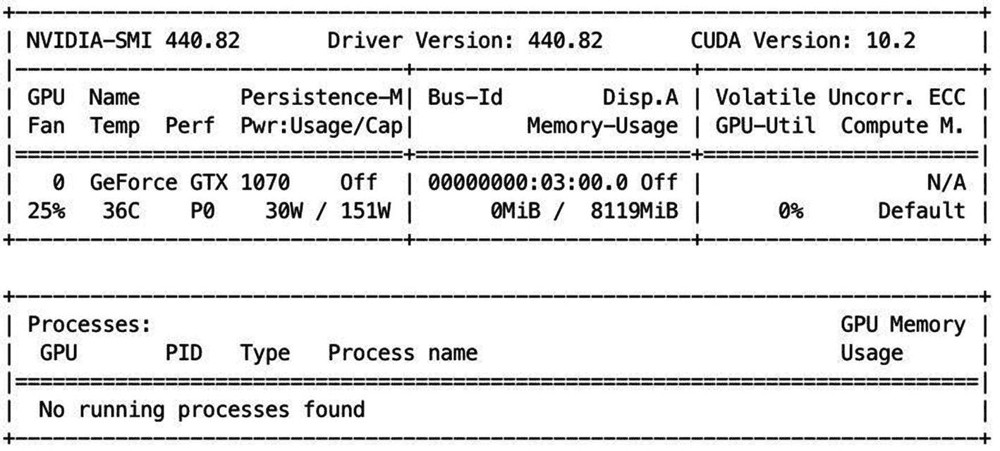

图 11-7

nvidia-smi 输出

```
$ reboot

$ nvidia-smi

```

新安装的工作站现在支持操作系统和 NVIDIA 系统管理界面识别的 NVIDIA GPU。下一节将添加 NVIDIA 对 containerd 的运行时支持。

##### 带 NVIDIA 运行时的 k3s

NVIDIA 提供了大量关于配置 Docker <sup>[15](#Fn15)</sup> 以支持其 GPU 的文档，以及一个容器工具包。k3s 虽然支持 Docker，但是 containerd <sup>[16](#Fn16)</sup> 是它默认的容器运行时。containerd 是 Docker 的一个组件，没有 Docker 引擎和实用程序。本节安装 k3s 并用`nvidia-container-runtime`配置 containerd。 <sup>[17](#Fn17)</sup>

首先设置以下环境变量:将`K3S_CLUSTER_SECRET`设置为安装主节点时生成的秘密；将`K3S_URL`设置为`master`节点的 URL 并将`INSTALL_K3S_SKIP_START`设置为`true`防止 k3s 自动启动:

```
$ sudo su
$ export K3S_CLUSTER_SECRET="<PASTE VALUE>"
$ export K3S_URL="https://master.hc1.apk8s.dev:6443"
$ export INSTALL_K3S_SKIP_START=true

```

使用 k3s 默认安装程序，其参数和自变量与之前在`worker`节点上设置的参数和自变量相似；然而，这个 GPU 工作站是名为`lab`的新内部区域的一部分:

```
$ curl -sfL https://get.k3s.io | \
sh -s - agent --no-flannel \
--node-label=\"topology.kubernetes.io/region=lab\"

```

运行以下命令在目录`/var/lib/rancher/k3s/agent/etc/containerd/`中创建或覆盖`config.toml`；这个新配置指示 containerd 加载`nvidia-container-runtime`插件及其所需的运行时类型`io.containerd.runtime.v1.linux`:

```
$ mkdir -p /var/lib/rancher/k3s/agent/etc/containerd/
$ cat <<"EOF" > \
/var/lib/rancher/k3s/agent/etc/containerd/config.toml
[plugins.opt]
  path = "/var/lib/rancher/k3s/agent/containerd"

[plugins.cri]
  stream_server_address = "127.0.0.1"
  stream_server_port = "10010"
  sandbox_image = "docker.io/rancher/pause:3.1"

[plugins.cri.containerd.runtimes.runc]
  runtime_type = "io.containerd.runtime.v1.linux"

[plugins.linux]
  runtime = "nvidia-container-runtime"
EOF

```

最后，启动 k3s:

```
$ systemctl start k3s

```

新的 hc1 Kubernetes 混合集群现在包含跨三个区域的五个节点:`nyc3`在数字海洋，`nbg1`在赫茨纳，现在`lab`在本地。下一部分将使用三个 Raspberry Pi 设备扩展内部区域。

#### 物联网/树莓派

在过去的十章中，这本书展示了 Kubernetes 在分布式工作负载、网络、数据处理和数据管理中的各种用途。基于机器学习的人工智能从原始数据的收集开始，对于许多项目来说，设备(也称为物联网)收集这些数据。这一部分将物联网引入集群，特别是流行的 Raspberry Pi。Raspberry Pi 设备为开发和原型制作提供了出色的平台，越来越多的项目正在生产中使用它们。 <sup>[18](#Fn18)</sup> 树莓派设备使用基于 ARM 的 <sup>[19](#Fn19)</sup> CPU，几乎适用于所有手机和越来越多的物联网设备。 <sup>[20](#Fn20)</sup> 随着 ARM CPUs 越来越受欢迎， <sup>[21](#Fn21)</sup> 很多项目都是交叉编译，在 x86 和基于 ARM 的系统上执行维护版本，包括 Kubernetes。

本章开发的混合集群(`hc1`)使用 k3s。k3s 是经过认证的轻量级 Kubernetes 发行版，支持 ARM，能够在资源有限的设备上运行。本节展示了 Kubernetes 作为物联网管理平台的使用，它为多个设备提供工作负载调度和管理、自修复、联网和监控，并与内部工作站和多个公共云实例相统一(如图 [11-3](#Fig3) 所示)。

##### 树莓派 OS

安装 <sup>[22](#Fn22)</sup> 三个树莓 Pi 设备(版本 3 或 4)带有 ***树莓 Pi OS Lite (32 位)最小基于 Debian Buster*** 。 <sup>[23](#Fn23)</sup> 命名设备`lab-d1`、`lab-d2`和`lab-d3`。对于本章中的示例，设备数量是可选的。这些设备代表设施内的物联网数据收集传感器，并连接到可访问互联网的局域网(LAN)上(见图 [11-5](#Fig5) )。每台设备都需要一个私有静态 IP 地址或 DHCP 预留地址。

##### WireGuard

Kilo(将在本章后面安装)为公共互联网上的安全通信提供了一个加密的 Pod 网络。Kilo 在每个节点上使用 WireGuard 来管理 VPN 隧道。

登录每个 Raspberry Pi 并安装所需的包，从更新 apt 包开始，升级到最新版本:

```
$ sudo su
$ apt-get update && apt-get upgrade

```

安装内核头:

```
$ apt-get install raspberrypi-kernel-headers

```

接下来，安装 WireGuard。WireGuard 可通过 Debian“不稳定”发行库(包含最新的软件包)用于 Raspberry Pi 操作系统:

```
$ wget -O - https://ftp-master.debian.org/keys/archive-key-$(lsb_release -sr).asc | sudo apt-key add –

$ printf 'Package: *\nPin: release a=unstable\nPin-Priority: 150\n' | tee --append /etc/apt/preferences.d/limit-unstable

$ echo "deb http://deb.debian.org/debian/ unstable main" | tee --append /etc/apt/sources.list.d/unstable.list

$ apt-get update
$ apt install -y dirmngr wireguard-dkms
$ apt -o Dpkg::Options::=--force-confnew \
install -y wireguard

```

如果前面的方法出现任何问题，有一些关于安装 WireGuard Raspberry Pi 的好教程。 <sup>[24](#Fn24)</sup> <sup>，</sup> <sup>[25](#Fn25)</sup> <sup>，</sup> <sup>[26](#Fn26)</sup>

##### 树莓派上的 k3s

最后，在每个树莓 Pi 上安装 k3s。首先用安装主节点时生成的值设置`K3S_CLUSTER_SECRET`，并将`K3S_URL`设置为主节点(在数字海洋上):

```
$ sudo su
$ export K3S_CLUSTER_SECRET="<PASTE VALUE>"
$ export K3S_URL="https://master.hc1.apk8s.dev:6443"

```

使用默认安装程序安装 k3s，选项类似于前面的节点。将区域拓扑设置为`lab`，假设这些设备与之前安装的 GPU 工作站位于同一设施或本地网络中。添加设置为`dedicated=pi:NoSchedule`的参数`--node-taint`。带有`NoSchedule`污点的节点通知 Kubernetes 调度程序只允许具有特定容差的 pod:

```
$ curl -sfL https://get.k3s.io | \
sh -s - agent --no-flannel \
--node-label=\"topology.kubernetes.io/region=lab\" \
--node-taint="dedicated=pi:NoSchedule"

```

现在有八个节点组成了新的`hc1`混合集群:数字海洋的一个主节点名为`master`，位于`nyc3`区域内；在`nbg1`区域内，Hetzner 上的三个工人节点称为`nbg1-n1`、`nbg1-n2`和`nbg1-n3`；以及在`lab`区域内称为`lab-gpu`、`lab-d1`、`lab-d2`和`lab-d3`的四个内部节点。网络拓扑概述见图 [11-5](#Fig5) 。

下一节将为节点设置角色，以帮助进行调度。

### 节点角色

Kubernetes 节点角色是一个以`node-role.kubernetes.io/<role>`开头的简单标签。Pod 调度程序是由 Kubernetes 设计的，用于找到 Pod 的最佳位置。POD 是短暂的；它们可能会失败或从一个节点耗尽，并随时被重新调度到另一个节点。但是，有时特殊的工作负载需要额外的调度要求。在本章定义的`hc1`集群中，三个节点具有独特的角色`sensor`。角色标签可以是反映其操作特征的任何值。

主节点已经拥有标签`master`。将其余节点标记如下:

```
$ kubectl label node nbg1-n1 kubernetes.io/role=worker
$ kubectl label node nbg1-n2 kubernetes.io/role=worker
$ kubectl label node nbg1-n3 kubernetes.io/role=worker
$ kubectl label node lab-gpu kubernetes.io/role=worker

$ kubectl label node lab-d1 kubernetes.io/role=sensor
$ kubectl label node lab-d2 kubernetes.io/role=sensor
$ kubectl label node lab-d3 kubernetes.io/role=sensor

```

从本地工作站发出命令 kubectl get nodes，观察类似于图 [11-8](#Fig8) 的输出。节点现在报告它们的预期角色。

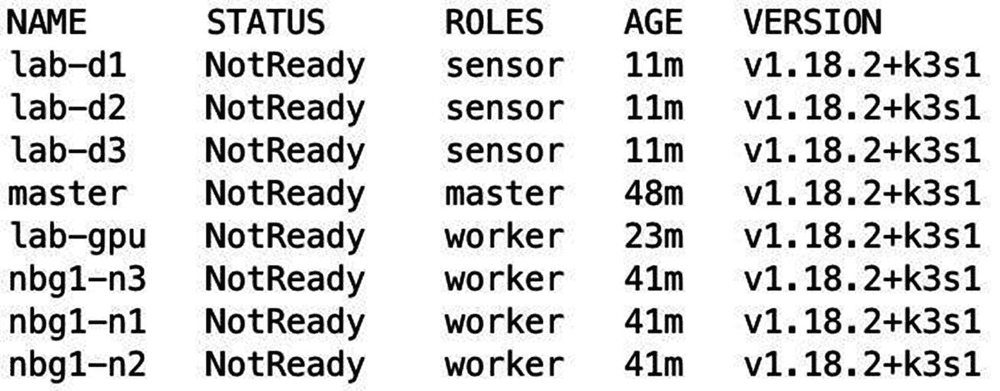

图 11-8

节点角色

节点状态继续报告为`NotReady`,因为还没有 Pod 网络供它们通信。以下部分通过安装 Kilo Pod 网络完成了`hc1`集群的设置。

### 安装千克

本章的“k3s 混合云”一节首先详细解释了 Kilo 及其在使用 WireGuard 创建 VPN 隧道中的作用，该隧道通过公共互联网在跨越三个区域的集群中的 pod 之间提供安全、加密的通信。安装 Kilo 是设置 k3s 混合云的最后一步。

每个区域中至少有一个节点必须具有外部可访问的端点。 <sup>[27](#Fn27)</sup> 数字海洋和赫茨纳上的云实例已经有了公有 IP 地址。当设置 GPU 工作站时，域`lab-gpu.hc1.apk8s.dev`解析为内部互联网路由器，并将端口`51820`转发到其专用 LAN IP 上的 GPU 工作站。这三台 Raspberry Pi 设备有专用的局域网 IP 地址，不能通过互联网访问。以下注释指示 Kilo 形成从 GPU 工作站到 Raspberry Pi 设备的 VPN 隧道:

```
$ kubectl annotate node lab-d1 \
kilo.squat.ai/force-endpoint="lab-gpu.hc1.apk8s.dev:51820"
$ kubectl annotate node lab-d2 \
kilo.squat.ai/force-endpoint="lab-gpu.hc1.apk8s.dev:51820"
$ kubectl annotate node lab-d3 \
kilo.squat.ai/force-endpoint="lab-gpu.hc1.apk8s.dev:51820"

```

接下来，Kilo 需要访问集群中每个节点的 kubectl 配置，以便与主节点通信。所应用的 kilo-k3s.yaml 需要每个节点上的 kubectl 配置`/etc/rancher/k3s/k3s.yaml`。主节点 k3s 安装生成了文件`/etc/rancher/k3s/k3s.yaml`。下载、修改并分发该文件到所有`worker`和`sensor`节点上的相同路径(在`master`节点上不需要修改):

```
$ ssh root@master.hc1.apk8s.dev \
sed "s/127.0.0.1/master.hc1.apk8s.dev/" \ /etc/rancher/k3s/k3s.yaml >k3s.yaml

```

在每个节点上复制修改后的`k3s.yaml`到`/etc/rancher/k3s/k3s.yaml`。

最后，通过应用 kilo-k3s.yaml 配置清单来安装 Kilo:

```
$ kubectl apply -f \
https://raw.githubusercontent.com/squat/kilo/master/manifests/kilo-k3s.yaml

```

一千个代理现在在每个节点上运行，如图 [11-9](#Fig9) 所示。一旦 Kilo 完成了 VPN 设置，每个节点都会报告就绪，新的`hc1`混合集群就可以使用了。

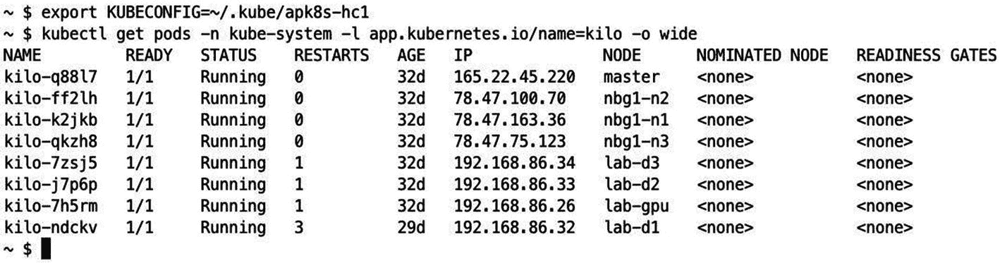

图 11-9

每个集群上的千个代理 Pod

如图 [11-3](#Fig3) 和图 [11-5](#Fig5) 所示，新的`hc1`混合集群已经准备好应用。以下部分回顾了用于演示基于端到端机器学习的人工智能平台的应用示例，从原始数据收集到完全在 Kubernetes 上运行的推理工作负载。

## 平台应用

本章创建了一个名为`hc1`的新 Kubernetes 集群。其余示例利用了第 [3](03.html) 、 [5](05.html) 、 [6](06.html) 、 [7](07.html) 和 [9](09.html) 章中安装的应用和集群配置(如表 [11-1](#Tab1) 中所述)。本章将所有配置清单组织在文件夹`cluster-apk8s-hc1`下。

表 11-1

前几章中要求的配置和应用

<colgroup><col class="tcol1 align-left"> <col class="tcol2 align-left"> <col class="tcol3 align-left"></colgroup> 
|   | 

资源

 | 

目录组织

 |
| --- | --- | --- |
| 第 [3 章](03.html) | 进入证书管理器仓库监视 | `000-cluster/00-ingress-nginx``000-cluster/10-cert-manager``000-cluster/20-rook-ceph``000-cluster/30-monitoring` |
| 第 [5 章](05.html) | 命名空间蚊子蚊子蚊子蚊子蚊子蚊子蚊子蚊子蚊子蚊子蚊子蚊子蚊子蚊子蚊子蚊子蚊子蚊子蚊子蚊子蚊子蚊子蚊子蚊子蚊子蚊子蚊子蚊子蚊子蚊子蚊子蚊子蚊子蚊子蚊子蚊子蚊子蚊子蚊子蚊子蚊子蚊子蚊子蚊子蚊子蚊子蚊子蚊子蚊子动物园管理员 | `003-data/000-namespace``003-data/050-mqtt``003-data/010-zookeeper` |
| 第 [6 章](06.html) | 凯克洛克 JupyterHub 弹性搜索巴拉人 | `003-data/005-keycloak``005-data-lab/000-namespace``003-data/100-jupyterhub``003-data/030-elasticsearch``003-data/034-kibana` |
| 第 [7 章](07.html) | 微型汽车 | `000-cluster/22-minio``003-data/070-minio` |
| 第 [9 章](09.html) | 尼菲 | `003-data/060-nifi` |

以下部分使用前面章节中介绍的应用:Mosquitto (MQTT)从 Raspberry Pi 设备(IoT)传送传感器数据；Apache NiFi 监听 MQTT 事件，将数据(ETL)转换和加载到 Elasticsearch 中；JupyterHub，用于在 GPU 节点上使用机器学习(AIML)处理数据并开发和训练 AI 模型；以及用于存储机器学习模型和工件的 MinIO。

本章使用以下入口域:`nifi.hc1.apk8s.dev`用于 Apache Nifi，`hub.hc1.apk8s.dev`用于 JupyterHub，`kib.hc1.apk8s.dev`用于 Kibana，`iam.hc1.apk8s.dev`用于 Keycloak，`minio.hc1.apk8s.dev`用于 MinIO。

下一部分开始从集群上的 Raspberry Pi IoT 节点收集原始数据。

## 数据收集

以下部分使用 Kubernetes `DaemonSet`对象来部署和管理 Raspberry Pi (IoT)设备上的数据收集工作负载，并使用`CronJob`对象来部署执行数据聚合的 ETL 工作负载。

### MQTT IoT 客户端

许多物联网应用遵循特定于平台的软件开发的传统模式。开发人员为特定设备编写代码，并支持一种或多种与设备通信的协议，无论是收集传感器数据还是煮一壶咖啡。然而，与 Kubernetes 一起，容器化为物联网应用开发、部署、联网、监控和控制开辟了新的途径。

以下示例在 Kubernetes ConfigMap 中部署了一个 shell 脚本。一个 DaemonSet 在一组选定的(`sensor`)节点上部署一个瘦 Debian Buster 容器 <sup>[28](#Fn28)</sup> (带有命令行 MQTT 客户端)，并执行从 ConfigMap 挂载的 shell 脚本。

创建目录`cluster-apk8s-hc1/020-data/220-smon`。在新的`220-smon`目录中，从清单 [11-1](#PC35) 中创建一个名为`20-configmap.yml`的文件。

```
apiVersion: v1
kind: ConfigMap
metadata:
  name: smon
  namespace: data
  labels:
    app: smon
data:
  collect.sh: |-
    for (( ; ; ))
    do
      load=$(cat /proc/loadavg | cut -d\  -f 1)
      temp=$(cat /sensor/temp)
      mosquitto_pub \
        -h mqtt.data \
        -i $DEVICE \
        -t sensor/$DEVICE \
        -m "{\"device\":\"$DEVICE\",\"temp\":$temp, \"load\":$load}"
      echo "device: $DEVICE, temp: $temp, load: $load"
    sleep 15
    done

Listing 11-1Signal monitor script ConfigMap

```

应用配置图:

```
$ kubectl apply -f 20-configmap.yml

```

接下来，在清单 [11-2](#PC37) 中的文件`40-daemonset.yml`中为信号监视器创建一个 DaemonSet。ConfigMap 中定义的 shell 脚本从 Raspberry Pi 读取内部传感器数据(CPU 负载和温度);开发人员可能会遵循类似的设计来提取外部传感器数据或控制连接的设备。DaemonSet 使用`nodeSelector`和`tolerations`的组合，指示 Kubernetes 在所有 Raspberry Pi 传感器设备上调度该容器。

```
apiVersion: apps/v1
kind: DaemonSet
metadata:
  name: smon
  namespace: data
  labels:
    app: smon
    component: sensor
spec:
  selector:
    matchLabels:
      name: smon
  template:
    metadata:
      labels:
        name: smon
        component: sensor
    spec:
      nodeSelector:
        kubernetes.io/role: sensor
      tolerations:
        - key: dedicated
          value: pi
          effect: NoSchedule
      containers:
        - name: smon
          image: apk8s/mosquitto-clients:1.5.7_1
          command: ["/bin/bash",
                    "/scripts/collect.sh"]
          env:
            - name: DEVICE

              valueFrom:
                fieldRef:
                  fieldPath: spec.nodeName
          securityContext:
            privileged: true
          volumeMounts:
            - name: scripts
              mountPath: /scripts
            - name: sensor
              mountPath: /sensor
          resources:
            limits:
              memory: 200Mi
            requests:
              cpu: 50m
              memory: 200Mi
      volumes:
        - name: sensor
          hostPath:
            path: /sys/class/thermal/thermal_zone0/
        - name: scripts
          configMap:
            name: smon

Listing 11-2Signal monitor DaemonSet deployment

```

应用 DaemonSet:

```
$ kubectl apply -f 40-daemonset.yml

```

DaemonSet 使用映像 apk8s/mosquitto-clients:1 . 5 . 7 _ 1 生成清单 [11-3](#PC39) 中的 Dockerfile。

```
FROM debian:buster-slim

RUN apt-get update \
 && apt-get install -y mosquitto-clients curl \
 && apt-get clean

Listing 11-3MQTT Client Dockerfile

```

三个 Raspberry Pi 设备现在每隔 15 秒向集群中运行的 MQTT 代理报告它们的 CPU 负载和温度，主题为`/sensor/DEVICE_NAME`。下一节使用 Apache NiFi 创建一个定向数据处理图，监听/ `sensor`主题中发布的所有消息，处理数据，并将其作为时间序列数据加载到 Elasticsearch 中，以便为分析建立索引。

## 抽取、转换、加载至目的端（extract-transform-load 的缩写）

上一节实现了一个 DaemonSet，它执行一个 shell 脚本，负责每隔 15 秒从 Raspberry Pi 设备中抓取指标。前面的 shell 脚本将其结果作为 JSON 发布到 MQTT topic / `sensor/DEVICE_NAME`。下面几节使用 Apache Nifi 提取 MQTT 消息，对它们进行转换，并加载到 Elasticsearch 中进行索引，还使用一个 Python 脚本和一个 Kubernetes CronJob 从收集的数据范围中创建 CSV 对象，用于长期对象存储。

### Apache 尼菲

第 9 章介绍了用于数据路由和转换的 Apache NiFi 查看第 [9](09.html) 章的安装说明和概念概述。以下示例使用 NiFi 处理器 *ConsumeMQTT* 、 *JoltTransformJSON* 和 *PutElasticsearchHttp* ，如图 [11-10](#Fig10) 所示。

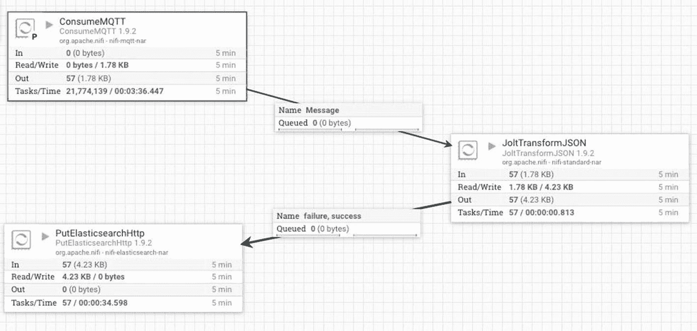

图 11-10

NiFi MQTT 变换和弹性搜索加载

创建一个 *ConsumeMQTT* 处理器，并将属性代理 URI 设置为`tcp://mqtt:1883`，主题过滤器设置为`sensor/+`，最大队列大小设置为 1000。

使用 advanced 按钮用清单 [11-4](#PC40) 中的 Jolt 转换语言配置处理器。

```
[
  {
    "operation": "default",
    "spec": {
      "collected": "${now():toNumber()}"
    }
  },
  {
    "operation": "modify-overwrite-beta",
    "spec": {
      "collected": "=toLong"
    }
  }
]

Listing 11-4Jolt transformation

```

通过将从 MQTT 获取的样本数据粘贴到 JSON 输入字段来测试转换(参见图 [11-11](#Fig11) ):

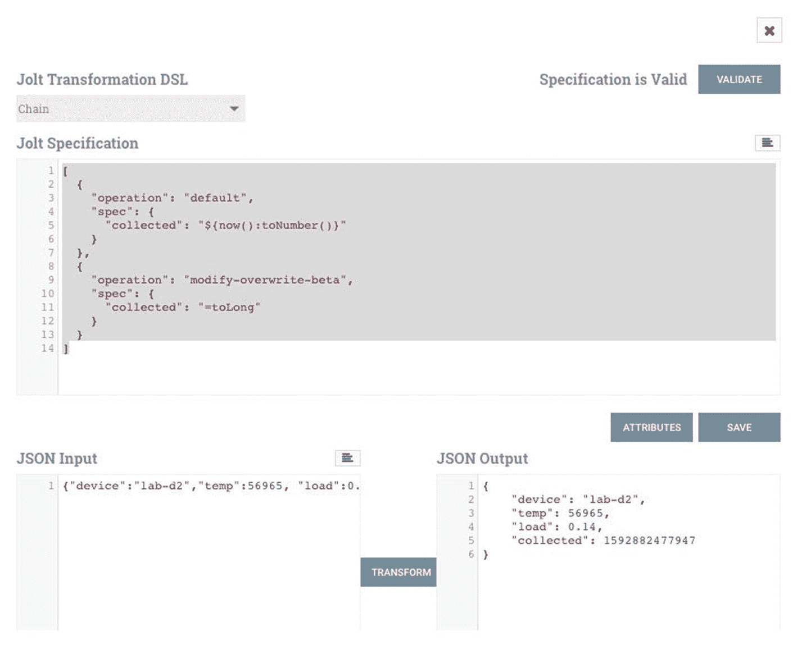

图 11-11

NiFi Jolt 转换规范

```
{"device":"lab-d1","temp":51540, "load":0.37}

```

最后，添加一个 *PutElasticsearchHttp* 处理器，并连接来自 *JoltTransformJSON* 处理器的输出。配置 *PutElasticsearchHttp* ，属性 Elasticsearch URL 设置为`http://elasticsearch:9200`，索引设置为`sensor-${now():format('yyyy-MM')}`，类型设置为`_doc`。

前面的步骤用 Apache Nifi 创建了一个小的 ETL 流水线，从 MQTT 中提取，并通过用一个附加字段扩充 JSON 数据来转换消息，然后将每个转换后的消息作为时间序列数据加载到 Elasticsearch 中进行索引和分析。

### Python CronJob

数据科学，特别是机器学习研究需要静态数据集进行实验和训练。提炼和共享研究的可再现结果通常需要将源代码与开发中使用的数据相结合的能力。虽然存储在 Elasticsearch 中的时间序列数据不太可能改变，但与内部和外部团队共享数据库访问带来了额外的挑战。创建索引数据的 CSV 快照并将其加载到分布式对象存储上，为跨团队和项目存储和共享持久、长期的数据提供了一个引人注目的选项。

本节演示了 Kubernetes CronJob 在 ETL 活动中的使用。下面的例子从 Elasticsearch(参见第 [6](06.html) 章)中提取最后一个小时的索引数据，将数据序列化为 CSV 文件并加载到 MinIO(参见第 [7](07.html) 章)分布式对象存储中。

首先创建一个 Python 脚本，从 Elasticsearch 中提取最近一个小时的传感器数据，将其转换为 CSV 格式，并加载到 MinIO 中。将新的 Python 脚本作为一个值添加到 Kubernetes 配置图中。创建目录`cluster-apk8s-hc1/020-data/500-jobs`。在新的`500-jobs`目录中，从清单 [11-5](#PC42) 中创建一个名为`01-configmap-hrdump.yml`的文件。

```
apiVersion: v1
kind: ConfigMap
metadata:
  name: hrdump
  namespace: data
  labels:
    app: hrdump
data:
  hrdump.py: |-
    import requests
    import pandas as pd
    import boto3
    import datetime
    import os

    d = datetime.datetime.now()
    idx = f"sensor-{d.year}-{d.month:02d}"

    query = {
      "size": 10000,
      "query": {
        "range" : {
          "collected" : {
              "gte" : "now-1h"
          }
        }
      }
    }

    r = requests.post(
        f'http://elasticsearch.data:9200/{idx}/_search',
        json=query
    )

    df = pd.DataFrame()

    for rec in r.json()['hits']['hits']:
        df = df.append(rec['_source'], ignore_index=True)

    csv_data = df.to_csv(index_label="idx")

    s3 = boto3.client('s3',
      endpoint_url='http://minio-internal-service.data:9000',
      aws_access_key_id=os.environ['ACCESS_KEY_ID'],
      aws_secret_access_key=os.environ['ACCESS_KEY'],
      region_name='')

    try:
        s3.create_bucket(Bucket='sensor-hourly')
    except s3.exceptions.BucketAlreadyOwnedByYou:
        print("Bucket Exists")
    except:
        print("Unknown bucket error")

    filename = d.strftime("%Y/%m-%d-%H.csv")
    s3.put_object(Bucket='sensor-hourly', Key=filename, Body=csv_data)
    print(f"Added object {filename} to bucket sensor-hourly")

Listing 11-5ConfigMap with Python data dump script

```

应用配置图:

```
$ kubectl apply -f 01-configmap-hrdump.yml

```

配置图中的 Python 脚本需要一个预安装了 Python 和所需库的容器。在创建定制容器之前，首先将所需的 Python 包 <sup>[29](#Fn29)</sup> 和版本添加到名为`requirements.txt`的文件中，如清单 [11-6](#PC44) 所示。

```
boto3==1.13.18
botocore==1.16.18
certifi==2020.4.5.1
chardet==3.0.4
docutils==0.15.2
idna==2.9
jmespath==0.10.0
numpy==1.18.4
pandas==1.0.3
python-dateutil==2.8.1
pytz==2020.1
requests==2.23.0
s3transfer==0.3.3
six==1.15.0
urllib3==1.25.9

Listing 11-6Python data dump script requirements.txt

```

接下来，基于`python:slim-buster`创建一个 Dockerfile(参见清单 [11-7](#PC45) ，将 requirements.txt 复制到容器镜像中，并使用 pip 安装所需的 Python 库。构建新容器并将其推送到公共或私有容器注册中心(或者使用为此示例构建的公共映像`apk8s/pyreqobj:0.0.1`)。

```
FROM python:slim-buster

COPY requirements.txt .
RUN pip install -r requirements.txt

Listing 11-7Python Dockerfile with requirements

```

最后，在清单 [11-8](#PC46) 中的一个名为`01-cronjob-hrdump.yml`的文件中创建 Kubernetes cron job<sup>[30](#Fn30)</sup>。CronJob 使用自定义 Python 容器(之前开发的)创建一个 Pod，将 ConfigMap 挂载到/scripts 目录中，并用 MinIO 的凭证填充`ACCESS_KEY_ID`和`ACCESS_KEY`。CronJob 每小时运行一分钟。

```
apiVersion: batch/v1beta1
kind: CronJob
metadata:
  name: hrdump
  namespace: data
spec:
  schedule: "1 * * * *"
  jobTemplate:
    spec:
      template:
        spec:
          restartPolicy: OnFailure
          containers:
            - name: hrdump
              image: apk8s/pyreqobj:0.0.1
              command: [
                  "/usr/local/bin/python",
                  "/scripts/hrdump.py"
              ]
              env:
                - name: ACCESS_KEY_ID
                  valueFrom:
                    secretKeyRef:
                      name: minio-creds-secret
                      key: accesskey
                - name: ACCESS_KEY
                  valueFrom:
                    secretKeyRef:
                      name: minio-creds-secret
                      key: secretkey
              volumeMounts:
                - name: scripts
                  mountPath: /scripts
          volumes:
            - name: scripts
              configMap:
                name: hrdump

Listing 11-8Python data dump hourly CronJob

```

应用 CronJob:

```
$ kubectl apply -f 01-cronjob-hrdump.yml

```

利用 Kubernetes 中的 CronJobs 进行调度执行带来了 Kubernetes 容器编排的所有优势，包括资源调度、网络和服务抽象、自修复、监控等等。CronJobs 虽然在实现上过于简单，但在任何基于 Kubernetes 的数据管理平台中，即使是复杂的 ETL 操作，它也能扮演重要的角色。

本章和本书的大部分内容都集中在 Kubernetes 上，Kubernetes 是一个能够连接各种数据应用并缩短原始数据收集、ETL 操作、数据访问和数据科学活动之间概念距离的平台。

本章的剩余部分将重点介绍机器学习工具，用于使用 Kubernetes 构建、训练、跟踪、存储和服务基于机器学习的人工智能模型。

## 机器学习自动化

机器学习自动化，也称为 AutoML， <sup>[31](#Fn31)</sup> 是一个快速发展的软件工程领域，新项目开始特别利用 Kubernetes。Kubeflow <sup>[32](#Fn32)</sup> 和 Pachyderm <sup>[33](#Fn33)</sup> 是专为在 Kubernetes 上运行其容器化工作负载而设计的。这两个项目都解决了 AutoML 的两个重要领域:模型训练的自动化(超参数调整、算法选择和模型评估)和模型服务。这些项目由几个组件组成，这些组件被集合在一起以标准化 AutoML 工作流。

Kubeflow 和 Pachyderm 支持安装到现有的 Kubernetes 集群中，例如本书中演示的集群，但对受支持的 Kubernetes 版本有一些限制。Kubeflow 和 Pachyderm 都值得作为任何企业级 AutoML 平台的候选者进行研究。

本节通过项目 MLflow、 <sup>[34](#Fn34)</sup> 展示了 AutoML 组件的一个子集，适用于更集中的模型跟踪和服务展示。本章以一个用于生产模型部署的谢顿核心 <sup>[35](#Fn35)</sup> (也用于 Kubeflow)的例子结束。

### 木星笔记本 gpu 支持

此前，本章介绍了一个配备 GPU 的工作站作为新的`hc1`混合 Kubernetes 集群中的节点，安装了 NVIDIA 操作系统驱动程序，并启用了 NVIDIA 容器运行时支持。本节介绍了在主机节点上开发能够访问 NVIDIA CUDA GPU 驱动程序的 Jupyter 笔记本容器的方法。

Jupyter Docker Stacks<sup>[36](#Fn36)</sup>项目维护了一组预构建的容器，其中包含 Jupyter 应用和各种数据科学、机器学习、统计库，并支持多个内核，包括 Python、Julia 和 r

Docker Stacks 的预构建容器包括日常数据科学活动所需的基本工具和用于开发更专业环境的合适基础容器。

创建类似于 Jupyter Docker Stacks 项目的容器的一种方法是从 NVIDIA 的 CUDA 10.1 (Ubuntu 18.04)容器开始，并添加支持任何所需库和应用的层。GitHub 上的 gpu-jupyter <sup>[37](#Fn37)</sup> 项目已经自动化了这种方法，对于实验和探索支持 gpu 的 jupyter 容器的构造非常有用。默认情况下，gpu-jupyter 从 NVIDIA 的 CUDA 容器开始，克隆 Jupyter Docker Stacks 存储库，并将每个 Docker 文件的层聚合到一个新的 Docker 文件中(不到 500 行)。生成的 Dockerfile 是添加和删除功能的优秀模板；但是，请注意，按原样构建它将会产生一个>14gb 的容器映像。

#### CUDA 数据科学容器

创建一个新的 CUDA Jupyter 数据科学容器。首先克隆 GitHub 项目 gpu-jupyter:

```
$ git clone \
https://github.com/iot-salzburg/gpu-jupyter.git
$ cd gpu-jupyter

```

接下来，基于运行 Ubuntu 18.04 的 NVIDIA CUDA 10.1 生成一个`Dockerfile`，并从 Jupyter Docker 栈聚合 Docker 文件配置:

```
$ ./generate-Dockerfile.sh
$ cd .build

```

最后，编辑生成的 docker 文件或保持原样。使用标签构建，在本例中为`apk8s/jupyter-ds:cuda-10.1`，并推送:

```
$ docker build -t apk8s/jupyter-ds:cuda-10.1 .
$ docker push apk8s/jupyter-ds:cuda-10.1

```

构建这个巨大的容器可能需要几分钟到几小时的时间，这取决于速度和分配给本地工作站上 Docker 守护进程的资源。

下一节使用这个容器作为 JupyterHub 提供的一个选项。

#### JupyterHub Spawner 选项

第 6 章[介绍了 JupyterHub 作为一种为用户提供 Jupyter 容器的方式。将 JupyterHub 安装到新的`hc1`集群中(在本章前面已经设置好了)，并为`values.yml`(用于配置 Helm 图)更新了`singleuser`部分。用清单](06.html) [11-9](#PC51) 的内容替换`singleuser`部分。

```
singleuser:
  image:
    name: apk8s/datalab
    tag: v0.0.5
  defaultUrl: "/lab"
  storage:
    dynamic:
      storageClass: rook-ceph-block
      capacity: 10Gi
  extraEnv:
    MLFLOW_TRACKING_URI: "http://mlflow.data:5000"
    MLFLOW_S3_ENDPOINT_URL: "http://minio-internal-service.data:9000"
  profileList:
    - display_name: "DataLab Environment"
      description: "Python, Julia, Octave and R."
      default: true
    - display_name: "GPU Data Science Environment."
      description: "Data science applications and libraries with cuda-10.1 support."
      kubespawner_override:
        image: apk8s/jupyter-ds:cuda-10.1
        extra_resource_guarantees:
          nvidia.com/gpu: "1"
        extra_resource_limits:
          nvidia.com/gpu: "1"

Listing 11-9Updated singleuser configuration for JupyterHub

```

新的`singleuser`配置创建了一个`profileList`，为用户提供了选择 Jupyter 环境的选项。 <sup>[38](#Fn38)</sup> 第一个条目是第 [6 章](06.html)中使用的默认数据科学容器；第二个选项是上一节中构建的新的支持 GPU 的`apk8s/jupyter-ds:cuda-10.1`容器。键`extra_resource_guarantees`通知 Kubernetes 调度程序将容器放在至少有一个 GPU 可用的节点上。密钥`extra_resource_limits`确保用户不会访问一个以上的 GPU。本章稍后会用到环境变量`MLFLOW_TRACKING_URI`和`MLFLOW_S3_ENDPOINT_URL`。

下面的部分使用这个新的 GPU 数据科学容器来开发机器学习模型。它引入 MLflow 来跟踪他们的学习进度，并将模型提交给注册表。

### 模型开发

机器学习模型开发类似于任何软件开发——组织或个人解决问题、提高生产率或创造新价值的愿望。在数据科学中，原材料是数据以及其中可能存在的潜在价值。这本书展示了在数据科学环境中提供大量数据管理应用的能力。

机器学习是一个多样化的领域，有着巨大的技术、术语和实践生态系统。这本书没有涵盖机器学习模型的开发，因为这是一个快速发展的领域，不断引入新的框架和技术。然而，几年来出现了一些适合自动化的模式，这些模式和容器化一起非常适合 Kubernetes。其余部分涵盖了机器学习自动化的四个组件:跟踪模型、版本控制和存储模型、服务模型以及部署使用它们的推理工作负载(API)。

#### MLflow

MLflow <sup>[39](#Fn39)</sup> 是一个开源的机器学习平台，最初由 Databricks <sup>[40](#Fn40)</sup> 开发，并捐赠(于 2020 年)给 Linux 基金会。MLflow 每月下载量超过 200 万次， <sup>[41](#Fn41)</sup> 已经被机器学习社区迅速采用。

本节的剩余部分将 MLflow 安装到本章前面构建的新的`hc1` Kubernetes 集群中。以下示例使用 MinIO(参见第 [7 章](07.html))作为 MLflow 用于模型和工件存储的 S3 兼容对象存储， <sup>[42](#Fn42)</sup> 和 Jupyter 环境(参见本章上一节)用于开发模型和与 MLflow 交互。

##### 装置

MLflow 支持本地和基于云的操作。在 Kubernetes 上共享 MLflow 实例需要容器化版本。通过首先用清单 [11-10](#PC52) 的内容创建一个 requirements.txt 文件来创建一个新的 MLflow 容器。

```
mlflow==1.8.0
awscli==1.18.65
boto3==1.13.15

Listing 11-10MLflow container requirements.txt

```

接下来，在 requirements.txt 所在的目录中，创建一个 Dockerfile，其中包含清单 [11-11](#PC53) 的内容。

```
FROM python:slim-buster

COPY requirements.txt /requirements.txt
RUN pip install -r /requirements.txt
ENV PORT 5000

ENTRYPOINT ["mlflow"]

Listing 11-11MLflow Dockerfile

```

接下来，构建并推送 MLflow 容器:

```
$ docker build -t apk8s/mlflow:1.8.0-v0 .
$ docker push apk8s/mlflow:1.8.0-v0

```

接下来，用 MLflow 配置 Kubernetes。创建目录`cluster-apk8s-hc1/020-data/800-mlflow`。在新的`800-MLflow`目录中，从清单 [11-12](#PC55) 中创建一个名为`10-service.yml`的文件。

```
apiVersion: v1
kind: Service
metadata:
  name: mlflow
  namespace: data
  labels:
    app: mlflow
spec:
  selector:
    app: mlflow
  ports:
    - protocol: "TCP"
      port: 5000
      targetPort: 5000
  type: ClusterIP

Listing 11-12MLflow Service

```

应用服务:

```
$ kubectl apply -f 10-service.yml

```

接下来，在清单 [11-13](#PC57) 中的文件`40-statefulset.yml`中为 MLflow 创建一个 StatefulSet。StatefulSet 配置使用前面创建的新 MLflow 容器。它将环境变量`MLFLOW_S3_ENDPOINT_URL`设置为运行在 hc1(在数据名称空间中)、`AWS_ACCESS_KEY_ID`和`AWS_SECRET_ACCESS_KEY`上的 MinIO 集群的服务端点，这些环境变量是从包含 MinIO 凭证的 Kubernetes secret 挂载的。MLflow 使用这些环境变量来访问模型和工件的对象存储。

```
apiVersion: apps/v1
kind: StatefulSet
metadata:
  name: mlflow
  namespace: data
  labels:
    app: mlflow
spec:
  serviceName: mlflow
  replicas: 1
  revisionHistoryLimit: 1
  selector:
    matchLabels:
      app: mlflow
  template:
    metadata:
      labels:
        app: mlflow
    spec:
      containers:
        - name: mlflow
          image: apk8s/mlflow:1.8.0-v0
          imagePullPolicy: IfNotPresent
          args: [
            "server",
            "--backend-store-uri=sqlite:///MLflow/data.db",
            "--default-artifact-root=s3://MLflow/artifacts",
            "--expose-prometheus=/metrics",
            "--host=0.0.0.0",
            "--port=5000"
          ]
          env:
            - name: MLFLOW_S3_ENDPOINT_URL
              value: http://minio-internal-service.data:9000
            - name: AWS_ACCESS_KEY_ID
              valueFrom:
                secretKeyRef:
                  name: minio-creds-secret
                  key: accesskey
            - name: AWS_SECRET_ACCESS_KEY
              valueFrom:
                secretKeyRef:
                  name: minio-creds-secret
                  key: secretkey
          volumeMounts:
            - name: mlflow-data-volume
              mountPath: /mlflow
          ports:
            - name: http
              containerPort: 5000
  volumeClaimTemplates:
    - metadata:
        name: mlflow-data-volume
      spec:
        storageClassName: rook-ceph-block
        accessModes: [ ReadWriteOnce ]
        resources:
          requests:
            storage: 10Gi

Listing 11-13MLflow StatefulSet

```

应用声明集:

```
$ kubectl apply -f 10-service.yml

```

接下来，在清单 [11-14](#PC59) 中名为`50-ingress.yml`的文件中为 MLflow 创建一个入口。本演示使用基本授权 <sup>[43](#Fn43)</sup> 对公共入口进行简单的密码保护。但是，对于高级身份验证支持，可以考虑编写一个插件。 <sup>[44](#Fn44)</sup>

```
apiVersion: extensions/v1beta1
kind: Ingress
metadata:
  name: mlflow
  namespace: data
  annotations:
    cert-manager.io/cluster-issuer: letsencrypt-production
    kubernetes.io/ingress.class: traefik
    ingress.kubernetes.io/auth-type: "basic"
    ingress.kubernetes.io/auth-secret: "sysop-basic-auth"
spec:
  rules:
    - host: mlflow.hc1.apk8s.dev
      http:
        paths:
          - backend:
              serviceName: mlflow
              servicePort: 5000
            path: /
  tls:
    - hosts:
       - mlflow.hc1.apk8s.dev
      secretName: mlflow-production-tls

Listing 11-14MLflow Ingress

```

应用入口:

```
$ kubectl apply -f 50-ingress.yml

```

MLflow 现在可以在位于服务端点`mlflow.data:5000`的`hc1`集群和可公开访问的基于 web 的用户界面 [`https://mlflow.hc1.apk8s.dev`](https://mlflow.hc1.apk8s.dev) 上使用。接下来的部分将演示如何使用 MLflow 来跟踪、存储和版本化模型。

##### 跟踪模型

机器学习模型开发涉及整个过程的详细记录。数据科学家修改源代码、超参数和训练数据，都是为了实现更高质量的模型。跟踪与结果模型相关联的参数、代码版本、输出度量和工件是高效和稳定的机器学习开发的关键。MLflow 安装在前面的小节中，它在 [`http://mlflow.data:5000`](http://mlflow.data:5000) 公开了一个用于跟踪模型开发的 API 端点。

从运行在新的`hc1`集群( [`https://hub.hc1.apk8s.dev/`](https://hub.hc1.apk8s.dev/) )中的 JupyterHub 打开一个 Jupyter 环境。

Note

为简洁起见，以下示例不使用 GPU 但是，使用新的支持 GPU 的环境(在本章中配置)，更高级的读者可能会将以下示例应用于 TensorFlow 或 PyTorch。此外，更高级的用户可能希望试验在 Elasticsearch 和 MinIO 中收集和存储(本章前面)的 Raspberry Pi 传感器数据。

以下练习改编自官方 MLflow 教程 <sup>[45](#Fn45)</sup> <sup>，</sup> <sup>[46](#Fn46)</sup> 使用 scikit-learn elastic net<sup>[47](#Fn47)</sup>线性回归模型使用葡萄酒质量数据集。 <sup>[48](#Fn48)</sup>

在一个新的 Python 3 Jupyter 笔记本中添加以下每个代码块作为单独的单元。

首先，安装以下软件包:

```
!pip install mlflow==1.8.0
!pip install scikit-learn==0.23.1
!pip install boto3==1.10.35

```

接下来，MLflow 需要以下环境变量:`MLFLOW_TRACKING_URI`访问 API 服务器；`MLFLOW_S3_ENDPOINT_URL`上传模型和工件；还有`AWS_ACCESS_KEY_ID`和`AWS_SECRET_ACCESS_KEY`载着给`MLFLOW_S3_ENDPOINT_URL`的国书。Jupyter 笔记本通过 JupyterHub 设置可访问的环境变量有多种方式(参见上一节中的 JupyterHub 单用户配置)。这些值也可以直接在 Jupyter 笔记本中设置，仅用于测试和调试目的；不要在生产工作的源代码中设置 S3 凭据:

```
import os

# api and object access
os.environ['MLFLOW_TRACKING_URI'] = "http://mlflow.data:5000"
os.environ['MLFLOW_S3_ENDPOINT_URL'] = "http://minio-hl-svc.data:9000"

# minio credentials
os.environ['AWS_ACCESS_KEY_ID'] = "REDACTED"
os.environ['AWS_SECRET_ACCESS_KEY'] = "REDACTED"

```

接下来，导入所需的包，并为 NumPy random 设置一个种子，以帮助复制结果:

```
import pandas as pd
import numpy as np
from sklearn.metrics import mean_squared_error, mean_absolute_error, r2_score
from sklearn.model_selection import train_test_split
from sklearn.linear_model import ElasticNet
from urllib.parse import urlparse
import mlflow
import mlflow.sklearn

np.random.seed(70)

```

接下来，创建一个用于评估模型性能的函数:

```
def eval_metrics(actual, pred):
    rmse = np.sqrt(mean_squared_error(actual, pred))
    mae = mean_absolute_error(actual, pred)
    r2 = r2_score(actual, pred)
    return rmse, mae, r2

```

接下来，下载数据并将其分为训练集和测试集:

```
csv_url =\
    'http://archive.ics.uci.edu/ml/machine-learning-databases/wine-quality/winequality-red.csv'

data = pd.read_csv(csv_url, sep=';')
train, test = train_test_split(data)

```

接下来，通过分离 quality 列来准备测试集和训练集:

```
train_x = train.drop(["quality"], axis=1)
test_x = test.drop(["quality"], axis=1)
train_y = train[["quality"]]
test_y = test[["quality"]]

```

接下来，如果不存在 MLflow 实验，则创建一个新的 ml flow 实验:

```
experiment_name = 'SkLearnWineQuality'
experiment = mlflow.get_experiment_by_name(experiment_name)

if experiment == None:
    mlflow.create_experiment(experiment_name)
    experiment = mlflow.get_experiment_by_name(experiment_name)

mlflow.set_experiment(experiment.name)

```

接下来，将模型、日志记录指标和参数以及经过训练的模型和源代码训练到 MLflow:

```
alpha = 1
l1_ratio = 2.5

with mlflow.start_run() as run:

    mlflow.set_tags({
        "mlflow.user": "apk8s",
        "mlflow.source.type": "NOTEBOOK",
        "mlflow.source.name": "SkLearnWineQuality",
    })

    lr = ElasticNet(
        alpha=alpha,
        l1_ratio=l1_ratio,
        random_state=42
    )
    lr.fit(train_x, train_y)

    predicted_qualities = lr.predict(test_x)

    (rmse, mae, r2) = eval_metrics(
        test_y, predicted_qualities)

    print("Elasticnet model (alpha=%f, l1_ratio=%f):"
          % (alpha, l1_ratio))
    print("  RMSE: %s" % rmse)
    print("  MAE: %s" % mae)
    print("  R2: %s" % r2)

    mlflow.log_param("alpha", alpha)
    mlflow.log_param("l1_ratio", l1_ratio)

    mlflow.log_metric("rmse", rmse)
    mlflow.log_metric("r2", r2)
    mlflow.log_metric("mae", mae)

    mlflow.log_artifact("SkLearnWineQuality.ipynb")
    mlflow.sklearn.log_model(lr, "model",
                             registered_model_name="SkLearnWineModel")

mlflow.end_run()

```

前面代码的每次运行都会导致一个新条目进入`SkLearnWineQuality`实验。浏览至 [`https://mlflow.hc1.apk8s.dev/`](https://mlflow.hc1.apk8s.dev/) 并导航至实验。从那里，观察各种运行及其结果(参见图 [11-12](#Fig12) )。

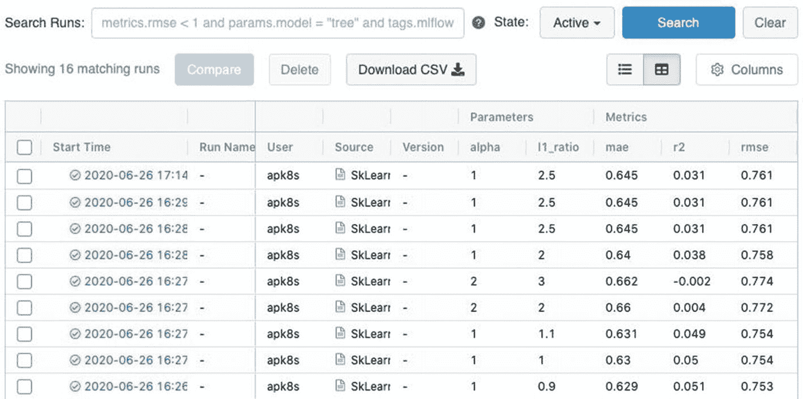

图 11-12

MLflow 记录的培训/实验

点击一个运行条目来查看细节以及与该运行相关的工件，在这个例子中，包括模型包 <sup>[49](#Fn49)</sup> 和源代码(参见图 [11-13](#Fig13) )。

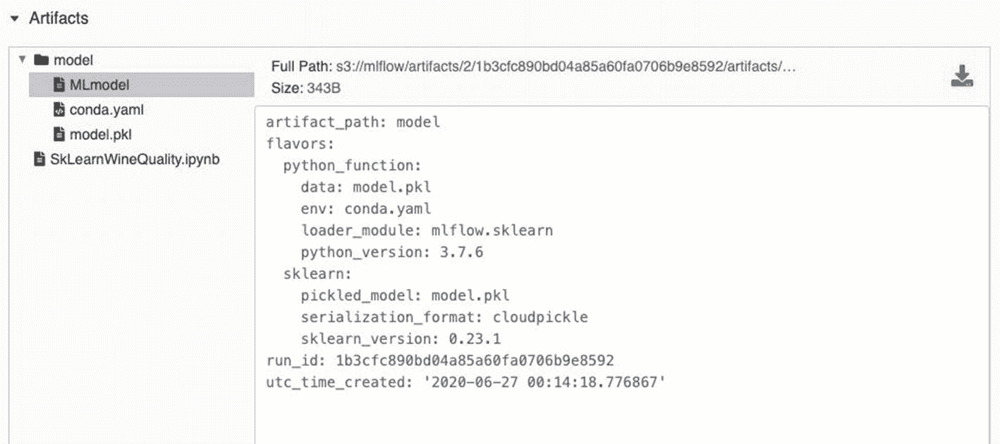

图 11-13

MLflow 打包模型

MLflow 带来了必不可少的机器学习组件，进一步缩小了原始数据和基于机器学习的人工智能之间的差距。在这一点上，新的 hc1 Kubernetes 混合集群支持从物联网设备、支持 GPU 的节点和多个云实例收集原始数据，提供入口、分布式存储、数据库、ETL 和机器学习开发应用。

机器学习开发的最后一步是生产部署，这将在下一节中介绍。

### 部署人工智能

机器学习模型的部署方法通常取决于问题域、业务需求和现有的基础设施。然而，一些项目在走向标准化的过程中获得了巨大的牵引力，特别是开源的 <sup>[50](#Fn50)</sup> 项目 Seldon Core。

#### 很少核心

这最后一节将介绍基于机器学习的模型在 Seldon Core 上的部署。Seldon Core 是 Kubernetes 的开源模型部署控制器。Seldon Core 与已建立的模型打包标准集成良好，提供预构建的推理服务器，包括支持 MLflow、 <sup>[51](#Fn51)</sup> scikit-learn、TensorFlow 和 XGBoost，并提供用于构建定制推理服务器的接口。本节仅使用部署前一节中构建的简单机器学习模型所需的 Seldon Core 的一小部分功能。

在撰写本文时，Seldon Core 不支持本章开发的 hc1 集群所使用的 Kubernetes 1.18。然而，Seldon Core 是一个活跃的项目，对最新 Kubernetes 版本的支持也不远了。然而，这个小限制提供了配置名为`c2`的额外集群的机会，在本例中，是 Linode 上的单节点 k3s 集群。 <sup>[52](#Fn52)</sup>

创建一个具有 4 个 CPU、8 GB RAM 和 160 GB 存储空间的 Linode 实例，运行 Ubuntu 18.04，并使用 Tokyo 2 区域来保持全局主题。命名服务器`tokyo2-1`并为指向其公共 IP 的`tokyo2-1.c2.apk8s.dev`和`*.c2.apk8s.dev`创建 DNS `A`条目。

指导 k3s 安装 Kubernetes v1.17 版:

```
$ export INSTALL_K3S_VERSION=v1.17.7+k3s1

```

创建并保存一个群集密码，用其他节点扩展此群集时需要该密码:

```
$ export K3S_CLUSTER_SECRET=$(head -c48 /dev/urandom | base64)

# copy the echoed secret
$ echo $K3S_CLUSTER_SECRET

```

安装 k3s:

```
$ curl -sfL https://get.k3s.io | sh -s – server

```

将 k3s kubectl 配置文件下载到本地工作站:

```
$ scp root@tokyo2-1.c2.apk8s.dev:/etc/rancher/k3s/k3s.yaml  ~/.kube/apk8s-c2

```

编辑新配置以指向 c2 Kubernetes API，并命名集群和上下文:

```
$ sed -i .bk "s/default/apk8s-c2/" ~/.kube/apk8s-c2
$ sed -i .bk "s/127.0.0.1/tokyo2-1.c2.apk8s.dev/" ~/.kube/apk8s-c2

```

使用新的`apk8s-c2`配置在位置工作站上的新终端中使用`c2`集群:

```
$ export KUBECONFIG=~/.kube/apk8s-c2

```

为很少核心创建命名空间:

```
$ kubectl create namespace seldon-system

```

安装带 Helm 的少芯操作器 <sup>[53](#Fn53)</sup> :

```
$ helm install seldon-core seldon-core-operator \
    --repo https://storage.googleapis.com/seldon-charts \
    --set usageMetrics.enabled=true \
    --namespace seldon-system

```

创建目录`cluster-apk8s-c2/`。在新目录中，用清单 [11-15](#PC77) 中的内容创建一个名为`000-sd-s3-secret.yml`的文件。用访问模型所需的 MinIO 凭据替换修订值，这些凭据与 MLflow 一起存储(请参考本章前面的 MLflow 配置)。

```
apiVersion: v1
kind: Secret
metadata:
  name: seldon-s3-model-secret
type: Opaque
stringData:
  AWS_ENDPOINT_URL: "https://minio.hc1.apk8s.dev"
  AWS_ACCESS_KEY_ID: "REDACTED"
  AWS_SECRET_ACCESS_KEY: "REDACTED"
  USE_SSL: "true"

Listing 11-15Secret containing s3 (MinIO) config and credentials

```

应用秘密:

```
$ kubectl apply -f 000-sd-s3-secret.yml

```

接下来，用清单 [11-16](#PC79) 中的内容创建一个名为`100-sd-quality.yml`的文件。将`modelUri:`值更改为 MLflow 模型的位置(见图 [11-13](#Fig13) )配置。额外的`componentSpecs:`是可选的，并配置了更多的就绪性和活性探测等待时间，以更好地考虑资源受限的`c2`集群。按照第 [2](02.html) 章中最初所述安装证书管理器，以便在连接的入口配置上提供 TLS 支持。

```
apiVersion: machinelearning.seldon.io/v1alpha2
kind: SeldonDeployment
metadata:
  name: quality
spec:
  name: quality
  predictors:
    - graph:
        children: []
        implementation: MLFLOW_SERVER
        modelUri: s3://mlflow/artifacts/2/1b3cfc890bd04a85a60fa0706b9e8592/artifacts/model
        envSecretRefName: seldon-s3-model-secret
        name: quality
      name: default
      replicas: 1
      componentSpecs:
        - spec:
            containers:
              - name: quality
                readinessProbe:
                  failureThreshold: 10
                  initialDelaySeconds: 120
                  periodSeconds: 10
                  successThreshold: 1
                  tcpSocket:
                    port: http
                  timeoutSeconds: 5
                livenessProbe:
                  failureThreshold: 10
                  initialDelaySeconds: 120
                  periodSeconds: 10
                  successThreshold: 1
                  tcpSocket:
                    port: http
                  timeoutSeconds: 5
---
apiVersion: extensions/v1beta1
kind: Ingress
metadata:
  name: quality
  labels:
    app: quality
  annotations:
    cert-manager.io/cluster-issuer: letsencrypt-production
    kubernetes.io/ingress.class: traefik
spec:
  rules:
    - host: quality.c2.apk8s.dev
      http:
        paths:

          - backend:
              serviceName: quality-default
              servicePort: 8000
            path: /
  tls:
    - hosts:
        - quality.c2.apk8s.dev
      secretName: default-quality-production-tls

Listing 11-16SeldonDeployment with Ingress

```

应用很少部署和进入:

```
$ kubectl apply -f 100-sd-quality.yml

```

部署模型可能需要几分钟时间。监视默认命名空间中新生成的 Pod 的状态；一旦两个容器中的两个报告就绪，Pod 就可以接受发布的数据并提供预测。

通过发布模型的预期输入，使用`curl`测试部署，在本例中是一个二维数组(或数组的数组)，每个数组包含进行预测所需的 11 个值。该模型为每个内部数组返回一个预测:

```
$ curl -X POST https://quality.c2.apk8s.dev/api/v1.0/predictions \
      -H 'Content-Type: application/json' \
      -d '{ "data": { "ndarray": [[ 6.4, 0.57, 0.02, 1.8, 0.067, 4.0, 11.0, 0.997, 3.46, 0.68, 9.5]] } }'

```

返回的预测是`5.703684339252623`:

```
{"data":{"names":[],"ndarray":[5.703684339252623]},"meta":{}}

```

这一部分移动得很快，轻描淡写地触及了谢顿核心能力的表面。然而，它展示了一系列不同组件之间几乎无缝的互操作性，从在 Jupyter 笔记本电脑中构建 scikit-learn 模型，在 MLflow 中跟踪和服务模型，到使用 Seldon Core 进行最终部署，所有这些都集成在 Kubernetes 之上。

## 摘要

本章在 Raspberry Pi 设备、公共云和内部安装了九个节点，利用资源受限的低成本基础设施，通过加密网络在全球范围内进行通信。目的是演示使用 Kubernetes 创建一个机器学习平台，并涵盖支持该平台的数据的整个生命周期。

本章展示了 Kubernetes 在提供广泛的功能以及抽象和统一物联网部署、ETL、数据科学和人工智能的底层基础设施方面的适用性。虽然一些组件如 Apache NiFi 和 Elasticsearch 与 Kubernetes API 没有直接联系，但其他组件如 Jupyter 的 KubeSpawner 和 Seldon Core 则直接使用它。

虽然这一章涵盖了很多领域，但它只是简要地触及了开发和部署基于机器学习的人工智能作为平台的每个关键方面。然而，使平台成为平台的是改进和扩展的框架。

Kubernetes 促进了平台架构的高级概念，通过聚合和组合实现了构造方法的标准化。Kubernetes 提供了在没有直接 it 意识的情况下聚合组件的能力，以及为直接利用或扩展其 API 而构建的组件，几乎完全抽象了底层基础架构，同时提供了伸缩性、容错和自修复。Kubernetes 通过连接物联网、机器学习、区块链、大数据和 Kubernetes API 的最新创新时产生的组合效应，促进了创新问题解决平台的探索。

<aside aria-label="Footnotes" class="FootnoteSection" epub:type="footnotes">Footnotes [1](#Fn1_source)

[T2`www.raspberrypi.org/downloads/raspberry-pi-os/`](http://www.raspberrypi.org/downloads/raspberry-pi-os/)

  [2](#Fn2_source)

[T2`www.cloudflare.com/`](http://www.cloudflare.com/)

  [3](#Fn3_source)

[T2`www.ionos.com/digitalguide/server/tools/free-dynamic-dns-providers-an-overview/`](http://www.ionos.com/digitalguide/server/tools/free-dynamic-dns-providers-an-overview/)

  [4](#Fn4_source)

[T2`https://github.com/squat/kilo`](https://github.com/squat/kilo)

  [5](#Fn5_source)

[T2`www.infoblox.com/glossary/layer-3-of-the-osi-model-network-layer/`](http://www.infoblox.com/glossary/layer-3-of-the-osi-model-network-layer/)

  [6](#Fn6_source)

[T2`www.nvidia.com/en-in/geforce/products/10series/geforce-gtx-1070/`](http://www.nvidia.com/en-in/geforce/products/10series/geforce-gtx-1070/)

  [7](#Fn7_source)

[T2`www.nvidia.com/en-us/data-center/`](http://www.nvidia.com/en-us/data-center/)

  [8](#Fn8_source)

[T2`https://developer.nvidia.com/cuda-zone`](https://developer.nvidia.com/cuda-zone)

  [9](#Fn9_source)

[T2`www.khronos.org/opencl/`](http://www.khronos.org/opencl/)

  [10](#Fn10_source)

尼古拉·迪莫拉罗夫。"关于 CUDA 围墙花园外的深度学习状态."博客。走向数据科学，2019 年 6 月 4 日。 [`https://towardsdatascience.com/on-the-state-of-deep-learning-outside-of-cudas-walled-garden-d88c8bbb4342`](https://towardsdatascience.com/on-the-state-of-deep-learning-outside-of-cudas-walled-garden-d88c8bbb4342) 。

  [11](#Fn11_source)

[T2`http://releases.ubuntu.com/18.04.4/`](http://releases.ubuntu.com/18.04.4/)

  [12](#Fn12_source)

[T2`https://help.ubuntu.com/community/Installation/FromUSBStick`](https://help.ubuntu.com/community/Installation/FromUSBStick)

  [13](#Fn13_source)

[T2`https://en.wikipedia.org/wiki/Dynamic_DNS`](https://en.wikipedia.org/wiki/Dynamic_DNS)

  [14](#Fn14_source)

[T2`https://containerd.io/`](https://containerd.io/)

  [15](#Fn15_source)

[T2`https://github.com/NVIDIA/nvidia-docker`](https://github.com/NVIDIA/nvidia-docker)

  [16](#Fn16_source)

[T2`https://computingforgeeks.com/docker-vs-cri-o-vs-containerd/`](https://computingforgeeks.com/docker-vs-cri-o-vs-containerd/)

  [17](#Fn17_source)

[T2`https://dev.to/mweibel/add-nvidia-gpu-support-to-k3s-with-containerd-4j17`](https://dev.to/mweibel/add-nvidia-gpu-support-to-k3s-with-containerd-4j17)

  [18](#Fn18_source)

皮尔彻，艾弗拉姆和 2020。"随着电路板需求激增，树莓皮为通风机提供动力."汤姆的硬件。2020 年 6 月 26 日访问。 [`www.tomshardware.com/news/raspberry-pi-ventilators`](http://www.tomshardware.com/news/raspberry-pi-ventilators) 。

  [19](#Fn19_source)

[T2`www.arm.com/products/silicon-ip-cpu`](http://www.arm.com/products/silicon-ip-cpu)

  [20](#Fn20_source)

[T2`www.embedded.com/dev-boards-help-speed-iot-design/`](http://www.embedded.com/dev-boards-help-speed-iot-design/)

  [21](#Fn21_source)

[T2`https://bgr.com/2020/04/23/arm-based-mac-release-date-apple-processor-2021/`](https://bgr.com/2020/04/23/arm-based-mac-release-date-apple-processor-2021/)

  [22](#Fn22_source)

[T2`www.raspberrypi.org/downloads/`](http://www.raspberrypi.org/downloads/)

  [23](#Fn23_source)

[T2`https://downloads.raspberrypi.org/raspios_lite_armhf_latest`](https://downloads.raspberrypi.org/raspios_lite_armhf_latest)

  [24](#Fn24_source)

[T2`https://engineerworkshop.com/blog/how-to-set-up-wireguard-on-a-raspberry-pi/`](https://engineerworkshop.com/blog/how-to-set-up-wireguard-on-a-raspberry-pi/)

  [25](#Fn25_source)

[T2`https://github.com/adrianmihalko/raspberrypiwireguard`](https://github.com/adrianmihalko/raspberrypiwireguard)

  [26](#Fn26_source)

[T2`https://sigmdel.ca/michel/ha/wireguard/wireguard_02_en.html#buster`](https://sigmdel.ca/michel/ha/wireguard/wireguard_02_en.html%2523buster)

  [27](#Fn27_source)

[T2`https://github.com/squat/kilo/blob/master/docs/topology.md`](https://github.com/squat/kilo/blob/master/docs/topology.md)

  [28](#Fn28_source)

[T2`https://hub.docker.com/_/debian/`](https://hub.docker.com/_/debian/)

  [29](#Fn29_source)

[T2`https://pip.pypa.io/en/stable/reference/pip_freeze/`](https://pip.pypa.io/en/stable/reference/pip_freeze/)

  [30](#Fn30_source)

[T2`https://kubernetes.io/docs/concepts/workloads/controllers/cron-jobs/`](https://kubernetes.io/docs/concepts/workloads/controllers/cron-jobs/)

  [31](#Fn31_source)

黄，伊泰。“什么是 AutoML？承诺与现实。”博客。物联网(博客)，2018 年 3 月 29 日。 [`www.iotforall.com/what-is-automl-promises-vs-realityauto/`](http://www.iotforall.com/what-is-automl-promises-vs-realityauto/) 。

  [32](#Fn32_source)

[T2`www.kubeflow.org/`](http://www.kubeflow.org/)

  [33](#Fn33_source)

[T2`www.pachyderm.com/`](http://www.pachyderm.com/)

  [34](#Fn34_source)

[T2`https://MLflow.org/`](https://mlflow.org/)

  [35](#Fn35_source)

[T2`www.seldon.io/`](http://www.seldon.io/)

  [36](#Fn36_source)

[T2`https://github.com/jupyter/docker-stacks`](https://github.com/jupyter/docker-stacks)

  [37](#Fn37_source)

[T2`https://github.com/iot-salzburg/gpu-jupyter`](https://github.com/iot-salzburg/gpu-jupyter)

  [38](#Fn38_source)

[T2`https://zero-to-jupyterhub.readthedocs.io/en/latest/customizing/user-environment.html`](https://zero-to-jupyterhub.readthedocs.io/en/latest/customizing/user-environment.html)

  [39](#Fn39_source)

[T2`https://MLflow.org/`](https://mlflow.org/)

  [40](#Fn40_source)

[T2`https://databricks.com/`](https://databricks.com/)

  [41](#Fn41_source)

MSV，贾纳基拉姆。" Databricks 向 Linux 基金会捐赠 MLflow 项目."福布斯。2020 年 6 月 25 日。 [`www.forbes.com/sites/janakirammsv/2020/06/25/databricks-donates-MLflow-project-to-linux-foundation/`](http://www.forbes.com/sites/janakirammsv/2020/06/25/databricks-donates-MLflow-project-to-linux-foundation/) 。

  [42](#Fn42_source)

[T2`https://docs.paperspace.com/machine-learning/wiki/artifacts`](https://docs.paperspace.com/machine-learning/wiki/artifacts)

  [43](#Fn43_source)

[T2`https://imti.co/kubernetes-ingress-basic-auth/`](https://imti.co/kubernetes-ingress-basic-auth/)

  [44](#Fn44_source)

[T2`www.mlflow.org/docs/latest/plugins.html#writing-your-own-mlflow-plugins`](http://www.mlflow.org/docs/latest/plugins.html%2523writing-your-own-mlflow-plugins)

  [45](#Fn45_source)

[T2`https://github.com/mlflow/mlflow/blob/master/examples/sklearn_elasticnet_wine/train.ipynb`](https://github.com/mlflow/mlflow/blob/master/examples/sklearn_elasticnet_wine/train.ipynb)

  [46](#Fn46_source)

[T2`www.mlflow.org/docs/latest/tutorials-and-examples/tutorial.html`](http://www.mlflow.org/docs/latest/tutorials-and-examples/tutorial.html)

  [47](#Fn47_source)

[T2`https://scikit-learn.org/stable/modules/generated/sklearn.linear_model.ElasticNet.html`](https://scikit-learn.org/stable/modules/generated/sklearn.linear_model.ElasticNet.html)

  [48](#Fn48_source)

页（page 的缩写）科尔特斯、塞德伊拉、阿尔梅达、马托斯和雷伊斯。通过物理化学特性的数据挖掘建立葡萄酒偏好模型。在决策支持系统中，Elsevier，47(4):547-553，2009。

  [49](#Fn49_source)

[T2`https://mlflow.org/docs/latest/models.html`](https://mlflow.org/docs/latest/models.html)

  [50](#Fn50_source)

豪斯利亚历克斯。"我们开源机器学习的第一年."中，2016 年 4 月 3 日。 [`https://medium.com/seldon-open-source-machine-learning/our-first-year-open-sourcing-machine-learning-59241f2f0dd0`](https://medium.com/seldon-open-source-machine-learning/our-first-year-open-sourcing-machine-learning-59241f2f0dd0) 。

  [51](#Fn51_source)

[T2`https://docs.seldon.io/projects/seldon-core/en/v1.1.0/servers/MLflow.html`](https://docs.seldon.io/projects/seldon-core/en/v1.1.0/servers/MLflow.html)

  [52](#Fn52_source)

[T2`www.linode.com/`](http://www.linode.com/)

  [53](#Fn53_source)

[T2`https://docs.seldon.io/projects/seldon-core/en/latest/charts/seldon-core-operator.html`](https://docs.seldon.io/projects/seldon-core/en/latest/charts/seldon-core-operator.html)

 </aside>