# 五、保护和监控 AKS 上运行的应用

## 介绍

首先，祝贺你完成了本书的 60%。在阅读完架构设计和模式之后，在本章中，你将经历另一个有趣而重要的方面——监控和保护基于 Azure Kubernetes 服务的应用。你一定很奇怪我为什么不提微服务。答案很简单——当我说应用时，它涵盖了所有内容。

数字平台计划正在促使组织拥抱云文化。云支持包括构建向客户交付更多价值的战略。其中一个策略关注应用的安全性。随着开发步伐的不断加快，规划应用的安全性以避免业务运营中的任何障碍变得非常重要。

在这里，我将向您介绍应用和集群的安全概念，并以应用在安全性方面的最佳估算者之一作为结论。

## 安全概念

Kubernetes 和 Microsoft Azure 都包含各自的安全组件。Azure Kubernetes 服务结合了这些安全组件，以:

*   确保您的 AKS 集群运行的是最新的 Kubernetes 版本

*   确保它拥有最新的操作系统安全更新

*   安全 Pod 流量

*   提供对敏感凭据的可信访问

让我们深入了解一些在 Azure Kubernetes 服务中保护应用和集群的核心概念。

### 主安全

在 AKS 中，每个集群都有一个专用的 Kubernetes 主支持 API 服务器、调度程序等等。这个 Kubernetes API 服务器使用一个 FQDN——一个完全合格的域名——以及一个公共 IP 地址。作为一项 PaaS 服务，Kubernetes 主组件包含在托管服务中，由微软维护。

您可以通过以下方式采用它们:

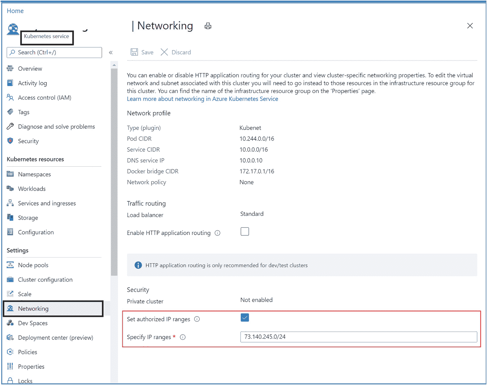

图 5-1

Azure PortalImage 中的授权 IP 范围功能图片来源:Microsoft 文档

*   您可以创建一个专用集群，限制服务器对专用虚拟网络的访问。

*   使用授权的 IP 范围，您可以限制对 API 服务器端点的访问。参见图 5-1 。

此外，您可以使用 Kubernetes RBAC 和 Azure RBAC 来控制访问。详见 [`https://docs.microsoft.com/en-us/azure/aks/managed-aad`](https://docs.microsoft.com/en-us/azure/aks/managed-aad) 的实施细节。

### 节点安全性

Azure Kubernetes 服务节点只不过是您管理的虚拟机。Linux 和 Windows 服务器节点都分别运行优化的 Ubuntu 发行版和 Windows Server 2019 版本，使用 Docker 容器运行时。

无论何时创建 AKS 集群，也无论何时扩展，最新的操作系统安全更新和配置都会自动部署到节点上。

Linux 节点和 Windows server 节点的安全补丁可以通过运行简单的 azure CLI 命令来实现。为了更好地理解，以下 Azure CLI 命令将升级名为`myaksbooknodepool`的节点池:

```
az aks nodepool upgrade 
    --resource-group myAKSBookResourceGroup \
    --cluster-name myAKSBookCluster \
    --name myaksbooknodepool \
    --kubernetes-version KUBERNETES_VERSION \
    --no-wait

```

这只是可用于管理节点的各种简单 Azure CLI 命令中的一个示例。

节点总是部署到专用虚拟网络。甚至节点使用的存储都是由固态硬盘支持的优质 Azure 托管磁盘。在 Azure 平台中，这个磁盘上的数据在静态时总是加密的。Azure 还为隔离的虚拟机提供了选项，这是合规性和监管要求的一部分。这适用于 Linux 和 Windows 虚拟机。在撰写本书时，有几个选项可用于隔离的虚拟机:

*   `Standard_E80ids_v4`

*   `Standard_E80is_v4`

*   `Standard_F72s_v2`

*   `Standard_M128ms`

*   `Standard_DC8_v2`

### 集群升级

Azure 提供了一个升级编排工具，它包括 Kubernetes 主组件和代理组件。该工具支持以下操作:

*   AKS 集群及其组件的升级

*   安全维护

*   合规维护

*   访问最新功能

它所需要的只是可用的 Kubernetes 版本，剩下的就交给它了，当然，只需要更少的命令。

### 网络安全性

为了与本地网络通信，您可以将 AKS 部署到 Azure 虚拟网络子网。使用站点到站点 VPN 或快速路由，此虚拟网络连接到您的内部网络。您还可以使用私有的内部 IP 地址定义 Kubernetes 入口控制器，以限制服务对网络连接的访问。您可以利用 Azure 网络安全组甚至 Kubernetes 网络策略来控制流量。

Azure Kubernetes 服务提供对 Kubernetes 网络策略的支持，以基于名称空间、标签选择器等来限制给定集群中的 pod 之间的网络流量。

### 不可告人的秘密

使用 Kubernetes Secret，您可以将您的敏感数据(如访问凭证和密钥)添加到 Pods 中。使用机密可以最大限度地减少(Pod 或服务 YAML)清单中敏感信息的使用。您可以请求将该秘密作为您的清单的一部分，将对该信息的访问仅限于特定的 pod。

Kubernetes 的秘密存储在`Etcd`中，这是一个分布式键值存储。`Etcd`商店完全由 AKS 管理，数据在 Azure 平台内被加密。见图 5-2 。

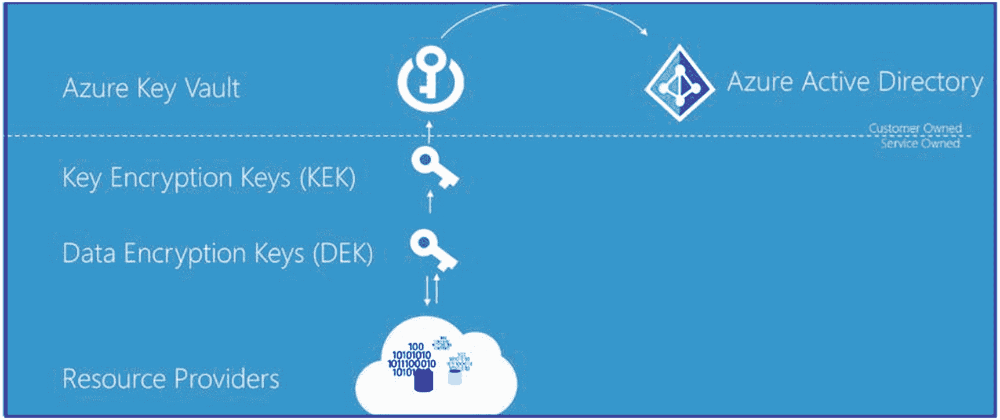

图 5-2

Azure 静态加密组件图片来源:微软文档

关于库伯内特的秘密，有几点你需要知道:

*   您可以使用 Kubernetes API 创建一个秘密。

*   你为你的 Pod 定义和请求秘密。

*   秘密不是写在磁盘上，而是存储在`tmpfs`里。

*   当需要该秘密的 Pod 被删除时，该秘密也被从`tmpfs`节点中删除。

*   机密存储在一个名称空间中，使得它们只能由同一名称空间中的 pod 访问。

除了这些与应用和集群相关的安全概念之外，最好还了解以下内容:

*   Azure Kubernetes 服务的 Azure 安全基线

    (见 [`https://docs.microsoft.com/en-us/security/benchmark/azure/baselines/aks-security-baseline?context=/azure/aks/context/aks-context`](https://docs.microsoft.com/en-us/security/benchmark/azure/baselines/aks-security-baseline%253Fcontext%253D/azure/aks/context/aks-context) )。)

*   针对 Azure Kubernetes 服务(AKS)的 Azure 策略法规遵从性控制

    (见 [`https://docs.microsoft.com/en-us/azure/aks/security-controls-policy`](https://docs.microsoft.com/en-us/azure/aks/security-controls-policy) )。)

## 蓝色库柏服务清单

此清单包含一些在使用 AKS 时要遵循的最佳实践。它不是一种要遵循的圣经，而只是在涉及到安全性时要遵循的最佳实践


图 5-3

*Kubernetes Secrets* *和* *Azure KeyVault 图标*

*   **避免将敏感信息注入图像，使用秘密代替**。如上所述，避免将密码等敏感信息直接输入到图像或清单中。相反，总是使用秘密 Kubernetes Secrets 或 Azure Key vault——来存储这类信息。见图 5-3 。

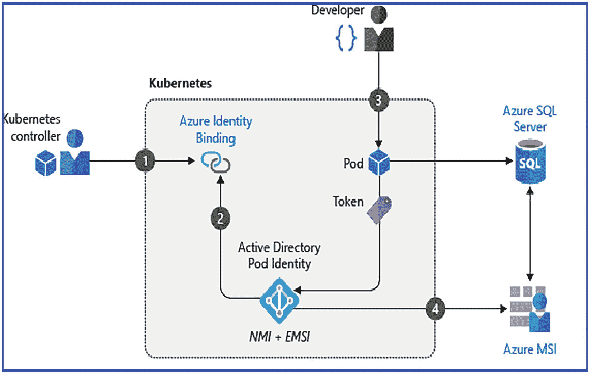

图 5-4

一名开发人员创建了一个 Pod，它使用托管身份来请求访问 Azure SQL 数据库图片来源:Microsoft 文档

*   **执行 Pod 身份识别**。不要在 Pod 映像中存储固定的凭据。相反，您可以使用 Pod 身份，它使用 Azure 身份解决方案来访问所需的(Azure)资源。这些凭证可以是用于与其他 Azure 服务对话的任何凭证，如 Azure SQL 或 Azure Storage。您可以在 Kubernetes Secrets 中定义它们，但它需要手动管理。在这里，您可能会错过轮换正在使用的机密的最佳实践。

    Azure 资源的 Pod 管理的身份可用于通过 Azure AD 进行访问请求。图 5-4 描述了请求流程。

Note

在写这本书的时候，AK 的 Pod 管理的身份是预览版。


图 5-5

AKS 集群中的命名空间示例图像源:Microsoft 文档

*   **使用 Kubernetes 名称空间**。名称空间是资源的逻辑分区。它们不仅加强了资源的分离，还限制了允许的用户范围。为了便于理解，不同的业务单位或组可以有不同的名称空间。您应该使用 Kubernetes 名称空间来隔离您的 Kubernetes 资源。见图 5-5 。

创建 AKS 集群时，可以使用以下命名空间:

*   `Default`:当没有给定名称空间时，这是创建窗格的地方。

*   `kube-system`:有核心资源的地方。

*   任何用户都可以查看这些资源。

Important

避免使用默认名称空间。

*   **为 Pod** 指定正确的安全上下文。这是决定 Pod 访问控制设置的一个重要因素。如果没有设置上下文，Pod 将获得默认的上下文，这将为它提供更多的权限。

*   **体现最佳实践**。确保清单的配置遵循最佳做法。一个好的清单代表一个好的集群。&# x1f 609；

*   **对构建的图像进行静态分析**。将 DevSecOps 引入到环境中，以促进主动安全模式，开始将责任转移到左边。azure Defender for container registries 可以在这里使用。

*   **执行合规** **打造形象**。您必须浏览 Azure Kubernetes 服务的 Azure 策略内置定义；见 [`https://docs.microsoft.com/en-us/azure/aks/policy-reference?ref=akschecklist`](https://docs.microsoft.com/en-us/azure/aks/policy-reference%253Fref%253Dakschecklist) 。

Note

收藏以下网址: [`https://www.the-aks-checklist.com/`](https://www.the-aks-checklist.com/) 。前面解释的七条戒律是这个论坛的一部分，它们会根据新的环境不断变化。

### 安全概念:结论

AKS 的安全方面可以在他们自己的一整本书中涵盖。然而，考虑到本章的范围，我试图总结出在使用基于 AKS 的应用时应该知道的事情。当讨论基于 AKS 的应用安全性时，请将这些答案视为您期望从面试官那里得到的答案。

下一节涵盖了另一个重要的领域，监控。

## 监控概念

您的应用是安全的，但需要一直保持运行和可用。保护不可用的应用是没有用的。因此，监控是你需要认识的一个重要领域。这一节将向您展示监控基于 AKS 的应用以及使用 Azure Monitor 监控 AKS 的细节。

### 容器洞察

可以监视生成性能指标和资源日志的资源的健康和性能。和其他 Azure 资源一样，Azure Kubernetes 服务也有日志。

Azure Monitor 有一个名为 Container Insights 的特性，它为托管在 AKS 上的托管 Kubernetes 运行这些检查。它之所以受欢迎，是因为它能够呈现来自不同监控场景的数据的交互式视图。它与 Azure Kubernetes 服务进行了本机集成，有助于收集关键日志、发送警报和可视化。图 5-6 展示了 Azure 门户中的容器洞察。

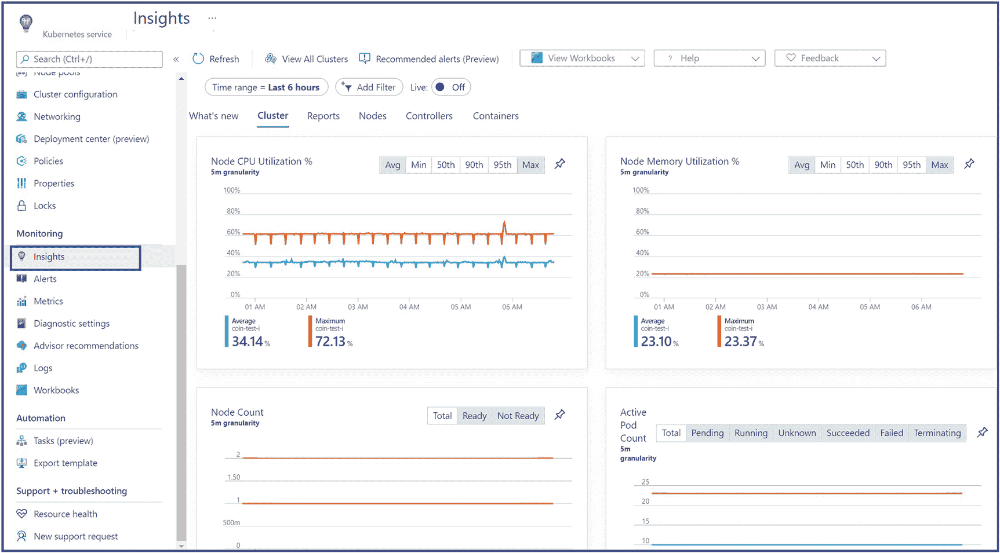

图 5-6

Container insightsImage 的功能来源:Microsoft 文档

以下是使用 Azure Monitor 为 AKS 集群配置监控所需的步骤:

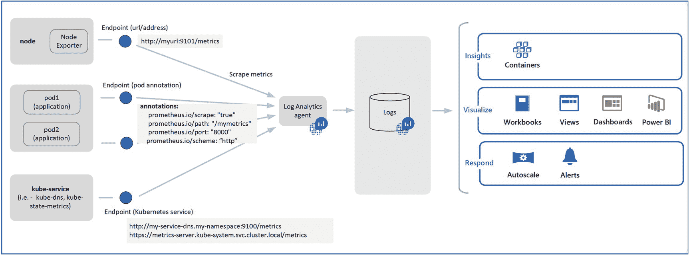

图 5-7

使用 Container Insights 配置 Prometheus 指标的抓取图片来源:微软文档

1.  创建日志分析工作区。您必须有一个日志分析工作区，以便从 AKS 集群收集遥测数据。Container Insights 需要至少一个日志分析工作区。

2.  启用容器洞察。启用容器洞察取决于您正在使用的 AKS 集群。AKS 集群已经存在还是新创建的？启用后，将部署日志分析代理的容器化版本，它将数据发送到 Azure Monitor。

3.  配置普罗米修斯的收藏。使用 Container Insights 允许您收集 Prometheus 指标，而不需要 Prometheus 服务器。这使得该组合对于 E2E 监测是成功的。参见图 5-7 ，该图描绘了 Container Insights 和 Prometheus 的工作情况。

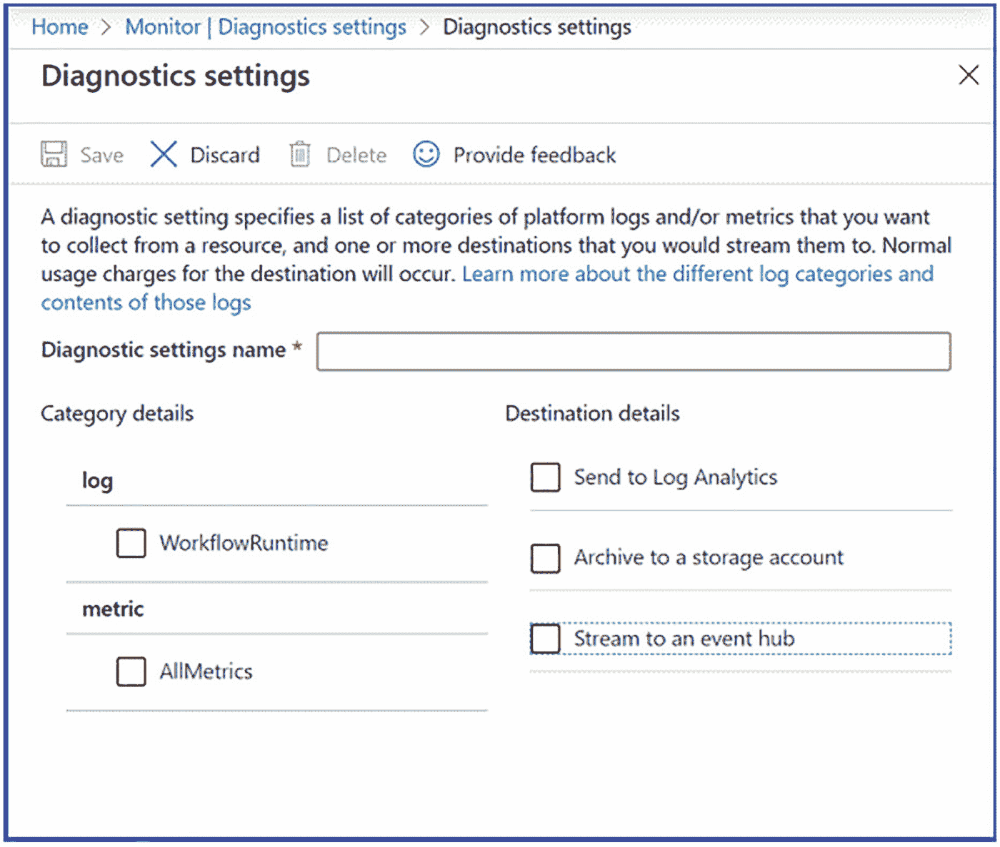

图 5-8

用于在 Azure 门户中配置诊断设置的屏幕

1.  收集资源日志。这些是 Azure 中实现的 AKS 控制平面组件的日志。您需要有一个诊断设置来收集这些日志。你可以把它放在日志分析工作区或者 Azure 存储中。图 5-8 显示了配置诊断设置的屏幕。

### Azure 监视器功能

有两种方式可以查看 AKS 集群的 Azure Monitor 功能:

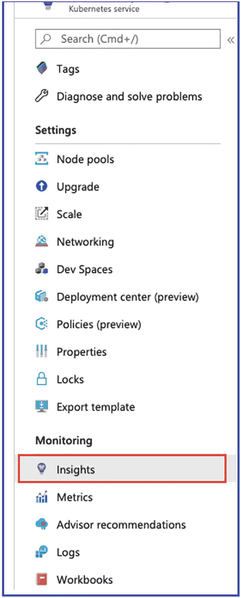

图 5-9

Azure 门户中 Kubernetes 服务屏幕的洞察选项

*   转到 Azure 门户➤ Kubernetes 服务，并从左侧窗格中选择监视器部分。这主要是针对单个 AKS 集群的。参见图 5-9 。

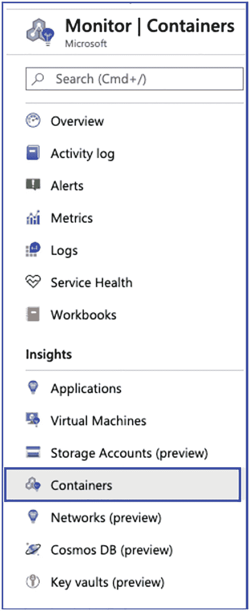

图 5-10

Azure Portal 监视器屏幕中的容器细节窗格

*   转到 Azure 门户网站。在搜索框中键入 **Monitor** ，然后选择 Insights Section ➤容器。

    图 5-10 显示了订阅中的所有 AKS 集群。

图 5-11 是 Azure Portal 中 Monitor 的新屏幕视图。它是监控集群、创建警报和许多更酷的实现的入口点。

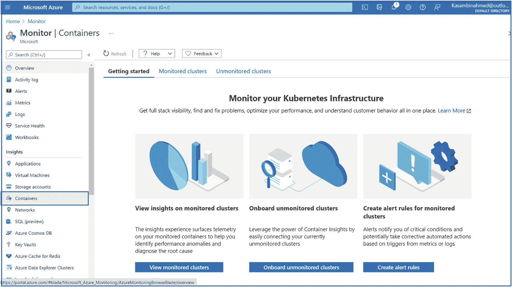

图 5-11

在 Azure Portal 的监控下*容器* *新鲜画面*

 *Azure Kubernetes 服务监控具有不同的实现和独特的需求。这种方法依赖于这些要求。它处理从基础设施到应用的不同层，并根据层提出不同的监控要求。

考虑自下而上的方法，这些层可以如图 5-12 所示列出。

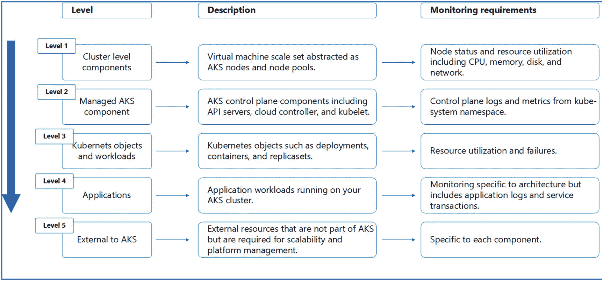

图 5-12

AKSImage 源的层:微软文档

为了保持本章的范围和简洁，我将讨论第 4 级，即监控应用层，它包括在 AKS 集群中运行的应用工作负载。

这一层主要关注监控微服务应用和识别应用故障，以及请求率、响应时间、遇到的任何异常等信息。对于在 AKS 上运行的应用的完整监控，您可以使用应用洞察，如图 5-13 所示。


图 5-13

应用洞察图标

根据您的应用堆栈，您需要配置基于代码的监控来收集所需的数据。它可以是任何东西——Java、Python、.Net 或任何其他平台。在这个例子中，我对 ASP.NET 核心应用更感兴趣。

您需要一个有效的 Application Insights 工具密钥，并创建 Application Insight 资源。

若要创建一个，请转到 Azure 订阅。在搜索中键入 **Application Insights** ，然后单击新建。您将看到一个屏幕，添加创建服务所需的基本强制细节。输入所有详细信息，然后单击“查看+创建”。参见图 5-14 。

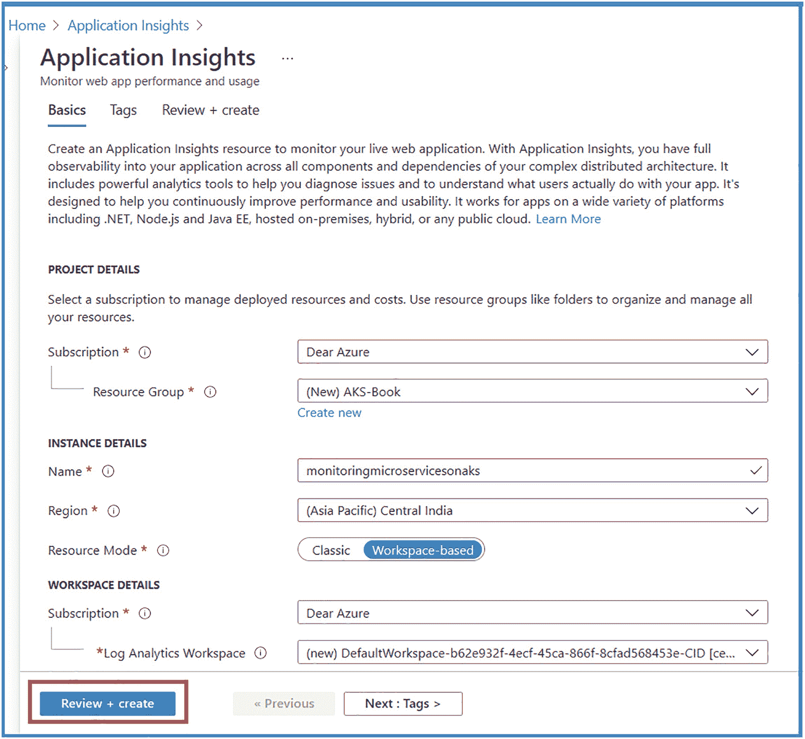

图 5-14

在 Azure 门户中创建应用洞察的屏幕

验证完成后，单击 Create 完成服务创建。

转到新创建的服务屏幕，在 Overview 部分下找到检测密钥、连接字符串和其他详细信息。参见图 5-15 中突出显示的部分。

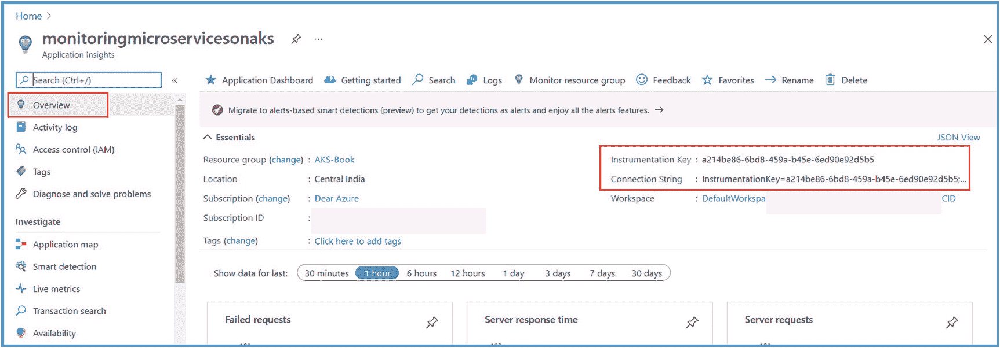

图 5-15

Azure 门户中应用洞察的工具键

Tip

强烈建议使用连接字符串而不是检测密钥，因为新的 Azure 区域需要连接字符串。无论哪种情况，您都需要创建服务。

接下来，您需要在您的 IDE 中启用应用洞察。我最喜欢的 IDE 是 Visual Studio，但是你也可以使用其他 IDE，比如可视化代码。使用 ide 启用 Application Insights 服务器端遥测后，选择 nu get packages➤Microsoft . application insights . aspnetcore 下载 SDK 的最新稳定版本。参见图 15-16 。

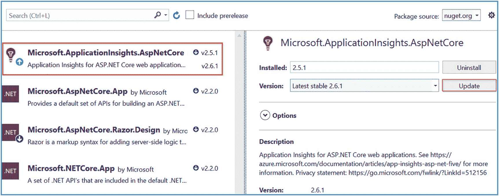

图 15-16

NuGet 包中的 SDK 图片来源:Microsoft 文档

通过向应用添加几行代码，它将从遥测数据开始，并可以在 Azure Portal 的 Applications Insights 屏幕中呈现。可以对这些数据进行分析，并根据应用的状态创建警报。

代码和其他选项请参考 [`https://docs.microsoft.com/en-us/azure/azure-monitor/app/asp-net-core`](https://docs.microsoft.com/en-us/azure/azure-monitor/app/asp-net-core) 。

## 摘要

本章介绍了关于保护和监控基于 AKS 的应用您应该知道的事情。通过提供的链接，确保您对这些问题有适当的实践经验。这一章结束了这本书的理论部分。下一章使用一个实用的分步方法来实现 Azure Kubernetes 基于服务的应用的 CICD。直到那时，快乐的蔚蓝学习。*