# 四、AWS 上的 macOS 服务器

传统上，iOS 应用开发人员必须购买硬件 macOS 工作站或服务器来开发 iOS 应用，因为这些应用只能在 iOS 操作系统上构建、测试和部署。这限制了开发人员将云原生解决方案集成到他们的开发过程中的能力，从而无法利用云的力量。

Amazon EC2 Mac 实例消除了这些限制，在这一章中，我们将深入研究部署它的不同选项，开始使用它来开发您的 iOS 应用。

*   本章使用的所有示例代码均可在 [`https://github.com/abdulola/devops-on-aws-ios-development/tree/main/Chapter_4`](https://github.com/abdulola/devops-on-aws-ios-development/tree/main/Chapter_4) 找到。

## Amazon EC2 Mac 服务器

Amazon EC2 Mac 释放了在云上运行按需 macOS 工作负载的能力，因此允许 iOS 开发人员受益于 AWS 云提供的灵活性、可扩展性、敏捷性和成本优势。

它由 Mac mini 硬件提供支持，目前由 3.2 GHz 英特尔第八代(咖啡湖)酷睿 i7 处理器提供支持。您可以使用 EC2 Mac 实例为 Apple 设备(如 iPhone、iPad、iPod、Mac、Apple Watch 和 Apple TV)开发、构建、测试和签署应用。

要连接到 EC2 Mac 实例，您可以使用 SSH 进行命令终端访问，或者使用支持虚拟网络计算(VNC)协议的客户端来获得完整的用户界面(UI)体验。

### EC2 限额和定价

因为每个 EC2 Mac 实例都是由实际的 Mac mini 硬件在幕后驱动的，所以默认情况下，AWS 会对提供 Mac 实例的帐户进行限制。这是为了防止滥用并为真实用户保留容量。

在您尝试部署之前，请查看您的 EC2 限额，以确保您有配额为您打算使用的区域中的帐户进行部署。要检查您的配额，请从 AWS 管理控制台转到 EC2 服务，如图 4-1 所示。


图 4-1

从 AWS 管理控制台访问 EC2

从 EC2 控制台，到达如图 4-2 所示的极限。

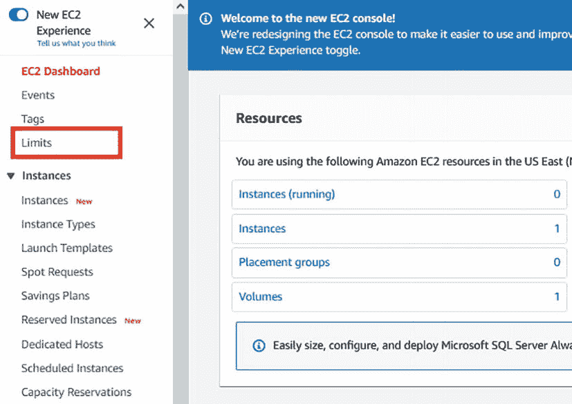

图 4-2

从 EC2 控制台访问限制页面

在那里可以搜索 Mac 专用主机限制，如图 4-3 所示。该限制表示您可以供应多少 Mac EC2 实例。如果适用，您可以从门户网站提出限额增加请求，并提供您的使用案例。


图 4-3

客户和地区的 EC2 Mac 限额

Mac 实例只能作为专用主机上的裸机实例，因为 Amazon EC2 Mac 实例和 Mac mini 服务器之间存在一对一的映射。您可以为每个专用主机启动一个 Mac 实例，并且可以与 AWS 组织内的 AWS 帐户或组织单位或整个 AWS 组织共享该专用主机。

EC2 Mac 实例不符合免费层的条件，按分配的专用主机计费，而不是按实例计费，专用主机在您可以释放之前有 24 小时的最短分配期。

*   由于在首次分配主机 24 小时后才能释放主机，因此您将需要支付至少 24 小时的使用费。

*   有关定价的更多信息，请参见 [`https://aws.amazon.com/ec2/instance-types/mac/`](https://aws.amazon.com/ec2/instance-types/mac/) 。

## 部署 Amazon EC2 Mac 服务器

像大多数 AWS 服务一样，您可以使用各种选项来提供 EC2 Mac 实例。在这一节中，我将通过创建和提供示例代码向您展示可用的主要选项。

### 使用 AWS 管理控制台部署

AWS 管理控制台是开始提供 AWS 服务的最简单方法。要配置 EC2 Mac 服务器，首先要配置一台专用主机。参见图 4-4 了解如何从 EC2 控制台访问专用主机。

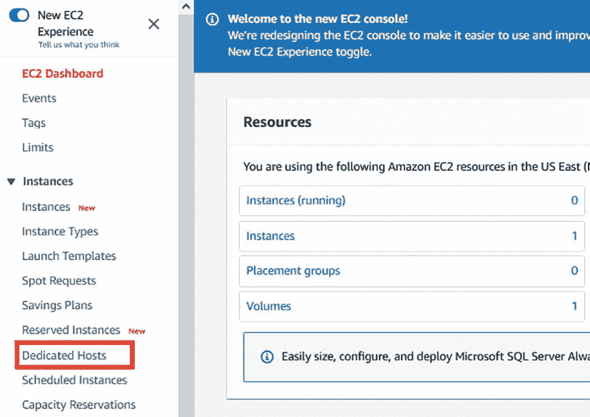

图 4-4

从 EC2 控制台访问专用主机

在专用主机控制台上，选择选项开始分配，如图 4-5 所示。


图 4-5

开始分配专用主机

如图 4-6 所示填写分配参数，分配专用主机。主要参数字段描述如下:

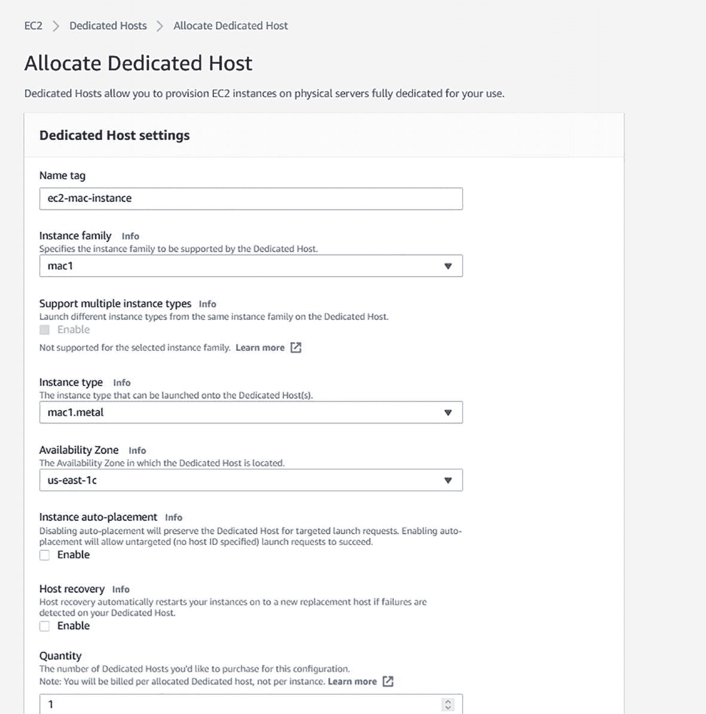

图 4-6

专用主机设置

*   **名称标签**–为专用主机提供一个名称。

*   **实例系列**–指定专用主机支持的实例系列。在这里，从下拉列表中选择实例族**“MAC 1”**。

*   **支持多种实例类型**–如果启用对多种实例类型的支持，主机可以支持所选实例系列中的不同实例类型。

    默认情况下，对于 Mac 实例族，此选项将灰显，因为当前只有一种实例类型。

*   **实例类型**–主机支持的实例类型。如果不将主机配置为支持多种实例类型，则必须选择要支持的特定实例类型。在这里，你选择 **mac1.metal** 。

*   **可用区**–分配主机的可用区；您可以选择列出的任何可用性区域，具体取决于您选择的数据中心。

*   **实例自动放置**–启用自动放置以允许主机接受与其主机配置相匹配的无目标实例启动。禁用自动放置以允许主机仅接受目标实例启动。默认情况下，它不会被启用。

*   **主机恢复**–主机恢复使用主机级运行状况检查来评估主机的可用性并检测底层系统故障。如果在主机上检测到故障，主机恢复会自动将故障主机上正在运行的实例重新启动到新的替代主机上。默认情况下，它不会被启用，并且不支持实例类型 mac1.metal。

*   **数量**–您希望为此配置购买的专用主机数量。

    您在此选择的数量不能大于您的配额限制。

*   一些可用性区域可能没有能力供应专用主机，这将导致分配失败；通过选择不同的可用性区域，再次尝试分配。

在分配之后，它可以立即在其上启动一个实例。图 4-7 显示了如何在专用主机上启动 EC2 Mac 实例的供应。


图 4-7

在专用主机上启动 Mac 实例

此操作将启动 EC2 实例创建过程。如图 4-8 所示，您选择 macOS Amazon 机器映像(AMI)用于启动 Mac EC2 实例。


图 4-8

为实例启动选择 macOS Amazon 机器映像(AMI)

下一步是选择实例类型。非灰色选项是所选 AMI 的可用实例类型。在图 4-9 中，已经选择了 mac1.metal 实例类型。


图 4-9

选择 macOS 实例类型

实例细节可以如图 4-10 所示进行配置。在这里，您可以配置 VPC、子网、主机配置等。

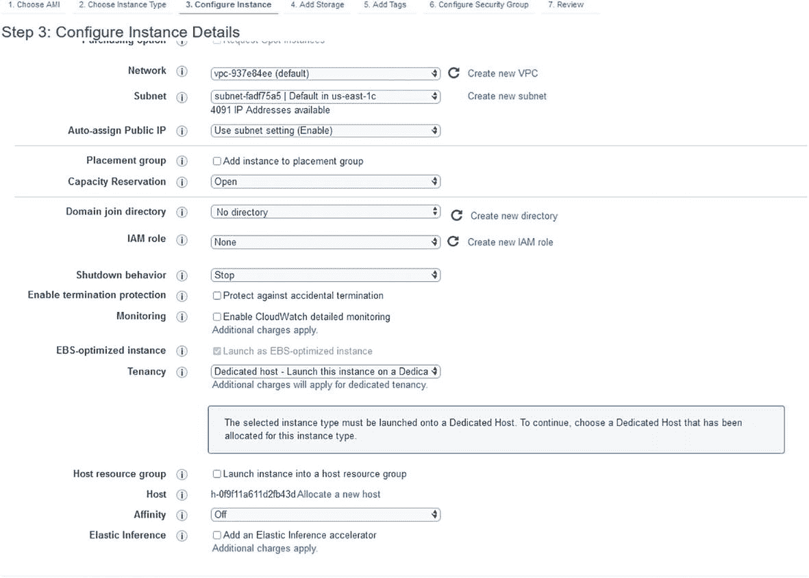

图 4-10

配置 EC2 Mac 详细信息

*   此次启动不需要 IAM(身份访问管理)角色，因此为 IAM 角色选项选择“无”并继续。

对于实例存储，现在可以配置默认存储，如图 4-11 所示。默认存储足以进行初始部署和连接。


图 4-11

默认 Mac 实例存储

为了在启动后允许入站网络连接到 Mac 实例，定义了安全组规则，以允许从特定 IP 连接到适用的端口。如图 4-12 所示，允许从我的 IP 地址到 TCP 端口 22(安全外壳(SSH)协议端口)和 TCP 端口 5900(虚拟网络计算(VNC)协议端口)的连接。


图 4-12

为入站连接配置安全组规则

配置安全组规则后，检查输入的所有配置详细信息的准确性，并继续启动实例。

此外，对于到 Mac 实例的入站用户 SSH 连接，需要 EC2 密钥对。您可以使用您在帐户中创建的现有密钥对，也可以创建一个新的密钥对。图 4-13 显示了在启动实例之前创建新密钥对的过程。

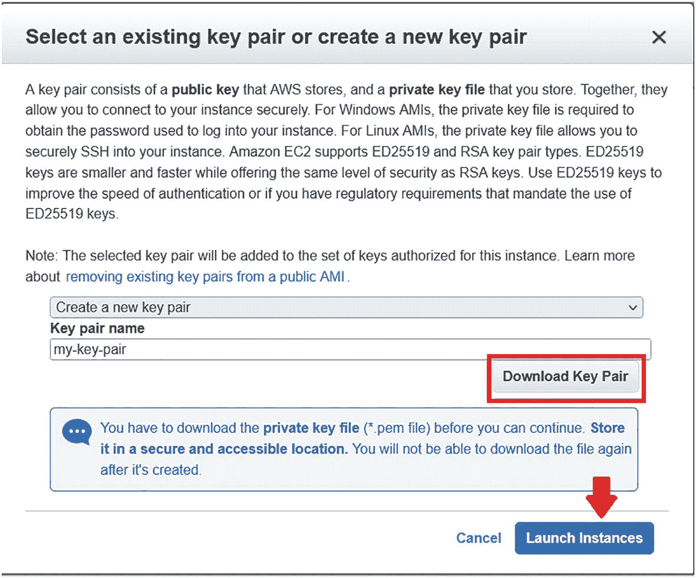

图 4-13

在启动实例之前创建新的 EC2 密钥对

实例一旦启动，就会出现在专用主机下的运行实例选项卡下，如图 4-14 所示。

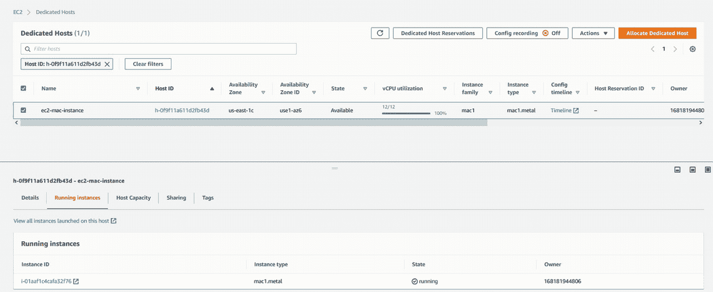

图 4-14

运行实例的专用主机

您还可以通过选择实例来查看有关运行实例的更多详细信息。这会将您重定向到 EC2 实例控制台，如图 4-15 所示。

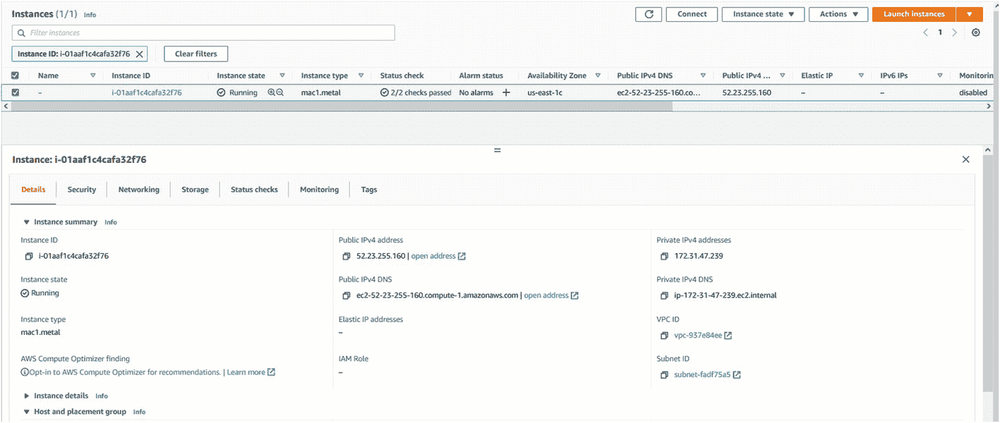

图 4-15

Mac EC2 实例详细信息

### 使用 AWS CLI 部署

EC2 Mac 实例也可以从 AWS 命令行界面(CLI)提供。要使用 AWS CLI，必须先将其安装在工作站上，并使用适当的身份访问管理(IAM)凭据配置工作站。

*   关于如何安装和配置 AWS CLI 的信息可在 [`https://docs.aws.amazon.com/cli/latest/userguide/getting-started-install.html`](https://docs.aws.amazon.com/cli/latest/userguide/getting-started-install.html) 找到。

要提供 EC2 Mac 实例，首先要分配一个专用主机，如清单 4-1 所示。

```
aws ec2 allocate-hosts --region us-east-1 --instance-type mac1.metal --availability-zone us-east-1c --auto-placement "on" --quantity 1

Listing 4-1Allocating dedicated host

```

一旦分配了专用主机，就可以创建一个 Mac 实例，如清单 4-2 所示。您将获得一个包含实例 ID 的响应，该实例 ID 可用于后续的 CLI 命令。

```
aws ec2 run-instances --region us-east-1 --instance-type mac1.metal --placement Tenancy=host --image-id ami-059ff882c04ebed21 --key-name my-key-pair

Listing 4-2Provisioning EC2 Mac instance on the dedicated host

```

通过描述清单 4-3 中所示的状态来验证创建的实例。使用在创建过程中从 CLI 响应中检索到的实例 ID。

```
aws ec2 describe-instance-status --instance-ids <Instance ID>

Listing 4-3Verifying Instance creation status

```

### 使用 AWS CloudFormation 部署

AWS CloudFormation 是一个基础设施即代码服务，它允许您对要在 jSON 或 YAML 模板中部署的资源进行建模。然后，该模板被传递给 AWS CloudFormation，以提供定义的资源。

要使用 CloudFormation 部署 EC2 Mac 实例，您将定义模板中所需的所有组件，如清单 4-4 所示。

```
Parameters:
  VpcId:
    Type: AWS::EC2::VPC::Id
    Description: VPC to launch the EC2 Mac Instance
  SubnetId:
    Type: AWS::EC2::Subnet::Id
    Description: |
      Subnet to launch the EC2 Mac Instance............
  MacEc2Host:
    Type: String
    Default: h-xxxxxxxxxxxxxx
    Description: The Host ID of the Allocated.........
  SourceIp:
    Type: String
    Default: 1.2.3.4/32

    Description: |
      Source IP address and subnet mask...............
  Ec2KeyPairName:
    Type: AWS::EC2::KeyPair::KeyName
    Description: Already existing EC2 keypair............
  MacOSAmi:
    Type: AWS::EC2::Image::Id
    Default: ami-059ff882c04ebed21
    Description:latest AMI ID for the Mac OS instance
Resources:
  Ec2MacSecurityGroup:
    Type: AWS::EC2::SecurityGroup
    Properties:
      VpcId: !Ref VpcId
      GroupDescription: Enable SSH and VNC access.........
      SecurityGroupIngress:
      - CidrIp: !Ref SourceIp
        FromPort: 22
        IpProtocol: tcp
        ToPort: 22
      - CidrIp: !Ref SourceIp
        FromPort: 5900
        IpProtocol: tcp
        ToPort: 5900
  MacEc2Instance:
    Type: AWS::EC2::Instance
    Properties:
      Affinity: host
      ImageId: !Ref MacOSAmi
      KeyName: !Ref Ec2KeyPairName
      InstanceType: mac1.metal
      HostId: !Ref MacEc2Host
      SubnetId: !Ref SubnetId
      SecurityGroupIds:
        - !Ref Ec2MacSecurityGroup
      BlockDeviceMappings:
        - DeviceName: /dev/sda1
          Ebs:
            VolumeType: gp2
            VolumeSize: '200'
            DeleteOnTermination: 'true'

Listing 4-4AWS CloudFormation template for EC2 Mac

```

模板的**参数**部分包含用户将提供的输入运行时参数，这些参数将在**资源**部分用于资源创建。

如清单 4-4 所示，模板中定义的两个资源是 EC2 Mac 安全组和 Mac 实例。要启动 CloudFormation 模板，从 AWS CloudFormation 控制台创建一个栈，选择文件，点击 next，如图 4-16 所示。

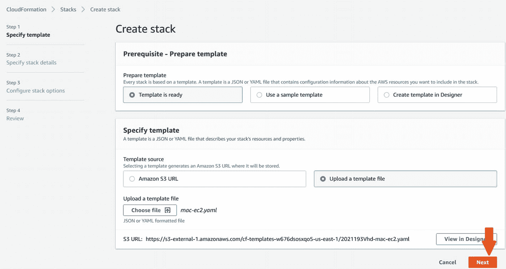

图 4-16

选择 EC2 Mac Cloudformation 模板以创建堆栈

接下来，您将输入模板中定义的用户参数，如图 4-17 所示。有些示例值已经作为默认值输入，应该用特定于您的环境和 AWS 帐户的信息覆盖这些值。

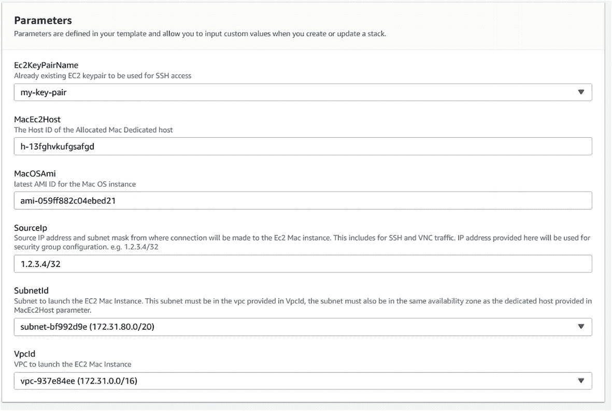

图 4-17

输入云形成堆栈参数

要在创建之前检查将要创建的资源，您可以创建一个变更集。改变设置如图 4-18 所示。


图 4-18

EC2 Mac 创建的云信息更改集

### 使用 Terraform 部署

Terraform 是一个开源基础设施，作为编码软件工具，允许您对模板中要提供的资源进行建模。Terraform 由 HashiCorp 创建，它使用一种称为 HashiCorp 配置语言(HCL)的声明式配置语言，文件扩展名为. tf。它还支持在 JSON 中声明资源。

清单 4-5 显示了 terraform HCL 模板中 EC2 Mac 资源的定义。

```
provider "aws" {
    region = "us-east-1"
}

variable "awsprops" {
    type = map(string)
    default = {
        vpcid = "vpc-937e84ee"
        subnetid = "subnet-c10c6fcf"
        ami = "ami-059ff882c04ebed21"
        keyname = "my-key-pair"
        hostid = "h-xxxxxxxxxxxx"
        sourceip = "1.2.3.4/32"
    }
}

resource "aws_security_group" "ec2-mac-instance-sg" {

  description = "Enable SSH and VNC access to Mac Instance"
  vpc_id = lookup(var.awsprops, "vpcid")

  // To Allow SSH Transport
  ingress {
    from_port = 22
    protocol = "tcp"
    to_port = 22
    cidr_blocks = [lookup(var.awsprops, "sourceip")]
  }

  // To Allow Port VNC Transport
  ingress {
    from_port = 5900
    protocol = "tcp"
    to_port = 5900
    cidr_blocks = [lookup(var.awsprops, "sourceip")]
  }
}

resource "aws_instance" "ec2-mac-instance" {
  ami = lookup(var.awsprops, "ami")
  key_name = lookup(var.awsprops, "keyname")
  host_id = lookup(var.awsprops, "hostid")
  instance_type = "mac1.metal"
  subnet_id = lookup(var.awsprops, "subnetid")
  vpc_security_group_ids = [
      aws_security_group.ec2-mac-instance-sg.id
  ]
  root_block_device {
    delete_on_termination = true
    volume_type = "gp2"
    volume_size = "200"
  }
}

Listing 4-5Terraform definition for EC2 Mac resources

```

与 AWS CloudFormation 一样，terraform 模板包含需要定制的输入变量和定义 EC2 安全性和 EC2 Mac 实例资源的资源部分。

要使用 Terraform，必须在工作站上安装软件，并且必须配置目标 AWS 帐户的身份访问管理(IAM)凭据。

*   有关安装 Terraform 的更多信息，请参见 [`https://learn.hashicorp.com/tutorials/terraform/install-cli`](https://learn.hashicorp.com/tutorials/terraform/install-cli) 。

部署 Terraform 中定义的资源。tf 文件，初始化您的工作目录，如清单 4-6 所示，使其成为 Terraform 工作目录，并安装所有的依赖项。

```
terraform> terraform init

Initializing the backend...

Initializing provider plugins...
- Finding latest version of hashicorp/aws...
- Installing hashicorp/aws v3.49.0...
- Installed hashicorp/aws v3.49.0 (signed by HashiCorp)

Listing 4-6Initializing Terraform

```

在尝试部署以修复任何语法问题之前，您还可以验证您的 Terraform 文件，如清单 4-7 所示。

```
terraform> terraform validate
Success! The configuration is valid.

Listing 4-7Validating Terraform files in directory

```

要预览像 CloudFormation 变更集一样将被提供的所有资源，您可以执行一个`terraform plan`命令。这向您显示了有关要调配的资源及其关系的详细信息。清单 4-8 显示了这个命令的输出片段。

```
terraform> terraform plan

Terraform used the selected providers to generate the following execution plan. Resource actions are indicated with the
following symbols:
  + create

Terraform will perform the following actions:

  # aws_instance.ec2-mac-instance will be created
  + resource "aws_instance" "ec2-mac-instance" {
      + ami                           = "ami-059ff882c04ebed21"
      + arn                           = (known after apply)
      + associate_public_ip_address   = (known after apply)
.
.
.
.
Plan: 2 to add, 0 to change, 0 to destroy.

-----------------------------------------------------------------------------------------------
Note: You didn't use the -out option to save this plan, so Terraform can't guarantee to take exactly these actions if you run "terraform apply" now.

Listing 4-8Viewing Terrform plan before resource creation

```

在查看了所有要创建的资源之后，要开始创建，您需要应用清单 4-9 中所示的配置。

```
terraform> terraform apply

Listing 4-9Applying terraform configuration

```

现在我已经展示了如何部署 EC2 Mac 服务器，接下来我们将探索如何连接到它。

## 连接到 Amazon EC2 Mac 服务器

对于每个新的 EC2 Mac 服务器，默认情况下禁用密码验证。第一次的默认访问方法是使用 SSHec2 用户帐户被配置用于 SSH 远程登录。要使用 SSH 进行连接，实例必须已经使用密钥对启动，并且其安全组允许从 SSH 连接发起的工作站进行 SSH 访问。

使用 SSH 连接后，可以配置密码验证，以允许使用虚拟网络计算(VNC)客户端进行连接。

### 使用 SSH 连接

为了使用 SSH 进行连接，本节讨论了各种选项，以适应您的操作系统和/或偏好。

#### Linux 或 Windows 上的命令终端

在 Windows 和 Linux 操作系统上，最常见的连接方法是通过命令终端并使用内置的 SSH 客户端。清单 4-10 中的示例显示了使用命令终端的 SSH 命令。

*   如果你得到一个关于你的钥匙太开放和无保护的错误，用`chmod 400 /path/my-key-pair.pem`改变钥匙的许可。

```
ssh -i /path/my-key-pair.pem ec2-user@ec2-12-23-45-67.compute-1.amazonaws.com

Listing 4-10SSH on command terminal

```

#### 窗户油灰

Putty 是一个用于 windows 的免费开源 telnet 和 SSH 客户端，也可用于连接 EC2 Mac 实例。要使用 Putty，您必须将。pem 密钥对与. ppk 密钥的兼容性。转换后，您提供。ppk 键如图 4-19 所示。

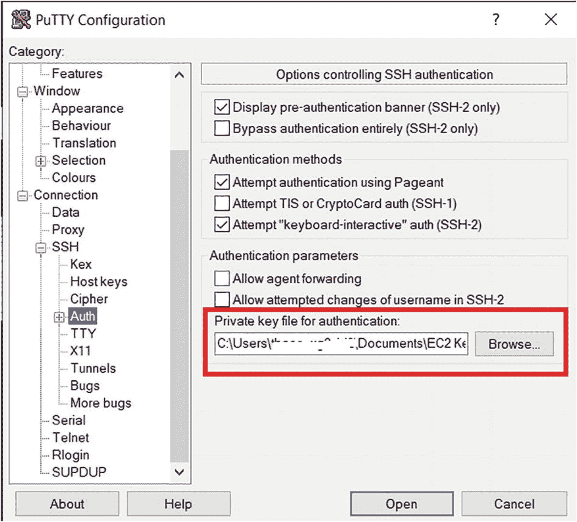

图 4-19

为 Putty 会话提供身份验证

*   有关将 pem 密钥转换为 ppk 格式的更多信息，请参见 [`https://aws.amazon.com/premiumsupport/knowledge-center/ec2-ppk-pem-conversion/`](https://aws.amazon.com/premiumsupport/knowledge-center/ec2-ppk-pem-conversion/) 。

配置好身份验证后，按照格式 **ec2-user@ <主机名>** 指定主机名以及端口和连接类型，如图 4-20 所示。

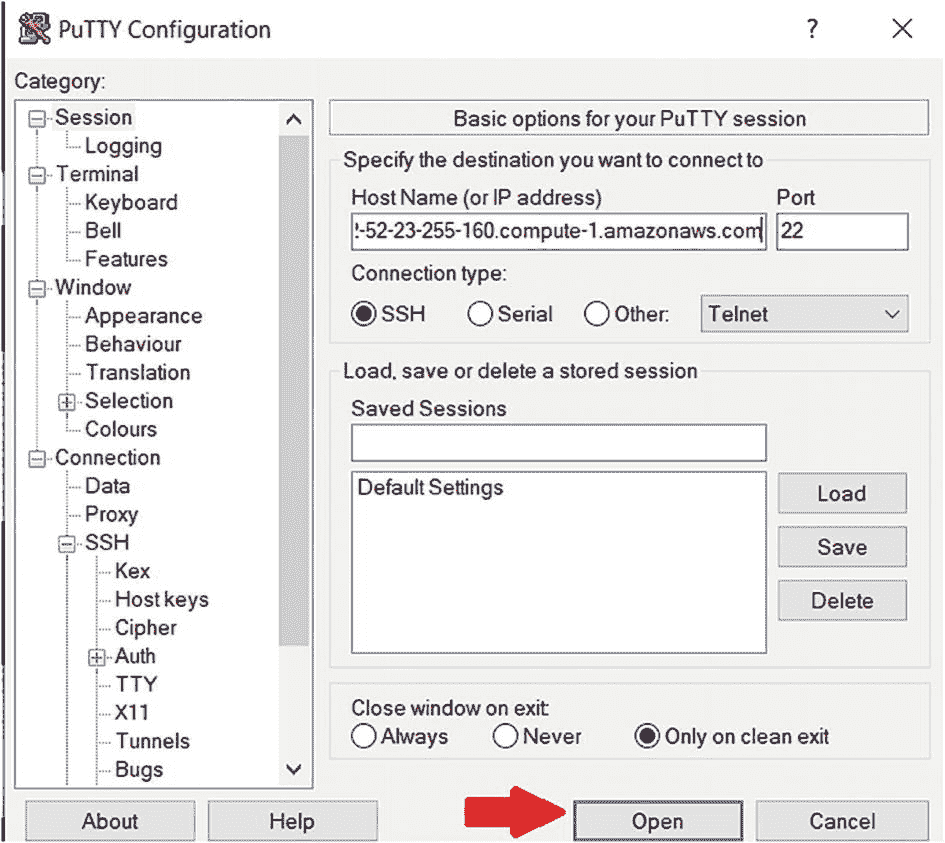

图 4-20

正在启动 Putty SSH 会话

点击**打开**，就登录到 EC2 Mac 服务器的命令终端，如图 4-21 所示。

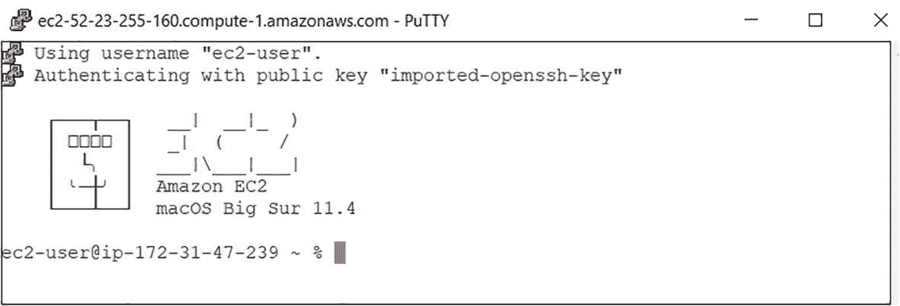

图 4-21

EC2 Mac 服务器的命令终端

### 正在连接 VNC 客户端

要连接到 Mac 服务器的用户界面(UI ),您必须使用 VNC 客户端。但是在使用 VNC 客户端之前，有几个先决条件需要配置。

#### 设置登录密码

默认情况下，ec2 用户禁用密码验证。要使用 VNC 客户端并连接到 UI，必须为 ec2 用户创建密码，如清单 4-11 所示。

```
ec2-user@ip-172-31-47-239 ~ % sudo passwd ec2-user
Changing password for ec2-user.
New password:
Retype new password:

################################### WARNING ###################################
# This tool does not update the login keychain password.                      #
# To update it, run `security set-keychain-password` as the user in question, #
# or as root providing a path to such user's login keychain.                  #
###############################################################################

Listing 4-11Setting up password for default ec2-user account

```

请保管好您在此设置的密码，因为它将用于使用 VNC 客户端登录到您的服务器。

#### 设置苹果远程桌面

要在 Mac 服务器上启用远程桌面连接，必须从 Mac 服务器的终端启动苹果远程桌面代理，如清单 4-12 所示。

```
ec2-user@ip-172-31-47-239 ~ % sudo /System/Library/CoreServices/RemoteManagement/ARDAgent.app/Contents/Resources/kickstart \
-activate -configure -access -on \
-restart -agent -privs -all
Starting...
Warning: macos 10.14 and later only allows control if Screen Sharing is enabled through System Preferences.
Activated Remote Management.
Stopped ARD Agent.
ec2-user: Set user remote control privileges.
ec2-user: Set user remote access.
Done.

Listing 4-12Starting Apple Remote Desktop Agent

```

#### 设置 SSH 端口转发

您可以从工作站上的 VNC 客户端直接连接到端口 5900 (VNC 端口)上的 Mac 服务器的 IP 地址，但是 VNC 协议被认为是不安全的。一种更安全的方法是从您的工作站使用 SSH 端口转发功能通过 SSH 隧道传输 VNC 流量。

清单 4-13 展示了如何将本地主机端口 5900 的所有流量转发到 EC2 Mac 服务器端口 5900。因此，要连接到 Mac 服务器，您需要向本地主机端口 5900 发送流量。

```
ssh -L 5900:localhost:5900 -i /path/my-key-pair.pem ec2-user@your-instance-public-dns-name

Listing 4-13SSH tunneling VNC traffic

```

#### 下载 VNC 客户端并连接

根据您的操作系统，有多种 VNC 客户端选项可供使用。一个这样的选项是 VNC 浏览器，它可以跨多个操作系统使用；可以下载，如图 4-22 所示。

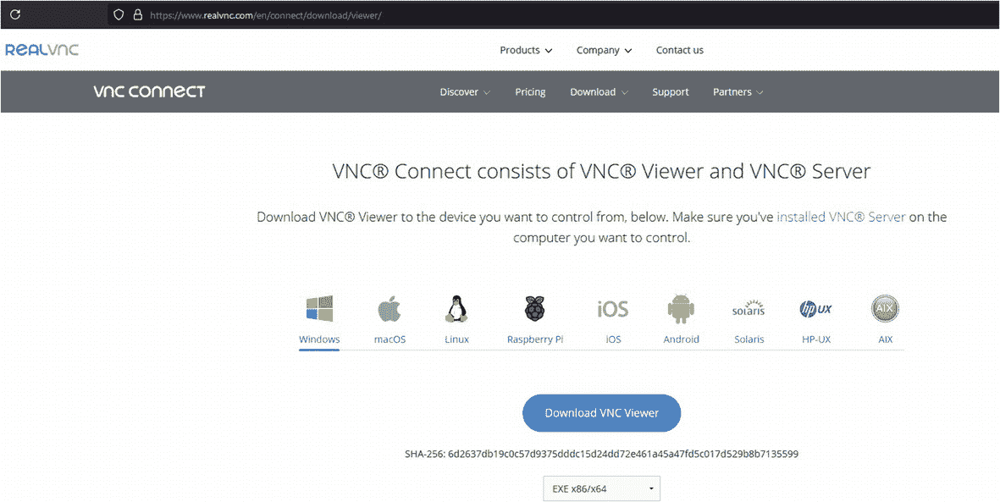

图 4-22

下载 VNC 客户端

它可以安装在 Windows 操作系统上，如图 4-23 所示。

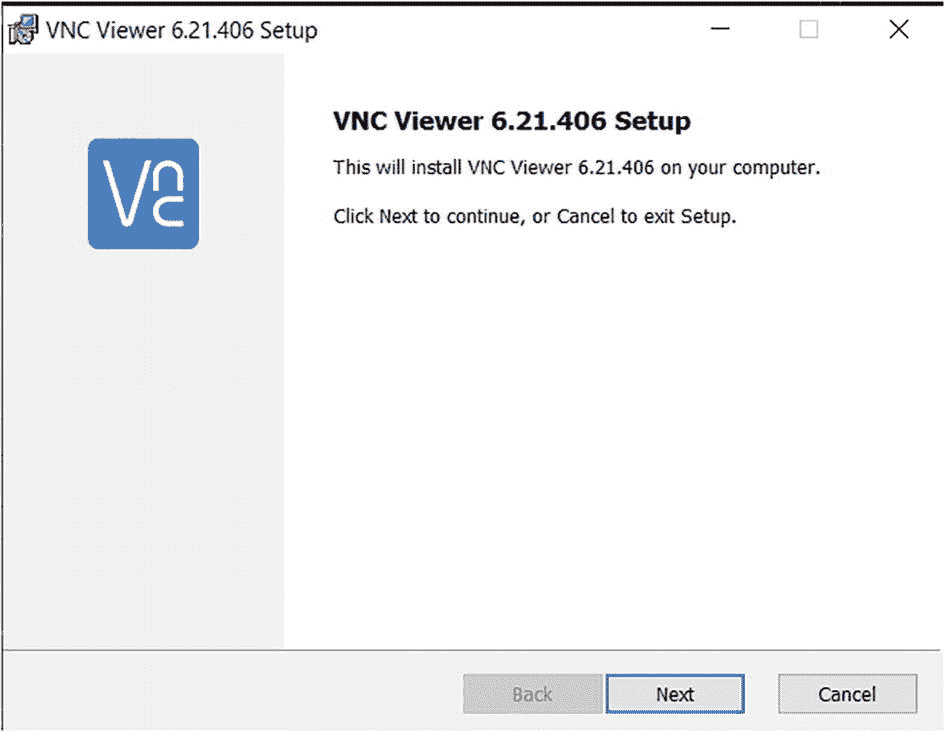

图 4-23

在 Windows 上安装 VNC 客户端

安装完成后，确保按照清单 4-13 中的描述设置了端口 5900 SSH 隧道，然后可以通过连接到本地主机开始连接 Mac 服务器，如图 4-24 所示。

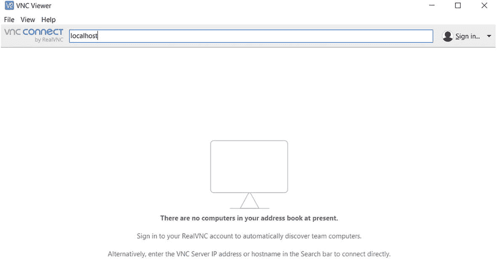

图 4-24

使用 VNC 客户端连接到 EC2 Mac 服务器

连接成功后，您会看到 EC2 Mac 服务器的登录提示，如图 4-25 所示。


图 4-25

EC2 Mac 服务器的登录提示

在清单 4-11 中，我向您展示了如何为默认 ec2 用户设置密码。您在那里设置的密码是 ec2 用户将用来登录的。

认证成功后，您将登录，如图 4-26 所示。

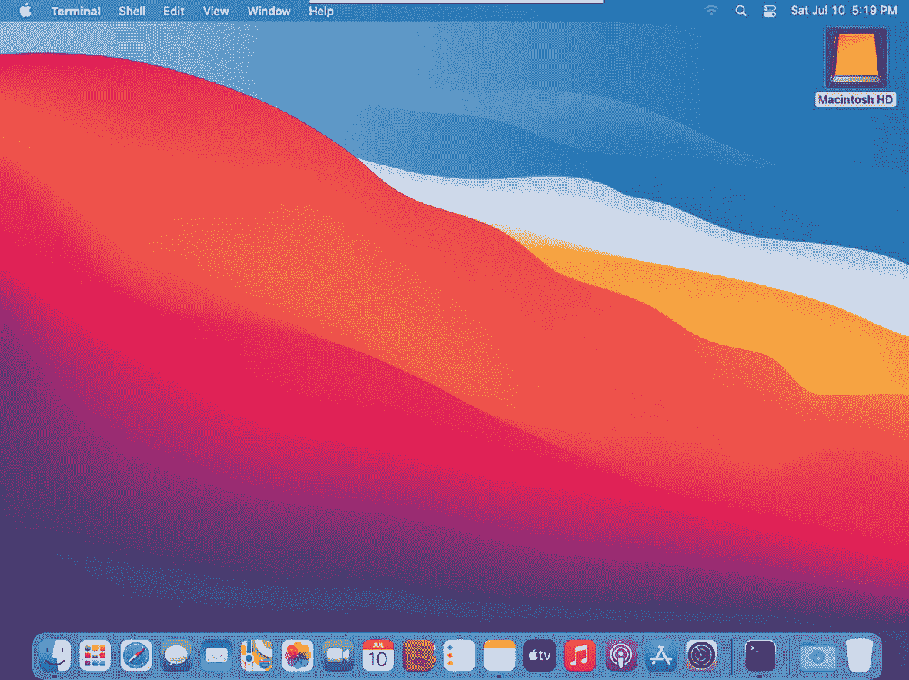

图 4-26

EC2 Mac 服务器主屏幕

## 使用 Amazon CloudWatch 监控 EC2 Mac 服务器

默认情况下，EC2 Mac 实例会向 Amazon CloudWatch 发出指标以进行性能监控。它发送 CPU 利用率、网络使用信息等指标。EC2 Mac 实例的指标可以在 EC2 控制台上查看，方法是在实例上选择，然后转到 Monitoring 选项卡。这方面的一个例子如图 4-27 所示。

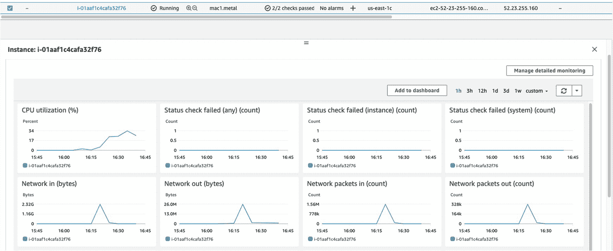

图 4-27

EC2 控制台上的实例度量信息

这些指标也可以在亚马逊 CloudWatch 控制台上查看。CloudWatch 控制台为您提供了更多的图表选项，并允许您在同一个图表上比较多个指标，如图 4-28 所示。

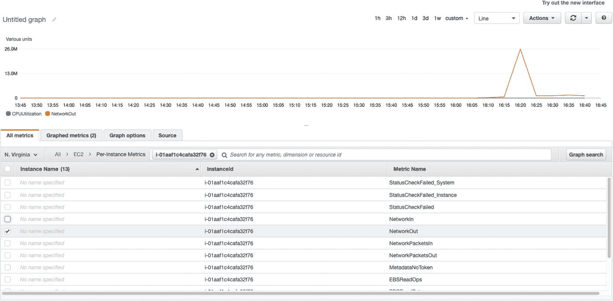

图 4-28

Cloudwatch 上的实例度量图

要禁用向 CloudWatch 发送 CPU 利用率等系统监控指标的代理，可以运行清单 4-14 中所示的设置。

```
$ sudo setup-ec2monitoring [enable | disable]

Listing 4-14Configuring EC2 system monitoring for Mac instance

```

## 清理 Amazon EC2 Mac 服务器

如果不经常使用 Amazon EC2 服务器，要清理它，首先要终止 EC2 实例，然后释放专用主机。

要终止实例，从 **EC2 仪表板**中，选择**实例**并选择您想要终止的 mac1.metal 实例。选择**实例状态**，然后选择**终止实例**。

由于 Amazon EC2 Mac 实例不是按实例收费的，而是由专用主机收费的，终止实例并不能停止收费，必须释放专用主机才能停止收费。

*   在分配主机 24 小时后，才能释放专用主机。

要释放主机，从 **EC2 仪表板**中，选择**专用主机**并选择您想要释放的专用主机。选择**动作**，然后选择**发布主机**。

## 摘要

我们讨论了部署 EC2 macOS 实例的细节，探索了不同的部署方法。我还向您展示了不同的连接选项，同时还介绍了连接 EC2 Mac 服务器的先决条件。

在下一章中，我们将在此基础上进行构建，我将向您展示如何在 EC2 macOS 实例上安装和设置各种 iOS 开发和构建工具。