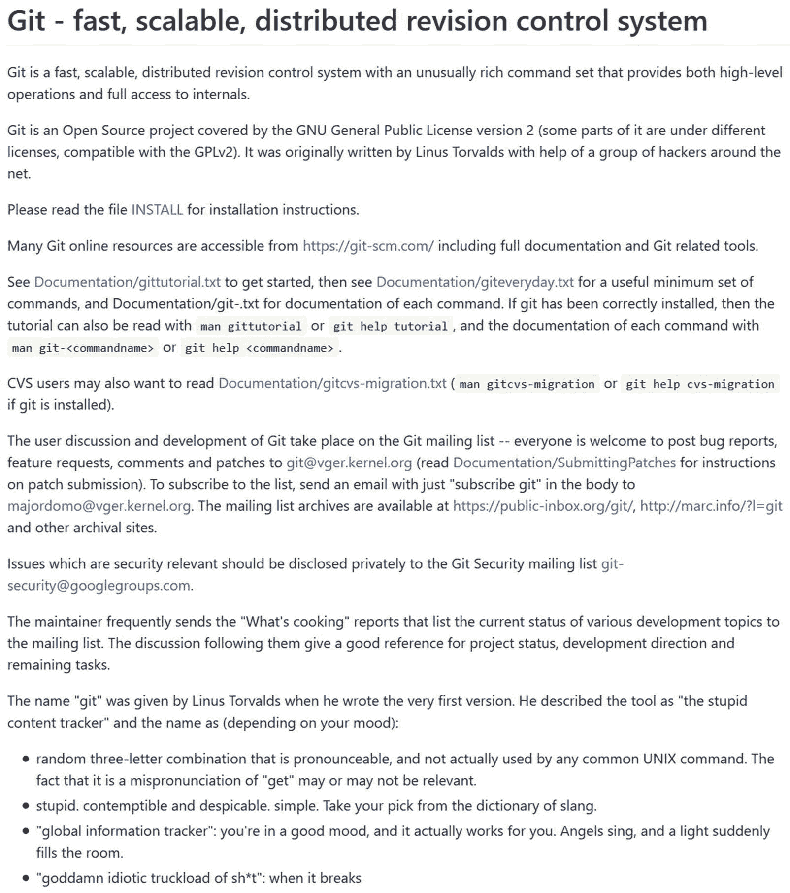
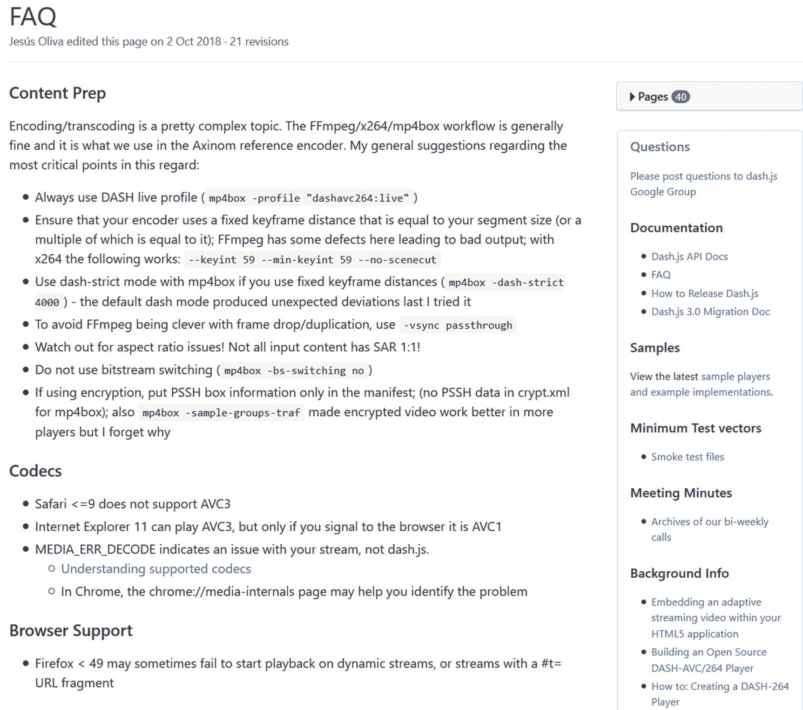
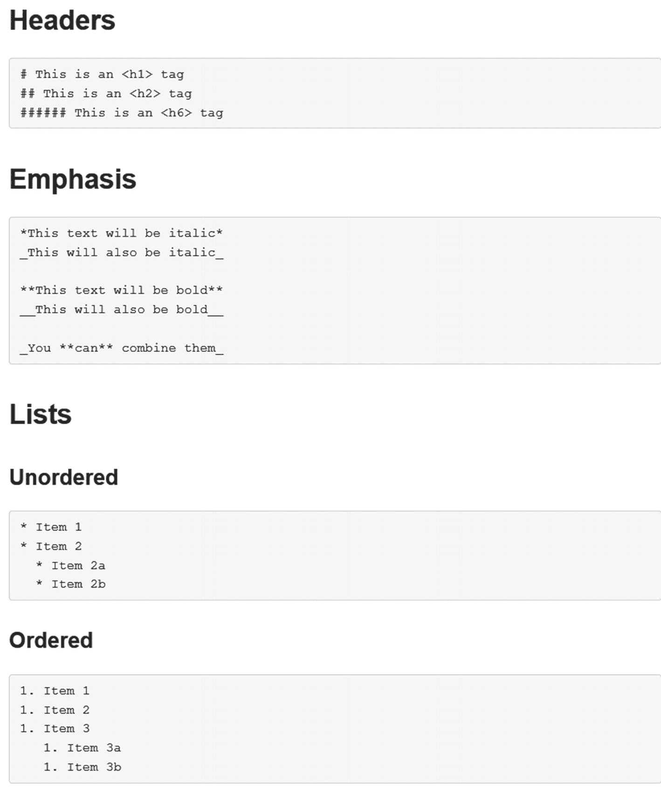
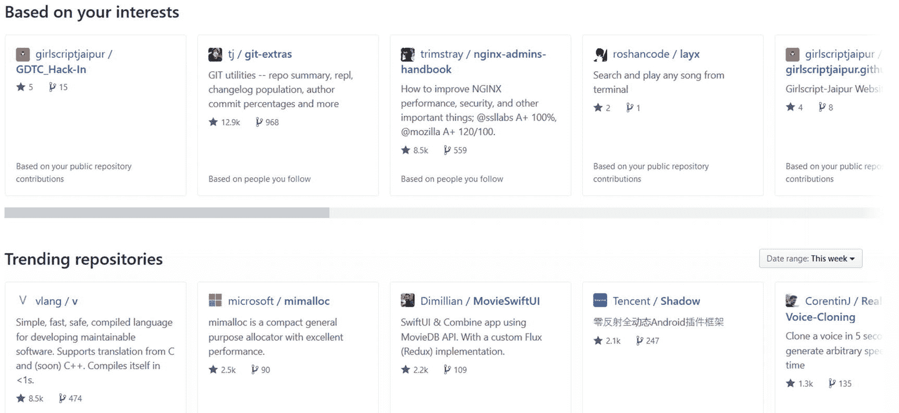

# 八、Github 优先

在上一章中，我们初步发现了远程存储库及其重要性。你也应该对它们的工作原理有一个基本的了解，最重要的是，使用它们有什么好处。现在，我们来谈谈最著名的代码托管平台:GitHub。

首先，我们将介绍 GitHub 的简短历史，以便更好地了解它。然后，我们再来说说使用 GitHub 的是什么样的人，他们用它来做什么。

## GitHub 概述

给 GitHub 下一个定义真的很难，因为它同时做这么多事情。所以，我就用它自己的话说:“GitHub 是一个受你工作方式启发的开发平台。从开源到商业，你可以托管和审查代码，管理项目，与 3600 万开发人员一起构建软件。”

因此，GitHub 不仅是一个代码托管平台，还是一个开发平台。这是什么意思？它意味着你不仅仅使用 GitHub 来存储你的代码；你用它来计划和追踪它的进化。我们将在下一节看到它的所有特性，但是要记住的主要事情是 GitHub 可以帮助你构建和发布你的项目。

如果你使用 GitHub 只需要一个理由，那就是它提供的开发工作流程。项目经理将所有未完成的任务写在白板上，团队成员互相发送电子邮件来跟踪谁在做什么的日子已经一去不复返了。也不需要一长串来回的电子邮件来检查任务的进度。所有这些都由 GitHub 管理。

## GitHub 和开源

GitHub 一直是开源项目的亲密盟友；事实上，GitHub 是世界上最大的开源社区的所在地。由于开发人员需要一个方便的地方来构建和共享他们的项目，GitHub 是一个显而易见的选择。这样，任何人都可以咨询和参与关于项目的所有决策和讨论；这就是开源的美妙之处。

有了 GitHub，对一个开源项目来说，你能做的最好的事情比以往任何时候都要简单:贡献。当你发现一个你喜欢的项目时，你可以像在社交媒体上一样关注它，并看到它的进展。如果你想开发一个新的特性或者修复一个 bug，你只需要做一个项目的克隆，然后在上面工作。这个过程被称为“分叉”，它是开源项目的支柱。当您完成了对项目副本的所有更改后，您可以向项目的维护者提交一个 Pull 请求(PR)。这意味着您正在请求您所做的变更被提取并合并到项目中。然后，其他参与者将检查您的更改，并可能要求一些其他更改。所有这些都在 GitHub 上完成，而不是通过电子邮件或即时消息进行交流。在所有各方就变更达成一致后，拉取请求被接受，您的变更现在是项目的一部分了！

当然，开源项目不仅仅是代码；他们需要文档、翻译、社区经理、维护人员等等。您可以通过编写文档和提供翻译，甚至审查其他贡献者所做的更改来为项目做出贡献。项目还需要测试人员和能够对最终产品提供见解的人。它们是有数百万贡献者的项目，所以需要社区管理者。他们对社区的福祉负责，并被期望执行社区的内部行为准则。一些贡献者的任务是欢迎和辅导初学者，这对任何项目来说都是困难但非常必要的。

GitHub 被数以百万计的开源项目所选择，因为从想法到发布的工作流程是如此的简单和容易。派生一个项目来为它做贡献的概念是任何开源项目的主要驱动力。如果你喜欢一个项目，但不喜欢它的发展方向；你可以叉起它，开始你自己风格的项目。然后，您将成为新项目的维护者，如果其他人想要做贡献，他们可以向您提交 Pull 请求。因此，任何人都是幸福的！

正如以前建立的那样，开源项目需要文档和初学者教程。对于小型项目，一个文本文件(习惯上称为 README)就足够了。自述文件应该介绍项目，并传达它解决了哪些问题。它还应该告诉用户如何安装和使用它，以及如何为它做出贡献。您可以查看图 8-1 中的自述文件示例(您也可以查看 [`https://github.com/git/git`](https://github.com/git/git) )。

图 8-1

Git 的自述文件

如图 8-1 所示，自述文件可以有基本的文本格式和链接。它们还可以包括图像和代码示例。

大项目需要的不仅仅是自述文件，因为它们需要被恰当地呈现和记录。GitHub 项目有一个名为“wiki”的部分是专门为这些需求定制的。就像所有的维基一样(它是从维基百科模仿来的)，GitHub 维基帮助新来者理解这个项目是如何工作的。许多 wikis 也有一个名为“常见问题”的部分，其中回答了最常见的用户查询。通常，wikis 用于文档和教程太长而不适合自述文件的项目。你可以在图 8-2 中看到一个维基页面的例子，你也可以在 [`https://github.com/Dash-Industry-Forum/dash.js/wiki`](https://github.com/Dash-Industry-Forum/dash.js/wiki) 找到；注意所有链接都出现在侧边栏。

图 8-2

提供文档的 wiki

因为文档在开源项目中非常重要，所以编写文档并保持更新是许多贡献者的工作。请记住，wikis 也是 Git 存储库，因此对它所做的更改也会像任何存储库一样被跟踪。这样做是为了将开发工作流与文档工作流分开。

最重要的是，自述文件和维基是用一种叫做 Markdown 的标记语言编写的。这是一种非常简单的语言，可以呈现简单的格式和链接。你可以在图 8-3 中看到一个例子。但是你也可以选择用 HTML 写所有的东西，而不是转换成 Markdown。你还会在这本书的附录中找到一份减价备忘单。

图 8-3

降价示例

开源项目的繁荣还需要一件小事:市场营销。是的，README 文件和 wikis 对开发人员来说是很好的资源，但是最终用户可能不会觉得它们太有帮助。这就是为什么许多项目都有一个专门吸引用户使用他们产品的网站。网站也是一个为自己扬名并展示自己的好方法。如果一个项目没有网站或者没有被搜索引擎引用，它被最终用户发现的机会就很小。尽管如此，维护和托管一个网站并不是一件容易的事情；从金钱的角度来看，它甚至可能是昂贵的。许多开源项目没有一个好的营销活动所必需的资源；他们主要依靠搜索引擎的点击率和口碑。这就是 GitHub Pages 存在的原因。GitHub Pages 只是一个直接托管在您的存储库上的网站；你可以用它来展示你的产品，提供教程，或者任何你想要的东西，真的。它摆脱了创建网站和托管网站的麻烦。但是这不会干扰代码吗？一点也不，像维基一样，GitHub 页面存在于存储库的其他部分；所以他们可以有不同的贡献者。你可以查看图 8-4 中一个托管在 [`https://scd-aix-marseille-universite.github.io/latexamu/`](https://scd-aix-marseille-universite.github.io/latexamu/) 上的 GitHub 页面的例子。如你所见，这只是一个简单的网站，但直接托管在 GitHub 上。它不仅限于简单的演示网站；你也可以建立博客和类似的网站。您将在附录中看到如何构建 GitHub 页面。☺

图 8-4

GitHub 页面示例

如你所见，GitHub 为开源社区提供了很多东西。所有这些都是免费的！但是现在，让我们来看看 GitHub 能为你个人提供什么。

## 个人使用

是的，开源是伟大的，但什么是不是你果酱？或者当你有一个你想保密的项目时？GitHub 也覆盖了你！

你不必公开你所有的 GitHub 库；还有一个选项是将它们设为私有。这样，只有你和少数合作者(你选择的)可以访问它。您可以在 GitHub 上创建无限数量的公共和私有存储库；唯一的限制是你的创造力和时间。然而，私有存储库的贡献者数量是有限制的:3。如果你想与更多的贡献者合作，你可以注册 GitHub Pro，这是一个付费计划。但是对于几乎所有人来说，免费计划已经足够了。

拥有一个个人 GitHub 账户来展示你的作品也是推销自己的好方法。这样，人们可以检查你贡献的开源或个人项目，甚至检查你的代码。许多开发人员也使用 GitHub 页面来呈现他们的简历或展示他们的作品集。你可以查看图 8-5 中的例子。

图 8-5

一个随机的人的 GitHub 页面

由于 GitHub 上有 3600 万开发者，你可能想和他们中的一些人联系。一种联系方式是关注一个特定的项目。当项目进行的时候，您将会收到更新，并且可以检查变更。请注意，您将自动跟踪您所贡献的存储库。另一种表达你对一个项目的欣赏的方式也是给它打“星”。这类似于喜欢社交媒体上的内容。因此，存储库的星级越多，用户就越满意。GitHub 还提供了一个新闻提要，即来自特定项目的新闻和通知。那些项目被选中是因为你为它们做出了贡献或者“主演”了它们。它们也是通过分析你最常用的语言或工具而量身定制的。您可以查看图 8-6 中的示例。这是对你周围发生的事情有一个清晰的认识的好方法。

图 8-6

GitHub 探索

在我们进入下一部分之前，有一个很酷的东西你可以用 GitHub 查看:你的贡献活动。你在 GitHub 上的每一次提交都会被注册为一个贡献，如果你启用了这个选项，甚至会被注册到你的个人或私有存储库中。这些活动以类似于图 8-7 所示的漂亮插图呈现。它们展示了你一年来的贡献，并向你个人资料的访问者展示了你的成就。

图 8-7

2018 年我的投稿历史

## 面向企业的 GitHub

GitHub 不只是针对个人项目或开源社区；企业在那里也有一席之地。现在许多企业都投资开源产品，还有比 GitHub 更好的地方可以找到高质量的开发者吗？

GitHub 中有一个企业计划，它包含了付费计划的所有好处，但还有许多附加功能。这些功能包括从主机选择、安全性到在线支持。所有这些功能可能对企业非常有吸引力，但对我们来说，一个简单的免费计划就足够了。

## 摘要

本章介绍了 GitHub 的用户和一些小功能。你现在应该对你要用它做什么有一些想法了。在下一章，GitHub 的主要特性将会和一些关于如何使用它和队友一起工作的技巧一起呈现。我们将讨论项目管理、代码审查等等。最后，我们将从 GitHub 的第一个存储库开始。你将在下一章回到行动中，所以一定要复习前面的练习以保持敏锐。开始吧！