# 三、交互式对话机器人

每个人都在谈论机器人，每个企业都想知道如何使用它们。我们愿意相信我们生活在一个充满智能自动化的世界。组织总是在寻找新的方式和更好的方法，通过轻松地与购买者联系并提供随着不断变化的通信倾向而调整和发展的客户支持来支持业务。对话机器人允许用户通过文本、交互卡和任务模块与您的 web 服务进行交互。

在本章中，您将了解对话机器人的各种功能，以及如何创建机器人并将其添加到 MSTeam 中。

## 对话机器人概述

机器人帮助用户在团队对话中完成任务。机器人可以做的事情包括启动工作流并提供状态，给予和接受团队成员的称赞，创建轻量级调查以衡量员工满意度，以及回答关于销售和客户使用数据的自然语言问题。

对话机器人允许用户在多种形式中进行交互，如文本、自适应卡片、表单等。，从 MSTeam 客户端。

### 微软机器人框架

Microsoft Bot 框架处理所有复杂的状态管理、消息路由等。您需要使用 bot 框架构建 web API，并将其托管在 Azure 中，并使用 Azure 认知服务(如 LUIS(语言理解智能服务))为您的 Bot 添加智能，这有助于将您的消息解析为意图和实体。

如果你已经有了一个基于 bot 框架的 Bot，你可以很容易地将它应用到 MSTeam 中。可用的包扩展了基本的 Bot Builder SDK 类和方法，如下所示:

*   使用专门的卡类型，如 Office 365 连接器卡。

*   消费和设置团队特定的活动渠道数据。

*   处理邮件扩展请求。

### 团队活动处理者

像其他机器人一样，当一个机器人为 MSTeam 设计时，它接收一个活动，并将其传递给活动处理程序。在幕后，有一个称为 turn handler 的基本处理程序，所有活动都通过它进行路由。turn 处理程序调用所需的活动处理程序来处理收到的任何类型的活动。为 MSTeam 设计的 bot 的不同之处在于，它是从团队活动处理程序类派生的，而团队活动处理程序类又是从 Bot 框架的活动处理程序类派生的。

## MSTeam 频道和群聊中的机器人

机器人的基本架构始于微软认知服务，它有助于创建基于人工智能的应用，并提供各种 API，如视觉、语音和语言以及视频。微软认知服务提供 LUIS，帮助将消息转换成有意义的数据。见图 3-1 。

微软机器人框架是一个为 MSTeam 渠道构建和部署机器人的框架。Bot 框架处理所有复杂的状态管理、消息路由等。你只需要使用 bot 框架构建 web API，对于 bot，你需要使用 bot 框架构建并在 Azure 中托管它，并使用 Azure 认知服务(LUIS，语言理解智能服务)为你的 Bot 添加智能，这有助于将你的消息解析为意图和实体。


图 3-1

团队 BOT 架构

MSTeam 客户端中有三种类型的对话机器人:

*   个人聊天中的机器人-个人对话或个人聊天

*   群组聊天中的机器人-群组对话或群组聊天

*   渠道中的机器人-团队渠道

根据参与的对话类型，机器人的行为略有不同:

*   频道和群组聊天对话中的机器人需要用户**@提及**机器人以在频道中调用它。

*   一对一对话中的机器人不需要**@提及**。用户发送的所有消息都将被路由到您的机器人。

## 来自机器人的主动消息

主动消息由机器人发送以开始对话。欢迎消息和轮询响应或外部事件通知是使用主动消息的常见场景。

主动信息通常分为两类:

*   欢迎信息

*   通知

### 欢迎信息

当你使用主动消息向用户发送欢迎消息时，你必须记住，对于大多数收到消息的人来说，他们不知道为什么会收到消息。欢迎信息也是他们第一次与你的应用互动；这是你创造良好第一印象的机会。

### 通知消息

当您使用主动消息发送通知时，您需要确保您的用户有一个清晰的路径来根据您的通知执行常见操作，并清楚地了解通知发生的原因。

## 练习 1 -为 MSTeam 创建对话机器人

在开始练习之前，请验证您的环境。在本练习中，我将使用安装在我的环境中的以下工具:

*   Node.js - v10.16.0

*   NPM - 6.9.0

*   吞咽
    *   CLI 版本:2.3.0

    *   本地版本:4.0.2

*   MS 团队的约曼生成器- 2.14.0

*   Visual Studio 代码

和

*   Microsoft Azure 订阅

*   Office 365 订阅

在本练习中，您将学习如何创建新的机器人并将其添加到 Microsoft Teams 应用中，以及如何从 Microsoft Teams 客户端与其进行交互。

您需要:

*   来托管可公开访问的 web 服务。

*   向 bot 框架注册您的 Bot。

*   使用应用清单创建团队应用包。

要为您的 Microsoft Team client 创建新的 Microsoft Teams bot 应用，请遵循以下步骤:

1.  向微软 Azure 的 bot 框架注册 Bot。

2.  Bot 通道注册。

3.  为机器人启用 Microsoft Teams 频道。

4.  检索 bot 应用 ID 和密码。

5.  使用约曼生成器创建 MSTeam 应用。

6.  测试对话机器人。

### 向微软 Azure 的机器人框架注册机器人

打开浏览器，导航到 Azure 门户( [`https://portal.azure.com/`](https://portal.azure.com/) )。使用您在 Azure 订阅中使用的**username@tenantname.onmicrosoft.com**登录。

在左侧导航栏中选择**创建资源**(图 3-2 )。

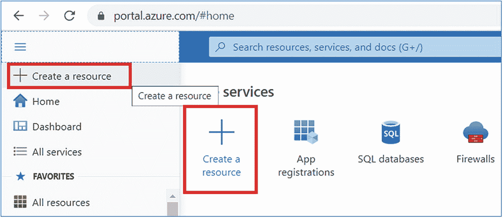

图 3-2

创建资源

在搜索市场输入框中输入资源组，并选择资源组(图 3-3 )。

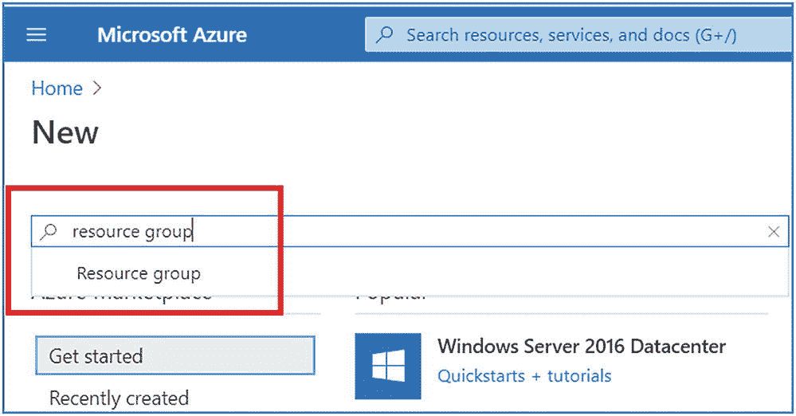

图 3-3

资源组

在**资源组**页面，选择**创建**按钮，创建一个新的资源组(图 3-4 )。

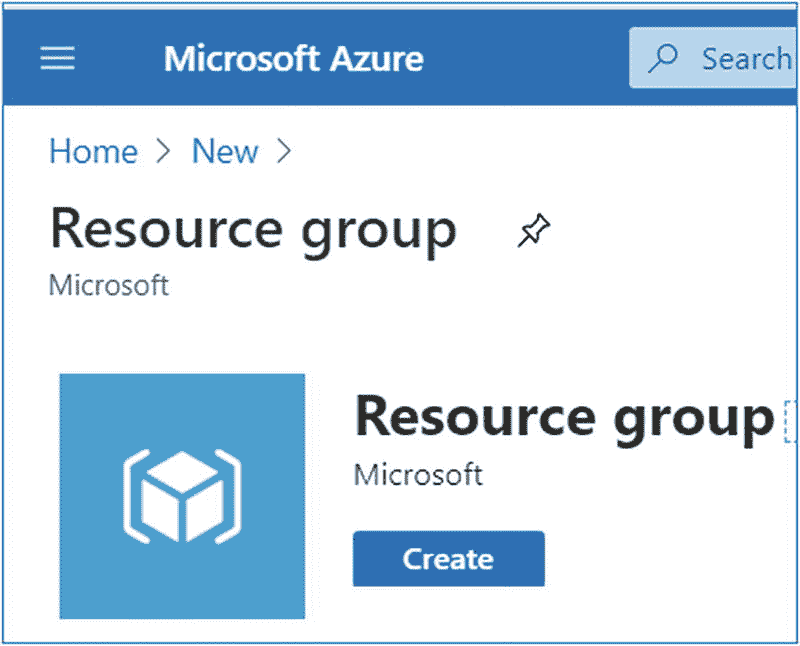

图 3-4

创建资源组

选择一个有效的订阅，输入资源组的名称，**例如:Teams** ，并选择想要的区域。这些选择都不会影响机器人注册，由你决定(图 3-5 )。

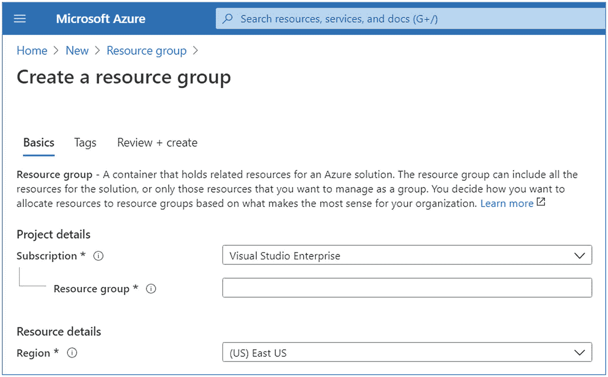

图 3-5

创建资源组表单

完成向导以创建资源组。


图 3-6

资源组创建通知

一旦 Azure 完成了资源组创建过程，导航到资源组(图 3-6 )。

从资源组中选择**添加**或**创建资源**按钮(图 3-7 )。

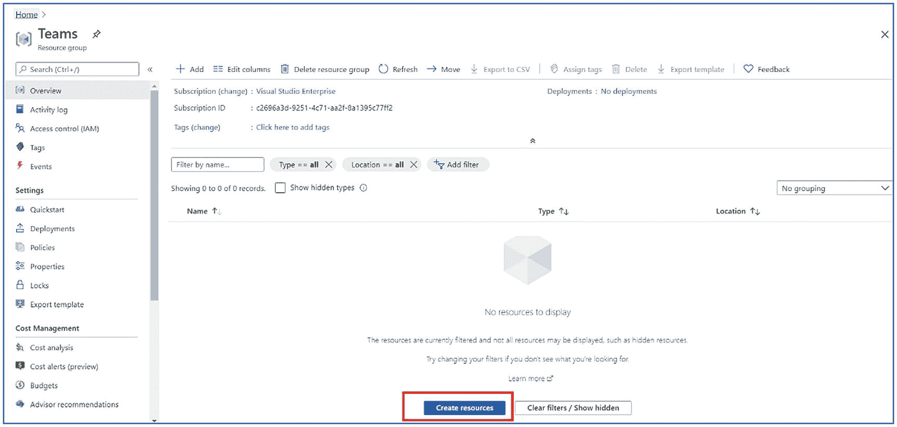

图 3-7

创建资源

### Bot 渠道注册

在**搜索市场**输入框中输入 **bot** ，在返回的资源列表中选择 **Bot 频道注册**。然后在下一页选择 **Create** 开始注册新的 bot 资源的过程(图 3-8 )。

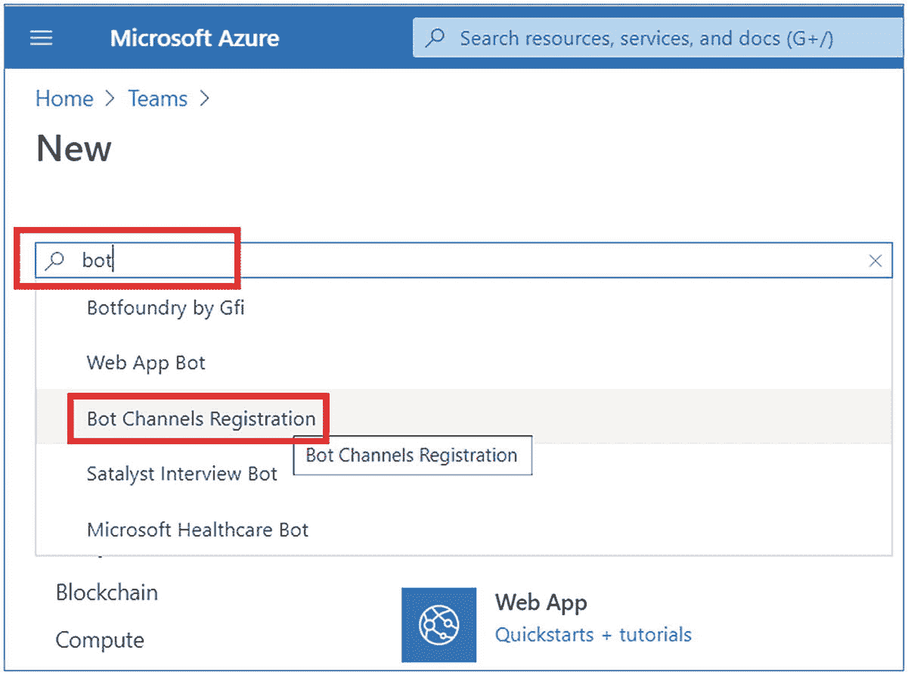

图 3-8

搜索机器人频道注册

在 **Bot 通道注册**页面，点击发起创建 Bot 通道注册。见图 3-9 。

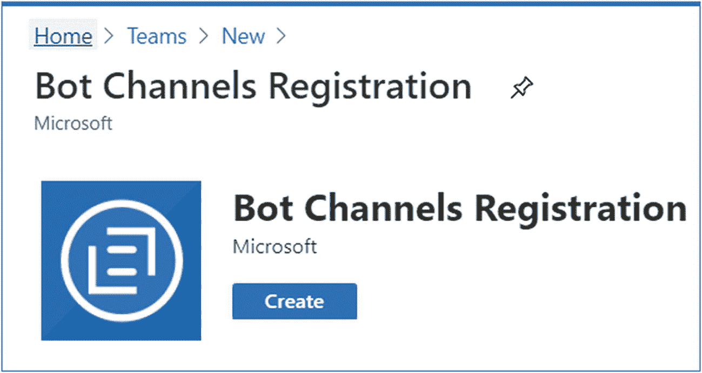

图 3-9

Bot 渠道注册

在 **Bot 通道注册刀片**中，输入以下值，然后选择**创建**:

*   **机器人句柄**:为机器人输入一个全局唯一的名称
    *   **例:**mstermantyexercise 2

*   **订阅**:选择之前创建资源组时选择的订阅

*   **资源组**:选择您之前创建的资源组- **例如:**团队

*   **地点**:选择你喜欢的蔚蓝地区

*   **定价等级**:选择首选的定价等级；F0 层是免费的

*   **消息传递端点** : `https://REPLACE_THIS.ngrok.io/api/messages`

bot 注册需要知道实现 bot 的 web 服务的端点。这将在您每次启动之前练习中使用的 ngrok 实用程序时发生变化(图 3-10 )。

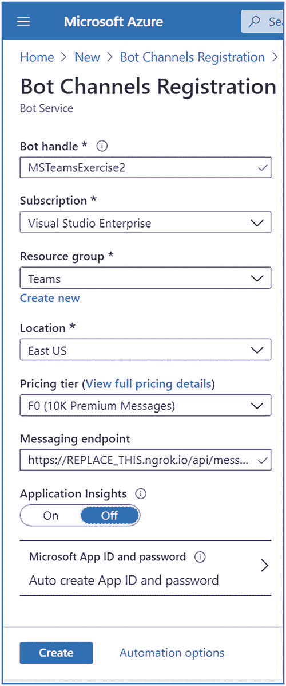

图 3-10

创建 Bot 渠道注册

*   应用洞察:关闭

*   Microsoft 应用 ID 和密码:自动创建应用 ID 和密码

Azure 将开始提供新资源。这需要一两分钟的时间。完成后，导航到资源组中的 bot 资源，如图 3-11 所示。

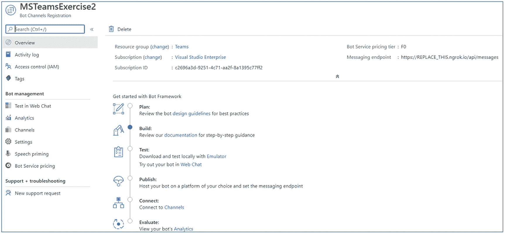

图 3-11

Bot 渠道注册

### 为机器人启用 Microsoft Teams 频道

为了让 bot 与 Microsoft 团队进行交互，您必须启用团队通道。


图 3-12

选择团队频道

*   从 Azure 的 bot 资源中，选择左侧导航中的**通道**。

*   在**连接通道**面板上，选择**MSTeam 通道**，然后选择**保存**确认动作(图 3-12 )。

*   同意服务条款

一旦此过程完成，您应该会在您启用的频道中看到列出的网络聊天和 MSTeam(图 3-13 )。


图 3-13

连接到频道

### 检索 Bot 应用 Id 和密码

当 Azure 创建这个机器人时，它还为这个机器人注册了一个新的 Azure 广告应用。您需要生成这个新的 bot 应用作为一个秘密，并复制应用的凭据。

从左侧导航栏中选择**设置**。向下滚动到 Microsoft App ID 部分。

复制机器人的 ID，因为你以后会需要它。见图 3-14 。

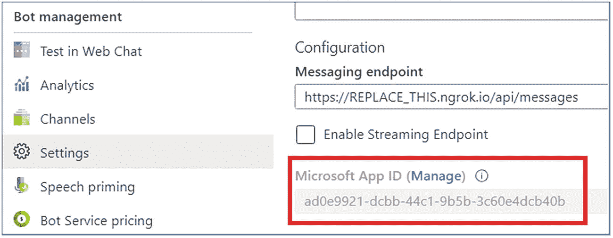

图 3-14

应用标识

### 为应用创建客户端密码

点击**管理**链接，导航至 **Azure 广告应用。**

为了让守护程序应用在没有用户参与的情况下运行，它将使用应用 ID 和证书或密码登录 Azure AD。在本练习中，您将使用一个秘密。

从左侧导航面板中选择**证书&机密**。

选择客户端密码部分下的**新客户端密码**按钮

出现提示时，对密码进行描述，并选择提供的到期持续时间选项之一:例如:从不，然后选择**添加**。

**注意:**复制新的客户端秘密值。在您执行另一个操作或离开此刀片后，您将无法取回它。见图 3-15 。


图 3-15

应用客户端机密

“证书和机密”页面将显示新的机密。复制该值很重要，因为它只显示一次；如果您离开页面并返回，它将仅显示为一个屏蔽值。

复制并存储秘密值的值，因为您以后会需要它。

### 使用约曼生成器创建 MSTeam 应用

在本节中，您将使用 Yeoman generator 创建一个新的团队应用(yo teams):

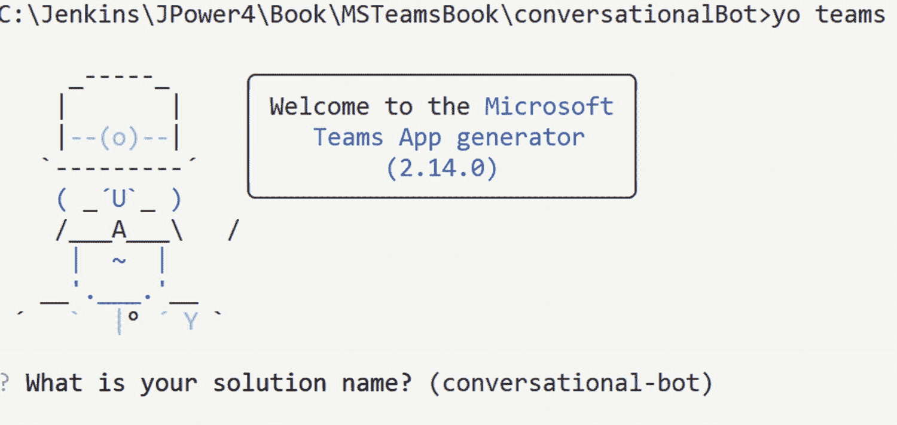

图 3-16

哟团队

*   创建新的 web 部件项目

*   在您喜欢的位置创建一个新的项目目录

*   打开命令提示符

*   创建一个新文件夹" **conversationalBot**

*   导航到新创建的目录

*   通过运行以下命令为 MSTeam 运行 Yeoman generator:**yo Teams**(图 3-16 )。

约曼将发射并问你一系列问题。用以下数值回答问题(如图 3-17 ):


图 3-17

回答约曼问卷

*   您的解决方案名称是什么？对话机器人

*   您想将文件放在哪里？使用当前文件夹

*   您的 Microsoft Teams 应用项目的标题？对话机器人

*   你(公司)的名字？(最多 32 个字符)JPOWER4

*   您希望使用哪个清单版本？v1.6

*   如果您有 Microsoft Partner ID，请输入。(留空以跳过)

*   您希望在项目中添加哪些功能？一个机器人

*   您将在其中托管此解决方案的 URL？[`https://conversationalbot.azurewebsites.net`](https://conversationalbot.azurewebsites.net)

*   当你的应用/标签加载时，你想显示加载指示器吗？不

*   你想包括一个测试框架和初始测试吗？不

*   您希望将 Azure Applications Insights 用于遥测吗？不

*   你想用什么类型的机器人？一个新的框架

*   你的机器人叫什么名字？对话机器人

*   这个机器人的微软应用 ID 是什么？可以在 Bot 框架门户( [`https://dev.botframework.com`](https://dev.botframework.com) )中找到。ad0e9921-dcbb-44c1-

*   9b 5 B- 3c 60 和 4dcb40b

*   你想给你的机器人添加一个静态标签吗？不

*   你想支持文件上传到机器人？不

Note

这些问题的大多数答案在创建项目后都可以更改。例如，在创建或测试项目时，项目所在的 URL 并不重要。

使用**代码打开 Visual Studio 代码。在命令提示符下**(图 3-18 )。

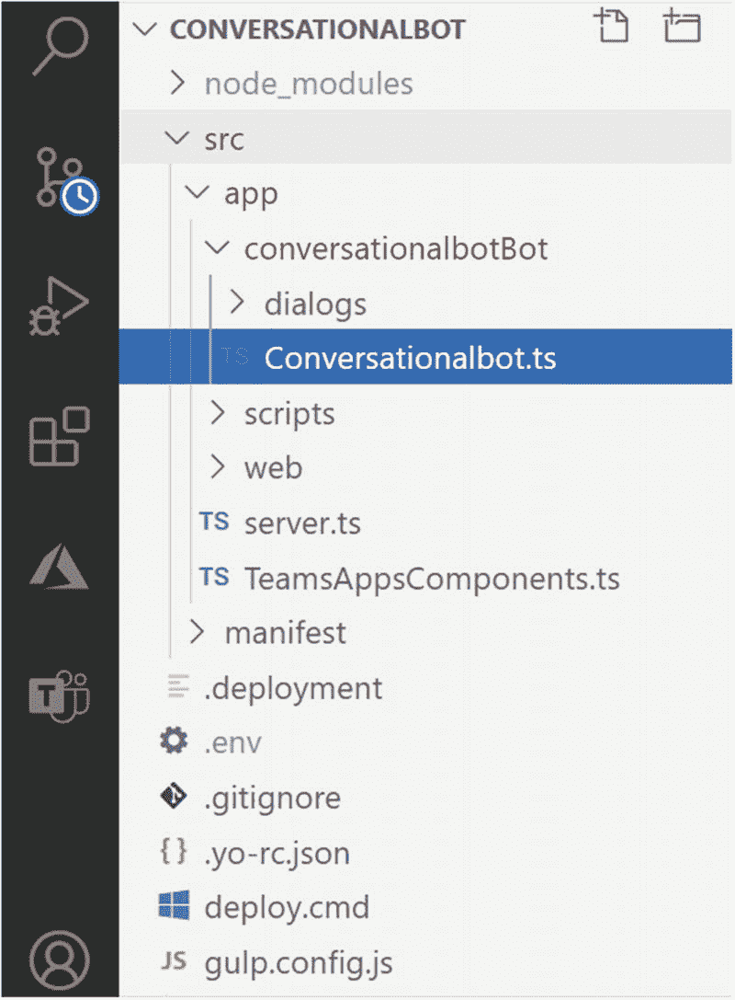

图 3-18

Visual studio 代码 OOB

*   打开。env 文件➤，并添加从新的客户端密码值复制的 MICROSOFT_APP_PASSWORD

```
MICROSOFT_APP_PASSWORD= I-5hg5mNFA.Kxoqd.1vuoXTX~zRDC-1i2_

```

该机器人将在一对一聊天对话中响应消息 MentionMe，在频道对话中响应消息@MentionMe。


图 3-19

个人对话回应

#### 更新一对一聊天对话的机器人代码

去吧。/src/app/conversational bot/conversational bot . ts 文件，并添加以下代码。

*   首先，添加下面给出的标题:

*   然后包含对现有 **botbuilder** 包的消息工厂对象引用:

```
import * as Util from "util";
const TextEncoder = Util.TextEncoder;

```

```
TeamsActivityHandler,MessageFactory } from "botbuilder";

```

它看起来像下面这样:

*   转到 **Conversationalbot** 类，在公共构造函数(conversationState:conversationState)中找到处理程序 **this.onMessage()** 。

*   在 **this.onMessage()** 处理程序中，继续执行以下代码来处理一对一对话和通道对话。

*   找到下面给出的代码:

```
import { StatePropertyAccessor, CardFactory, TurnContext, MemoryStorage,
    ConversationState, ActivityTypes, TeamsActivityHandler, MessageFactory, ChannelInfo, TeamsChannelData, ConversationParameters, teamsGetChannelId,Activity, BotFrameworkAdapter, ConversationReference, ConversationResourceResponse
} from "botbuilder";

```

*   替换下面给出的代码:

    ```
         const text: string = context.activity.text.trim().toLowerCase();
            if (text === "mentionme") {
               await this.handleMessageMentionMeOneOnOne(context);
              return;
            } else if (text.endsWith("mentionme")) {
               await this.handleMessageMentionMeChannelConversation(context);
                return;
            } else if (text.startsWith("hello")) {

    ```

*   上面的代码处理来自对话机器人的个人聊天和频道对话请求。

*   然后在 Conversationalbot 类中添加下面给出的代码。

```
let text = TurnContext.removeRecipientMention(context.activity);
                    text = text.toLowerCase();
if (text.startsWith("hello")) {

```

*   ***handlemessagementionmeone***方法用于处理聊天对话。

*   ***handleMessageMentionMeChannelConversation***方法用于处理通道会话。

```
private async handleMessageMentionMeOneOnOne(context: TurnContext): Promise<void> {
    const mention = {
      mentioned: context.activity.from,
      text: `<at>${new TextEncoder().encode(context.activity.from.name)}</at>`,
      type: "mention"
    };

const replyActivity = MessageFactory.text(`Hi ${mention.text} from a 1:1 chat.`);
    replyActivity.entities = [mention];
    await context.sendActivity(replyActivity);
  }

   private async handleMessageMentionMeChannelConversation(context: TurnContext): Promise<void> {
    const mention = {
      mentioned: context.activity.from,
      text: `<at>${new TextEncoder().encode(context.activity.from.name)}</at>`,
      type: "mention"
    };

    const replyActivity = MessageFactory.text(`Hi ${mention.text}!`);
    replyActivity.entities = [mention];
    const followupActivity = MessageFactory.text(`*We are in a channel conversation group chat in the !*`);
    await context.sendActivities([replyActivity, followupActivity]);
  }

```

#### 修改清单文件以处理命令

流程是这样的:

1.  去吧。/src/manifest/manifest.json 文件。

2.  在。/src/manifest/manifest.json 文件，验证图标的属性值，并在必要时更新文件名以匹配项目中的内容。

3.  找到属性机器人。通过将以下 JSON 添加到数组中，将新的 bot 添加到注册到此 Microsoft Teams 应用的 bot 集合中。这段代码会在安装时将我们的机器人添加到用户的**个人和团队**范围。它包含一条帮助消息，显示它支持的命令 MentionMe。

4.  找到机器人➤命令列表下的“命令”部分，并将其替换为

1.  ***文件➤保存所有*** 保存的修改。

```
"commands": 
            {
              "title": "Help",
              "description": "Shows help information"
            },
            {
              "title": "MentionMe",
              "description": "Sends message with @mention of the sender"
            }

```

此时，您的机器人可以开始测试了！

### 测试对话机器人

打开命令提示符，导航到项目文件夹。并执行以下命令:

```
gulp ngrok-serve

```

这个 gulp 任务将运行命令行控制台中显示的许多其他任务。ngrok-serve 任务构建您的项目并启动一个本地 web 服务器(`http://localhost:3007`)。然后它用一个随机的子域启动 ngrok，这个子域会创建一个到本地 web 服务器的安全 URL。

在开发过程中，可以使用 ngrok 工具进行测试，该工具可以创建一个安全的可旋转的 URL，指向您的本地 HTTP 服务器。Ngrok 作为一个依赖项包含在项目中，因此不需要设置或配置任何东西(图 [3-20 )。


图 3-20

ngrok-服务执行

Ngrok 已经创建了临时 URL 832b174576e7.ngrok.io，它将映射到我们本地运行的 web 服务器。

然后去 Azure 门户，打开 Bot 通道注册 App。使用临时 URL 832b174576e7.ngrok.io 更新消息传递端点(图 3-21 )。


图 3-21

更新消息传递端点

Note

Ngrok 的免费版本会在您每次重新启动 web 服务器时创建一个新的 URL。测试应用时，确保每次重启 web 服务器时都更新 URL 的消息端点。

### 在 MSTeam 中安装对话机器人

现在让我们在 MSTeam 中安装应用。在浏览器中，导航到 [`https://teams.microsoft.com`](https://teams.microsoft.com) ，使用工作和学校帐户的凭据登录。

Microsoft Teams 可用作 web 客户端、桌面客户端和移动客户端。

使用应用栏导航菜单，选择更多添加的应用按钮。然后选择更多应用，接着上传自定义应用，然后为我或我的团队上传(图 3-22 )。


图 3-22

向 MS 团队添加应用

在出现的文件对话框中，选择项目中的 Microsoft Teams 包。这个应用包是一个 ZIP 文件，可以在项目**中找到。/package** 文件夹。见图 3-23 。


图 3-23

上传应用

安装后，您将能够在应用列表中看到该应用(图 3-24 )。

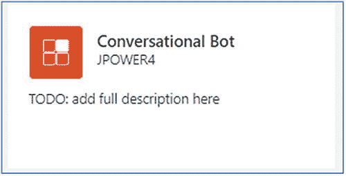

图 3-24

安装的应用

一旦软件包上传，MSTeam 将显示应用的摘要(图 3-25 )。

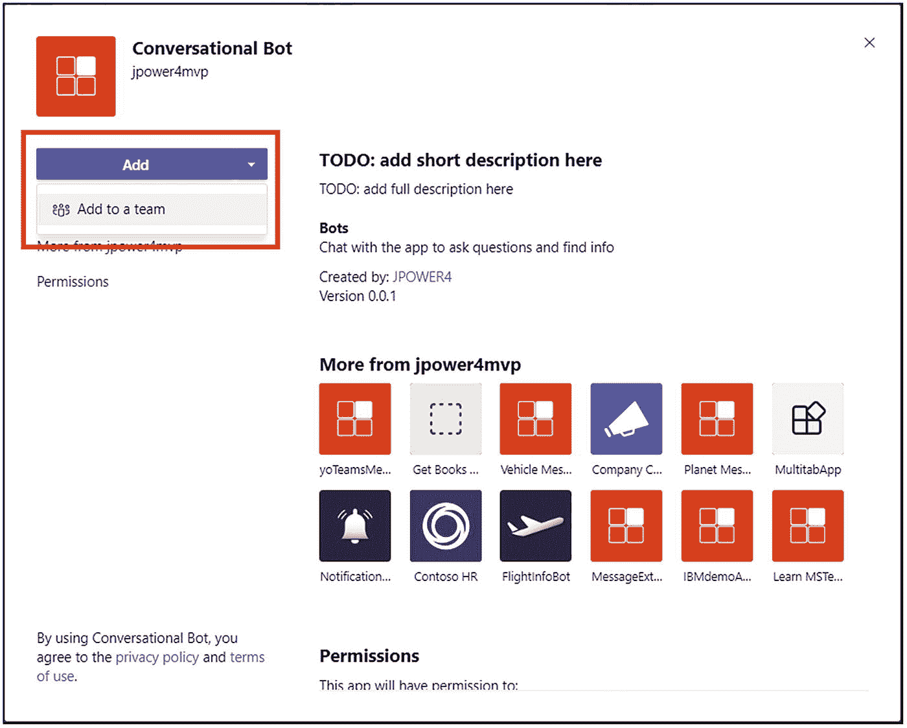

图 3-25

将应用添加到团队和渠道

#### 作为个人机器人进行测试

点击添加按钮，导航至与机器人聊天，如图 3-26 所示。

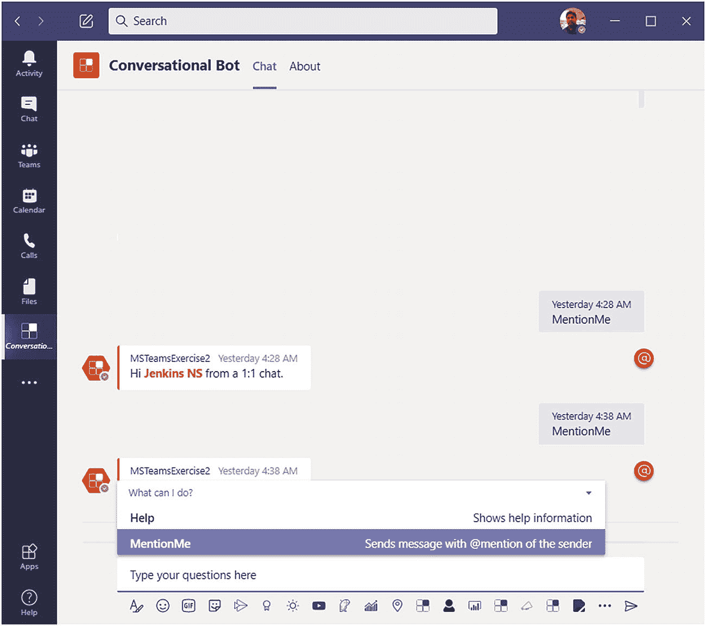

图 3-26

私人谈话

请注意，当应用加载时，bot 支持的命令会显示在编写框中。让我们测试一下机器人！

选择 MentionMe 命令，或在撰写框中手动键入 mentionme，然后按 enter。

几秒钟后，您应该看到机器人对您登录的用户做出响应，如图 3-27 所示。


图 3-27

个人对话回应

我们有一个工作的个人机器人，当它被提及时会有所反应。

#### 在通道中测试

使用应用栏导航菜单，选择更多添加的应用按钮。点击并打开对话机器人，然后点击添加到图 3-25 所示的团队链接。

选择要安装的频道；在这里，我选择了我现有的对话机器人>对话频道。然后点击“设置机器人”按钮，将机器人设置到如图 3-28 所示的频道。

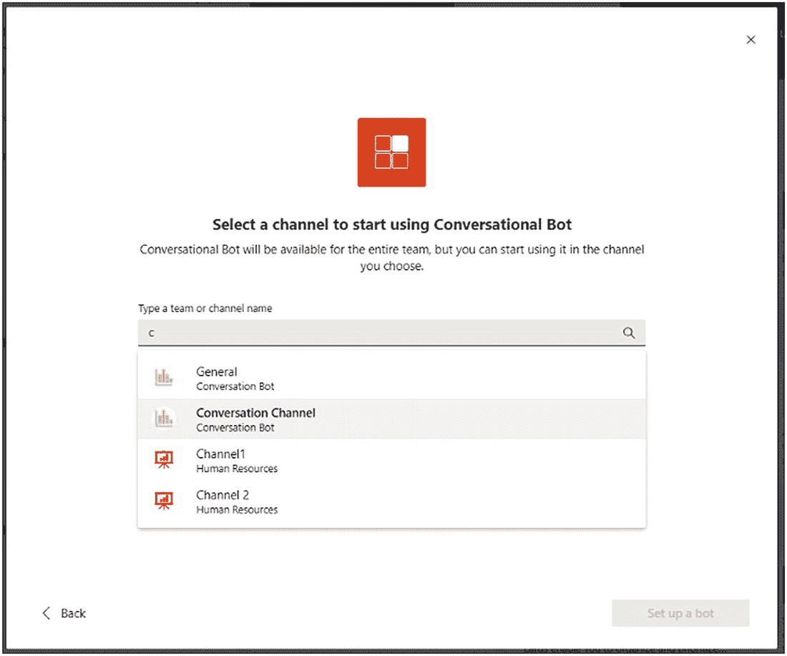

图 3-28

团队渠道设置

导航到团队中的现有渠道“对话渠道”。

在“频道对话”选项卡中，键入@Conversational Bot the bot(图 3-29 )。

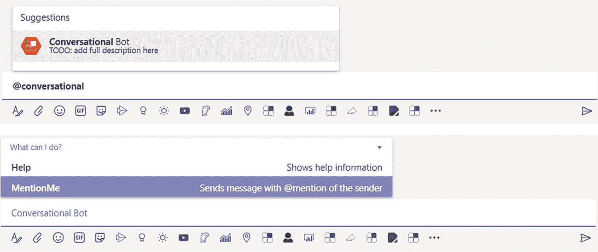

图 3-29

团队频道机器人

选择 MentionMe 命令，或在撰写框中手动键入 mentionme，然后按 enter。

几秒钟后，您应该看到 bot 对用户和通道对话消息做出了响应。见图 3-30


图 3-30

团队渠道响应

现在，我们有了一个工作团队机器人，当提到它时，它会做出响应。

## 练习 2 -用自适应卡片回复信息

在本练习中，您将使用自适应卡更新 bot 以响应未知消息。卡片的单一动作将触发机器人用新的自适应卡片响应现有消息，并使用消息反应进行响应。

卡片是可操作的内容片段，可以通过机器人、连接器或应用添加到对话中。使用文本、图形和按钮，卡片可以让你与观众交流。

### 什么是适配卡？

Adaptive Cards 是一种开放的卡片交换格式，使开发人员能够以通用和一致的方式交换 UI 内容。自适应卡是一种以清晰一致的方式显示数据并与之交互的方式。你会经常看到机器人和通知使用自适应卡来允许在聊天和操作系统通知中显示丰富的信息。

您可以使用 Adaptive Cards 显示带图形的富文本，提供允许人们与聊天或通知交互的按钮，显示动态信息，收集反馈，甚至使用它们来创建交互式表单。

适配卡支持两个团队的组件:

*   蝇蛆病

*   消息传递扩展

此外，自适应卡支持三种动作类型:

*   行动。开放链接

*   行动。使服从

*   行动。广告牌

Microsoft Teams App Studio 允许您使用 json、c#和 nodejs 为团队创建适配卡。见图 3-31 。

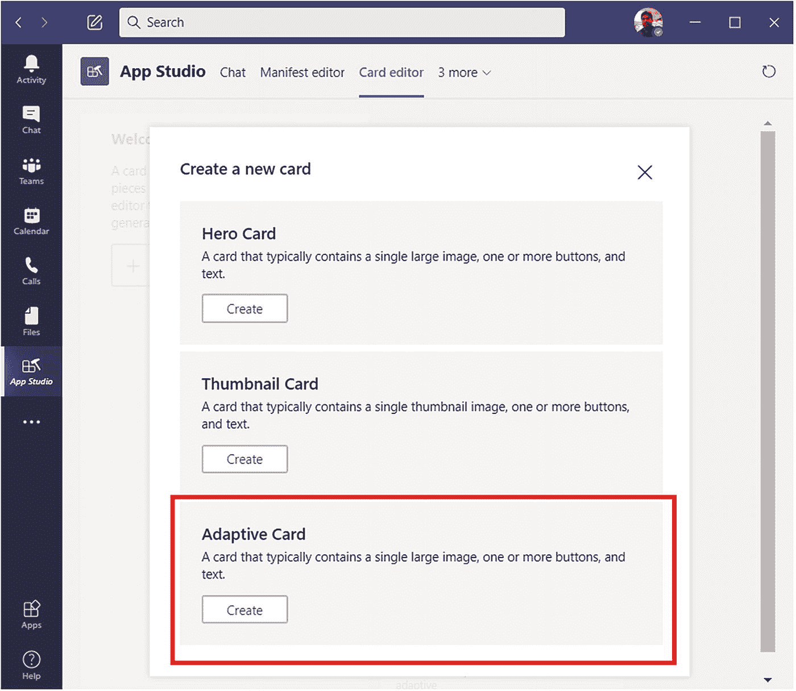

图 3-31

创建自适应卡

您还可以修改自适应卡操作。使用 Action.Submit 的数据对象中的 Microsoft Teams 属性提交有效负载以支持现有的 Bot 框架操作。

图 3-32 是适配卡的一个例子。

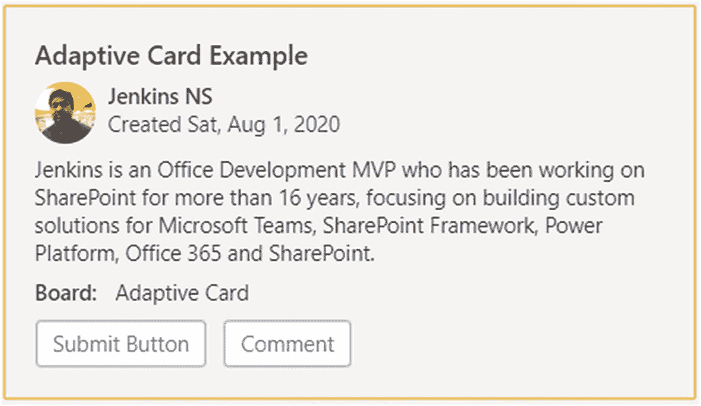

图 3-32

示例适配卡

您将使用自适应卡更新现有的团队对话机器人应用。

*   导航到。/src/app/conversational bot 文件夹，并创建一个名为“ResponseCard.json”的新文件

*   复制并粘贴以下代码:

*   导航到。/src/app/conversational bot 文件夹，并创建另一个名为“ResponseCard.ts”的新文件。

*   复制并粘贴以下代码:

```
{
"$schema": "http://adaptivecards.io/schemas/adaptive-card.json",
    "type": "AdaptiveCard",
    "version": "1.0",
    "body": [{
            "type": "Container",
            "items": [{
                "type": "TextBlock",
                "text": "My adaptive card response",
                "weight": "bolder",
                "size": "large"
            }]
        },
        {
            "type": "Container",
            "items": [{
                "type": "TextBlock",
                "text": "Now you have learned to receive response from bot by using adaptive card.
",
                "wrap": true
            }]
        }
    ],
    "actions": [{
        "type": "Action.OpenUrl",
        "title": "My Blog Page",
        "url": "http://jenkinsblogs.com"
    }]
}

```

*   转到。/src/app/conversational bot/conversational bot . ts 文件，并添加以下代码。

*   添加下面给出的标题:

```
const ResponseCard = require("./ResponseCard.json");

export default ResponseCard;

```

*   在**构造函数中的 this.onMessage()** 处理程序中

*   找到下面给出的代码:

```
import ResponseCard from "./ResponseCard";

```

*   替换下面给出的代码:

```
await context.sendActivity(`I\'m terribly sorry, but my master hasn\'t trained me to do anything yet...`);

```

```
const card = CardFactory.adaptiveCard(ResponseCard);
await context.sendActivity({ attachments: [card] });

```

### 保存并测试带有适配卡的机器人

让我们来测试一下:

1.  从命令行导航到项目的根文件夹，并执行以下命令:

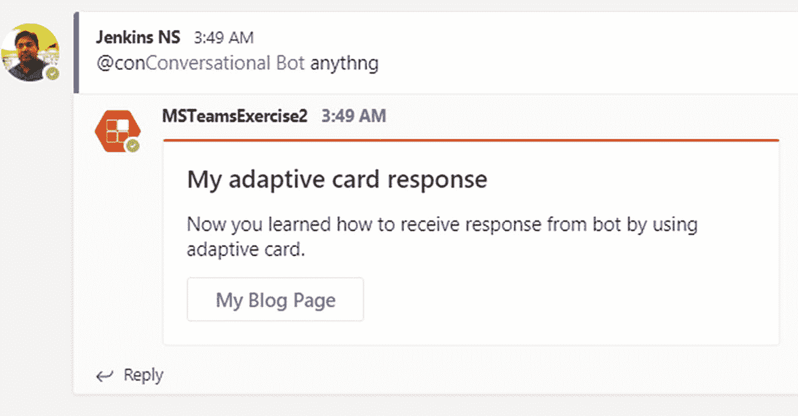

图 3-33

带适配卡的机器人

1.  Ngrok 已经创建了临时 URL e459e9c2beca.ngrok.io，它将映射到我们本地运行的 web 服务器。

2.  然后去 Azure 门户，打开 Bot 通道注册 App。使用临时 URL e459e9c2beca.ngrok.io 更新消息传递端点

3.  转到您在上一节中安装“机器人”的频道。

4.  删除对话 app，在频道重新安装。(仅供参考:我们还可以更改应用的版本，更新应用。)

5.  在 Conversations 选项卡中，键入@ **Conversation Bot** 带有随机字符串的 Bot**Ex:any**来触发 else 条件。

6.  机器人会用卡片回复消息(图 3-33 )。

```
gulp ngrok-serve

```

### 测试机器人对消息的反应

如果您想要更改消息或响应，请转到`Conversationalbot`类中的 this.onMessageReaction 处理程序并进行更改。

在 Microsoft Teams 客户端中，转到上一节中安装 bot 的频道。在 Conversations 选项卡中，找到来自机器人的消息，并对其应用类似的反应。

几秒钟后，机器人将回复一条消息“这是一个有趣的反应”，并点击该反应(图 3-34 )。

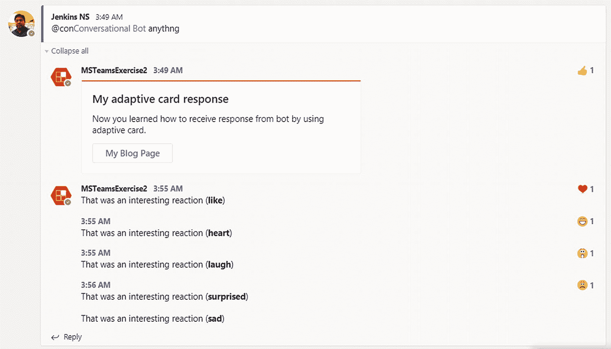

图 3-34

机器人反应

在本练习中，您修改了现有的 Microsoft Teams conversational bot 应用，使用自适应卡来响应消息，并测试了消息反应功能。

## 练习 3 -来自机器人的主动信息

主动消息是由机器人发送的用于开始对话的消息。出于多种原因，您可能希望您的机器人开始对话，包括以下原因:

*   个人机器人对话的欢迎信息

*   投票回应

*   外部事件通知

发送消息以启动新的对话线程不同于发送消息以响应现有的对话:当您的 bot 启动新的对话时，没有预先存在的对话来发布消息。

### 更新现有团队应用

在本练习中，您将更新现有的 Teams 应用，以便从您的机器人发送主动消息。

*   转到 ResponseCard.json 文件，在 actions 部分下添加一个新的 action submit 按钮。

*   导航。/src/app/conversational bot/conversational bot . ts 文件，并添加以下代码。

*   包括对现有 botbuilder 包的“ChannelInfo，TeamsChannelData，ConversationParameters，teamsGetChannelId，Activity，BotFrameworkAdapter，ConversationReference，ConversationResourceResponse”对象引用:

*   即

```
  {
            "type": "Action.Submit",
            "title": "Create new thread in this channel",
            "data": { "cardAction": "newconversation" }
  }

```

*   在构造函数的 **this.onMessage()** 处理程序中，添加下面给出的代码，在 switch 语句“switch(context . activity . type){…}”之前添加 if 语句，以处理新的会话请求。

    ```
    if (context.activity.value) {
       switch (context.activity.value.cardAction) {
             case "newconversation":
               const channelId = teamsGetChannelId(context.activity);
               const message = MessageFactory.text("New thread or conversation created by bot");
                const newConversation = await this.createConversationInChannel(context, channelId, message);
                      break;
                    }
                } else {

    ```

*   然后在 switch 语句后添加一个右大括号:

```
import { StatePropertyAccessor, CardFactory, TurnContext, MemoryStorage,
    ConversationState, ActivityTypes, TeamsActivityHandler, MessageFactory,
    ChannelInfo, TeamsChannelData, ConversationParameters, teamsGetChannelId,
  Activity, BotFrameworkAdapter, ConversationReference, ConversationResourceResponse
} from "botbuilder";

```

*   然后添加将创建新对话的 createConversationInChannel()方法。将以下方法添加到 Conversationalbot 类中:

```
}

```

*   现在，我们已经完成了主动消息发送的编码。

```
private async createConversationInChannel(context: TurnContext, teamsChannelId: string, message: Partial<Activity>): Promise<[ConversationReference, string]> {
    // create parameters for the new conversation
    const conversationParameters = <ConversationParameters>{
                isGroup: true,
                channelData: <TeamsChannelData>{
                  channel: <ChannelInfo>{
                    id: teamsChannelId
                  }
                },
                activity: message
              };

    // get a reference to the bot adapter & create a connection to the Teams API
    const adapter = <BotFrameworkAdapter>context.adapter;
    const connectorClient = adapter.createConnectorClient(context.activity.serviceUrl);
    // create a new conversation and get a reference to it
    const conversationResourceResponse: ConversationResourceResponse = await connectorClient.conversations.createConversation(conversationParameters);
    const conversationReference = <ConversationReference>TurnContext.getConversationReference(context.activity);
    conversationReference.conversation.id = conversationResourceResponse.id;

    return [conversationReference, conversationResourceResponse.activityId];
  }

```

### 保存并测试 Bot 以创建新的线程/消息

打开命令行，导航到项目的根文件夹，并执行以下命令:


图 3-35

机器人自适应信息

*   Ngrok 已经创建了临时 URL d23aadf72a73.ngrok.io，它将映射到我们本地运行的 web 服务器。

*   然后去 Azure 门户，打开 Bot 通道注册 App。使用临时 URL d23aadf72a73.ngrok.io 更新消息传递端点

*   转到您在上一节中安装“机器人”的频道。

*   删除对话 app，在频道重新安装。

*   在 Conversations 选项卡中,@ **Conversation Bot** 带有随机字符串的 Bot**Ex:any**来触发 else 条件。

*   机器人会用卡片回复消息(图 3-35 )。

```
gulp ngrok-serve

```

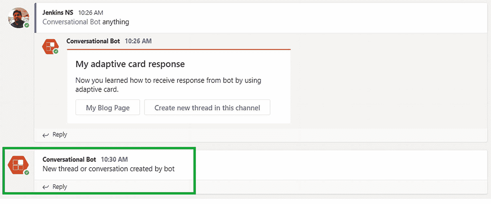

图 3-36

新线索消息

*   点按“在此频道中创建新主题”按钮。

*   几秒钟后，它会创建一个由出现在频道中的机器人创建的新对话(图 3-36 )。

*   在本练习中，您将修改现有的 Microsoft Teams conversation bot，以便从您的 bot 发送主动消息，同时单击“在此频道中创建新主题”按钮。

## 结论

在本章中，您已经学习了对话机器人的各种功能，以及如何使用 Yeoman generator (yo teams)创建机器人并将其添加到 Microsoft 团队中。还介绍了如何使用自适应卡、动作按钮，以及从机器人发送主动消息。

您现在已经学习了如何使用 Yeoman generator 为 MSTeam 创建对话机器人。在接下来的章节中，你将开始学习 MSTeam 应用的不同选项和功能。