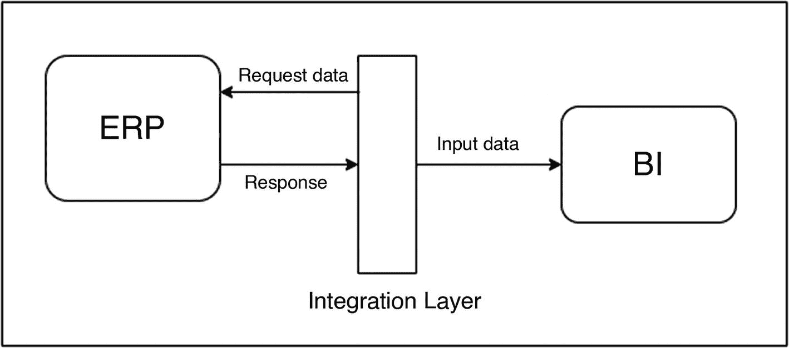
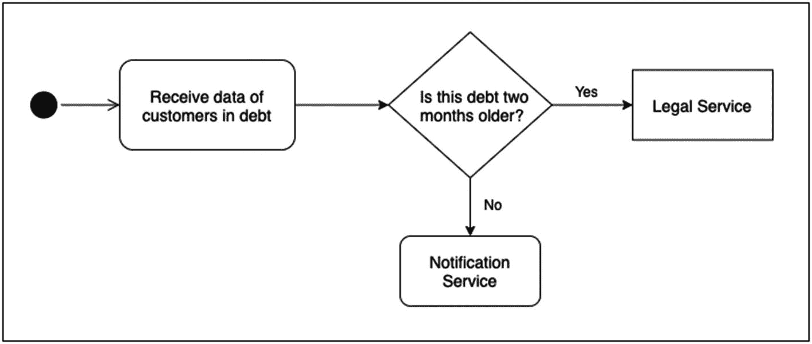
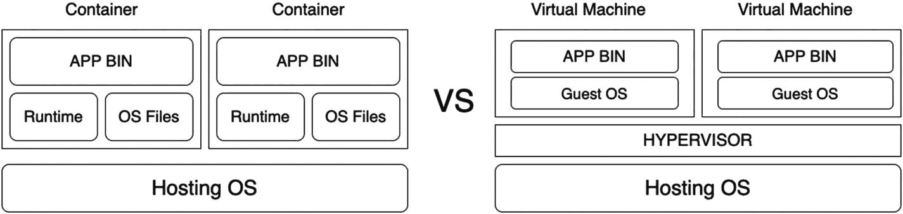
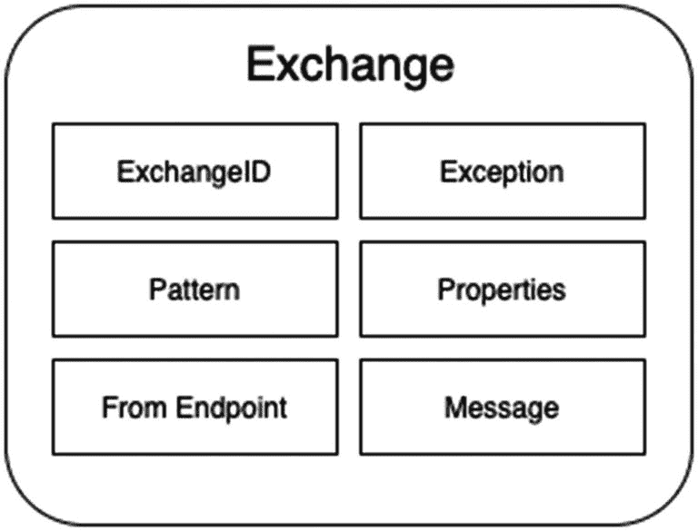
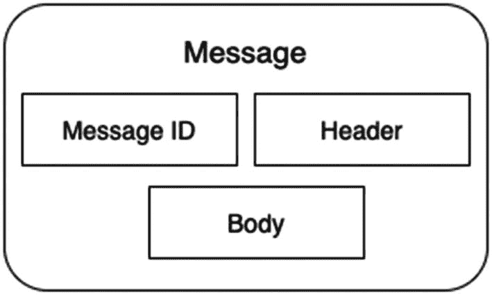
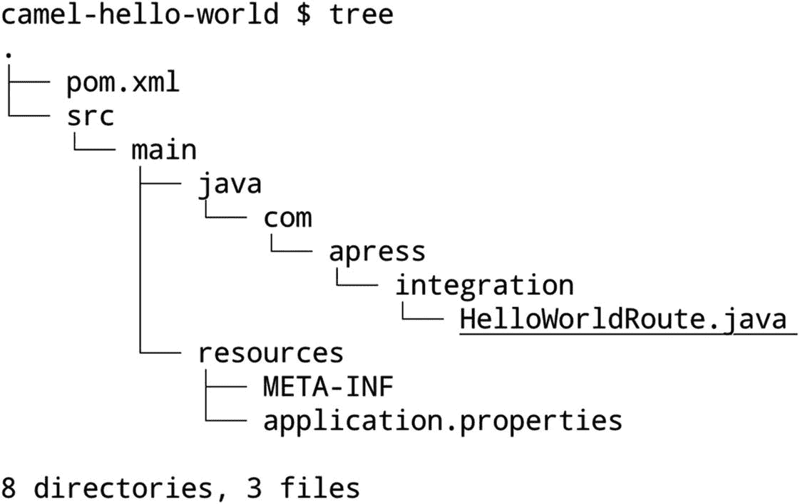
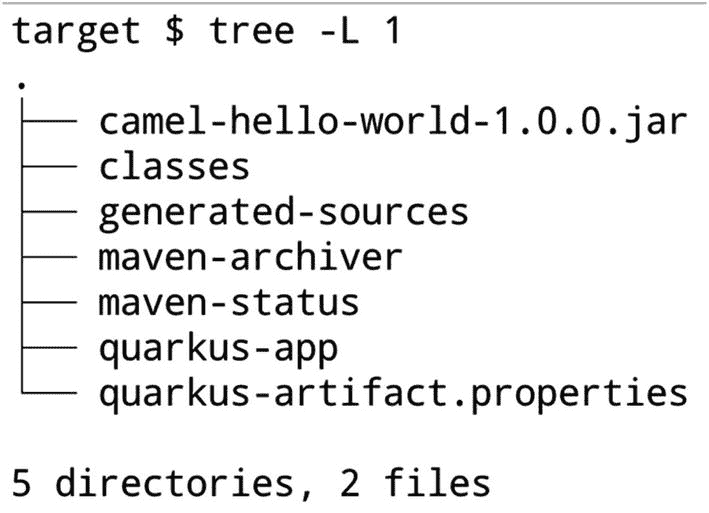
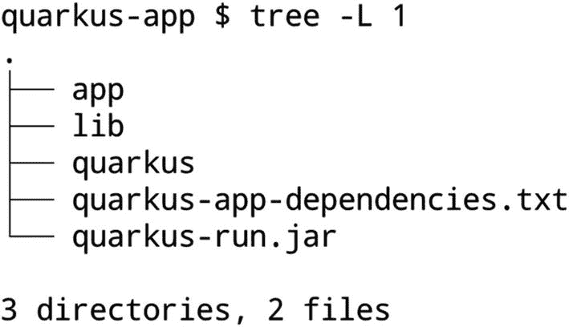
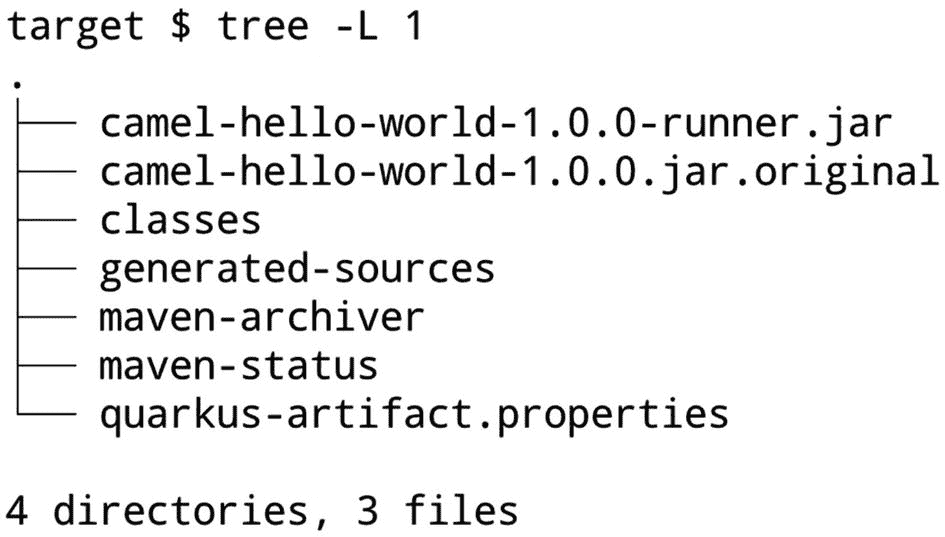

# 一、欢迎来到 Apache Camel

作为一名解决方案架构师，系统集成是我在工作中面临的最有趣的挑战之一，因此它绝对是我热衷于讨论和撰写的东西。我觉得大多数书都太技术性了，涵盖了特定工具所做的一切，或者只是理论性的，对模式和标准进行了大量的讨论，但没有向您展示如何用任何工具解决问题。我对这两种方法的问题是，有时你读了一本书，学习了一种新工具，但不知道如何将它应用到不同的用例中，或者你非常了解理论，但不知道如何在现实世界中应用它。虽然这类阅读有足够的空间，比如当你想要一本技术手册作为参考，或者你只是想扩展你在某个主题上的知识，但我的目标是创建一个从入门视角到现实世界的实践体验的材料。我希望您能够很好地了解 Apache Camel，加深对集成实践的理解，并学习可以在不同用例中使用的其他补充工具。最重要的是，我希望你对自己作为架构师或开发人员的选择充满信心。

这本书里有很多内容。这个想法是有一个现实世界的方法，在那里你处理许多不同的技术，就像你通常在这个领域所做的那样。我假设您对 Java、Maven、容器和 Kubernetes 有一点了解，但是如果您不觉得自己是这些技术的专家，也不用担心。我将用一种对每个人都有意义的方式来介绍它们，从需要将应用部署到 Kubernetes 的 Java 初学者，到已经掌握了扎实的 Java 知识但可能不了解 Camel 或需要学习用 Java 开发容器的方法的人。

在这第一章，我将为你在这本书里将要做的一切奠定基础。您将学习所选工具的基本概念，随着您的进步，我们将讨论它们背后的模式和标准。我们正从理论内容转向运行应用。

本章的三个主题是系统集成、Apache Camel 和带有 Quarkus 的 Java 应用。我们开始吧！

## 什么是系统集成？

虽然这个名字很容易理解，但是我想清楚我所说的系统集成是什么意思。让我们看一些例子并讨论与这个概念相关的方面。

首先，让我们以下面的场景为例:

> *A 公司购买了一个 ERP(企业资源计划* *)系统，该系统除了许多其他事情之外，还负责公司的财务记录。该公司还收购了一个系统，该系统可以根据财务信息，创建关于公司财务状况、投资效率、产品销售情况等的完整图形报告。问题是 ERP 系统没有一种本地方式来将其信息输入到 BI(商业智能)系统中，并且 BI 系统没有一种本地方式来消费来自 ERP 系统的信息。*

上面的场景是一种非常常见的情况，两个专有软件程序需要相互“交谈”，但它们不是为这种特定的集成而构建的。这就是我说的“原生方式”的意思，即产品中已经开发的东西。我们需要在这两个系统之间创建一个集成层来实现这一点。幸运的是，这两个系统都是面向 web API 的(应用编程接口)，允许我们使用 REST APIs 提取和输入数据。通过这种方式，我们可以创建一个集成层，它可以使用来自 ERP 系统的信息，将其数据转换成 BI 系统可以接受的格式，然后将这些信息发送到 BI 系统。如图 1-1 所示。



图 1-1

两个系统之间的集成层

尽管这是一个非常简单的例子，我没有向您展示这一层是如何构建的，但它很好地说明了这本书在我谈到系统集成时的含义。从这个意义上说，系统集成不仅仅是一个应用访问另一个应用。它是一个系统层，可以由许多应用组成，位于两个或多个应用之间，其唯一目的是集成系统，而不是直接负责业务逻辑。

让我们来看看这些概念之间的区别。

## 业务还是集成逻辑？

业务逻辑和集成逻辑是两个不同的概念。虽然可能不清楚如何将它们分开，但知道如何这样做是非常重要的。没有人想重写应用或集成，因为你创造了一个耦合的情况，我说的对吗？我们来定义一下，分析一些例子。

我在结束最后一节时说，集成层不应该包含业务逻辑，但是“这是什么意思？”。好吧，让我解释一下。

以我们的第一个例子为例。有些事情集成层必须知道，比如

*   从哪些 ERP 端点消费以及如何消费

*   如何以商业智能能够接受的方式转换来自 ERP 的数据

*   向哪些 BI 端点产生数据以及如何产生数据

这些信息与处理财务记录或提供业务洞察力没有关系，而这些能力应该由集成的各个系统来处理。该信息仅与使两个系统之间的集成工作相关。我们姑且称之为*整合逻辑*。让我们看另一个例子来阐明我所说的集成逻辑的含义:

> *想象一下，系统 A 负责识别与我们假想的公司有债务的客户。这家公司有一个单独的通信服务，当客户欠债时，可以发送电子邮件、短信，甚至打电话给客户，但如果客户欠债超过两个月，必须通知法律服务部门。*

如果我们认为这种情况是由集成层处理的，那么看起来我们的集成层中有业务逻辑。这就是为什么这是一个展示业务逻辑和集成逻辑之间差异的好例子。

尽管对该客户负债时间的分析结果将最终影响流程或业务决策，但此处插入此逻辑的唯一目的是指示这三个服务之间的集成将如何发生。我们可以称之为*路由*，因为正在做的事情是决定将通知发送到哪里。看看图 1-2 。



图 1-2

基于接收数据的集成逻辑

移除集成层并不意味着业务信息或数据会丢失；这只会影响这些服务的集成。如果我们在这一层中有逻辑来决定如何计算费用或如何协商债务，它就不仅仅是一个集成层；这将是一个实际的服务，我们将从系统 a 输入信息。

这些都是非常简短的例子，只是为了让我们对本书的内容有一个清晰的认识。随着我们的深入，我将提供更复杂和有趣的案例进行分析。这个想法只是为了说明这个概念，正如我接下来要为一个云原生应用做的那样。

## 云原生应用

现在我已经阐明了我所说的*集成*的意思，为了充分理解本书的方法，还有一个术语你必须知道:*云原生*。

这本书的主要目标之一是给出一个关于如何设计和开发集成的现代方法，在这一点上，不谈论容器和 Kubernetes 是不可能的。这些技术是如此具有破坏性，以至于它们完全改变了人们设计企业系统的方式，使得世界各地的技术供应商投入大量资金来创建在这种环境中运行或支持这些平台的解决方案。

全面解释容器和 Kubernetes 是如何工作的，或者深入探究它们的架构、具体配置或用法，这超出了本书的目标。我希望您已经对这些技术有所了解，但是如果没有，也不用担心。我将以一种任何人都能理解我们在做什么以及为什么要做的方式来使用这些技术。

为了让所有人都站在同一立场上，让我们来定义这些技术。

**容器** : *“一种打包和分发应用及其依赖项的方式，从库到运行时。从执行的角度来看，这也是一种隔离 OS(操作系统)进程的方法，为每个容器创建一个沙箱，类似于虚拟机的想法。”*

理解容器的一个好方法是将它们与更常见的技术虚拟化进行比较。看一下图 1-3 。



图 1-3

容器表示

虚拟化是一种隔离物理机器资源以模拟真实机器的方法。虚拟机管理程序是管理虚拟机并在一个托管操作系统上创建硬件抽象的软件。

我们进行虚拟化有许多不同的原因:隔离应用，使它们不会相互影响；为具有不同操作系统要求或不同运行时的应用创建不同的环境；隔离每个应用的物理资源，等等。出于某些原因，容器化可能是实现相同目的的一种更简单的方式，因为它不需要管理程序层或硬件抽象。它只是重用宿主 Linux 内核，并为每个容器分配资源。

Kubernetes 怎么样？

Kubernetes *是一个专注于大规模容器编排的开源项目。它提供了允许容器通信和管理的机制和接口。”*

由于我们需要软件来管理大量的虚拟机，或者仅仅是为了创建高可用性机制，容器也不例外。如果我们想大规模运行容器，我们需要补充软件来提供所需的自动化水平。这就是 Kubernetes 的重要性。它允许我们创建集群来大规模地管理和编排容器。

这是对容器和 Kubernetes 的高度描述。这些描述给出了我们为什么需要这些技术的想法，但是为了理解术语*云原生*你需要知道一些关于这些项目的历史。

2014 年，谷歌启动了 Kubernetes 项目。一年后，谷歌与 Linux 基金会合作创建了云本地计算基金会(CNCF)。CNCF 的目标是维持 Kubernetes 项目，并作为 Kubernetes 所基于的或构成生态系统的其他项目的保护伞。在这种情况下， *cloud native* 的意思是“为 Kubernetes 生态系统制造”

除了 CNCF 的起源，“云”这个名字非常合适还有其他原因。如今，Kubernetes 很容易被认为是一个行业标准。在考虑大型公共云提供商(例如 AWS、Azure 和 GCP)时尤其如此。它们都有 Kubernetes 服务或基于容器的解决方案，并且都是 Kubernetes 项目的贡献者。该项目也存在于提供私有云解决方案的公司的解决方案中，如 IBM、Oracle 或 VMWare。即使是为特定用途(如日志记录、监控和 NoSQL 数据库)创建解决方案的利基参与者也已经为容器准备好了他们的产品，或者正在专门为容器和 Kubernetes 创建解决方案。这表明 Kubernetes 和容器已经变得多么重要。

在本书的大部分时间里，我将重点关注集成案例和解决这些案例的技术，但所有决策都将考虑云原生应用的最佳实践。在您对集成技术和模式有了坚实的理解之后，在最后一章中，您将深入了解如何在 Kubernetes 中部署和配置开发的应用。

那么让我们来谈谈我们的主要集成工具。

## 什么是 ApacheCamel？

首先，在开始编写代码和研究集成案例之前，您必须理解什么是 Apache Camel，什么不是 Apache Camel。

Apache Camel 是一个用 Java 编写的框架，它允许开发人员使用成熟的集成模式的概念，以简单和标准化的方式创建集成。Camel 有一个超级有趣的结构叫做*组件*，其中每个组件都封装了访问不同端点所必需的逻辑，比如数据库、消息代理、HTTP 应用、文件系统等等。它还有用于与特定服务集成的组件，如 Twitter、Azure 和 AWS，总共超过 300 个组件，这使它成为集成的完美瑞士刀。

有一些低代码/无代码的解决方案来创建集成。其中一些工具甚至是用 Camel 编写的，比如开源项目 Syndesis。在这里，您将学习如何使用 Camel 作为集成专用框架来编写与 Java 的集成。

让我们学习基础知识。

### 集成逻辑，集成路由

您将从分析清单 1-1 中显示的以下“Hello World”示例开始。

```
package com.appress.integration;
import org.apache.camel.builder.RouteBuilder;
public class HelloWorldRoute extends RouteBuilder {
    @Override
    public void configure() throws Exception {
        from("timer:example?period=2000")
        .setBody(constant("Hello World"))
        .to("log:" + HelloWorldRoute.class.getName() );
    }
}

Listing 1-1HelloWorldRoute.java File

```

这个类创建了一个定时器应用，它每 2 秒钟在控制台中打印一次`Hello World`。虽然这不是一个真正的集成案例，但它可以帮助您更容易地理解 Camel，因为最好从小处着手，一次一点。

这里只有几行代码，但是有很多事情要做。

首先要注意的是，`HelloWorldRoute`类扩展了一个名为`RouteBuilder`的 Camel 类。用 Camel 构建的每个集成都使用一个叫做**路线**的概念。其思想是集成总是从`from`一个端点开始，然后到`to`一个或多个端点。这正是这个`Hello World`例子所发生的事情。

**路线**从计时器**组件** ( `from`)开始，最终到达最终目的地，也就是日志**组件** ( `to`)。另一件值得一提的事情是，您只有一行代码来创建您的路线，尽管它是缩进的，以使它更具可读性。这是因为 Camel 使用了一种流畅的方式来编写路线，您可以在其中附加关于您的路线应该如何表现的定义，或者简单地为您的路线设置属性。

路线建造者，比如`HelloWorldRoute`类，只是蓝图。这意味着这种类型的类只在应用启动时执行。通过执行`configure()`方法，这些栈调用的结果是一个**路由定义**，它用于实例化内存中的许多对象。内存中的这些对象将对由`from`(消费者)端点触发的事件做出反应。在这种特殊情况下，组件将自动生成其事件，这些事件将通过路由逻辑，直到到达其最终端点。这种输入事件的执行被称为**交换**。

### 交流和信息

在上一节中，您看到了集成逻辑是如何创建和执行的，但是在这个逐步执行的过程中，数据将如何处理呢？为了使集成工作，路由携带其他结构。让我想想。

在最后一个例子中，还有一行代码需要注释。`setBody(constant("Hello World"))`是您实际设置路线数据的唯一线路。让我们看看数据在路由中是如何处理的。

在上一节中，我说过:*“内存中的那些对象将对由 from()端点触发的事件做出反应。”*。在这种情况下，当我谈到一个事件时，我的意思是计时器触发了，但它可能是一个传入的 HTTP 请求、一个文件访问一个目录，或者来自不同端点的另一个触发的操作。重要的是，当这种情况发生时，会创建一个名为`Exchange`的对象。该对象是路由执行的数据表示。这意味着每次定时器触发时，将创建一个新的`Exchange`，并且该对象将一直可用，直到该执行完成。请看图 1-4 上的`Exchange`表示。



图 1-4

交换表示

上图显示了一个`Exchange`对象中可用的主要属性。所有这些都很重要，但是如果你想理解`setBody(constant("Hello World"))`做什么，你必须把注意力集中在信息上。

您在路由链中遇到的每个端点都有可能改变`Exchange`状态，大多数情况下，它们会通过与`Message`属性交互来实现。

`message`对象表示来往于路线中不同端点的数据。请看图 1-5 中`message`物体的表示。



图 1-5

消息对象表示

`message`对象是一个抽象概念，有助于以标准化的方式处理不同类型的数据。例如，如果您接收一个 HTTP 请求，它有头和 URL 参数，它们是描述通信特征的元数据，或者只是以键/值格式添加信息，但是它还有一个主体，可以是文件、文本、JSON 或许多其他格式。`message`对象具有非常相似的结构，但是它足够灵活，可以将其他类型的数据表示为二进制文件、JMS 消息、数据库返回等等。

继续 HTTP 请求的例子，头和 URL 参数将被解析为消息头属性，HTTP 主体将成为一个`message`主体。

当您使用`setBody(constant("Hello World"))`时，您更改了`exchange`中的消息对象，将字符串“`Hello World`”设置为 body 属性。

还有一件事要解释。`constant("Hello World")`是什么意思？

### 表达式语言

route 类只是一个蓝图，所以它不会执行一次以上。那么我们如何动态地处理数据呢？一个可能的答案是表达式语言。

`setBody()`方法接收一个类型为**表达式**的对象作为参数。发生这种情况是因为该路由步骤可以是静态的，也可以根据通过该路由的数据而变化，这需要在路由创建期间进行评估。在这种情况下，您希望每次计时器触发新事件时，主体消息都应该设置为“`Hello World`”。为此，你使用了方法`constant()`。此方法允许您将静态值设置为常量，在本例中为字符串值，或者在运行时获取一个值并将其用作常量。无论执行什么，值总是相同的。

`constant()`方法并不是处理交换数据的唯一方法。还有其他适合不同用途的表达式语言。表 1-1 中列出了 Camel 中所有可用的 ELs。

表 1-1

支持 Camel 的表达式语言

<colgroup><col class="tcol1 align-left"> <col class="tcol2 align-left"> <col class="tcol3 align-left"> <col class="tcol4 align-left"> <col class="tcol5 align-left"></colgroup> 
| 

豆子法

 | 

常数

 | 

很简单

 | 

DataSonnet

 | 

交换财产

 |
| --- | --- | --- | --- | --- |
| 查询语言 | 路径语言 | XML 标记化 | 标记化 | 拼写 |
| exchange 属性 | 文件 | 绝妙的 | 页眉 | HL7 Terser |
| 乔尔！乔尔 | JsonPath | 拉维尔 | 每一个 | 裁判员 |
| 简单的 |   |   |   |   |

以后你会看到其他表达式语言的例子。

现在您已经完全理解了`Hello World`示例是如何工作的，您需要运行这段代码。但是有一个缺失的部分。你是如何打包并运行这段代码的？为此，你需要先了解夸库斯。

## 第四的

您将使用云原生原则，并将应用作为容器映像进行分发，但这是该过程的最后一步。你如何处理应用的依赖性？如何编译 Java 类？如何运行 Java 代码？要回答这些问题，你需要夸库。

您几乎已经可以运行 Camel 应用了。你对 Camel 的工作原理有了基本的了解。现在，您将处理基本框架。

Quarkus 是 2018 年发布的开源项目。它是专门为 Kubernetes 世界开发的，创建了一种机制，使 Kubernetes 的 Java 开发变得更加容易，同时也处理了 Java 的“老”问题。

要理解 Quarkus 为什么重要，您需要理解 Java 的“老”问题。我们来谈谈历史。

### Java 进化

让我们后退一步，理解在 Quarkus 出现之前，Java 是如何用于企业应用的。

Java 最早发布于 1995 年，差不多 26 年前。可以肯定地说，从那时起，世界发生了很大的变化，更不用说 It 行业了。让虚拟机能够执行字节码，让开发人员有可能编写可以在任何操作系统中运行的代码，这个想法非常棒。它围绕 Java 语言创建了一个巨大的社区，使它成为最流行的编程语言之一，或者可能是最流行的编程语言。对其受欢迎程度产生巨大影响的另一个特性是自我管理内存分配的能力，使开发人员不必处理分配内存空间的指针。但是一切美好的事物都是有代价的。JVM (Java 虚拟机)是负责将 Java 字节码翻译成机器码的“本地”程序，它需要计算机资源，在历史上，在虚拟机结构上花费几兆字节是可以的。

编写的大部分企业应用，这里我指的是 2000 年到 2010 年之间，都部署在应用服务器上。Websphere、JBoss 和 Web Logic 在当时是巨大的，我敢说它们现在仍然是，但没有它们辉煌时期那么大了。应用服务器提供了集中的功能，如安全性、资源共享、配置管理、可伸缩性、日志记录等等，而付出的代价非常小:除了额外的 CPU 使用之外，几兆字节用于虚拟机，几兆字节用于应用服务器代码本身。如果您可以在同一台服务器上部署大量应用，这个价格就会被稀释。

为了使它们高度可用，系统管理员将为该特定的应用服务器创建一个集群，将每个应用至少部署两次，集群的每个节点一次。

即使您可以实现高可用性，可伸缩性也不一定容易，而且肯定不便宜。您可以选择通过添加与集群中相同的另一个节点来扩展一切，这有时会扩展不需要扩展的应用，因此会不必要地消耗资源。您还可以为特定的应用创建不同的配置文件和不同的集群，因为有些应用无法扩展，需要自己的配置文件。在这种情况下，您可能会遇到这样的情况:每个应用服务器需要一个应用，因为应用的特征彼此差异太大，使得更难一起规划它们的生命周期。

在这一点上，拥有一个应用服务器的价格开始变得越来越高，即使供应商试图使他们的平台尽可能模块化以避免这些问题。应用开始以不同的方式发展来解决这些情况。

### 微服务

云原生方式通常构建在*微服务架构*之上。在这里，我将描述它是什么，以及它与 Java 发展的关系，最重要的是，它与 Java 框架生态系统的关系。

正如您在上一节中看到的，扩展应用服务器不是一件容易的事情。这需要根据您的应用和大量计算资源采取特定的策略。另一个问题是处理应用库的依赖性。

Java 社区如此强大的原因之一是分发和获得可重用的库是多么容易。使用像 Gradle、Maven 甚至 Maven 的哥哥 Ant 这样的工具，可以将您的代码打包到 jar/war/ear 中，并合并您的应用需要的依赖项，或者您可以将您的依赖项直接部署到您的应用服务器，并与该服务器上的每个应用共享它们。许多 Java 项目都使用这种机制。没有什么是刚刚创造出来的。尽可能重复使用所有东西。这很好，除非您必须将不同的应用放在同一个应用服务器上。

在应用服务器时代，处理依赖冲突是混乱的。您可以并且仍然可以让应用使用同一个库，但是使用不同的版本，并且版本可能完全不兼容。这是一个真正的阶级加载地狱。当时谁没有收到过`NoSuchMethodError`异常？当然，应用服务器已经发展到可以处理这些问题。他们创建了隔离机制，这样每个应用都可以有自己的类加载过程，或者可以使用例如 OSGi 框架来准确指定它将使用哪些依赖项，但这并没有解决将所有鸡蛋放在同一个篮子中的风险。例如，如果一个应用出现了内存泄漏问题，就会影响到运行在同一个 JVM 上的每个应用。

大约在 2013~2014 年，多个项目开始以创建独立的 runnable jar 应用的想法发布。Spring Boot、Dropwizards 和 Thorntail 等项目开发了使开发更容易、更快速的框架。采用标准化优先于配置这样的原则，这些框架将允许开发人员通过编写更少的代码来更快地创建应用，并且仍然可以获得 JAVA EE 规范的大部分好处，而不依赖于应用服务器。您的源代码、依赖项和框架本身将被打包在一个单独的、隔离的、可运行的 jar 文件中，也称为 fat jar。在同一时期，REST 变得非常流行。

有了打包应用的方法和提供服务间通信的可靠协议，开发人员可以采用更具可伸缩性和模块化的架构风格:微服务。

微服务的对话很长。为了真正定义微服务，我们可以讨论服务粒度、领域定义、技术专业化、服务生命周期以及其他可能干扰我们如何设计应用的方面，但为了避免偏离我们的主题太多，让我们同意这样的理解，即微服务是旨在更加简洁/专业化的服务，将系统复杂性分散到多个服务中。

现在离 2018 年更近了。fat jar 框架是真正的交易，通过少量的自动化，它们占据了应用服务器所占据的空间。这个模型非常适合容器，因为我们只需要 jar 和运行时(JRE)来运行它。很容易创建一个容器映像来打包应用和运行时依赖项。这是将 Java 引入容器和 Kubernetes 的最简单的方法。现在，不是将十个 war 文件部署到一个应用服务器，而是将这十个新服务打包到十个不同的容器映像中，创建十个作为容器运行的 JVM 进程，这些进程由您的 Kubernetes 集群编排。

开发和部署用 Java 编写的服务比以往任何时候都更加容易和快捷，但现在的问题是:您在这方面花费了多少资源？

你还记得我说过花很小的代价就能拥有一个 Java 虚拟机吗？现在这个价格乘以十。你还记得我说过库的极端重用，以及在共享环境中有多混乱吗？嗯，现在我们没有依赖冲突，因为服务是隔离的，但我们在那些框架中仍然有大量的依赖，我们正在复制这一点。胖罐子真的变得越来越胖，使得类加载过程越来越慢和沉重，有时在启动时比应用真正运行时消耗更多的 CPU。我们也在消耗更多的内存。让许多微服务在 Java 中运行是非常耗费资源的。

我想回顾一下这段历史，这样你们就能理解为什么我们要用 Quarkus 进行整合。Quarkus 就是在所有这些问题出现的时候被创造出来的。所以它是为了解决这些问题而产生的。它的库是从头开始编码的，这使得它的类加载过程更快，内存占用更少。它也是为 Kubernetes 世界设计的，所以在容器中部署它并与 Kubernetes 环境交互要容易得多。我们可以将 Camel 与另一个框架一起使用，但我们的重点是构建云原生集成。这就是我选择夸库斯的原因。

别说了，开始编码吧。

### 开发要求

运行本书中的代码示例需要一些工具。它们将是用于运行所有章节中的示例的相同工具。

这本书的源代码可以在 GitHub 上通过这本书的产品页面获得，位于 [`www.apress.com/ISBN`](http://www.apress.com/ISBN) 。在那里你会发现第一个示例代码，名为`camel-hello-world` **，**，我们现在就来解决这个问题。

以下是使用的工具列表:

*   安装了 JAVA_HOME 并进行适当配置的 JDK 11

*   配置了 M2_HOME 的 Maven 3.6.3

*   夸尔库斯

*   Camel 3.9.0

*   CE 20.10.5 Docker

*   运行命令的终端或提示符

由于不同操作系统之间的指令可能会有所不同，所以我不会介绍如何安装和配置 Java、Maven 和 Docker。你可以在每个项目的网站上找到这些信息。

这本书是 IDE 不可知论者。使用你最熟悉的 IDE。您将需要一个终端或提示符来运行 Maven 和 Docker 命令，所以要正确设置一个。您将使用的唯一插件是 Maven 插件，它应该与所有主流操作系统兼容。

让我们从下载这本书的代码开始。完成后，转到项目`camel-hello-world`目录。它应该看起来像图 1-6 。



图 1-6

quartus 目录结构

如图 1-6 所示，这个 Maven 项目中只有三个文件:你已经知道的 route 类、`application.properties`文件和`pom.xml`文件。

教 Maven 超出了本书的范围。我希望您已经对该工具有所了解，但是如果没有，也不要担心。我会给你所有需要的命令，你将使用源代码提供的 pom 文件。你只需要在你的机器上配置 Maven。有关如何安装和配置 Maven 的信息，请访问 [`https://maven.apache.org/`](https://maven.apache.org/) 。

让我们看看来自`pom.xml`文件的清单 1-2 中的代码片段。

```
...
  <dependencyManagement>
    <dependencies>
      <dependency>
        <groupId>io.quarkus</groupId>
        <artifactId>quarkus-universe-bom</artifactId>
        <version>1.13.0.Final</version>
        <type>pom</type>
        <scope>import</scope>
      </dependency>
    </dependencies>
  </dependencyManagement>
...

Listing 1-2Camel-hello-world pom.xml Snippet

```

这是 pom 的一个非常重要的部分。本节描述了您将从中检索本书中使用的所有依赖项的版本的参考。Quarkus 提供了一个名为`quarkus-universe-bom` **、**的“`bill of materials`”依赖项，在这里声明了框架的每个组件。这样你就不需要担心每个依赖版本以及它们之间的兼容性。

清单 1-3 显示了项目的依赖关系。

```
...
  <dependencies>
    <dependency>
      <groupId>org.apache.camel.quarkus</groupId>
      <artifactId>camel-quarkus-log</artifactId>
    </dependency>
    <dependency>
      <groupId>org.apache.camel.quarkus</groupId>
      <artifactId>camel-quarkus-core</artifactId>
    </dependency>
    <dependency>
      <groupId>org.apache.camel.quarkus</groupId>
      <artifactId>camel-quarkus-timer</artifactId>
    </dependency>
  </dependencies>
...

Listing 1-3Camel-hello-world pom.xml snippet

```

Quarkus 物料清单中的依赖项被称为*扩展*。在第一个例子中，只有三个，这很好。这样代码会更简单、更轻便。这是可能的，因为除了作为一个全新的框架，Quarkus 还实现了 MicroProfile 规范。让我们稍微谈一谈。

### 微文件规范

技术总是在发展，有时它们对生态系统变得如此重要，以至于我们可能需要为它们制定一个规范。这有助于生态系统的发展，因为它提供了不同项目之间更多的互操作性。微文件规范就是其中的一种。

这在过去发生过。我们可以用 Hibernate 作为例子。它对 Java 社区变得如此流行和重要，以至于这个 ORM(对象关系映射)项目驱动了后来成为 JPA (Java 持久性 API)规范的许多方面，这影响了 Java 语言本身。

微文件规范和微服务框架(Spring Boot、Quarkus、Thorntail 等等)重复了历史。随着它们越来越受欢迎，越来越多的项目为这个生态系统提供了新的功能，需要一个规范来保证它们之间最小的互操作性，并为这些框架设置需求和良好的实践。

MicroProfile 规范相当于微服务框架的 Jakarta EE(以前称为 Java Platform，Enterprise Edition–Java EE)。它将 Jakarta EE 中存在的(应用编程接口)API 规范的子集翻译到微服务领域。这只是一个子集，因为有些组件对这种不同的方法没有意义，这里主要关注的是微小而有效。

以下是规范中的 API 列表:

*   记录

*   配置

*   容错

*   健康检查

*   韵律学

*   开放 API

*   应用接口

*   JWT 认证

*   OpenTracing

*   依赖注入

*   JSON-P(解析)

*   JSON-B(绑定)

尽管这些 API 中的大部分是每个微服务所必需的，但每一个都是独立的。这种模块化有助于我们尽可能地维护我们的服务，因为我们只导入将要使用的依赖项。

MicroProfile 当前版本为 4.0。

通过选择 Quarkus 作为我们的 Camel 基础框架，我们也获得了 MicroProfile 规范的能力。所以让我们回到我们的代码。

### 运行代码

现在您已经了解了这些工具是如何工作的以及它们是如何产生的，让我们开始运行示例代码。

关于`pom.xml`文件还有一点值得一提的是:`quarkus-maven-plugin`。看看清单 1-4 。

```
...
     <plugin>
        <groupId>io.quarkus</groupId>
        <artifactId>quarkus-maven-plugin</artifactId>
        <version>1.13.0.Final</version>
        <extensions>true</extensions>
        <executions>
          <execution>
            <goals>
              <goal>build</goal>
              <goal>generate-code</goal>
              <goal>generate-code-tests</goal>
            </goals>
          </execution>
        </executions>
  </plugin>
...

Listing 1-4Camel-hello-world pom.xml Snippet

```

这个插件对 Quarkus 来说极其重要。它负责构建、打包和调试代码。

为了实现更快的启动时间，Quarkus 插件不仅仅是编译。它预测了大多数框架在运行时执行的任务，比如加载库和配置文件、扫描应用的类路径、配置依赖注入、设置对象关系映射、实例化 REST 控制器等等。这种策略减轻了云本地应用的两种不良行为:

*   应用需要更长时间准备接收请求或启动

*   应用在启动时比实际运行时消耗更多的 CPU 和内存

没有这个插件你就不能运行你的代码，所以在创建你的 Quarkus 应用的时候记得配置它。让我们运行`camel-hello-world`代码。

在您的终端中，转到`camel-hello-world`目录并运行以下命令:

```
camel-hello-world $ mvn quarkus:dev

```

如果您是第一次在这个版本中运行 Quarkus 应用，可能需要几分钟来下载所有的依赖项。之后，您将看到如清单 1-5 所示的应用日志。

```
__  ____  __  _____   ___  __ ____  ______
 --/ __ \/ / / / _ | / _ \/ //_/ / / / __/
 -/ /_/ / /_/ / __ |/ , _/ ,< / /_/ /\ \
--\___\_\____/_/ |_/_/|_/_/|_|\____/___/
2021-04-04 19:43:20,118 INFO  [org.apa.cam.qua.cor.CamelBootstrapRecorder] (main) bootstrap runtime: org.apache.camel.quarkus.main.CamelMainRuntime
2021-04-04 19:43:20,363 INFO  [org.apa.cam.imp.eng.AbstractCamelContext] (main) Routes startup summary (total:1 started:1)
2021-04-04 19:43:20,363 INFO  [org.apa.cam.imp.eng.AbstractCamelContext] (main)     Started route1 (timer://example)
2021-04-04 19:43:20,363 INFO  [org.apa.cam.imp.eng.AbstractCamelContext] (main) Apache Camel 3.9.0 (camel-1) started in 86ms (build:0ms init:68ms start:18ms)
2021-04-04 19:43:20,368 INFO  [io.quarkus] (main) camel-hello-world 1.0.0 on JVM (powered by Quarkus 1.13.0.Final) started in 1.165s.
2021-04-04 19:43:20,369 INFO  [io.quarkus] (main) Profile prod activated.
2021-04-04 19:43:20,370 INFO  [io.quarkus] (main) Installed features: [camel-core, camel-log, camel-support-common, camel-timer, cdi]
2021-04-04 19:43:21,369 INFO  [com.app.int.HelloWorldRoute] (Camel (camel-1) thread #0 - timer://example) Exchange[ExchangePattern: InOnly, BodyType: String, Body: Hello World]
2021-04-04 19:43:23,367 INFO  [com.app.int.HelloWorldRoute] (Camel (camel-1) thread #0 - timer://example) Exchange[ExchangePattern: InOnly, BodyType: String, Body: Hello World]
2021-04-04 19:43:25,370 INFO  [com.app.int.HelloWorldRoute] (Camel (camel-1) thread #0 - timer://example) Exchange[ExchangePattern: InOnly, BodyType: String, Body: Hello World]

Listing 1-5Application Output

```

这是您通过调用`quarkus:dev`与插件的第一次交互。这里你用的是 Quarkus 开发模式。该模式将在本地运行您的应用，并允许您测试它。它还允许您远程调试代码。默认情况下，它将侦听端口 5005 上的调试器。

好了，你终于可以运行一些代码了，但是你如何打包应用来发布呢？接下来看看。

## 包装应用

要运行 Java 应用，至少需要一个 jar 文件。你如何用夸库斯提供这些？

集成代码使用 Quarkus 打包，quar kus 是一个云原生微服务框架，因此，您知道您将在容器中运行它，但在您可以创建容器映像之前，您需要了解如何创建可执行文件。在 Quarkus 中，有两种方法:传统的 JVM 或本地编译。

我们已经讨论了 JVM、类加载，以及 Quarkus 如何通过预测构建过程中的一些运行时步骤来优化过程，但是有一种方法可以进一步优化应用性能:原生编译。

**原生映像**是 **GraalVM** 的一种运行模式，GraalVM 是 Oracle 开发的一个 JDK 项目，旨在改善 Java 和其他 JVM 语言的代码执行。在这种模式下，编译器创建本机可执行文件。所谓本机，我指的是“不需要 JVM 的代码，它可以在编译到的每个操作系统上本机运行。”生成的可执行文件具有更快的启动时间和更小的内存占用。如果我正在运行数百个服务，这是非常可取的。

发生这种情况是因为代码是预编译的，一些类是预先初始化的。所以不需要字节码解释。一些 JVM 功能，比如垃圾收集器(一种处理内存分配的方法),内置在生成的二进制文件中。这样，没有 JVM 也不会损失太多。

可以想象，使用这种编译方法有一些注意事项。由于提前编译，反射、动态类加载和序列化在本机方法中的工作方式不同，这使得一些常用的 Java 库不兼容。

Quarkus 是为这个新世界而生的，它与 GraalVM 兼容，但在本书中，我们将重点关注传统的 JVM 字节码编译。我的想法是保持对集成和 Camel 的关注，但是本书示例中的每个`pom.xml`都将配置原生概要文件，所以你可以在喜欢的时候尝试原生编译。请记住，在本机编译期间有大量的处理，这使得编译过程稍微长一点，并且消耗更多的内存和 CPU。

好了，现在您已经知道了原生编译和 GraalVM 的存在，让我们回到 runnable jar 方法。Quarkus 提供了两种包装 jar 的方法:快速 jar 或超级 jar。

### 快速汽车

快速 jar 是创建可运行 jar 的另一种方式。这是 Quarkus 1.13 的默认打包选项。接下来你将看到它是如何工作的。

打开终端，在`camel-hello-world`文件夹下运行以下命令，开始打包应用:

```
camel-hello-world $ mvn package

```

这将生成一个名为`target`的文件夹，Maven 将构建结果文件放在这里。看目录结构；应该是像图 1-7 。



图 1-7

Maven 的目标生成文件夹

进入`quarkus-app`文件夹，列出其内容，如图 1-8



图 1-8

quarkus-app 文件夹结构

正如您所看到的，这里的结构与您通常使用 Maven 打包 runnable jars 时得到的略有不同。尽管在`target`文件夹中有一个 jar 文件，但是`camel-hello-world-1.0.0.jar`并不包含运行这个 jar 所需的`MANIFEST.MF`信息。它只包含编译后的代码和资源文件。`Quarkus-maven-plugin`将生成`quarkus-app`文件夹，其中的结构将用于运行应用。

让我们试一试。在`/camel-hello-world/target/quarkus-app`文件夹下运行以下命令:

```
quarkus-app $ java -jar quarkus-run.jar

```

此后，`Hello World`应用应该开始运行。查找如下所示的日志条目:

```
2021-04-10 15:13:10,314 INFO  [org.apa.cam.imp.eng.AbstractCamelContext] (main) Apache Camel 3.9.0 (camel-1) started in 88ms (build:0ms init:63ms start:25ms)

```

该日志条目显示了启动应用所用的时间。在我的例子中，它是 88 毫秒，非常快。你的结果可能会和我的不同，因为这取决于机器的整体性能。磁盘、CPU 和 RAM 的速度会影响机器的速度。您可能会得到更快或更慢的结果，但您可以看到 Quarkus 与更传统的 Java 框架相比速度更快。

在快速 jar 方法中，类加载过程被分解为引导依赖项和主依赖项，正如您通过检查文件所看到的。解压缩`quarkus-run.jar`(记住，jar 是 zip 文件)并查看清单文件。它应该看起来像清单 1-6 。

```
Manifest-Version: 1.0
Class-Path:  lib/boot/org.jboss.logging.jboss-logging-3.4.1.Final.jar li
 b/boot/org.jboss.logmanager.jboss-logmanager-embedded-1.0.9.jar lib/boo
 t/org.graalvm.sdk.graal-sdk-21.0.0.jar lib/boot/org.wildfly.common.wild
 fly-common-1.5.4.Final-format-001.jar lib/boot/io.smallrye.common.small
 rye-common-io-1.5.0.jar lib/boot/io.quarkus.quarkus-bootstrap-runner-1.
 13.0.Final.jar lib/boot/io.quarkus.quarkus-development-mode-spi-1.13.0.
 Final.jar
Main-Class: io.quarkus.bootstrap.runner.QuarkusEntryPoint
Implementation-Title: camel-hello-world
Implementation-Version: 1.0.0

Listing 1-6Manifest File

```

如您所见，这个 jar 中没有类。`class-path`只指向 Quarkus 的依赖项，而`main-class`属性指向一个 Quarkus 类。代码将被打包在`quarkus-app/app`目录中，而您用来处理 Camel 的依赖项将在`quarkus-app/lib/main`目录中。这个过程保证首先加载基础类，在本例中是 Quarkus 类，然后加载您的代码，这使得启动过程更智能，因此也更快。

让我们看看另一种方法。

### 优步罐

这是在其他面向微服务的框架中常见的更传统的打包方式。让我们看看如何使用它。

优步罐子，或者说胖罐子，是一个非常简单的概念:从源代码的角度来看，把你需要的所有东西放在一个地方，然后运行这个罐子。将所有内容放在一个文件中会使事情变得更容易，比如分发应用，尽管有时会创建大文件。因为 fast jar 是默认选项，所以您需要告诉`quarkus-maven-plugin`您想要覆盖默认行为。有不同的方法来告诉插件你希望你的打包方式是什么。让我们看看第一个。

在`camel-hello-world`文件夹中运行以下命令:

```
camel-hello-world $ mvn clean package \
-Dquarkus.package.type=uber-jar

```

通过传递值为`uber-jar`的`quarkus.package.type`参数，插件将修改其行为并创建一个`uber-jar`。

Quarkus 框架和`quarkus-maven-plugin`都对作为环境变量传递的配置、JVM 属性或存在于`application.properties`文件中的配置做出反应。在以后的章节中你会学到更多。

检查在`camel-hello-world/target/`文件夹中创建的`uber-jar`，如图 1-9 所示。



图 1-9

优步-jar 构建结果

要运行应用，在`camel-hello-world/target/`文件夹中执行以下命令:

```
target $ java -jar camel-hello-world-1.0.0-runner.jar

```

应用开始运行后，等待几秒钟并停止运行。找到日志条目以确定启动应用所用的时间。这是我的结果:

```
2021-04-10 17:37:36,875 INFO  [org.apa.cam.imp.eng.AbstractCamelContext] (main) Apache Camel 3.9.0 (camel-1) started in 115ms (build:0ms init:89ms start:26ms)

```

正如你所看到的，在我的电脑上启动应用花了 115 毫秒，这仍然是一个非常好的启动时间。与 fast jar 构建的结果(88 毫秒)相比，相差 27 毫秒。从绝对值来看，这似乎不算多，但它代表启动时间增加了大约 32%。

好了，现在您已经了解了如何使用`quarkus-maven-plugin`打包 Java 代码。这将有助于您分发您的代码，尤其是在独立的应用中，您可以在操作系统中将其配置为服务。你可能会问，容器和 Kubernetes 呢？接下来看看。

### 容器映像

实现云原生状态的一个重要步骤是能够在容器中运行，为了在容器中运行，您首先需要一个容器映像。让我们看看 Quarkus 如何帮助完成这项任务。

您差不多完成了打包应用以供分发和安装的重要任务。因为您的目标是云原生方法，所以您需要知道如何创建符合 OCI(开放容器倡议)的映像。顺便说一下，我以前没有和你谈过 OCI 组织。我想现在是个好时机。

OCI 成立于 2015 年 6 月，是一个 Linux 基金会项目，CNCF 也是如此，旨在围绕容器格式和运行时创建开放的行业标准。因此，当我说“我们需要知道如何创建一个符合 OCI 标准的映像”时，我正在寻找一种方法，将我的应用作为一个容器映像进行分发，该映像可以在多个运行时中运行，并且也符合 OCI 标准。

说到这里，是时候使用 Quarkus 创建您的第一个映像了。

您需要做的第一件事是向您的 Maven 项目添加一个新的 Quarkus 扩展。为此，在`camel-hello-world`文件夹下运行以下命令，如下所示:

```
camel-hello-world $ mvn quarkus:add-extension \
-Dextensions="container-image-jib"

```

这是你的新把戏。有了插件目标`quarkus:add-extension`，你可以用一种简化的方式操作你的 pom 结构。该命令将使用您在 Quarkus 物料清单中映射的版本添加您需要的依赖项，因此您不需要担心兼容性。

Quarkus 有一个非常广泛的扩展列表。你可以使用相同的插件来搜索它们。运行以下命令:

```
camel-hello-world $ mvn quarkus:list-extensions

```

您将获得您正在使用的特定`bom`版本中的扩展列表。您还可以通过运行如下命令获得更详细的信息:

```
camel-hello-world $ mvn quarkus:list-extensions \
-Dquarkus.extension.format=full

```

这将向您显示可用的扩展并指出扩展文档。您可以使用此命令来查找更多关于您正在使用的扩展`container-image-jib`的信息，例如如何在生成的映像中更改标签、名称或注册表。现在，您将只设置组名以保持一致性，因为默认情况下，该配置将使用运行用户用户名的操作系统。这样我就可以展示一个每个人都可以不用改编就能使用的命令。

回到最初的目的，即生成一个容器映像，您已经有了扩展集。让我们打包应用。运行以下命令:

```
camel-hello-world $ mvn clean package \
-Dquarkus.container-image.build=true \
-Dquarkus.container-image.group=localhost

```

您可能会看到 Maven 构建的一部分是创建一个容器映像。它应该类似于清单 1-7。

```
[INFO] --- quarkus-maven-plugin:1.13.0.Final:build (default) @ camel-hello-world ---
[INFO] [org.jboss.threads] JBoss Threads version 3.2.0.Final
[INFO] [io.quarkus.container.image.jib.deployment.JibProcessor] Starting container image build
[WARNING] [io.quarkus.container.image.jib.deployment.JibProcessor] Base image 'fabric8/java-alpine-openjdk11-jre' does not use a specific image digest - build may not be reproducible
[INFO] [io.quarkus.container.image.jib.deployment.JibProcessor] The base image requires auth. Trying again for fabric8/java-alpine-openjdk11-jre...
[INFO] [io.quarkus.container.image.jib.deployment.JibProcessor] Using base image with digest: sha256:b459cc59d6c7ddc9fd52f981fc4c187f44a401f2433a1b4110810d2dd9e98a07
[INFO] [io.quarkus.container.image.jib.deployment.JibProcessor] Container entrypoint set to [java, -Djava.util.logging.manager=org.jboss.logmanager.LogManager, -jar, quarkus-run.jar]
[INFO] [io.quarkus.container.image.jib.deployment.JibProcessor] Created container image localhost/camel-hello-world:1.0.0 (sha256:fe4697492c2e9a19030e6e557832e8a75b5459be08cd86a0cf9a636acd225871)

Listing 1-7Maven Output

```

该扩展使用`'fabric8/java-alpine-openjdk11-jre'`作为您的基本映像(您将在其上创建您的映像)。这个映像将提供您需要的操作系统文件和运行时，在本例中是 JDK 11。创建的映像使用 localhost 作为映像组名，Maven 工件 id ( `camel-hello-world`)作为映像名，Maven 项目版本(`1.0.0`)作为映像标签。生成的映像将保存到您的本地映像注册表中。您可以通过运行以下命令来检查这一点

```
$ docker image ls

```

您应该会看到类似图 1-10 的内容。


图 1-10

生成的容器映像

为了检查是否一切都按计划进行了配置，让我们运行生成的容器映像:

```
$ docker run -it --name hello-world localhost/camel-hello-world:1.0.0

```

您正在使用选项`-it` ( `-i`用于交互，`-t`用于伪终端)，这样您就可以像在本地运行应用时一样查看应用日志，并且可以使用 Control + c 来停止它。您使用`--name`来设置容器名称，以便将来更容易识别容器。

让我们从内部检查这个映像。打开一个新的终端/提示窗口，让`hello-world`容器运行起来。执行以下命令打开容器内的终端:

```
$ docker exec -it hello-world sh

```

将打开一个终端，您将被定向到容器工作区。通过列出如图 1-11 所示的目录来检查其内容。


图 1-11

容器内容

如您所见，生成的映像使用了快速 jar 方法。这样你可以利用这种方法更快的优势，你不需要担心如何打包或者如何配置映像，因为插件为你做了一切。

## 摘要

在这一章里，我为我们将要在这本书里做的每件事设定了基础。您了解了以下内容:

*   什么是系统集成，你将如何实现它

*   云原生应用及其背后的历史相关项目和组织

*   介绍 Apache Camel，它是什么，以及它的基本概念

*   Java 语言的演变

*   模式和规范设定了您将在实现中遵循的标准

*   关于 Quarkus，您需要了解什么，以便能够为集成交付 Camel 应用

现在，您已经对 Camel 有了基本的了解，并且知道了如何打包和运行您的集成，随着我们一路讨论模式和标准，您将对 Camel 以及如何解决集成挑战有更多的了解。

在下一章中，您将开始把 HTTP 通信作为您的主要案例，但是您也将从 Camel 中学到许多新的技巧。