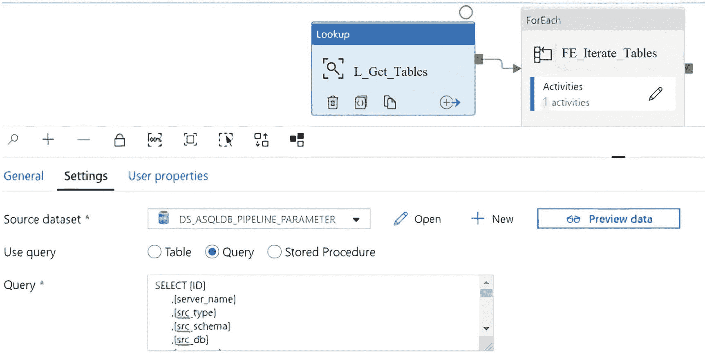
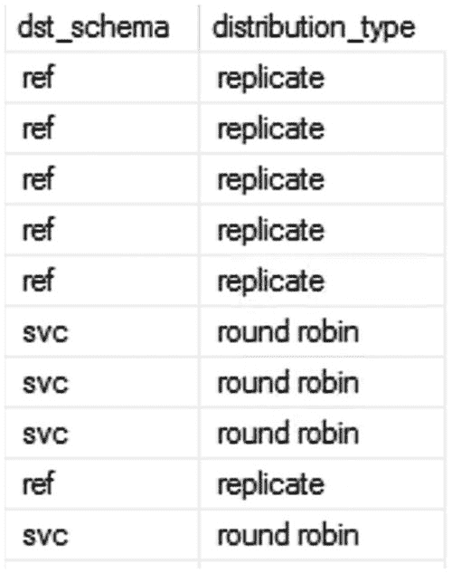
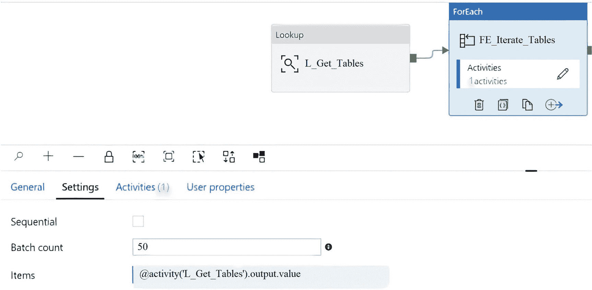
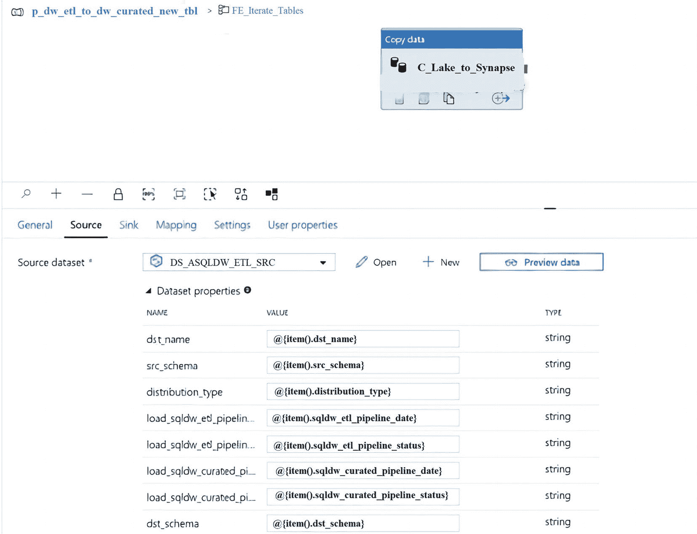
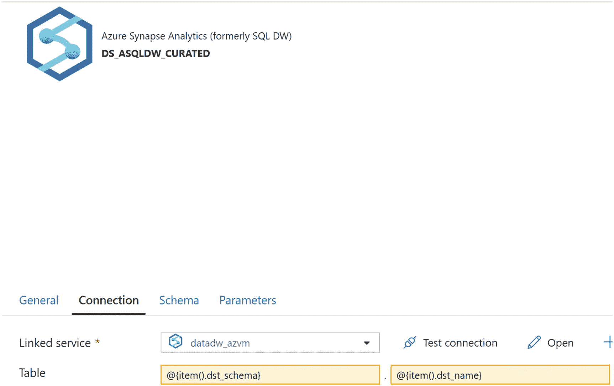
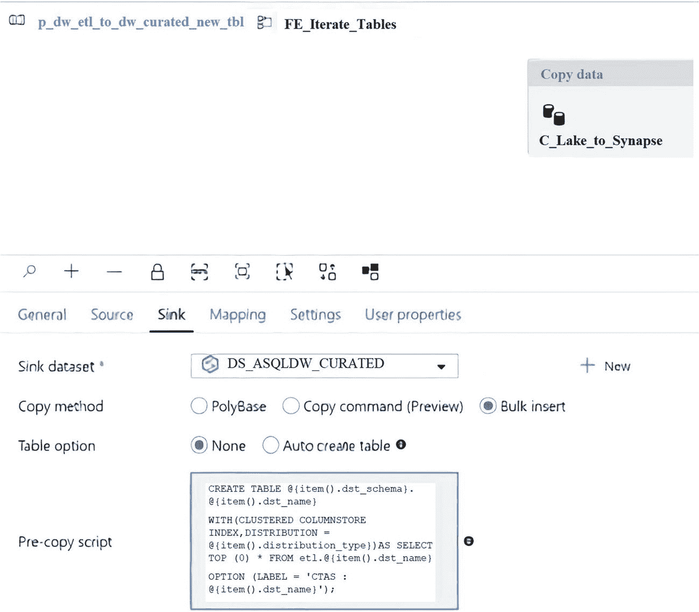
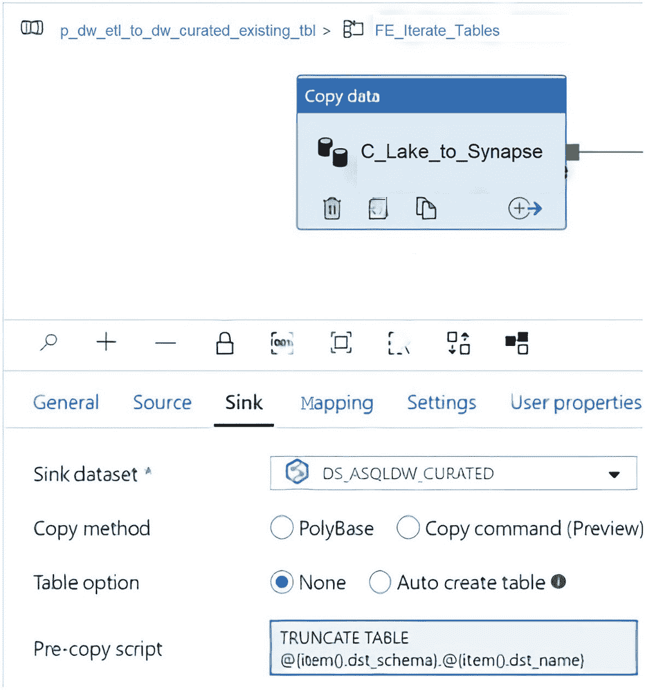
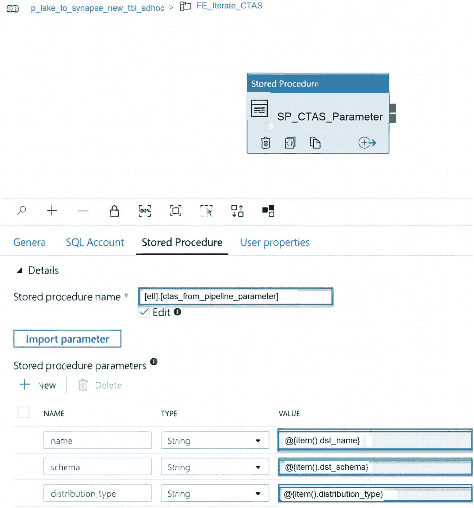

# 七、动态创建和加载 Synapse Analytics 专用 SQL 池表

在第六章中，您学习了如何使用数据工厂将数据湖文件加载到 Synapse Analytics 专用的 SQL 池中，方法是使用 COPY INTO 命令作为加载选项之一。现在，您已经设计并开发了一个动态流程，可以自动创建 ETL 模式表并将其加载到 Synapse Analytics 专用的 SQL 池中，该 SQL 池具有 snappy 压缩的 parquet 文件，让我们来探索创建表并将其加载到管理模式中的选项，您可以在运行时动态定义模式和分布类型，以创建管理模式表。请注意，在许多现代的基于云的数据架构模式中，暂存和监管更多地发生在数据湖中。然而，本章将展示通过使用几个简单的 ADF 管道将大量表持久化到数据仓库中的巨大能力。尽管 Delta Lake 有很多好处，我们将在第十五章中更详细地介绍，但是客户仍然有兴趣将他们最终的生产就绪的、可信的和精选的数据保存到 SQL 数据仓库中，原因有很多，包括易于分析查询、易于连接 Power BI 和其他报告工具等等。

在第四章中，我介绍了管道参数表的概念来跟踪和控制所有的 SQL Server 表、服务器、模式等等。本质上，这个管道参数表是为了驱动数据工厂编排过程而设置的。为了动态地定义分布类型和管理模式，我将在这个管道参数表中引入几个新列:`[distribution_type]`、`[dst_schema]`和`[dst_name]`。这些新列可以在数据工厂管道中使用，以便从 ETL 模式中动态创建和加载管理的表。

## 使用 ADF 复制前脚本动态创建和加载新表

将表从源数据湖存储帐户加载到 Synapse Analytics DW 表的 ADF 管道流程将从使用查询查找图 7-1 中所示的管道参数表开始，在查询中您可以适当地指定您的标志和过滤器。



图 7-1

显示从 pipeline_parameter 表中选择的查询的 ADF 查找设置

请注意，图 7-1 添加了源 SQL select 语句作为本练习的查询。作为最佳实践，我建议考虑将这个 SQL 语句转换为存储过程，然后通过将源查询设置为存储过程，通过 ADF 管道调用代码。这将允许在 ADF 环境之外更容易地维护代码。

一旦添加了 source lookup 查询，过滤器`pipeline_status = 'success'`就可以跟踪文件是否成功到达 lake，这是通过 SQL 存储过程完成的。此外，值得注意的是，这个管道参数中有相当多的列有助于跟踪整个端到端流程的步骤。出于本练习的目的，我们对列`[dst_schema]`、`[dst_schema]`和`[distribution_type]`感兴趣。

将以下代码添加到图 7-1 所示的 ADF 查找活动的源查询部分:

```
SELECT [id],
       [server_name],
       [src_type],
       [src_schema],
       [src_db],
       [src_name],
       [dst_type],
       [dst_name],
       [include_pipeline_flag],
       [partition_field],
       [process_type],
       [priority_lane],
       [pipeline_date],
       [pipeline_status],
       [load_synapse],
       [load_frequency],
       [dst_folder],
       [file_type],
       [lake_dst_folder],
       [spark_flag],
       [data_sources_id],
       [dst_schema],
       [distribution_type],
       [load_sqldw_etl_pipeline_date],
       [load_sqldw_etl_pipeline_status],
       [load_sqldw_curated_pipeline_date],
       [load_sqldw_curated_pipeline_status],
       [load_delta_pipeline_date],
       [load_delta_pipeline_status]
FROM   [dbo].[pipeline_parameter]
WHERE  load_synapse = 1
       AND pipeline_status = 'success'
       AND include_pipeline_flag = 1
       AND process_type = 'full'
       AND load_frequency = 'daily'

```

例如，`pipeline_ parameter`表中的`dst_schema`和`distribution_type`可能如下图 7-2 所示。



图 7-2

pipeline_parameter 表中的 dst_schema 和 distribution_type

当您继续进行图 7-3 所示的 ForEach 循环活动时，请确保正确填写设置选项卡中的项目字段，以获得查找活动的输出。



图 7-3

管道的 ADF ForEach 设置

下面是您需要添加到图 7-3 中 ForEach 循环活动的 Items 字段中的代码:

```
@activity('L_Get_Tables').output.value

```

深入 ForEach 活动。图 7-4 中显示了复制数据活动以及所需的数据集属性。



图 7-4

ADF 复制活动源设置和数据集属性

如图 7-4 所示的源数据集属性的名称和值如下:

<colgroup><col class="tcol1 align-left"> <col class="tcol2 align-left"></colgroup> 
| 

名字

 | 

价值

 |
| --- | --- |
| `dst_name` | `@{item().dst_name}` |
| `src_schema` | `@{item().src_schema}` |
| `distribution_type` | `@{item().distribution_type}` |
| `load_sqldw_etl_pipeline_date` | `@{item().load_sqldw_etl_pipeline_date}` |
| `load_sqldw_etl_pipeline_status` | `@{item().load_sqldw_etl_pipeline_status}` |
| `load_sqldw_curated_pipeline_date` | `@{item().load_sqldw_curated_pipeline_date}` |
| `load_sqldw_curated_pipeline_status` | `@{item().load_sqldw_curated_pipeline_status}` |
| `dst_schema` | `@{item().dst_schema}` |

为 Synapse Analytics 专用 SQL 池 ETL 模式配置源数据集连接，如图 7-5 所示。注意，etl 模式是硬编码的。但是，表名来自于`pipeline_parameter`表。


图 7-5

ADF 源数据集连接属性

以下是您需要在图 7-5 中的表格连接设置中输入的代码:

```
etl.@{item().dst_name}

```

图 7-6 中所示的汇数据集被定义为管理模式，其中您需要参数化目标模式和名称。请注意，源数据集包含源模式所需的参数。但是，接收器数据集不包含任何参数。



图 7-6

ADF 接收器数据集连接属性

以下是您需要输入图 7-6 中的表格连接设置的代码:

```
@{item().dst_schema}.@{item().dst_name}

```

创建数据集后，仔细看看拷贝前脚本。请注意，批量插入被用作复制方法，因为数据当前存在于 Synapse Analytics 专用 SQL 池中的 ETL 模式中，并且必须加载到管理的模式中。

如图 7-7 所示，还将表选项设置为“无”，因为表将使用以下预拷贝脚本创建，这基本上是一个动态的 Create Table as Select (CTAS)语法，它引用目标模式和名称以及来自`pipeline_parameter`表的分布类型，特别是图 7-2 所示的部分。此外，脚本中使用了 SELECT TOP (0 ),因为我们只想使用此步骤创建表，并使用 ADF Copy 活动加载它们。



图 7-7

ADF 复制数据接收器设置

以下是在图 7-7 中的接收器预拷贝脚本中使用的代码:

```
CREATE TABLE @{item().dst_schema}.@{item().dst_name}
WITH
    (
     CLUSTERED COLUMNSTORE INDEX,
     DISTRIBUTION = @{item().distribution_type}
    )
AS SELECT TOP (0) * FROM etl.@{item().dst_name}
OPTION (LABEL = 'CTAS : @{item().dst_name}');

```

请注意，图 7-7 中所示的预拷贝脚本只是一个示例，向您展示了可用于预拷贝脚本的功能范围。在这个场景中，我演示了如何在一个预拷贝 SQL 语句中添加使用元数据驱动的管道参数的动态字符串插值函数。最佳实践是，尽量避免将代码直接嵌入到 ADF 管道活动中，并且仅在产品功能存在明显限制时才考虑此类选项，这可能需要使用此类定制配置。

运行管道后，将在 Synapse Analytics 专用 SQL 池中使用适当的目标模式、名称和分布类型创建所有管理的表。

## 使用 ADF 预复制脚本动态截断和加载现有表

在您可能需要动态截断和加载现有表而不是重新创建表的场景中，通过简单地截断目标表来完成该任务，如图 7-8 所示。这种方法将是与之前管道的唯一显著变化。



图 7-8

ADF 复制数据接收器设置，预复制脚本更改为截断

以下是在图 7-8 中的接收器预拷贝脚本中使用的代码:

```
TRUNCATE TABLE @{item().dst_schema}.@{item().dst_name}

```

## 使用存储过程动态删除、创建和加载表

最后，让我们探索一个选项，使用 Synapse Analytics 专用 SQL 池中的存储过程来删除和创建管理的表。

管道设计将与之前的管道非常相似，从查找开始，然后流入 ForEach 循环活动，如图 7-9 所示。


图 7-9

包含查找和 ForEach 活动的 ADF 管道流

在 ForEach 循环活动中，有一个名为 CTAS 的存储过程活动，来自图 7-10 所示的管道参数。该存储过程是在 Synapse Analytics 专用 SQL 池中创建的，基于动态 Create Table as Select (CTAS)语句，我将在本节中进一步提供其代码。此外，目的地名称和模式已被定义为存储过程参数，其值来自管道参数表并被传递给存储过程，如图 7-10 所示。



图 7-10

ADF 存储过程详细信息和参数

它使用可以从`pipeline_parameter`表传递到存储过程的动态参数，该存储过程将由 ADF 管道调用。这里是在 ForEach 循环活动中调用的`[etl].[Ctas_from_pipeline_parameter]` ADF 存储过程中使用的源代码，如图 7-10 所示。

```
SET ansi_nulls ON

go

SET quoted_identifier ON

go

CREATE PROC [etl].[Ctas_from_pipeline_parameter] @schema            VARCHAR,
                                                 @name              VARCHAR,
                                                 @distribution_type VARCHAR
AS
  BEGIN
      DECLARE @table VARCHAR(255)
      DECLARE @table_stage VARCHAR(255)
      DECLARE @table_etl VARCHAR(255)
      DECLARE @sql VARCHAR(max)

      SET @table = @schema + '.' + @name
      SET @table_stage = @table + '_stage'
      SET @table_etl = 'etl.' + @name
      SET @sql = 'if object_id (''' + @table_stage
                 + ''',''U'') is not null drop table '
                 + @table_stage + '; CREATE TABLE ' + @table_stage
                 + ' WITH ( DISTRIBUTION = ' + @distribution_type
                 + ' ,CLUSTERED COLUMNSTORE INDEX ) AS SELECT  * FROM    ' + @table_etl + '; if object_id ('''
                 + @table
                 + ''',''U'') is not null drop table '
                 + @table + '; RENAME OBJECT ' + @table_stage + ' TO '
                 + @name + ';'

      EXEC(@sql)
  END

go

```

在转向 SSMS，然后编写存储过程脚本之后，请注意前面的脚本执行了以下操作

*   动态声明和设置`distribution_type`以及 ETL、管理和模式/表名

*   删除`curated_stage`表(如果存在)

*   将创建阶段表的 SQL 语法设置为从动态设置分布类型的 etl 表中选择所有数据

*   删除实际/原始管理的表

*   将`curated_stage`重命名为实际/原始策划表

在您可能希望重命名原始管理的表而不是删除原始管理的表的情况下，请在 ADF 管道内的存储过程活动中使用以下脚本:

```
SET ansi_nulls ON

go

SET quoted_identifier ON

go

CREATE PROC [etl].[Ctas_from_pipeline_parameter] @schema            VARCHAR,
                                                 @name              VARCHAR,
                                                 @distribution_type VARCHAR
AS
  BEGIN
      DECLARE @table VARCHAR(255)
      DECLARE @table_stage VARCHAR(255)
      DECLARE @table_drop VARCHAR(255)
      DECLARE @table_etl VARCHAR(255)
      DECLARE @schematable_drop VARCHAR(255)
      DECLARE @sql VARCHAR(max)

      SET @table = @schema + '.' + @name
      SET @table_stage = @table + '_stage'
      SET @table_drop = @name + '_drop'
      SET @table_etl = 'etl.' + @name
      SET @schematable_drop = @table + '_drop'
      SET @sql = 'if object_id (''' + @table_stage
                 + ''',''U'') is not null drop table '
                 + @table_stage + '; CREATE TABLE ' + @table_stage
                 + ' WITH ( DISTRIBUTION = ' + @distribution_type
                 + ' ,CLUSTERED COLUMNSTORE INDEX ) AS SELECT  * FROM    ' + @table_etl + '; if object_id ('''
                 + @table
                 + ''',''U'') is not null rename object '
                 + @table + ' TO ' + @table_drop + '; RENAME OBJECT '
                 + @table_stage + ' TO ' + @name + '; if object_id ('''
                 + @schematable_drop
                 + ''',''U'') is not null drop table '
                 + @schematable_drop + ';'

      EXEC(@sql)
  END

go

```

最后，需要注意的是，在 Synapse Analytics 专用 SQL 池中，如果您尝试删除或重命名一个表，而该表具有与已创建的实体化视图相关联的依赖项，则删除和重命名脚本可能会失败。

## 摘要

在本章中，我概述了如何通过在复制活动中使用 ADF 的预复制脚本来动态创建新表并将其加载到 Synapse Analytics 专用 SQL 池中的步骤。此外，我还介绍了如何使用 ADF 的预复制脚本动态截断和加载现有表，最后，我演示了如何使用存储在 Synapse Analytics 专用 SQL 池中的 SQL 存储过程动态删除、创建和加载 Synapse Analytics 专用 SQL 池表。

我在本章中演示的一些示例可能并不完全适用于您的特定场景或用例，但可能有助于进一步加深您对 ADF 功能的理解，以及如何构建和利用定制的动态 SQL 脚本和存储过程来适应可能无法通过 ADF 中的现成功能获得的特定用例。我希望这些例子对你有所帮助。在接下来的两章中，您将进一步了解如何通过构建自定义审计和错误日志记录流程，在 ADF 管道完成运行后，在 SQL 数据库表中捕获和保存与管道相关的指标，从而使您所了解和构建的这些 ADF 管道更加健壮。