# 十一、为数据仓库 ETL 映射数据流

Azure 众多数据服务的出现在数据仓库领域引发了兴奋和困惑，原因有几个。客户对现代基于云的数据仓库的概念感兴趣，但可能会被市场上过多的基于云的服务所淹没。他们想知道如何开始实施传统的数据仓库概念，例如维度建模、渐变维度(SCDs)、星型模式以及云中的数据仓库 ETL 或 ELT。SQL Server Integration Services(SSIS)等传统的内部 Microsoft 技术是成熟的数据集成工具，已经流行了十多年。随着越来越多的基于云的工具变得可用，客户有兴趣将他们的 ETL 迁移到云中，或者只是开始了解云中的数据仓库。

微软继续通过映射数据流来扩展他们在 Azure Data Factory 中的服务产品，这允许可视化和无代码的数据转换逻辑，该逻辑使用横向扩展的 Azure Databricks 集群作为 Azure Data Factory 管道的活动来执行。本质上，这一产品使 Azure Data Factory 更接近微软的传统 SQL Server Integration Services，后者已用于数据仓库 ETL 多年。映射数据流在数据仓库空间中对于几种数据仓库模式具有巨大的潜力，例如渐变维度类型 I 和类型 II 以及事实提取、转换和数据加载。

在这一章中，我将讨论典型的数据仓库负载模式，称为渐变维度类型 I，以展示如何使用 Azure Data Factory 的映射数据流来设计这种数据流模式的实际例子。

## 现代数据仓库

数据工厂在现代数据仓库环境中扮演着关键角色，因为它可以很好地集成结构化、非结构化和本地数据。最近，它开始与 Data Lake Storage Gen2 和 Azure Databricks 很好地集成。图 11-1 中的图表很好地描述了数据工厂在现代数据仓库中的位置。

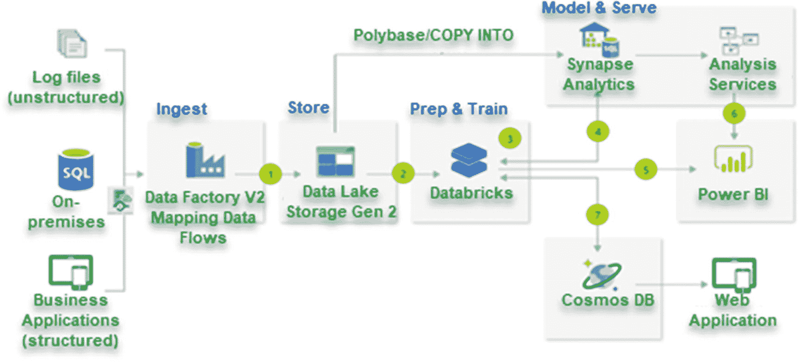

图 11-1

现代 Azure 数据平台数据流架构图

从图 11-1 中可以看出，数据工厂是源、目标和分析系统之间的关键集成者。此外，通过添加一个无代码的基于图形用户的界面，如映射数据流，利用引擎盖下的 Spark 集群，Data Factory 肯定会在现代数据仓库的设计和开发中发挥关键作用。

## 创建基础 Azure 数据资源

出于本章示例练习的目的，您将需要创建一个源 OLTP 数据库以及一个包含转换维度的目标 OLAP 数据库。在第四章中，我描述了如何免费获取样本数据，比如`AdventureWorksLT`表和数据，然后可以加载到 Azure SQL 数据库中。这个练习将利用与`OLTP_Source`相同的`AdventureWorksLT`数据库。一旦在 Azure 中创建了数据库，请注意图 11-2 中包含了您将在本练习中使用的`SalesLT.Customer`表。

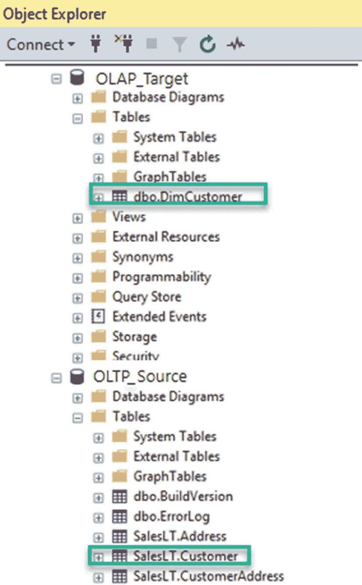

图 11-2

源 OLTP 和目标 OLAP 数据库

在`OLAP_Target`数据库中创建下面的`DimCustomer`表。`DimCustomer`的模式如下:

```
CREATE TABLE dbo.dimcustomer
  (
     [customerid]   INT NOT NULL,
     [title]        NVARCHAR (8) NULL,
     [firstname]    [dbo].[NAME] NOT NULL,
     [middlename]   [dbo].[NAME] NULL,
     [lastname]     [dbo].[NAME] NOT NULL,
     [suffix]       NVARCHAR (10) NULL,
     [companyname]  NVARCHAR (128) NULL,
     [salesperson]  NVARCHAR (256) NULL,
     [emailaddress] NVARCHAR (50) NULL,
     [inserteddate] DATETIME NULL,
     [updateddate]  DATETIME NULL,
     [hashkey]      NVARCHAR (128) NOT NULL,
     PRIMARY KEY (customerid)
  );

```

一旦创建了表，通过导航到 Azure Portal 中的资源组并确认数据工厂、逻辑 SQL Server、源数据库和目标数据库都已创建，验证所有必要的资源都已创建，如图 11-3 所示。


图 11-3

Azure 门户资源

## 缓变尺寸 I 型

渐变维度是维度数据仓库常用的高级技术，用于捕获维度内随时间变化的数据。本章中的练习将利用数据工厂管道中缓慢变化的维度类型 I。

虽然有许多类型的渐变维度，但我将在本章中介绍的类型 I 只是用新值覆盖现有的数据值。这种方法的优点是，它使维度的更新变得容易，并将增长限制在新记录上。缺点是会丢失历史数据，因为维度总是只包含每个属性的当前值。

## 创建数据工厂管道和数据集

通过单击“Author & Monitor”启动数据工厂控制台，开始为渐变维度类型 I ETL 模式创建 ADF 管道，如图 11-4 所示。


图 11-4

通过单击“作者和监视器”启动 Azure 数据工厂

接下来，点击“创建管道”创建一个新的管道，如图 11-5 所示。

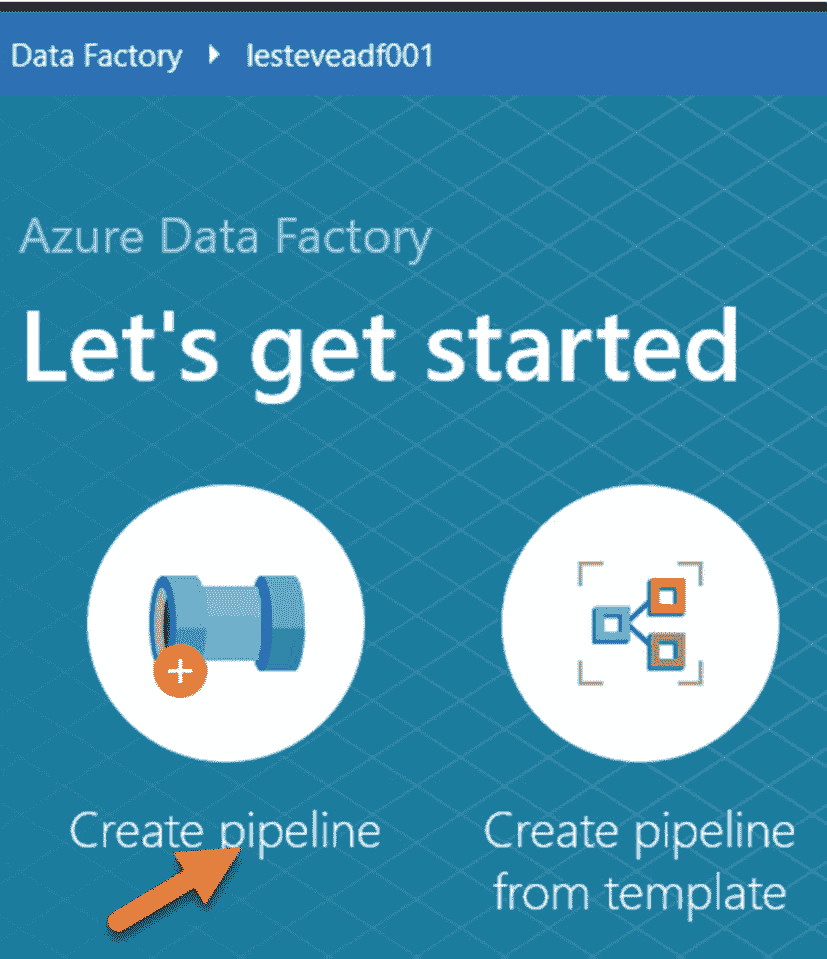

图 11-5

创建新的 ADF 管道

将新管道命名为 DW ETL，它将包含以下两个数据集:

*   **AzureSqlCustomerTable****:**这是包含`AdventureWorksLT`表的 OLTP Azure SQL 源数据库。具体来说，使用`Customer`表进行 ETL。

*   **AzureSqlDimCustomerTable****:**这是包含维度 Customer 表的 OLAP Azure SQL 目标数据库。这个维度表与 OLTP 源表的不同之处在于，它包含更少的字段，并且包含一个`InsertedDate`、`UpdatedDate`和`HashKey`，您将把它们用于 SCD Type I ETL 模式。

创建管道和数据集后，工厂资源部分将被填充，如图 11-6 所示。


图 11-6

ADF 管道和数据集

## 创建数据工厂映射数据流

现在，您已经为源和目标创建了 ADF 管道和数据集，您已经准备好使用 SCD Type I 创建您的数据流。首先，将数据流从 Activities 拖到 Data Factory 画布上，如图 11-7 所示。

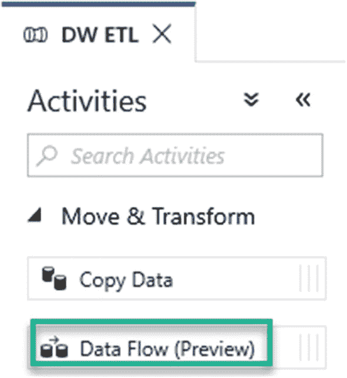

图 11-7

ADF 数据流活动

然后给你的数据流一个直观的名字。此时为`DimCustomer`，如图 11-8 所示。

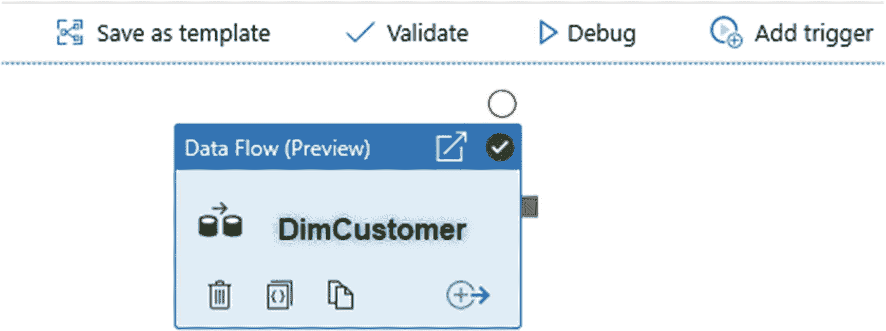

图 11-8

DimCustomer 的 ADF 数据流活动

创建数据流之前，请确保打开数据流调试模式( [`https://docs.microsoft.com/en-us/azure/data-factory/concepts-data-flow-debug-mode`](https://docs.microsoft.com/en-us/azure/data-factory/concepts-data-flow-debug-mode) `)`)，因为您将在将管道部署到生产环境之前对其进行测试。图 11-9 显示了数据流调试模式，这对于测试是足够的。当您切换到调试模式时，系统会询问您是否希望继续。单击“确定”继续。

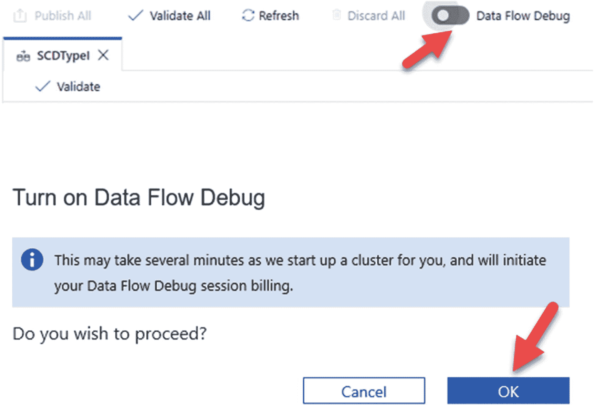

图 11-9

ADF 数据流调试模式

图 11-10 显示集群需要几分钟的时间准备好，准确地说通常需要 5 到 7 分钟。

ADF 在 Azure integration runtime 中为数据流生存时间(TTL)引入了一个新的“快速重用”特性。启用 TTL 后，ADF 可以在管道中执行最后一个数据流后的一段时间内维护 Spark 集群，这将在数据流活动中使用相同的 Azure IR 提供更快的连续执行。


图 11-10

ADF 数据流调试模式群集正在准备就绪

一旦打开数据流调试模式，图 11-11 所示的绿点将出现在它的右侧，以确认它已准备好开始调试模式流水线运行。此时，您可以开始创建渐变维度类型 I 数据流。


图 11-11

ADF 数据流调试模式群集准备就绪

如图 11-12 所示，通过添加和配置两个数据集作为源开始数据流。

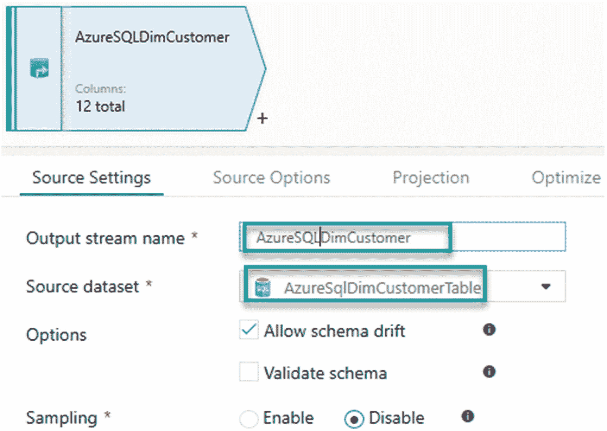

图 11-12

ADF 映射数据流源设置

点击`AzureSqlCustomerTable`旁边图 11-13 所示的+图标，添加一个派生列，称为`CreateHash`。

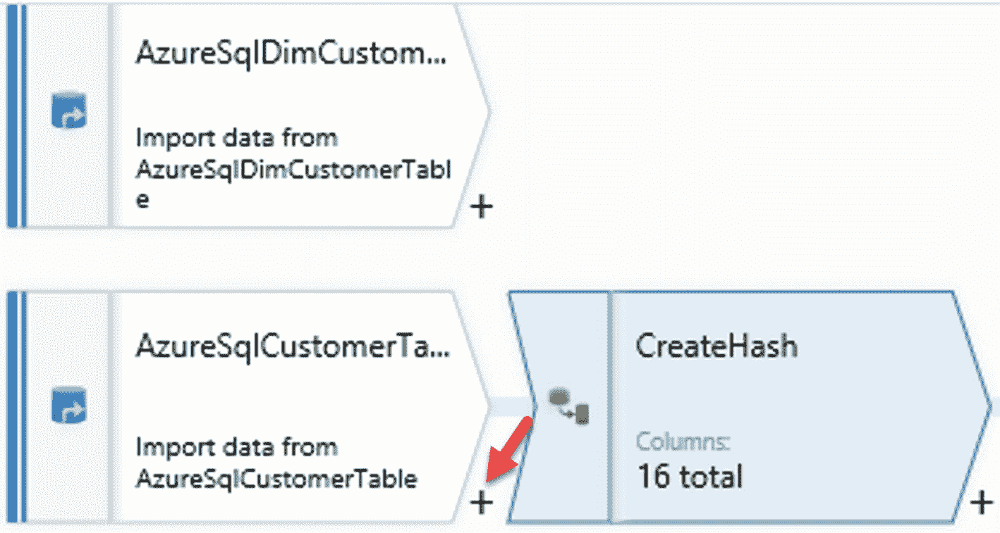

图 11-13

ADF 映射数据流派生列

然后选择散列列并使用散列函数。对于这个场景，派生列将使用以下函数，如图 11-14 所示:


图 11-14

ADF 映射数据流派生列设置

```
sha1(FirstName+LastName+CompanyName)

```

然后将以下输入、模式和行修饰符添加到数据流中，如图 11-15 所示。


图 11-15

DimCustomer 中 SCD 类型 1 的 ADF 映射数据流活动

以下小节描述了图 11-15 中的每个步骤。

### 存在

Exists 步骤将通过比较新创建的源哈希键和图 11-16 所示的目标哈希键来检查哈希键是否已经存在。

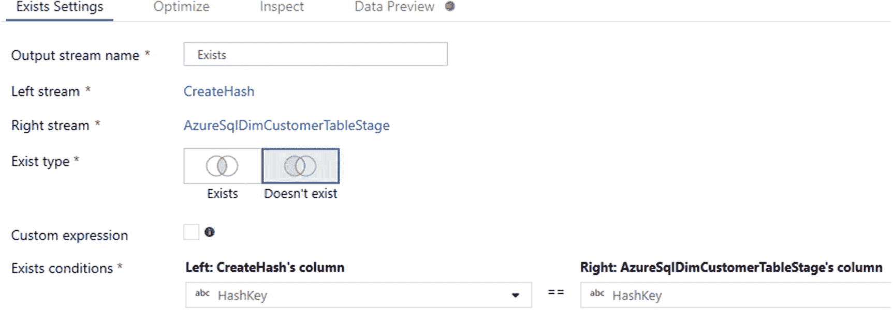

图 11-16

ADF 映射数据流存在设置

### 外观更新

然后`LookupDates`步骤将连接从源到目标的`CustomerID`以确保包含相关的记录，如图 11-17 所示。


图 11-17

ADF 映射数据流查找设置

### SetAttributes

`SetAttributes`步骤将添加两个派生列。如果为空，`InsertedDate`将插入当前时间戳，`UpdatedDate`将总是用当前时间戳更新该行，如图 11-18 所示。


图 11-18

ADF 映射数据流派生列的设置

以下是图 11-18 中`InsertedDate`和`UpdatedDate`的列字段中使用的代码:

```
iif(isNull(InsertedDate),currentTimestamp(),{InsertedDate})

currentTimestamp()

```

### 交替行

AlterRows 允许 upserts，条件设置为`true()`，这将更新或插入通过流的所有内容，如图 11-19 所示。


图 11-19

ADF 映射数据流改变行设置

### sink1

最后，接收步骤将写回图 11-20 所示的`DimCustomer`表。

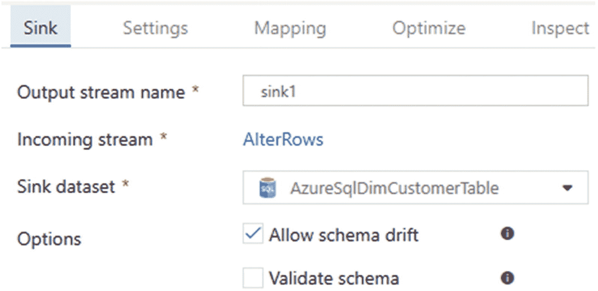

图 11-20

ADF 映射数据流接收器设置

在图 11-21 所示的设置选项卡中，确保选中“允许上插”，并将`CustomerID`指定为关键栏。

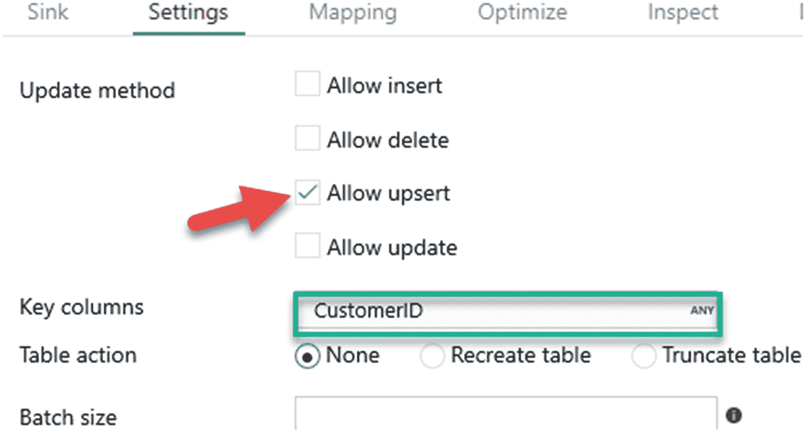

图 11-21

ADF 映射数据流接收器更新方法“允许向上插入”

最后，确保映射是准确的。可能需要禁用“自动映射”，如图 11-22 所示，以正确映射新创建的派生列。

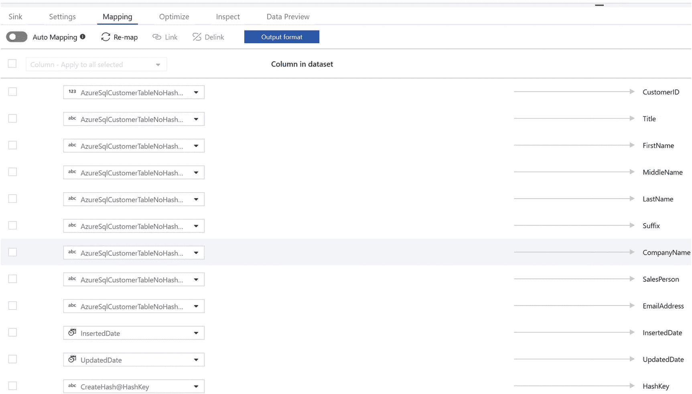

图 11-22

ADF 映射数据流接收器映射

一旦完成渐变维度类型 I 数据流，它将如图 11-23 所示。


图 11-23

在 DimCustomer MDF 管道中，ADF 映射数据流已完成 SCD 类型 1

为`DimCustomer`设计和配置 SCD 类型 I 数据流的过程现在已经完成。由于调试模式已经打开，只需在管道视图中点击图 11-24 中的“调试”并等待管道完成运行。


图 11-24

ADF 映射数据流管道在调试模式下运行

一旦管道完成运行，请注意管道成功状态右侧的绿色检查圈。由于`DimCustomer`表中没有数据，所以这次管道运行将所有记录加载到`DimCustomer`表中，如图 11-25 所示。

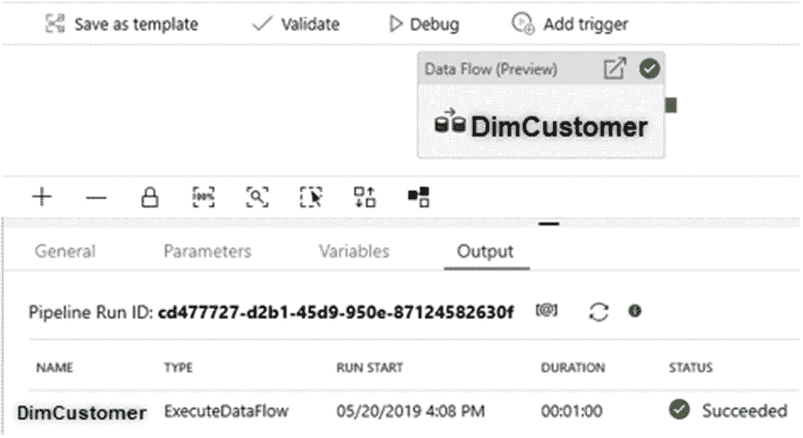

图 11-25

ADF 映射数据流调试模式管道成功输出

## 更新记录

为了测试管道的功能，从 OLTP 系统中选择一条记录，如图 11-26 所示。它可以是任何记录，为了举例，我们假设您选择了艾伦·布鲁尔的记录。

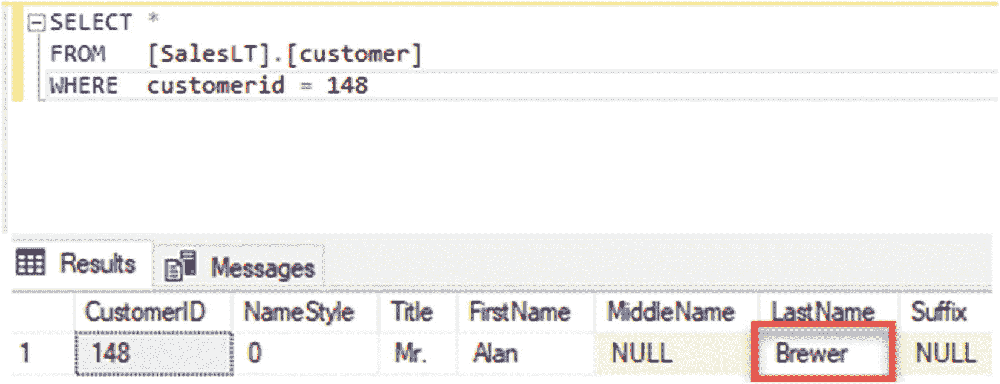

图 11-26

从 OLTP 源客户表中选择一条记录

以下是已经在图 11-26 中执行的 SQL 代码:

```
SELECT *
FROM   [SalesLT].[customer]
WHERE  customerid = 148

```

然后从 Brewer 更新`CustomerID` 148 的`LastName`，更新如图 11-27 所示。

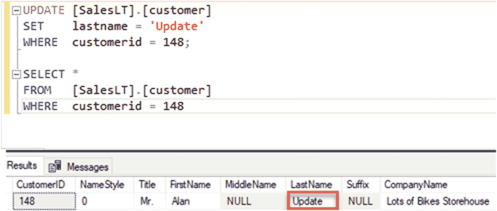

图 11-27

更新 OLTP 源客户表中的记录

以下是已经在图 11-27 中执行的 SQL 代码:

```
UPDATE [SalesLT].[customer]
SET    lastname = 'Update'
WHERE  customerid = 148;

SELECT *
FROM   [SalesLT].[customer]
WHERE  customerid = 148

```

在重新运行 ADF 管道之前，在`DimCustomer`表上运行 select *查询，注意到`LastName`仍然是“Brewer”，如图 11-28 所示。

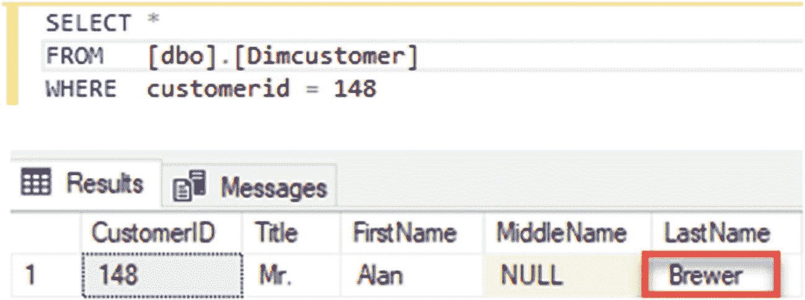

图 11-28

从 OLAP DimCustomer 表中选择记录

以下是已经在图 11-28 中执行的 SQL 代码:

```
SELECT *
FROM   [dbo].[Dimcustomer]
WHERE  CustomerId = 148

```

重新运行 ADF 管道后，请注意图 11-29 中的`LastName`已被适当更新，这确认了 ADF 管道考虑了更新。


图 11-29

更新 OLAP DimCustomer 表中的记录

以下是已经在图 11-29 中执行的 SQL 代码:

```
SELECT *
FROM   [dbo].[DimCustomer]

```

## 插入记录

还要测试向 OLTP 系统中插入一条新记录，然后重新运行 ADF 管道，查看插入是否被拾取。为此，请执行以下示例中的 USE 和 INSERT 语句。执行以下查询，将新记录插入到`[SalesLT].[Customer]`表中:

```
USE [OLTP_Source]

go

INSERT INTO [SalesLT].[customer]
            ([namestyle],
             [title],
             [firstname],
             [middlename],
             [lastname],
             [suffix],
             [companyname],
             [salesperson],
             [emailaddress],
             [phone],
             [passwordhash],
             [passwordsalt],
             [rowguid],
             [modifieddate])
VALUES      (1,
             'Mr.',
             'John',
             'B',
             'Doe',
             NULL,
             'MSSQLTips',
             NULL,
             NULL,
             NULL,
             'L/Rlwxzp4w7RWmEgXX+/A7cXaePEPcp+KwQhl2fJL7d=',
             '1KjXYs4=',
             '2005-08-01 00:00:00:000')

go

```

然后检查以确保您看到如图 11-30 所示的结果。您应该会看到刚刚插入的记录。


图 11-30

在 OLTP 客户表中选择插入的记录

以下是已经在图 11-30 中执行的 SQL 代码:

```
SELECT *
FROM   [SalesLT].[customer]
WHERE  companyname = 'MSSQLTips'

```

在您重新运行 ADF 管道之后，请注意图 11-31 中新的 OLTP 记录也被插入到`[dbo].[DimCustomer]`表中，这确认了 ADF 管道考虑了插入。


图 11-31

选择 OLAP DimCustomer 表中的插入记录

以下是已经在图 11-31 中执行的 SQL 代码:

```
SELECT *
FROM   [dbo].[dimcustomer]
WHERE  companyname = 'MSSQLTips'

```

完成后，请记住关闭“数据流调试”模式，以防止数据工厂中未使用的功能产生不必要的成本。另外，记得根据需要清理并删除资源组中任何未使用的资源，如图 11-32 所示。

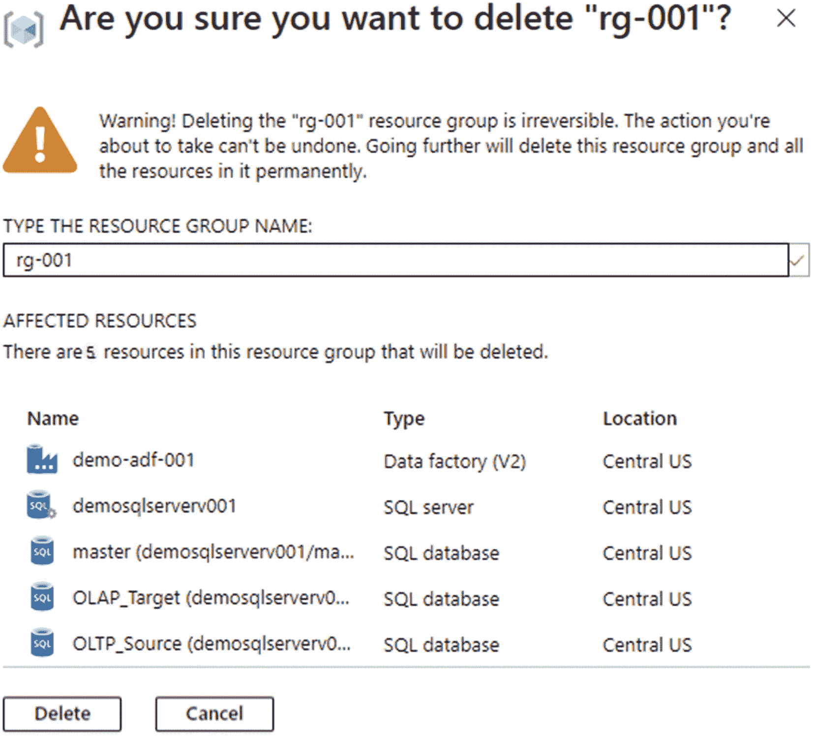

图 11-32

根据需要删除未使用的资源和/或资源组

## 摘要

在这一章中，我讨论了现代数据仓库以及 Azure Data Factory 的映射数据流及其在这一领域中的作用。您了解了如何设置源、目标和数据工厂资源，以便为使用映射数据流设计渐变维度类型 I ETL 模式做准备。此外，您还学习了如何在 Azure Data Factory 中设计和测试缓慢变化的 Dimension Type I 数据流和管道。

有几种不同类型的[缓变尺寸](https://en.wikipedia.org/wiki/Slowly_changing_dimension)可用于不同的目的。微软的 Azure Data Factory 提供了很多方法让[快速上手使用 Data Factory](https://azure.microsoft.com/en-us/blog/get-started-quickly-using-templates-in-azure-data-factory/) 中的模板，还有为渐变维度类型 II、数据清理等添加的模板。记住要理解 Ralph Kimball 的[](https://www.kimballgroup.com/data-warehouse-business-intelligence-resources/books/data-warehouse-dw-toolkit/)*[*数据仓库*](https://www.kimballgroup.com/data-warehouse-business-intelligence-resources/books/data-warehouse-dw-toolkit/) [*工具包*](https://www.kimballgroup.com/data-warehouse-business-intelligence-resources/books/data-warehouse-dw-toolkit/) 作为维度建模的权威指南，这将有助于更深入地理解设计数据仓库的基本要素。*