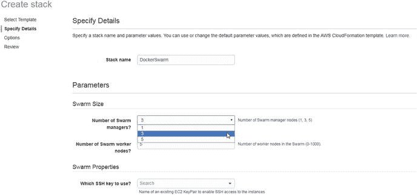
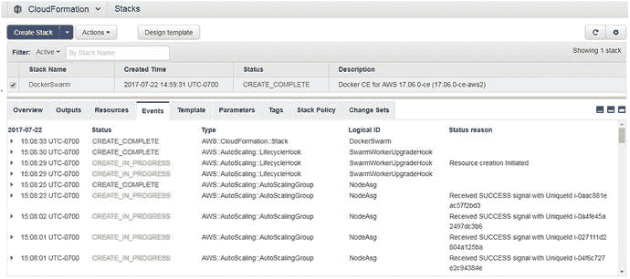
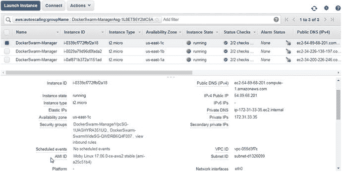
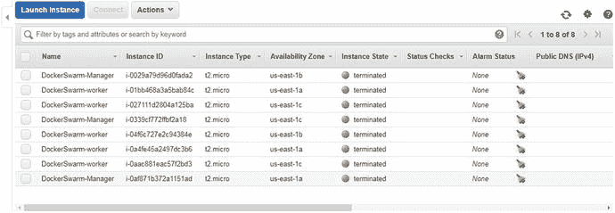

# 三、使用 Docker for AWS 创建多区域 Swarm

Docker 群组是通过首先启动群组来创建管理器节点，然后将工作者节点加入到该管理器节点来提供的。Docker Swarm 为 Docker 应用提供分布式服务部署。

## 问题

默认情况下，Docker 群组被配置在 AWS 上的单个区域中，如图 3-1 所示。如果管理节点和所有工作节点都在同一个 AWS 区域中，则该区域的故障将导致该区域不可用。单区域群不是高可用性群，并且没有容错能力。


图 3-1。

A single-zone Swarm

## 解决方案

Docker 和 AWS 合作创建了 Docker for AWS 部署平台，在 AWS 的多个区域提供 Docker 群。Docker for AWS 不需要用户在命令行上运行任何命令，并且是基于图形用户界面(GUI)的。对于多个区域中的管理者和工作者节点，单个 AWS 区域的故障不会使群不可用，如图 3-2 所示。Docker for AWS 为蜂群提供了容错能力。


图 3-2。

A Multi-zone Swarm

Docker for AWS 是 Docker Swarm 在 AWS 云平台上的托管服务。除了多个区域之外，Docker for AWS 还有其他一些优势:

*   所有必需的基础架构都是自动配置的。
*   自动升级到新的软件版本，无需中断服务。
*   为 Docker 优化的定制 Linux 发行版。定制 Linux 发行版在 AWS 上不单独提供，它使用重叠 2 存储驱动程序。
*   未使用的 Docker 资源会被自动删除。
*   用于管理节点的自动扩展组。
*   主机本机日志循环，以避免冗长的日志消耗所有磁盘空间。
*   使用 AWS CloudWatch 进行集中日志记录。
*   基于 docker-diagnose 脚本的错误报告工具。

有两个版本的 Docker for Swarm 可用:

*   适用于 AWS 的 Docker 企业版(EE)
*   面向 AWS 的 Docker 社区版(CE)

我们在本章中使用 Docker Community Edition(CE)for AWS 来创建一个多区域 Swarm。本章包括以下主题:

*   设置环境
*   为 Docker Swarm 创建 AWS CloudFormation 栈
*   连接群管理器
*   利用蜂群
*   删除蜂群

## 设置环境

Docker for AWS 提供了两个部署选项。

*   使用预先存在的 VPC
*   使用 Docker 创建的新 VPC

让 Docker 创建 VPC、子网和网关是更简单的选择，也是本章使用的方法。

如果您在 [`https://aws.amazon.com/resources/create-account/`](https://aws.amazon.com/resources/create-account/) 还没有 AWS 帐户，请创建一个。AWS 帐户必须支持 EC2-VPC。尽管 AWS 服务(如 VPC)是自动创建的，但该帐户必须拥有创建 EC2 实例的权限，包括自动伸缩组、IAM 配置文件、DynamoDB 表、SQS 队列、VPC(包括子网、网关和安全组)、弹性负载均衡器和 CloudWatch 日志组。除了创建具有所需权限的帐户之外，唯一的用户输入是在 Docker Swarm 的 AWS 区域中创建一个 SSH 密钥对。

选择 EC2 AWS 服务，并单击 EC2 仪表板中的密钥对链接。单击创建密钥对以创建和下载密钥对。在创建密钥对对话框中指定一个密钥对名称(例如`docker`),然后点击创建。密钥对被创建，如图 3-3 所示。将密钥对文件(`docker.pem`)复制到本地 Linux 机器上。


图 3-3。

A key pair

将`docker.pem`上的权限设置为`400`，这将只提供读取权限，并删除所有其他权限。

```
chmod 400 docker.pem

```

## 为 Docker Swarm 创建 AWS CloudFormation 栈

在网页浏览器中导航到 [`https://docs.docker.com/docker-for-aws/`](https://docs.docker.com/docker-for-aws/) ，点击【AWS 部署 Docker】选项，如图 3-4 所示。标签可以不同，例如为 AWS [stable]部署 Docker 社区版[CE]。


图 3-4。

Deploy Docker for AWS

Create Stack 向导开始提供设计新模板或为 AWS 上的 Docker 选择默认 CloudFormation 模板。选择指定亚马逊 S3 模板 URL 选项，为其预先指定一个 URL，如图 3-5 所示。点击下一步。


图 3-5。

Selecting a template

在指定详细信息中，指定栈名称(`DockerSwarm`)。群组参数部分包含表 3-1 中列出的字段。

表 3-1。

Swarm Parameters

<colgroup><col> <col></colgroup> 
| 参数 | 描述 |
| --- | --- |
| 群体管理者的数量？ | 群管理器节点的数量。有效值为 1、3 和 5。 |
| 群体工作者节点的数量？ | 群中工作节点的数量(0-1000)。 |

群管理器数量保持默认设置 3，群工作器节点数量保持默认设置 5，如图 3-6 所示。



图 3-6。

Specifying a stack name

接下来，指定群体属性，如表 3-2 中所讨论的。

表 3-2。

Swarm Properties

<colgroup><col> <col> <col></colgroup> 
| 群体属性 | 描述 | 值集 |
| --- | --- | --- |
| 使用哪个 SSH 密钥？ | 允许对实例进行 SSH 访问的现有 EC2 密钥对的名称。 | `docker` |
| 启用每日资源清理？ | 清理未使用的映像、容器、网络和卷。 | `no` |
| 使用 CloudWatch 进行容器日志记录？ | 将所有容器日志发送到 CloudWatch。 | `yes` |

在使用哪个 SSH 密钥？属性，选择`docker` SSH 键。蜂群属性如图 3-7 所示。


图 3-7。

Swarm properties

指定群组管理器属性，如表 3-3 中所述。

表 3-3。

Swarm Manager Properties

<colgroup><col> <col> <col></colgroup> 
| 群体属性 | 描述 | 值集 |
| --- | --- | --- |
| Swarm manager 实例类型？ | EC2 HVM 实例类型(t2.micro、m3.medium 等。) | `t2.micro` |
| 管理临时存储卷大小？ | 管理中心的临时存储卷的大小(GB) | `20` |
| 管理临时存储卷类型？ | 管理器卷类型 | `standard` |

群组管理器属性如图 3-8 所示。指定蜂群工作属性，如表 3-4 所述。

表 3-4。

Swarm Worker Properties

<colgroup><col> <col> <col></colgroup> 
| 群体工人财产 | 描述 | 值集 |
| --- | --- | --- |
| 代理工作实例类型？ | EC2 HVM 实例类型(t2.micro、m3.medium 等。) | `t2.micro` |
| 工作人员临时存储卷大小？ | worker 的临时存储卷的大小(GB) | `20` |
| Worker 临时存储卷类型？ | 工人数量类型 | `standard` |


图 3-8。

Swarm worker properties

群体工作者属性如图 3-8 所示。点击下一步。

接下来，指定栈的选项。可以为栈中的资源指定标签(键值对)。对于权限，可以选择云形成的 IAM 角色。这些选项都不需要设置，如图 3-9 所示。


图 3-9。

Optional settings

对于高级选项，通知选项设置为无通知。将故障回退设置为是，如图 3-10 所示。点击下一步。


图 3-10。

Setting rollback on failure

查看栈设置，如图 3-11 所示。


图 3-11。

Reviewing the stack settings

选择确认复选框，然后点击创建，如图 3-12 所示。


图 3-12。

Creating the stack

开始创建新的栈。点击刷新按钮刷新列表中的栈，如图 3-13 所示。


图 3-13。

Refresh

如图 3-14 所示的状态`CREATE_IN_PROGRESS`所示，基于 Docker Swarm 的云形成模板的新栈开始创建。


图 3-14。

CloudFormation stack status

为不同的栈详细信息提供了不同的选项卡。资源页签显示了 CloudFormation 模板创建的 AWS 资源，如图 3-15 所示。


图 3-15。

CloudFormation stack resources

事件选项卡显示了创建云形成栈时发生的事件，如图 3-16 所示。


图 3-16。

CloudFormation stack events

栈创建完成后，状态显示为`CREATE_COMPLETE`，如图 3-17 所示。



图 3-17。

Stack status is CREATE_COMPLETE

所有需要的资源——包括自动扩展组、EC2 互联网网关、EC2 安全组、弹性负载均衡器、IAM 策略、日志组和 VPC 网关——都已创建，如图 3-18 所示。


图 3-18。

Resources are created

输出选项卡列出了默认 DNS 目标、关于可用区域数量的区域可用性注释以及管理器节点，如图 3-19 所示。


图 3-19。

Outputs

要列出群管理器的 EC2 实例，点击管理器中的链接，如图 3-20 所示。


图 3-20。

The Managers link

这三个管理器实例都位于不同的可用性区域。每个 EC2 实例的公共/私有 IP 地址和公共 DNS 名称可以从 EC2 控制台获得，如图 3-21 所示。


图 3-21。

Manager instances on EC2

使用 AMI ID 可以找到用于 EC2 实例的 AMI，如图 3-22 所示。一个莫比 Linux AMI 用于这个群，但是 AMI 对于不同的用户和在不同的 AWS 区域可能是不同的。



图 3-22。

Moby Linux AMI

通过将实例状态设置为 Running，可以列出所有 EC2 实例。列出了 Docker Swarm manager 节点(三个)和 worker 节点(五个)，如图 3-23 所示。管理节点和工作节点位于三个不同的可用性区域。


图 3-23。

Swarm managers and workers in three different availability zones

在 EC2 仪表板中选择负载均衡器，将会列出提供的弹性负载均衡器，如图 3-24 所示。单击“实例”选项卡列出实例。所有实例的状态都应该设置为正在使用，如图 3-24 所示。


图 3-24。

Elastic Load Balancer

从 EC2 仪表板中选择启动配置。将列出两个启动配置—一个用于管理器节点，一个用于工作者节点，如图 3-25 所示。


图 3-25。

Launch configurations

在 EC2 仪表板中选择自动缩放组。将列出两个自动缩放组—一个用于管理器节点，一个用于工作者节点，如图 3-26 所示。


图 3-26。

Auto-scaling groups

## 连接群管理器

接下来，从复制了密钥对`docker.pem`的本地机器连接到 Swarm manager 节点。使用 manager EC2 实例的公共 IP 地址，SSH 以用户“docker”的身份登录实例。

```
ssh -i "docker.pem" docker@54.89.68.201

```

将显示管理器节点的命令提示符。

```
[root@localhost ∼]# ssh -i "docker.pem" docker@54.89.68.201
Welcome to Docker!

```

群组节点的 Docker 版本可以使用`docker --version`列出。版本将是 17.06 或更高。Docker 1.12 或更高版本支持群组模式。

```
∼ $ docker --version
Docker version 17.06.0-ce, build 02c1d87

```

## 利用蜂群

用`docker node ls`列出群节点，将列出三个管理节点和五个工作节点。

```
∼ $ docker node ls
ID HOSTNAME STATUS AVAILABILITY MANAGER STATUS
255llm8729rns82bmloaxs6usl ip-172-31-8-37.ec2.internal Ready Active
ikyskl4ysocymoe4pbrj3qnh3 ip-172-31-4-154.ec2.înternal Ready Active Reachable
p2ky6meej8tnph5wyuw59xtmr ip-172-31-21-30.ec2.internal Ready Active Leader
r56kkltfgc4zzzfbslinrun2d1 ip-172-31-24-185.ec2.internal Ready Active
soggz5qplcihk8y2y58uj9md4 ip-172-31-1-33.ec2.internal Ready Active
xbdeo8qp9jhi398h478wl2zrv * ip-172-31-33-35.ec2.internal Ready Active Reachable
ykk4odpjps6t6eqc9mriqvo4a ip-172-31-47-162.ec2.internal Ready Active
zrlrmijyj5vklxl3ag7gayb3w ip-172-31-39-210.ec2.internal Ready Active

```

列出了由管理者状态`Leader`和`Reachable`指示的领导者节点和另外两个管理者节点。工作节点都是可用的，如可用性列中的`Active`所示。

Docker 服务将在下一章介绍，但是您可以运行下面的`docker service create`命令为 MySQL 数据库创建一个 Docker 服务示例。

```
docker service create \
  --env MYSQL_ROOT_PASSWORD='mysql'\
  --replicas 1 \
  --name mysql \
  --update-delay 10s \
 --update-parallelism 1  \
 mysql

```

服务被创建:

```
∼ $ docker service create \
>   --env MYSQL_ROOT_PASSWORD='mysql'\
>   --replicas 1 \
>   --name mysql \
>   --update-delay 10s \
>  --update-parallelism 1  \
>  mysql
12hg71a3vy793quv14uems5gk

```

使用`docker service ls`命令列出服务，这也将在下一章中讨论，并且列出了服务 ID、模式、副本和映像。

```
∼S docker service ls
ID NAME MODE REPLICAS IMAGE
n2tomumtl9sbniysql replicated 1/1 mysql:latest

```

使用`docker service scale`命令将服务扩展到三个副本。三个副本被调度—一个在 leader manager 节点上，两个在 worker 节点上。列出服务副本的`docker service ps`命令也将在下一章详细讨论。

```
∼ S docker service scale mysql=3
mysql scaled to 3
∼ S docker service  ps mysql
ID NAME IMAGE NODE DESIRED STATE CURRENT STATE ERROR PORTS
slqtuf9l4hxo mysq1.1 mysql:latest ip-172-31-35-3.us-east-2.compute.internal
Running Running about a minute ago
exqsthrgszzc mysql.2 mysql:latest ip-172-31-27-83.us-east-2.compute.internal
Running Preparing 8 seconds ago
vtuhsl6mya85 mysql.3 mysql:1atest ip-172-31-29-199.us-east-2.compute.internal Running Preparing 8 seconds ago

```

## 删除蜂群

要删除一个蜂群，从云编队控制台选择操作➤删除栈，如图 3-27 所示。


图 3-27。

Choosing Actions ➤ Delete Stack

在删除栈确认对话框中，点击是，删除，如图 3-28 所示。


图 3-28。

Delete stack confirmation dialog

栈状态变为`DELETE_IN_PROGRESS`，如图 3-29 所示。


图 3-29。

Delete in progress

随着每个栈的资源被删除，其状态变为`DELETE_COMPLETE`，如图 3-30 中事件选项卡上的一些资源所示。


图 3-30。

Events list some of the resources with a status of DELETE_COMPLETE

当 EC2 实例被删除后，EC2 控制台将其状态列为`terminated`，如图 3-31 所示。



图 3-31。

EC2 instances with status set to terminated

## 摘要

本章讨论了使用 Docker for AWS 服务创建由 CloudFormation 模板提供的多区域 Docker 群。您学习了如何连接到群管理器来运行`docker service`命令。下一章介绍 Docker 服务。