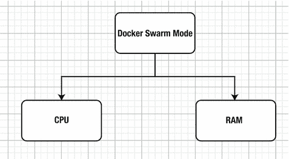
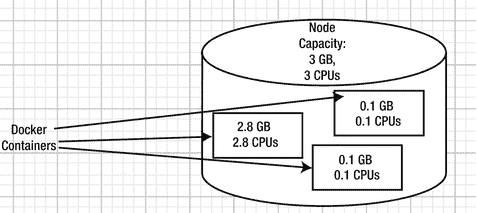
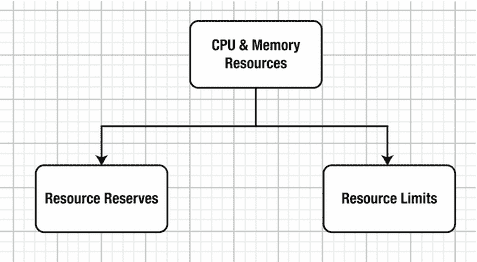
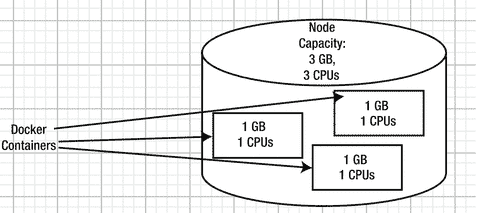
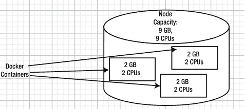
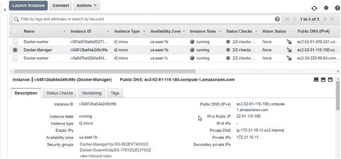
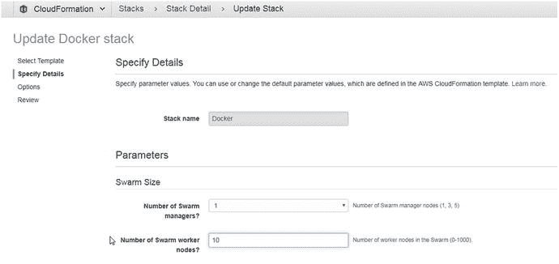
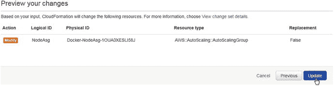

# 七、配置资源

Docker 容器在底层操作系统内核上独立运行，运行时需要资源。Docker Swarm 模式支持两种类型的资源——CPU 和内存——如图 7-1 所示。



图 7-1。

Types of resources supported by Docker Swarm mode

## 问题

默认情况下，Docker Swarm 模式对一个服务任务可以消耗多少资源(CPU 周期或内存)没有任何限制。Swarm 模式也不能保证最少的资源。如果在 Docker Swarm 模式下没有指定资源配置，会导致两个问题。

一些服务任务可能消耗不成比例的资源量，而其他服务任务由于缺乏资源而不能被调度。例如，考虑一个具有 3GB 资源容量和 3 个 CPU 的节点。在没有任何资源保证和限制的情况下，一个服务任务容器可以消耗大部分资源(2.8GB 和 2.8 CPUs)，而另外两个服务任务容器每个只剩下 0.1GB 和 0.1 CPU 的资源可以使用，并且没有得到调度，如图 7-2 所示。没有足够资源进行调度的 Docker 服务任务被置于`Pending`状态。



图 7-2。

Unequal allocation of resources

可能导致的第二个问题是，节点的资源容量可能被完全用尽，而没有任何供应来调度任何更多的服务任务。例如，一个资源容量为 9GB 和 9 个 CPU 的节点运行着三个服务任务容器，每个容器使用 3GB 和 3 个 CPU，如图 7-3 所示。如果为同一个或另一个服务创建了新的服务任务，它在节点上没有任何可用的资源。


图 7-3。

Fully resource-utilized node

## 解决方案

Docker Swarm 模式具有设置资源保证(或储备)和资源限制的规定，如图 7-4 所示。资源储备是为服务任务保证或保留的最小资源量。资源限制是服务任务可以使用的最大资源量，而不管有多少资源可用。



图 7-4。

Managing Swarm resources with resource reserves and limits

有了资源储备，在前面讨论的问题中，每个服务任务容器可以保证 1 个 CPU 和 1GB，如图 7-5 所示。



图 7-5。

Resource allocation with resource reserves set

并且，如果对服务任务容器实施资源限制，则多余的资源将可用于启动新的服务任务容器。在前面讨论的示例中，每个服务任务 2GB 和 2 个 CPU 的限制将使 3GB 和 3 个 CPU 的额外资源可用于新的服务任务容器，如图 7-6 所示。



图 7-6。

Resource allocation with resource limits set

本章涵盖以下主题:

*   设置环境
*   创建没有资源规范的服务
*   保留资源
*   设置资源限制
*   使用资源规范创建服务
*   扩展和资源
*   保留资源必须小于资源限制
*   设置资源限制和储备的滚动更新
*   资源使用和节点容量

## 设置环境

在 Docker 上为 AWS 创建一个三节点 Swarm，其中有一个管理节点和两个工作节点。在 Docker 上为 AWS 创建一个 Swarm 将在第三章中讨论。我们在本章中也使用了在第六章中创建的三节点蜂群。获取 Swarm manager 实例的公共 IP 地址，如图 7-7 所示。



图 7-7。

EC2 instances for Swarm nodes

以用户“docker”的身份通过 SSH 登录 manager 实例。

```
[root@localhost ∼]# ssh -i "docker.pem" docker@52.91.115.180
Welcome to Docker!

```

列出群节点；列出了一个管理节点和两个工作节点。

```
∼ $ docker node ls
ID                          HOSTNAME                       STATUS  AVAILABILITY MANAGER STATUS
8ynq7exfo5v74ymoe7hrsghxh   ip-172-31-33-230.ec2.internal  Ready   Active       
o0h7o09a61ico7n1t8ooe281g * ip-172-31-16-11.ec2.internal   Ready   Active       Leader
yzlv7c3qwcwozhxz439dbknj4   ip-172-31-25-163.ec2.internal  Ready   Active              

```

## 创建没有资源规范的服务

我们首先创建一个没有任何资源规范的服务。创建一个 MySQL 数据库服务，不设置任何资源储备或限制。

```
docker service create \
  --env MYSQL_ROOT_PASSWORD='mysql'\
  --replicas 1 \
  --name mysql \
 mysql

```

将创建一个服务副本。该命令的输出是服务 ID(以斜体显示)。

```
∼ $ docker service create \
>   --env MYSQL_ROOT_PASSWORD='mysql'\
>   --replicas 1 \
>   --name mysql \
>  mysql

2kcq6cf72t4wu94o00k3sax41

```

列出服务；列出了`mysql`服务。

```
∼ $ docker service ls
ID                  NAME             MODE               REPLICAS      IMAGE           PORTS
2kcq6cf72t4w        mysql            replicated         1/1           mysql:latest        

```

列出服务任务。唯一的服务任务正在工作节点上运行。

```
∼ $ docker service ps mysql
ID                  NAME                   IMAGE               NODE          DESIRED STATE       CURRENT STATE          ERROR               PORTS
sccqv4k9r22h        mysql.1                mysql:latest        ip-172-31-33-230.ec2.internal Running             Running 10 seconds ago                       

```

在检查服务时，容器规范不包括任何资源、限制或保留。单个服务任务可能会使用调度它的节点上的所有可用资源。

```
∼ $ docker service inspect mysql

[
                "Resources": {
                    "Limits": {},
                    "Reservations": {}
                },
]

```

## 保留资源

Swarm 模式在`docker service create`和`docker service update`命令中提供了两个资源预留选项，如表 7-1 所示。

表 7-1。

Options for Resource Reserves

<colgroup><col> <col> <col></colgroup> 
| [计]选项 | 描述 | 缺省值 |
| --- | --- | --- |
| `--reserve-cpu` | 储备 CPU。值`0.000`意味着没有设置储备。 | `0.000` |
| `--reserve-memory` | 保留记忆。值`0`意味着没有设置储备。 | `0` |

## 设置资源限制

群模式在`docker service create`和`docker service update`命令中提供了两个资源限制选项，如表 7-2 中所述。

表 7-2。

Options for Resource Limits

<colgroup><col> <col> <col></colgroup> 
| [计]选项 | 描述 | 缺省值 |
| --- | --- | --- |
| `--limit-cpu` | 限制 CPU | `0.000` |
| `--limit-memory` | 限制内存 | `0` |

## 使用资源规范创建服务

接下来，使用资源规范创建一个服务。设置 0.25 个 CPU 和 128MB 的资源预留，以及 1 个 CPU 和 256MB 的资源限制。在创建定义了资源的新服务之前，删除先前创建的`mysql`服务。该命令的输出是服务 ID(以斜体显示)。

```
∼ $ docker service rm mysql
mysql
∼ $ docker service create \
>   --env MYSQL_ROOT_PASSWORD='mysql'\
>   --replicas 1 \
>   --name mysql \
>   --reserve-cpu .25 --limit-cpu 1 --reserve-memory  128mb --limit-memory 256mb \
>  mysql

abwq9budo7joyd00u32z2b047

```

在检查服务时，会列出资源限制和保留，这与创建服务时没有资源定义的空资源设置形成对比。

```
∼ $ docker service inspect mysql
[
                "Resources": {
                    "Limits": {
                        "NanoCPUs": 1000000000,
                        "MemoryBytes": 268435456
                    },
                    "Reservations": {
                        "NanoCPUs": 250000000,
                        "MemoryBytes": 134217728
                    }
                },
]

```

## 扩展和资源

在纵向扩展服务之前，根据 CPU 和内存资源确定节点容量可能是合适的。因为群中的所有三个节点都是相同的，所以一个节点上的节点容量与其他节点上的相同。节点容量是 1 个 CPU 和 1GB，如`docker node inspect`命令的输出中所列。

```
∼ $ docker node inspect ip-172-31-16-11.ec2.internal
[
            "Resources": {
                "NanoCPUs": 1000000000,
                "MemoryBytes": 1039040512
            },
]

```

上一节中创建的每个服务任务的 CPU 限制也是 1 个 CPU。扩展时，节点上所有服务任务的资源限制总数可能会超过节点的容量。但是，资源预留总量不得超过节点容量。

例如，扩展到五个副本。

```
∼ $ docker service scale mysql=5
mysql scaled to 5

```

扩展到五个时，管理节点上有两个副本，一个工作节点上有两个副本，另一个工作节点上有一个副本。超过了工作节点上的资源限制的总和，但是资源保留的总和在节点的容量之内。

```
∼ $ docker service ps mysql
ID                  NAME                IMAGE               NODE                      DESIRED STATE       CURRENT STATE              ERROR          PORTS
npc5r7xf98fg        mysql.1             mysql:latest        ip-172-31-16-11.ec2.internal    Running             Running 2 minutes ago                        
xokdhowntp0w        mysql.2             mysql:latest        ip-172-31-25-163.ec2.internal   Running             Running 13 seconds ago                       
b6h4bsf7xzdc        mysql.3             mysql:latest        ip-172-31-16-11.ec2.internal    Running             Running 12 seconds ago                       
j1d7ti7nb80u        mysql.4             mysql:latest        ip-172-31-33-230.ec2.internal   Running             Running 13 seconds ago                       
w6to9pxcdbm5        mysql.5             mysql:latest        ip-172-31-25-163.ec2.internal   Running             Running 13 seconds ago                       

```

## 保留资源不得超过资源限制

在计划服务任务时，不考虑资源限制，只考虑资源储备。如果运行任务所需的资源在节点容量范围内，则不设置预留(无论是否设置限制以及限制是否超过节点容量)会调度服务任务。资源储备不得超过资源限制，否则服务任务可能无法调度，或者可能会在一段时间后失败。例如，删除`mysql`服务，并在资源储备超过资源限制的情况下创建一个新服务。该命令的输出是服务 ID(以斜体显示)。

```
∼ $ docker service rm mysql
mysql
∼ $ docker service create \
>   --env MYSQL_ROOT_PASSWORD='mysql'\
>   --replicas 1 \
>   --name mysql \
>   --reserve-cpu .75 --limit-cpu .5 --reserve-memory  256mb --limit-memory 128mb \
>  mysql

srot5vr8x7v7iml2awc3fxb1u

```

服务被创建，甚至被调度。

```
∼ $ docker service ps mysql
ID                  NAME                IMAGE               NODE                   DESIRED STATE       CURRENT STATE           ERROR             PORTS
pmcjrj6p3wfp        mysql.1             mysql:latest        ip-172-31-16-11.ec2.internal   Running             Running 20 seconds ago                       

```

服务配置的资源储备超过了资源限制。

```
∼ $ docker service inspect mysql
[
                },
                "Resources": {
                    "Limits": {
                        "NanoCPUs": 500000000,
                        "MemoryBytes": 134217728
                    },
                    "Reservations": {
                        "NanoCPUs": 750000000,
                        "MemoryBytes": 268435456
                    }
                },
]

```

资源储备在节点容量之内，但是因为资源限制小于资源储备，所以新启动的服务任务失败并被关闭。服务任务不断重启和关闭。

```
∼ $ docker service ps mysql
ID                  NAME             IMAGE               NODE                    DESIRED STATE       CURRENT STATE                ERROR                       PORTS
vjcnjkwfdfkb        mysql.1          mysql:latest        ip-172-31-16-11.ec2.internal   Running             Running 16 seconds ago                                  
pxdku8pxviyn         \_ mysql.1      mysql:latest        ip-172-31-16-11.ec2.internal   Shutdown            Failed 21 seconds ago       "task: non-zero exit (1)"
pmcjrj6p3wfp         \_ mysql.1      mysql:latest        ip-172-31-16-11.ec2.internal   Shutdown            Failed about a minute ago   "task: non-zero exit (1)"   

```

服务任务资源限制可以与资源储备相同。删除`mysql`服务，并使用与资源保留相同的资源限制重新创建它。该命令的输出是服务 ID(以斜体显示)。

```
∼ $ docker service rm mysql

mysql
∼ $ docker service create \
>   --env MYSQL_ROOT_PASSWORD='mysql'\
>   --replicas 1 \
>   --name mysql \
>   --reserve-cpu .5 --limit-cpu .5 --reserve-memory  256mb --limit-memory 256mb \
>  mysql

81bu63v97p9rm81xfyxv9k11e

```

创建服务并调度单个任务。当资源储备超过资源限制时，服务任务不会失败。

```
∼ $ docker service ps mysql
ID                  NAME                IMAGE               NODE                     DESIRED STATE       CURRENT STATE      ERROR        PORTS
4i1fpha53abs        mysql.1             mysql:latest        ip-172-31-16-11.ec2.internal   Running             Running 33 seconds ago           

```

并启动 Docker 容器。

```
∼ $ docker ps
CONTAINER ID     IMAGE           COMMAND                 CREATED           STATUS      PORTS         NAMES
14d5553f0393     mysql:latest    "docker-entrypoint..."   34 seconds ago   Up 33 seconds       3306/tcp      mysql.1.4i1fpha53absl4qky9dgafo8t

```

## 滚动更新以修改资源限额和储量

本节演示了设置新的 CPU 和内存限制和预留的滚动更新。在上一节中创建的服务用于本节中的更新。使用`docker service update`命令，更新 CPU 和内存预留和限制。该命令的输出是服务名`mysql`(以斜体显示)。

```
∼ $ docker service update --reserve-cpu 1 --limit-cpu 2 --reserve-memory  256mb
--limit-memory 512mb mysql

mysql

```

资源被更新。更新服务的资源规范会关闭服务副本，并使用新的资源规范启动新的副本。

```
∼ $ docker service ls
ID              NAME                MODE              REPLICAS        IMAGE         PORTS
81bu63v97p9r    mysql               replicated        1/1             mysql:latest        
∼ $ docker service ps mysql
ID                  NAME                IMAGE             NODE            DESIRED STATE       CURRENT STATE             ERROR       PORTS
xkis4mirgbtv        mysql.1             mysql:latest      ip-172-31-33-230.ec2.internal   Running             Running 14 seconds ago                        
4i1fpha53abs         \_ mysql.1         mysql:latest      ip-172-31-16-11.ec2.internal    Shutdown            Shutdown 15 seconds ago                       

```

服务资源配置已更新。

```
∼ $ docker service inspect mysql
[
                },
                "Resources": {
                    "Limits": {
                        "NanoCPUs": 2000000000,
                        "MemoryBytes": 536870912
                    },
                    "Reservations": {
                        "NanoCPUs": 1000000000,
                        "MemoryBytes": 268435456
                    }
                },
]

```

## 资源使用和节点容量

资源使用不能超过节点容量。在三节点 Swarm 上(一个管理器和两个工作者节点)，回想一下节点容量是 1GB 和 1 个 CPU。

删除已经运行的`mysql`服务，并创建一个`mysql`服务，它有三个请求 4GB 内存的副本。服务已创建。该命令的输出是服务 ID(以斜体显示)。

```
∼ $ docker service rm mysql
mysql
∼ $ docker service create \
>   --env MYSQL_ROOT_PASSWORD='mysql'\
>   --replicas 3 \
>   --name mysql \
>   --reserve-memory=4GB\
>  mysql

cgrihwij2znn4jkfe6hswxgr7

```

如`0/3`的`Replicas`列值所示，没有服务副本被调度，因为请求的容量大于单个节点的节点容量。

```
∼ $ docker service ls
ID               NAME                MODE               REPLICAS      IMAGE           PORTS
cgrihwij2znn     mysql               replicated         0/3           mysql:latest        

```

副本的`Current State`列为`Pending`。

```
∼ $ docker service ps mysql
ID               NAME                    IMAGE               NODE                DESIRED STATE    CURRENT STATE           ERROR               PORTS
vm7z20krx3j6     mysql.1                 mysql:latest                            Running          Pending 19 seconds ago                       
exmsheo144ef     mysql.2                 mysql:latest                            Running          Pending 19 seconds ago                       
kiset9poqz2s     mysql.3                 mysql:latest                            Running          Pending 19 seconds ago                       

```

如果之前运行所有副本的服务被纵向扩展，一些或所有副本可能会被取消调度。如果运行新复制副本所需的资源超过了可用的节点容量，就会发生这种情况。例如，删除`mysql`服务并创建一个新的`mysql`服务，其资源设置在一个节点的供应中。该命令的输出是服务 ID(以斜体显示)。

```
∼ $ docker service rm mysql

mysql
∼ $
∼ $ docker service create \
>   --env MYSQL_ROOT_PASSWORD='mysql'\
>   --replicas 1 \
>   --name mysql \
>   --reserve-cpu .5  --reserve-memory  512mb  \
>  mysql

ysef8n02mhuwa7sxerc9jwjqx

```

服务被创建，单个副本正在运行，如`1/1`的`Replicas`列值所示。

```
∼ $ docker service ls
ID               NAME              MODE              REPLICAS     IMAGE               PORTS
ysef8n02mhuw     mysql             replicated        1/1          mysql:latest        

```

逐步扩展服务，以确定是否所有服务副本都已安排。首先，扩展到三个副本。

```
∼ $ docker service scale mysql=3
mysql scaled to 3

```

服务描述将`3/3 Replicas`列为正在运行。

```
∼ $ docker service ls
ID              NAME         MODE                REPLICAS         IMAGE               PORTS
ysef8n02mhuw    mysql        replicated          3/3              mysql:latest        

```

使用分散调度策略来调度服务副本，群中的每个节点上有一个副本，这将在第八章中详细讨论。

```
∼ $ docker service ps mysql
ID                  NAME                IMAGE               NODE                    DESIRED STATE       CURRENT STATE            ERROR        PORTS
8kkkdns0l690        mysql.1             mysql:latest        ip-172-31-16-11.ec2.internal    Running             Running 51 seconds ago                       
k209uge36bih        mysql.2             mysql:latest        ip-172-31-25-163.ec2.internal   Running             Running 16 seconds ago                       
oiublpclz9eu        mysql.3             mysql:latest        ip-172-31-33-230.ec2.internal   Running             Running 16 seconds ago                       

```

将 mysql 服务进一步扩展到副本。

```
∼ $ docker service scale mysql=10

```

```
mysql scaled to 10

```

只有 3/10 的副本被列为正在运行。

```
∼ $ docker service ls
ID                  NAME                MODE            REPLICAS      IMAGE          PORTS
ysef8n02mhuw        mysql               replicated      3/10          mysql:latest        

```

有些副本是`Allocated`的，但由于资源不足，没有计划在任何节点上运行。没有运行的服务副本被列出，其中`Current State`被设置为`Pending`。

```
∼ $ docker service ps mysql
ID                  NAME                IMAGE               NODE                      DESIRED STATE       CURRENT STATE                ERROR               PORTS
8kkkdns0l690        mysql.1             mysql:latest        ip-172-31-16-11.ec2.internal    Running             Running about a minute ago                       
k209uge36bih        mysql.2             mysql:latest        ip-172-31-25-163.ec2.internal   Running             Running 35 seconds ago                           
oiublpclz9eu        mysql.3             mysql:latest        ip-172-31-33-230.ec2.internal   Running             Running 35 seconds ago                           
u807b7h0qvqc        mysql.4             mysql:latest                                        Running             Pending 7 seconds ago                            
jh2ep10sonxy        mysql.5             mysql:latest                                        Running             Pending 7 seconds ago                            
8d19osxa4fwf        mysql.6             mysql:latest                                        Running             Pending 7 seconds ago                            
k8hba8j5o9vi        mysql.7             mysql:latest                                        Running             Pending 7 seconds ago                            
ettk65bpin3b        mysql.8             mysql:latest                                        Running             Pending 7 seconds ago                            
i3otbqfsfvr7        mysql.9             mysql:latest                                        Running             Pending 7 seconds ago                            
sxdi970o6d3b        mysql.10            mysql:latest                                        Running             Pending 7 seconds ago                            

```

添加一个或多个新的工作节点可能会使服务协调其所需的状态，并导致所有副本运行。为了进行下一步演示，我们扩展了 CloudFormation 栈，以增加工作节点的数量。

### 向上扩展栈

要纵向扩展 CloudFormation 栈，请在 CloudFormation ➤栈表中选择 Docker 栈，然后选择操作➤更新栈，如图 7-8 所示。


图 7-8。

Choosing Actions ➤ Update Stack

“更新 Docker 栈向导”启动。它类似于创建栈向导。在选择模板中，单击下一步，不修改任何设置。具体来说，增加集群工作节点的数量？至 10，如图 7-9 所示。点击下一步。



图 7-9。

Increasing the number of worker nodes to 10

在预览你的修改时，点击更新，如图 7-10 所示。



图 7-10。

Click Update to preview your changes

更新完成后，栈状态变为`UPDATE_COMPLETE`，如图 7-11 所示。


图 7-11。

Stack update is complete

蜂群获得 8 个新的工作者节点，总共 10 个工作者节点。定期(间隔几秒钟后)列出服务描述，随着新工作节点的创建，新的副本开始将当前状态与所需状态相协调。`Replicas`列中的副本数量在几秒钟内逐渐增加。如服务列表中的`10/10`所示，`mysql`服务的所有副本开始运行。

```
∼ $ docker service ls
ID                  NAME                MODE          REPLICAS       IMAGE          PORTS
ysef8n02mhuw        mysql               replicated    3/10           mysql:latest        
∼ $ docker service ls
ID                  NAME                MODE          REPLICAS       IMAGE          PORTS
ysef8n02mhuw        mysql               replicated    6/10           mysql:latest        
∼ $ docker service ls
ID                  NAME                MODE          REPLICAS       IMAGE          PORTS
ysef8n02mhuw        mysql               replicated    9/10           mysql:latest        
∼ $ docker service ls
ID                  NAME                MODE          REPLICAS       IMAGE          PORTS
ysef8n02mhuw        mysql               replicated    10/10          mysql:latest        

```

列出服务副本会将所有副本列为`Running`。先前的`Pending`副本被安排在新节点上。

```
∼ $ docker service ps mysql
ID                  NAME                IMAGE               NODE                            DESIRED STATE       CURRENT STATE               ERROR               PORTS
8kkkdns0l690        mysql.1             mysql:latest        ip-172-31-16-11.ec2.internal    Running             Running 7 minutes ago                            
k209uge36bih        mysql.2             mysql:latest        ip-172-31-25-163.ec2.internal   Running             Running 6 minutes ago                            
oiublpclz9eu        mysql.3             mysql:latest        ip-172-31-33-230.ec2.internal   Running             Running 6 minutes ago                            
u807b7h0qvqc        mysql.4             mysql:latest        ip-172-31-11-105.ec2.internal   Running             Running 45 seconds ago                           
jh2ep10sonxy        mysql.5             mysql:latest        ip-172-31-13-141.ec2.internal   Running             Running about a minute ago                       
8d19osxa4fwf        mysql.6             mysql:latest        ip-172-31-24-10.ec2.internal    Running             Running about a minute ago                       
k8hba8j5o9vi        mysql.7             mysql:latest        ip-172-31-0-114.ec2.internal    Running             Running 55 seconds ago                           
ettk65bpin3b        mysql.8             mysql:latest        ip-172-31-5-127.ec2.internal    Running             Running about a minute ago                       
i3otbqfsfvr7        mysql.9             mysql:latest        ip-172-31-35-209.ec2.internal   Running             Running 24 seconds ago                           
sxdi970o6d3b        mysql.10            mysql:latest        ip-172-31-21-57.ec2.internal    Running             Running 49 seconds ago                           

```

如果再次更新栈以减少工作节点的数量，一些副本将关闭并取消调度。在减少工作节点的数量后，`Replicas`列只列出了正在运行的`5/10`个副本。

```
∼ $ docker service ls
ID                  NAME                MODE           REPLICAS       IMAGE           PORTS
ysef8n02mhuw        mysql               replicated     5/10           mysql:latest        

```

一些服务任务被列为`Shutdown`，因为一些工作者节点已经从群中移除。

```
∼ $ docker service ps mysql
ID                  NAME                IMAGE               NODE                           DESIRED STATE       CURRENT STATE             ERROR              PORTS
8kkkdns0l690        mysql.1             mysql:latest        ip-172-31-16-11.ec2.internal    Running             Running 10 minutes ago                           
ulknt3e5zxy1        mysql.2             mysql:latest                                        Ready               Pending 3 seconds ago                            
k209uge36bih         \_ mysql.2         mysql:latest        ip-172-31-25-163.ec2.internal   Shutdown            Running 14 seconds ago                           
oiublpclz9eu        mysql.3             mysql:latest        ip-172-31-33-230.ec2.internal   Running             Running 9 minutes ago                            
mh2fpioi441k        mysql.4             mysql:latest                          Running             Pending 3 seconds ago                
u807b7h0qvqc        \_ mysql.4          mysql:latest        v53huw84hskqsb3e8o0a2pmun       Shutdown            Running about a minute ago            
jzghd72nk0zc        mysql.5             mysql:latest                                        Ready               Pending 3 seconds ago                            
jh2ep10sonxy        \_ mysql.5         mysql:latest         ip-172-31-13-141.ec2.internal   Shutdown            Running 14 seconds ago                           
8d19osxa4fwf        mysql.6             mysql:latest        ip-172-31-24-10.ec2.internal    Running             Running 4 minutes ago                            
dlcgstxxkd9t        mysql.7             mysql:latest                                        Running             Pending 3 seconds ago                            
ziqslz7u9d9l        \_ mysql.7         mysql:latest         ip-172-31-43-179.ec2.internal   Shutdown            Assigned 57 seconds ago                          
k8hba8j5o9vi        \_ mysql.7         mysql:latest         op1dzvmt5eyc74l6pcl5ut64p       Shutdown            Running about a minute ago                       
ettk65bpin3b        mysql.8             mysql:latest        ip-172-31-5-127.ec2.internal    Running             Running 4 minutes ago                            
i3otbqfsfvr7        mysql.9             mysql:latest        ip-172-31-35-209.ec2.internal   Running             Running 3 minutes ago                            
sxdi970o6d3b        mysql.10            mysql:latest        ip-172-31-21-57.ec2.internal    Running             Running 12 seconds ago                           

```

## 摘要

本章讨论了基于资源储备和资源限制的 Docker Swarm 模式的资源模型。预留资源不能超过资源限制，分配给服务任务的资源受节点容量的限制。下一章讨论 Docker 群模式下的调度。