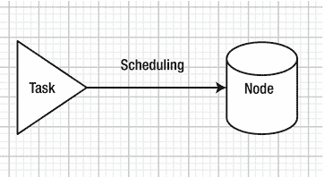
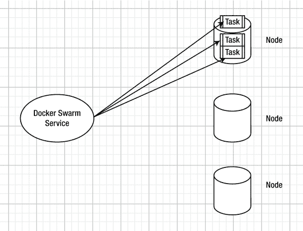
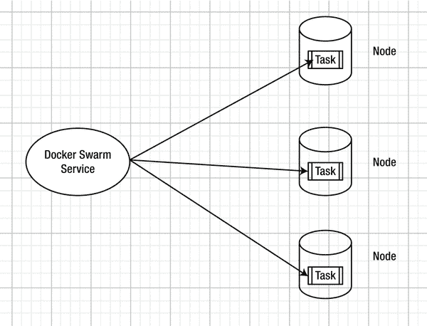
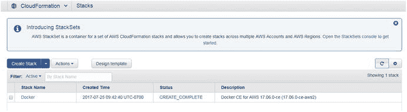
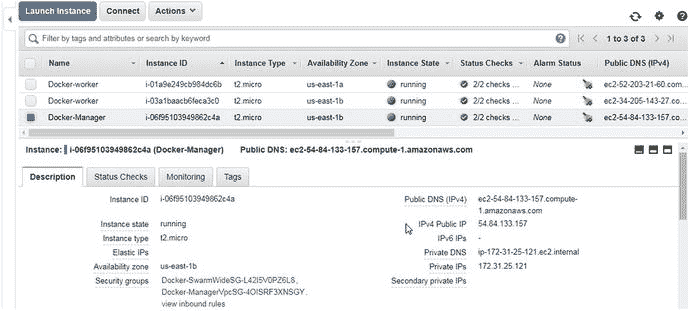
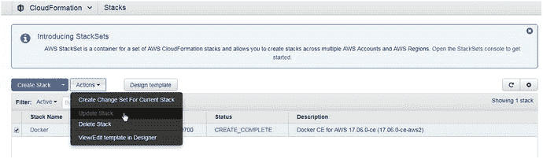
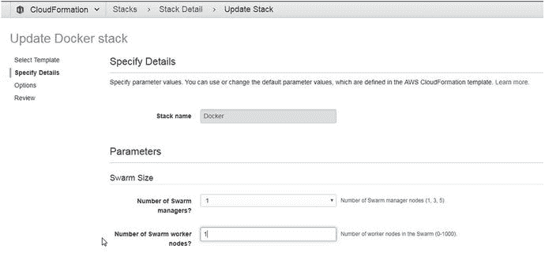
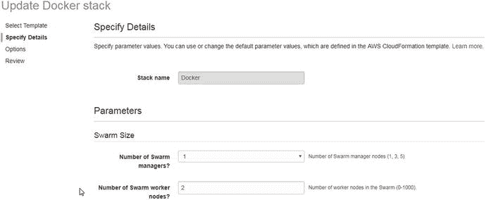
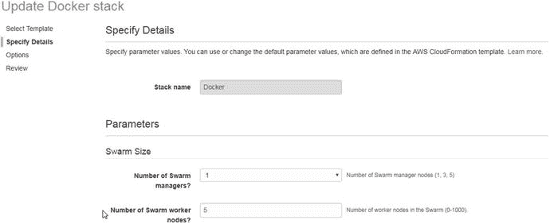

# 八、调度

在第二章，介绍了 Docker Swarm。在第四章中，介绍了 Docker 群服务。一个服务由零个或多个服务任务(副本)组成，它在集群中的节点上调度这些任务。服务的期望状态包括必须运行的任务数量。调度被定义为将需要运行的服务任务放置在集群中的一个节点上以保持服务的期望状态的过程，如图 8-1 所示。只能在工作节点上计划服务任务。默认情况下，管理器节点也是工作者节点。



图 8-1。

Scheduling

## 问题

如果没有调度策略，服务任务可能会被调度到群中的一个节点子集上。例如，一个服务中的所有三个任务都可以在一个群中的同一个节点上被调度，如图 8-2 所示。



图 8-2。

Avoid scheduling all tasks on one node

不使用调度策略可能会导致以下问题:

*   群中资源利用不足—如果所有任务都在单个节点或节点子集上调度，则其他节点的资源容量没有得到利用。
*   资源利用不均衡—如果所有任务都安排在单个节点或节点子集上，则安排任务的节点上的资源会被过度利用，任务甚至会用尽所有资源容量，而没有扩展副本的余地。
*   缺乏局部性—客户端基于节点位置访问服务的任务。如果所有服务任务都被安排在单个节点上，则在其他节点上访问服务的外部客户端不能本地访问服务，从而在访问相对远程的任务时导致网络开销。
*   单点故障—如果所有服务都在一个节点上运行，而该节点出现问题，就会导致停机。增加节点间的冗余可以避免这个问题。

## 解决方案

为了克服前面讨论的问题，Docker 群中的服务任务调度是基于一个内置的调度策略。Docker Swarm 模式使用分散调度策略对节点进行排序，以放置服务任务(副本)。为每个任务的调度计算节点排序，并且在具有最高计算排序的节点上调度任务。分布调度策略根据节点的可用 CPU、RAM 和已经在节点上运行的容器数量来计算节点等级。传播策略针对容器数量最少的节点进行优化。负载共享是分布策略的目标，它导致任务(容器)稀疏而均匀地分布在集群中的几台机器上。传播策略的预期结果是，如果单个节点或节点的一个小子集宕机或变得可用，则只有少数任务丢失，而群中的大多数任务继续可用。

Note

因为容器在所有状态下都会消耗资源，包括退出时，所以扩展策略不会考虑容器的状态。建议用户删除已停止的容器，因为如果某个节点有几个已停止的容器，那么该节点将变得不适合调度新任务。

扩展调度策略不考虑为哪个服务调度任务。只有可用的和请求的资源被用于调度新的任务。图 8-3 显示了使用扩展调度策略的调度。



图 8-3。

Using the spread scheduling policy

举个假设的例子:

1.  从三个节点开始，每个节点有 3GB 的容量和 3 个 CPU，并且没有容器运行。
2.  创建一个带有一个副本的`mysql`服务，它需要 1GB 和 1 个 CPU 的资源。第一个副本被随机安排在群中三个节点中的一个上，因为所有节点都具有相同的排名。如果所有的节点都有相同的等级，一个新的任务会被随机安排在其中一个节点上。
3.  将`mysql`服务扩展为三个任务。由于其中一个节点已经加载，这两个新任务被安排在另外两个节点上，将一个任务分配给每个节点。
4.  将`mysql`服务扩展到五个任务。必须启动两个新任务，并且所有节点都具有相同的等级，因为它们具有相同的可用资源容量和相同数量的正在运行的容器。这两个新任务随机安排在两个节点上。因此，两个节点各有两个任务，一个节点有一个任务。
5.  为`nginx`服务器创建另一个服务，需要两个任务，每个任务需要 0.5GB 和 0.5 CPU。这两个任务都被安排在只有`mysql`服务任务的节点上，因为它负载最小。因此，两个节点有两个`mysql`服务任务和 1GB 和 1 个 CPU 的可用容量，一个节点有两个`nginx`服务任务和一个`mysql`服务任务以及 1GB 和 1 个 CPU 的可用资源容量。
6.  将`nginx`服务扩展到三个。即使所有节点都有相同的可用 CPU 和 RAM，新任务也不会随机安排在三个节点中的一个上，而是安排在容器数量最少的节点上。结果，新的`nginx`任务被随机安排在其中一个节点上，每个节点有两个`mysql`任务。如果节点具有相同的可用 CPU 和 RAM，则选择具有较少容器(运行或停止)的节点来调度新任务。

本章涵盖以下主题:

*   设置环境
*   创建和计划服务—扩展计划
*   期望的国家和解
*   受节点资源容量限制的任务调度
*   添加服务调度约束
*   在特定节点上调度
*   添加多个日程排定限制
*   为调度添加节点标签
*   添加、更新和删除服务调度约束
*   扩展调度和全球服务

## 设置环境

使用 Docker for AWS 创建一个由一个管理节点和两个工作节点组成的 CloudFormation 栈。AWS 的 Docker 在第三章中介绍。栈如图 8-4 所示。



图 8-4。

CloudFormation stack

栈中的三个 EC2 实例如图 8-5 所示。



图 8-5。

EC2 instances for the Docker swarm

使用公共 IP 地址 SSH 登录到 Swarm manager，该地址可以从 EC2 控制台获得，如图 8-5 所示。

```
[root@localhost ∼]# ssh -i "docker.pem" docker@54.84.133.157
Welcome to Docker!

```

列出群体中的节点；应该列出三个节点。

```
∼ $ docker node ls
ID                           HOSTNAME                       STATUS  AVAILABILITY  MANAGER STATUS
0waa5g3b6j641xtwsygvjvwc1    ip-172-31-0-147.ec2.internal   Ready   Active              
e7vigin0luuo1kynjnl33v9pa    ip-172-31-29-67.ec2.internal   Ready   Active              
ptm7e0p346zwypos7wnpcm72d *  ip-172-31-25-121.ec2.internal  Ready   Active        Leader

```

## 创建和计划服务:扩展计划

首先，我们以 MySQL 数据库服务为例来讨论默认的扩展调度。从 Swarm manager 节点，运行以下命令为 MySQL 创建一个五副本服务。输出是服务 ID(以斜体显示)。

```
∼ $ docker service create \
>   --env MYSQL_ROOT_PASSWORD='mysql'\
>   --replicas 5 \
>   --name mysql \
>  mysql

1onpemnoz4x1lh3sv5umab8uo

```

随后，使用`docker service ls`列出服务。最初，`REPLICAS`列可能是`0/5`，表示没有副本被调度和运行。

```
∼ $ docker service ls
ID             NAME    MODE         REPLICAS   IMAGE          PORTS
1onpemnoz4x1   mysql   replicated   0/5        mysql:latest   

```

过一会儿再次运行该命令；所有副本应该都在运行，如`REPLICAS`列中的`5/5`所示。使用`docker service ps mysql`命令列出服务副本。任务应该正在运行或准备运行。

```
∼ $ docker service ps mysql
ID              NAME       IMAGE           NODE                            DESIRED STATE    CURRENT STATE             ERROR    PORTS
fwjbu3gt2zn0    mysql.1    mysql:latest    ip-172-31-0-147.ec2.internal    Running          Preparing 8 seconds ago                       
w0521ik1awjf    mysql.2    mysql:latest    ip-172-31-29-67.ec2.internal    Running          Preparing 8 seconds ago                       
z9wn2nrzfzt8    mysql.3    mysql:latest    ip-172-31-0-147.ec2.internal    Running          Preparing 8 seconds ago                       
tm8jbque3xbb    mysql.4    mysql:latest    ip-172-31-25-121.ec2.internal   Running          Preparing 8 seconds ago                       
7drxfy3vbmp5    mysql.5    mysql:latest    ip-172-31-29-67.ec2.internal    Running          Preparing 8 seconds ago                       

```

按照分布调度策略，其中两个副本在一个工作节点上按计划列出，两个在另一个工作节点上，一个在管理器节点上。由于副本的数量为奇数，所以位置不能完全均匀分布，但是单个节点不会有两个以上的副本。

要查看分布调度策略如何在整个群中均匀地分布副本，请将服务扩展到六个副本。`docker service scale`命令的输出以斜体显示。

```
∼ $ docker service scale mysql=6

mysql scaled to 6

```

随后，列出副本。每个节点上都安排了两个复制副本，因为扩展计划策略旨在计划。

```
∼ $ docker service ps mysql
ID              NAME       IMAGE           NODE                            DESIRED STATE    CURRENT STATE              ERROR    PORTS
fwjbu3gt2zn0    mysql.1    mysql:latest    ip-172-31-0-147.ec2.internal    Running          Running 13 seconds ago                       
w0521ik1awjf    mysql.2    mysql:latest    ip-172-31-29-67.ec2.internal    Running          Running 12 seconds ago                       
z9wn2nrzfzt8    mysql.3    mysql:latest    ip-172-31-0-147.ec2.internal    Running          Running 13 seconds ago                       
tm8jbque3xbb    mysql.4    mysql:latest    ip-172-31-25-121.ec2.internal   Running          Running 8 seconds ago                        
7drxfy3vbmp5    mysql.5    mysql:latest    ip-172-31-29-67.ec2.internal    Running          Running 12 seconds ago                       
utjo8lwbtzf7    mysql.6    mysql:latest    ip-172-31-25-121.ec2.internal   Running          Running 5 seconds ago                        

```

因为服务副本或任务只不过是运行容器的一个槽，所以每个节点为`mysql`服务运行两个容器。

为了进一步演示扩展调度，将服务缩减为三个任务。命令输出以斜体显示。

```
∼ $ docker service scale mysql=3

mysql scaled to 3

```

列出服务任务。每个节点上运行一个任务，这也是一个均匀分布的任务调度。

```
∼ $ docker service ps mysql
ID              NAME       IMAGE           NODE                            DESIRED STATE    CURRENT STATE              ERROR    PORTS
w0521ik1awjf    mysql.2    mysql:latest    ip-172-31-29-67.ec2.internal    Running          Running 40 seconds ago                       
z9wn2nrzfzt8    mysql.3    mysql:latest    ip-172-31-0-147.ec2.internal    Running          Running 41 seconds ago                       
utjo8lwbtzf7    mysql.6    mysql:latest    ip-172-31-25-121.ec2.internal   Running          Running 33 seconds ago                       

```

## 期望的国家和解

当一个服务被创建或者被放大或缩小时，该服务最初在当前状态和期望状态之间存在差异。期望状态的不同值是`ready`、`running`、`shutdown`和`accepted`。Docker 服务是为期望的状态协调而设计的，这意味着群管理器持续监视集群状态，以协调服务的期望状态和当前状态之间的任何差异。任务的当前状态可以是`assigned`、`preparing`、`ready`、`running`、`shutdown`或`pending`。已经分配给节点但当前未运行的任务处于`assigned`状态。期望状态为`running`并准备运行的任务处于`preparing`当前状态。如果群中没有节点可以运行任务，则该任务处于`pending`状态。

在下面的任务列表中，一些任务具有期望状态和当前状态`running`。这些任务已经协调了它们期望的状态。一个任务的期望状态被设置为`running`，但是当前状态是`pending`。另一个任务的期望状态设置为`shutdown`，当前状态设置为`assigned`。

```
∼ $ docker service ps mysql
ID              NAME          IMAGE           NODE                            DESIRED STATE    CURRENT STATE              ERROR    PORTS
opxf4ne7iyy6    mysql.1       mysql:latest    ip-172-31-25-121.ec2.internal   Running          Running 9 minutes ago                         
x30y3jlea047    mysql.2       mysql:latest    ip-172-31-29-67.ec2.internal    Running          Running 8 minutes ago                         
w4ivsbvwqqzq    mysql.3       mysql:latest    ip-172-31-2-177.ec2.internal    Running          Running 4 minutes ago                         
j9lp08ojofj7    mysql.4       mysql:latest                                        Running          Pending 28 seconds ago                        
ph1zpsjsvp69     \_ mysql.4   mysql:latest    ip-172-31-7-137.ec2.internal    Shutdown         Assigned 33 seconds ago                       
d3oxy6hxfjh3     \_ mysql.4   mysql:latest    ip-172-31-40-70.ec2.internal    Shutdown         Running 43 seconds ago                        
ic331aasjpdm    mysql.5       mysql:latest    ip-172-31-44-104.ec2.internal   Running          Running 8 minutes ago                         

```

在早期的任务列表中，所有任务都处于当前状态`preparing`和期望状态`running`。

群模式旨在尽可能地协调所需的状态，这意味着如果节点资源可用，将运行所需数量的副本。为了进行演示，通过选择操作➤更新栈来更新 AWS CloudFormation 栈的 Docker，如图 8-6 所示。



图 8-6。

Updating a stack

将工作节点的数量从两个减少到一个，如图 8-7 所示。



图 8-7。

Decreasing the number of worker nodes to one

随后，列出来自 Swarm manager 节点的服务副本。

```
docker service ps mysql

```

在离开群的群工作者节点上运行的服务副本被列为`shutdown`。在群中剩余的两个节点上开始新的副本以协调期望的状态。

```
∼ $ docker service ps mysql
ID              NAME          IMAGE           NODE                            DESIRED STATE    CURRENT STATE                 ERROR    PORTS
p14bbk7ij1mt    mysql.1       mysql:latest    ip-172-31-29-67.ec2.internal    Running          Running 5 minutes ago                            
w0521ik1awjf    mysql.2       mysql:latest    ip-172-31-29-67.ec2.internal    Running          Running 7 minutes ago                            
uatsaay7axlc    mysql.3       mysql:latest    ip-172-31-25-121.ec2.internal   Running          Running about a minute ago                      
z9wn2nrzfzt8     \_ mysql.3   mysql:latest    0waa5g3b6j641xtwsygvjvwc1       Shutdown         Running 2 minutes ago                            
w1tlw0fom42q    mysql.4       mysql:latest    ip-172-31-29-67.ec2.internal    Running          Running about a minute ago                       
qc75buhzzct3     \_ mysql.4   mysql:latest    0waa5g3b6j641xtwsygvjvwc1    Shutdown         Running 2 minutes ago                            
s09ts9s8np3d    mysql.5       mysql:latest    ip-172-31-25-121.ec2.internal   Running          Running 5 minutes ago                            
utjo8lwbtzf7    mysql.6       mysql:latest    ip-172-31-25-121.ec2.internal   Running          Running 7 minutes ago                            

```

仅列出所需状态为`running`的副本，六个副本在两个节点之间按计划平均列出—三个副本在管理节点上，三个副本在工作节点上。

```
∼ $ docker service ps -f desired-state=running mysql
ID              NAME       IMAGE           NODE                            DESIRED STATE    CURRENT STATE            ERROR    PORTS
p14bbk7ij1mt    mysql.1    mysql:latest    ip-172-31-29-67.ec2.internal    Running          Running 6 minutes ago                       
w0521ik1awjf    mysql.2    mysql:latest    ip-172-31-29-67.ec2.internal    Running          Running 8 minutes ago                       
uatsaay7axlc    mysql.3    mysql:latest    ip-172-31-25-121.ec2.internal   Running          Running 2 minutes ago                       
w1tlw0fom42q    mysql.4    mysql:latest    ip-172-31-29-67.ec2.internal    Running          Running 2 minutes ago                       
s09ts9s8np3d    mysql.5    mysql:latest    ip-172-31-25-121.ec2.internal   Running          Running 6 minutes ago                       
utjo8lwbtzf7    mysql.6    mysql:latest    ip-172-31-25-121.ec2.internal   Running          Running 8 minutes ago                       

```

如果新的节点被添加到群中，传播调度策略不重新调度已经运行的副本来实现群中的均匀传播。为了演示这一点，我们将工作节点的数量增加回两个，如图 8-8 所示。



图 8-8。

Re-adding a worker node to Swarm

将一个节点添加到群中不会关闭其他节点上的副本并在新节点上启动副本。列出正在运行的副本并不表示服务副本的替换。在添加新节点之前，服务副本继续在运行它们的节点上运行，其中三个在管理节点上，三个在工作节点上。

```
∼ $ docker service ps mysql
ID              NAME          IMAGE           NODE                            DESIRED STATE    CURRENT STATE             ERROR    PORTS
p14bbk7ij1mt    mysql.1       mysql:latest    ip-172-31-29-67.ec2.internal    Running          Running 15 minutes ago                       
w0521ik1awjf    mysql.2       mysql:latest    ip-172-31-29-67.ec2.internal    Running          Running 17 minutes ago                       
uatsaay7axlc    mysql.3       mysql:latest    ip-172-31-25-121.ec2.internal   Running          Running 12 minutes ago                       
z9wn2nrzfzt8     \_ mysql.3   mysql:latest    0waa5g3b6j641xtwsygvjvwc1       Shutdown         Running 13 minutes ago                       
w1tlw0fom42q    mysql.4       mysql:latest    ip-172-31-29-67.ec2.internal    Running          Running 12 minutes ago                       
qc75buhzzct3     \_ mysql.4   mysql:latest    0waa5g3b6j641xtwsygvjvwc1       Shutdown         Running 13 minutes ago                       
s09ts9s8np3d    mysql.5       mysql:latest    ip-172-31-25-121.ec2.internal   Running          Running 15 minutes ago                       
utjo8lwbtzf7    mysql.6       mysql:latest    ip-172-31-25-121.ec2.internal   Running          Running 17 minutes ago                       

```

## 受节点资源容量限制的任务调度

调度策略受到可用节点资源的限制，这意味着如果没有足够的节点资源(CPU 和内存)可用，就无法运行服务副本。资源使用不能超过节点容量。副本仍被分配给服务以定义所需的状态，但由于资源不足，可能不会运行。为了演示这一点，我们删除服务`mysql`并使用指定的资源请求和限制再次创建服务。命令输出以斜体显示。

```
∼ $ docker service rm mysql

mysql

∼ $ docker service create \
>   --env MYSQL_ROOT_PASSWORD='mysql'\
>   --replicas 1 \
>   --name mysql \
>   --reserve-cpu 1 --limit-cpu 2 --reserve-memory  256mb --limit-memory 512mb mysql

0qe2thy0dlviroli6k8thist1

```

列出服务表明创建了服务的一个副本。

```
∼ $ docker service ls
ID              NAME     MODE          REPLICAS    IMAGE           PORTS
0qe2thy0dlvi    mysql    replicated    1/1         mysql:latest    

```

单个副本被调度在管理节点上，如果群中的所有节点具有相同的节点排名，则管理节点被随机选择。

```
∼ $ docker service ps mysql
ID              NAME       IMAGE           NODE                            DESIRED STATE    CURRENT STATE            ERROR               PORTS
opxf4ne7iyy6    mysql.1    mysql:latest    ip-172-31-25-121.ec2.internal   Running          Running 8 seconds ago                       

```

接下来，为了潜在地使服务副本消耗比可用资源更多的资源，将服务扩展到五个副本。

```
∼ $ docker service scale mysql=5

mysql scaled to 5

```

列出服务表明`3/5 Replicas`正在运行。

```
∼ $ docker service ls
ID              NAME     MODE          REPLICAS    IMAGE           PORTS
0qe2thy0dlvi    mysql    replicated    3/5         mysql:latest    

```

列出服务副本表明一些副本是`pending`而不是`running`。

```
∼ $ docker service ps mysql
ID              NAME       IMAGE           NODE                            DESIRED STATE    CURRENT STATE            ERROR    PORTS
opxf4ne7iyy6    mysql.1    mysql:latest    ip-172-31-25-121.ec2.internal   Running          Running 4 minutes ago                       
x30y3jlea047    mysql.2    mysql:latest    ip-172-31-29-67.ec2.internal    Running          Running 3 minutes ago                       
w4ivsbvwqqzq    mysql.3    mysql:latest                                        Running          Pending 3 minutes ago                       
d3oxy6hxfjh3    mysql.4    mysql:latest                                        Running          Pending 3 minutes ago                       
ic331aasjpdm    mysql.5    mysql:latest    ip-172-31-44-104.ec2.internal   Running          Running 3 minutes ago                       

```

`pending`状态意味着副本被分配给服务，但是还没有在任何节点上被调度。根据请求的资源和可用的节点资源，只能运行三个副本，每个节点一个。

因为由于缺乏资源而没有调度副本，所以我们添加一个或多个新的工作节点来潜在地调度副本以协调期望的状态。将工作节点的数量增加到 5 个，如图 8-9 所示。



图 8-9。

Increasing the number of worker nodes to five

在添加一个新节点后，Swarm 应该列出六个节点。随着资源变得可用于`pending`任务，任务得到调度并开始运行。

```
∼ $ docker service ps mysql
ID              NAME       IMAGE           NODE                            DESIRED STATE       CURRENT STATE              ERROR               PORTS
opxf4ne7iyy6    mysql.1    mysql:latest    ip-172-31-25-121.ec2.internal   Running             Running 5 minutes ago                          
x30y3jlea047    mysql.2    mysql:latest    ip-172-31-29-67.ec2.internal    Running             Running 4 minutes ago                          
w4ivsbvwqqzq    mysql.3    mysql:latest    ip-172-31-2-177.ec2.internal    Running             Running 21 seconds ago                         
d3oxy6hxfjh3    mysql.4    mysql:latest    ip-172-31-40-70.ec2.internal    Running             Preparing 30 seconds ago                       
ic331aasjpdm    mysql.5    mysql:latest    ip-172-31-44-104.ec2.internal   Running             Running 4 minutes ago                          

```

如果工作者节点的数量减少，一些任务被重新调度，如`shutdown`期望状态所示。

```
∼ $ docker service ps mysql
ID              NAME          IMAGE           NODE                            DESIRED STATE    CURRENT STATE             ERROR    PORTS
opxf4ne7iyy6    mysql.1       mysql:latest    ip-172-31-25-121.ec2.internal   Running          Running 9 minutes ago                         
x30y3jlea047    mysql.2       mysql:latest    ip-172-31-29-67.ec2.internal    Running          Running 8 minutes ago                         
w4ivsbvwqqzq    mysql.3       mysql:latest    ip-172-31-2-177.ec2.internal    Running          Running 4 minutes ago                         
j9lp08ojofj7    mysql.4       mysql:latest                                        Running          Pending 28 seconds ago                        
ph1zpsjsvp69     \_ mysql.4   mysql:latest    ip-172-31-7-137.ec2.internal    Shutdown         Assigned 33 seconds ago                       
d3oxy6hxfjh3     \_ mysql.4   mysql:latest    ip-172-31-40-70.ec2.internal    Shutdown         Running 43 seconds ago                        
ic331aasjpdm    mysql.5       mysql:latest    ip-172-31-44-104.ec2.internal   Running          Running 8 minutes ago                         

```

更新服务以降低保留的 CPU 和内存资源使用率只会更新服务的`UpdateConfig`。这不会降低已经运行的任务的资源使用率，也不会使`pending`或`shutdown`任务运行。例如，当一些任务由于缺乏资源而处于`pending`或`shutdown`时，降低`mysql`服务的资源储备和限制。

```
∼ $ docker service update --reserve-cpu .1 --limit-cpu .5 --reserve-memory  64mb
 --limit-memory 128mb mysql

mysql

```

`UpdateConfig`被修改，但仅适用于在该点之后创建的新副本。

```
∼ $ docker service inspect mysql
[
                },
                "Resources": {
                    "Limits": {
                        "NanoCPUs": 500000000,
                        "MemoryBytes": 134217728
                    },
                    "Reservations": {
                        "NanoCPUs": 100000000,
                        "MemoryBytes": 67108864
                    }
                },
]

```

`mysql`服务中只有三个副本在实际运行。

```
∼ $ docker service ps -f desired-state=running mysql
ID              NAME       IMAGE           NODE                            DESIRED STATE    CURRENT STATE            ERROR    PORTS
opxf4ne7iyy6    mysql.1    mysql:latest    ip-172-31-25-121.ec2.internal   Running          Running 10 minutes ago                       
x30y3jlea047    mysql.2    mysql:latest    ip-172-31-29-67.ec2.internal    Running          Running 10 minutes ago                       
w4ivsbvwqqzq    mysql.3    mysql:latest    ip-172-31-2-177.ec2.internal    Running          Running 5 minutes ago                        
rm9uj4qevt5b    mysql.5    mysql:latest                                        Running          Pending 33 seconds ago                       

```

要强制服务任务使用新的资源设置，请将服务缩减为一个任务，然后再缩减为五个任务。

```
∼ $ docker service scale mysql=1

mysql scaled to 1

∼ $ docker service scale mysql=5

mysql scaled to 5

```

所有五个任务现在都在运行。

```
∼ $ docker service ps mysql
ID              NAME          IMAGE           NODE                            DESIRED STATE    CURRENT STATE              ERROR    PORTS
anai3mptbnkp    mysql.1       mysql:latest    ip-172-31-2-177.ec2.internal    Running          Running 17 seconds ago                        
opxf4ne7iyy6     \_ mysql.1   mysql:latest    ip-172-31-25-121.ec2.internal   Shutdown         Shutdown 18 seconds ago                       
lmkn8l50t334    mysql.2       mysql:latest    ip-172-31-25-121.ec2.internal   Running          Running 10 seconds ago                        
7uz7q86wnzn4    mysql.3       mysql:latest    ip-172-31-2-177.ec2.internal    Running          Running 11 seconds ago                        
ubh4m39aw8m9    mysql.4       mysql:latest    ip-172-31-29-67.ec2.internal    Running          Running 11 seconds ago                        
56pnrzajogvs    mysql.5       mysql:latest    ip-172-31-25-121.ec2.internal   Running          Running 10 seconds ago                        

```

## 添加服务调度约束

Docker Swarm 支持放置或调度约束来调度新任务。服务放置约束是放置服务任务的附加标准，可以基于节点属性、元数据和引擎元数据。群调度器使用以下序列来调度服务任务。

1.  节点是否满足所有放置约束？
2.  一个节点是否满足均匀分布的调度策略要求？
3.  节点是否有足够的资源来调度任务？

可通过`docker service create`命令使用`--constraint`选项添加一个布局约束。对于一个已经运行的服务，可以分别使用`--constraint-add`和`--constraint-rm`选项和`docker service update`命令添加和删除约束。表 8-1 中讨论的节点属性可用于指定约束。

表 8-1。

Node Attributes for Constraints

<colgroup><col> <col> <col></colgroup> 
| 节点属性 | 描述 | 例子 |
| --- | --- | --- |
| `node.id` | 指定节点 ID。使用`docker node ls`命令列出节点 id。 | `node.id==a3r56hj7y` |
| `node.hostname` | 指定节点的主机名。使用`docker node ls`命令列出了节点的主机名。 | `node.hostname!=ip-10-0-0-ec2.internal` |
| `node.role` | 指定节点角色，它是`worker`或`manager`之一。 | `node.role==manager` |
| `node.labels` | 指定用户添加的节点标签。标签是一个键值对。添加节点标签时，`node.labels.`前缀将被省略，并自动添加。添加和使用节点标签将在后续章节中讨论。 | `node.labels.db==mysql` |
| `engine.labels` | Docker 引擎标签，如驱动程序、操作系统、版本。 | `engine.labels.os==coreos` |

接下来，我们讨论一些使用调度约束的例子。

### 在特定节点上调度

在本节中，我们将在集群中的特定节点上调度服务副本。用`docker node ls`命令列出节点 id。Swarm 有以下三个可用于调度的节点。

```
∼ $ docker node ls
ID                           HOSTNAME                       STATUS  AVAILABILITY  MANAGER STATUS
81h6uvu8uq0emnovzkg6v7mzg    ip-172-31-2-177.ec2.internal   Ready   Active              
e7vigin0luuo1kynjnl33v9pa    ip-172-31-29-67.ec2.internal   Ready   Active              
ptm7e0p346zwypos7wnpcm72d *  ip-172-31-25-121.ec2.internal  Ready   Active        Leader

```

我们可以按节点角色安排服务。创建一个`mysql`服务，其位置约束是服务任务只能在工作节点上调度。首先，删除已经运行的`mysql`服务

```
∼ $ docker service rm mysql
mysql
∼ $ docker service create \
>   --env MYSQL_ROOT_PASSWORD='mysql'\
>   --replicas 3 \

>   --constraint node.role==worker \

>   --name mysql \
>  mysql

nzgte4zac1x8itx6t98y5gi42

```

创建了服务，并且仅在两个 worker 节点上调度了三个任务，如正在运行的服务任务中所列。

```
∼ $ docker service ps -f desired-state=running mysql
ID              NAME       IMAGE           NODE                           DESIRED STATE    CURRENT STATE              ERROR    PORTS
f5t15mnrft0h    mysql.1    mysql:latest    ip-172-31-29-67.ec2.internal   Running          Running 19 seconds ago                       
oxvq4ljuq6yz    mysql.2    mysql:latest    ip-172-31-2-177.ec2.internal   Running          Running 19 seconds ago                       
k5jo862lvsxf    mysql.3    mysql:latest    ip-172-31-2-177.ec2.internal   Running          Running 19 seconds ago                       

```

接下来，我们使用节点 ID 来调度服务的任务。复制管理节点的节点 ID，它也是群中的领导者，是唯一的管理节点。在下面的命令中替换节点 ID，为 MySQL 数据库创建一个服务，并只在 manager 节点上调度副本。

```
docker service create \
  --env MYSQL_ROOT_PASSWORD='mysql'\
  --replicas 3 \
  --constraint  node.id ==<nodeid>
  --name mysql \
 mysql

```

创建服务有三个任务。命令输出以斜体显示。

```
∼ $ docker service create \
>   --env MYSQL_ROOT_PASSWORD='mysql'\
>   --replicas 3 \
>   --constraint  node.id==ptm7e0p346zwypos7wnpcm72d\
>   --name mysql \
>  mysql

u1qi6zqnch9hn7x6k516axg7h

```

该服务的所有三个副本仅在管理器节点上进行调度。

```
∼ $ docker service ps -f desired-state=running mysql
ID              NAME       IMAGE           NODE                            DESIRED STATE    CURRENT STATE              ERROR    PORTS
lbttu95qdjvy    mysql.1    mysql:latest    ip-172-31-25-121.ec2.internal   Running          Running 21 seconds ago                       
89x0z94on0fb    mysql.2    mysql:latest    ip-172-31-25-121.ec2.internal   Running          Running 21 seconds ago                       
3s6508aimdaj    mysql.3    mysql:latest    ip-172-31-25-121.ec2.internal   Running          Running 22 seconds ago                       

```

### 添加多个日程排定限制

还可以指定多个节点约束，并且必须使用`AND`来满足每个约束表达式，以便调度程序在节点上调度副本。例如，我们创建一个具有两个角色的服务，一个将节点角色约束为 worker，另一个将节点主机名约束为不是特定的主机名`ip-172-31-2-177.ec2.internal`。

```
∼ $ docker service create \
>   --env MYSQL_ROOT_PASSWORD='mysql'\
>   --replicas 3 \
>   --constraint node.role==worker \
>   --constraint   node.hostname!=ip-172-31-2-177.ec2.internal\
>   --name mysql \
>  mysql

87g0c8kauhz8yb4wv2ryc2vqr

```

服务被创建。列出服务会将`3/3 replicas`列为正在运行。

```
∼ $ docker service ls
ID             NAME    MODE         REPLICAS   IMAGE          PORTS
87g0c8kauhz8   mysql   replicated   3/3        mysql:latest   

```

列出服务任务表明所有任务都被安排在单个工作节点上。满足两个约束:该节点是一个工作节点，而不是主机名为`ip-172-31-2-177.ec2.internal`的工作节点。

```
∼ $ docker service ps mysql
ID              NAME       IMAGE           NODE                           DESIRED STATE    CURRENT STATE              ERROR    PORTS
jlfk79mb6m6a    mysql.1    mysql:latest    ip-172-31-29-67.ec2.internal   Running          Running 13 seconds ago                       
if5y39ky884q    mysql.2    mysql:latest    ip-172-31-29-67.ec2.internal   Running          Running 13 seconds ago                       
zctm6mzbl4du    mysql.3    mysql:latest    ip-172-31-29-67.ec2.internal   Running          Running 13 seconds ago                       

```

如果`mysql`服务被更新以移除约束，则扩展调度策略基于节点排序来重新调度任务。例如，更新服务以移除添加的两个放置约束。使用`docker service update`命令的`–constraint-rm`选项删除一个约束。

```
∼ $ docker service update \
>   --constraint-rm node.role==worker \
>   --constraint-rm   node.hostname!=ip-172-31-2-177.ec2.internal\
>  mysql

mysql

```

当服务被更新以移除约束时，所有服务任务被关闭，并且新的服务任务被启动。开始新的服务任务，在群中的三个节点上各一个。

```
∼ $ docker service ps mysql
ID              NAME          IMAGE           NODE                            DESIRED STATE    CURRENT STATE                   ERROR    PORTS
d22bkgteivot    mysql.1       mysql:latest    ip-172-31-29-67.ec2.internal    Ready            Ready less than a second ago                       
jlfk79mb6m6a     \_ mysql.1   mysql:latest    ip-172-31-29-67.ec2.internal    Shutdown         Running 1 second ago                               
mp757499j3io    mysql.2       mysql:latest    ip-172-31-2-177.ec2.internal    Running          Running 1 second ago                               
if5y39ky884q     \_ mysql.2   mysql:latest    ip-172-31-29-67.ec2.internal    Shutdown         Shutdown 2 seconds ago                             
jtdxucteb0fl    mysql.3       mysql:latest    ip-172-31-25-121.ec2.internal   Running          Running 4 seconds ago                              
zctm6mzbl4du     \_ mysql.3   mysql:latest    ip-172-31-29-67.ec2.internal    Shutdown         Shutdown 5 seconds ago                             

```

仅列出正在运行的任务。列出了每个节点上运行的一个任务。

```
∼ $ docker service ps -f desired-state=running mysql
ID              NAME       IMAGE           NODE                            DESIRED STATE    CURRENT STATE              ERROR    PORTS
d22bkgteivot    mysql.1    mysql:latest    ip-172-31-29-67.ec2.internal    Running          Running 46 seconds ago                       
mp757499j3io    mysql.2    mysql:latest    ip-172-31-2-177.ec2.internal    Running          Running 49 seconds ago                       
jtdxucteb0fl    mysql.3    mysql:latest    ip-172-31-25-121.ec2.internal   Running          Running 53 seconds ago                       

```

类似地，多节点约束可用于仅在管理器节点上运行副本。接下来，我们更新`mysql`服务以在特定的管理器节点上运行。首先，将一个 worker 节点提升为 manager。

```
∼ $ docker node promote ip-172-31-2-177.ec2.internal

Node ip-172-31-2-177.ec2.internal promoted to a manager in the swarm.

```

随后，列出了两个管理器节点，如其中两个节点的`Manager Status`所示。

```
∼ $ docker node ls
ID                           HOSTNAME                       STATUS  AVAILABILITY  MANAGER STATUS
81h6uvu8uq0emnovzkg6v7mzg    ip-172-31-2-177.ec2.internal   Ready   Active        Reachable
e7vigin0luuo1kynjnl33v9pa    ip-172-31-29-67.ec2.internal   Ready   Active        
ptm7e0p346zwypos7wnpcm72d *  ip-172-31-25-121.ec2.internal  Ready   Active        Leader

```

更新`mysql`服务以添加多个节点约束，从而仅在特定的管理器节点上运行副本。使用`docker service update`命令的`--constraint-add`选项添加约束。

```
∼ $ docker service update \
>   --constraint-add node.role==manager \
>   --constraint-add   node.hostname==ip-172-31-2-177.ec2.internal\
>  mysql

mysql

```

同样，所有服务任务被关闭，新任务被启动，所有这些都在从 worker 节点升级的指定 manager 节点上进行。

```
∼ $ docker service ps -f desired-state=running mysql
ID              NAME       IMAGE           NODE                           DESIRED STATE    CURRENT STATE              ERROR    PORTS
eghm1or6yg5g    mysql.1    mysql:latest    ip-172-31-2-177.ec2.internal   Running          Running 28 seconds ago                       
bhfngac5ssm7    mysql.2    mysql:latest    ip-172-31-2-177.ec2.internal   Running          Running 22 seconds ago                       
ts3fgvq900os    mysql.3    mysql:latest    ip-172-31-2-177.ec2.internal   Running          Running 25 seconds ago                       

```

### 为调度添加节点标签

接下来，我们讨论如何使用节点标签来指定服务放置约束。可以使用以下命令语法向节点添加标签，其中变量为`<LABELKEY>`、`<LABELVALUE>`和`<NODE>`。`<NODE>`是节点 ID 或主机名。

```
docker node update --label-add  <LABELKEY>=<LABELVALUE>  <NODE>

```

例如，将标签`db=mysql`添加到主机名设置为`ip-172-31-25-121.ec2.internal`的节点，该节点是领导者节点。

```
∼ $ docker node update --label-add  db=mysql  ip-172-31-25-121.ec2.internal
ip-172-31-25-121.ec2.internal

```

添加一个节点标签。检查节点时，标签列在`Labels`字段中。

```
∼ $ docker node inspect ip-172-31-25-121.ec2.internal
[
        "Spec": {
            "Labels": {
                "db": "mysql"
            },
            "Role": "manager",
            "Availability": "active"
        },
]

```

接下来，创建一个使用节点标签添加放置约束的服务。标签的- constraint 选项必须包括前缀 node.labels。

```
∼ $ docker service rm mysql
mysql
∼ $ docker service create \
>   --env MYSQL_ROOT_PASSWORD='mysql'\
>   --replicas 3 \

>   --constraint node.labels.db==mysql \

>   --name mysql \
>  mysql

2hhccmj9senseazbet11dekoa

```

服务已创建。列出任务会列出领导者管理器节点上的所有任务，这是节点标签约束所指定的。

```
∼ $ docker service ps -f desired-state=running mysql
ID              NAME       IMAGE           NODE                            DESIRED STATE    CURRENT STATE              ERROR    PORTS
g5jz9im3fufv    mysql.1    mysql:latest    ip-172-31-25-121.ec2.internal   Running          Running 18 seconds ago                       
bupr27bs57h1    mysql.2    mysql:latest    ip-172-31-25-121.ec2.internal   Running          Running 18 seconds ago                       
5bb2yf8aehqn    mysql.3    mysql:latest    ip-172-31-25-121.ec2.internal   Running          Running 18 seconds ago                       

```

添加的标签可通过`docker node update`命令的`--label-rm`选项移除，其中仅指定了标签键。

```
docker node update --label-rm  db  ip-172-31-25-121.ec2.internal   

```

### 添加、更新和删除服务调度约束

在前面的部分中，我们讨论了在使用`docker service create`创建服务时添加位置约束。可使用`--constraint-add`和`--constraint-rm`选项通过`docker service update`命令添加/删除布局约束。为了讨论一个更新布局约束的例子，我们创建了一个`mysql`服务，它有三个副本，开始时没有布局约束。

```
∼ $ docker service rm mysql
mysql
∼ $ docker service create \
>   --env MYSQL_ROOT_PASSWORD='mysql'\
>   --replicas 3 \
>   --name mysql \
>  mysql

az3cq6sxwrrk4mxkksdu21i25

```

一个`mysql`服务被创建，在集群中的三个节点上调度三个副本，使用传播策略。

接下来，用`docker service update`命令更新服务，为服务副本添加一个仅在管理器节点上运行的约束。

```
∼ $ docker service update \
>  --constraint-add node.role==manager \
>  mysql

mysql

```

在具有两个管理节点的群中，所有服务任务都被关闭，新任务只在管理节点上启动。

```
∼ $ docker service ps mysql
ID              NAME          IMAGE           NODE                            DESIRED STATE    CURRENT STATE              ERROR               PORTS
pjwseruvy4rj    mysql.1       mysql:latest    ip-172-31-2-177.ec2.internal    Running          Running 4 seconds ago                         
s66g9stz9af5     \_ mysql.1   mysql:latest    ip-172-31-2-177.ec2.internal    Shutdown         Shutdown 4 seconds ago                        
yqco9zd0vq79    mysql.2       mysql:latest    ip-172-31-25-121.ec2.internal   Running          Running 9 seconds ago                         
8muu6gbghhnd     \_ mysql.2   mysql:latest    ip-172-31-25-121.ec2.internal   Shutdown         Shutdown 10 seconds ago                       
8x7xlavcxdau    mysql.3       mysql:latest    ip-172-31-25-121.ec2.internal   Running          Running 7 seconds ago                         
qx95vwi2h547     \_ mysql.3   mysql:latest    ip-172-31-29-67.ec2.internal    Shutdown         Shutdown 7 seconds ago                        

```

可以在同一个`docker service update`命令中添加和删除调度约束。例如，删除节点成为管理者的约束，并添加节点成为工作者的约束。

```
∼ $ docker service update \
>   --constraint-rm node.role==manager \
>   --constraint-add node.role==worker \
>  mysql

mysql

```

又来了。所有服务任务都将关闭，新任务仅在工作节点上启动。

```
∼ $ docker service ps -f desired-state=running mysql
ID              NAME       IMAGE           NODE                           DESIRED STATE    CURRENT STATE              ERROR    PORTS
6ppgmvw9lv75    mysql.1    mysql:latest    ip-172-31-29-67.ec2.internal   Running          Running 9 seconds ago                        
qm0loki65v9s    mysql.2    mysql:latest    ip-172-31-29-67.ec2.internal   Running          Running 17 seconds ago                       
ypl0tc1ft92o    mysql.3    mysql:latest    ip-172-31-29-67.ec2.internal   Running          Running

```

如果将节点角色指定为工作者的唯一调度约束被移除，则分布调度策略开始在整个群中均匀分布新任务。要进行演示，请删除节点角色成为工作者的约束。

```
∼ $ docker service update --constraint-rm node.role==worker mysql

mysql

```

随后，新的任务在群体中的节点间传播。

```
∼ $ docker service ps -f desired-state=running mysql
ID              NAME       IMAGE           NODE                            DESIRED STATE    CURRENT STATE              ERROR    PORTS
jpx4jjw6l9d5    mysql.1    mysql:latest    ip-172-31-29-67.ec2.internal    Running          Running 5 seconds ago                        
ngajiik1hugb    mysql.2    mysql:latest    ip-172-31-25-121.ec2.internal   Running          Running 12 seconds ago                       
40eaujzlux88    mysql.3    mysql:latest    ip-172-31-2-177.ec2.internal    Running          Running 8 seconds ago                        

```

## 扩展调度和全球服务

全局服务在集群中的每个节点上运行一个任务。全局服务不能被扩展以创建更多/更少的任务。因此，分布调度策略概念不适用于全局服务。然而，节点约束可以应用于全局服务。例如，我们为`mysql`数据库创建了一个全局服务。应用一个放置约束，即服务应该只在工作节点上可用。

```
∼ $ docker service create \
>   --mode global \
>   --env MYSQL_ROOT_PASSWORD='mysql'\
>   --constraint node.role==worker \
>   --name mysql \
>  mysql

jtzcwatp001q9r26n1uubd8me

```

创建了全局服务。将具有期望状态的任务的服务任务列为`running`仅列出工作节点上的任务。

```
∼ $ docker service ps -f desired-state=running mysql
ID            NAME                             IMAGE         NODE                           DESIRED STATE  CURRENT STATE            ERROR   PORTS
o5nskzpv27j9  mysql.e7vigin0luuo1kynjnl33v9pa  mysql:latest  ip-172-31-29-67.ec2.internal   Running        Running 17 seconds ago                       

```

如果创建时没有仅在工作节点上调度的约束，全局服务将在每个节点上调度一个任务，如下例所示。

```
∼ $ docker service rm mysql
mysql
∼ $ docker service create \
>   --mode global \
>   --env MYSQL_ROOT_PASSWORD='mysql'\
>   --name mysql \
>  mysql

mv9yzyyntdhzz41zssbutcsvw

∼ $ docker service ps -f desired-state=running mysql
ID            NAME                             IMAGE         NODE                          DESIRED STATE  CURRENT STATE           ERROR  PORTS
mc87btddhmpl  mysql.e7vigin0luuo1kynjnl33v9pa  mysql:latest  ip-172-31-29-67.ec2.internal  Running        Running 19 seconds ago                       
o0wfdq9sd8yt  mysql.ptm7e0p346zwypos7wnpcm72d  mysql:latest  ip-172-31-25-121.ec2.internal Running        Running 19 seconds ago                       
wt2q5k2dhqjt  mysql.81h6uvu8uq0emnovzkg6v7mzg  mysql:latest  ip-172-31-2-177.ec2.internal   Running        Running 19 seconds ago                       

```

## 摘要

本章讨论了 Docker Swarm 模式中使用的分布调度策略，通过这种策略，服务副本基于节点排序均匀地分布在集群中的节点上；较高的节点等级获得服务副本放置优先级。我们还讨论了有限节点资源容量的影响，以及如何通过向群集添加新节点来缓解这种影响。我们讨论了调度新副本的放置约束。分布调度策略与全局服务无关，因为默认情况下，全局服务在每个节点上创建一个服务任务。然而，调度约束可以与全局服务一起使用。在下一章，我们将讨论 Docker 服务的滚动更新。