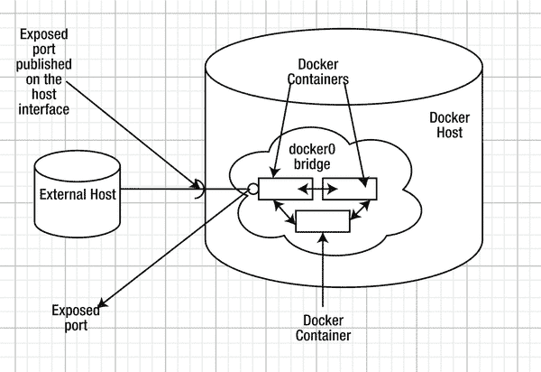
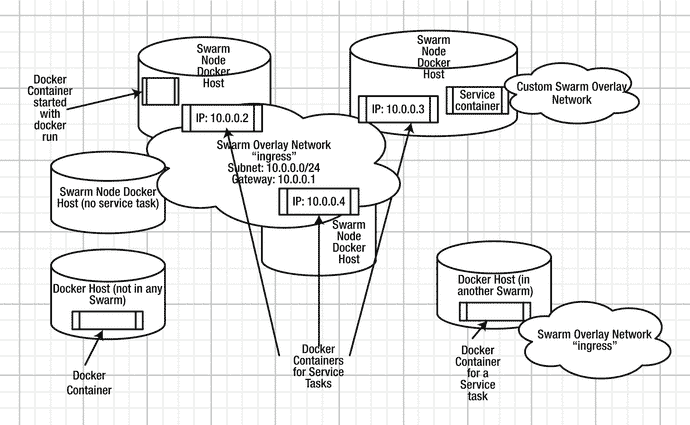
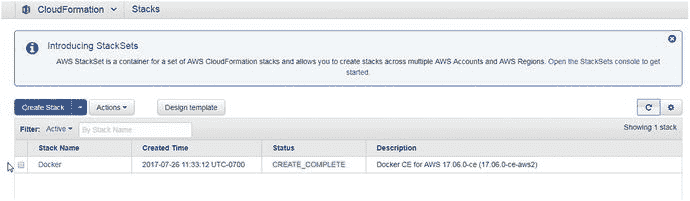
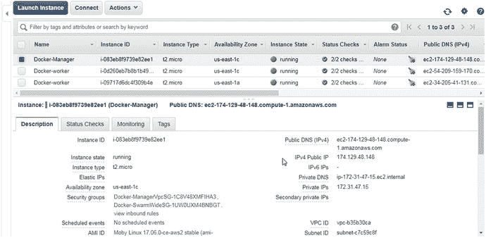
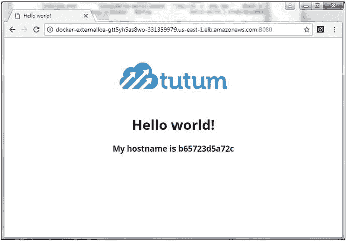
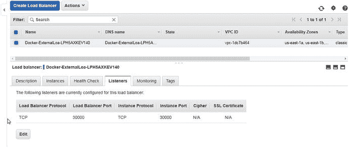
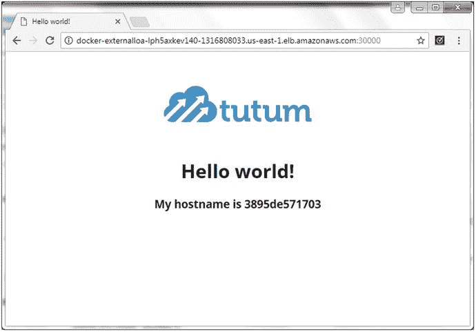

# 十、网络连接

Docker 引擎上的网络是由桥接网络提供的，即`docker0`桥。`docker0`桥在 Docker 主机的范围内是本地的，并且在安装 Docker 时默认安装。所有 Docker 容器都运行在 Docker 主机上，并连接到`docker0`桥网络。他们通过网络互相交流。

## 问题

默认的`docker0`桥接网络有以下限制:

*   桥接网络的范围限于本地 Docker 主机，以提供容器到容器的联网，而不是多主机联网。
*   The bridge network isolates the Docker containers on the host from external access. A Docker container may expose a port or multiple ports and the ports may be published on the host for an external client host access, as illustrated in Figure 10-1, but by default the `docker0` bridge does not provide any external client access outside the network.

    

    图 10-1。

    The default docker0 bridge network

## 解决方案

群模式(Docker 引擎> =1.12)为群中的节点创建一个名为`ingress`的`overlay`网络。`ingress`覆盖网络是一个多主机网络，用于将`ingress`流量路由到群；外部客户端使用它来访问群服务。如果服务发布了一个端口，它们就会被添加到`ingress`网络中。`ingress`覆盖网络具有默认网关和子网，并且`ingress`网络中的所有服务都暴露在群中的所有节点上，无论服务是否在每个节点上有任务调度。除了`ingress`网络，可使用覆盖驱动程序创建自定义覆盖网络。自定义覆盖网络在群中的 Docker 守护进程之间提供网络连接，并用于服务对服务的通信。`Ingress`是一种特殊类型的覆盖网络，不用于服务或任务之间的网络流量。群模式网络如图 10-2 所示。



图 10-2。

The Swarm overlay networks

以下 Docker 网络用于或可用于群组模式。

### 入口网络

初始化群组模式时，会自动创建`ingress`网络。在 Docker for AWS 上，`ingress`网络是现成可用的，因为托管服务默认启用了群组模式。名为`ingress`的默认覆盖网络扩展到群中的所有节点，无论该节点是否有预定的服务任务。`ingress`提供服务任务之间的负载均衡。所有发布端口的服务都被添加到`ingress`网络中。如果服务发布一个端口，甚至在内部网络中创建的服务也被添加到`ingress`。如果服务没有发布端口，它不会被添加到`ingress`网络中。服务使用下面的`docker service create`命令语法发布带有`--publish`或`–p`选项的端口。

```
docker service create \
  --name <SERVICE-NAME> \
  --publish <PUBLISHED-PORT>:<TARGET-PORT> \
  <IMAGE>

```

如果省略了`<PUBLISHED-PORT>`,群组管理器选择 30000-32767 范围内的一个端口来发布服务。

要使用`ingress`网络，群组节点之间必须开放以下端口。

*   端口 7946 TCP/UDP 用于容器网络发现
*   端口 4789 UDP 用于容器`ingress`网络

### 自定义覆盖网络

使用覆盖驱动器创建定制覆盖网络，并且可以在覆盖网络中创建服务。使用`docker service create`命令的`--network`选项在覆盖网络中创建服务。覆盖网络提供服务对服务的通信。覆盖网络中的一个对接容器可以直接与网络中的另一个对接容器通信，无论该容器是在同一节点上还是在不同的节点上。只有用于群服务任务的 Docker 容器可以使用覆盖网络相互连接，而不仅仅是群中主机上运行的任何 Docker 容器。例如，用`docker run `命令启动的 Docker 容器不能连接到 Swarm 覆盖网络，例如使用`docker network connect <overlay network> <container>`。不在群中的对接主机上的对接容器也不能与群中的对接容器直接连接和通信。不同群覆盖网络中的 Docker 容器不能彼此直接通信，因为每个群覆盖网络与其他网络隔离。

尽管群中的默认覆盖网络`ingress`扩展到群中的所有节点，而不管服务任务是否在其上运行，但是其范围也是群的定制覆盖网络默认不扩展到群中的所有节点。定制的群覆盖网络仅扩展到群中运行由定制的群覆盖网络创建的服务任务的那些节点。

“覆盖”网络覆盖主机的底层网络，覆盖网络的范围是群。覆盖网络中的服务容器具有不同的 IP 地址，并且每个覆盖网络分配有不同范围的 IP 地址。在现代内核中，覆盖网络可以与底层网络重叠，因此，多个网络可以拥有相同的 IP 地址。

### docker_gwbridge 网络

初始化群组模式时自动创建的另一个网络(除了`ingress`网络)是`docker_gwbridge`网络。`docker_gwbr` idge 网络是一个桥接网络，它将包括`ingress`网络在内的所有覆盖网络连接到 Docker 守护进程的主机网络。每个服务容器都连接到本地 Docker 守护进程主机的`docker_gwbridge`网络。

### 桥接网络

网桥网络是由 Docker 管理的主机上的网络。主机上的 Docker 容器通过桥接网络相互通信。不公布端口的群模式服务也在桥接网络中创建。以`docker run`命令开始的 Docker 容器也是如此。这意味着不发布端口的群模式 Docker 服务与用`docker run`命令启动的 Docker 容器在同一个网络中。

本章涵盖以下主题:

*   设置环境
*   Swarm 模式下的联网
*   使用默认覆盖网络`ingress`创建服务
*   创建自定义叠加网络
*   使用自定义覆盖网络创建服务
*   连接到同一覆盖网络中的另一个 Docker 容器
*   创建内部网络
*   删除网络

## 设置环境

在 Docker 上为 AWS 创建一个三节点 Docker 群，如第三章所述。如图 10-3 所示，一个自动气象站云形成栈被用来创建一个蜂群。



图 10-3。

AWS CloudFormation stack

获取群管理器节点的公共 IP 地址，如图 10-4 所示。



图 10-4。

Obtaining the public IP address of a Swarm manager node instance

SSH 登录到 Swarm manager 实例。

```
[root@localhost ∼]# ssh -i "docker.pem" docker@174.129.48.148
Welcome to Docker!

```

列出群节点——一个管理者和两个工作者节点。

```
∼ $ docker node ls
ID                          HOSTNAME                       STATUS  AVAILABILITY  MANAGER STATUS
npz2akark8etv4ib9biob5yyk   ip-172-31-47-123.ec2.internal  Ready   Active            
p6wat4lxq6a1o3h4fp2ikgw6r   ip-172-31-3-168.ec2.internal   Ready   Active              
tb5agvzbi0rupq7b83tk00cx3 * ip-172-31-47-15.ec2.internal   Ready   Active        Leader

```

## Swarm 模式下的联网

群组模式提供了一些默认网络，可以用`docker network ls`命令列出。这些网络不仅可以在 Docker for AWS 上使用，还可以在任何平台(如 CoreOS)上以 Swarm 模式使用。

```
∼ $ docker network ls
NETWORK ID          NAME                DRIVER              SCOPE
34a5f77de8cf        bridge              bridge              local
0e06b811a613        docker_gwbridge     bridge              local
6763ebad69cf        host                host                local
e41an60iwval        ingress             overlay             swarm
eb7399d3ffdd        none                null                local

```

我们在上一节中讨论了这些网络中的大多数。“`host`”网络是主机的网络栈。“`none`”网络不提供 Docker 容器和主机网络栈之间的网络，并且创建没有网络访问的容器。

即使在调度任何服务任务之前，默认网络在群管理器节点和群工作者节点上也是可用的。

可使用设置为`overlay`的驱动过滤器过滤列出的网络。

```
docker network ls --filter driver=overlay

```

仅列出了`ingress`网络。默认情况下，不会提供其他覆盖网络。

```
∼ $ docker network ls --filter driver=overlay
NETWORK ID          NAME                DRIVER              SCOPE
e41an60iwval        ingress             overlay             swarm

```

感兴趣的网络是称为`ingress`的覆盖网络，但是除了在章节介绍中讨论之外，所有默认网络都在表 10-1 中讨论。

表 10-1。

Docker Networks

<colgroup><col> <col></colgroup> 
| 网络 | 描述 |
| `bridge` | `bridge`网络是在所有 Docker 主机上创建的`docker0`网络。默认情况下，Docker 守护进程将容器连接到`docker0`网络。任何以`docker run command`开头的 Docker 容器，甚至在一个群节点上，都连接到`docker0`桥网络。 |
| `docker_` `gwbridge` | 用于不同主机上的群节点之间的通信。该网络用于向缺少用于连接外部网络和其他群节点的替代网络的容器提供外部连接。当一个容器连接到多个网络时，它的外部连接是通过第一个非内部网络按词汇顺序提供的。 |
| `host` | 将容器添加到主机的网络栈中。容器内部的网络配置与主机的配置相同。 |
| `ingress` | Swarm 用于`ingress`的覆盖网络，是外部接入。`ingress`网络仅用于路由网状网/ `ingress`流量。 |
| `none` | 将容器添加到特定于容器的网络栈中，该容器缺少网络接口。 |

默认网络不能删除，除了`ingress`网络，用户不需要直接连接或使用其他网络。要查找关于`ingress`网络的详细信息，请运行以下命令。

```
docker network inspect ingress

```

`ingress`网络的范围是 Swarm，使用的驱动程序是`overlay`。子网和网关分别是`10.255.0.0/16`和`10.255.0.1`。`false`的内部设置显示`ingress`网络不是内部网络，这意味着该网络连接到外部网络。`ingress`网络有一个 IPv4 地址，但该网络不支持 IPv6。

```
∼ $ docker network inspect ingress
[
    {
        "Name": "ingress",
        "Id": "e41an60iwvalbeq5y3stdfem9",
        "Created": "2017-07-26T18:38:29.753424199Z",
        "Scope": "swarm",
        "Driver": "overlay",
        "EnableIPv6": false,
        "IPAM": {
            "Driver": "default",
            "Options": null,
            "Config": [
                {
                    "Subnet": "10.255.0.0/16",
                    "Gateway": "10.255.0.1"
                }
            ]
        },
        "Internal": false,
        "Attachable": false,
        "Ingress": true,
        "ConfigFrom": {
            "Network": ""
        },
        "ConfigOnly": false,
        "Containers": {
            "ingress-sbox": {
                "Name": "ingress-endpoint",
                "EndpointID": "f646b5cc4316994b8f9e5041ae7c82550bc7ce733db70df3f66b8d771d0f53c4",
                "MacAddress": "02:42:0a:ff:00:02",
                "IPv4Address": "10.255.0.2/16",
                "IPv6Address": ""
            }
        },
        "Options": {
            "com.docker.network.driver.overlay.vxlanid_list": "4096"
        },
        "Labels": {},
        "Peers": [
            {
                "Name": "ip-172-31-47-15.ec2.internal-17c7f752fb1a",
                "IP": "172.31.47.15"
            },
            {
                "Name": "ip-172-31-47-123.ec2.internal-d6ebe8111adf",
                "IP": "172.31.47.123"
            },
            {
                "Name": "ip-172-31-3-168.ec2.internal-99510f4855ce",
                "IP": "172.31.3.168"
            }
        ]
    }
]

```

## 使用默认桥接网络创建服务

要使用默认桥接网络在群组模式下创建服务，不需要指定任何特殊选项。不得指定`--publish`或`–p`选项。为`mysql`数据库创建一个服务。

```
∼ $ docker service create \
>   --env MYSQL_ROOT_PASSWORD='mysql'\
>   --replicas 1 \
>   --name mysql \
>  mysql

likujs72e46ti5go1xjtksnky

```

创建服务，并在其中一个节点上安排服务任务。

```
∼ $ docker service ls
ID              NAME   MODE           REPLICAS    IMAGE         PORTS
likujs72e46t    mysql  replicated     1/1         mysql:latest       

```

该服务可以扩展到在整个群体中运行任务。

```
∼ $ docker service scale mysql=3
mysql scaled to 3
∼ $ docker service ps mysql
ID                  NAME                IMAGE               NODE                            DESIRED STATE       CURRENT STATE           ERROR               PORTS
v4bn24seygc6        mysql.1             mysql:latest        ip-172-31-47-15.ec2.internal    Running             Running 2 minutes ago                       
29702ebj52gs        mysql.2             mysql:latest        ip-172-31-47-123.ec2.internal   Running             Running 3 seconds ago                       
c7b8v16msudl        mysql.3             mysql:latest        ip-172-31-3-168.ec2.internal    Running             Running 3 seconds ago                       

```

创建的`mysql`服务没有添加到`ingress`网络，因为它没有发布端口。

## 在入口网络中创建服务

在本节中，我们将在`ingress`网络中创建一个 Docker 服务。不使用`docker service create`的`--network`选项指定`ingress`网络。服务必须发布一个要在`ingress`网络中创建的端口。创建一个在端口`8080`上发布的 Hello World 服务。

```
∼ $ docker service rm hello-world
hello-world
∼ $ docker service create \
>   --name hello-world \
>   -p 8080:80\
>   --replicas 3 \
>   tutum/hello-world

l76ukzrctq22mn97dmg0oatup

```

该服务创建三个任务，群中的每个节点一个。

```
∼ $ docker service ls
ID            NAME         MODE        REPLICAS    IMAGE                     PORTS
l76ukzrctq22  hello-world  replicated  3/3         tutum/hello-world:latest  *:8080->80/tcp
∼ $ docker service ps hello-world
ID             NAME            IMAGE                       NODE                          DESIRED STATE  CURRENT STATE                                   ERROR            PORTS
5ownzdjdt1yu   hello-world.1   tutum/hello-world: latest   ip-172-31-14-234.ec2.internal    Running        Running 33 seconds ago                       
csgofrbrznhq   hello-world.2   tutum/hello-world:latest    ip-172-31-47-203.ec2.internal   Running        Running 33 seconds ago                       
sctlt9rvn571   hello-world.3   tutum/hello-world:latest    ip-172-31-35-44.ec2.internal    Running        Running 32 seconds ago                       

```

可以使用`<Public DNS>:<8080>` URL 在端口 8080 上的 Swarm 中的任何节点实例上访问该服务。如果创建了弹性负载均衡器，对于 AWS 的 Docker，可以在`<LoadBalancer DNS>:<8080>`访问服务，如图 10-5 所示。



图 10-5。

Invoking a Docker service in the ingress network using EC2 elastic load balancer public DNS

在`docker service create`命令中可以省略`<PublishedPort> 8080`。

```
∼ $ docker service create \
>   --name hello-world \
>   -p 80\
>   --replicas 3 \
>   tutum/hello-world

pbjcjhx163wm37d5cc5au2fog

```

在整个蜂群中启动三个服务任务。

```
∼ $ docker service ls
ID             NAME            MODE        REPLICAS IMAGE                      PORTS
pbjcjhx163wm   hello-world    replicated   3/3      tutum/hello-world:latest   *:0->80/tcp
∼ $ docker service ps hello-world
ID             NAME            IMAGE                      NODE      DESIRED STATE   CURRENT STATE            ERROR   PORTS
xotbpvl0508n   hello-world.1   tutum/hello-world:latest   ip-172-31-37-130.ec2.internal   Running         Running 13 seconds ago   
nvdn3j5pzuqi   hello-world.2   tutum/hello-world:latest   ip-172-31-44-205.ec2.internal   Running         Running 13 seconds ago
uuveltc5izpl   hello-world.3   tutum/hello-world:latest   ip-172-31-15-233.ec2.internal   Running         Running 14 seconds ago                       

```

群组管理器自动分配一个发布端口(`30000`)，如`docker service inspect`命令中所列。

```
∼ $ docker service inspect hello-world
[
        "Spec": {
            "Name": "hello-world",
...
            "EndpointSpec": {
                "Mode": "vip",
                "Ports": [
                    {
                        "Protocol": "tcp",
                        "TargetPort": 80,
                        "PublishMode": "ingress"
                    }
                ]
            }
        },
        "Endpoint": {
            "Spec": {
                "Mode": "vip",
                "Ports": [
                    {
                        "Protocol": "tcp",
                        "TargetPort": 80,
                        "PublishMode": "ingress"
                    }
                ]
            },
            "Ports": [
                {
                    "Protocol": "tcp",
                    "TargetPort": 80,
                    "PublishedPort": 30000,
                    "PublishMode": "ingress"
                }
            ],
            "VirtualIPs": [
                {
                    "NetworkID": "bllwwocjw5xejffmy6n8nhgm8",
                    "Addr": "10.255.0.5/16"
                }
            ]
        }
    }
]

```

即使服务发布了一个端口(30000 或 30000-32767 范围内的其他可用端口)，AWS 群组 Docker 的 AWS 弹性负载均衡器也不会为发布的端口(30000 或 30000-32767 范围内的其他可用端口)添加侦听器。我们添加一个`<Load Balancer Port:Instance Port>`映射为 30000:30000 的监听器，如图 10-6 所示。



图 10-6。

Adding a load balancer listener

在`<Load Balancer DNS>:<30000>` URL 调用服务，如图 10-7 所示。



图 10-7。

Invoking a Hello World service on port 30000

## 创建自定义叠加网络

我们使用默认的覆盖网络`ingress`在 Swarm 模式下提供。`ingress`网络仅用于包含所有节点的群模式路由网格。提供群路由网格，使得群中的每个节点可以接受群中服务的公布端口上的连接，即使服务没有在节点上运行任务。`ingress`网络不是用于服务对服务的通信。

定制的覆盖网络可以在群组模式中用于服务到服务的通信。接下来，使用一些高级选项创建一个覆盖网络，包括使用`--subnet`选项设置子网，使用`--gateway`选项设置默认网关，以及使用`--ip-range`选项设置 IP 范围。`--driver`选项必须设置为`overlay`，网络必须以群组模式创建。指定 IP 范围的匹配子网必须可用。子网是 IP 网络的逻辑细分。网关是将主机的子网连接到其他网络的路由器。以下命令必须从管理器节点运行。

```
∼ $ docker network create \
>   --subnet=192.168.0.0/16 \
>   --subnet=192.170.0.0/16 \
>   --gateway=192.168.0.100 \
>   --gateway=192.170.0.100 \
>   --ip-range=192.168.1.0/24 \
>   --driver overlay \
>   mysql-network

mkileuo6ve329jx5xbd1m6r1o

```

自定义覆盖网络被创建并在网络中作为具有群组范围的覆盖网络列出。

```
∼ $ docker network ls
NETWORK ID          NAME                DRIVER              SCOPE
34a5f77de8cf        bridge              bridge              local
0e06b811a613        docker_gwbridge     bridge              local
6763ebad69cf        host                host                local
e41an60iwval        ingress             overlay             swarm
mkileuo6ve32        mysql-network       overlay             swarm
eb7399d3ffdd        none                null                local

```

仅列出覆盖网络应列出`ingress`网络和自定义`mysql-network`。

```
∼ $ docker network ls --filter driver=overlay
NETWORK ID          NAME                DRIVER              SCOPE
e41an60iwval        ingress             overlay             swarm
mkileuo6ve32        mysql-network       overlay             swarm

```

关于自定义覆盖网络的详细信息`mysql-network`列出了子网和网关。

```
∼ $ docker network inspect mysql-network
[
    {
        "Name": "mysql-network",
        "Id": "mkileuo6ve329jx5xbd1m6r1o",
        "Created": "0001-01-01T00:00:00Z",
        "Scope": "swarm",
        "Driver": "overlay",
        "EnableIPv6": false,
        "IPAM": {
            "Driver": "default",
            "Options": null,
            "Config": [
                {
                    "Subnet": "192.168.0.0/16",
                    "IPRange": "192.168.1.0/24",
                    "Gateway": "192.168.0.100"
                },
                {
                    "Subnet": "192.170.0.0/16",
                    "Gateway": "192.170.0.100"
                }
            ]
        },
        "Internal": false,
        "Attachable": false,
        "Ingress": false,
        "ConfigFrom": {
            "Network": ""
        },
        "ConfigOnly": false,
        "Containers": null,
        "Options": {
            "com.docker.network.driver.overlay.vxlanid_list": "4097,4098"
        },
        "Labels": null
    }
]

```

只能为特定的子网、网关和 IP 范围创建一个覆盖网络。使用不同的子网、网关或 IP 范围，可以创建不同的覆盖网络。

```
∼ $ docker network create \
>   --subnet=10.0.0.0/16 \
>   --gateway=10.0.0.100 \
>   --ip-range=10.0.1.0/24 \
>   --driver overlay \
>   mysql-network-2

qwgb1lwycgvogoq9t62ea4ny1

```

创建`mysql-network-2`并将其添加到网络列表中。

```
∼ $ docker network ls
NETWORK ID          NAME                DRIVER              SCOPE
34a5f77de8cf        bridge              bridge              local
0e06b811a613        docker_gwbridge     bridge              local
6763ebad69cf        host                host                local
e41an60iwval        ingress             overlay             swarm
mkileuo6ve32        mysql-network       overlay             swarm
qwgb1lwycgvo        mysql-network-2     overlay             swarm
eb7399d3ffdd        none                null                local

```

新的覆盖网络仅对具有使用覆盖的容器的工作者节点可用。虽然新的覆盖网络`mysql-network`和`mysql-network-2`在管理节点上可用，但是网络没有扩展到两个工作节点。SSH 登录到一个工作节点。

```
[root@localhost ∼]# ssh -i "docker.pem" docker@54.209.159.170
Welcome to Docker!

```

工作节点上没有列出`mysql-network`和`mysql-network-2`网络。

```
∼ $ docker network ls
NETWORK ID          NAME                DRIVER              SCOPE
255542d86c1b        bridge              bridge              local
3a4436c0fb00        docker_gwbridge     bridge              local
bdd0be4885e9        host                host                local
e41an60iwval        ingress             overlay             swarm
5c5f44ec3933        none                null                local

```

要将自定义覆盖网络扩展到工作节点，请在网络中创建一个在工作节点上运行任务的服务，这将在下一节中讨论。

默认情况下，群组模式覆盖网络是安全的。`gossip`协议用于在群节点之间交换覆盖网络信息。节点在 GCM 模式下使用 AES 算法对交换的信息进行加密和认证。默认情况下，管理节点每 12 小时轮换一次八卦数据的加密密钥。覆盖网络上不同节点上的容器之间交换的数据也可以使用`--opt encrypted`选项来加密，这在调度任务的所有节点之间创建 IPSEC 隧道。IPSEC 隧道还在 GCM 模式下使用 AES 算法，并每 12 小时轮换一次 gossip 数据的加密密钥。以下命令创建一个加密网络。

```
∼ $ docker network create \
>   --driver overlay \
>   --opt encrypted \
>   overlay-network-2

aqppoe3qpy6mzln46g5tunecr

```

创建加密的群范围网络。

```
∼ $ docker network ls
NETWORK ID          NAME                DRIVER              SCOPE
34a5f77de8cf        bridge              bridge              local
0e06b811a613        docker_gwbridge     bridge              local
6763ebad69cf        host                host                local
e41an60iwval        ingress             overlay             swarm
mkileuo6ve32        mysql-network       overlay             swarm
qwgb1lwycgvo        mysql-network-2     overlay             swarm
eb7399d3ffdd        none                null                local
aqppoe3qpy6m        overlay-network-2   overlay             swarm

```

## 使用自定义覆盖网络创建服务

如果使用自定义覆盖网络来创建服务，则必须指定`--network`。下面的命令使用自定义 Swarm 作用域覆盖网络`mysql-network`在 Swarm 模式下创建一个 MySQL 数据库服务。

```
∼ $ docker service create \
>   --env MYSQL_ROOT_PASSWORD='mysql'\
>   --replicas 1 \
>   --network mysql-network \
>   --name mysql-2\
>  mysql

ocd9sz8qqp2becf0ww2rj5p5n

```

创建了`mysql-2`服务。将`mysql-2`服务扩展到三个副本，并列出该服务的服务任务。

```
∼ $ docker service scale mysql-2=3

mysql-2 scaled to 3

```

两种服务的两个不同网络中的 Docker 容器— `mysql`(桥接网络)和`mysql-2`(MySQL-网络覆盖网络)—同时运行在同一个节点上。

定制覆盖网络不扩展到群中的所有节点，直到节点具有使用定制网络的服务任务。直到在节点上为`mysql-2`安排了服务任务之后，`mysql-network`才被扩展到工作节点并在其上列出。

由默认对接引擎桥接网络`docker0`管理的对接容器不能与群范围覆盖网络中的对接容器连接。不支持在`docker run`命令中使用群组覆盖网络，使用`docker network connect`命令连接群组覆盖网络，或者使用`docker network connect`命令的`--link`选项链接 Docker 容器和群组覆盖网络。群范围内的覆盖网络只能由群中的 Docker 服务使用。

对于服务容器之间的连接:

*   同一群范围覆盖网络中的相同或不同服务的对接容器能够彼此连接。
*   不同群范围覆盖网络中相同或不同服务的对接容器不能相互连接。

在下一节中，我们将讨论内部网络，但在此之前，应该先介绍一下外部网络。我们已经创建的 Docker 容器是外部网络容器。`ingress`网络和自定义覆盖网络`mysql-` `network`是外部网络。外部网络提供通往网关的默认路由。主机和更广泛的互联网网络可以连接到`ingress`或定制覆盖网络中的 Docker 容器。例如，运行以下命令从 Docker 容器的 bash shell ping`google.com`;Docker 容器应该在`ingress`覆盖网络或定制的 Swarm 覆盖网络中。

```
docker exec –it  <containerid> ping –c 1 google.com

```

建立连接并交换数据。命令输出以斜体显示。

```
∼ $ docker exec -it  3762d7c4ea68  ping -c 1 google.com

PING google.com (172.217.7.142): 56 data bytes

64 bytes from 172.217.7.142: icmp_seq=0 ttl=47 time=0.703 ms

--- google.com ping statistics ---

1 packets transmitted, 1 packets received, 0% packet loss

round-trip min/avg/max/stddev = 0.703/0.703/0.703/0.000 ms

```

## 创建内部覆盖网络

在本节中，我们将讨论如何创建和使用内部覆盖网络。内部网络不提供外部连接。使网络内部化的原因是，没有为来自主机或更广泛的互联网的外部连接提供通往网关的默认路由。

首先，使用`docker network create`命令的`--internal`选项创建一个内部覆盖网络。添加一些其他选项，如`--label,`，这些选项与内部网络无关。它是用`docker network create`命令的`--internal`选项配置的。

```
∼ $ docker network create \
>    --subnet=10.0.0.0/16 \
>    --gateway=10.0.0.100 \
>    --internal  \
>    --label HelloWorldService \
>    --ip-range=10.0.1.0/24 \
>   --driver overlay \
>   hello-world-network

pfwsrjeakomplo5zm6t4p19a9

```

内部网络的创建和列出方式与外部网络完全相同。

```
∼ $ docker network ls
NETWORK ID          NAME                  DRIVER              SCOPE
194d51d460e6        bridge                bridge              local
a0674c5f1a4d        docker_gwbridge       bridge              local
pfwsrjeakomp        hello-world-network   overlay             swarm
03a68475552f        host                  host                local
tozyadp06rxr        ingress               overlay             swarm
3dbd3c3ef439        none                  null                local

```

在网络描述中，`internal`被设置为`true`。

```
core@ip-172-30-2-7 ∼ $ docker network inspect hello-world-network
[
    {
        "Name": "hello-world-network",
        "Id": "58fzvj4arudk2053q6k2t8rrk",
        "Scope": "swarm",
        "Driver": "overlay",
        "EnableIPv6": false,
        "IPAM": {
            "Driver": "default",
            "Options": null,
            "Config": [
                {
                    "Subnet": "10.0.0.0/16",
                    "IPRange": "10.0.1.0/24",
                    "Gateway": "10.0.0.100"
                }
            ]
        },
        "Internal": true,
        "Containers": null,
        "Options": {
            "com.docker.network.driver.overlay.vxlanid_list": "257"
        },
        "Labels": {
            "HelloWorldService": ""
        }
    }
]

```

使用`--network`选项创建一个使用内部网络的服务。

```
∼ $ docker service create \
>   --name hello-world \
>   --network  hello-world-network \
>   --replicas 3 \
>   tutum/hello-world

hm5pf6ftcvphdrd2zm3pp4lpj

```

创建服务并安排副本。

获取服务任务之一的容器 ID，`d365d4a5ff4c`。

```
∼ $ docker ps
CONTAINER ID   IMAGE                      COMMAND                  CREATED   STATUS              PORTS   NAMES
d365d4a5ff4c   tutum/hello-world:latest   "/bin/sh -c 'php-f..."   About a minute ago   Up About a minute           hello-world.3.r759ddnl1de11spo0zdi7xj4z

```

和以前一样，从 Docker 容器中 ping `google.com`。

```
docker exec –it  <containerid> ping –c 1 google.com

```

未建立连接，这是因为容器位于内部覆盖网络中。

```
∼ $ docker exec -it  d365d4a5ff4c ping -c 1 google.com
ping: bad address 'google.com'

```

在同一内部网络中的容器之间建立连接，因为限制仅在外部连接性上。为了进行演示，获取同一内部网络中另一个容器的容器 ID。

```
∼ $ docker ps
CONTAINER ID   IMAGE                      COMMAND                  CREATED    STATUS          PORTS      NAMES
b7b505f5eb8d   tutum/hello-world:latest   "/bin/sh -c 'php-f..."   3 seconds ago       Up 2 seconds               hello-world.6.i60ezt6da2t1odwdjvecb75fx
57e612f35a38   tutum/hello-world:latest   "/bin/sh -c 'php-f..."   3 seconds ago       Up 2 seconds               hello-world.7.6ltqnybn8twhtblpqjtvulkup
d365d4a5ff4c   tutum/hello-world:latest   "/bin/sh -c 'php-f..."   7 minutes ago       Up 7 minutes               hello-world.3.r759ddnl1de11spo0zdi7xj4z

```

连接同一个内部网络中的两个容器。建立了连接。

```
∼ $ docker exec -it  d365d4a5ff4c ping -c 1 57e612f35a38
PING 57e612f35a38 (10.0.1.7): 56 data bytes
64 bytes from 10.0.1.7: seq=0 ttl=64 time=0.288 ms

--- 57e612f35a38 ping statistics ---
1 packets transmitted, 1 packets received, 0% packet loss
round-trip min/avg/max = 0.288/0.288/0.288 ms

```

如果在内部网络中创建的服务发布(公开)了一个端口，该服务将被添加到`ingress`网络中，即使该服务位于内部网络中，也会提供外部连接。例如，我们添加了`docker service create`命令的`--publish`选项，以在端口`8080`上发布服务。

```
∼ $ docker service create \
>   --name hello-world \
>   --network  hello-world-network \
>   --publish 8080:80 \
>   --replicas 3 \
>   tutum/hello-world

mqgek4umisgycagy4qa206f9c

```

查找服务任务的 Docker 容器 ID。

```
∼ $ docker ps
CONTAINER ID   IMAGE                      COMMAND                  CREATED      STATUS          PORTS    NAMES
1c52804dc256   tutum/hello-world:latest   "/bin/sh -c 'php-f..."   28 seconds ago      Up 27 seconds   80/tcp   hello-world.1.20152n01ng3t6uaiahpex9n4f

```

例如，在`google.com`从内部网络中的容器连接到更大的外部网络。建立了连接。命令输出以斜体显示。

```
∼ $ docker exec -it  1c52804dc256  ping -c 1 google.com

PING google.com (172.217.7.238): 56 data bytes

64 bytes from 172.217.7.238: seq=0 ttl=47 time=1.076 ms

--- google.com ping statistics ---

1 packets transmitted, 1 packets received, 0% packet loss

round-trip min/avg/max = 1.076/1.076/1.076 ms

```

## 删除网络

可以使用 docker `network rm <networkid>`命令删除未使用的网络。可以在同一个命令中删除多个网络。例如，我们可以列出和删除多个网络。

```
∼ $ docker network ls
NETWORK ID          NAME                  DRIVER              SCOPE
34a5f77de8cf        bridge                bridge              local
0e06b811a613        docker_gwbridge       bridge              local
wozpfgo8vbmh        hello-world-network                       swarm
6763ebad69cf        host                  host                local
e41an60iwval        ingress               overlay             swarm
mkileuo6ve32        mysql-network         overlay             swarm
qwgb1lwycgvo        mysql-network-2       overlay             swarm
eb7399d3ffdd        none                  null                local
aqppoe3qpy6m        overlay-network-2     overlay             swarm

```

服务正在使用的网络不会被删除。命令输出以斜体显示。

```
∼ $ docker network rm hello-world-network mkileuo6ve32 qwgb1lwycgvo overlay-network-2

hello-world-network

Error response from daemon: rpc error: code = 9 desc = network mkileuo6ve329jx5xbd1m6r1o is in use by service ocd9sz8qqp2becf0ww2rj5p5nqwgb1lwycgvo

overlay-network-2

```

## 摘要

本章讨论了 Docker 群组模式使用的网络。Swarm 模式中使用的默认网络是覆盖网络`ingress`，这是一个跨同一 Swarm 中所有 Docker 节点的多主机网络，为每个节点提供路由网格，以便能够接受发布端口上服务的`ingress`连接。自定义覆盖网络可用于创建 Docker 服务，不同之处在于，自定义覆盖网络提供服务对服务的通信，而不是`ingress`通信，并且仅当使用网络的服务任务被调度在节点上时，才扩展到群工作器节点。本章还讨论了内部网络和外部网络的区别。在下一章中，我们将讨论 Docker 群组模式下的日志记录和监控。