# 六、协作

上一章描述的 Git 功能的核心是协作的概念。你修改代码。其他开发人员对代码进行更改。这些变化被合并成一个单一的功能单元。拉请求更进一步，在被分支接受之前，潜在的提交需要被检查和评论。

但这并不是 Visual Studio 2019 中可用的协作的限制。有几个新特性将代码审查、结对开发和辅助调试提升到了新的水平。在这一章中，详细讨论了协作开发、实时共享和集成代码评审的焦点。

## Visual Studio 实时共享

Visual Studio Live Share 背后的前提非常令人印象深刻。使用 Visual Studio 或 Visual Studio 代码，您可以与其他开发人员协作实时编辑和调试您的应用`–`,参与者可以查看应用代码和调试信息、执行终端命令、转发本地主机请求以及通过语音呼叫进行通信。想象一下 Skype、Visual Studio 和远程调试的组合，你就有了想法，至少有了功能组合的想法。实现更加令人印象深刻。

### 系统需求

对于 Visual Studio 2019，主要要求是安装支持 Live Share 的工作负载。这包括 ASP.NET。NET Core、C++(具有 C++工作负载的桌面开发)、Python 和 Node.js，对于 Visual Studio 2017，需要运行 15.6 以上版本。同样，您需要安装一个名为 Visual Studio Live Share 的扩展。它可以在 Visual Studio 市场上获得。对于 Visual Studio 代码，需要相同的扩展(来自市场的 Visual Studio Live Share)。

出于完整性考虑，并不是每种语言都受到同等程度的支持。您可以将实时共享功能分为三个高级别组:

*   共享语言服务`–`参与者看到一个人所做的编辑会立即出现在他们的编辑器中。您还可以看到他们的光标位置和选择。此外，您可以跟随其他参与者(自动导航到他们正在导航的位置)或发送和接收焦点通知(要求参与者将注意力集中在您的编辑上)。

*   共享调试`–`参与者能够在同一个调试会话中工作。这包括查看状态和同步执行的能力。

*   应用共享`–`参与者共享应用的执行。例如，对于一个 web 应用，他们可以向网站发出请求，即使它运行在另一个参与者的本地主机上。对于非 web 应用，它们可以像在本地运行一样与应用进行交互。

对于给定的语言和平台(Visual Studio 与 Visual Studio 代码)，提供了不同级别的支持。主要是因为 Visual Studio 代码中可用的语言范围非常广泛。对于 Visual Studio，共享语言服务支持最常用的语言(包括 C#、Python、C++、VB.NET 和 F#)。在撰写本文时，最显著的例外是 R，尽管它在 Visual Studio 代码中受支持。并且这些语言中的大部分也可用于共享调试(有趣的是，R **是**可用于协同调试)。例外是那些没有真正执行的语言(CSS，HTML，XAML，Markdown，SQL)。

如果参与者使用的是 Visual Studio 代码，那么共享语言服务和共享调试所支持的语言列表会更长，也更奇特。

说到 App 分享，支持的开发平台也很广泛。支持大多数预期的环境(web 前端和后端、控制台应用)。同样，有许多环境可能会令人惊讶，包括 Kubernetes、Azure functions、Ethereum 和使用 Cordova 或 React Native 的移动开发。总而言之，这个列表足够完整，可以涵盖大多数协作情况。

#### 连通性

实时共享支持三种连接模式:

*   主机和客户机可以通过本地网络直接通信。

*   主机和客户机之间的通信是通过 Azure 服务总线完成的。

*   Auto `–`允许直接连接，通过本地网络，或者通过 Azure 服务总线。

建立实时共享连接时，需要完成许多步骤。首先，主机建立会话。这样做时，它可以指定所有连接都必须通过两种连接模式之一进行。换句话说，主机可以通过指定直接连接类型来确保只有本地网络上的参与者才能加入。

一旦建立了主机会话，就允许来宾连接。与主机一样，它们可以选择直接、中继或自动连接模式。对于 guest 虚拟机，自动模式将通过检查是否可以直接连接到主机来启动。如果可用，则使用该连接。如果没有，则会话退回到中继模式。

所有连接都是 SSH 或 SSL 加密的，因此除了参与者之外，任何人都看不到任何通信。但是，有些端口需要开放，以便能够托管或参与。对于直接连接，使用 5990 和 5999 之间的端口。对于继电器连接，您必须能够访问`*.servicebus.windows.net:443`。

#### 安全性

为了主持或连接到实时共享会话，您必须通过 Azure Active Directory 帐户、Microsoft Live 帐户或 GitHub 帐户进行身份验证。使用内部 Active Directory 帐户或 GitHub Enterprise 帐户无法连接到 Live Share，尽管微软正在考虑将它们作为未来的增强功能。

### 主持实时分享会议

要开始实时共享会话，您需要执行两个步骤。首先，您需要登录到 Visual Studio。这是您第一次安装 Visual Studio 时会被问到的问题。如果您已经登录，右上角将类似于图 6-1 。


图 6-1

Visual Studio 中的登录帐户信息

您保持登录状态，因此如果您在安装后没有进行过身份验证，请不要感到惊讶。如果您还没有登录，那么在图 6-1 中的圆圈处有一个登录标签。单击该标签将启动身份验证过程。一旦完成，你就完成了分享生活的一半。

第二步，也是比较简单的一步，实际上有两个部分。从打开或创建一个解决方案开始。这样做的目的是在 Visual Studio 中打开您想要共享的解决方案。一旦解决方案准备就绪，点击实时共享标签，如图 6-2 所示。


图 6-2

实时共享链接

如果您没有看到这个实时共享链接，可能是因为您没有安装包含它的任何工作负载。您可以这样做(该列表位于本章开头)，或者直接从 Visual Studio Marketplace 安装。

单击实时共享开始共享您的环境。第一次这样做时，您可能会看到许多对话框，要求您配置 Windows 环境。如果您在自动模式下使用实时共享，并且 Windows 防火墙中未启用适当的端口范围，则会出现图 6-3 。

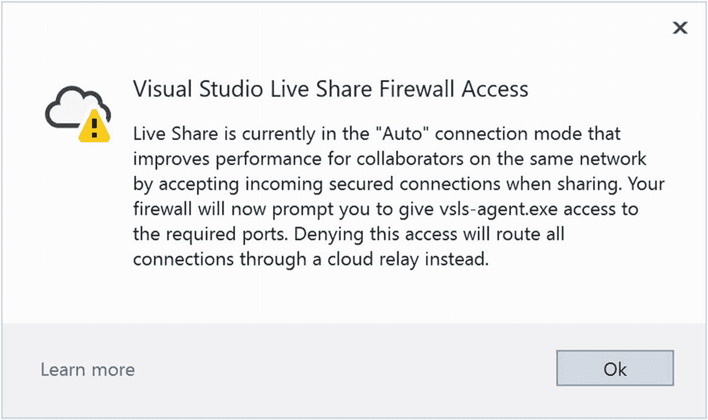

图 6-3

实时共享防火墙访问对话框

如果您点击 Ok，那么您将几乎立即看到如图 6-4 所示的对话框。

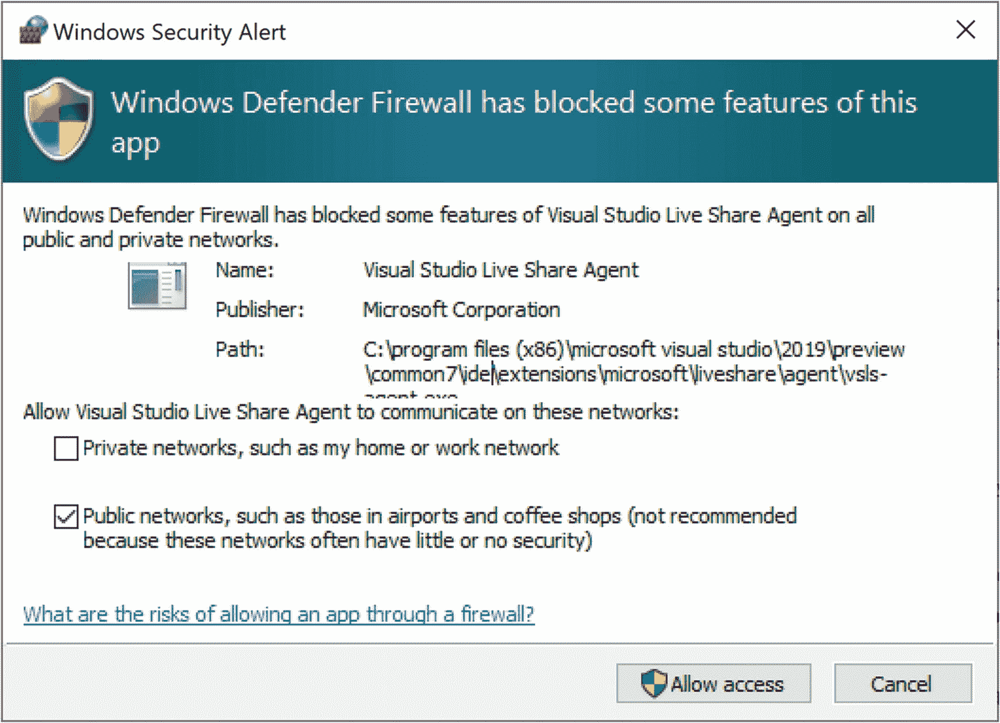

图 6-4

用于实时共享的 Windows 防火墙警报

此对话框由 Windows 防火墙显示，它表示由名称、发行者和路径详细信息描述的应用正在请求访问。在这种情况下，代理用于托管实时共享。单击“允许访问”会打开必要的端口。

如果您使用不同的防火墙或安全包，您在图 6-3 后看到的对话框可能会有所不同。或者您可能要求管理员通过全局设置打开端口。请记住，出现这些对话框是因为实时共享模式是自动的。可以通过 Live Share Settings(实时共享设置)屏幕更改默认设置，本节稍后将对此进行介绍。

配置端口访问后，实时共享会话将开始。设置可能需要几分钟时间，这取决于您的计算机和网络连接的速度。但是一旦它开始运行，你的 Visual Studio 将看起来类似于图 6-5 。

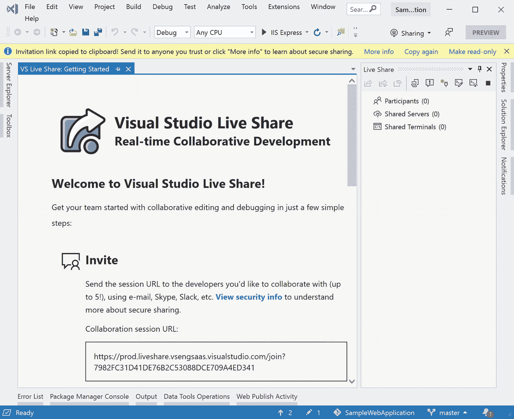

图 6-5

运行实时共享的 Visual Studio

第二次及以后共享时，您将看不到“入门”窗口。相反，只显示“实时共享”窗格(在右侧)和邀请链接消息(黄色，紧靠工具栏下方)。但是，您可以通过单击邀请链接消息中的“更多信息”标签来取回它。

除了显示入门页面，邀请链接消息也是在列表共享会话开始时获取您可能感兴趣的信息的快捷方式。默认情况下，可用于加入会话的 URL 会粘贴到剪贴板。这样，您可以不费吹灰之力就将链接发送给任何可能感兴趣的人。在链接消息中，您可以使用“再次复制”链接将链接重新添加到剪贴板。您也可以使用“设为只读”链接将会话转换为只读。

但是邀请链接消息只是一种方便。功能的真正来源在实时共享窗格中。图 6-6 显示了与一个参与者(即除主持人之外的一个参与者)的活动会话的实时共享窗格。


图 6-6

活动托管会话的实时共享窗格

窗格的主体是会话中的活动参与者、服务器和终端的列表。每个标题下列出了每种类型组件的实例。然而，当谈到您可以采取的行动时，大多数功能都在工具栏中。除了两个例外，它们将在接下来的章节中讨论。

两个例外是最右边的图标(红色方块)和分隔线右边的图标(看起来像复制图标和链接图标的组合)。方形图标用于终止实时共享会话。复制链接图标用于将用于连接到实时共享会话的 URL 的副本放置到剪贴板上。然后，可以通过任何方式(电子邮件、Skype、团队、Slack 等)将该 URL 发送给任何有兴趣加入该会话的人。)你更喜欢。

尽管并非所有功能都可用，但实时共享窗格对参与会话的每个人都可见。

作为实时共享会话的主持人，每当被邀请人加入您的会话时，您都会收到通知。您会在 Visual Studio 的右下方看到通知(图 6-7 )。


图 6-7

你收到通知了

通知本身(图 6-8 )显示了加入者的姓名和电子邮件地址。

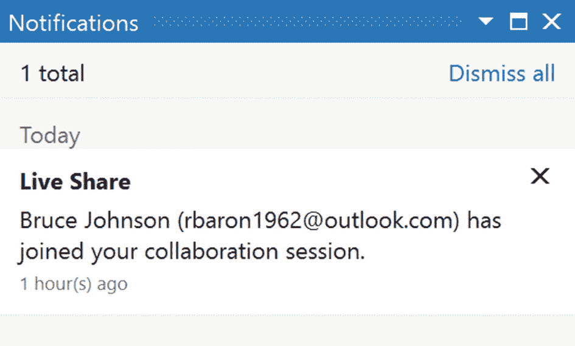

图 6-8

当某人加入实时共享会话时出现的通知

“实时共享”部分的其余部分介绍了会话活动时可用的不同协作工具。

### 实时编辑

人们可以很容易地将实时编辑(或协同编辑)描述为实时共享的基本功能。前提很简单。您可以近乎实时地看到会话中每个人的更改、选择和光标定位。当有人打开文件时，该文件将在您的 Visual Studio 实例中打开。当有人做出更改时，该更改会出现在您的编辑器中。同样，您也可以获得参与者的姓名。图 6-9 提供了一个 Visual Studio 的两个实例的例子。

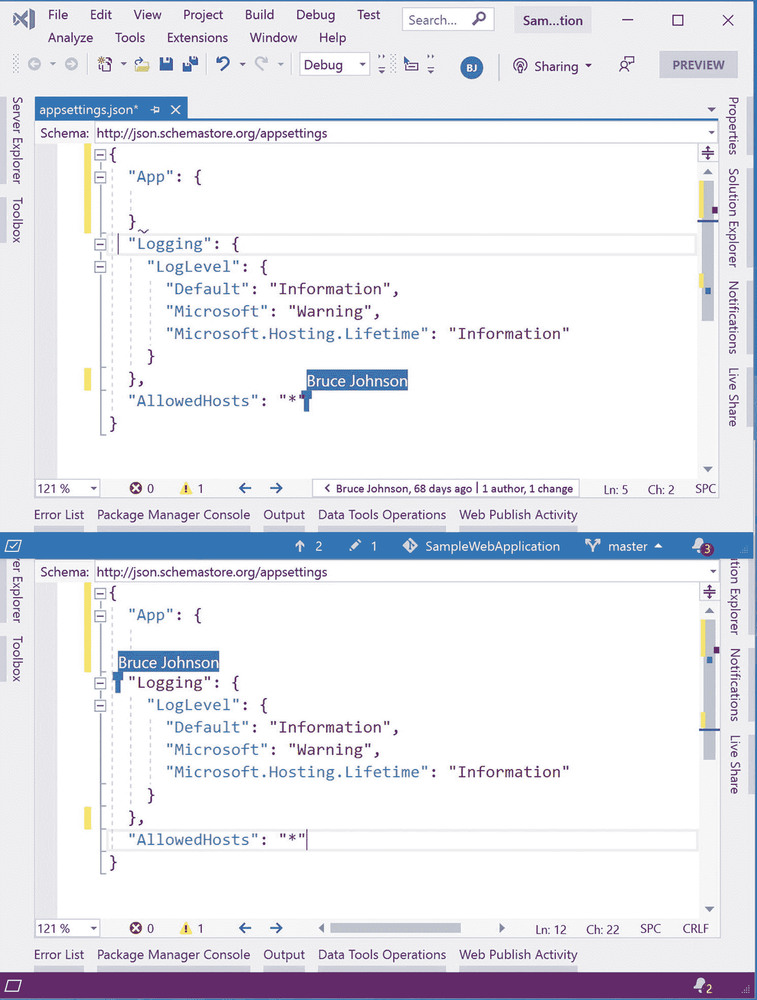

图 6-9

在多个 Visual Studio 实例中进行实时编辑

尽管图 6-9 中的两个 Visual Studio 实例都是由同一个人(可能是作者)运行的，但其目的是演示每个人在实时编辑时看到的内容。

对于 top 实例，光标位于以`"Logging"`开始的行的开头。这在底部实例中由一个看起来像胖 t 形的蓝色指示器表示。当您将鼠标悬停在指示器上时，光标所在的参与者的姓名会显示为工具提示。

在底部实例中，光标位于最后一行的末尾。您可以看到在顶部实例中用 T 指示器表示。

通过这个简单的界面，每个参与者都可以看到其他人在做什么。除了光标定位之外，一个参与者所做的选择也会显示给其他参与者，如图 6-10 所示。

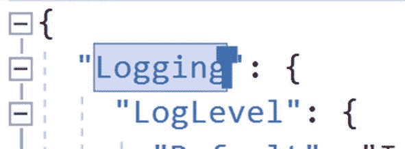

图 6-10

协作选择

与选择一样，一个参与者所做的任何编辑对所有其他参与者几乎实时可见。如果你在一个高速网络上工作，“接近实时”是足够接近的，就好像你的同事在你的屏幕上编辑的同时在他的机器上打字。

### 专注并跟随

Live Share 有一个关注一个参与者的概念。如果您跟随一个参与者，这意味着无论那个人在 Visual Studio 中做什么，您的 Visual Studio 实例都会跟随。这包括编辑、光标放置、选择和导航到其他文件。


图 6-11

关注实时共享中的参与者

图 6-11 展示了两种不同的方式来查看您当前关注的人。在 Visual Studio 右上角的工具栏中，有一个圆圈集合，每个参与者一个。它们包含参与者的姓名首字母，但是如果您将鼠标悬停在它们上面，则可以看到全名。

BJ 参与者周围的双圆圈表示您当前正在关注此人。您可以随时通过点按圆圈或点按另一个参与者的圆圈来停止关注。

与工具栏一样，实时共享窗格也显示您当前关注的人。其他每个用户都可以在参与者节点下的列表中看到。每个名字旁边都有一个圆圈。如果圆圈是空的，那么你没有跟随那个人。如果圆圈有一个中心点(如图 6-11 所示)，那么你正在跟随那个人。您可以通过单击其他参与者来更改您关注的人。或者，您可以通过点按某人的姓名来停止关注他。还有上下文菜单选项来关注和取消关注个人。

如果您正在进行实时共享会话，有时您可能希望其他参与者关注您正在做的事情。这是通过一个叫做聚焦的特性来实现的。您向每个参与者发送通知，请求他们跟随您。

您可以通过两种不同的技术发送焦点通知。首先，在 Visual Studio 右上角的工具栏中，有一个标记为“共享”(如果您是主持人)或“加入”(如果您是参与者)的下拉列表。此下拉列表包含许多实时共享命令的执行点。在这种情况下，从下拉列表中选择焦点参与者。这将生成一个发送给每个参与者的通知(见图 6-12 )。


图 6-12

焦点通知

除了通知之外，参与者还会被自动设置为关注您。自然地，他们总是可以选择不跟随，使用前面段落中提到的技巧。

### 联合调试

Live Share 提供的更有用的特性之一是协作参与调试会话的能力。启动联合调试会话就像在 Visual Studio 中启动调试会话一样简单。一旦宿主的调试器附加到进程，每个参与者的 Visual Studio 实例都将连接到调试会话。从参与者的角度来看，他们看起来和感觉起来都像是在本地调试。

当遇到断点时，每个参与者的实例也会停止。同样，这看起来像一个典型的调试会话。事实上，参与者可以像在本地运行调试会话一样探索与调试会话相关联的值。考虑图 6-13 中显示的两个 Visual Studio 实例。

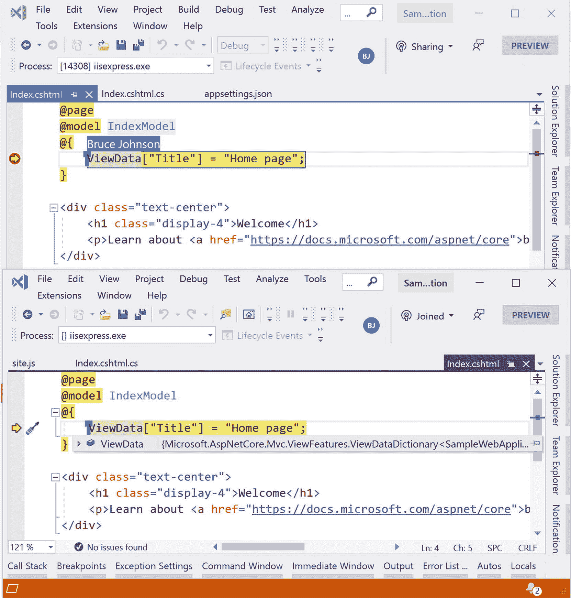

图 6-13

联合调试时的断点和显示值

托管会话是出现在图 6-13 顶部的实例。但是，在底部的实例中，将鼠标悬停在 ViewData 变量上会显示包含当前属性值的工具提示。

Note

对于参与者来说，调试会话中显示的属性值是不可修改的(与在本地运行时能够修改它们相反)。

在调试会话中，参与者可以设置断点、查看正在使用的变量值、查看调用堆栈以及导航到进程中的任何其他文件。换句话说，您可以自由探索不同的选项来帮助确定被检查问题的原因。

自动连接到主机的调试会话。也就是说，一旦为调试设置了主机，参与者就可以轻松地连接起来。有时候这种行为可能会适得其反。可以配置主机调试会话开始后发生的事情。单击工具➤选项菜单项，然后导航至实时共享(图 6-14 )。

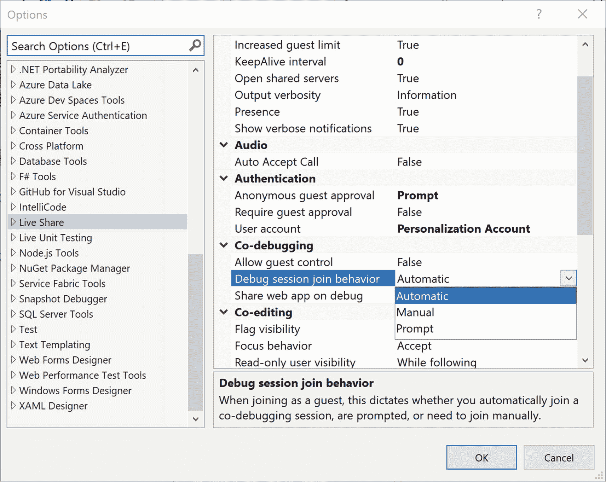

图 6-14

实时股票期权

调试会话加入行为选项有自动(默认)、手动(因此您必须使用下一段中描述的技术加入会话)和提示。

您可能没有连接到宿主的调试会话，因为您选择了“手动”选项，在出现提示时回答“否”,或者只是停止了调试会话(这将阻止您跟踪该会话，但该会话将对其他所有人继续进行)。如果您希望加入正在运行的调试会话，可以采用与启动本地调试会话相同的方式。在工具栏中，运行选项包括一个下拉菜单，为您提供了许多启动选项。图 6-15 举例说明了您在实时共享会话中的情况。

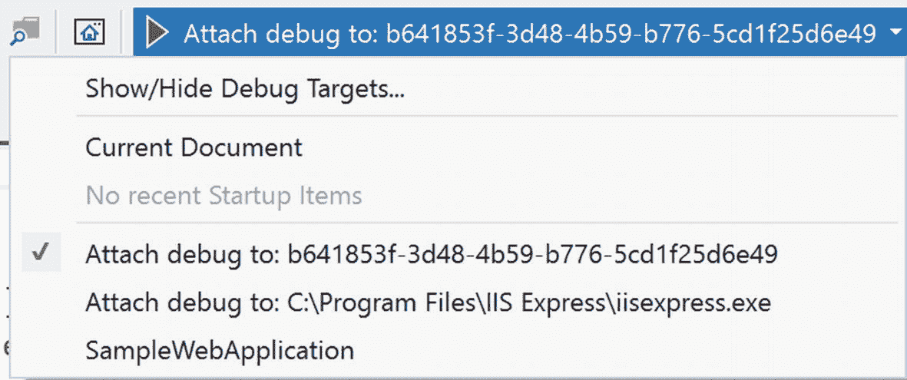

图 6-15

实时共享时运行选项

选择指示您正在附加到 GUID 的项目将使您加入实时共享调试会话。该 GUID 与链接中显示的 GUID 相同，该链接用于连接到实时共享会话。

### 共享服务器

现代应用可能是由不同服务器组成的复杂网络。认证服务器、微服务端点和基于 REST 的端点都可以是正在运行的应用的一部分。当让其他人参与调试过程时，允许实时共享参与者访问不同的端点会很有帮助。这样，他们就可以以类似于本地调试时的方式与应用进行交互。

当您为联合调试会话启动 web 应用时，web 服务器会自动与其他参与者共享。您可以在实时共享窗格中看到共享的服务器(图 6-16 )。

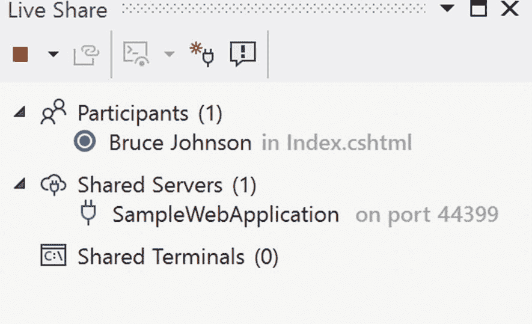

图 6-16

共享服务器的实时共享窗格

在本例中，名为 SampleWebApplication 的 web 应用在端口 44399 上可用。这意味着，如果参与者使用浏览器导航到`http://localhost:44399`，他们将访问运行在实时共享主机上的服务器。请注意，这也意味着它们会遇到在该服务器的执行路径中定义的任何断点。如果他们正在联合调试，他们会看到断点命中，但如果没有，参与者可能会等待很长时间的响应。

但是共享 web 应用端口并不总是足够的。主持人可以专门共享额外的服务器供参与者交互。这是通过使用管理共享服务器命令来完成的。您可以单击实时共享窗格工具栏中的图标(图 6-16 中右数第二个)或使用 Visual Studio 工具栏中的共享下拉菜单。共享的本地服务器如图 6-17 所示。

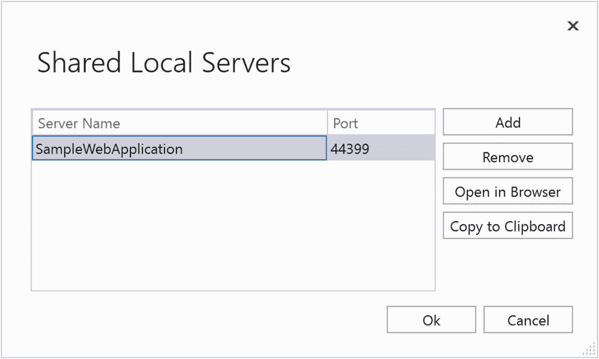

图 6-17

共享本地服务器对话框

此对话框用于管理主机上运行的服务器，这些服务器可供实时共享参与者访问。在捕获图 6-17 的图像时，SampleWebApplication 服务器正在运行。通过单击“添加”按钮，可以添加不同的服务器。您需要提供服务器的端口号和名称。添加服务器后，参与者将可以在实时共享窗格中看到该服务器。他们将能够通过浏览器或代码或任何他们喜欢的方法来访问它。

在此对话框中，您还可以删除共享服务器(通过选择然后单击删除)，在浏览器窗口中打开特定服务器，或将服务器的 URL 复制到剪贴板。

### 共享终端

有时，命令行功能可能需要由实时共享参与者使用或向他们演示。为了支持这一点，实时共享包括与参与者共享终端会话的能力。这意味着他们可以看到主机在终端窗口中输入的命令及其结果。这也意味着他们可以自己执行命令。

在这两种情况下，共享终端会话都是从主机环境中的两个位置之一开始的。在实时共享窗格中，单击共享终端图标(从右数第三个，见图 6-18 )并从两个选项中选择一个。

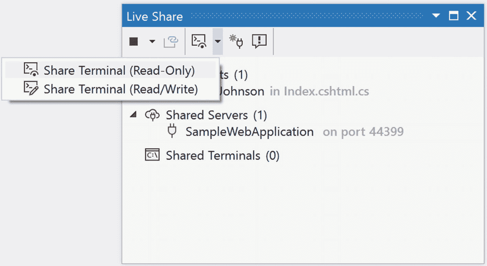

图 6-18

在“实时共享”面板中共享终端

或者，Visual Studio 工具栏中的共享图标包括图 6-18 中可见的两个选项。

你有两个选择。在第一个只读终端中，您与每个参与者共享终端窗口以及所有内容。但是您没有共享参与者执行命令的能力。使用第二个选项，读写终端，您允许参与者执行他们自己的命令，完成该功能的所有潜在安全隐患。

无论选择哪种方式，共享终端都会打开一个单独的终端窗口。至少，这是 Visual Studio 的默认行为。由于 Visual Studio 不包括现成的集成终端窗口，因此需要一个单独的窗口。但是，您会在工具栏下方看到一个通知(如图 6-19 所示)。


图 6-19

终端共享通知

通知消息中的一个链接 Install integrated terminal 会将您引导到 Visual Studio Marketplace，在那里您可以安装 Whack Whack 扩展，这是一个用于 Visual Studio 的集成终端窗口。

### 实时共享的安全性

作为联合调试功能的一部分，实时共享参与者可以访问命令和即时窗口。从联合调试的角度来看，这提供了更接近本地调试的丰富调试体验。绝对是加分项。从安全角度来看，有点不一样。当您在联合调试会话中使用这些窗口时，命令正在主机的计算机上执行。这种访问的安全后果应该显而易见。参与者可能有权使用会话主机的授权来执行他们想要的任何命令。这包括潜在的破坏性命令，如清除整个文件系统。因此，信任您邀请参加实时共享会话的人非常重要。

在实时共享会话中使用共享终端时，也会出现同样的安全问题。如果你想确保参与者不能在你的机器上执行命令，那就只共享一个只读终端。否则，您必须相信参与者在连接时不会恶意行为。

同样，在实时共享会话中进行编辑时，参与者可以看到共享项目的整个文件树。参与者不需要跟着你，允许他们随意在树中导航。如果文件中嵌入了秘密(如服务器或数据库密码)，参与者就可能发现它们。

就文件访问而言，降低一些风险是可能的。`.vsls.json`文件包含用于控制参与者对文件的访问权限的设置。下面是一个`.vsls.json`文件的例子:

```
{
    "$schema": "http://json.schemastore.org/vsls",
    "gitignore":"none",
    "excludeFiles":[
        "*.cer",
        "*.config",
        ".gitignore"
    ],
    "hideFiles": [
        "bin",
        "obj"
    ]
}

```

文件中有三个属性用于控制访问:

*   exclude filles`–`定义了不允许参与者打开的文件和文件夹列表。这种限制包括您可能希望能够访问这些文件的情况，例如当您在调试会话期间单步执行某个文件时。这样做的目的是包含参与者永远看不到的文件。

*   hideFiles `–`定义了在树中不可见的文件和文件夹列表。但是，如果文件是通过导航出现的(比如找到一个定义)，或者是在调试过程中出现的，参与者将能够导航到这些文件。

*   默认情况下，`.gitignore`文件中的文件被视为隐藏。但是，您可以使用该属性来更改该行为。可能的值如下:
    *   none`–``.gitignore`内容对项目树中的可见内容没有影响。

    *   隐藏`–``.gitignore`内容被视为`hideFiles`属性的一部分。

    *   排除`–``.gitignore`内容被视为`excludeFiles`属性的一部分。

对`gitignore`属性使用 exclude 选项有一个潜在的问题。通常，`node_modules`目录包含在`.gitignore`文件中。但是在试图隔离行为时，调试到`node_modules`中的文件中可能是有用的。为了缓解这个问题，Live Share 支持否定`.gitignore`中定义的可见性的能力。例如，下面的`.vsls.json`文件仍然允许您调试到`node_module`文件中，即使它们已经被排除在`.gitignore`文件之外:

```
{
    "$schema": "http://json.schemastore.org/vsls",
    "gitignore":"exclude",
    "excludeFiles":[
        "!node_modules"
    ],
    "hideFiles": [
        "node_modules"
    ]
}

```

还要注意在`hideFiles`属性中使用了`node_modules`。排除和隐藏逻辑是彼此独立处理的。因此，这个设置将允许`node_modules`文件从解决方案树中隐藏(以减少混乱)，但仍然允许文件被查看或进入。

## 摘要

协作无疑是 Visual Studio 2019 新增功能的一个重点。特别是在解决特别有害的 bug 时，现场分享有很大的帮助潜力。在这个问题上有多只眼睛是好的。当你调试得更好的时候，让别人监督你。允许参与者在调试的同时戳戳你的代码，这提供了高度的灵活性，这正是解决挑战性问题所需要的。

然而，联合调试选项并不是 Visual Studio 2019 中添加的唯一调试功能。在下一章中，我们将会看到一些已经添加的其他调试功能，所有这些功能都是为了使问题的跟踪变得更加容易。