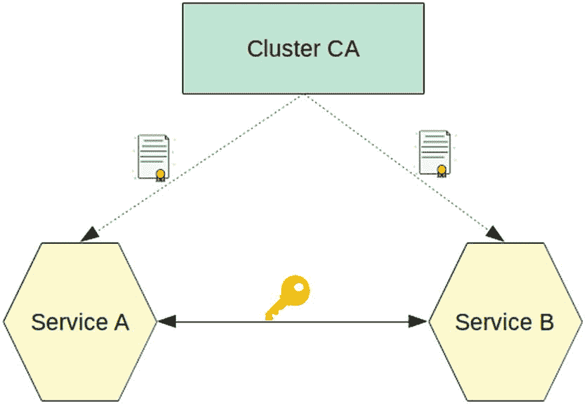
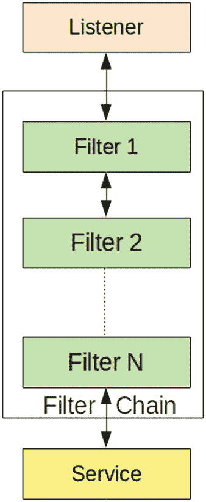

# 二、服务网格简介

在前一章中，我们快速浏览了 Kubernetes，容器编排引擎。有效利用这样的基础设施需要采用基于微服务的应用架构。但是这种类型的体系结构带来了一系列新的开发和操作挑战。在本章中，我们将讨论服务网格如何帮助减轻这些挑战。

## 微服务架构

整体架构是传统上使用的开发模型。在整体架构中，完整的软件是一个统一的、自包含的应用。应用具有离散的子系统/功能，这些子系统/功能与应用的其余部分紧密耦合。对应用的一部分进行更改需要发布完整的软件。见图 [2-1](#Fig1) 。


图 2-1

整体建筑

这种系统的一个例子是负责以下功能的交易应用:

*   使用桌面客户端的交易捕捉系统。这些客户端也被称为*应用视图*。可以有使交易者能够使用基于浏览器的用户界面的网络视图。该系统负责运行一些验证，然后在系统中预订交易。这些验证使用规则引擎来表达和执行。

*   一个移动应用和一个基于浏览器的交易记事本。记事本显示当前已登记的交易。此外，应用可以有一个移动视图，用于查看可用的报告。

*   浏览器中显示的交易风险分析报告。风险子系统显示交易记账后近乎实时的风险敞口。

*   一种转账系统，用于将资金从系统中的一个账户转移到另一个账户。

*   一种资产分配系统，用于在当前可用的不同投资工具之间分配资金。

*   用于定义应用使用哪些金融工具的工具和市场黄金来源(称为*参考数据*)。这有助于直接选择具有别名的工具/市场，而不是每次都提供完整的细节。

除了这一组主要功能之外，还有其他功能，如风险警报、图书验证等。所有这些功能都作为一个软件应用进行编译和部署。

monolith 应用从小型开始。因为完整的应用具有很高的内聚性，所以在早期阶段，一切都可以快速开发。完整的应用更容易部署和测试，因为它是一个单一的单元。

但是随着应用的有机增长，维护和操作变得更加困难。随着时间的推移，这样的应用通常由多个开发团队维护。这些团队负责应用的每个子系统。这些子系统高度耦合，经过一段时间后，开发团队会相互依赖以提供新的功能。但是由于只有一个单位，每个团队都面临以下一系列问题:

*   **快速特性推出**:团队是相互依赖的，所以他们很少能独立发布特性。通常这样的应用发布是一个大的协同工作，一个季度只能做几次。

*   **弃用的栈**:由于技术被广泛使用，一个团队很少能独立地改变/更新一个子系统。它通常需要完全重写多个子系统，这对业务来说是有风险的。

*   **陡峭的学习曲线**:由于整个系统是紧密耦合的，没有一个开发人员可以在不了解其他子系统的情况下工作。这导致新开发人员的学习曲线很陡。通常这样的应用有一个大的代码库，而开发者只对特定的子集感兴趣。这导致整个开发周期缓慢。

*   **缩放问题**:monolith 应用只能垂直缩放。如果一个特定的子系统上有大量请求的负载，就不可能部署更多的子系统单元或者只扩展特定的子系统。对于 monolith 应用来说，这是一个要么全有要么全无的场景，而且这通常是一件非常昂贵的事情。

通常，这些挑战要求组织考虑其他模式。微服务架构是整体架构的替代方案。这通常需要将应用分解成各种独立的、松散耦合的单元。目标是拥有独立的业务服务，具有定义良好的接口和操作。这些服务中的每一个都有自己独立的上下文。这些服务可以与其他服务交互来执行所需的任务。回头看看我们的贸易处理应用，可以为风险计算、贸易转移和黄金数据源构建单独的服务。此外，还可以有报告服务，这些服务使用来自每个基本服务的数据来提供正确的报告。可以使用另一组服务将报告呈现给 Web 和移动设备。因此，完整的整体可以分解成不同的部件，如图 [2-2](#Fig2) 所示。


图 2-2

微服务架构

采用这样的架构不仅需要软件设计的改变，还需要组织交互的改变。团队从这样的应用设计中获得了以下好处。

### 灵活

敏捷性是组织采用微服务架构的最大驱动因素之一。该架构提供的松散耦合允许加速开发。该模型指示小型独立开发团队在其定义的边界内工作。每个团队都可以在各自的环境中完全自由地工作。这加快了开发速度。

该架构还提高了弹性和故障隔离。在出现故障的情况下，故障可以被定位到一个特定的服务。因此，系统的其余部分可以正常运行，从而延长了正常运行时间。特定的服务可以独立地固定和部署，从而获得更好的服务质量。

### 创新ˌ革新

微服务架构促进小型独立开发团队在其服务边界内完全自主地工作。这些团队负责保持他们的系统始终正常运行。这导致了组织内的服务所有权文化。

开发团队通常很清楚他们的服务缺点。服务所有权导致关于解决服务问题的自主决策。他们可以修复问题，并根据他们的服务里程碑部署改进的服务。他们完全有权为此选择适当的工具和框架。这最终导致组织的技术栈和创新得到改进。

### 可量测性

在整体系统中，随着负载的增加，并不是所有的子系统都成比例地增加流量。通常情况下，系统的某些部分会获得更多流量，从而影响服务性能。通常它是控制整个系统性能的服务的子集。因此，整个系统的负载增长在其所有子系统中并不是线性的。但是，当一个整体系统处于负载状态时，可以通过添加更多的硬件来扩展系统。这通常会导致额外硬件的利用不足，因为我们需要为完整的软件添加更多的硬件，而不仅仅是为负载下的子系统。

微服务提供的分离使组织能够了解每个微服务所服务的流量。开发人员可以根据需求做出独立于服务的决策，并提高效率。他们可以采用适当的编程语言和框架，用尽可能好的配置进行微调，并部署到生产中。此外，在加载时，是按需扩展服务的底层硬件，而不是扩展整个生态系统。

### 可维护性

如前所述，使用 monolith 软件有一个陡峭的学习曲线。通常有一些部分是当前团队中没有人理解的，团队在处理这些部分时会感到不舒服。这通常被称为*技术债务*。解决整体架构中的技术债务是困难的，因为人们可能害怕破坏其中一个工作特性。曾经有过不需要的死代码通过解决特定整体架构中的技术债务而复活的例子。

微服务架构遵循分而治之的原则，有助于缓解这一问题。好处可以与面向对象的应用设计联系起来，在面向对象的应用设计中，系统被分解成对象。每个对象都有一个定义好的契约，可以改善整个系统的维护。开发人员可以对每个被重构的对象进行单元测试，以验证其正确性。类似地，围绕业务上下文创建的微服务也有定义好的契约。开发人员可以在验证服务契约的同时解决服务的技术债务。

### 挑战

微服务解决了整体架构的一些现有问题，但也带来了新的挑战。意识到这些挑战是很重要的。微服务将单个系统分解成分布式系统。分布式架构需要仔细建模。必须注意各种故障点，微服务也不例外。在 20 世纪 90 年代末，詹姆斯·高斯林编制了一个错误假设的列表，这些假设会使分布式系统效率低下、不安全、更难维护。让我们在微服务架构的背景下讨论它们。

#### 网络是可靠的

根据墨菲定律，“任何可能出错的事情都会出错。”

在分布式体系结构中，有许多移动的部分，其中一个服务随时都有可能失败。故障可能是由软件问题、硬件故障(如网络交换机)或 DNS 问题引起的。这将导致消费者服务的交付失败，并可能导致系统的陈旧状态。作为软件设计师，我们需要通过在系统中放置足够的冗余来准备处理这样的场景。

具体来说，对于云原生微服务，Kubernetes 为这一挑战提供了开箱即用的解决方案。我们通常使用复制因子将服务部署到 Kubernetes 集群。Kubernetes 确保以指定的冗余部署服务，并且在出现故障的情况下，所有服务调用都被路由到部署在集群中的辅助服务。与此同时，Kubernetes 试图引入一个新的实例，并为上述服务维护复制因子。让我们看一个示例 Kubernetes 配置。

```
---
apiVersion: extensions/v1beta1
kind: Deployment
metadata:
  name: spring-gs
spec:
  replicas: 1
  template:
    metadata:
      labels:
        app: spring-gs
        version: v0.1.0
    spec:
      containers:
      - name: spring-gs
        image: k8s-sample /spring-gs:0.1.0
        imagePullPolicy: IfNotPresent
        ports:
        - containerPort: 8080
 ---

```

在之前的配置中，我们已经指定了`replicas : 1`。这将确保 Kubernetes 部署至少两个服务实例。这种机制是用于从应用崩溃中恢复的服务器端解决方案。在客户端，我们需要添加一个重试机制来处理网络故障。在客户端完全丢弃请求之前，请求必须发送几次。这样，应用将能够处理瞬时故障。这只是一个例子；作为微服务架构采纳者，我们需要在构建服务时添加所需的弹性模式。

#### 延迟为零

如今，每种语言都为 web 服务/远程调用生成存根。生成的客户端屏蔽了调用函数调用所需的样板逻辑。但与此同时，开发人员有时会认为客户端调用与本地服务调用是同等的。这不是真的；网络电话比本地电话慢得多。如果处理不当，它会阻塞应用很长时间。服务中断是很少发生的极端情况。更常见的情况是，由于负载，服务响应缓慢。测试服务响应延迟非常困难。在一个单元测试案例中，大多数外部依赖都被嘲笑；因此，为此构建一个测试需要一定程度的开发人员成熟度。在没有足够负载复制的验收环境中，这是非常困难的。

Michael Nygard 提出的断路器模式旨在处理这些场景。该模式就是将远程函数调用封装在一个跟踪失败的对象中。如果有更多的失败，那么服务不再调用外部调用；相反，它会立即返回一个错误代码。断路器在以下三种状态下跟踪连接(见图 [2-3](#Fig3) ):


图 2-3

断路器状态

*   **关闭**:这是外部服务调用工作正常，没有任何故障报告的状态。断路器记录故障。这使得断路器对服务性能波动更有弹性。但是当故障数量超过阈值时，断路器跳闸，进入断开状态。

*   **打开**:在这种状态下，断路器返回错误，不调用外部调用。

*   **半开**:经过配置的时间间隔后，断路器进入半开状态，验证外部调用是否仍然失败。如果在这种半开状态下呼叫失败，断路器将再次跳闸。如果成功，断路器复位到正常的闭合状态。

有效的断路器策略对于发布现有服务的新版本也是必不可少的。一次性升级整个系统是徒劳的。往往会导致大量的开销。相反，对现有服务进行定期滚动更新要有效得多，但这只有在相关服务以有效的方式处理故障时才有可能。采用微服务架构的团队需要接受停机，并且不能将其视为极端情况。如果得不到解决，这些故障会在整个生态系统中产生连锁反应。这将导致大量不必要的服务高峰。

缓存应用数据是我们处理故障的另一种方式。这适用于我们可以操作陈旧数据的情况。应用可以缓存它们收到的最后一个响应。下一次调用可以获取新数据，也可以提供旧的缓存数据。

#### 带宽是无限的

在微服务架构中，我们在生产中部署的服务数量呈指数级增长。通常，每当我们处理一个新的用例时，我们会问我们是否需要一个新的服务，或者功能是否可以构建在现有的服务中。在绿地案例中，我们更经常得出的结论是将其构建为一项新服务。但是这对于现有的部署服务来说是有成本的。假设有一个 SSO 服务；如果每个新服务都调用 SSO 验证，SSO 团队就会开始遇到问题，如果有一个流氓服务的话。为了克服这个问题，应用需要有一个配额分配和消耗跟踪的机制。

爆炸式增长也给服务器端负载均衡器带来了问题。负载均衡器中的大量调用通常会使它们的流量饱和，从而降低它们的性能。面对这种情况，客户端负载均衡通常是一个好方法。

#### 网络是安全的

在像微服务这样的分布式架构中，安全的责任在每个团队身上。首先，有许多技术选择，因此团队需要跟踪每个技术中的 bug 修复/问题。这些技术都必须正确配置，以避免任何安全问题。第二，需要控制军种间的通信。服务级授权是过滤掉虚假或未知服务连接的必要条件。此外，执行纯文本交换的应用会暴露敏感数据。因此，需要使用安全协议进行通信。

#### 拓扑不会改变

敏捷性是采用微服务架构的原因之一。敏捷性意味着能够快速构建、发布和部署。这意味着依赖服务之间的低耦合。这说起来容易做起来难。假设由于负载，一个现有服务的新实例被部署到生产中。其他服务必须连接到这个新的动态添加的实例。这反过来意味着服务不再有硬编码/固定的依赖关系地址位置。需要一种有效的服务解析机制来帮助确定服务的当前位置。

添加服务发现的功能还可以提高整个系统的弹性。在生产中，会有意想不到的失败。系统停机，拓扑结构发生变化。服务发现使所有正在运行的服务能够发现这些变化，而不是痛苦地对它们进行配置更改。

#### 有一个管理员

在使用微服务等分布式系统时，操作是另一个需要关注的领域。传统上，只有一个系统可以由几个人监控和管理。但是一旦微服务出现爆炸式增长，这种模式就失效了。少数人几乎不可能对生态系统中运行的所有微服务拥有完整的运营知识。微服务旨在让团队自治。因此，每个团队负责维护和管理他们自己的服务。这要求为每个团队成员提供生产系统访问权限。因此，为了在这种方法中获得成功，需要有效的基于角色的访问，这可以联合到开发团队中。

#### 运输成本为零

在微服务中，我们会对依赖服务进行大量调用。值得注意的是，数据交换会产生成本。数据必须在一端序列化，在另一端反序列化。因此，成本取决于消耗的 CPU 资源和传输的数据量。通信协议对我们的服务性能有影响。像 SOAP/XML 交换这样的传统协议效率非常低。JSON 被认为是比 SOAP 更好的选择。但是像协议缓冲区这样的二进制协议已经胜过了 JSON。考虑到信息交换发生在应用之间，最好为完整的生态系统选择一个二进制协议。

#### 网络是同构的

如果一个网络在所有系统上运行相同的一组硬件，并且所有应用都按照标准协议进行通信，则该网络被归类为同构网络。在所有系统上运行相同的硬件几乎是不可能的，但是使用 Kubernetes，我们可以限制资源，以便每次部署应用容器时，它都获得相同数量的资源。

```
apiVersion: v1
kind: Pod
metadata:
  name: frontend
spec:
  containers:
  - name: gs
    image: istio-ks/spring-gs
    resources:
      requests:
        memory: "64Mi"
        cpu: "250m"
      limits:
        memory: "128Mi"
        cpu: "500m"

```

在前面的代码中，`spring-gs`应用容器请求指定数量的 CPU 和内存资源。它还定义了 CPU 和内存消耗的上限。

同样，不可能为整个生态系统运行单一的通信协议。这种想法对于独立自主团队的微服务哲学来说是徒劳的。

James 指出，构建一个分布式系统而不明确处理这些问题是失败的。企业级系统在所有这些方面总是会有问题。因此，缓解这些挑战对于成功采用微服务架构至关重要。除了早期的通用分布式系统挑战之外，微服务还有自己的一系列问题。这些问题是由于敏捷和自治团队的哲学。

#### 基础设施

微服务架构比整体架构复杂得多。有许多移动部件，每个部件都依赖于一个或多个微服务。由于每个团队都可以选择他们的微服务背后的技术，因此支持所有这些基础架构要求是一项挑战。

基础架构团队首先需要找到以经济高效的方式按需配置基础架构的方法。在微服务采用之旅中，随着我们部署更多服务，硬件需求也会增加。微服务规定的粒度使我们能够在加载时扩展单个服务。要做到这一点，基础设施应该在需要时可用。基础设施不再像 monolith 版本那样成为瓶颈。

配置硬件不仅仅是让它可用。这也是关于获得正确的库和框架集。技术的广泛选择使得在不中断现有服务的情况下支持新需求变得非常困难。开发和基础设施团队之间需要更紧密的协作。

#### 监控和调试

监控微服务与监控整体架构完全不同。用于监控整体架构的技术不适用于微服务。一个功能有许多活动部件。因此，它需要更加自动化。获取有效的指标也是一个重要的方面。这影响了服务如何扩大或缩小。随着服务规模的扩大或缩小，监控应该能够发现它们并采取相应的措施。

传统的日志处理机制不能很好地处理微服务。首先，整个系统完成了更多的日志记录。需要有效的日志归档，因为系统会很快耗尽空间。其次，我们必须能够快速查找和关联多个服务之间的日志。在生产中断的时候，我们确实希望处于一个很难将两个相互依赖的服务联系起来的位置。

至此，我们已经讨论了主要的运营挑战。我们将寻找解决问题的方法。还有其他挑战，如服务测试方法、知识分布等。这些挑战超出了本书的范围。如果我们仔细观察，就会发现所有的运营挑战都与联合应用体系结构和传统应用管理方法之间的不匹配有关。实现像 Kubernetes 这样的容器编排器有助于解决一些与基础设施相关的挑战。团队可以使用 Kubernetes 快速提供资源。它可以帮助服务按需扩展。但它不能解决剩下的问题。需要更多的工具来有效地应对这些挑战。

### 语言库

在 21 世纪初，像网飞和 Twitter 这样的公司开始在他们的解决方案中采用微服务架构。他们面临所有之前讨论过的挑战。这些公司都开始构建工具和基础设施库来解决这些挑战。这些库由这些公司使用的技术组成；例如，网飞服务大多基于 Java，因此网飞创建了以下 Java 库来解决这些问题:

*   Eureka :这个工具旨在服务发现。它由两个组件组成:服务注册中心和服务客户机。bootstrap 中的服务使用服务客户端将它们注册到 Eureka 服务器。应用还使用服务客户机来发现它们的依赖关系的实例。

*   这个工具是一个 Java 库，提供服务交互之间的容错。

*   **Ribbon** :这个工具是一个支持客户端负载均衡的 Java 库。

*   这个工具是一个应用网关，支持基于服务发现的动态路由。

这些解决方案是在 2012 年左右开源的，并由开发人员进行了调整。随着时间的推移，Spring Boot 被释放，这些项目与它合并为春云网飞。

现在让我们用这些库构建一个简单的微服务示例。

#### 实践示例

这本书遵循实践的方法，你将通过一个例子来学习。我们选择了一个简单的例子来理解前面讨论的问题。关于这些库的深入细节超出了本书的范围。

我们将构建一个简单的问候服务。这项服务有一个简单的选项。我们可以使用一个`userName`来调用服务，它将用一个问候来响应指定的用户。因此，作为契约，用户可以调用下面的 HTTP GET 调用:`http://localhost:8080/greeting/Rahul`。该服务将使用以下响应进行响应:

```
Hello ! Rahul

```

为了让解决方案工作，我们必须做一些基本的设置。在您的计算机上安装以下软件:

1.  **Java** :我们需要 Java 8 或以上版本。请从甲骨文官方网站 [`http://www.oracle.com/technetwork/java/javase/downloads/index.html`](http://www.oracle.com/technetwork/java/javase/downloads/index.html) 下载 Java 的最新更新。在撰写本文时，最新的 Java 版本是 12.01。您可以通过运行以下命令来检查您的 Java 版本:

    ```
    $ java --version
    openjdk 11.0.3 2019-04-16
    OpenJDK Runtime Environment (build 11.0.3+7-Ubuntu-1ubuntu218.04.1)
    OpenJDK 64-Bit Server VM (build 11.0.3+7-Ubuntu-1ubuntu218.04.1, mixed mode, sharing)

    ```

2.  **IDE** :本章的代码是用 IntelliJ 构建的。但是您可以使用自己选择的任何 Java IDE。

3.  **Maven** : Maven 是 JVM 生态系统中流行的构建工具。它用于依赖性管理和运行自动化任务。您不需要在本地机器上安装 Maven。从 [`https://maven.apache.org/`](https://maven.apache.org/) 下载最新版本的 Apache Maven。要了解更多关于 Maven 的信息，可以参考 Maven 文档。您可以使用以下命令检查 Maven 版本:

    ```
    $ mvn -version
    Apache Maven 3.6.0 (97c98ec64a1fdfee7767ce5ffb20918da4f719f3; 2018-10-25T00:11:47+05:30)
    Maven home: /home/home/Tools/apache-maven-3.6.0
    Java version: 1.8.0_201, vendor: Oracle Corporation, runtime: /usr/lib/jvm/java-8-oracle/jre
    Default locale: en_IN, platform encoding: UTF-8
    OS name: "linux", version: "4.15.0-50-generic", arch: "amd64", family: "unix"

    ```

现在，我们已经具备了所有的先决条件，让我们使用下面的命令创建一个 Maven 项目:

```
$ mvn archetype:generate greeting-rest-service

```

现在更新`POM.xml`来添加 Spring Boot 依赖项。

```
<project xmlns:="http://maven.apache.org/POM/4.0.0" xmlns:xsi="http://www.w3.org/2001/XMLSchema-instance"
      xsi:schemaLocation="http://maven.apache.org/POM/4.0.0 https://maven.apache.org/xsd/maven-4.0.0.xsd">
      <modelVersion>4.0.0</modelVersion>

      <groupId>com.example</groupId>
      <artifactId>eureka-client</artifactId>
      <version>0.0.1-SNAPSHOT</version>
      <packaging>jar</packaging>

      <parent>
             <groupId>org.springframework.boot</groupId>
             <artifactId>spring-boot-starter-parent</artifactId>
             <version>2.1.4.RELEASE</version>
             <relativePath/> <!-- lookup parent from repository -->
      </parent>

      <properties>
             <project.build.sourceEncoding>UTF-8</project.build.sourceEncoding>
             <java.version>1.8</java.version>
      </properties>

      <dependencies>
             <dependency>
                   <groupId>org.springframework.boot</groupId>
                   <artifactId>spring-boot-starter-web</artifactId>
             </dependency>

      </dependencies>

      <build>
             <plugins>
                   <plugin>
                          <groupId>org.springframework.boot</groupId>
                          <artifactId>spring-boot-maven-plugin</artifactId>
                   </plugin>
             </plugins>
      </build>

</project>

```

在 POM 文件中，我们完成了以下操作:

*   添加`spring-boot-starter-parent:20104.RELEASE`为我们的家长。这确保我们获得所需 Spring Boot 依赖项的正确版本。

*   添加了`spring-boot-starter-web`作为开始，以确保我们拥有创建基于 REST 的服务所需的依赖关系。

*   添加了`spring-boot-maven-plugin`，它可以让我们通过使用`mvn spring-boot:run`从命令行运行我们的项目作为可执行文件。

现在，让我们以下面的方式为我们的功能添加一个 REST 控制器:

```
@RestController
class ApplicationRestController {

  @RequestMapping("/greeting/{user}")
  public String greeting(@PathVariable String user) {
    return "Hello! " + user;
  }
}

```

在前面的代码中，我们完成了以下工作:

*   创建了一个`ApplicationRestController`并用`RestController`对其进行注释，以提供 REST API 端点。

*   添加了一个问候方法来处理一个`"/greeting/{user}"`位置，并向它发回一个`String`响应。

要运行这个应用，我们需要添加以下主类:

```
@SpringBootApplication
public class ApplicationMain {

  public static void main(String[] args) {
    SpringApplication.run(ApplicationMain .class, args);
  }
}

```

在前面的代码中，我们完成了以下工作:

*   用`SpringBootApplication`注释对`ApplicationMain`进行了注释。它将用所需的配置引导 Spring。

*   main 方法使用带注释的 main 类调用`SpringApplication`。

现在让我们在 IDE (Eclipse/IntelliJ)中运行它。在浏览器中通过查找`http://localhot:8080/greeting/Rahul`进行验证。见图 [2-4](#Fig4) 。


图 2-4

问候服务输出

现在，我们有了一个简单的 REST 服务，可以用来体验网飞的各种图书馆。

#### 启用断路器

现在，让我们构建一个服务，它可以是我们的 web 服务的客户端之一。

```
@Service
class GreetingService {
  private final RestTemplate restTemplate;
  public GreetingService(RestTemplate rest) {
    this.restTemplate = rest;
  }
  public String greet(String username) {
    URI uri = URI.create("http://localhost:8080/greeting/"+username);
    return this.restTemplate.getForObject(uri, String.class);
  }

}

```

在前面的代码中，我们完成了以下工作:

*   添加了一个正在给我们的`greeting{User}`位置打休息电话的`GreetingService`。

*   `greet()`方法抽象了 REST 调用，使其看起来像是对其他组件的本地调用。

可以在测试中调用该方法，如下所示:

```
@Test
public void testGreetingService() {
  String response = greetingService.greet("user");
  then(response).contains("Hi! User");
}

```

在前面的测试用例中，我们调用了`greetingService`并验证了响应。但是，如果问候语服务不可用或面临性能问题，此测试将失败，并显示以下错误:

```
I/O error on GET request for "http://localhost:8080/greeting/user": Connection refused (Connection refused); nested exception is java.net.ConnectException: Connection refused (Connection refused)

      at org.springframework.web.client.RestTemplate.doExecute(RestTemplate.java:744)
      at org.springframework.web.client.RestTemplate.execute(RestTemplate.java:710)
      at org.springframework.web.client.RestTemplate.getForObject(RestTemplate.java:329)
      at hello.GreetingService.greet(RestTemplateClientTest.java:87)

```

现在让我们配置 Hystrix 断路器来处理这些常见的生产问题。在我们继续之前，我们需要添加`spring-cloud-starter-netflix-hystrix`依赖项。为此，按如下方式更新`POM.xml`文件:

```
<dependencyManagement>
   <dependencies>
      <dependency>
         <groupId>org.springframework.cloud</groupId>
         <artifactId>spring-cloud-dependencies</artifactId>
         <version>Finchley.SR2</version>
         <type>pom</type>
         <scope>import</scope>
      </dependency>
   </dependencies>
</dependencyManagement>

<dependencies>
.....
<dependency>
   <groupId>org.springframework.cloud</groupId>
   <artifactId>spring-cloud-starter-netflix-hystrix</artifactId>
</dependency>
...
</dependencies>

```

在前面的代码中，我们完成了以下工作:

*   添加了配置正确版本的`spring-cloud`依赖项的`spring-cloud-dependencies` BOM。

*   添加了`spring-cloud-starter-netflix-hystrix`依赖项。

现在让我们为`GreetingService`配置 Hystrix 断路器。

```
@HystrixCommand(fallbackMethod = "fallbackGreeting", commandProperties = {
        @HystrixProperty(name = "execution.isolation.thread.timeoutInMilliseconds", value = "1000")
})
public String greet(String username) {
  URI uri = URI.create("http://localhost:8080/greeting/"+username);
  return this.restTemplate.getForObject(uri, String.class);
}
public String fallbackGreeting(String username) {
  return "Hi! there";
}

```

在前面的代码中，我们以下列方式配置了 Hystrix 断路器:

*   我们通过使用`HystrixCommand`注释启用了断路器。

*   `fallbackGreeting`方法用于为故障提供回退方法。使用`HystrixCommand`的`fallbackMethod`属性进行配置。

*   我们通过使用`execution.isolation.thread.timeoutInMilliseconds`属性配置了一个超时。

现在，当我们运行测试用例时，我们不再看到异常。我们从`fallbackGreeting`方法而不是原始的 greet 方法获得响应。

#### 启用服务发现

现在让我们使用网飞尤里卡配置服务发现。第一步，我们需要运行尤里卡服务器。这是通过添加`spring-cloud-starter-netflix-eureka-server`依赖项来实现的。

```
<dependencies>
....
<dependency>
   <groupId>org.springframework.cloud</groupId>
   <artifactId>spring-cloud-starter-netflix-eureka-server</artifactId>
</dependency>
....
</dependencies>

```

现在，可以通过以下方式从 Spring Boot 应用启动 Eureka 服务器:

*   `EnableEurekaServer`注释启动了 Eureka 服务。

*   服务器可以配置以下附加应用属性:

```
@EnableEurekaServer
@SpringBootApplication
public class EurekaServiceApplication {

    public static void main(String[] args) {
        SpringApplication.run(EurekaServiceApplication.class, args);
    }
}

```

```
                          server.port=8761
             eureka.client.register-with-eureka=false

```

让我们运行应用并查找`http://localhost:8671/`。见图 [2-5](#Fig5) 。


图 2-5

用于服务发现的 Eureka 服务器

现在我们需要配置之前创建的 REST 服务，将这个 Eureka 服务器用于服务注册，然后将服务发现用于我们的`greetingService`。要启用服务注册，添加`spring-cloud-starter-netflix-eureka-client`依赖项。

```
<dependencies>
....
   <dependency>
      <groupId>org.springframework.cloud</groupId>
      <artifactId>spring-cloud-starter-netflix-eureka-client</artifactId>
   </dependency>
...
</dependencies>

```

这个依赖关系将使用配置的`spring.application.name`属性名来配置服务注册中心。启动服务并查找 Eureka 服务器。它列出了一个注册的服务。见图 [2-6](#Fig6) 。


图 2-6

尤里卡服务器注册的服务

现在，让我们在`greeting-rest-service`中使用`service-discovery`。我们有很多方法可以配置它。Spring Boot 提供了一个本地的`EurekaClient`来与 Eureka 服务器交互。或者，如果我们使用`restTemplate`，同样的事情可以通过使用网飞功能区启用客户端负载均衡来实现。

```
@Bean
@LoadBalanced
public RestTemplate restTemplate() {
  return new RestTemplate();
}
// Rest removed for Brevity
public String greet(String username) {
  URI uri = URI.create("http://A-BOOTIFUL-CLIENT/greeting/"+username);
  return this.restTemplate.getForObject(uri, String.class);
}

```

在前面的代码中，我们完成了以下工作:

*   用`LoadBalancer`注释对`RestTemplate`配置进行了注释。如果`spring-cloud-starter-netflix-ribbon`在我们的类路径中，这将启用功能区。

*   使用服务名而不是主机和端口地址来连接服务。首先在 Eureka 服务器中查找服务名，以确定注册服务的地址。

在上一节中，我们了解了网飞 OSS 如何利用微服务架构解决各种问题。类似地，谷歌和 Twitter 等其他公司也围绕 Stubby 和 Finagle 等框架构建了栈。

但是在使用基础设施库时会出现一些问题。首先，应用代码与其基础设施相结合。这使得服务依赖于基础设施组件。此外，由于每个调用都在应用中进行了微调，因此团队必须与运营团队合作来调整和微调超时。

潜在地，基础设施库使得应用团队很难更新他们的框架。此外，这些框架是面向语言的。网飞栈基于 Java，而 Twitter 基于 Scala。这些栈中的每一个都提供一组不同的功能。如果我们正在寻找一个在选择的栈中不可用的特性，我们不能改变它。因此，简而言之，如果我们真的想要选择技术的灵活性，那么我们就不能被这些框架所束缚。最后，围绕这些框架构建服务需要开发人员有一个学习曲线。参见图 [2-7](#Fig7) 。


图 2-7

特定于语言的库

## 服务网格

之前，我们讨论了采用微服务架构时面临的挑战。如果我们深入研究这些挑战，我们会发现它们与微服务业务逻辑无关，而是与服务之间的交互方式有关。在像 Kubernetes 这样的云原生生态系统中，这些挑战可以通过部署服务网格来解决。

服务网格被定义为以集成方式解决微服务网络挑战的分布式系统。完整的系统提供了与 Kubernetes 互补的功能。它建立在控制 Kubernetes 集群中所有服务交互的专用层的基础上。该层通常由与服务一起部署的轻量级网络代理组成，而服务并不知道它。参见图 [2-8](#Fig8) 。


图 2-8

服务网格

部署服务网格的目的是拥有一个能够主动监控所有服务流量的集成平台。这样，服务网格可以解决与容错、服务安全和应用监控相关的问题。正如上一节所讨论的，有一些独立的库可以解决这些问题。但是服务网格提供了一种新的非侵入性的方式，在云原生环境中高效地做事。与特定于语言的框架相比，服务网格解决了服务之外的挑战。服务不知道它们正在与服务网格一起工作。

服务网格是协议不可知的，并且在第 5 层上运行。这样，他们可以部署在一个多点环境中。这种抽象允许开发人员专注于他们的应用业务逻辑，并允许系统工程师有效地操作基础设施。这对两个人来说都是双赢。总的来说，服务网格解决了对这些挑战的担忧，并增加了以下好处。

### 交通控制

在整体应用中，交通流量是从北到南的方向。但是在微服务应用中，服务相互通信以提供完整的功能。因此，有更多的东西向交通。服务需要发现新部署的服务并将调用路由到它们。

在 Kubernetes 集群中，可以使用 DNS 解析部署的服务。Kubernetes 还充当负载均衡器，在所有可用的服务节点之间平均分配所有流量。当我们想要更新我们的服务时，这是非常有用的。我们可以通过一次更新一个实例来更新所有实例。但是 Kubernetes 不允许细粒度的流量控制机制，在这种机制下，流量可以使用各种其他方法进行路由。参见图 [2-9](#Fig9) 。


图 2-9

服务网格流量路由

另一方面，服务网格允许我们微调服务的每个已部署实例的流量。服务器网格能够查找第 7 层请求报头，然后将请求路由到特定的服务实例。这个黑暗启动/罐头厂部署的过程可以用来为一部分用户发布服务。这个过程允许我们在向整个用户群发布新版本之前获得对它的信心。这创建了从一个版本到另一个版本的平滑发布过程，如果新版本产生了新的错误或问题，可以自动回滚。

### 安全

服务级安全性是 Kubernetes 集群中拥有服务网格的另一个主要好处。部署在 Kubernetes 集群中的应用在继续之前执行基于 SSL 的握手。SSL 协议验证服务身份，并相应地对其进行授权。安全问题远远超出了 Kubernetes 的范围，Kubernetes 的目标是获得最大的服务正常运行时间。参见图 [2-10](#Fig10) 。



图 2-10

TLS 安全性

我们还可以应用一个细粒度的策略来查找应用用户属性。因为服务网格是建立在 L4 通信之上的，所以它可以应用所有的安全策略，而不需要理解服务协议。服务网格还允许我们配置速率限制，以便限制恶意服务用户。

### 分析学

服务网格允许我们系统地跟踪和关联各种服务之间的交互。它以请求时间表的形式呈现这些信息。这种能力被称为*追踪*。跟踪使我们能够调试请求如何从一个服务流向另一个服务。在 monolith 应用中，我们曾经有一个请求日志，它可以指向作为服务的请求。但是在每个服务调用下一个服务的服务网格中，很难调试请求生命周期。跟踪使我们能够重建请求流，并确定应用中的性能问题。见图 [2-11](#Fig11) 。


图 2-11

分布式跟踪

服务网格中的微服务通过转发跟踪上下文头来实现这一点。这样，分布式跟踪有助于可视化服务间的依赖关系。服务网格还捕获请求量和失败率方面的指标。

另一个重要方面是服务日志处理。在传统的应用中，通常有一个记录所有内容的日志文件。在微服务架构中，我们有许多服务日志记录，我们需要查找所有服务以了解适用的行为。服务网格提供集中式日志记录和基于日志构建的图形仪表板。其目的是在微服务中提供操作可见性。

总之，服务网格允许我们将基础设施从应用代码中分离出来。它还简化了底层网络拓扑，因为网络只提供物理连接。所有防火墙、负载均衡器和子网都可以删除，因为它们不想控制任何服务交互。相反，所有这些都可以使用服务网格来配置。

## 边车模式

服务网格通常是按照 Sidecar 模式实现的。如前所述，一个单独的进程，也称为 sidecar，与应用代码一起部署。这种样式被命名为边车，因为它类似于摩托车上的边车。sidecar 负责提供诸如联网、监控、跟踪、记录等功能。sidecar 依赖于父应用。它与父应用具有相同的生命周期。这样，我们可以跨不同的技术栈扩展应用，包括不提供可扩展性的遗留应用。

在 Kubernetes 集群中，sidecar 与集群中运行的每个服务一起运行。sidecar 代理进出该服务的所有流量。sidecar 与其他 sidecar 通信，并由 Kubernetes 框架管理。参见图 [2-12](#Fig12) 。


图 2-12

边车模式

值得注意的是，该模式适用于应用横切关注点，而不考虑任何性能开销。如果性能是一个考虑因素，那么该模式的网络开销将使它不适合。因为 sidecar 与父应用具有相同的生命周期，所以它与父应用一起扩展。该模式不允许孤立地向上扩展边车。在服务网格中，边车代理执行以下任务:

*   **服务发现**:代理确定可用的上游和下游服务实例的列表。

*   **健康检查**:代理检查服务发现返回的上游服务实例是否健康，是否准备好接受网络流量。这些检查可以包括对`/health`端点的查找。它也可以基于服务失败率(例如，使用三个连续的`5xx`值作为不健康状态的指示)。

*   **路由**:给定来自服务网格的服务对`/foo`的 REST 请求，代理确定它应该将该请求路由到哪个集群。

*   **负载均衡**:路由时一旦选择了上游服务集群，请求应该发送到哪个上游服务实例？代理还负责应用断路器(可能超时)并重试。

*   **认证和授权**:它通过使用 mTLS 或任何其他机制来验证服务交互。

*   **可观察性**:对于每个请求，都会生成详细的统计数据、日志记录和分布式跟踪数据，以便操作员能够了解分布式流量，并在出现问题时进行调试。

所有上述项目都是服务网状边车的责任。换句话说，sidecar 负责有条件地翻译、转发和观察流入和流出服务实例的每个网络数据包。sidecar 也称为服务网格数据平面。

## 特使，边车供应商

> 网络应该对应用透明。当网络和应用出现问题时，应该很容易确定问题的根源。
> 
> —特使设计目标

现在我们了解了 sidecar 的作用，让我们使用 Envoy 创建一个。Envoy 是用 C++编写的高性能 L7 代理和通信总线。它已经在大型的、现代的、面向服务的架构中经受了考验。特使架构具有以下优势:

*   用本地语言编写的高度优化的进程外服务代理

*   可插入 L3/L4，对收到的 TCP 消息执行各种任务

*   可在 HTTP L7 上插入，以执行诸如请求路由、速率限制等任务

*   多用途的应用可观察性，使 it 能够捕获和报告所有组件的统计数据

*   支持各种应用，如 MongoDB、DynamoDB、MySQL、Thrift 等等

自从发布以来，Envoy 在社区中广受欢迎，并且已经成为应用 sidecars 的事实上的标准。特使架构的核心由以下组件组成:

*   **端口监听器**:监听器允许 Envoy 监听指定地址的网络流量。Envoy 仅支持基于 TCP 的侦听器。作为一种实践，建议运行配置了多个侦听器的单个 Envoy 实例。

*   **过滤器**:过滤器使 Envoy 能够执行各种操作，如路由、翻译协议、生成统计数据等。，对收到的消息。每个端口监听器配置自己的一组过滤器。所有这些过滤器组合成一个过滤器链，每个 TCP 消息都会调用这个过滤器链。Envoy 有一大套现成的过滤器。这些过滤器可以大致分类如下:
    *   **监听器过滤器**:监听器过滤器作为连接请求中握手的一部分被调用。这些负责诸如 TLS 检查或服务远程目的地等事情。这些过滤器在初始阶段访问原始数据并操纵 L4 连接的元数据。

    *   **网络过滤器**:网络过滤器在连接后为每个 TCP 消息调用。它们执行各种任务，如应用授权、速率限制、TLS 认证等。它们不局限于一般事物。MySQL 和 MongoDB 等特定于应用的协议有过滤器，它们被调用来收集统计数据、执行基于角色的访问等。

    *   HTTP 过滤器 : Envoy 附带了大量的 HTTP 过滤器。过滤器可以做各种事情，比如 gzip 压缩、grpc 到 JSON 的转换等等。这些过滤器可以处理特使代理收到的 HTTP 请求。这些筛选器是由 HTTP 网络连接管理器网络筛选器创建的。

*   **集群**:集群定义为 Envoy 连接的一组逻辑相似的主机。特使集群可以定义为静态配置，也可以使用内置的服务发现动态生成。

图 [2-13](#Fig13) 总结了每个服务的特使组件。



图 2-13

特使过滤器链

值得注意的是，这些组件是在配置文件中静态定义的。或者，可以用动态服务配置来配置 Envoy。配置由以下组件生成:

*   **端点发现服务****【EDS】**:Envoy 可以使用此服务在集群中添加/删除服务。该服务提供了 DNS 的替代方案，可用于解决 DNS 瓶颈。

*   **集群发现服务****【CDS】**:该服务使 Envoy 能够动态发现路由中使用的应用集群。发现集群后，Envoy 会在配置中添加、更新和删除集群。

*   **路由发现服务(RDS)** :该服务使 Envoy 能够动态构建到 HTTP 连接管理器过滤器的过滤器链。

*   **侦听器发现服务(LDS)** :该服务使 Envoy 能够动态地构建到 HTTP 连接管理器过滤器的完整侦听器链。

*   **秘密发现服务(SDS)** :该服务使 Envoy 能够发现 TLS 证书、私钥等应用秘密。该服务还负责提供客户的公共证书。

现在我们已经简单了解了 Envoy 的工作原理，让我们试着为我们的 Spring Boot 问候服务配置它。

### 配置特使

在我们可以使用 Envoy 之前，我们需要将它安装在我们的盒子上。在撰写本文时，1.10.0 是最新版本。Envoy 是一款开源应用；它需要针对特定的系统进行编译和构建。可以使用 [`https://www.envoyproxy.io/docs/envoy/latest/install/building`](https://www.envoyproxy.io/docs/envoy/latest/install/building) 中的指令进行构建。

或者，我们可以使用特使项目发布的 Docker 映像。为此，我们需要确保安装了 Docker，如下所示:

```
$ docker --version
Docker version 18.09.6, build 481bc77

```

在 [`https://docs.docker.com/install`](https://docs.docker.com/install) 下载 Docker 的最新版本。

特使的正式发布版本也作为 Docker 映像发布。这些映像可在以下存储库中找到:

envoyproxy/envoy :在 Ubuntu Xenial 基础之上包含一个 envoy 二进制文件

envoyproxy/envoy-alpine :在 glibc alpine 基础上包含一个 envoy 二进制文件

envoy proxy/Envoy-alpine-debug:在 glibc alpine 基础之上包含一个带有调试符号的 Envoy 二进制文件

一旦我们安装了 Docker，让我们下载 Envoy 代理 alpine 映像。

```
$ docker run -it envoyproxy/envoy-alpine envoy –version

envoy version: e95ef6bc43daeda16451ad4ef20979d8e07a5299/1.10.0/Clean/RELEASE/BoringSSL

```

Envoy 有一个命令行界面，可以用来配置它。让我们看看一些常用的选项。

*   **-版本**:描述特使发布的版本。

*   **-c** :提供用于特使的配置文件。该配置可提供 YAML 或 YSON。

*   **- mode** :可以参与启动代理服务器或者验证代理配置。这是通过调用验证模式来实现的。默认情况下，特使在服务器模式下运行。

*   **-l，- log-level** :用于设置特使日志级别。还有其他选项可用于配置日志路径和日志格式。

*   **- service-node** :定义特使运行的本地服务节点。

*   **- service-cluster** :定义特使运行的本地集群节点。

Envoy CLI 有大量选项。大部分是可选值。我们只讨论了那些经常使用的。您应该阅读官方文档来详细了解它们。

现在让我们配置 Envoy 来代理我们的问候服务。为此，让我们首先运行我们的问候服务，并通过查找`http://localhost:8080/greeting/Rahul`来验证它。见图 [2-14](#Fig14) 。


图 2-14

Spring Boot 问候服务

现在，让我们使用以下配置来配置 Envoy:

```
static_resources:
  listeners:
  - address:
      socket_address:
        address: 0.0.0.0
        port_value: 80
    filter_chains:
    - filters:
      - name: envoy.http_connection_manager
        typed_config:
          "@type": type.googleapis.com/envoy.config.filter.network.http_connection_manager.v2.HttpConnectionManager
          codec_type: auto
          stat_prefix: ingress_http
          route_config:
            name: local_route
            virtual_hosts:
            - name: service
              domains:
              - "*"
              routes:
              - match:
                  prefix: "/greeting"
                route:
                  cluster: greeting_service
          http_filters:
          - name: envoy.router
            typed_config: {}
  clusters:
  - name: local_service
    connect_timeout: 0.25s
    type: strict_dns
    lb_policy: round_robin
    load_assignment:
      cluster_name: greeting_service
      endpoints:
      - lb_endpoints:
        - endpoint:
            address:
              socket_address:
                address: 172.17.0.1
                port_value: 8080
admin:
  access_log_path: "/dev/null"
  address:
    socket_address:
      address: 0.0.0.0
      port_value: 8081

```

此配置包括许多部分，如下所述:

*   `listeners`部分指定 Envoy 正在监听我们容器的端口 80。

*   监听器与一个`filter_chain`相关联。过滤器链有一个第 7 层 HTTP 过滤器。

*   过滤器有一个路由配置，它匹配所有去往`/greeting`位置的域名。该配置将所有这样的请求路由到一个`greeting_service`。

*   `greeting_service`位置由*簇定义。*它可以用来定义一个服务的多个实例以及它们之间可能的负载均衡机制。在前面的配置中，我们在端口 8080 上运行服务。机器的 IP 地址指定了 Docker 网关的地址。我们可以使用以下命令确定 Docker 网关地址:

    ```
    $ docker network inspect bridge
    [
        {
            "Name": "bridge",
            "Id": "93196df71406f690bf83ba65d7556a4ba9fae676b828e578c53832f8b59608ef",
            "Created": "2019-05-30T07:42:54.43279813+05:30",
            "Scope": "local",
            "Driver": "bridge",
            "EnableIPv6": false,
            "IPAM": {
                "Driver": "default",
                "Options": null,
                "Config": [
                    {
                        "Subnet": "172.17.0.0/16",
                        "Gateway": "172.17.0.1"
                    }
                ]
            },
            // Removed for Brevity
        }
    ]

    ```

*   最后，Envoy 有一个`admin`服务，可以用来获取统计数据、配置代理等。在上面的配置中，管理服务运行在容器的 8081 端口上。

现在，通过使用以下 Docker 命令，使用以前的配置运行 Envoy:

```
$ docker run -v /home/rahul/Projects/envoy-conf:/envoy-conf -p 80:80 -p 8081:8081 -it envoyproxy/envoy-alpine envoy -c /envoy-conf/service-envoy.yaml

[2019-05-30 06:03:17.152][1][info][main] [source/server/server.cc:205] initializing epoch 0 (hot restart version=10.200.16384.127.options=capacity=16384, num_slots=8209 hash=228984379728933363 size=2654312)
[2019-05-30 06:03:17.152][1][info][main] [source/server/server.cc:207] statically linked extensions:
[2019-05-30 06:03:17.152][1][info][main] [source/server/server.cc:209]   access_loggers: envoy.file_access_log,envoy.http_grpc_access_log
[2019-05-30 06:03:17.152][1][info][main] [source/server/server.cc:212]   filters.http: envoy.buffer,envoy.cors,envoy.ext_authz,envoy.fault,envoy.filters.http.grpc_http1_reverse_bridge,envoy.filters.http.header_to_metadata,envoy.filters.http.jwt_authn,envoy.filters.http.rbac,envoy.filters.http.tap,envoy.grpc_http1_bridge,envoy.grpc_json_transcoder,envoy.grpc_web,envoy.gzip,envoy.health_check,envoy.http_dynamo_filter,envoy.ip_tagging,envoy.lua,envoy.rate_limit,envoy.router,envoy.squash
[2019-05-30 06:03:17.152][1][info][main] [source/server/server.cc:215]   filters.listener: envoy.listener.original_dst,envoy.listener.original_src,envoy.listener.proxy_protocol,envoy.listener.tls_inspector
[2019-05-30 06:03:17.152][1][info][main] [source/server/server.cc:218]   filters.network: envoy.client_ssl_auth,envoy.echo,envoy.ext_authz,envoy.filters.network.dubbo_proxy,envoy.filters.network.mysql_proxy,envoy.filters.network.rbac,envoy.filters.network.sni_cluster,envoy.filters.network.thrift_proxy,envoy.filters.network.zookeeper_proxy,envoy.http_connection_manager,envoy.mongo_proxy,envoy.ratelimit,envoy.redis_proxy,envoy.tcp_proxy
[2019-05-30 06:03:17.152][1][info][main] [source/server/server.cc:220]   stat_sinks: envoy.dog_statsd,envoy.metrics_service,envoy.stat_sinks.hystrix,envoy.statsd
[2019-05-30 06:03:17.152][1][info][main] [source/server/server.cc:222]   tracers: envoy.dynamic.ot,envoy.lightstep,envoy.tracers.datadog,envoy.zipkin
[2019-05-30 06:03:17.152][1][info][main] [source/server/server.cc:225]   transport_sockets.downstream: envoy.transport_sockets.alts,envoy.transport_sockets.tap,raw_buffer,tls
[2019-05-30 06:03:17.152][1][info][main] [source/server/server.cc:228]   transport_sockets.upstream: envoy.transport_sockets.alts,envoy.transport_sockets.tap,raw_buffer,tls
[2019-05-30 06:03:17.152][1][info][main] [source/server/server.cc:234] buffer implementation: old (libevent)
[2019-05-30 06:03:17.160][1][info][main] [source/server/server.cc:281] admin address: 0.0.0.0:8081

```

在前面的 Docker 命令中，我们执行了以下操作:

*   `-v /home/rahul/Projects/envoy-conf:/envoy-conf`:`-v`选项将主机中的`/home/rahul/Projects/envoy-conf`位置挂载到容器中的`/envoy-conf`位置。

*   `-p 80:80 -p 8081:8081`:`-p`选项将容器中的端口 80 和 8081 绑定到主机。

*   `envoy -c /envoy-conf/service-envoy.yaml`:这个特使命令运行配置文件中指定的配置。

该命令在端口 80 上运行特使代理，并将其绑定到本地主机端口 80。

### 验证服务

让我们通过查找`http://localhost/greeting/rahul`来验证服务。见图 [2-15](#Fig15) 。


图 2-15

通过特使代理的问候服务

特使现在是我们服务的代理人。它正在监控对我们的问候服务的所有请求。如果我们关闭问候服务并查找`http://localhost/greeting/rahul`，我们会得到一个 503 错误而不是 404。见图 [2-16](#Fig16) 。


图 2-16

特使服务 503

现在让我们在端口 8081 上查找特使管理 UI，如`http://localhost:8081/`所示。该界面使我们不仅可以查看代理的状态，还可以修改它。见图 [2-17](#Fig17) 。


图 2-17

特使管理用户界面

我们可以在`/stats`位置下找到服务统计。我们还可以找到报告的断路器统计数据。这些统计数据是 Prometheus 格式的，可以注入 Prometheus 服务器进行详细监控。

```
cluster.local_service.bind_errors: 0
cluster.local_service.circuit_breakers.default.cx_open: 0
cluster.local_service.circuit_breakers.default.cx_pool_open: 0
cluster.local_service.circuit_breakers.default.rq_open: 0
cluster.local_service.circuit_breakers.default.rq_pending_open: 0
cluster.local_service.circuit_breakers.default.rq_retry_open: 0
cluster.local_service.circuit_breakers.high.cx_open: 0
cluster.local_service.circuit_breakers.high.cx_pool_open: 0
cluster.local_service.circuit_breakers.high.rq_open: 0
cluster.local_service.circuit_breakers.high.rq_pending_open: 0
cluster.local_service.circuit_breakers.high.rq_retry_open: 0

```

在前面的配置中，我们基于 Envoy 构建了一个简单的前端代理。我们可以将服务添加到配置中，以便进行扩展和 canary 部署。Envoy 是一个通用的框架，可用于各种工具，如 Ambassador、Istio 等。这里的目的是让你对嫉妒有一个简单的了解。全面的特使知识超出了本书的范围。

## 摘要

在本章中，我们解释了对服务网格的需求。本章首先介绍了微服务架构及其挑战。因为微服务架构是一个分布式系统，它屈服于“分布式计算的谬误”像网飞和 Twitter 这样的微服务架构的先驱企业已经建立了特定语言的框架来应对微服务的挑战。这些面向语言的框架并没有为手头的问题提供一个清晰的解决方案。接下来，我们看了带有服务网格的 Kubernetes 如何以一种语言中立的方式帮助处理这些挑战。我们还研究了服务网格提供的各种好处。在我们的旅程中，我们使用 Sidecar 模式查看了服务网状架构。本章最后简要介绍了特使，事实上的 sidecar 代理框架。在下一章，我们将看看 Istio 服务网格，并为各种用例进行配置。