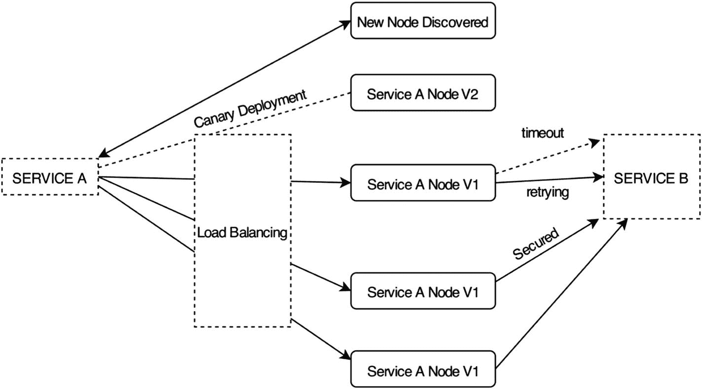
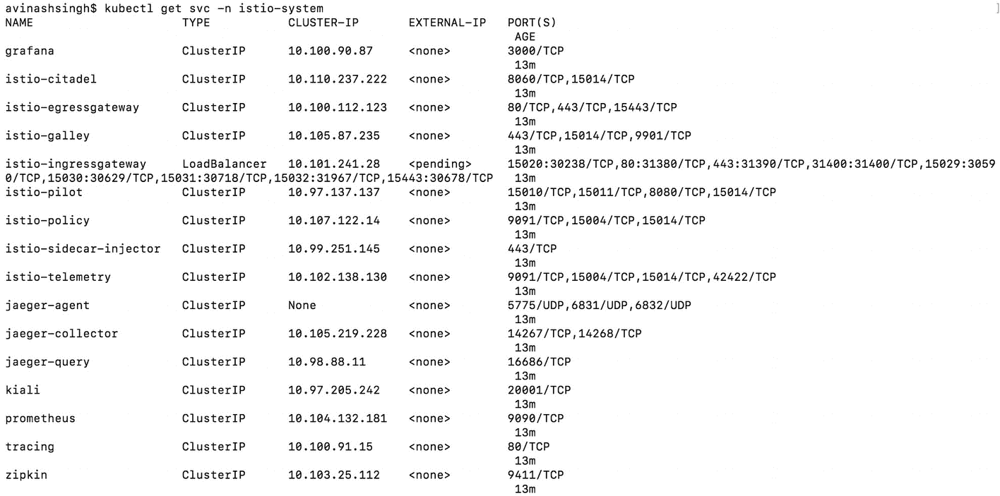

# 三、安装 Istio

在前一章中，我们介绍了微服务架构及其挑战。您了解了编排引擎如何解决这些挑战，但是为了使解决方案更加优雅和可重用，您需要一个服务网格。在本章中，我们将向您展示如何设置 Istio 环境并了解 Istio 的基础知识。

## Istio 服务网格

正如上一章所讨论的，当使用微服务架构时，当您想要提供响应时，通过网络调用服务会有点不太可靠。为了简化流程，客户应该能够动态地发现服务，并保证服务的可用性。服务必须以这样的方式被发现，即调用服务同意被发现服务的 API 版本契约。除此之外，调用服务应该处理网络调用期间的任何错误，重试任何失败的调用，并且在必要时超时。这些步骤是在微服务架构中创建流畅的网络交互所必需的。此外，还需要一个应用来记录呼叫和工具交易，并限制对不同服务的访问。所有这些都在应用内部带来了额外的冗余工作，并且与应用逻辑没有太大关系。

当你仔细观察时，所有这些问题和挑战都与网络通信直接或间接相关。Istio 服务网格为服务到服务的通信提供了一个基础设施层，抽象出了网络复杂性和挑战。以下是 Istio 提供的核心功能:

*   **弹性** : Istio 无需在应用中编写断路器代码。它还负责服务的超时和重试，而应用并不知道。

*   **安全性** : Istio 通过支持包括密钥管理在内的基于 TLS 的加密来负责访问控制。

*   **遥测**:由于 Istio 是网络层上的一个抽象，它可以跟踪网络调用，因此可以跟踪从单个源发起的多个服务的调用，它还可以收集调用的度量。

*   **服务发现**:在生产环境中运行的应用的主要需求之一是高度可用。这要求人们随着负载的增加而扩大服务规模，当不需要节省成本时则缩小服务规模。服务发现跟踪服务的可用节点，并准备好接受新任务。如果某个节点不可用，服务发现会将其从可用节点列表中删除，并停止向该节点发送新任务/请求。

*   路由选择:Istio 提供了灵活性，因此可以很好地控制服务的可用节点之间的流量。以下列表强调了 Istio 提供的基本支持:
    1.  **负载均衡** : Istio 允许基于不同算法的负载均衡，例如循环、随机、加权和最小请求。

    2.  **健康检查** : Istio 不仅关注节点可用性，还关注服务是否启动、运行并仍在响应，然后才将其包含在可用节点中。

    3.  **自动部署**:根据使用的部署类型，Istio 以加权模式将流量驱动到新节点。

图 3-1 让你一瞥使用 Istio 的服务和它的节点之间发生了什么。



图 3-1

Istio 特征

这些特性是应用必须具备的，将这些功能从应用代码中去掉会使代码更加整洁，并删除不必要的模块和跨多种语言的冗余。让我们看看 Istio 是如何通过浏览其架构来实现这一功能的。

## Istio 建筑

如上所述，Istio 特性也可以在应用内部实现。Istio 使用 Sidecar 模式，将这些特性提取出来作为小组件，并包装每个服务，以便观察、验证和处理任何入站和出站请求。所有流量都被定向到代理，代理根据规则或策略来决定如何、何时或是否将流量部署到服务。使用这些规则，它还支持故障注入、电路中断和金丝雀部署等技术，而服务无需担心所有这些问题。

图 3-2 显示了 Istio 架构的不同组件。


图 3-2

Istio 组件

Istio 在逻辑上分为两大部分，数据平面和控制面板。

### 数据平面

数据平面负责转换、转发和监控流入和流出实例的每个网络数据包。顾名思义，它负责在服务网格中收集元数据。它拥有健康检查、路由、服务发现、负载均衡、安全性和遥测等关键功能。正如上一章所讨论的，sidecar 使用 Envoy 代理来处理所有这些关键特性。从本质上讲，数据平面可以被视为跨服务网格部署的边车代理。图 3-3 显示了数据平面的概况。


图 3-3

带特使边车的数据平面服务

如果数据平面负责所有基本项目，那么控制面板做什么？

### 制导机

数据平面是一组相互交互的独立节点，控制面板利用它们创建一个分布式系统。当发起网络请求时，代理不知道要连接到哪个其他代理。控制面板是网格中提供此信息的平面。当发现新服务时，控制面板填充现有的服务列表，然后代理使用该列表来判断新服务的存在并引导流量。断路、负载均衡、超时、安全信息等基本配置存储在控制面板中。当新部署发生时，数据平面具有新节点准备好接受请求的信息，但是是进行蓝/绿部署还是逐渐转移流量由控制面板定义。

控制面板向数据平面提供策略和配置，而不接触网格中的任何网络分组。图 3-4 显示了系统中网络数据包和元数据的流向。这些配置是从控制面板引用的，而所有操作都发生在数据平面。


图 3-4

控制面板引导请求并从数据平面接收元数据

在任何架构中，数据层总是存在的。如前一章所述，数据层中陈述的大多数特性在 Nginx、HAproxy 和 Envoy 等流行项目中都可用。但是这些都需要手动设置配置，或者通过自己编写的脚本，或者使用多种其他工具。Istio 将所有这些结合在一起，提供了一个单一的平台，消除了样板配置，并在解决方案中提供了持久性。Istio 使用四个主要组件来简化这些繁琐的任务。

### 搅拌器

Mixer 是一个独立于平台的组件。它提供了一种为服务收集遥测数据的机制，并强制执行授权策略。它从 Istio 系统中抽象出基础设施后端提供的基本支持功能，如遥测捕获、配额实施、计费系统等。服务通常与基础设施后端紧密绑定，以获取这些细节，这导致遵循特定的协议，并增加了限制和依赖性。

考虑一个服务将日志写入文件系统的例子。由于容器是易变的，服务日志可能会随着时间的推移而丢失。为了解决这个问题，人们开始将日志发送到云服务。几个月后，有人想引入一个新的日志捕获器，它能够搜索日志。传统上，服务将被修改为向这两个日志服务发送日志，但是理想情况下，服务应该只关心它的任务，而不关心日志。Istio 负责收集这些数据，Mixer 为 Istio 提供了统一的抽象，以便与基础设施后端进行交互。

图 3-5 显示了混频器遵循的拓扑结构。所有请求都被发送进行策略检查，然后，请求遥测数据被报告给 Mixer。使用高速缓存和缓冲来优化该过程。


图 3-5

请求已发送，需要用报告的遥测数据进行策略检查

基础设施后端可能依赖于基础设施提供商。要使 Mixer 成为一个模块化和可扩展的组件，将它绑定到一个特定的协议并要求基础设施提供者遵循它是不正确的。相反，Mixer 提供了称为*适配器*的通用插件。

#### 适配器

适配器允许 Mixer 与基础设施后端进行交互，并保持 Istio 的其余部分从提供者中抽象出来。要使用的适配器通过混合器配置驱动，以在运行时面向任何基础设施后端。下面是一些与不同后端交互的流行适配器:

*   **遥测后端**:这有助于处理从吊舱收集的遥测数据。
    1.  **StatsD** :将度量数据传递给 StatsD 监控后端。

*   **授权后端**:这有助于授权 Istio 网格内外的任何请求。
    1.  **List** :对 IP 地址或正则表达式模式执行简单的白名单和黑名单检查。

*   **配额后端**:这有助于跟踪不同的端点配额。
    1.  **Redis 配额**:支持固定或滚动窗口算法的限速配额。顾名思义，它使用 Redis 存储数据。

*   **日志后端**:这个适配器帮助处理和保存来自服务的日志。
    1.  **CloudWatch** :这允许 Mixer 向 Amazon CloudWatch 交付指标，并向 Amazon CloudWatchLogs 发送日志。

    2.  **Fluentd** :这将日志传送到 Fluentd 守护进程。

图 3-6 描述了 Mixer 与基础设施后端的交互。


图 3-6

Istio 通过 Mixer 适配器与后端服务交互

由于 Mixer 与不同的基础设施后端交互，它如何决定向哪个后端发送数据或从哪个后端请求数据？Mixer 本质上依赖于它可用的属性来进行这个调用。

#### 属性

属性是定义请求属性的最小数据块。属性包括请求路径、请求指向的 IP 地址、响应代码、响应大小、请求大小等等。Mixer 处理这些属性，并根据配置触发对不同基础设施后端的调用。如图 3-7 所示，数据流从数据平面开始，通过 Mixer 到达基础设施后端。


图 3-7

数据平面将属性发送到属性处理器或混合器

混合器接收属性并让适配器调用基础设施后端，但是如上所述，存在定义活动适配器的配置，如何将输入属性映射到适配器属性，以及哪些实例属性应该给予哪些适配器。这属于 Mixer 的配置模型。

#### 配置模型

配置模型基于适配器和模板。模板定义了如何将属性输入适配器。结合，他们做三种类型的配置。

*   **处理程序**:负责定义适配器的配置。在 StatsD 的情况下，请求计数可以是一个提供给适配器的属性。这需要在配置中定义。

*   **实例**:这定义了实例属性应该如何映射到适配器输入。对于请求计数，实例配置度量可以将该值定义为 1(即，对每个请求计数一次)。

*   **规则**:现在我们知道了从实例中读取的属性，以及如何将它们映射到适配器属性。规则定义了何时运行此流程。让我们假设我们只想推送一个服务的请求计数；然后，该检查需要放在配置的匹配规范中，如`destination.service.name == <Service Name>`所示。

这为运营商提供了粒度控制，让他们知道使用哪个基础设施后端，并在需要时添加和删除它，而无需对服务进行任何更改，这让开发人员的工作变得更加轻松。

### 飞行员

飞行员驾驶交通。它找出新的路径，管理交通，并处理死角。换句话说，它执行路由，提供服务发现，并促进超时、重试、断路器等等。Pilot 将特定于平台的服务发现方式从 Istio 中分离出来，从而允许 Istio 在多个环境中运行，如 Kubernetes、Nomad 等。Istio 在所有 pod 的边车中使用 Envoy 代理来处理流量和配置。Pilot 将流量相关的配置转换为特使配置，并在运行时将其推送到边车。图 3-8 显示了 Pilot 的架构及其工作原理。


图 3-8

试点建筑

为了对每个服务进行流量控制，飞行员在网格中为每个服务维护一个模型。副本和服务发现的任何更新都在模型中以服务方式被跟踪。这有助于遵循一致的协议，在跨多个环境的模型中保存数据。这也意味着环境适配器必须对通过其资源获得的数据进行操作，以将其转换为试验服务模型。

让我们考虑一个部署在 Kubernetes 上的网格示例。当 Kubernetes 创建一个新的 pod 时，它会通知它的适配器，适配器会在特定于服务的模型中存储有关服务的新副本的信息。根据网络规则和配置，这创建了特定于特使的配置，并且特使 API 通知侧柜新的服务发现。这里重要的是，由于环境适配器负责服务发现，服务可能位于多个环境中，这意味着 Istio 可以跨多个环境部署网格。图 3-9 显示了元数据从环境到 Istio 的流程。


图 3-9

Istio 中的服务发现

在服务模型中，Pilot 存储副本的数量，并配置 Envoy 以支持不同类型的负载均衡，如循环、加权、随机等，这些都不是环境提供商现成可用的。

这些服务能够相互调用，确保可用性和响应性。但是，所有的服务都应该能够调用其他服务吗？这些服务应该通过未加密的连接进行通信吗？所有这些问题都由 Citadel 处理。

### 城堡

我们看到了引入微服务是如何改善应用的开发时间和性能的，但它也带来了安全问题，因为网络连接成为了应用的一部分。这种连接必须防范常见的安全问题，如中间人攻击；因此，需要 TLS 支持。Citadel 提供了在 Istio 网格中加密请求的特性。它还为网格中的服务提供基于角色的访问控制。请注意，Citadel 只启用加密(换句话说，提供证书来启用服务之间的安全连接)，但这个配置是由 Pilot 推送给 Envoy 的。

### 活版盘

厨房可以被认为是一个管理平面。它的核心职责是从用户和底层环境中抽象出配置输入的 Istio mesh。Galley 存储用户配置，对其进行验证，然后将其发送给 Pilot 进行进一步操作。

既然对 Istio 架构有了基本的了解，那我们就来看看如何在不同的环境下设置 Istio。

## 建立 Istio

如前所述，Istio 在 Kubernetes、Nomad 等多种环境中都得到了支持。我们将把我们的设置限制在 Kubernetes。有两种方法可以在机器上安装 Istio 一个使用 Helm 图，另一个是快速演示安装。让我们过一遍这些。

### 使用 Helm 安装

Helm 是一个运行在 Kubernetes 上的包管理器。它允许我们通过掌 Helm 图来定义应用结构。这种安装应该用于生产环境。它为定制数据平面和控制面板组件提供了灵活性。Helm 帮助我们生成配置文件，然后 Kubernetes 控制器可以使用该文件进行安装。

#### 下载 Istio 版本

从 GitHub 下载 Istio 版本并设置 Istio 路径。

1.  从 GitHub 中拉出 Istio 并安装。版本 1.2.2 是撰写本文时的最新版本。

    ```
    curl -L https://git.io/getLatestIstio | ISTIO_VERSION=1.2.2 sh -

    ```

2.  将 Istio 路径添加到环境变量。当前的 Istio 文件夹是`istio-1.2.2`。

    ```
    export PATH=$PWD/bin:$PATH

    ```

图 3-10 显示在 Mac 机上安装 Istio 的输出。


图 3-10

安装 Istio 版本

#### 安装 Helm

在不同的平台上设置 Helm 是不同的，但是在所有情况下都很简单。

1.  **在 macOS 上安装**:在 Mac 上，可以用自制软件安装 Helm。

    ```
    brew install kubernetes-helm

    ```

2.  **在 Ubuntu 上安装**:在 Ubuntu 上，使用 Snap 安装 Helm。

    ```
    sudo snap install helm --classic

    ```

3.  将 Helm 初始化为客户端，以获取远程存储库。

    ```
    helm init --client-only

    ```

一旦安装了 Helm，我们需要添加`istio-release`库到 Helm。这将包括 Istio 提供的图表。

1.  将 Istio 存储库添加到 Helm。

    ```
    helm repo add istio.io https://storage.googleapis.com/istio-release/releases/1.2.2/charts/

    ```

图 3-11 显示了安装过程。


图 3-11

安装 Helm

#### 安装 Istio

让我们使用 Helm 安装 Istio。我们将使用在第一章中创建的 Minikube Kubernetes 集群。请确保 Minikube 已启动并正在运行。图 3-12 显示了如何检查状态并在出现故障时启动 Minikube。


图 3-12

宇宙魔方启动

1.  我们将创建一个名为`istio-system`的名称空间，在这个名称空间下将部署 Istio 服务。

    ```
    kubectl create namespace istio-system

    ```

2.  Istio 附带了 23 个自定义资源定义(CRD ),可以在配置 Istio 时使用。让我们使用`kubectl`来安装它们。确保你在`istio`文件夹中，因为`install`文件夹应该在当前位置。

    ```
    helm template install/kubernetes/helm/istio-init --name istio-init --namespace istio-system | kubectl apply -f -

    ```

3.  验证所有 CRD 是否安装正确。

    ```
    kubectl get crds | grep 'istio.io\|certmanager.k8s.io' | wc -l

    ```

4.  在`install`文件夹中有多个配置文件。查看`install/kubernetes/helm/istio`。我们将使用演示配置文件，它允许我们试验大多数 Istio 特性。

    ```
    helm template install/kubernetes/helm/istio --name istio --namespace istio-system \
        --values install/kubernetes/helm/istio/values-istio-demo.yaml | kubectl apply -f -

    ```

图 3-13 显示了安装输出。


图 3-13

使用 Helm 安装 Istio

### 不带头盔的演示装置

这种安装更快更容易，并允许使用大多数 istio 功能。这可以在不安装任何其他第三方软件的情况下完成。确保您在`istio`文件夹中。

1.  所有 Istio 自定义资源定义都存在于 Istio `init`文件夹中。

    ```
    for i in install/kubernetes/helm/istio-init/files/crd*yaml; do kubectl apply -f $i; done

    ```

2.  我们允许 Istio 使用相互 TLS 和非 TLS 模式。`istio`文件夹内的`Istio-demo.yaml`允许此设置。

    ```
    kubectl apply -f install/kubernetes/istio-demo.yaml

    ```

参见图 3-14 了解此次安装和预期结果。


图 3-14

使用 demo.yaml 设置不带 Helm 的 Istio

### GKE 装置

在 GKE 上安装 Istio 与其他两种安装方法类似，只是多了一个工具安装。假设 Kubernetes 已为 GKE 项目启用。请遵循以下步骤:

1.  在本地机器上安装`gcloud`。该工具有助于管理 GKE 上的资源。安装步骤在 [`https://cloud.google.com/sdk/docs/#deb`](https://cloud.google.com/sdk/docs/%2523deb) 的 Google cloud 文档中。

2.  可以使用`gcloud`安装 Kubectl。

    ```
    kubectl get svc -n istio-system

    ```

3.  设置启用 Kubernetes 和安装 Istio 的项目 ID 和区域。

    ```
    gcloud config set project [PROJECT_ID]
    gcloud config set compute/zone [COMPUTE_ENGINE_ZONE]

    ```

4.  创建新的集群。

    ```
    gcloud container clusters create istio-installation --machine-type=n1-standard-2 --num-nodes=2

    ```

5.  现在可以使用 Kubernetes 集群来安装 Istio。使用这两种方法中的任何一种来设置 Istio。

### 验证安装

安装后，让我们验证安装是否正确完成，这意味着所有服务都在运行，并且它们的 pod 是活动的。

1.  在 Istio 名称空间中查找所有正在运行的服务。

    ```
    kubectl get svc -n istio-system

    ```

图 3-15 显示了正在运行的服务。



图 3-15

在 Istio 中运行服务

1.  确保 Istio 系统中的所有单元都已启动并运行。

    ```
    kubectl get pods -n istio-system

    ```

图 3-16 显示了预期的输出。


图 3-16

Istio 的跑步 POD

现在我们有了一个 Istio 环境，可以部署应用了。让我们来看看服务。

### 服务研究所

大多数服务都很简单，并且可以与本章前面讨论的组件相关联。Citadel、Galley、Pilot、Policy 和 Telemetry 是其中的几个。演示安装提供以下附加服务:

*   **Grafana** :这将从不同服务收集的数据呈现在一个仪表板中，用于分析和监控。它是监视集群中发生的事情的一个非常好的工具。

*   Kiali :它跟踪服务网格中的服务、它们之间的连接方式、数据流以及它们各自的性能。这是一个很好的工具，可以用来检查微服务何时关闭或影响网格的整体性能。

*   Jaeger :它监控分布式系统中的事务并排除故障。它有助于优化性能和延迟。

*   Prometheus :这是一个流行的基于开源指标的系统监控和警报工具包。它有一个强大的数据模型和查询语言，允许分析应用和基础设施。

*   跟踪和 Zipkin :这些工具在分布式系统中跟踪请求。

现在我们已经有了一个可以部署应用的 Istio 环境，但是在我们继续创建部署之前，让我们先来看几个重要的 Istio 命令和 CRD。

## 使用 Istio

在安装过程中，我们在 Kubernetes 集群上安装了许多自定义资源定义，我们将在后面的章节中使用这些定义来查看 Istio 的运行情况。让我们去拜访其中的几个，了解一下它们是什么。

*   **Virtualservices** :这定义了当一个服务调用另一个主机时使用的一组流量规则。这些规则定义了在对呼叫应用规则之前要匹配的标准。

*   **DestinationRules** :这在路由完成时起作用。它涵盖了负载均衡、连接池大小等基本配置。

*   **ServiceEntries** :这将额外的条目添加到 Istio 服务注册表中，以便自动发现的服务可以访问手动定义的条目。它配置服务的基本细节，如地址、协议、端口等。当存在服务网格外部的服务时，这是有帮助的。

*   **网关**:这可以看作是一个负载均衡器，位于服务网格的入口处，监听特定端口的外部连接，然后在网格内部分配流量。

*   使用这个工具，用户可以在 Pilot 已经生成的过滤器的基础上定义特定于 Envoy 代理的过滤器。换句话说，它可以在 Istio 无法自动更正错误的情况下修改网格流量；因此，需要小心使用。

*   **Policies** :这个工具执行一些规则，比如对服务的流量进行速率限制、报头重写、黑名单和白名单服务访问。

在安装步骤中还定义了许多其他 CRD，但这些是最常用和最常用的。我们将在本书后面的章节中用到它们。

## 使用 Istio CLI

我们现在已经使用 Kubectl 来部署服务，并设置了 Istio 来完成与服务网格相关的所有任务。Istio 自带 CLI，可以灵活配置 Istio 设置。调试应用的第一种方法是查看日志，但是进一步深入，`istioctl`允许我们调试和诊断网格中的每个部署。让我们来看一些有助于应用调试和设置的`istioctl`命令。

### 奥滕

这是一个命令行参数，用于与 Istio 身份验证策略进行交互。例如，让我们检查一个 Istio pods 上的`tls-authentication`设置。我们将在第十章中讨论更多关于认证的内容。

```
istioctl authn tls-check <pod-name>

```

### 注销

这是一个命令行参数，用于从注册到的服务中取消注册现有 IP 地址。当有人想强行从服务中删除 pod 时，这是必需的。

```
istioctl deregister <service-name> <ip-to-be-removed>

```

### 注册

这是将 pod 注册到服务的命令行参数。

```
istioctl register <service-name> <ip-to-be-added> <port>

```

### 实验的

这允许使用`istioctl`并生成可以修改或废弃的实验命令。它允许在四个领域进行实验。

#### 实验授权

这允许与网格中的身份验证和授权策略进行交互。

```
istioctl experimental auth check <pod-name>

```

#### 实验性转换-入口

这将尽最大努力将 Kubernetes 入口转换为`VirtualService`配置。结果是 Istio 配置的开始。少数情况下会生成转换可能失败的警告，这可能需要手动干预。考虑清单 3-1 中的入口示例。我们会尽量把它转换成`VirtualService`。

```
apiVersion: extensions/v1beta1
kind: Ingress
metadata:
  name: gateway
spec:
  rules:
  - http:
      paths:
      - path: /
        backend:
          serviceName: frontendservice
          servicePort: 80

Listing 3-1Sample Ingress Config ingress-smaple.yaml

```

图 3-17 显示了将入口转换为 Istio `VirtualService`产生的输出。


图 3-17

将入口配置转换为 Istio 虚拟服务

#### 实验仪表板 grafana

使用`istioctl`可以轻松查看 Grafana 仪表盘。

```
istioctl experimental dashboard grafana

```

这将为 Grafana 服务设置一个代理，并使其可以通过随机端口在 web 浏览器中访问。图 3-18 和图 3-19 显示了命令和仪表板。


图 3-19

Grafana 仪表板在随机端口上可见，此处为 53869


图 3-18

请求显示 Grafana 仪表板

在我们当前的设置中，类似的仪表盘也适用于 Envoy、Jaegar、Kiali、Promethus 和 Zipkin。

#### 实验度量

这将打印 Kubernetes 中指定服务的指标。这取决于 Prometheus。当请求服务指标时，该命令向 Prometheus 发出一系列关于指标的请求，并打印它们。

```
istioctl experimental metrics <service-name>

```

### kube 注入

该工具通过将 Envoy sidecar 注入任何现有的 Kubernetes 资源，将 Kubernetes 配置转换为 Istio 配置。对于不受支持的资源，配置保持不变。让我们从第一章中选择一个部署，并尝试将 Kubernetes 配置转换为 Istio 配置(参见清单 3-2 )。

```
apiVersion: apps/v1
kind: Deployment
metadata:
  name: webapp-deployment
  labels:
    app: webapp
spec:
  replicas: 1
  selector:
    matchLabels:
      app: webapp
  template:
    metadata:
      labels:
        app: webapp
    spec:
      containers:
      - name: webapp
        image: web-app:4.0
        imagePullPolicy: Never
        ports:
        - containerPort: 5000
        readinessProbe:
          httpGet:
            path: /health
            port: 5000
          initialDelaySeconds: 40
        livenessProbe:
          httpGet:
            path: /health
            port: 5000
          initialDelaySeconds: 120

Listing 3-2Sample Ingress Config ingress-smaple.yaml

```

清单 3-3 显示了转换后的配置。

```
apiVersion: apps/v1
kind: Deployment
metadata:
  creationTimestamp: null
  labels:
    app: webapp
  name: webapp-deployment
spec:
  replicas: 1
  selector:
    matchLabels:
      app: webapp
  strategy: {}
  template:
    metadata:
      annotations:
        sidecar.istio.io/status: '{"version":"761ebc5a63976754715f22fcf548f05270fb4b8db07324894aebdb31fa81d960","initContainers":["istio-init"],"containers":["istio-proxy"],"volumes":["istio-envoy","istio-certs"],"imagePullSecrets":null}'
      creationTimestamp: null
      labels:
        app: webapp
    spec:
      containers:
      - image: web-app:4.0
        imagePullPolicy: Never
        livenessProbe:
          httpGet:
            path: /health
            port: 5000
          initialDelaySeconds: 120
        name: webapp
        ports:
        - containerPort: 5000
        readinessProbe:
          httpGet:
            path: /health
            port: 5000
          initialDelaySeconds: 40
        resources: {}
      - args:
        - proxy
        - sidecar
        - --domain
        - $(POD_NAMESPACE).svc.cluster.local
        - --configPath
        - /etc/istio/proxy
        - --binaryPath
        - /usr/local/bin/envoy
        - --serviceCluster
        - webapp.$(POD_NAMESPACE)
        - --drainDuration
        - 45s
        - --parentShutdownDuration
        - 1m0s
        - --discoveryAddress
        - istio-pilot.istio-system:15010
        - --zipkinAddress
        - zipkin.istio-system:9411
        - --dnsRefreshRate
        - 300s
        - --connectTimeout
        - 10s
        - --proxyAdminPort
        - "15000"
        - --concurrency
        - "2"
        - --controlPlaneAuthPolicy
        - NONE
        - --statusPort
        - "15020"
        - --applicationPorts
        - "5000"
        env:
        - name: POD_NAME
          valueFrom:
            fieldRef:
              fieldPath: metadata.name
        - name: POD_NAMESPACE
          valueFrom:
            fieldRef:
              fieldPath: metadata.namespace
        - name: INSTANCE_IP
          valueFrom:
            fieldRef:
              fieldPath: status.podIP
        - name: ISTIO_META_POD_NAME
          valueFrom:
            fieldRef:
              fieldPath: metadata.name
        - name: ISTIO_META_CONFIG_NAMESPACE
          valueFrom:
            fieldRef:
              fieldPath: metadata.namespace
        - name: ISTIO_META_INTERCEPTION_MODE
          value: REDIRECT
        - name: ISTIO_META_INCLUDE_INBOUND_PORTS
          value: "5000"
        - name: ISTIO_METAJSON_LABELS
          value: |
            {"app":"webapp"}
        image: docker.io/istio/proxyv2:1.2.2
        imagePullPolicy: IfNotPresent
        name: istio-proxy
        ports:
        - containerPort: 15090
          name: http-envoy-prom
          protocol: TCP
        readinessProbe:
          failureThreshold: 30
          httpGet:
            path: /healthz/ready
            port: 15020
          initialDelaySeconds: 1
          periodSeconds: 2
        resources:
          limits:
            cpu: "2"
            memory: 1Gi
          requests:
            cpu: 10m
            memory: 40Mi
        securityContext:
          readOnlyRootFilesystem: true
          runAsUser: 1337
        volumeMounts:
        - mountPath: /etc/istio/proxy
          name: istio-envoy
        - mountPath: /etc/certs/
          name: istio-certs
          readOnly: true
      initContainers:
      - args:
        - -p
        - "15001"
        - -u
        - "1337"
        - -m
        - REDIRECT
        - -i
        - '*'
        - -x
        - ""
        - -b
        - "5000"
        - -d
        - "15020"
        image: docker.io/istio/proxy_init:1.2.2
        imagePullPolicy: IfNotPresent
        name: istio-init
        resources:
          limits:
            cpu: 100m
            memory: 50Mi
          requests:
            cpu: 10m
            memory: 10Mi
        securityContext:
          capabilities:
            add:
            - NET_ADMIN
          runAsNonRoot: false
          runAsUser: 0
      volumes:
      - emptyDir:
          medium: Memory
        name: istio-envoy
      - name: istio-certs
        secret:
          optional: true
          secretName: istio.default
status: {}
---

Listing 3-3Sidecar Injected into Kubenetes Deployment

```

### 代理配置引导程序|群集|端点|侦听器|路由

此工具检索关于引导、集群、端点、侦听器或 pod 中特使实例的路由特定配置的信息。

### 生效

这将在 Istio 配置应用于网格之前对其进行验证。让我们验证清单 3-3 中的输出。图 3-20 显示了从文件中生成的警告，因为我们还没有向部署添加版本。


图 3-20

验证生成的 Istio 配置

这些命令有助于在服务网格中创建、修改、注入和使用 Istio 配置。

## 摘要

在本章中，我们学习了 Istio 架构，您了解了控制层和数据层的去耦如何帮助组织配置和数据流。我们浏览了负责配置的控制面板组件 Mixer、Pilot、Citadel 和 Galley，并展示了它们如何组织数据流，以及如何将多个 pod 转换为分布式系统。我们还介绍了如何在本地机器和 GKE 上通过 Helm 图设置 Istio，而无需任何第三方软件。我们简要地浏览了 Istio 的几个重要的 CRD。我们还简要介绍了 Istio CLI 工具，它将在后面的章节中广泛使用。在下一章，我们将深入研究 Istio CRD，并提供一些如何创建 Istio 网格的例子。