# 六、服务弹性

在前一章中，我们介绍了如何配置`Ingress`、`Egress`和`ServiceEntry`组件来与 Kubernetes 集群之外的世界进行交互。我们还讨论了如何加密微服务之间的请求。因此，现在我们可以在 Kubernetes 上部署一个安全的应用，能够控制与外部网络的交互。在理想的情况下，这种设置应该足以运行一个生产应用，但正如 Peter Deutsch 和 Sun Microsystems 的人员正确指出的那样，开发人员往往会忘记分布式计算的谬误。

在开发应用时，人们必须注意分布式系统中的谬误，并解决这些谬误。

*   假设网络是可靠的。这种假设导致对网络错误很少甚至没有错误处理的发展。其结果是网络问题、应用停滞和响应时间长。网络恢复后，暂停的应用可能无法恢复正常功能，可能需要重新启动。

*   当使用网络作为交流的渠道时，所有的反应都是自发的；换句话说，操作中不会引入延迟。

*   可用于通信的带宽没有上限。在现实世界中，如果超过带宽阈值，服务将无法通信。

图 6-1 显示了分布式系统中的挑战。


图 6-1

分布式系统中的挑战

此外，如果其中一个服务节点关闭或没有响应，即使其他服务节点工作正常，也会出现故障。这会导致一些请求失败，并影响最终用户。要解决这些情况，必须执行以下操作:

*   让应用处理服务中的网络故障，使其能够通过网络恢复进行恢复。

*   如果延迟增加，应用应该能够适应，并且最终不会影响最终客户。

*   在带宽阻塞或其他节点故障的情况下，服务应该重试，或者有一个类似于网络中断场景的处理程序。

早期，开发人员使用流行的框架，如 CORBA、EJB、RMI 等，使网络调用看起来像本地方法调用，但这使系统容易受到级联故障的影响，其中一个服务故障传播到所有调用服务。Istio 通过 sidecars 提供弹性实现，帮助开发人员关注业务逻辑。

## 应用设置

让我们继续第四章和第五章的例子。见图 6-2 。


图 6-2

Istio 示例应用

让我们快速浏览一下描述`istio-frontent`部署和服务、webapp 部署和服务的配置。见清单 6-1 ，清单 6-2 ，清单 6-3 ，清单 6-4 。

```
apiVersion: v1
kind: Service
metadata:
  name: frontendservice
spec:
  selector:
    app: frontend
  ports:
  - protocol: TCP
    port: 80
    targetPort: 8080

Listing 6-4frontend-service.yaml to Expose Front-End Deployment

```

```
apiVersion: v1
kind: Service
metadata:
  name: webservice
spec:
  selector:
    app: webapp
  ports:
  - name: http-webservice
    protocol: TCP
    port: 80
    targetPort: 5000

Listing 6-3webapp-service.yaml to Expose Web App Deployment

```

```
apiVersion: apps/v1
kind: Deployment
metadata:
  name: frontend-deployment
  labels:
    app: frontend
spec:
  replicas: 1
  selector:
    matchLabels:
      app: frontend
  template:
    metadata:
      labels:
        app: frontend
    spec:
      containers:
      - name: frontend
        image: frontend-app:1.0
        imagePullPolicy: Never
        ports:
        - containerPort: 8080

Listing 6-2frontend-deployment.yaml

```

```
apiVersion: apps/v1
kind: Deployment
metadata:
  name: webapp-deployment-7.0
  labels:
    app: webapp
    version: v7.0
spec:
  replicas: 2
  selector:
    matchLabels:
      app: webapp
      version: v7.0
  template:
    metadata:
      labels:
        app: webapp
        version: v7.0
    spec:
      containers:
      - name: webapp
        image: web-app:7.0
        imagePullPolicy: Never
        ports:
        - containerPort: 5000

Listing 6-1WebApp-deployment-v7.yaml

```

现在一个目的地规则作为中间层与`webapp-service`交互。它有允许跨单元分配流量的策略。参见清单 6-5 。

```
apiVersion: networking.istio.io/v1alpha3
kind: DestinationRule
metadata:
  name: webapp-destination
spec:
  host: webservice
  subsets:
  - name: v0
    labels:
      version: v7.0

Listing 6-5Destination-rule.yaml

```

现在定义一个网关，使前端服务可以在 Minikube 中的 Kubernetes 集群之外访问。如果没有这一点，只能通过私有 IP 或域名在私有网络内部访问 pod 和服务。参见清单 6-6 。

```
apiVersion: networking.istio.io/v1alpha3
kind: Gateway
metadata:
  name: webapp-gateway
spec:
  selector:
    istio: ingressgateway # use istio default controller
  servers:
  - port:
      number: 80
      name: http
      protocol: HTTP
    hosts:
    - "*"
---
apiVersion: networking.istio.io/v1alpha3
kind: VirtualService
metadata:
  name: frontendservice
spec:
  hosts:
  - "*"
  gateways:
  - webapp-gateway
  http:
  - match:
    - uri:
        prefix: /
    route:
    - destination:
        host: frontendservice

Listing 6-6gateway.yaml

```

部署服务后，当我们使用 Minikube IP 访问网关时的输出如图 6-3 所示。


图 6-3

应用输出

我们现在有一个正在运行的应用；让我们看看根据前面解释的谬误，什么都可能出错。

*   webapp 服务的一个节点关闭。前端服务调用 webapp 服务，并看到`UNKNOWN ERROR`的响应。

*   webapp 节点的响应时间比预期的长。这可能是因为网络速度慢或节点本身有问题。前端服务等待未收到响应的时间。

*   一个 webapp 节点现在过载了比预期更多的请求，并且新的请求不断到来，这使得问题更加复杂。

我们如何在一个环境中解决这些问题？

1.  如果前端服务收到一个错误，指出该服务已关闭，请重试请求，并检查是否有其他节点可以处理相同的请求。

2.  前端服务应该在请求中加入超时，避免用户长时间等待。之后，它可以根据产品流程重试请求或向用户显示错误，而不会浪费用户的时间。

3.  如果一个节点或服务过载并反复返回错误，应该给它一些时间来冷却或恢复。为了实现这一点，进一步的传入请求应该直接返回一个错误，而不是实际发送给服务。这个过程被称为*断路*，类似于我们在家庭中防止电器永久损坏的方法。

让我们看看这些场景，并弄清楚 Istio 如何帮助解决这些挑战。

## 负载均衡

负载均衡是一个常见的概念，意思是在几个节点之间分配负载，以提高吞吐量和效率。负载均衡器是所有请求进入的节点，它将负载转发/代理到分布式节点。虽然这看起来是一个好方法，但是它创建了一个单点故障，而这正是我们最初试图避免的。这也造成了瓶颈，因为所有的请求都是通过这个入口点路由的。

Istio 带有客户端负载均衡的概念。请求服务可以根据负载均衡标准决定将请求发送到哪里。这意味着没有单点故障和更高的吞吐量。Istio 支持以下负载均衡技术:

*   **循环调度**:请求一个接一个地均匀分布在所有节点上。

*   **Random** :随机挑选一个节点为请求服务。它最终变得类似于循环赛，但没有任何顺序。

*   **加权**:可以给实例增加权重，请求可以根据百分比转发。

*   **最少请求**:这似乎是一种有效的技术，但取决于用例。它将请求转发给到那时为止接收到最少请求的节点。

Istio 使用平台的服务发现特性来获取新节点的详细信息，并将其存在分发到其余节点。其余节点在其负载均衡中包括新服务。让我们使用 webapp 4.0 来看看负载均衡器的运行情况。配置参见清单 6-7 。

```
apiVersion: apps/v1
kind: Deployment
metadata:
  name: webapp-deployment-4
  labels:
    app: webservice
    version: v4
spec:
  replicas: 1
  selector:
    matchLabels:
      app: webservice
      version: v4
  template:
    metadata:
      labels:
        app: webservice
        version: v4
    spec:
      containers:
      - name: webapp
        image: web-app:4.0
        imagePullPolicy: Never
        ports:
        - containerPort: 5000
---
apiVersion: networking.istio.io/v1alpha3
kind: DestinationRule
metadata:
  name: webservice
spec:
  host: webservice
  subsets:
  - name: v0
    labels:
      version: v7.0
  - name: v1
    labels:
      version: v4
  trafficPolicy:
    loadBalancer:
      simple: ROUND_ROBIN
---

apiVersion: v1
kind: Service
metadata:
  name: webservice
spec:
  selector:
    app: webservice
  ports:
  - name: http-webservice
    protocol: TCP
    port: 80
    targetPort: 5000
---
apiVersion: networking.istio.io/v1alpha3
kind: VirtualService
metadata:
  name: webservice
spec:
  hosts:
    - "*"
  gateways:
    - webapp-gateway
  http:
  - route:
    - destination:
        host: webservice
    match:
    - uri:
        prefix: /

Listing 6-7Deployment Configuration and Load Balancing Config

```

图 6-4 显示了服务上请求分布的输出。

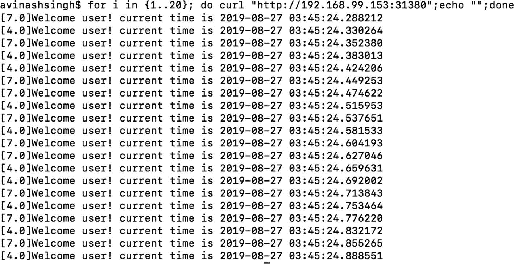

图 6-4

循环负载均衡

因为循环平衡已经完成，所以在大多数情况下，交替请求被发送到每个版本。

## 重试请求

当服务调用由于延迟或服务中的临时故障而失败时，最终用户会看到一个错误，对此我们假设用户可能会重试请求。在微服务架构中，这种重试在网络调用的每一层都会成倍增加。随着用户重试请求，每一层的请求失败的组合会增加。在图 6-2 中，假设网关和前端服务之间的调用失败，前端服务和 webapp 服务之间还有第二次失败的机会。依靠用户不放弃直到没有失败是不现实的期望。解决方案是在每次网络调用时建立自动重试。

在微服务架构中，可以在每个网络调用中加入重试和超时，这将增加开发工作负载和编码时间，并且与业务逻辑无关，也可以让网络层来处理故障。

让我们在我们的 webapp 服务中做一个小小的改变，随机返回 503 错误代码，这表明服务已经关闭。如果服务过载，无法接受新的请求，并且对一些现有请求失败，就会发生这种情况。有关变更，请参考清单 6-8 。

```
from flask import Flask
import datetime
import time
import os
import random

app = Flask(__name__)

@app.route("/")
def main():
    currentDT = datetime.datetime.now()
    status = 200
    if random.random() > 0.5:
        status = 503
    return "[{}]Welcome user! current time is {} ".format(os.environ['VERSION'],str(currentDT)), status

@app.route("/health")
def health():
    return "OK"

if __name__ == "__main__":
    app.run(host='0.0.0.0')

Listing 6-8Change in Web App Service to Return Error in About 50 Percent of Cases

```

现在让我们在网关上发送一些流量，看看结果。我们将使用`siege`对应用进行连续请求。见图 6-5 。

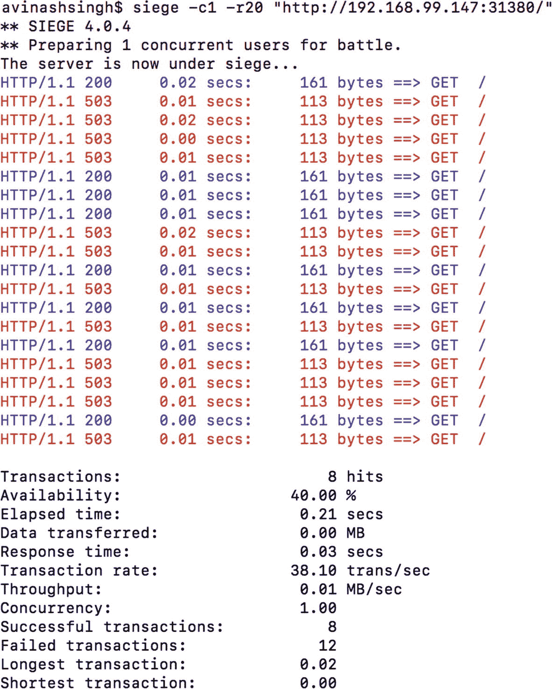

图 6-5

如果服务节点返回错误，则请求输出

服务的停机时间或故障会传播给用户。只需再次尝试失败的请求，就可以提高可用性。让我们通过 Istio `VirtualService`组件来实现这一点，而不是修改代码。`VirtualService`允许我们在失败的情况下重试请求。默认情况下，如果请求失败，Envoy 会重试一次。让我们按照清单 6-9 添加这个配置。

```
apiVersion: networking.istio.io/v1alpha3
kind: VirtualService
metadata:
  name: webservice
spec:
  hosts:
  - webservice
  http:
  - route :
    - destination:
        host: webservice
    retries:
      attempts: 1

Listing 6-9Changing webapp-virtualservice to Allow One Retry

```

只需使用`istioctl`应用配置，让我们再次发送相同的流量，并查看发送给用户的失败请求。

如图 6-6 所示，可用性从 40%提高到 80%。我们可以进一步增加重试次数，从而减少失败次数，但这是以响应时间为代价的。每一个失败的请求都需要时间，这个时间会被添加到调用服务的总响应时间中。见图 6-7 。

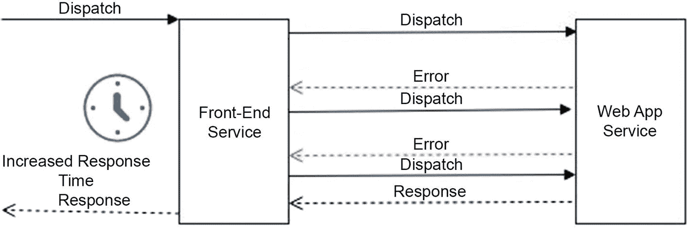

图 6-7

调用服务的响应时间随着每次重试而增加

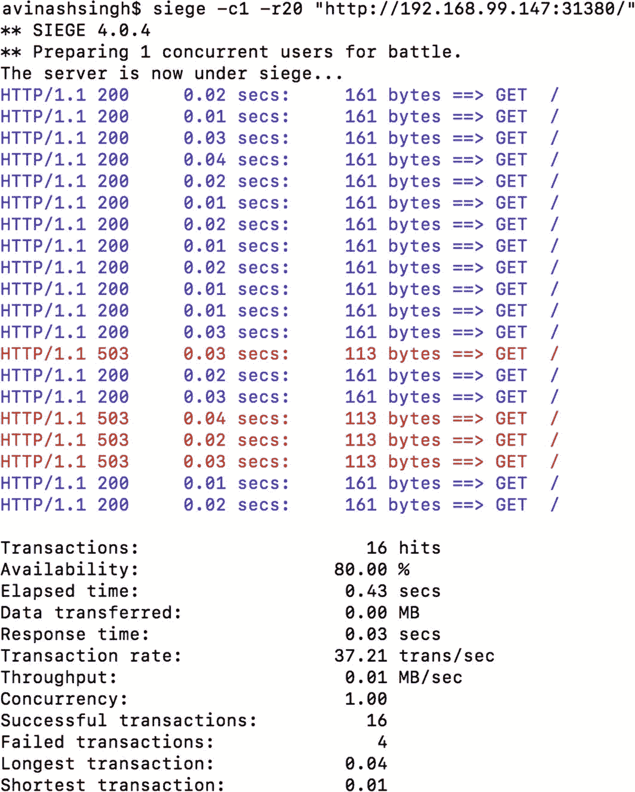

图 6-6

通过重试，最终用户可以获得更好的可用性

虽然重试似乎是提高可用性的好方法，但显然在某些情况下应该避免重试。

*   重试应该是等幂的。如果响应会根据请求计数发生变化，则应避免重试请求。

*   如果已知一个请求要花很多时间，换句话说，是一个昂贵的请求，那么应该避免重试。这也可能导致下一个请求失败，并可能导致额外资源的消耗。

我们对代码进行了修改，以测试应用在一个微服务中承受错误的持久性。有一种更简单的方法，通过故障注入。我们可以配置虚拟服务，故意插入一个错误来测试持久性。让我们将 webapp 代码恢复到以前的版本，并使用`VirtualService`在服务中注入一个错误。清单 6-10 显示中止注入迫使 50%的请求失败。

```
apiVersion: networking.istio.io/v1alpha3
kind: VirtualService
metadata:
  name: webservice
spec:
  hosts:
  - webservice
  http:
  - fault:
      abort:
        httpStatus: 503
        percent: 50
    route :
    - destination:
        host: webservice
    retries:
      attempts: 0

Listing 6-10Modified VirtualService Component to Forcefully Inject Fault

```

使用`siege`故意使重试次数为零，以证明失败的请求。图 6-8 显示了失败请求的输出。

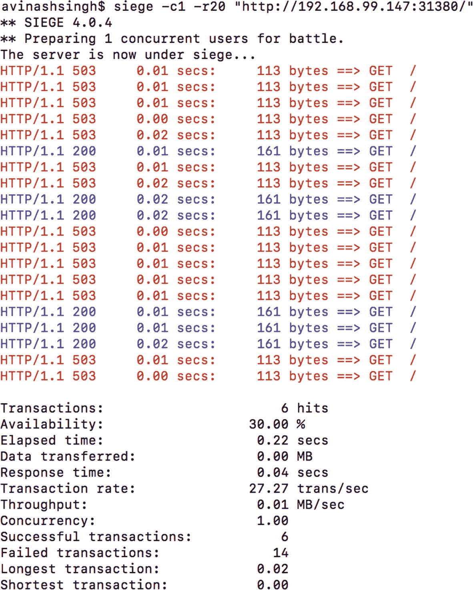

图 6-8

使用 Istio 故障注入的围攻响应

这里的失败次数超过了 50 %,因为对 webapp 的请求也是从代码内部失败的。将重试次数更改为 1 会提高应用的可用性。

虽然重试可以解决当服务的一些 pod 不响应或关闭时的问题，但它会尝试使用可用的 pod 来服务请求，但是如果 pod 过载并将请求放入队列中，会发生什么情况呢？结果可能是响应在很长时间后才提供，或者调用服务在很长时间后收到错误。在这两种情况下，最终用户都会受到响应延迟的影响。在用户放弃之前，超时成为一个重要因素。

## 超时请求

超时是使系统可用的一个重要因素。在对服务的网络调用过程中，如果调用花费了大量时间，则很难确定服务是关闭了，还是速度太慢或过载了。在这种情况下，调用服务不能无所事事地等待请求完成，因为最终用户会受到这种延迟的影响。另一种方法是快速失败，而不是让用户等待。Istio 提供了一个特性，如果响应时间超过一个阈值，请求就会超时。

让我们在 webapp 服务中注入一个错误，将 50%的请求的响应时间增加到 5 秒以上。清单 6-11 显示了修改后的`VirtualService`配置。

```
apiVersion: networking.istio.io/v1alpha3
kind: VirtualService
metadata:
  name: webservice
spec:
  hosts:
  - webservice
  http:
  - fault:
      delay:
        fexedDelay: 5s
        percent: 50
    route :
    - destination:
        host: webservice
    retries:
      attempts: 0

Listing 6-11Modified Virtual Service to Forcefully Inject a Delay for Some Requests

```

请求的平均响应时间增加到了 2.5 秒，这使得 50%的用户需要等待 5 秒钟才能得到响应。图 6-9 显示了使用`siege`时的性能。如果服务一直在等待响应，这是一种常见的情况。

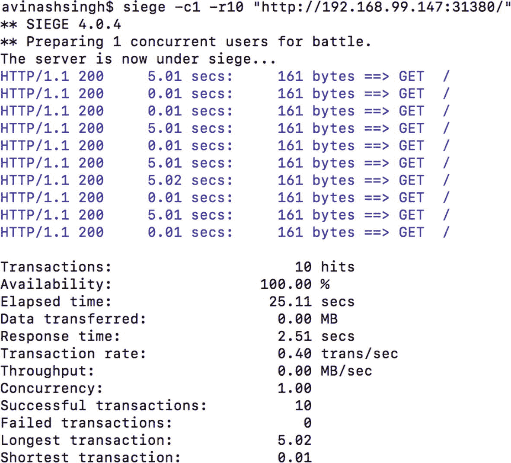

图 6-9

延迟喷射围攻响应

一种方法是，如果在一秒钟内没有收到响应，就让请求超时。由于我们在 webapp 服务中注入了一个故障，我们将在前端服务中添加一个超时。修改后的`VirtualService`配置看起来像清单 6-12 。

```
apiVersion: networking.istio.io/v1alpha3
kind: VirtualService
metadata:
  name: frontendservice
spec:
  hosts:
  - "*"
  gateways:
  - webapp-gateway
  http:
  - match:
    - uri:
        prefix: /
    route:
    - destination:
        host: frontendservice
    timeout: 1s
    retries:
      attempts: 0

Listing 6-12Modified Front-End Virtual Service to Set Timeout to 1 Second

```

应用的`siege`输出显示了一些错误，但是响应时间的上限是一秒。见图 6-10 。

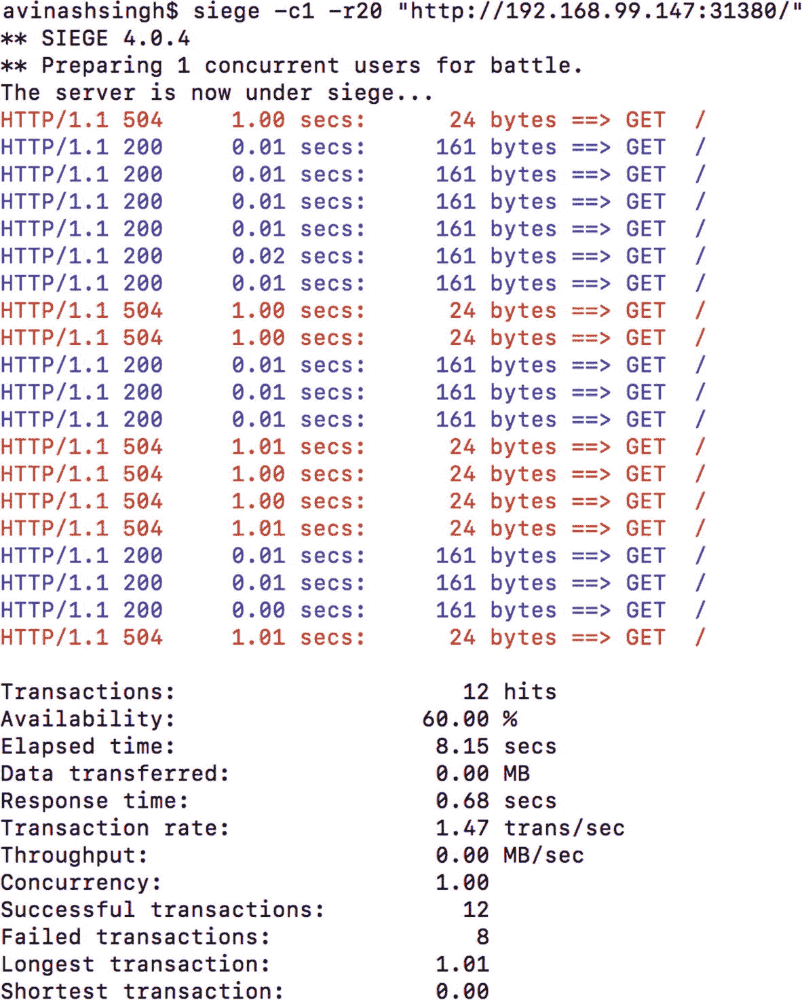

图 6-10

超时一秒的围攻响应

我们已经成功地满足了一个标准，即用户不必等待响应。让我们尝试一下用户收到 OK 响应的标准。为此，只需再次重试失败的请求。请注意，这意味着错误响应时间现在将增加到 1.5 秒，或每次尝试 0.5 秒。配置的变化如清单 6-13 所示。

```
apiVersion: networking.istio.io/v1alpha3
kind: VirtualService
metadata:
  name: frontendservice
spec:
  hosts:
  - "*"
  gateways:
  - webapp-gateway
  http:
  - match:
    - uri:
        prefix: /
    route:
    - destination:
        host: frontendservice
        port:
          number: 80
    retries:
       attempts: 1
       perTryTimeout: 0.5s

Listing 6-13Modified Web App Virtual Service to Set Timeout to 1 Second and Add Retries to 1

```

图 6-11 显示了所有请求成功的`siege`结果，但在少数情况下，这是以三次命中为代价的。从图中很容易看出，任何响应时间接近 1.5 秒的请求都被点击了三次。

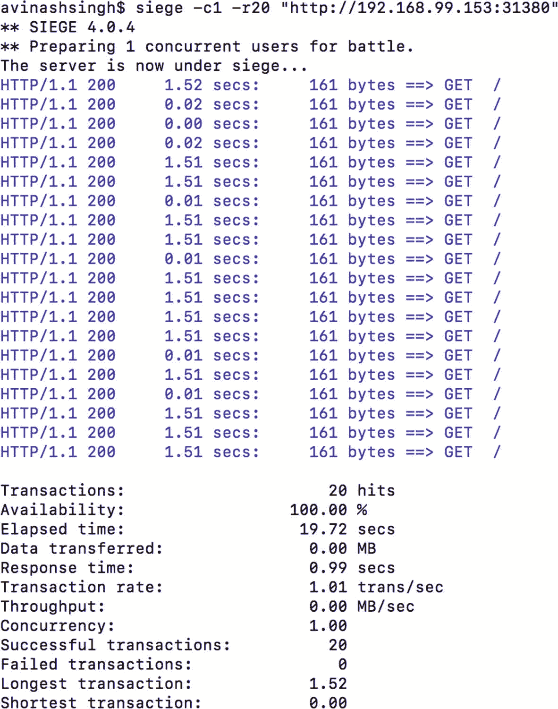

图 6-11

围攻响应，重试三次，每次尝试超时 0.5 秒

随着点击量的不断增加，我们保证用户得到响应但在供给端；换句话说，提供响应的服务可能必须处理比预期多得多的请求。有些情况下，服务会因请求而过载，并且可能会因为连续的请求而开始失败。即使超时使最终用户免于面对问题，即使有超时，服务也继续处理请求，导致资源的进一步消耗。在这种情况下，服务总是会因请求而过载，如果应用整天都在使用，可能永远无法恢复。

为了解决这个问题，服务需要一段冷却时间来完成所有挂起的请求(即使超时),并开始服务新的请求。这是使用断路器完成的。

## 断路器

断路器在电器中很常见。它确保任何一个设备都不会透支电流。过电流会导致电路发热，并可能导致火灾和整体故障。为了避免这种情况，断路器切断过电流设备的电源。

在微服务架构中，最常见的问题是服务故障的级联。如果服务由于某种原因没有响应，重复向服务发送请求会增加延迟，并给服务带来不必要的负载。断路器允许过载服务在开始保留新请求之前获得一些冷却时间。图 6-12 显示了断路器动作前后的请求行为。

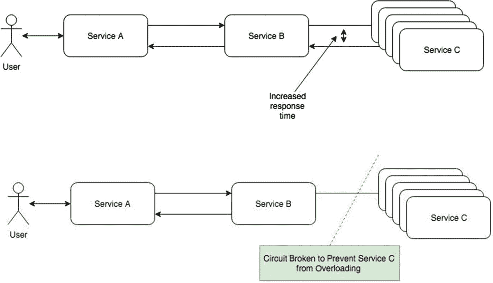

图 6-12

断路器动作

当服务 C 中连续故障的数量超过阈值时，断路器跳闸，并且在一段时间内，对服务 C 的所有呼叫立即失败。一段时间后，允许几个请求通过电路，以测试服务 C 是否已恢复。如果请求成功，服务 C 被恢复，或者服务在另一段时间内保持电路断开状态。图 6-13 显示了断路器断开后服务的恢复。

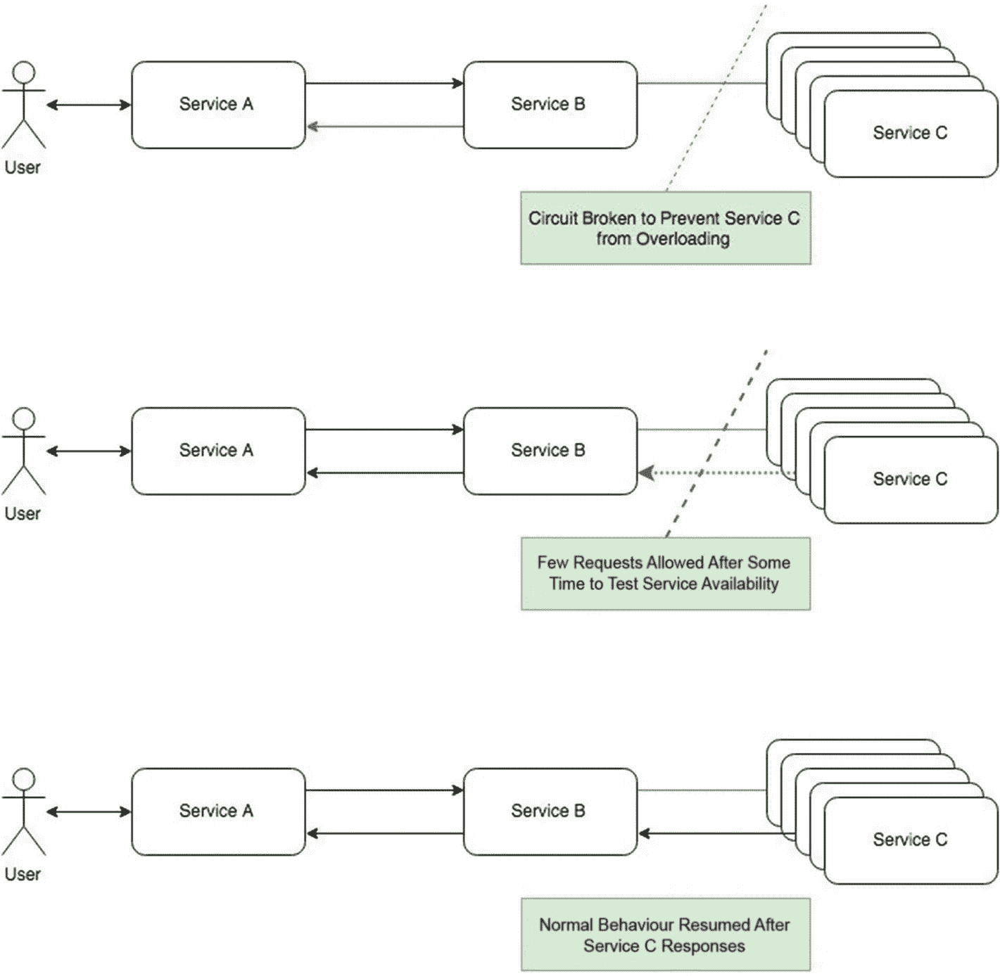

图 6-13

服务恢复后释放断路器

软件中的断路器可以使用流行的客户端断路器库来实现。如果 Java 是开发语言，客户端断路器的一个例子是网飞库 Hysterix，但同样，这需要开发人员负责应用内的断路器，这与应用逻辑没有太大关系。同时，对于多语言应用，它需要以多种语言实现。Istio 抽象出断路器，并使用特使配置来处理该过程。Envoy 在网络层实施断路，而不是在应用代码层。

Istio 在连接池级别和负载均衡器级别实现了断路器。

### 连接池断路器

在每次调用时创建到每个服务的新连接可能是一个开销很大的过程。它需要创建一个套接字，协商安全参数，然后通过网络进行通信并安全地关闭连接。保持连接池可以减少每次创建新连接的昂贵过程，而不是对每个请求都这样做。Envoy 为 Istio 提供了开箱即用的解决方案；换句话说，它在诸如 HTTP/1.1 和 HTTP/2 之类的有线协议之上支持一个抽象连接池。

#### HTTP/1.1 连接池

它创建的连接数量达到配置中规定的阈值。当可用时，请求被绑定到连接。连接的可用性可以基于现有连接变得空闲或新连接的产生，因为连接的数量仍然低于配置的阈值。如果一个连接断开，将建立一个新的连接来替换它。

#### HTTP/2 连接池

它创建了到上游主机的单一连接，并要求所有请求都通过它进行多路传输。如果主机重置连接或连接达到其最大流限制，池将创建一个新连接并释放以前的连接。

Istio 在特使层抽象了上述池，并优化了连接。现在让我们看一个例子，看看断路器的作用。

我们将创建 webapp 服务的新版本，并在网格中创建它的新部署。为了区别于旧版本，我们给代码增加了 0.5 秒的延迟。清单 6-14 向服务引入了新方法，这将向服务添加一个错误。

```
from flask import Flask
import datetime
import time
import os
import random

app = Flask(__name__)

global status
status = 200

@app.route("/")
def main():
    currentDT = datetime.datetime.now()
    if (status == 200):
        time.sleep(0.5)
    return "[{}]Welcome user! current time is {} ".format(os.environ['VERSION'],str(currentDT)), status

@app.route("/health")
def health():
    return "OK"

@app.route("/addfault")
def addfault():
    global status
    if (status == 200):
        status = 503
    else:
        status = 200
    return "OK"

if __name__ == "__main__":
    app.run(host='0.0.0.0')

Listing 6-14Addition of a Fault to the Webapp Application

```

清单 6-15 展示了新的部署。

```
apiVersion: networking.istio.io/v1alpha3
kind: VirtualService
metadata:
  name: frontendservice
spec:
  hosts:
  - "*"
  gateways:
  - webapp-gateway
  http:
  - match:
    - uri:
        prefix: /
    route:
    - destination:
        host: frontendservice
        port:
          number: 80
    retries:
       attempts: 1
       perTryTimeout: 0.5s

Listing 6-15Webapp-deployment-v7.1.yaml

```

让我们更改目的地规则以适应 7.0 版和 7.1 版(参见清单 6-16 )。

```
apiVersion: networking.istio.io/v1alpha3
kind: DestinationRule
metadata:
  name: webservice
spec:
  host: webservice
  subsets:
  - name: v0
    labels:
      version: v7.0
  - name: v1
    labels:
      version: v7.1

Listing 6-16Destination rule modified to add v7.1

```

有了这些变化，让我们使用`siege`来检查应用的性能。参见图 6-14 。

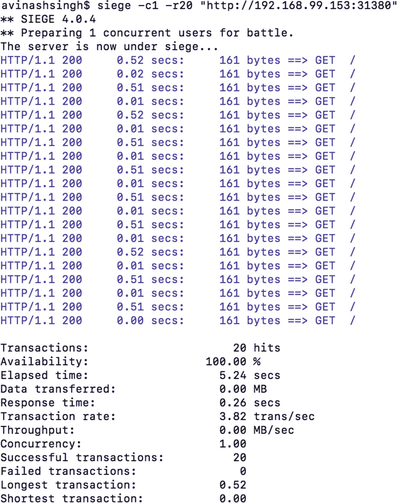

图 6-14

7.0 版和 7.1 版 webapp 的应用性能

我们很容易区分出 7.1 版是在 0.5+秒内响应的版本。在实验中，所有的调用似乎都是成功的，但在实际环境中，0.5 秒的延迟可能会不断堆积，如果并发用户增加，会使调用服务(前端服务)保持在队列中。这将增加服务的响应时间，导致我们在前面的步骤中配置的超时，但同时仍然让服务处理请求。因此，假设在一定数量的响应失败后，服务将失败，我们可以配置一个断路器来防止服务受到它无法处理的进一步请求的轰炸。让我们创建一个规则来演示请求的失败，并查看断路器的运行情况。

清单 6-17 显示了一个目的地规则，将连接数和每个连接的最大请求数限制在 7.1 版。

```
apiVersion: networking.istio.io/v1alpha3
kind: DestinationRule
metadata:
  name: webservice-circuitbreaker
spec:
  host: webservice
  subsets:
  - name: v1
    labels:
      version: v7.1
  trafficPolicy:
    connectionPool:
      tcp:
        maxConnections: 1
      http:
        http1MaxPendingRequests: 1
        maxRequestsPerConnection: 1

Listing 6-17Destination Rule for v7.1 Restricting Number of Connections

```

有了这种配置，我们将用并发请求轰炸服务。这种限制的结果如图 6-15 所示。

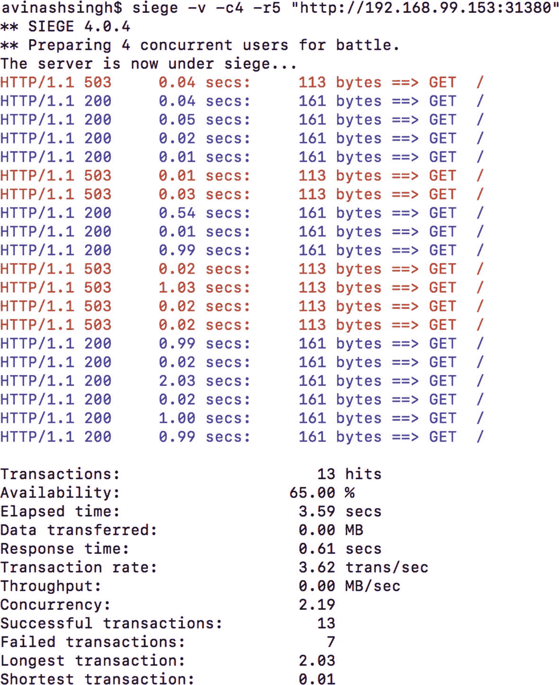

图 6-15

用四个并发请求轰炸服务

与之前的结果相比，我们的大多数请求都在 0.1 秒内完成。从用户的角度来看，错误的数量会增加，但是服务会有一段冷却时间来稳定在阈值以下。在我们的例子中，因为我们已经将最大连接数限制设置为 1，所以我们很容易在示例中演示这一点。

### 负载均衡器断路器

到目前为止，我们已经看到了在低性能的情况下，服务是如何避免流量轰炸的，但是这增加了用户得到的错误的数量。只要这是一个暂时的故障，这可能是好的，但是如果故障持续很长时间，最终用户将继续收到这些错误。在这种情况下，解决方法应该是从集群中删除服务节点，直到它恢复。Istio 会尝试检测表现突出的节点或异常值，并将其从负载均衡器中移除。

让我们重新配置我们的目的地规则，添加对异常值的检查，并在需要时从负载均衡器中删除它。清单 6-18 显示了修改后的配置。

```
apiVersion: networking.istio.io/v1alpha3
kind: DestinationRule
metadata:
  name: webservice-circuitbreaker
spec:
  host: webservice
  subsets:
  - name: v1
    labels:
      version: v7.1
  trafficPolicy:
    connectionPool:
      tcp:
        maxConnections: 1
      http:
        http1MaxPendingRequests: 1
        maxRequestsPerConnection: 1
      outlierDetection:
        baseEjectionTime: 10s
        consecutiveErrors: 1
        interval: 1s
        maxEjectionPercent: 100

Listing 6-18Destination Rule for v7.1 Adding Configuration to Remove Outliers

```

在这种配置中，如果出现一个以上的连续错误，就会弹出故障节点。它以*间隔*的频率不断检查节点是否回来。如果需要的话，我们还允许删除服务的所有副本。参见图 6-16 了解服务的故障添加和完整结果。现在离群点已经被剔除，每个请求的最大响应时间不到 0.15 秒。

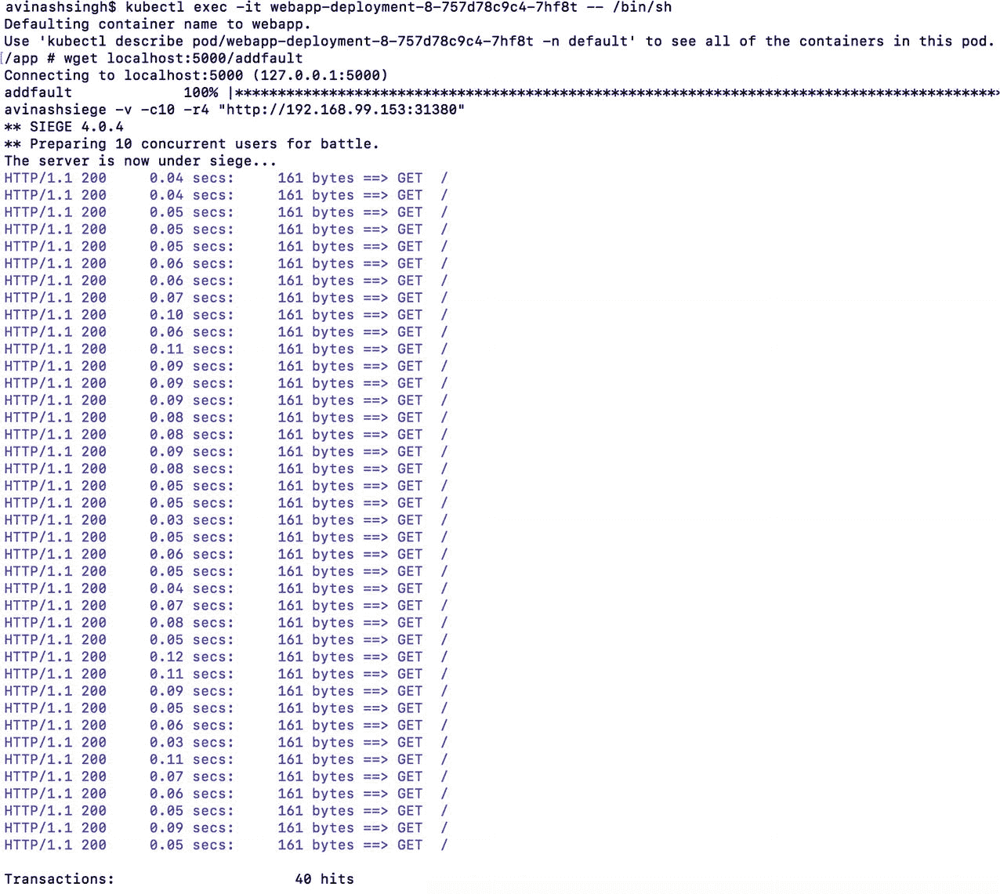

图 6-16

从负载均衡器中移除异常值，所有请求都将转到 webapp 服务的 7.0 版

断路器本身足以挽救灾难，但不能解决分布式系统的全部问题。

## 跳回

系统的整体架构不仅要服务于最终用户的请求，还要保持应用正常运行以满足未来的请求。将所有这些 Istio 特性结合起来，您将获得一个稳定的系统，如下所示:

1.  最终用户请求服务进行响应。如果响应需要很长时间，请求就会超时。

2.  一旦请求超时，不是让最终用户重试请求，而是在每个网络跳重试请求。这一次，请求应该发送到不同的 pod，假设之前的那个 pod 可能出现了临时故障。

3.  通过负载均衡将进一步的请求分发到服务的不同单元，确保没有一个单元过载。

4.  因为使用了客户端负载均衡器，所以负载均衡器不会过载。如果客户端宕机，其副本可以在此期间接管，直到产生替代客户端。

5.  如果其中一个节点没有响应，使用断路器给它一段冷却时间，同时调用服务可以尝试向另一个节点发出请求。

6.  如果冷却期不足，则从服务池中退出该节点，以避免在服务恢复之前的任何未来请求。

## 摘要

在本章中，我们讨论了 Istio 弹性。我们看到了重试和超时是如何对最终用户隐藏应用中的错误和延迟的。负载均衡很重要，因为对同一实例的重试可能会再次失败。客户端负载均衡具有无单点故障的概念，可防止对指向单个节点的请求进行节流以实现平衡。断路器和连接池试图使应用服务保持健康状态，避免它们过载和网络连接开销。在下一章中，我们将使用 Grafana 和 Prometheus 等工具来研究应用度量和监控。