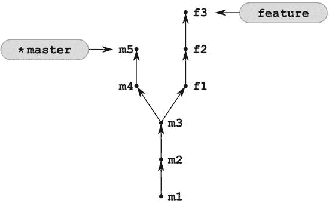
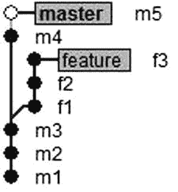
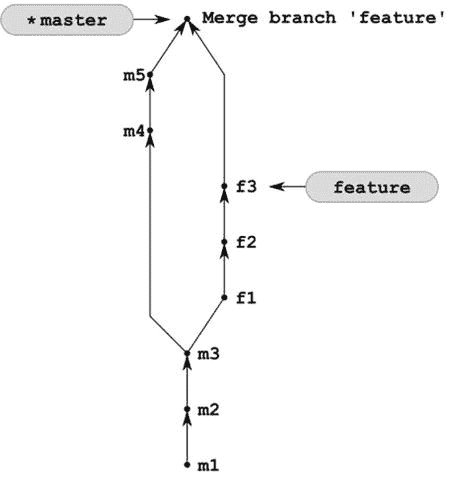
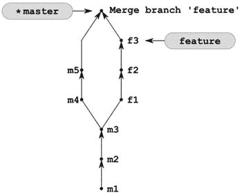
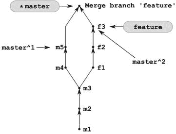
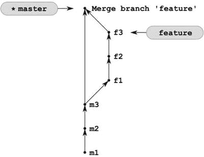
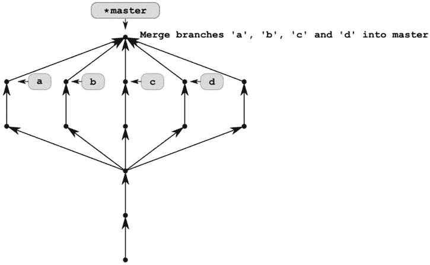
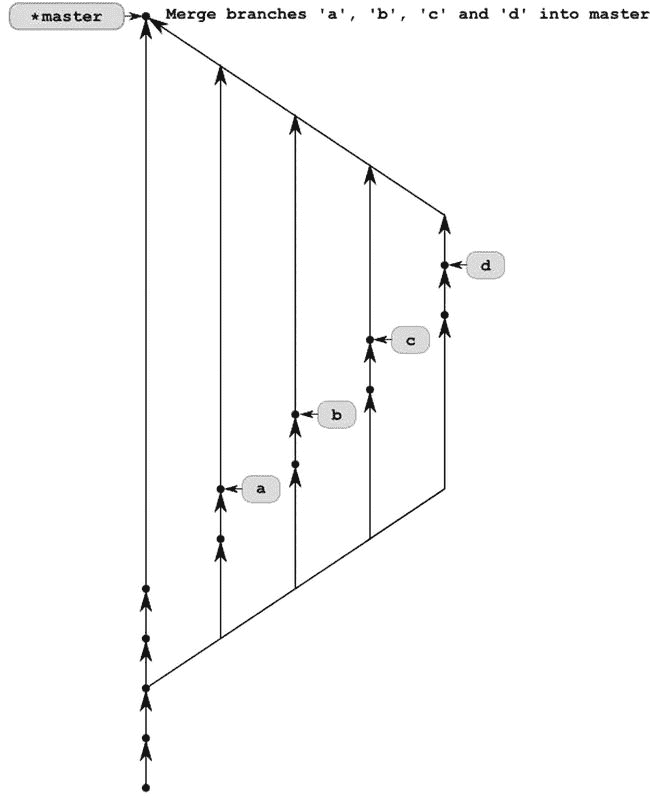

# 六、合并分支

创建和切换分支的命令允许您将项目分成独立的开发线。例如，您可以创建分支来启动应用中的新功能或实现修复。迟早你会完成一个特性或修复，然后很可能，你会想把你的努力融入到开发的主线中。连接不同分支的过程可以使用两种不同的技术来完成。第一个是通过 **$ git merge** 命令实现的。这是本章的主题。第二个是用 **$ git rebase** 命令完成的。我们将推迟这个问题，因为它是下一章的主题。

也许你已经注意到术语**合并**并不是全新的。我们已经在配方 5-7 中使用它来表示将工作目录中的变更与我们切换到的分支连接起来的过程。在那里，合并是在结帐时完成的。结果被留在工作目录中等待提交。在本章中，我们考虑将不同的分支合并在一起。合并分支的结果将被存储和提交，也就是说，在一个分支中。我们将在不包含未提交或未跟踪文件的干净配方中执行合并。在配方之后，存储库将再次处于干净的状态。

在这里，你会充分体会到`simple-commit`和`clone-with-branches`的别名。他们会带你到更高的抽象层次。我们将使用`$ git simple-commit`创建一系列提交，而不是使用`$ git add`和`$ git commit`以及`$ echo foo > bar`。因此，你将能够专注于合并。别名的工作方式不会发生冲突。当然，这是一个简化的设置，而不是真实的场景。但是我更喜欢把合并和解决冲突分成两个独立的步骤。冲突将在第九章中深入讨论。

这一章反映了我通常教授分支和合并的方式。我坚信学习 git 分支模型的一个关键点是掌握这个操作转换修订图的方式。一旦您理解了如何创建一个具有预定义结构的图，合并就变得简单明了。

本章涵盖了三种合并情况:

*   快进
*   两个分叉分支的合并
*   多个分叉分支的合并

为了实现这些合并，我们需要创建:

*   有两个分支的存储库，其中一个必须合并到另一个中
*   具有两个分叉分支的存储库
*   和具有多个分叉分支的储存库

所有这些存储库都将被创建在单独的配方中，如果有必要的话，这样可以更容易地多次重复每个案例。每当您想要再次执行合并时，只需克隆一个初始存储库并执行合并分支的命令。以这种方式工作，你可以，例如，测试和分析`$ git merge`命令的不同选项如何影响它的行为。

此外，本章还解释了:

*   如何撤消合并操作
*   如何使用`--no-ff`开关强制将快进实现为典型的合并
*   如何使用`--ff-only`开关确保合并是快进
*   如何使用第 n 个父引用

6-1.在分支机构中实现新功能

问题

您的存储库是干净的，只包含一个名为`master`的分支。该分支由三个修订组成。该配方的起点如图图 6-1 所示。您希望实现应用的一个新特性。因为您不确定这个解决方案是否是好的，所以您决定使用一个名为`feature`的新分支。你想要达到的结果如图图 6-2 所示。


图 6-1 。制作方法 6-1 的起点


图 6-2 。完成配方 6-1

解决办法

启动命令行并创建新的存储库:

```
$ cd git-recipes
$ git init 06-01
$ cd 06-01
```

接下来，在`master`分支中创建三个提交:

```
$ git simple-commit m1 m2 m3
```

你的存储库现在看起来像图 6-1 。创建一个名为`feature`的新分支，包含三个新提交:

```
$ git checkout -b feature
$ git simple-commit f1 f2 f3
```

用`$ git checkout master`命令完成检查`master`分支的配方。现在，存储库看起来像图 6-2 。

它是如何工作的

该配方使用已知的命令。它提供了在应用中实现新功能的最佳方法。每当你开始研究一个新的课题时，就在一个专门的分支中进行。请注意，图 6-2 中显示的库也可以绘制成图 6-3 中的库。修改不必形成一条直线。该配方对分支中的提交数量不敏感。例如，`master`分支可以包括 100 次提交，而`feature`分支只能包括一次提交。这个存储库唯一重要的方面是`master`分支完全合并到了`feature`分支中。


图 6-3 。图 6-2 的替代图形表示

6-2.快进分支

问题

你已经完成了配方 6-1 的工作，并决定将你在`feature`分支的工作合并到`master`分支中。你想要创建如图图 6-4 所示的存储库。


图 6-4 。将特征分支合并到主分支的结果

解决办法

用分支克隆配方 6-1 中的存储库:

```
$ cd git-recipes
$ git clone-with-branches 06-01 06-02
$ cd 06-02
```

现在你在`master`分支。用`$ git merge feature`命令将`feature`分支合并到`master`分支。该命令将打印此操作以快进方式进行的信息。当你完成时，`master`分支包含了在`master`分支中创建的所有文件以及来自`feature`分支的三个文件。`$ ls`命令将打印六个文件名:`f1.txt`、`f2.txt`、`f3.txt`、`m1.txt`、`m2.txt`和`m3.txt`。

它是如何工作的

这个秘籍展示了合并分支的最简单的例子。有两个分支`master`和`feature`，当前分支为`master`。一个很重要的事实是，`master`分支中的所有修改都包含在`feature`分支中。我们说`master`分支合并到了`feature`分支。该关系在配方 5-9 中定义。

在图 6-2 等设置中，`master`分支发出的命令`$ git merge feature`只是将`master`指针移动到`feature`分支引用的地方。这个操作叫做**快进**。这是连接两个发展历史的最简单的例子。最终的存储库包含两个指向完全相同的提交的分支。请注意，在快进期间，不会创建新的提交。

请记住，历史将不包含我们使用$ git merge 命令的任何信息。特征分支的名称可以从历史中消失。这可以算是一个缺点。我们将在配方 6-6 中避开这个缺点。

您也可以尝试将`master`分支合并到`feature`分支中。那种情况下会发生什么？因为`master`分支已经合并到`feature`分支了，所以命令:

```
$ git checkout feature
$ git merge master
```

只会打印一条短信:`Already up-to-date`。存储库不会改变。

6-3.撤消快进

问题

你已经完成了配方 6-2 中呈现的快进操作，你对它不满意。你想撤销合并。换句话说，你想要将图 6-4 中所示的存储库转换回图 6-2 中所示的形式。

解决办法

用`cp`命令克隆存储库`06-02`:

```
$ cd git-recipes
$ cp -R 06-02 06-03
$ cd 06-03
```

撤消合并最简单的解决方案是使用 reflog。由于使用了`cp`命令来克隆 reflog，所以它不是空的，如果使用了`$ git clone`命令，它就会是空的。命令`$ git reflog`打印的结果类似于:

```
0deae94 HEAD@{0}: merge feature: Fast-forward
757d501 HEAD@{1}: checkout: moving from feature to master
0deae94 HEAD@{2}: checkout: moving from feature to feature
0deae94 HEAD@{3}: clone: from c:/git-recipes/06-01
```

您可以使用`$ git reset --hard HEAD@{1}`撤销合并。

它是如何工作的

在合并的情况下，`$ git merge`命令之后的 reflog 条目`HEAD@{1}`指向您当前的分支，就像它在合并之前一样。将此作为参数传递给`$ git reset --hard`，您将撤销合并。即使您的 reflog 为空，您仍然可以使用 SHA-1 名称撤销合并，如在`$ git reset --hard 757d501`中所示。

6-4.平行发展 分叉分支

问题

您刚刚创建了一个包含应用新特性的分支。存储库看起来像图 6-2 中的所示。这是配方 6-4 的起点。但是，您不确定您在`feature`分支的工作是否已经完成。您不确定它是否已准备好进行合并。同时，你想继续在`master`分公司工作。你想切换到`master`分支并创建一些新的版本。这个配方之后的库应该看起来像图 6-5 。



图 6-5 。配方 6-4 后获得的储存库

解决办法

用分支克隆配方 6-1 中的存储库:

```
$ cd git-recipes
$ git clone-with-branches 06-01 06-04
$ cd 06-04
```

并创建两个新的修订版本:

```
$ git simple-commit m4 m5
```

它是如何工作的

这个配方强调了这样一个事实，即不同分支中的工作可以并行地继续**。在这种情况下，我们说两个分支`master`和`feature` **分叉**。提交`m4`和`f1`被创建的确切时间并不重要，插图通常会在同一级别显示它们，如图 6-5 中的所示。实际上，它们总是在不同的时刻创建的。因此，可视化修订图的命令，如`$ git --oneline --graph --decorate --all`或`$ gitk --all&`，总是在不同的级别显示它们，如图图 6-6 。修订版`m4`和`m5`是后来创建的，因此它们将出现在修订版`f1`、`f2`和`f3`之上。**


图 6-6 。提交 m4 和 m5 是在提交 f1、f2、f3 之后创建的，因此它们被绘制在上面

`$ gitk` `--all &`命令从图 6-6 中的图 6-7 中呈现仓库。



图 6-7 。使用 gitk 应用可视化配方 6-4 的储存库

请记住，在图 6-5 所示的存储库中进行快速合并是不可能的。您可以使用`$ git merge`命令的附加参数`--ff-only`进行检查。这个参数在 git 上设置了一个附加条件:执行合并，但是只有在快速前进的情况下。命令:

```
$ git merge --ff-only feature
```

在`master`分支中执行的可以解释为下面用伪代码写的条件语句:

```
if (the merge of feature into master is a fast-forward) {
    $ git merge feature
}
```

图 6-5 中所示的库中执行的命令`$ git merge --ff-only feature`将无法产生输出:

```
fatal: Not possible to fast-forward, aborting.
```

使用`--ff-only`开关，您可以确保您的合并操作总是以快进方式进行。如果合并 不能快进完成，则中止。为了快速执行分叉分支的合并，我们将使用`$ git rebase`命令。这将是下一章的主题。

6-5.合并 分叉的分支

问题

你想要合并如图 6-5 所示的分支。f `eature`分支将并入`master`分支。您想要获取的存储库在图 6-8 中显示。图 6-8 强调了`m4`、`m5`和`f1`、`f2`、`f3`修订的创建顺序。在这个配方中，这个顺序并不重要，因此图 6-8 也可以像图 6-9 那样绘制。



图 6-8 。将分叉的分支合并后得到的知识库



图 6-9 。在图 6-8 中显示了储存库的可选视觉表示

解决办法

用分支克隆配方 6-4 中的存储库:

```
$ cd git-recipes
$ git clone-with-branches 06-04 06-05
$ cd 06-05
```

并用`$ git merge feature`命令合并分支。

它是如何工作的

在不可能快进的情况下，`$ git merge`命令创建一个额外的修订，称为**合并提交** 。此提交与您到目前为止创建的提交不同，因为它包含多个父提交。它连接两个或多个不同的版本。这使我们有机会将每个提交分类为**非合并提交** 或**合并提交**。一个**合并提交**是一个有两个或更多父提交的提交。**非合并提交**是只有一个父提交的提交。显然，在这个配方中创建的提交有两个父提交，因此它是一个合并提交。

当使用`$ git log`或`$ gitk`检查历史时，您可以过滤掉这两种类型的提交。命令:

```
$ git log --oneline --merges
```

输出只合并提交，而

```
$ git log --oneline --no-merges
```

仅打印非合并提交。您还可以通过以下方式设置预期的最小和最大父节点数:

```
$ git log --oneline --max-parents=X --min-parents=Y
```

其中`X`和`Y`是任意正整数。

Git 支持引用，这些引用允许它使用脱字符号(^)选取合并提交的任何父元素。引用`[REVISION]^[n]`指向用`[REVISION]`标识的提交的第 n 个父提交。对于图 6-9 中的库，`master¹`指向版本`m5`；`master²`指向修订`f3`，如图图 6-10 所示。我将它们称为第 n 个父引用。



图 6-10 。第 n 个父引用 master¹ 和 master²

记住参考号`[REVISION]∼`、`[REVISION]∼1`、`[REVISION]^`和`[REVISION]¹`是等价的。这是因为`1`是默认值，并且`∼`总是引用合并提交中的第一个父节点。

如果你想放心的使用`$ git merge`命令，你要记住**当前分支是你合并到**的分支，**传递给$ git merge 命令的分支是**要合并的分支。您合并到的分支(`master`分支)的末端成为合并提交的第一个父级，您合并到的分支(`feature`分支)的末端成为第二个父级。您合并的分支不会改变，它仍然指向与命令之前相同的修订。您合并到的分支会收到一个新的 commit，其注释类似于:

```
Merge branch 'X'
```

其中`X`是您合并的分支的名称(在我们的菜谱中是`feature`)。您可以记住上面的规则，记住，当在`master`分支上时，`$ git log --oneline -1`命令会打印:

```
6fb2 Merge branch 'feature'
```

正如您所猜测的，工作目录现在包含了来自两个分支的所有文件。命令`$ ls`输出文件:`f1.txt`、`f2.txt`、`f3.txt`、`m1.txt`、`m2.txt`、`m3.txt`、`m4.txt`、`m5.txt`。

可以完全按照配方 6-3 中的方法撤消合并。只是这次你不仅可以使用 reflog 和 SHA-1，还可以使用祖先和第 n 个父引用。假设你在`master`分支，以下两个命令将撤销本配方中讨论的合并:

```
$ git reset --hard master^
$ git reset --hard master∼
```

但是，如果你在 Windows 命令行工作，事情就复杂了。因为插入符号是一个特殊的字符，你必须以特殊的方式使用它。插入符号被 Windows shell 分析器用作转义字符。在 Linux shells 中，这个角色通常分配给反斜杠(\)字符。如果你想在 Windows 命令行中使用插入符号，你必须键入两次(^^).)此外，因为在 Windows 上 git 子命令是通过间接 shell 调用触发的，所以转义被执行两次。因此，如果您想在 Windows 命令行中使用引用`master²`，您必须键入四个 caret`master^^^²`。当然，如果您在 bash shell 中工作，这并不适用。

最有趣的情况是，当您想在嵌入字符串的 SQL 语句的正则表达式中使用反斜杠(`\)`)时，比如:

```
$query = "SELECT * FROM paradox WHEARE content REGEXP '\\\\\\\\'";
```

所有三种语言—RegExp、SQL 和 PHP—都使用相同的转义字符，即反斜杠(`\)`)。因此，一个反斜杠被编码为八个反斜杠！

6-6.避免了 的快进合并

问题

你的存储库看起来像图 6-2 。你想将分支`feature`合并到`master`中，这样历史看起来就像图 6-11 。您希望来自`feature`分支的所有修订被可视化地分组在一个灯泡中。



图 6-11 。使用- no-ff 选项将特征分支合并到主分支的结果

解决办法

用分支克隆配方 6-1 中的存储库:

```
$ cd git-recipes
$ git clone-with-branches 06-01 06-06
$ cd 06-06
```

然后将`feature`分支与:

```
$ git merge --no-ff feature
```

它是如何工作的

`$ git merge`命令的选项`--no-ff` 改变了强制创建合并提交的默认行为，即使合并可以作为快进来执行。通过这种方式，您保留了提交`f1`、`f2`和`f3`相互关联的信息。它们都处理开发的同一个方面，共同构成一个完整的作品。如果出于某种原因，您需要将整个分支恢复或复制到历史中的其他地方，像这样组织提交将使操作更容易。

6-7.发散 多个分支

问题

您想要创建如图 6-12 所示的存储库。它包含五个分叉的分支。请注意，创建修订的实际顺序并不重要。该图显示了在完全相同的时刻创建的来自不同分支的修订，我们知道这是不正确的。您是单独工作的，并且您的所有修订都是按顺序创建的，一次一个，而不是并行的。但是这个图像的作用是强调，不管你提交的顺序是什么，配方 6-7 中描述的过程都工作得很好。


图 6-12 。具有五个不同分支的存储库

解决办法

用分支克隆配方 6-1 中的存储库:

```
$ cd git-recipes
$ git clone-with-branches 06-01 06-07
$ cd 06-07
```

并创建四个新分支:

```
$ git branch a
$ git branch b
$ git branch c
$ git branch d
```

然后一个接一个地切换到每个分支并创建两个新的提交。这些命令如清单 6-1 中的所示。

***清单 6-1。*** 创建分叉分支的命令如图图 6-9

```
$ git checkout master
$ git simple-commit m4 m5

$ git checkout a
$ git simple-commit a1 a2

$ git checkout b
$ git simple-commit b1 b2

$ git checkout c
$ git simple-commit c1 c2

$ git checkout d
$ git simple-commit d1 d2

$ git checkout master
```

它是如何工作的

例如，图 6-12 所示的库结构可以在你的产品发布新版本后获得。我使用像这样构造的存储库来给框架添加新的独立特性。一旦一个框架的稳定特性发布了，我就实现多样化的特性，比如授权、数据库连接、开发环境设置，以及不同分支中的各种扩展。通过这种方式，我可以创建满足特定需求的框架发行版。发行版可以包含在分支中实现的任何特性。每个功能都可以根据您的需要打开或关闭。这个发行版是用 merge 命令创建的:您合并的分支将出现在最终的发行版中。

用清单 6-1 中的命令创建的储存库表单图 6-12 将由`$ git log --oneline --graph --all`命令显示，如图 6-13 中的所示。


图 6-13 。由$ git log - oneline - graph - all 命令绘制的来自图 6-12 的存储库

6-8.合并 多个分支

问题

在图 6-12 中所示的存储库中工作，您想要将四个分支`a`、`b`、`c`和`d`合并成`master`分支。您的目标是将图 6-12 所示的存储库转换成图 6-14 所示的存储库。



图 6-14 。将分支 a、b、c 和 d 合并到主分支的结果

解决办法

用分支克隆配方 6-7 中的存储库:

```
$ cd git-recipes
$ git clone-with-branches 06-07 06-08
$ cd 06-08
```

并将四个分支合并成`master`分支执行:

```
$ git merge a b c d
```

它是如何工作的

命令`$ git merge a b c d`在`master`中创建新的提交，标记为`Merge branches` `'a'`、`'b'`、`'c'`和`'d'`。这将是在当前分支中创建的合并提交。它的五个父级将可以通过以下第 n 个父级引用来访问:

```
master¹
master²
master³
master⁴
master⁵
```

第一个父进程`master¹`指向与`master`分支在图 6-14 中指向的提交相同的提交。第二个父节点`master²`指向由`a`分支在图 6-14 中指向的提交。第三个父节点`master³`，通过`b`分支指向图 6-14 中表示的提交。诸如此类。正如您所猜测的，父节点的顺序取决于`$ git merge a b c d`命令传递给分支的顺序。

许多分支的合并可以用与方案 6-3 或方案 6-5 中相同的方式撤销。您可以使用 reflog、SHA-1 名称或第 n 个祖先引用:

```
$ git reset --hard master^
```

由带`--graph`开关的`$ git log`命令打印的图 6-14 中所示的库的可视化表示在图 6-15 中呈现。



图 6-15 。由$ git log with - graph switch 命令绘制的配方 6-8 中的存储库

很少需要合并两个以上的分支。事实上，在很多流行的项目中，比如 jQuery、Twitter Bootstrap、Ruby on Rails、Symfony，都没有超过两个父级的提交。我所知道的同时合并两个以上分支的项目只有 git 和 Linux。令人惊讶的是，Linux 包含有 32 个父级的提交！您可以使用`$ git log`命令的`--min-parents=n`选项进行验证，例如:

```
$ git log --oneline --min-parents=32
```

另一个补充参数`--max-parent=n`设置由`$ git log`打印的提交的最大父项数量的要求。

当然，合并众多分支的能力并不重要。操作:

```
$ git merge a b c d
```

可以作为四个不同的合并来执行，每个合并只涉及两个分支:

```
$ git merge a
$ git merge b
$ git merge c
$ git merge d
```

上面唯一的缺点是历史将包含四个合并提交，而不是一个。

摘要

现在，你已经知道了`$ git merge`，你可以开始充分欣赏 **git 分支模型**。使用`$ git merge`处理合并到的**分支和合并到**的**分支。您合并到的分支是您当前的分支。您合并的分支是传递给`$ git merge`命令的分支。如果命令`$ git branch`打印:**

```

  bar
* foo
```

那么对于`$ git merge bar`,我们有:

*   是您合并到的分支
*   是你合并的分支

一般来说，`$ git merge`命令执行两种操作之一:要么是**快进**，要么是**合并**。

**快进**，也用 FF 表示，是通过在图中向前移动分支来更新分支的过程。当您要合并的分支合并到已经合并的分支中时，就会发生这种情况。在这种情况下，不会创建新的提交。该命令的唯一结果是您合并的分支(您的当前分支)的更新的 SHA-1 散列。如果你的分支出现分歧，快进是不可能的。

在另一种情况下，当 FF 不可能时，`$ git merge`命令通过创建新的提交来执行`merge`。这个新提交非常特殊:它至少有两个父提交。毫不奇怪，它被称为**合并提交**。

本章之后，你应该能够合并任意数量的分支，如果你对结果不满意，可以撤销操作。您知道如何强制执行非快进合并，即使在默认情况下，操作将作为快进执行。最后，您知道如何使用`--ff-only`开关来避免执行非快进合并。

当我们深入工作流时，合并的所有这些方面都很重要。