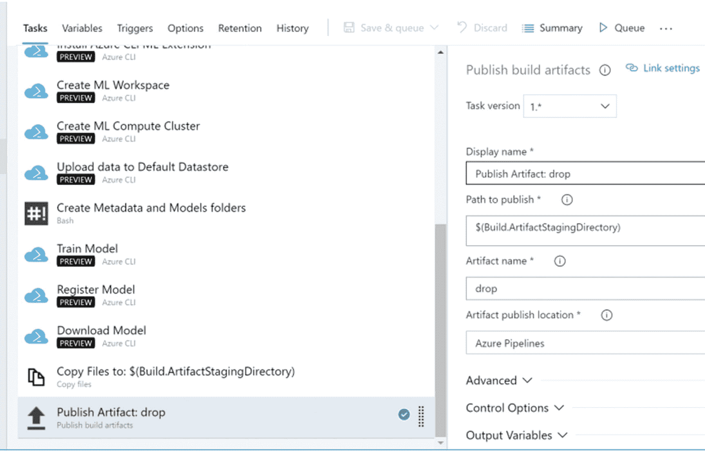
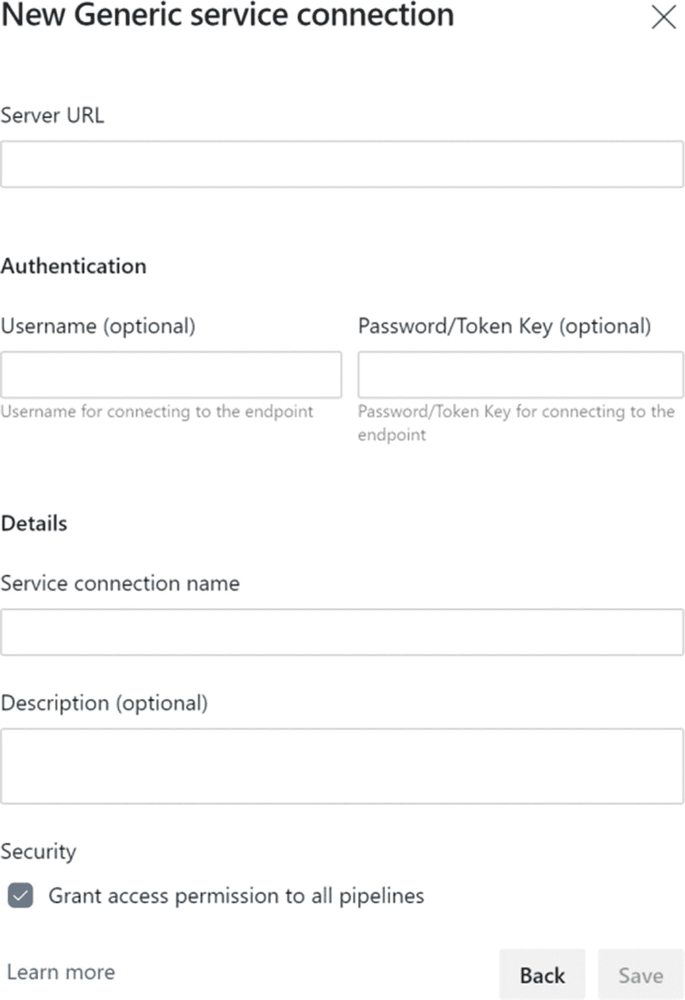
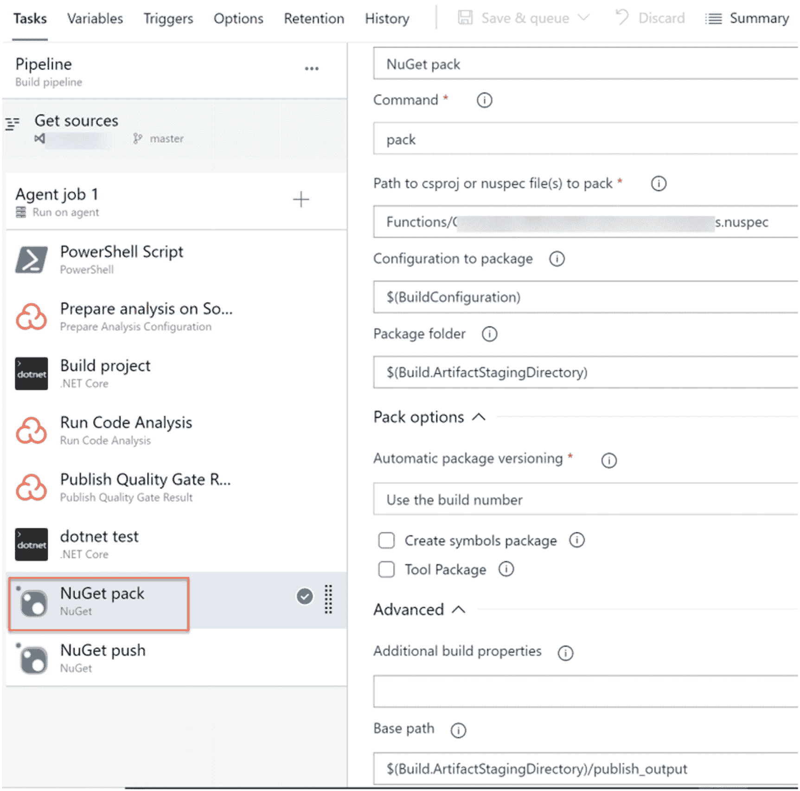
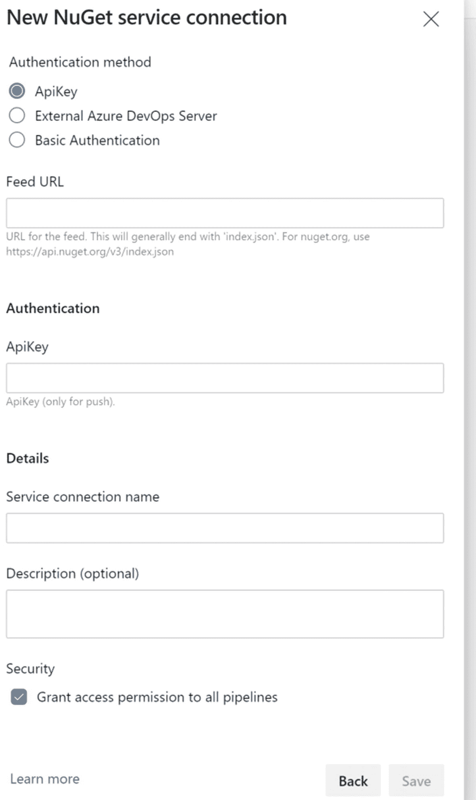
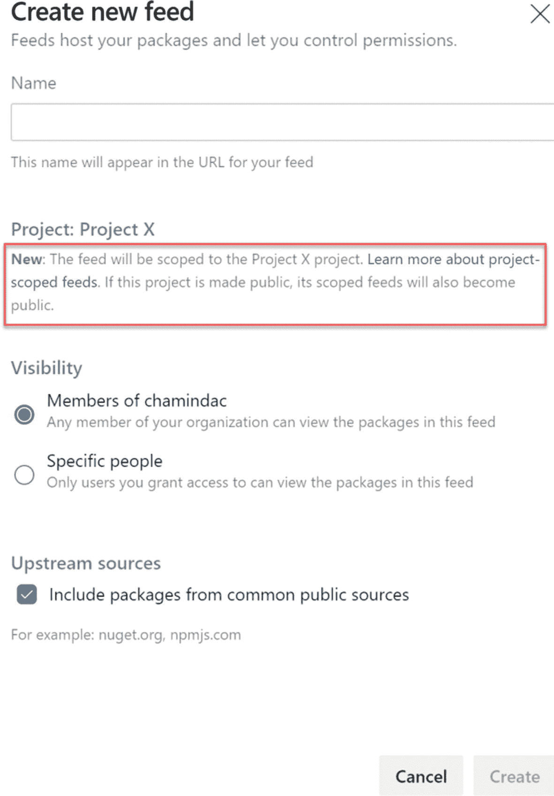
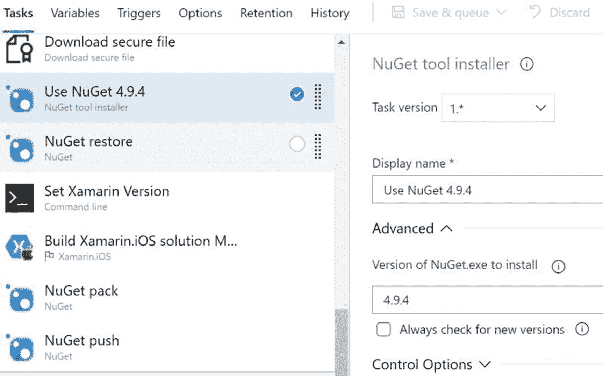

# 七、使用工件

构建的工件或输出包含二进制文件和将软件部署到目标环境所需的支持文件。根据正在构建的项目类型，以及部署和测试需求，工件的内容可能会有所不同。它们可能包含部署规范，如脚本或模板，如 YAML 文件、测试数据、测试执行脚本等。

有几种方法可以在构建中发布工件，比如使它在构建中可用，将工件放在共享路径中，或者将其创建为一个包并上传到一个提要中。让我们在本章中详细探讨这些选项。此外，让我们看看如何使用从另一个构建以及在开发工具中上传到提要的包。

## 第 7.01 课:发布构建工件

正如我们之前简单提到的，有几种方法可以发布构建生成的工件。您可以使用发布管道中每个已发布方法中可用的工件来将软件部署到预期的目标。让我们讨论每种类型的发布机制。

第一种方法是将一个构建的输出发布为同一个构建中的工件。这使得构建管道的实现变得简单。构建中的步骤将生成部署所需的内容。生成的内容通常存放在构建工件存放目录中。然后工件暂存目录将被发布到构建中。见图 7-1 。

图 7-1

在构建中创建一个放置并发布工件

第二种选择是使用共享路径。该选项主要在使用文件服务器时有用。您可以使文件服务器路径对本地代理方案可用，在这种情况下，代理可以访问网络中的共享路径。

第三个选项是使用 FTP 上载任务，您可以在团队项目中设置 FTP 服务器的服务终结点。为此，您可以使用通用服务连接类型，在该类型中，您可以向 FTP 服务器提供 FTP 服务器 URL 和凭据。见图 7-2 。

图 7-2

通用服务连接

下一个选项是将您的构建工件打包成一个 NuGet 包，并将其上传到一个 NuGet 提要。为此，您可以使用团队项目中可用的工件提要，我们将在本章的下几课中详细讨论。

在本课中，我们讨论了可用于从构建中发布工件的不同选项。

## 第 7.02 课:将工件打包并发布为 NuGet

发布构建工件的一个选择是使用 NuGet 包。与其他方法相比，使用 feed 来保存构建包有一个很大的好处。主要是它允许你保持发布的包，不管版本是否由于为版本设置的保留限制而从 Azure DevOps 中删除。

当您使用 NuGet 包任务时，您可以将内部版本号作为版本控制应用于包，或者您可以使用另一种首选版本机制。NuGet 包支持语义版本化，这是版本化软件版本的首选和可靠的方式。此外，它允许您使用外部部署管道，比如使用 NuGet 包部署的 Octopus。此外，您可以通过构建和打包成 NuGet 包来共享解决方案的公共代码组件。

要将构建输出的内容打包为 NuGet 包，可以使用一个名为 nuspec 的文件。nuspec 文件包含创建 NuGet 包的规范，例如包的名称、版本(版本可以在 NuGet pack 任务中被覆盖)、作者详细信息，甚至包含文件或指定路径模式中的文件的规范。你可以在 [`https://docs.microsoft.com/en-us/nuget/reference/nuspec`](https://docs.microsoft.com/en-us/nuget/reference/nuspec) 这里参考 nuspec 参考，了解更多关于 nuspec 文件的信息。如果您正在复制所有的构建内容，以便在构建任务中构建一个工件暂存目录，那么您可以将它们打包成一个 NuGet 包，使用一个基本的 nuspec 文件，该文件没有包含在包中的文件规范。它将在基本路径中添加指定文件夹中的所有内容。见图 7-3 。

图 7-3

纽吉特包

您可以使用 NuGet push 任务将打包的 NuGet 包推送到 NuGet 提要。它可以是在团队项目中创建的工件源。或者您可以使用自己的公共或私有 NuGet 提要，或者第三方包提要，比如 Octopus 服务器/cloud NuGet 提要，允许 Octopus 部署用作部署管道。如果您使用外部 NuGet 提要，您必须使用提要的 URL 和访问键(如 API 键)建立到外部提要的服务连接。见图 7-4 。

图 7-4

获取服务连接

工件源可以在团队项目中创建。现在，通过将提要的团队项目公开，可以公开创建这些提要。这样的提要允许你公开分享你的包。见图 7-5 。

图 7-5

创建订阅源

正如我们在本课中所讨论的，NuGet 包是将软件作为包发布的一种有用而可靠的方式。此外，它们可以用来与您的开发团队共享公共代码。

## 第 7.03 课:在构建中使用 NuGet 包

您可以在您的构建管道中使用您自己创建的 NuGet 包或公开可用的 NuGet 包。为此，您可以使用 NuGet 恢复任务。但是建议使用 NuGet restore 任务设置要使用的 NuGet 版本，以确保在您的构建中使用正确版本的 NuGet exe 进行恢复操作。参见图 7-6 。

图 7-6

设置 NuGet 版本

然后，您可以使用 NuGet restore 任务，并指定要从中读取的提要(如果它是来自团队项目的内部提要)。参见图 7-7 。

图 7-7

获取订阅源

或者选择使用 NuGet.cong 文件，它可以指定外部提要引用。链接 [`https://docs.microsoft.com/en-us/nuget/reference/nuget-config-file`](https://docs.microsoft.com/en-us/nuget/reference/nuget-config-file) 提供了关于 NuGet.config 文件的详细参考信息。

即使是 dotnet restore 任务也支持指定内部提要、公共 NuGet gallery 或 NuGet.config 文件来定位在构建中下载包的提要。

在本课中，我们讨论了如何在构建中利用 NuGet 包。

## 摘要

在这一章中，我们看了使用 Azure 构建管道发布工件的用法和功能。我们还查看了工件的不同发布选项，并详细讨论了作为 NuGet 包的工件，包括在构建管道中重用 NuGet 包。

在下一章中，我们将重点关注创建基于 YAML 的构建管道，这将允许我们将管道版本作为代码进行控制。