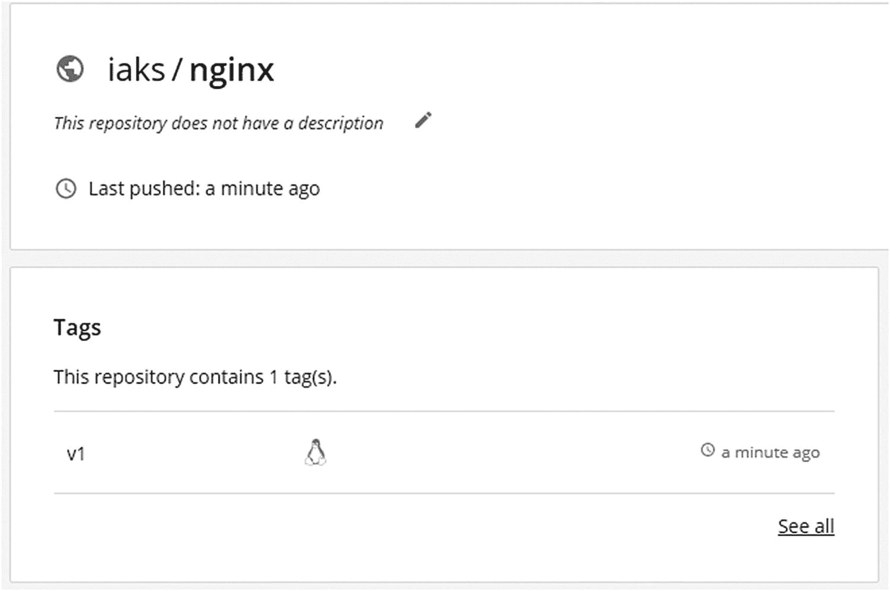

# 二、容器注册表

Kubernetes 用于部署基于容器的应用和服务。在许多方面，基于容器的应用推动了对像 Kubernetes 这样的容器编排技术的需求。如前一章所述，容器是从一个名为*映像*的只读副本实例化的。映像通常存储在一个称为容器注册表的结构中。

在本章中，我们将讨论映像存储、管理和分发的各种选项。我们将研究不同类型的容器注册中心，特别是 Azure 容器注册中心(ACR)。本章结束时，你将能够对容器注册表执行基本操作，并理解映像标记、安全性和权限等概念。

### 注意

为了简单起见，我们将把重点放在使用开放容器倡议(OCI)映像规范和容器运行时的映像上。还有其他容器映像格式(ACI)和容器运行时(rkt)，但基本概念保持不变。

## 容器登记概述

当您将应用部署到 Kubernetes 集群时，该应用将由一个或多个容器组成。Kubernetes 需要能够访问这些映像，以便在 Kubernetes 集群中的每个节点上实例化这些容器。您可以在工作站上创建一个映像，并手动将其复制到每个节点，然后在每次更新映像时重复该过程。但是这将会非常低效，容易出错，并且不可扩展。一个更好的解决方案是共享一个位置，所有节点都可以从该位置访问映像并将其下载到本地映像缓存中。这是容器注册背后的基本原则。

### 注册表、存储库和映像

在我们深入研究容器注册中心之前，理解注册中心、存储库和映像之间的区别是很有用的。正如我们在第一章“Docker 容器内部”中提到的，容器映像是一个只读的构造，容器就是从这个构造实例化的。每个映像都有一个名称和与之关联的可选标签。让我们看看清单 2-1 中所示的从 Docker Hub 中提取映像的例子。

```
REPOSITORY     TAG     IMAGE ID
Nginx          latest  53f3fd8007f7

Listing 2-1Image listing of nginx container image

```

映像来自于`nginx`存储库。它已经被标记为`latest`。并且它有一个唯一的映像 ID。nginx 存储库中存储了其他映像，包括一个标记为 alpine 的映像和另一个标记为 perl 的映像。在提取这两个映像之后，`docker image ls`的更新输出如清单 2-2 所示。

```
REPOSITORY          TAG                 IMAGE ID
nginx               alpine              dd025cdfe837
nginx               perl                4d95835f5c94
nginx               latest              53f3fd8007f7

Listing 2-2Image listing of nginx container images

```

每个映像都来自同一个存储库，但是它们都有不同的标签和映像 id。它们是独一无二的映像。我们将在本章的后面深入探讨标签以及它与映像的关系。

总之，容器存储库包含一个或多个映像。容器注册中心包含一个或多个存储库。特定存储库中的映像可能彼此相关，也可能不相关。

### 私有和公共注册和存储库

当选择容器注册中心来存放映像时，第一个问题通常是创建私有还是公共注册中心。一个**公共注册中心**托管在互联网上，任何人都可以访问。它可能包含注册管理机构内公共和私有存储库的混合。一个**私有注册中心**托管在一个内部网络上，并且只对内部网络上的系统和用户开放。私有注册中心中的存储库也可以包含公共和私有存储库的混合，但是在这种情况下，公共存储库的范围必然受到更多的限制，因为它只对内部网络上的资源可用。虽然大多数公共注册管理机构是作为托管服务运行的，但私有注册管理机构通常由托管注册管理机构的内部 IT 团队管理。

任何能够访问注册中心网络位置的人都可以访问**公共存储库**中的映像。这并不意味着任何人都可以从存储库中添加、更新或删除映像，但是他们可以下载映像而无需任何类型的身份验证。**私有存储库**中的映像要求任何希望访问该存储库的人都要经过身份验证，并被授予下载映像的相关权限。

公共注册和存储库最常用于发布开源项目和软件，这些项目和软件是为了与全世界共享。例如，Docker Hub 上的微软存储库是公开的，用于发布像*微软/点网*和*微软/powershell* 这样的应用的基本映像。很明显，微软希望你能下载这些图片，并用它们来建造一些令人惊奇的东西。

一些常见的公共注册表有

*   坞站集线器

*   谷歌容器注册

*   Azure 容器注册表

*   亚马逊弹性容器注册中心

当映像需要保存在公司或组织内部，并且对这些映像的访问应该受到控制时，可以使用私有注册表和私有存储库。此外，私有注册管理机构通常托管在内部网络上，无法通过更广泛的互联网进行访问。您的映像可能安装了被视为重要知识产权的专有软件。例如，假设您的公司正在开发基因组学软件，并使用容器进行部署。这些映像将包含非常有价值的算法，不应该提供给竞争对手。因此，您可以选择将您的映像保存在私有存储库中，也可能保存在私有注册表中。

一些常见的私有注册中心有

*   可信注册表坞站

*   JFrog Artifactory

*   海港

*   GitLab

### 基本注册表操作

所有容器注册中心都支持相同的基本操作。这些操作包括

*   登录注册表以与映像存储库交互

*   在映像库中搜索特定映像

*   将映像下载到本地文件系统

*   将映像推送到注册中心托管的映像存储库

在下面的例子中，我们将展示针对 Docker Hub 执行的操作。您可以免费创建一个 Docker Hub 帐户，并按照示例进行操作。

#### 注册

使用 Docker CLI 可以登录到容器注册中心。以下命令将启动登录过程。

```
docker login [SERVER]

```

`SERVER`值可以引用您想要登录的任何注册表。该命令还接受提供一个`username`和`password`。如果没有指定`SERVER`值，Docker CLI 将认为您正在登录 Docker Hub。清单 2-3 展示了一个使用账户 *iaks* 登录 Docker Hub 的例子。

```
$ docker login
Login with your Docker ID to push and pull images from Docker Hub. If you don’t have a Docker ID, head over to https://hub.docker.com to create one.
Username: iaks
Password: ************

Login Succeeded

Listing 2-3Logging into Docker Hub

```

#### 搜索

Docker Hub registry 有超过 100，000 个容器映像可供公众使用。显然，私人注册中心的映像要少得多，但是需要能够搜索可用的映像来找到满足您需求的映像。`docker search`命令提供了这一功能。该命令的语法是

```
docker search [OPTIONS] TERM

```

假设我们正在寻找一个 nginx 映像来运行和托管一个 web 服务器。这样做的搜索命令如清单 2-4 所示。

```
$ docker search nginx
NAME         DESCRIPTION               STARS     OFFICIAL
nginx        Official build of Nginx.  11498     [OK]
.
.
[output truncated]

Listing 2-4Searching Docker Hub for nginx images

```

默认情况下，Docker CLI 将在 Docker Hub 注册表中搜索映像。可以通过在搜索中包含地址来搜索其他注册中心`TERM`。在执行搜索命令之前，您需要通过您试图搜索的注册表的身份验证。

#### 拉

从容器注册表中提取映像是将托管映像下载到本地文件存储库的行为。Docker 守护程序使用的存储驱动器决定了文件的存储位置。当提取映像时，Docker 首先检查映像中包含的层，以确定是否已经下载了任何层。任何尚未在本地缓存的图层都将从源资料档案库中下载。清单 2-5 显示了一个在本地文件系统中已经存在一个图层的情况下提取*高山/地形地貌*映像的例子。

```
$ docker pull alpine/terragrunt
Using default tag: latest
latest: Pulling from alpine/terragrunt
e7c96db7181b: Already exists
622c94c90cb1: Pull complete
[output truncated]
68ced3bc2ce4: Pull complete
Digest: sha256:4363c7ea68ae6b648d803753884afed380f106eb23e902641ae919b7b02fe95a
Status: Downloaded newer image for alpine/terragrunt:latest
docker.io/alpine/terragrunt:latest

Listing 2-5Pulling the alpine/terragrunt image from Docker Hub

```

在公共注册的情况下，任何人都可以提取映像，无论他们是否经过身份验证。对于私有注册中心，用户必须首先经过身份验证，并且拥有获取给定映像的权限。

可以通过发出 docker pull 命令来提取映像。语法如下:

```
docker pull [OPTIONS] NAME[:TAG | @DIGEST]

```

名称是指映像的名称。Docker 将假设源存储库在 Docker Hub 上，除非它已经被另外配置，或者名称包括不同的注册中心。例如，可以通过运行以下命令从微软的公共容器注册表中提取映像

```
docker pull mcr.microsoft.com/azuredocs/aci-helloworld

```

如果没有指定`TAG`，那么 docker 将获取存储库中标记为*最新*的映像。*最新的*标签没有什么特别的，这并不意味着提取的映像实际上将是最新的或最新的映像。一般来说，最好指定一个标签和要提取的映像的名称。

#### 推

推送是获取本地映像并将其复制到目标存储库的行为。存储库可以位于公共或私有注册中心。在任何一种情况下，这两种类型的注册中心在允许复制映像之前都需要身份验证和适当的授权。

可以使用`docker build`命令从 Dockerfile 文件创建一个新的映像，然后将其推送到目标注册表。还可以使用从单独的存储库中提取的现有映像，并将其推送到不同的存储库中。清单 2-6 展示了一个可以用来构建新映像的 Dockerfile 文件示例。

```
FROM nginx:stable-alpine
COPY IAKS /usr/share/nginx/html

Listing 2-6Dockerfile content

```

`FROM`命令将从 nginx 存储库中提取标记为 stable-alpine 的 nginx 映像。`COPY`命令会将 IAKS 目录的内容复制到路径/usr/share/nginx/html 中。我们可以通过从包含 Dockerfile 的目录中运行以下命令来创建这个新映像:

```
docker build --tag iaks/nginx:v1.

```

通过将其命名为`iaks/nginx:v1`，我们表明该映像的目标存储库将是 iaks Docker Hub 帐户，映像的名称是 nginx。我们将其标记为 v1，目前这是一个任意的标记。通过运行`docker image ls`，我们可以看到，在清单 2-7 中，我们现在在本地文件系统上有了一个新的镜像。

```
$ docker image ls
REPOSITORY          TAG                 IMAGE ID
iaks/nginx          v1                  bbbdb4e15efd

Listing 2-7Listing the image created by docker build

```

最后，我们可以通过运行`docker push`命令将映像从本地文件系统推送到 Docker Hub 存储库。该命令的语法是

```
docker push [OPTIONS] NAME[:TAG]

```

在这种情况下，我们将运行清单 2-8 中所示的命令来推送映像。

```
$ docker push iaks/nginx:v1
The push refers to repository [docker.io/iaks/nginx]
7dd2de43c03e: Pushed
2bdf88b2699d: Mounted from library/nginx
f1b5933fe4b5: Mounted from library/nginx
v1: digest: sha256:00caf...f4997cea1 size: 94

Listing 2-8Pushing the image to Docker Hub

```

通过浏览器查看我们的 Docker Hub 帐户，我们可以在图 2-1 中看到，映像已经被成功地推送到我们的存储库。



图 2-1

成功将映像推送到 Docker Hub

现在可以提取这个映像，并在任何可以访问互联网的容器主机上运行它。这包括 Azure Kubernetes 服务集群中的工作节点。

### 映像标记

映像标签是与特定映像相关联的附加元数据。正如我们在注册表、存储库和映像一节中看到的，映像有一个存储库、标签和 ID。在清单 2-9 中，已经提取了三个 nginx 映像，它们都有不同的标签和映像 id。

```
REPOSITORY          TAG                 IMAGE ID
nginx               alpine              dd025cdfe837
nginx               perl                4d95835f5c94
nginx               latest              53f3fd8007f7

Listing 2-9Listing of different nginx images

```

通过使用`docker image tag`命令，可以将多个标签与单个映像相关联。向映像添加另一个标记不会创建新的映像，也不会占用本地文件系统的更多空间。Docker 只是将这个新的元数据信息分配给现有的映像 ID。`docker image tag`命令的语法如下:

```
docker image tag SOURCE_IMAGE[:TAG] TARGET_IMAGE[:TAG]

```

例如，我们可以获取现有的 nginx:alpine 映像，并用 v1 标记它。

```
docker image tag nginx:alpine nginx:v1

```

在查看清单 2-10 中的本地映像清单时，两个映像都存在，并且具有相同的映像 ID。

```
$ docker image ls
REPOSITORY          TAG                 IMAGE ID
nginx               alpine              dd025cdfe837
nginx               v1                  dd025cdfe837
nginx               perl                4d95835f5c94
nginx               latest              53f3fd8007f7

Listing 2-10Logging into Docker Hub

```

我们还可以为完全不同的存储库标记映像，然后将映像推送到该存储库。

```
docker image tag nginx:alpine iaks/custom

```

清单 2-11 中显示的三个条目将具有相同的映像 ID。

```
$ docker image ls
REPOSITORY          TAG                 IMAGE ID
nginx               alpine              dd025cdfe837
nginx               v1                  dd025cdfe837
iaks/custom         latest             dd025cdfe837

Listing 2-11Logging into Docker Hub

```

标签只是与映像相关联的元数据。这包括神秘的*最新的*标签。如果没有为映像提供标签——就像我们在前面的命令中所做的那样——Docker 会自动给它一个*最新的*标签。当一个映像被拉取或用于实例化一个容器时，如果没有提供其他标签，Docker 将同样采用最新的*标签。 *latest* 标签并不意味着被拉取的映像是最新的或者甚至是合适的映像。它只是映像被贴上了最新的标签，不管是故意的还是疏忽的。因此，在提取映像或运行容器时，总是建议指定映像的标签。*

## 通用注册表

### 坞站中心和坞站注册表

用户最常开始使用的注册中心是 Docker Hub，如图 2-2 所示。Docker Hub 托管在 docker.io 上，为新用户提供了一个免费的家，让他们可以开始使用自己的第一个存储库。除非另外配置，否则 Docker CLI 假定 Docker Hub 是正在使用的注册中心。许多软件公司选择在 Docker Hub 上托管他们公开可用的容器，一些开源项目也是如此。Docker Hub 支持公共和私有存储库，尽管私有存储库不是免费的。


图 2-2

坞站中心网站

Docker Hub 基于开源项目 Docker Registry。Docker Registry 还可以用于在数据中心部署私有注册表。微软使用 Docker Registry 项目作为他们部署 Azure 容器注册表的基础，其他几个公共和私有注册表实现也是如此。

### Azure 容器注册表

Azure Container Registry (ACR)是微软托管在 Azure 上的软件即服务产品。ACR 是基于 Docker Registry 开源项目的，但是它有额外的功能，我们将在本章的后面探讨。在 ACR 上创建的存储库本质上是私有的，并且总是需要某种类型的身份验证才能访问。ACR 有几个不同的 SKU 可供选择——基本、标准和高级——更高层提供更强大的存储、性能和复制选项。

存储在 ACR 上的映像可以是以下格式:

*   Docker 映像清单 V2，模式 1

*   Docker 映像清单 V2，模式 2

*   开放容器映像格式规范

ACR 服务还可以托管掌 Helm 图表，我们将在第 8 、【Azure Kubernetes 服务的*掌 Helm 图表*中对此进行更多探讨

为了在 ACR 上创建注册中心，你需要一个 Azure 订阅。可以通过 Azure 门户、Azure PowerShell 或 Azure CLI 创建新的 ACR 注册表。本节剩余部分和下一节中的示例将使用 Azure CLI。

清单 2-12 中的命令将使用 Azure CLI 创建一个新的 ACR 注册表。

```
### Create an Azure Container Registry  ###
# Login to Azure and select subscription
az login
az account set --subscription "AZURE_SUBSCRIPTION_NAME"

# Create a resource group and Container Registry
az group create --name RESOURCE_GROUP_NAME --location "LOCATION_NAME"
az acr create --resource-group RESOURCE_GROUP_NAME --name ACR_NAME --sku Basic

Listing 2-12Creating a new ACR registry

```

ACR_NAME 必须是全局唯一的。它将被附加到 azurecr.io 中，为您的注册表创建公开寻址的 fqdn。

在下一节中，我们将更深入地探索 Azure 容器注册中心的一些组件，包括它如何与 Azure Kubernetes 服务集成。

## Azure 容器注册表已扩展

虽然 Azure Container Registry (ACR)服务是基于 Docker Registry 开源项目的，但它有许多额外的增强功能值得一提。ACR 利用 Azure Active Directory (Azure AD)支持的基于角色的访问控制(RBAC)来控制对服务上托管的存储库的访问。ACR 已经超越了基本的注册中心，支持作为服务的一部分运行简单或多步任务的能力。由于 ACR 运行在 Azure 中，它与包括 Azure Kubernetes 服务在内的其他 Azure 服务进行了一些定制集成。

### 安全

有三种不同的 ACR 认证方式:

*   **Azure AD 个人登录**:登录 ACR 的个人使用他们的 Azure Active Directory 帐户对 ACR 进行身份验证。在要求他们再次进行身份验证之前，会向他们发放一个一小时内有效的令牌。

*   Azure AD 服务主体:类似于个人登录，但是，服务主体可以用于无头认证，并且最常用于自动化平台。

*   **管理员帐户**:管理员帐户是一个没有链接到 Azure Active Directory 的帐户。admin 帐户拥有在 ACR 注册表上执行任何操作的完全权限。默认情况下，admin 帐户是禁用的，它应该只用于测试和紧急情况。

为了登录到我们在上一节中创建的 ACR，我们可以使用以下命令:

```
az acr login --name ACR_NAME

```

由于我们已经登录到 Azure，ACR 获取我们现有的凭证并生成一个令牌供 ACR 使用，这个令牌在一个小时内有效。这段时间过后，令牌过期，必须再次运行`az acr login`命令。服务主体登录在登录时使用用户名和密码，因此没有基于缓存凭据颁发的令牌。在自动化流程中使用 ACR 时，服务主体登录是首选的登录类型。

无论是使用个人登录还是服务主体选项，权限都是通过明确定义的角色来分配的。

### 许可

与 Microsoft Azure 中的许多服务一样，Azure Container Registry 中的权限是使用基于角色的访问控制(RBAC)来分配的。在撰写本文时，该服务定义了七个角色。表 2-1 概述了角色及其权限。

表 2-1

Azure 容器注册的 RBAC

<colgroup><col class="tcol1 align-left"> <col class="tcol2 align-left"> <col class="tcol3 align-left"> <col class="tcol4 align-left"> <col class="tcol5 align-left"> <col class="tcol6 align-left"> <col class="tcol7 align-left"> <col class="tcol8 align-left"></colgroup> 
| 

权限/角色

 | 

物主

 | 

捐助者

 | 

读者

 | 

广告

 | 

空气拉力

 | 

ArcDelete

 | 

AcrImageSigner

 |
| --- | --- | --- | --- | --- | --- | --- | --- |
| 访问资源管理器 | -好的 | -好的 | -好的 |   |   |   |   |
| 创建/删除注册表 | -好的 | -好的 |   |   |   |   |   |
| 推送映像 | -好的 | -好的 |   | -好的 |   |   |   |
| 拉映像 | -好的 | -好的 | -好的 | -好的 | -好的 |   |   |
| 删除映像数据 | -好的 | -好的 |   |   |   | -好的 |   |
| 改变策略 | -好的 | -好的 |   |   |   |   |   |
| 标志映像 |   |   |   |   |   |   | -好的 |

这些角色的分配应遵循最小特权原则，即分配给个人或服务执行特定任务所需的最少权限。AcrPush、AcrPull、AcrDelete 和 AcrImageSigner 角色是专为在其生命周期内执行特定任务的服务和自动化流程而设计的。例如，假设我们使用 Azure Kubernetes 服务来部署存储在 ACR 中的容器。作为 AKS 群集使用的服务主体，AcrPull 角色将授予它足够的权限来访问所需的容器映像，而不授予对资源管理器的访问权限，这是 Reader 角色包含的权限。同样，任何构建新容器映像的 CI/CD 流水线都可以被授予 AcrPush 权限，以便将新映像推送到 ACR。

### 任务和自动化

除了容器映像的存储，Azure 容器注册服务还包括运行简单和多步骤任务的能力，并在某些操作完成时发出 webhooks。任务和 webhooks 提供了利用 ACR 执行与映像管理相关的常见任务的能力，并有助于集成到 CI/CD 流水线中。

ACR 中的任务可以分为简单任务和多步骤任务，简单任务可以使用`az acr build`或`az acr task`命令启动，多步骤任务由 YAML 文件定义并通过`az acr run`命令提交。

#### 简单的任务

简单的任务用于构建容器映像的新版本。可以使用`az acr build`命令手动触发映像的构建。这样做可以将构建容器的负担从本地工作站转移到 ACR，并将生成的映像放在 ACR 中，而不必从本地文件系统推送。使用以下命令从本地 docker 文件创建新映像:

```
az acr build --registry iaks --image web:v2.

```

该命令将在容器注册表 *iaks* 上的映像库 *web* 中构建一个标记为 *v2* 的映像。除了从本地工作站卸载构建过程之外，CI/CD 流水线中的服务主体还可以使用相同的命令来自动构建新的容器映像，而无需使用流水线代理计算机上的资源。

它可以由 git 提交或基本映像的更新来触发，而不是手动运行任务。虽然基于 git 提交进行更新的想法具有直观的意义，但是在更新基础映像时更新映像的概念需要一些解释。

ACR 了解存储在其存储库中的映像的映像依赖性。例如，你闪亮的新 *web* 容器映像可能基于 Docker Hub 的 *alpine:stable* 映像。当基础映像更新时，您可能希望您的 *web* 映像也更新，以包含基础映像中的任何更改。ACR 支持创建一个构建任务，如果它检测到存储库中某个映像的基本映像已经更新，就会触发该任务。在这种情况下，命令看起来会像清单 2-13 中的内容。

```
az acr task create \
     --registry iaks \
     --name task-web-service \
     --image web:v2 \
     --arg REGISTRY_NAME=iaks.azurecr.io \
     --context https://dev.azure.com/iaks/_git/iaks.git \
     --file Dockerfile-web \
     --branch master \
     --git-access-token $TOKEN

Listing 2-13Creating an ACR task to update an image based on base image updates

```

Dockerfile-web 文件的定义中引用了 alpine:stable 的基本映像。ACR 反过来创建一个钩子来监听基础映像的变化，如果检测到变化，就会启动一个构建任务。

#### 多步骤任务

ACR 中的多步骤任务建立在现有的简单任务的基础上，同时增加了更多的功能。多步骤任务中的操作包括

*   `Build`:构建一个或多个容器映像

*   `Push`:将映像推送到私有或公共容器注册表

*   `Cmd`:使用与`docker run`相似的参数运行容器

作为多步骤任务的一部分而执行的动作在 YAML 格式的文件中定义，该文件使用清单 2-14 中的命令提交给 ACR。

```
az acr run \
     --registry iaks \
     -f multi-step-task.yml \
     https://dev.azure.com/iaks/iaks.git

Listing 2-14Creating a multi-step task in ACR

```

该命令指示 ACR 使用在引用的 git 存储库中找到的文件 *multi-step-task.yml* 在注册表 *iaks* 上运行任务。

可以在工作流中使用多步骤任务来构建和测试组成基于容器的应用的一组映像，然后在任务中定义的测试通过时更新 Helm 图。虽然这并不能替代全功能 CI/CD 流水线，但它确实提供了一种在代码中定义工作流的方法，并在对 git 存储库进行新的提交时让它们执行。

#### web 手册

当一个动作在 Azure Container Registry 中完成时，它可以通过 webhook 通知其他服务。这有助于发送简单的通知或启动自动化工作流。触发网络挂钩支持的操作有

*   映像推送

*   映像删除

*   映像隔离

*   Helm 图按钮

*   Helm 图删除

触发 webhook 会向 webhook 配置中定义的服务 URI 发送 POST 请求。POST 请求包括 JavaScript 对象符号(JSON)格式的信息，该信息依赖于触发 webhook 的操作。还可以在 webhook 配置中定义自定义头，随每个 POST 请求一起发送。如果目标服务 URI 需要认证或 POST 有效负载中不包含的一些其他定制数据，则可以利用这些信息。

创建一个 webhook 来联系 Postman echo 服务进行映像推送，如清单 2-15 所示。

```
az acr webhook create \
     --registry iaks \
     --name postmanhook \
     --actions push \
     --uri https://postman-echo.com/post

Listing 2-15Logging into Docker Hub

```

Postman echo 服务将简单地回复初始 POST 请求的内容，这有助于理解 webhook 发送的信息。

### 蓝色 Kubernetes 服务集成

Azure Kubernetes 服务(AKS)使用容器映像和 Helm 图将应用部署到 AKS 集群中的节点。方便的是，Azure Container Registry 能够存储这两种资源，并使它们可供 AKS 使用。为了访问存储在 ACR 注册表上的资源，AKS 可以使用 Azure Active Directory 身份验证。

当一个新的 AKS 集群被创建时，它在 Azure Active Directory 中被分配一个服务主体。可以将服务主体的角色分配给 Azure 容器注册中心托管的注册中心，包括 AcrPull 角色。有了这个角色，AKS 集群将能够提取托管在该容器注册表中的容器映像和 Helm 图。

将 ACR 与 AKS 结合使用允许您将映像托管在私有注册表中，并使用本地身份验证服务 Azure AD 为 AKS 集群提供适当的访问级别。您还可以利用 ACR 任务来自动构建、测试和发布基于容器的应用到您的 AKS 集群。

## 摘要

容器注册中心是在 Kubernetes 上部署应用的关键组件。如果没有映像存储库，就必须将映像手动复制到集群中的每个节点。这不是一个理想的情况。在 Azure Kubernetes Service 中构建和操作应用之前，对容器注册中心及其操作方式有一个适当的了解是很重要的。

在这一章中，你学习了不同类型的容器注册——私有的和公共的。我们讨论了用于与托管在容器注册中心的映像存储库进行交互的命令和工具，包括像推、拉和标记这样的操作。然后，我们研究了 Azure 容器注册服务的特性，以及它如何与 Azure Kubernetes 服务集成。