# 六、通过 Azure Kubernetes 服务部署和使用 Rancher

随着您继续进入容器世界，您将到达临界质量点。将需要运行一个编排平台来处理容器的生命周期。在第三章“Kubernetes 内部”，我们进入了 Kubernetes，最常见的编排平台。在第五章中，“部署 Azure Kubernetes 服务”，我们介绍了如何部署 Azure Kubernetes 服务(AKS)。Kubernetes 对于刚开始使用容器编排平台的人来说可能很复杂。

微软的托管 Kubernetes 服务 AKS 消除了运行 Kubernetes 集群的一些复杂性；然而，运行 Kubernetes 集群仍然是一个挑战，包括随之而来的所有事情，例如操作多个 Kubernetes 集群、在集群中扩展、联网、RBAC、监控、通过 HELM charts 部署捆绑解决方案(将在后面的章节中介绍)等等。市场上有第三方解决方案可以降低运行 Kubernetes 的复杂性。牧场主是这个解决方案之一，如果不是最好的。

在这一章，我们将给出一个 Rancher 的概述，也将探讨 Rancher 如何与 AK 一起使用。

## 什么是牧场主？

简而言之，Rancher 是一个开源解决方案，可以用来部署和操作一个或多个 Kubernetes 集群。Rancher 可以跨内部或云提供商(如 AWS、GCP、数字海洋和 Azure)部署和管理 Kubernetes 集群。它可以用于在您自己的基础设施上部署和管理您自己的 Kubernetes 集群，甚至是来自云提供商的托管集群服务，例如 Azure Kubernetes 服务。

不像市场上的其他开源解决方案，Rancher 是完全免费的。它没有需要付费的社区版和企业版。使用 Rancher，您可以在部署时获得所有功能。牧场主在经济上支持自己的方式是通过为生产牧场主的组织设计的有偿支持选项。

因为 Rancher 几乎可以在任何地方操作 Kubernetes 集群，所以它还可以用来在提供者之间迁移资源。

Rancher 总体上有助于简化 Kubernetes 的管理。它简化管理的一些方法是集中身份验证和访问控制，通过 Prometheus 和 Grafana 引入开箱即用的监控，拥有自己的应用库，以及 HELM charts 和简化的 Kubernetes 版本升级。

虽然 Rancher 抽象了管理 Kubernetes 集群的大部分复杂性，但如果需要，它也允许高级管理。例如，Kubernetes 管理员可以通过 Rancher 门户访问 kubectl。

## 为什么使用牧场主与库伯内特？

当有人了解 Rancher 时，最常见的问题之一是:“为什么我应该将 Rancher 与 Kubernetes 一起使用，而不是单独使用 Kubernetes？”这个问题的答案是有很多理由使用牧场主与库伯内特；但是，在某些情况下，使用 Rancher 可能没有意义。这里我们将看看使用 Rancher 的理由。让我们浏览一下:

*   **Kubernetes 集群的部署和升级**:通过 Rancher 部署和升级 Kubernetes 集群是一个简化且无缝的过程。

*   用户界面和 API:Rancher 为使用 Kubernetes 的用户提供了一个简化的用户界面。Rancher 还提供了一个接口 API。

*   **集中管理多个 Kubernetes 集群**:许多组织正在采用多种云方法，因此他们可能会跨多个云提供商运行一个 Kubernetes 集群。当 Kubernetes 集群跨云提供商甚至在本地部署时，可以使用 Rancher 从一个地方集中管理所有集群。Rancher 集中管理 RBAC、安全策略管理、容量管理、委托管理、集群备份和恢复、日志记录和监控等。

*   **集中和简化 Kubernetes 的 RBAC**:Kubernetes 的授权和访问可以从 Rancher 轻松管理。

*   Rancher 和 Prometheus 和 Grafana 一起从箱子里出来:监控 Kubernetes 是至关重要的。Prometheus 和 Grafana 是常见的监控和可视化工具。由于这些解决方案与 Rancher 打包在一起，可以随时监控 Kubernetes，因此减少了部署这些解决方案并准备好监控 Kubernetes 的工作负载。

*   Rancher 简化 Helm 图 : Rancher 允许你加载 Helm 图库和/或 Rancher 库。这些库使得轻松地部署应用成为可能。

*   **Kubernetes 采用**:通过降低 Kubernetes 的学习曲线，让程序员专注于开发应用而不是运行应用，来推动 Kubernetes 的采用。

从前面的列表中可以看出，将 Rancher 与 Kubernetes 结合使用有很多价值。接下来，让我们看看如何部署 Rancher 并将其与 AKS 一起使用。

## 如何在 Azure 上部署 Rancher

Rancher 作为 Docker 顶部的容器运行。您可以在本地或云提供商上部署 Rancher。在这一节中，我们将在一个运行 Docker 的 Ubuntu 服务器上部署 Rancher。

我们将使用 Azure ARM 模板部署这个 VM 和 Rancher。我们将使用的 ARM 模板使用 Docker 和最新版本的 Rancher 作为容器来部署 Ubuntu VM。Rancher 容器从 Docker Hub 上的( [`https://hub.docker.com/r/rancher/rancher`](https://hub.docker.com/r/rancher/rancher) )部署。这确保了总是部署最新的 Rancher 版本。

我们将使用的 ARM 模板名为 RancherNode.JSON。下面是 ARM 模板代码:

```
{
    "$schema": "https://schema.management.azure.com/schemas/2015-01-01/deploymentTemplate.json#",
    "contentVersion": "1.0.0.0",
    "parameters": {
        "adminUsername": {
            "type": "string",
            "metadata": {
                "description": "Username for the Rancher Node Virtual Machine."
            }
        },
        "adminPassword": {
            "type": "securestring",
            "metadata": {
                "description": "Password for the Rancher Node Virtual Machine."
            }
        },
        "dnsNameForPublicIP": {
            "type": "string",
            "metadata": {
                "description": "Unique DNS Name for the Public IP used to access the Rancher Portal."
            }
        },
        "vmSize": {
            "type": "string",
            "defaultValue": "Standard_F1",
            "metadata": {
                "description": "VM size for the Rancher Node."
            }
        },
        "ubuntuOSVersion": {
            "type": "string",
            "defaultValue": "14.04.4-LTS",
            "metadata": {
                "description": "The Ubuntu version for deploying the Docker containers. This will pick a fully patched image of this given Ubuntu version. Allowed values: 14.04.4-LTS, 15.10, 16.04.0-LTS"
            },
            "allowedValues": [
                "14.04.4-LTS",
                "15.10",
                "16.04.0-LTS"
            ]
        },
        "location": {
            "type": "string",
            "defaultValue": "[resourceGroup().location]",
            "metadata": {
                "description": "Location for all resources."
            }
        }
    },
    "variables": {
        "imagePublisher": "Canonical",
        "imageOffer": "UbuntuServer",
        "nicName": "RancherNodeNic",
        "extensionName": "DockerExtension",
        "addressPrefix": "10.0.0.0/16",
        "subnetName": "RancherSubnet",
        "subnetPrefix": "10.0.0.0/24",
        "diskStorageType": "Standard_LRS",
        "publicIPAddressName": "RancherNodePublicIP",
        "publicIPAddressType": "Dynamic",
        "vmName": "RancherNode",
        "virtualNetworkName": "RancherVNet",
        "subnetRef": "[resourceId('Microsoft.Network/virtualNetworks/subnets', variables('virtualNetworkName'), variables('subnetName'))]"
    },
    "resources": [
        {
            "apiVersion": "2017-04-01",
            "type": "Microsoft.Network/publicIPAddresses",
            "name": "[variables('publicIPAddressName')]",
            "location": "[parameters('location')]",
            "properties": {
                "publicIPAllocationMethod": "[variables('publicIPAddressType')]",
                "dnsSettings": {
                    "domainNameLabel": "[parameters('dnsNameForPublicIP')]"
                }
            }
        },
        {
            "apiVersion": "2017-04-01",
            "type": "Microsoft.Network/virtualNetworks",
            "name": "[variables('virtualNetworkName')]",
            "location": "[parameters('location')]",
            "properties": {
                "addressSpace": {
                    "addressPrefixes": [
                        "[variables('addressPrefix')]"
                    ]
                },
                "subnets": [
                    {
                        "name": "[variables('subnetName')]",
                        "properties": {
                            "addressPrefix": "[variables('subnetPrefix')]"
                        }
                    }
                ]
            }
        },
        {
            "apiVersion": "2017-04-01",
            "type": "Microsoft.Network/networkInterfaces",
            "name": "[variables('nicName')]",
            "location": "[parameters('location')]",
            "dependsOn": [
                "[concat('Microsoft.Network/publicIPAddresses/', variables('publicIPAddressName'))]",
                "[concat('Microsoft.Network/virtualNetworks/', variables('virtualNetworkName'))]"
            ],
            "properties": {
                "ipConfigurations": [
                    {
                        "name": "ipconfig1",
                        "properties": {
                            "privateIPAllocationMethod": "Dynamic",
                            "publicIPAddress": {
                                "id": "[resourceId('Microsoft.Network/publicIPAddresses',variables('publicIPAddressName'))]"
                            },
                            "subnet": {
                                "id": "[variables('subnetRef')]"
                            }
                        }
                    }
                ]
            }
        },
        {
            "apiVersion": "2017-03-30",
            "type": "Microsoft.Compute/virtualMachines",
            "name": "[variables('vmName')]",
            "location": "[parameters('location')]",
            "dependsOn": [
                "[concat('Microsoft.Network/networkInterfaces/', variables('nicName'))]"
            ],
            "properties": {
                "hardwareProfile": {
                    "vmSize": "[parameters('vmSize')]"
                },
                "osProfile": {
                    "computerName": "[variables('vmName')]",
                    "adminUsername": "[parameters('adminUsername')]",
                    "adminPassword": "[parameters('adminPassword')]"
                },
                "storageProfile": {
                    "imageReference": {
                        "publisher": "[variables('imagePublisher')]",
                        "offer": "[variables('imageOffer')]",
                        "sku": "[parameters('ubuntuOSVersion')]",
                        "version": "latest"
                    },
                    "osDisk": {
                        "name": "[concat(variables('vmName'),'_OSDisk')]",
                        "caching": "ReadWrite",
                        "createOption": "FromImage",
                        "managedDisk": {
                            "storageAccountType": "[variables('diskStorageType')]"
                        }
                    }
                },
                "networkProfile": {
                    "networkInterfaces": [
                        {
                            "id": "[resourceId('Microsoft.Network/networkInterfaces',variables('nicName'))]"
                        }
                    ]
                }
            }
        },
        {
            "type": "Microsoft.Compute/virtualMachines/extensions",
            "name": "[concat(variables('vmName'),'/', variables('extensionName'))]",
            "apiVersion": "2017-03-30",
            "location": "[parameters('location')]",
            "dependsOn": [
                "[concat('Microsoft.Compute/virtualMachines/', variables('vmName'))]"
            ],
            "properties": {
                "publisher": "Microsoft.Azure.Extensions",
                "type": "DockerExtension",
                "typeHandlerVersion": "1.0",
                "autoUpgradeMinorVersion": true,
                "settings": {
                    "compose": {
                    "rancher": {
                        "image": "rancher/rancher:stable",
                        "ports": [
                          "80:80",
                          "443:443"
                        ],
                        "volumes": [
                            "/opt/rancher:/var/lib/rancher"
                       ]
                }
            }
        }
        }
    }
    ]
}

```

这个 ARM 模板也可以在这里下载: [`https://github.com/Buchatech/DeployRanchertoAzure`](https://github.com/Buchatech/DeployRanchertoAzure) 。

使用您选择的部署选项部署 ARM 模板。您需要提供以下参数的数据:

*   签署

*   资源组

*   位置

*   管理员用户名

*   管理员密码

*   公共 IP 的 Dns 名称

*   虚拟机大小

*   Ubuntu OS 版本

部署 Ubuntu VM 后，您应该会看到新资源组中的资源，如表 6-1 所示。

表 6-1

资源组中蓝色资源上的牧场主

<colgroup><col class="tcol1 align-left"> <col class="tcol2 align-left"></colgroup> 
| 

名字

 | 

类型

 |
| --- | --- |
| 兰彻网 | 虚拟网络 |
| 牧场主 | 虚拟计算机 |
| **兰彻诺尔德 PublicIP** | 公共 IP 地址 |
| **蓝丘杜鹃** | 网络接口 |
| 兰彻罗德 _OSDisk | 唱片 |

为了完成 Rancher 部署，您需要通过 Rancher 门户完成设置。URL 是我们部署的 Rancher 节点 VM 的 DNS 名称。您可以通过在概述页面上的 Azure 门户中单击 Rancher 节点 VM 来找到 DNS 名称。以下是 URL 的一个示例:

[`https://NAMEOFTHEVM.centralus.cloudapp.azure.com`](https://nameofthevm.centralus.cloudapp.azure.com)

牧场主门户网站会提示您设置密码。如图 6-1 所示。

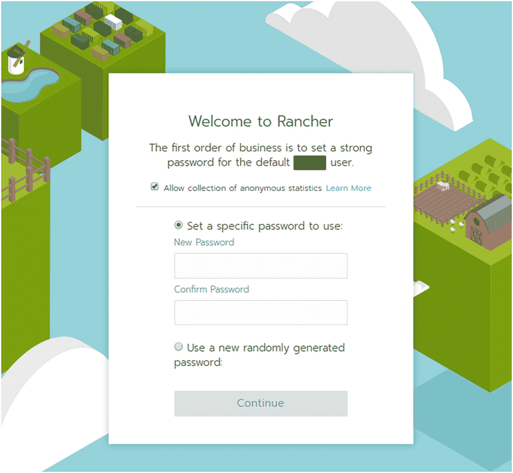

图 6-1

牧场主设置密码

设置密码后，Rancher 门户会提示您输入正确的 Rancher 服务器 URL。这将自动成为如图 6-2 所示的牧场主节点虚拟机 DNS 名称。单击保存 URL。

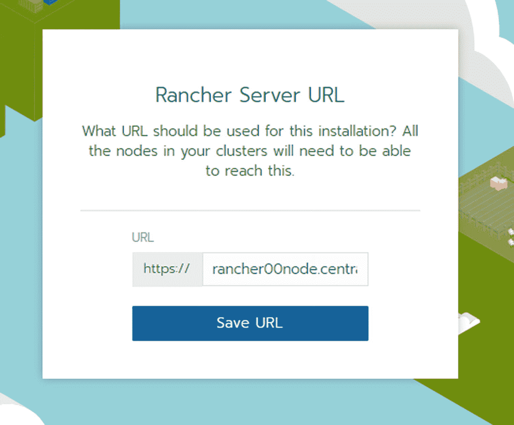

图 6-2

蓝丘保存 URL

然后，您将直接登录到 Rancher 门户的“您将看到集群”页面。这就完成了在 Azure 上部署 Rancher 的部署。接下来，我们将探索部署一个新的 AKS 集群，并从 Rancher 内部连接到一个现有的 AKS 集群。

## 使用 Azure Active Directory 对牧场主进行身份验证

您将需要从 Rancher 到 Azure working 的认证，然后才能部署或管理现有的 AKS 集群。为了从 Rancher 向 Azure 进行身份验证，您将需要 Azure Active Directory 中的服务主体名称(SPN)对象。这将用于 Azure 的身份验证。

要创建这个 SPN，您只需要运行一行语法。建议您在 Azure Cloud Shell 中从 Bash 运行这个。

### 注意

使用以下步骤在 Azure Cloud Shell 中打开 Bash:

登录 Azure 门户网站。

通过点击➤.从顶部导航启动云壳

如果这是您第一次运行云外壳，请选择订阅以创建存储帐户和 Microsoft Azure 文件共享。

当 Cloud Shell 在 Azure 门户底部启动时，确保 Shell 窗口左侧的环境下拉菜单显示的是 Bash 而不是 PowerShell。

占位符文本。稍后在能够清理便笺格式时删除。

### 注意

您将需要想要在其中创建 AKS 集群的订阅的订阅 ID。您可以在 Cloud Shell 中运行以下语法来获取您登录的帐户的订阅列表。这将列出包括 id 在内的订阅属性信息。复制订阅 ID 以备后用。

`az account list`

使用以下语法创建具有特定名称的 SPN，并将参与者角色分配给指定的订阅:

```
az ad sp create-for-rbac --name NAMEOFTHESPNHERE --role contributor --scopes /subscriptions/SUBSCRIPTIONIDHERE

```

例如:

```
az ad sp create-for-rbac --name rancherSPN --role contributor --scopes /subscriptions/148727f76-9q1b-4941-coa6-92c5d153fe73

```

输出将类似于:

将“rancherSPN”更改为“ [`http://rancherSPN`](http://www.rancherSPN) ”的有效 URI，这是用于服务主体名称的必需格式

```
Retrying role assignment creation: 1/36
{
  "appId": "012d8611-c9a3-4e90-80d9-ad6504c823g8",
  "displayName": " rancherSPN ",
  "name": "http:// rancherSPN",
  "password": "6a4b83fc-31qa-40f0-c4c6-rba8c5av460b",
  "tenant": "0pw0cc24-q010-4f7b-h08e-9o57a72t531d"
}

```

请记住将这些信息复制到某个地方，因为在创建 AKS 集群时，您将需要这些信息从 Rancher 连接到 Azure。

### 注意

appId 将用于 Rancher 中的 clientId 字段。

就是这样！这就是创建 SPN 并从 Rancher 获得向 Azure 认证所需的信息所要做的全部工作。在下一节中，我们将从 Rancher 创建一个新的 AKS 集群。

## 与牧场主一起部署 AK 步枪

此时，我们已经在 Azure 上部署了 Rancher。现在让我们看看使用 Rancher 部署新的 AKS 集群的过程。使用以下步骤在 Azure 中从 Rancher 部署新的 AKS。

### 注意

在下面的步骤中，我们将调用所需的设置，如 DNS 前缀，但不调用可选设置，如 Azure 标记或高级网络。在部署 AKS 集群时，您可以根据需要配置可选设置。

在 Rancher 门户中，单击顶部导航菜单中的集群。

点击添加集群，选择 Azure AKS，如图 6-3 所示。

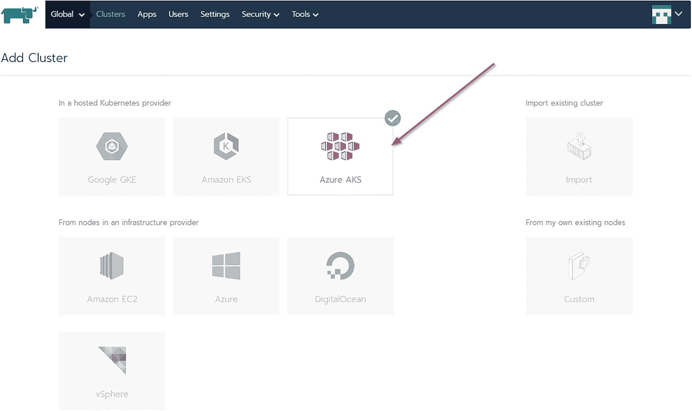

图 6-3

Azure AKS 托管 Kubernetes 提供商

您将看到如图 6-4 所示的账户访问设置。

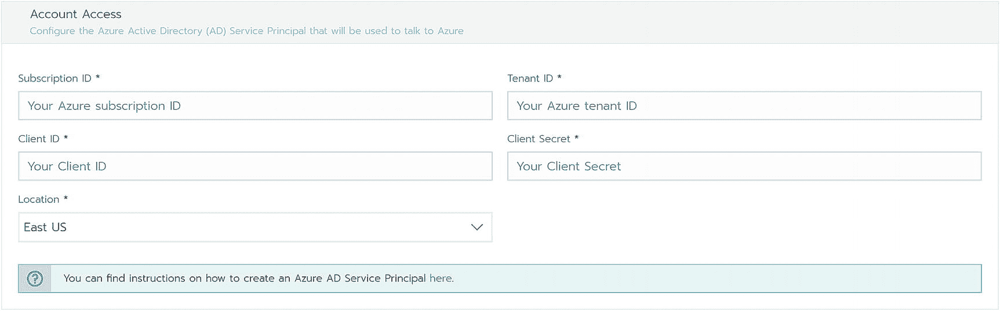

图 6-4

帐户访问设置

输入一个集群名称，如图 6-5 所示。

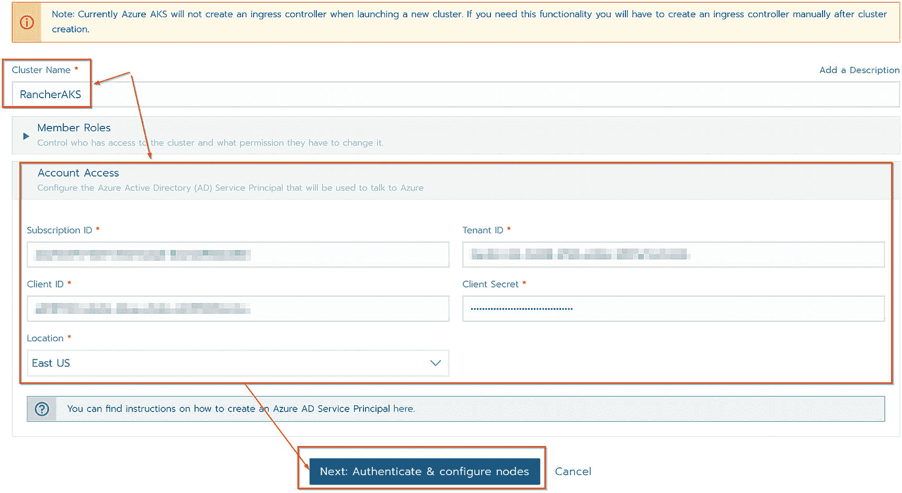

图 6-5

牧场主群集名称

创建 SPN 后，将您从上一部分复制的信息输入到帐户访问设置中。

单击下一步:验证和配置节点。

接下来，在集群选项下，给你的集群一个 DNS 前缀，如图 6-6 所示。

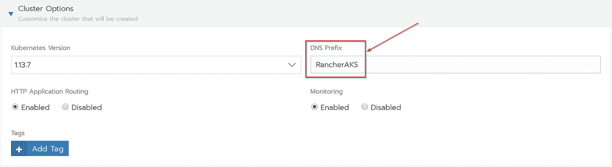

图 6-6

群集 DNS 前缀

在节点下，在集群资源组字段中输入资源组的名称，如图 6-7 所示。

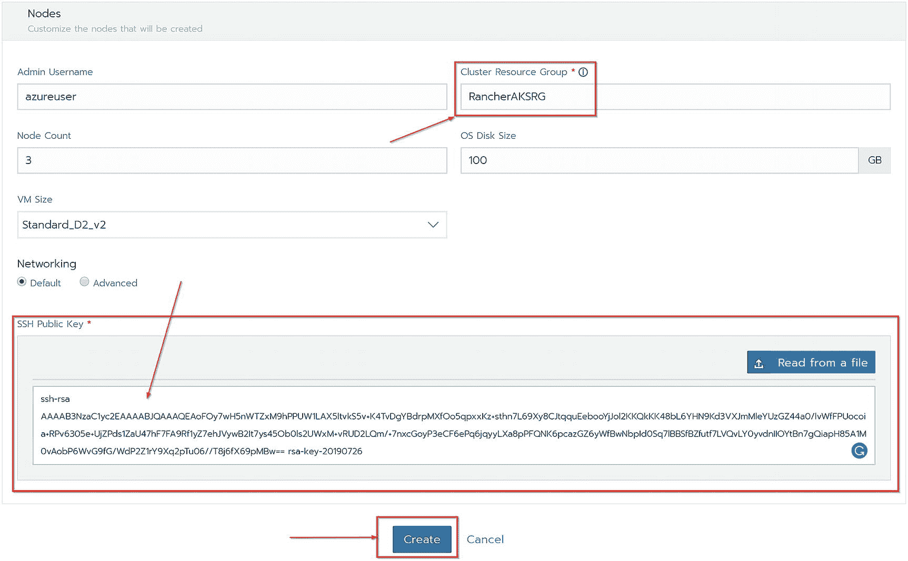

图 6-7

集群资源组和 SSH 密钥

此外，在 Nodes 下，输入 SSH 公钥并单击 Create。

### 注意

PuTTY Key Generator 是一个免费的工具，可以用来生成一个新的 SSH 密钥。你可以在这里下载: [`www.puttygen.com`](http://www.puttygen.com) 。

AKS 集群将开始供应，如图 6-8 所示。

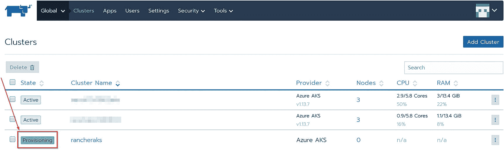

图 6-8

AKS 集群配置

部署 AKS 集群后，它将在 Rancher 门户中显示为活动的。AKS 集群现已部署，您可以访问 Azure 门户，导航到它创建的资源组，并查看部署的资源管理器，包括 AKS 集群、日志分析工作区和 Containers Insights 解决方案，如图 6-9 所示。

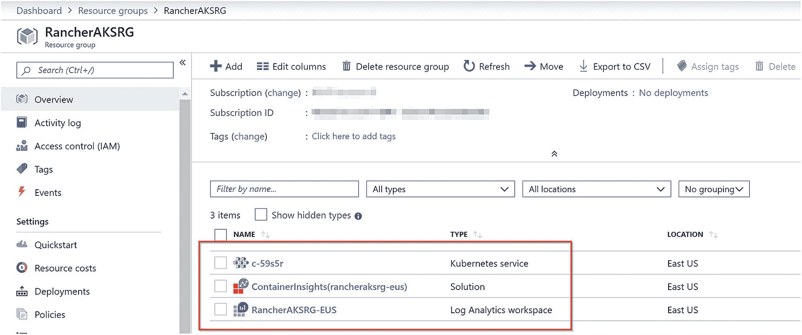

图 6-9

Azure 上的 AKS 集群资源

回到 Rancher 门户，您现在可以单击 AKS 集群来访问仪表板、监控和集群设置，从 Rancher 或 Helm 目录安装应用，启动 Kubectl 等。图 6-10 是 Rancher 中 AKS 集群的仪表板示例。

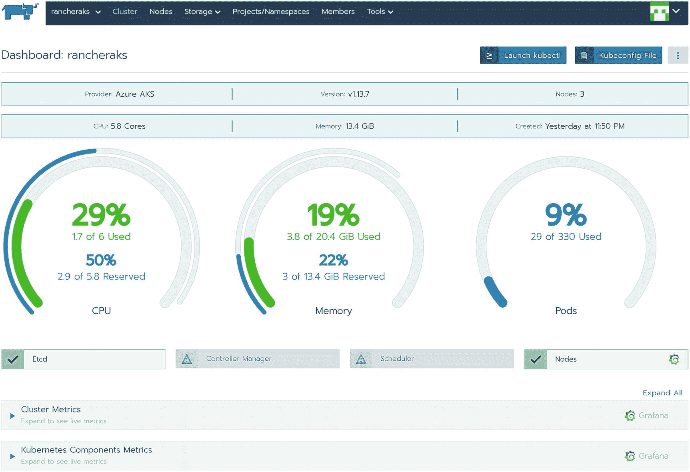

图 6-10

牧场主的 AKS 集群仪表板

下面两个屏幕截图展示了 Rancher 中针对 AKS 集群的 Grafana 监控。图 6-11 显示了实时集群指标。

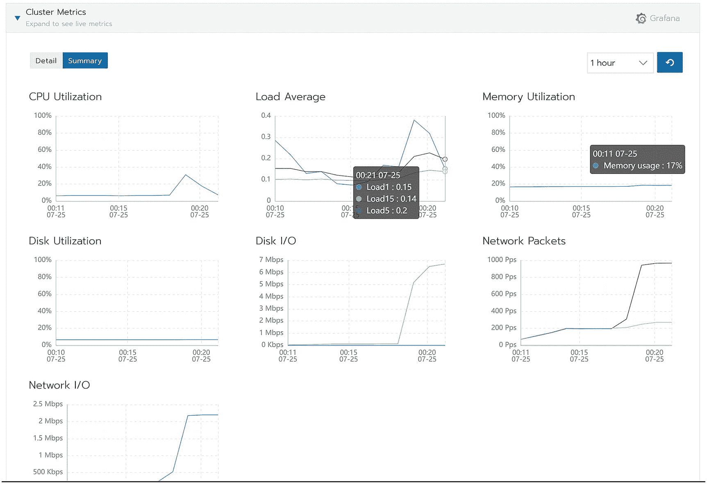

图 6-11

牧场主的 Grafana 聚类度量

图 6-12 显示了集群和 Kubernetes 组件的实时指标。

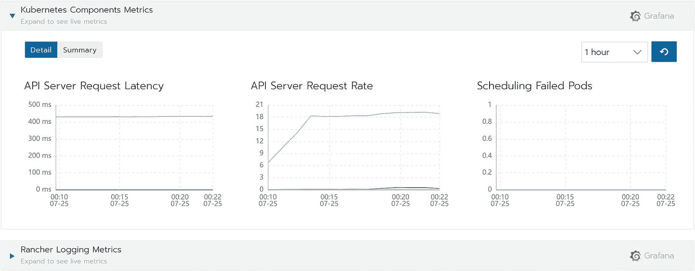

图 6-12

Grafana Kubernetes 牧场主的组件度量

您还可以访问完整的 Grafana UI 和系统，以更深入地了解您的 AKS 集群及其资源，如图 6-13 所示的节点和单元。

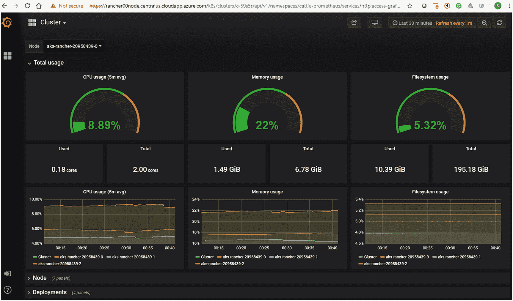

图 6-13

格拉凡·ui

## 摘要

这就把我们带到了本章的结尾。Rancher 不像 Docker 和 Kubernetes 那样出名。然而，正如您在本章中了解到的，Rancher 是简化 Kubernetes 生命周期的一个有用的解决方案。具体来说，在这一章中，我们介绍了什么是 Rancher，为什么您将它与 Kubernetes 一起使用，在 Azure 上部署 Rancher，最后将 Rancher 连接到 Azure，以便您可以部署新的 AKS 集群。