# 七、使用 MongoDB 数据库

MongoDB 是一个灵活的模式模型 NoSQL 数据存储，最常用的 NoSQL 数据存储。MongoDB 基于 BSON(二进制 JSON)存储模型。文档存储在集合中。作为一个无模式的数据存储，就 BSON 文档中的字段而言，没有两个文档需要是相同的。在大规模集群中，可能会运行几个 MongoDB 实例，并且可能会出现几个问题。

*   -MongoDB 实例调度
*   -扩展 MongoDB 集群
*   -负载均衡
*   -提供 MongoDB 即服务

虽然 Docker 使提供容器即服务(CaaS)变得可行，但它本身并不提供前面列出的任何功能。在本章中，我们将讨论使用 Kubernetes 容器集群管理器来管理和编排运行 MongoDB 的 Docker 容器集群。本章包括以下几节。

*   设置环境
*   以声明方式创建 MongoDB 集群
*   强制创建 MongoDB 集群

## 设置环境

本章需要以下软件。

*   -Docker 引擎(最新版本)
*   -Kubernetes(1.01 版)
*   -Kubernetes(1.01 版)
*   MongoDB 的 Docker 映像(最新版本)

在运行 Ubuntu 14 的 Amazon EC2 实例上安装所需软件；与其他章节中使用的 AMI 相同。SSH 使用公共 IP 地址登录 Ubuntu 实例，对于不同的用户，这个地址是不同的。

```
ssh -i "docker.pem" ubuntu@52.91.190.195

```

Ubuntu 实例被登录，如图 7-1 所示。

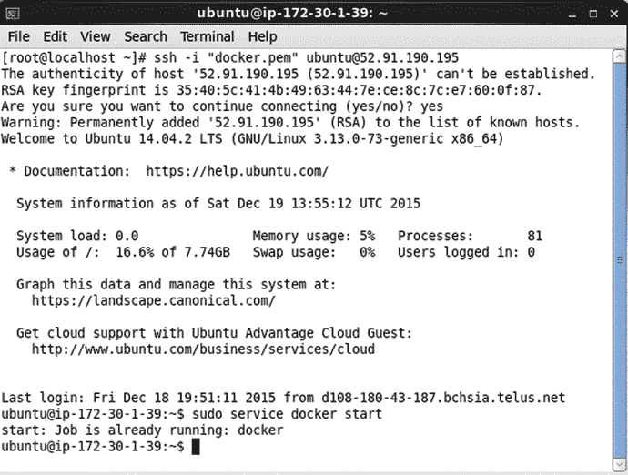

图 7-1。

Logging into Ubuntu Instance on Amazon EC2

第一章讨论了安装程序。要验证 Docker 是否正在运行，请运行以下命令。

```
sudo service docker start

```

Docker 应被列为运行中，如图 7-2 所示。


图 7-2。

Starting Docker

使用以下命令列出 pod。

```
kubectl get pods

```

并使用以下命令列出节点。

```
kubectl get nodes

```

Kubernetes Pod 被列出，节点也被列出，如图 7-3 所示。

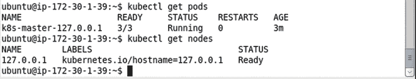

图 7-3。

Listing Kubernetes Pod and the single Node

要列出服务，请运行以下命令。

```
kubectl get services

```

“kubernetes”服务被列出，如图 7-4 所示。

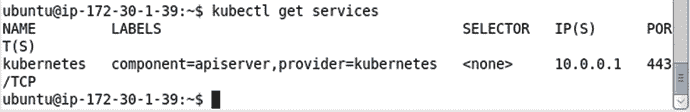

图 7-4。

Listing the Kubernetes Service

## 以声明方式创建 MongoDB 集群

在下面的小节中，我们将为 MongoDB 集群创建一个 Kubernetes 服务和复制控制器。我们将扩展群集，并演示使用卷和主机端口等功能。我们将创建一个 MongoDB 集合，并在 Docker 容器 tty(交互式终端或 shell)中运行的 Mongo shell 中将文档添加到集合中。

### 创建服务

创建服务定义文件`mongo-service-yaml`。在定义文件中添加以下(表 7-1 )字段映射。

表 7-1。

Service Definition File mongo-service-yaml File Fields

<colgroup><col> <col> <col></colgroup> 
| 田 | 价值 | 描述 |
| --- | --- | --- |
| apiVersion(堆叠版本) | 第五颅神经的眼支 | API 版本。 |
| 种类 | 服务 | 将定义文件指定为服务。 |
| 元数据 |   | 服务元数据。 |
| 元数据->标签 | 名称:mongo |   |
| 元数据->名称 | 蒙戈 | 标签映射。标签可以添加多次，不会产生错误，也没有额外的意义。 |
| 投机 |   | 服务规范。 |
| 规格->端口 |   | 公开服务的端口。 |
| 规格->端口->端口 | Twenty-seven thousand and seventeen | 托管服务的端口。 |
| 规格>连接埠>目标连接埠 | Twenty-seven thousand and seventeen | 传入端口映射到的端口。targetPort 字段是可选的，默认为与 Port 字段相同的值。如果服务要在不破坏客户端设置的情况下发展，targetPort 可能是有用的。例如，targetPort 可以设置为后端 Pod 的字符串端口名称，它保持不变。并且后端 Pod 暴露的实际端口号可以变化，而不会影响客户端的设置。 |
| 选择器 | 名称:mongo | 用于选择窗格的服务选择器。标签表达式与选择器相同的窗格由服务管理。 |

将下面的清单复制到`mongo-service.yaml`。

```
apiVersion: v1
kind: Service
metadata:
  labels:
    name: mongo
  name: mongo
spec:
  ports:
    - port: 27017
      targetPort: 27017
  selector:
    name: mongo

```

vi 编辑器可用于创建`mongo-service.yaml`文件，并使用:wq 命令保存，如图 7-5 所示。

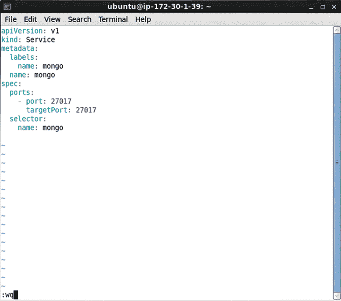

图 7-5。

Service Definition File in vi Editor

默认服务类型是`ClusterIp`，它仅使用集群内部 IP。如图 7-6 所示，可以将类型设置为`LoadBalancer`，以便在集群中的每个节点上公开服务，并请求云提供商提供负载均衡器。

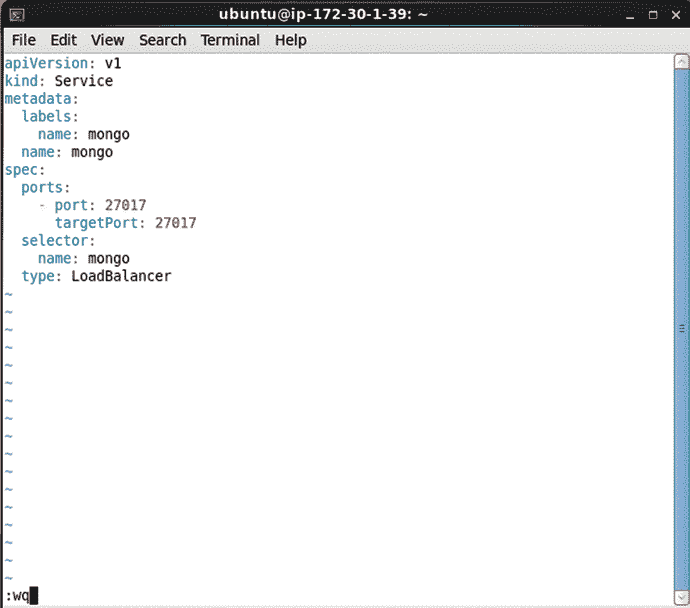

图 7-6。

Setting the Service Type

要从定义文件创建服务，请运行以下命令。

```
kubectl create -f mongo-service.yaml

```

使用以下命令列出服务。

```
kubectl get services

```

`mongo`服务列表如图 7-7 所示。

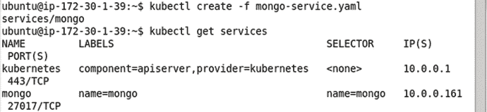

图 7-7。

Creating the Service from the Definition File

### 创建复制控制器

在本节中，我们将创建一个复制控制器。创建一个定义文件`mongo-rc.yaml`。将以下(表 7-2 )字段映射添加到定义文件中。

表 7-2。

Replication Controller Definition File Fields

<colgroup><col> <col> <col></colgroup> 
| 田 | 价值 | 描述 |
| --- | --- | --- |
| apiVersion(堆叠版本) | 第五颅神经的眼支 | API 版本。 |
| 种类 | 复制控制器 | 指定复制控制器的定义文件。 |
| 元数据 |   | 指定复制控制器的元数据。 |
| 元数据->标签 | 名称:mongo | 复制控制器的标签映射。 |
| 元数据->名称 | 蒙戈-rc | 复制控制器的名称。 |
| 投机 |   | 复制控制器规范。 |
| 规格->副本 | Two | 始终要保留的副本数量。 |
| 规格->模板 |   | Pod 的模板。 |
| 规格->模板->元数据 |   | Pod 的元数据。 |
| 规格->模板->元数据->标签 |   | POD 标签。复制控制器和服务使用这些标签来选择要管理的 pod。复制控制器和服务中的选择器必须与用于管理 Pod 的复制控制器和服务的 Pod 标签相匹配。 |
| 规格->模板->元数据->标签->名称 | 蒙戈 | 在 label 下方。 |
| 规格->模板->规格 |   | Pod 的规格。 |
| 规格->模板->规格->容器 |   | POD 里的容器。可以指定多个容器，但我们只配置了一个容器。 |
| 规格->模板->规格->容器->映像 | 蒙戈 | “mongo”Docker 映像的容器。 |
| 规格->模板->规格->容器->名称 | 蒙戈 | 容器名称。 |
| 规格->模板->规格->容器->端口 |   | 要预订的容器港口。 |
| 规格->模板->规格->容器->端口->名称 | 蒙戈 | 端口名称。 |
| 规格->模板->规格->容器->端口->容器端口 | Twenty-seven thousand and seventeen | 容器端口号。 |

每个 Pod、服务和复制控制器都在单独的 YAML 映射文件中定义。`mongo-rc.yaml`已列出。

```
apiVersion: v1
kind: ReplicationController
metadata:
  labels:
    name: mongo
  name: mongo-rc
spec:
  replicas: 2
  template:
    metadata:
      labels:
        name: mongo
    spec:
      containers:
        -
          image: mongo
          name: mongo
          ports:
            -
              containerPort: 27017
              name: mongo

```

`mongo-rc.yaml`文件可以在 vi 编辑器中编辑，用:wq 保存，如图 7-8 所示。

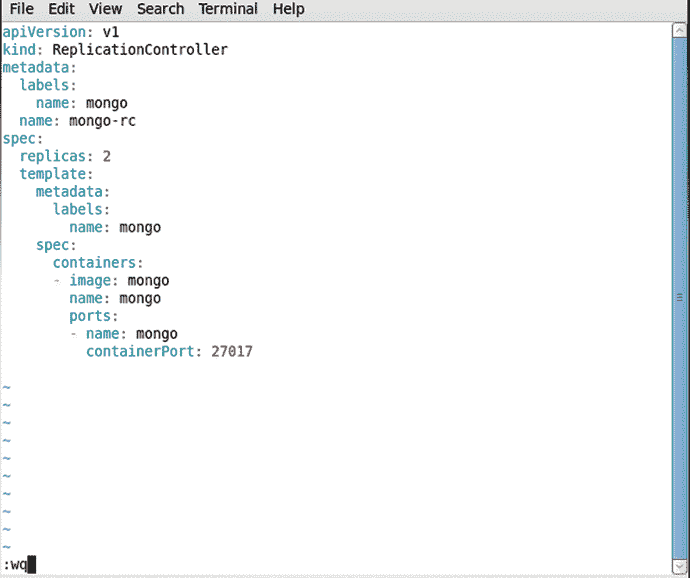

图 7-8。

Replication Controller Definition File

若要从定义文件创建复制控制器，请运行以下命令。

```
kubectl create -f mongo-rc.yaml

```

`mongo-rc`复制控制器被创建，如图 7-9 所示。


图 7-9。

Creating the Replication Controller

运行以下命令列出复制容器。

```
kubectl get rc

```

`mongo-rc`复制控制器列表如图 7-10 所示。

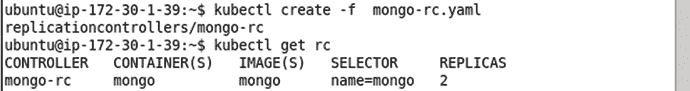

图 7-10。

Creating and isting Replication Controllers

### 创建卷

Kubernetes 支持卷。卷是 Pod 中的目录，Pod 中的容器可以访问该目录，这些容器为卷提供卷挂载。只要包含卷的 Pod 存在，卷就会一直存在。卷可用于以下目的。

*   -跨容器崩溃保存数据。当装载卷的容器崩溃时，卷中的数据不会被删除，因为卷不在容器上，而是在 Pod 上。
*   -卷中的数据可以由装载该卷的多个容器共享。

Pod 中的体积由“规格->体积”字段指定。一个容器装载一个带有`spec.containers.volumeMounts`字段的卷。支持几种类型的卷，其中一些在表 7-3 中讨论。

表 7-3。

Types of Volumes

<colgroup><col> <col></colgroup> 
| 卷类型 | 描述 |
| --- | --- |
| emptyDir 先生 | Pod 中的空目录，可用于保存一个或多个容器使用的一些文件。空目录也可以用于检查点。 |
| 主机路径 | 将目录从主机节点装载到 Pod 中。 |
| gcePersistentDisk | 将一个谷歌计算引擎永久磁盘安装到 Pod 中。 |
| awsElasticBlockStore | 将 Amazon Web Services EBS 卷装入 Pod。 |
| 吉卜赛人 | 将 git repo 装载到 pod 中。 |
| 弗勒加 | 将 Flocker 数据集装载到 pod 中。 |
| 网络文件系统 | 将网络文件系统装入 Pod。 |

接下来，我们将把类型为`emptyDir`的卷添加到复制控制器定义文件`mongo-rc.yaml`中。一种改良版的`mongo-rc.yaml`上市了。

```
apiVersion: v1
kind: ReplicationController
metadata:
  labels:
    name: mongo
  name: mongo-rc
spec:
  replicas: 2
  template:
    metadata:
      labels:
        name: mongo
    spec:
      containers:
        -
          image: mongo
          name: mongo
          ports:
            -
              containerPort: 27017
              name: mongo
          volumeMounts:
            -
              mountPath: /mongo/data/db
              name: mongo-storage
      volumes:
        -
          emptyDir: {}
          name: mongo-storage

```

前面的定义文件包括类型为`emptyDir`的名为`mongo-storage`的卷的以下卷配置。

```
      volumes:
        -
          emptyDir: {}
          name: mongo-storage

```

该卷存在于 Pod 中，Pod 中的单个容器可以使用字段`spec->containers->volumeMounts`装载该卷。修改后的`mongo-rc.yaml`包括以下用于`mongo`容器的卷挂载。

```
volumeMounts:
            -
              mountPath: /mongo/data/db
              name: mongo-storage

```

前面的配置在容器中的挂载路径或目录路径`/mongo/data/db`为`mongo-storage`卷添加了一个卷挂载。在容器内，可以在`/mongo/data/db`访问卷。例如，在一个交互终端中为一个容器把目录(cd)改为`/mongo/data/db`目录。

```
cd /mongo/data/db

```

列出`/mongo/data/db`目录中的文件和目录。

```
ls -l

```

该目录是空的，因为它最初应该如图 7-11 所示。


图 7-11。

Empty Directory

不要将该卷与 MongoDB 服务器的数据目录混淆。默认情况下，数据目录在`/data/db`创建，并在运行 MongoDB 服务器实例的每个 Docker 容器中创建。`/mongo/data/db`是所有 Docker 容器共有的，而`/data/db`存在于每个 Docker 容器中。

### 列出日志

启动复制控制器后，使用以下命令列出 pod。

```
kubectl get pods

```

如图 7-12 所示，两个吊舱被列出。

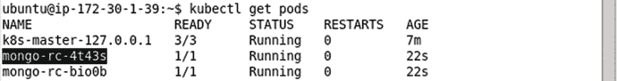

图 7-12。

Listing the Pods

可以使用以下命令列出 Pod 的日志，例如,`mongo-rc-4t43s` Pod。

```
kubectl logs mongo-rc-4t43s

```

Pod 日志显示 MongoDB 服务器启动，如图 7-13 所示。

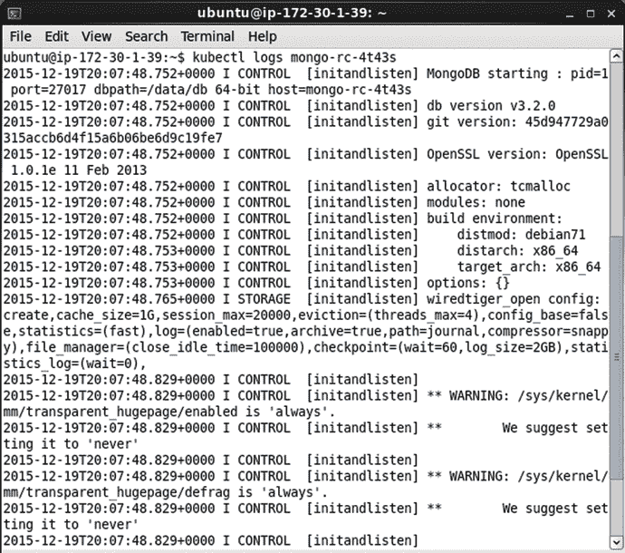

图 7-13。

Listing the Pod Logs

当 MongoDB 服务器启动时，输出消息“等待端口 27017 上的连接”,如图 7-14 所示。

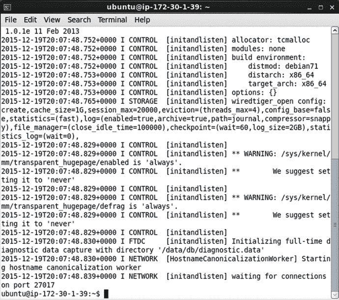

图 7-14。

MongoDB Running on Port 27017

### 启动 Docker 容器的交互式外壳

在这一节中，我们将为 MongoDB 服务器启动一个交互式终端或 bash shell，为此我们需要运行 MongoDB 服务器的 Docker 容器的容器 id。列出 Docker 容器。

```
sudo docker ps

```

复制映像为“mongo”的容器的容器 id，如图 7-15 所示。

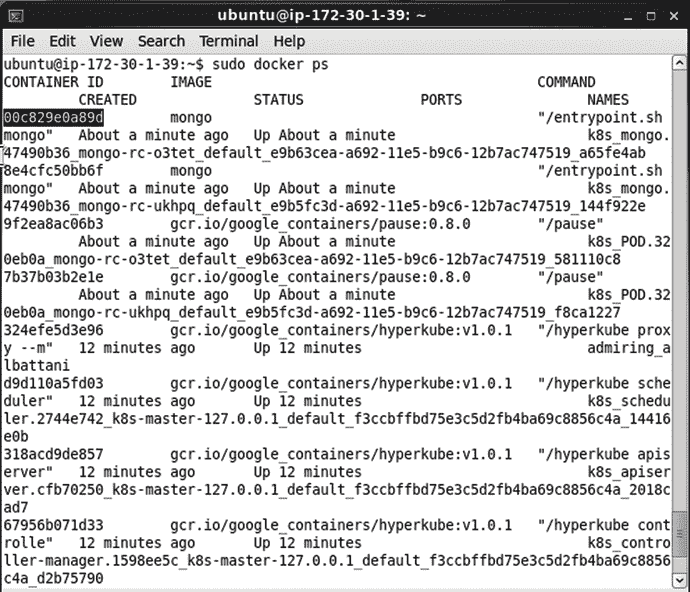

图 7-15。

Copying Docker Container ID

因为“mongo”Docker 映像基于 FROM 指令中指定的“debian”Docker 映像，所以我们能够启动一个 bash shell 来与基于“mongo”映像的 Docker 容器中运行的 MongoDB 服务器进行交互。使用以下命令启动交互式 bash shell。

```
sudo docker exec -it 00c829e0a89d bash

```

如图 7-16 所示，启动一个交互式外壳。


图 7-16。

Starting an Interactive Shell

### 启动 Mongo Shell

用下面的命令启动 Mongo shell。

```
mongo

```

Mongo shell 启动如图 7-17 所示。

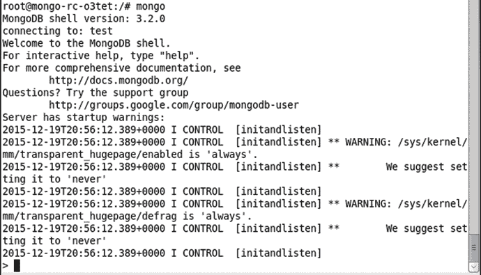

图 7-17。

Mongo Shell

### 创建数据库

在 Mongo shell 中使用以下命令列出数据库。

```
show dbs

```

当使用或设置数据库时，数据库被隐式地创建。比如设置数据库使用为`mongodb`，没有和`show dbs`一起列出，还不存在。

```
use mongodb

```

但是，将数据库设置为用作`mongodb`并不会创建数据库`mongodb`，直到数据库被使用。运行以下命令列出数据库。

```
show dbs

```

`mongodb`数据库没有被列出，如图 7-19 所示。要创建`mongodb`数据库，调用数据库上的一些操作，比如用下面的命令创建一个名为`catalog`的集合。

```
db.createCollection("catalog")

```

随后再次列出数据库。

```
show dbs

```

`mongodb`数据库被列出，如图 7-18 所示。要列出集合，请运行以下命令。

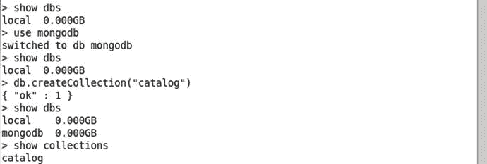

图 7-18。

Creating and Listing a MongoDB Database

```
show collections

```

`catalog`系列上市。

### 创建收藏

在上一节中，`catalog`集合是使用`db.createCollection`方法创建的。再举一个例子，使用下面的命令创建一个名为`catalog_capped`的封顶集合:封顶集合是一个固定大小的集合，支持基于插入顺序添加和获取文档的高吞吐量操作。

```
db.createCollection("catalog_capped", {capped: true, autoIndexId: true, size: 64 * 1024, max: 1000} )

```

如图 7-19 所示，添加一个加盖的集合。最初，集合是空的。使用以下命令获取`catalog`集合中的文档。

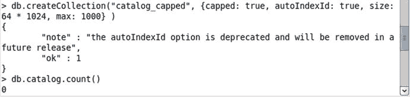

图 7-19。

Creating a Capped Collection

```
db.catalog.count()

```

文档数被列为 0，因为我们尚未添加任何文档。

### 添加文档

在本节中，我们将向目录集合中添加文档。为要添加的文档指定 JSON。存储在 MongoDB 中的每个文档都需要`_id`字段。可以像在`doc2`文档中一样明确地添加`_id`字段。如果文件 JSON 中没有提供，则自动生成`_id`。

```
doc1 = {"catalogId" : "catalog1", "journal" : 'Oracle Magazine', "publisher" : 'Oracle Publishing', "edition" : 'November December 2013',"title" : 'Engineering as a Service',"author" : 'David A. Kelly'}
doc2 = {"_id": ObjectId("507f191e810c19729de860ea"), "catalogId" : "catalog1", "journal" : 'Oracle Magazine', "publisher" : 'Oracle Publishing', "edition" : 'November December 2013',"title" : 'Engineering as a Service',"author" : 'David A. Kelly'};

```

doc1 和 doc2 如图 7-20 所示。

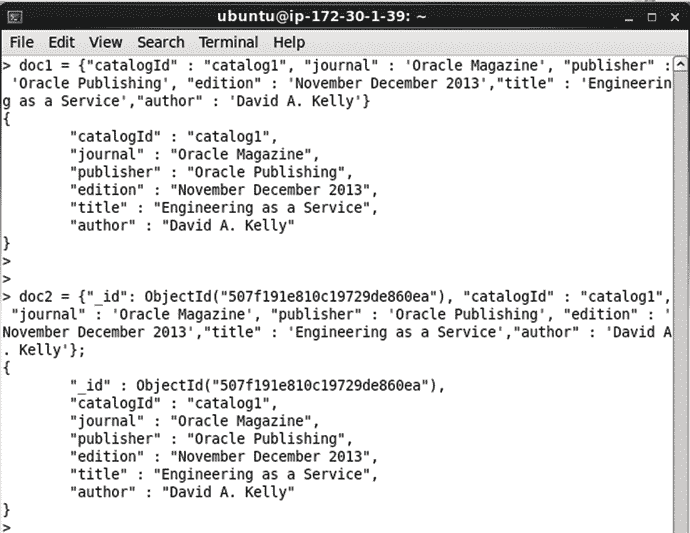

图 7-20。

Documents doc1 and doc2

要将文档添加到`catalog`集合，请运行以下命令。

```
db.catalog.insert([doc1, doc2], { writeConcern: { w: "majority", wtimeout: 5000 }, ordered:true })

```

如图 7-21 中 JSON 结果的`nInserted`字段所示，文件被添加。

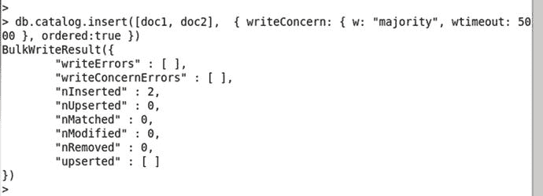

图 7-21。

Adding Documents

### 查找文档

要查询目录，调用`find()`方法。要列出`catalog`集合中的所有文档，运行以下命令。

```
db.catalog.find()

```

添加的两个文件列表如图 7-22 所示。对于其中一个文档，会自动生成`_id`字段。

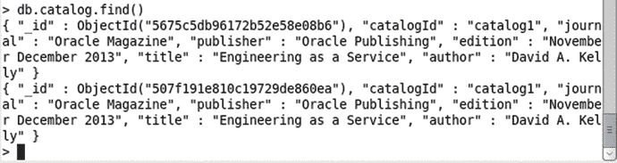

图 7-22。

Finding Documents

### 查找单个文档

要从`catalog`集合中找到一个文档，运行下面的命令来调用`findOne()`方法。

```
db.catalog.findOne()

```

单个文档被列出，如图 7-23 所示。

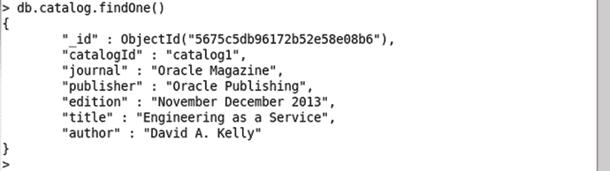

图 7-23。

Finding a Single Document

### 在单个文档中查找特定字段

例如，要仅从单个文档中获取特定字段`edition, title`和`author`，请运行以下命令。

```
db.catalog.findOne(
    { },
{ edition: 1, title: 1, author: 1 }
)

```

只列出单个文档中的特定字段，如图 7-24 所示。`_id`字段总是被列出。

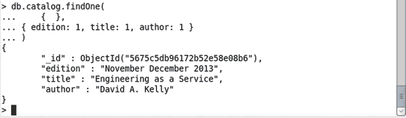

图 7-24。

Finding Selected Fields in a Document

### 删除收藏

要删除`catalog`集合，请运行以下命令。

```
db.catalog.drop()

```

随后使用以下命令列出集合。

```
show collections

```

`catalog`集合没有被列出，只有`catalog_capped`集合被列出，如图 7-25 所示。

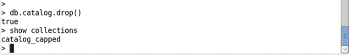

图 7-25。

Dropping the catalog Collection

### 退出 Mongo Shell 和交互式 Shell

要退出 Mongo shell，运行以下命令。

```
exit

```

要退出交互式终端，请运行以下命令。

```
exit

```

Mongo shell 和交互终端退出，如图 7-26 所示。

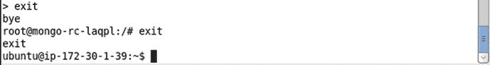

图 7-26。

Exiting the Shells

### 扩展集群

要扩展 Mongo 集群，运行`kubectl scale`命令。例如，以下命令将群集扩展到 4 个复制副本。

```
kubectl scale rc mongo --replicas=4

```

如图 7-27 所示的“缩放”输出将集群缩放至 4 个副本。


图 7-27。

Scaling a Replication Controller

缩放后列出窗格。

```
kubectl get pods

```

四个 POD 被列出。最初，一些容器可能被列为未就绪(1/1)状态。多次运行上述命令，列出所有正在运行并准备就绪的吊舱，如图 7-28 所示。

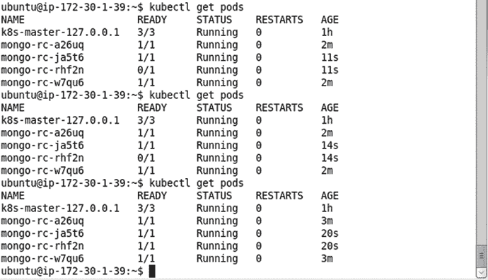

图 7-28。

Listing the Pods after Scaling

### 删除复制控制器

要删除复制控制器`mongo-rc`，请运行以下命令。

```
kubectl delete replicationcontroller mongo-rc

```

由复制控制器管理的所有 pod 也会被删除。随后运行以下命令来列出窗格。

```
kubectl get pods

```

`mongo`吊舱不会如图 7-29 所示列出。

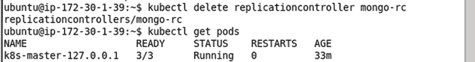

图 7-29。

Deleting a Replication Controller

### 删除服务

要删除名为`mongo`的服务，运行以下命令。

```
kubectl delete service mongo

```

`mongo`服务未列出，如图 7-30 所示。

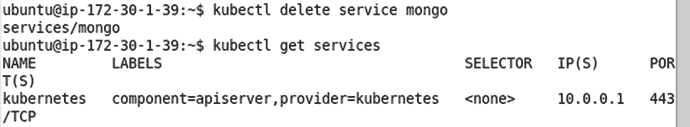

图 7-30。

Deleting the mongo Service

### 使用主机端口

Pod 中的容器规范有配置主机端口的规定。主机端口是映射到主机的容器端口，意味着指定的主机端口被保留给单个容器。`hostPort`字段应该用于单个机器容器。指定了`hostPort`的类型的多个容器无法启动，因为主机端口只能由一个容器保留。然而，其他没有指定`hostPort`字段的 pod 可以在运行具有`hostPort`字段映射的容器的同一台机器上运行。作为我们之前使用的复制控制器的变体，在 spec- > containers- > ports 字段中添加了一个`hostPort`字段。修改后的`mongo-rc.yaml`被列出。

```
---
apiVersion: v1
kind: ReplicationController
metadata:
  labels:
    name: mongo
  name: mongo-rc
spec:
  replicas: 2
  template:
    metadata:
      labels:
        name: mongo
    spec:
      containers:
        -
          image: mongo
          name: mongo
          ports:
            -
              containerPort: 27017
              hostPort: 27017
              name: mongo

```

运行以下命令创建复制控制器。

```
kubectl create -f mongo-rc.yaml

```

使用以下命令列出复制控制器。

```
kubectl get rc

```

`mongo-rc`复制控制器被创建并列出，如图 7-31 所示。

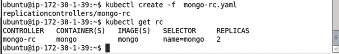

图 7-31。

Creating a Replication Controller from a Definition File

使用以下命令列出 pod。

```
kubectl get pods

```

两个复制副本中只有一个列为正在运行和就绪(1/1)。即使前面的命令运行多次，也只有一个副本被列为正在运行，如图 7-32 所示。

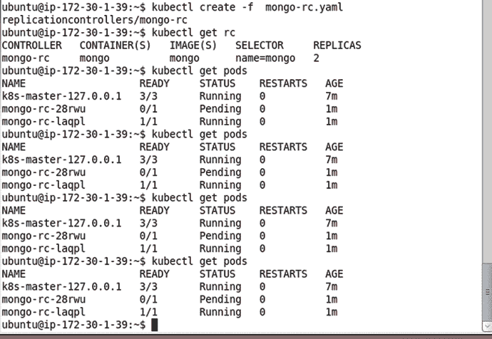

图 7-32。

Listing the Pods after creating a Replication Controller

使用以下命令将 MongoDB 集群扩展到 4 个副本。

```
kubectl scale rc mongo --replicas=4

```

尽管该命令的输出被“缩放”并创建了 4 个 Pod，但在任何特定时间只有一个 Pod 处于就绪(1/1)状态，如图 7-33 所示。

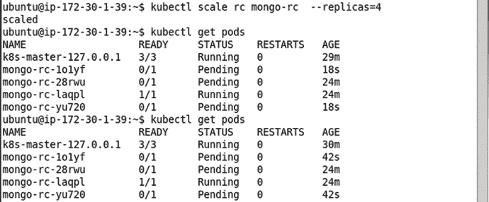

图 7-33。

Scaling the Replication Controller to 4 Replicas

即使单个运行的 Pod 停止，也只有一个新的 Pod 启动。要进行演示，请停止单个运行的 Pod。

```
kubectl stop pod mongo-rc-laqpl

```

该单元被移除，但会创建一个替换单元来保持复制级别 1，如图 7-34 所示。

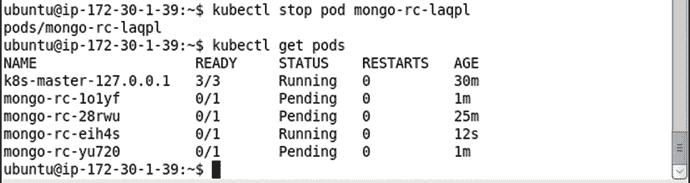

图 7-34。

Another Pod gets created when the single running Pod is stopped

几秒钟后再次列出 Pod，只有一个 Pod 被列出，如图 7-35 所示。

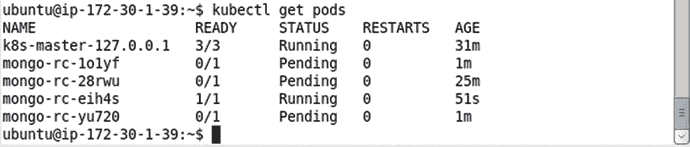

图 7-35。

Only a single Pod is Running and Ready

不建议使用`hostPort`字段，除非使用单个容器机器或者只需要将单个容器映射到主机端口。

## 强制创建 MongoDB 集群

在接下来的小节中，我们将在命令行上使用 kubectl 为 MongoDB 集群创建一个 Kubernetes 复制控制器和服务。

### 创建复制控制器

要为具有 2 个副本和端口 27017 的 Docker 映像“mongo”创建复制控制器，请运行以下命令。

```
kubectl run mongo --image=mongo --replicas=2 --port=27017

```

复制控制器的创建如图 7-36 所示。

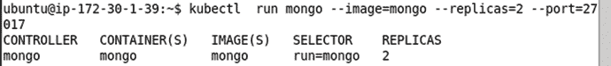

图 7-36。

Creating a Replication Controller Imperatively

使用以下命令列出 pod。

```
kubectl get rc

```

`mongo` -rc 列表如图 7-37 所示。


图 7-37。

Listing the Replication Controllers

### 列出 POD

使用以下命令列出 pod。

```
kubectl get pods

```

为 MongoDB get 启动的两个 Pods 列表如图 7-38 所示。最初，pod 可能会被列为未运行。

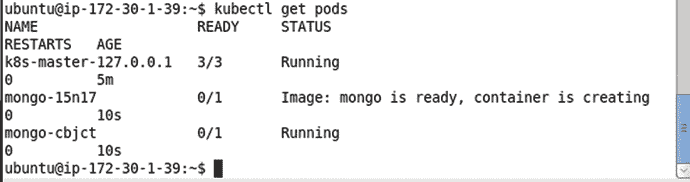

图 7-38。

Listing the Pods with some of the pods not Running yet

如图 7-39 所示，如果需要将 pod 列为正在运行，请多次运行以下程序。

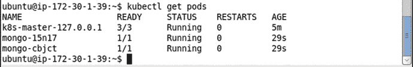

图 7-39。

Listing all the Pods as Running

### 列出日志

使用以下命令列出 Pod 的日志。`mongo-56850`是 Pod 名称。

```
kubectl logs mongo-56850

```

Pod 日志列表如图 7-40 所示。

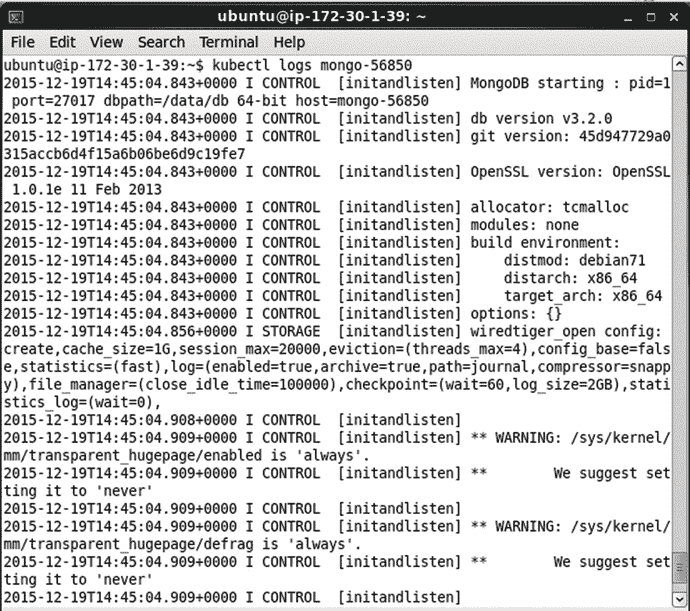

图 7-40。

Listing Pod Logs

MongoDB 被列为已启动，如图 7-41 所示。在服务器上运行的命令也会得到输出。

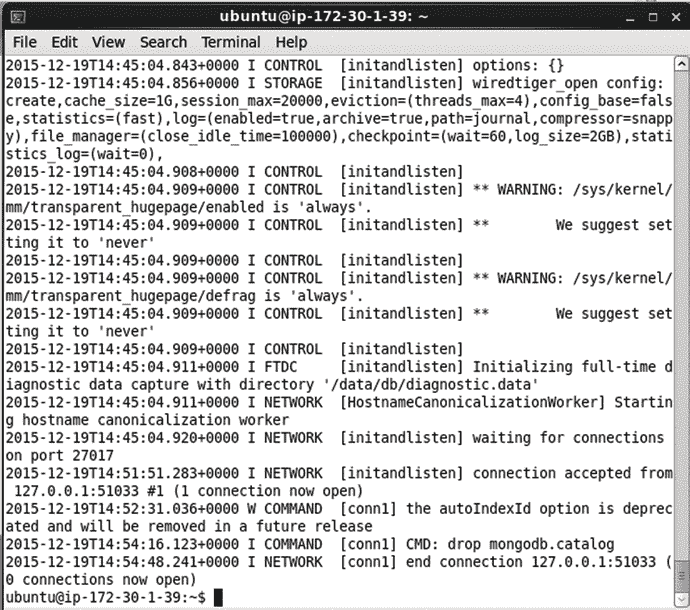

图 7-41。

Listing MongoDB Server as running and waiting for connections on port 27017

### 创建服务

要为`mongo`复制控制器创建一个服务，运行下面的命令在端口 27017 上公开一个类型为`LoadBalancer`的服务，这在前面已经讨论过了。

```
kubectl expose rc mongo --port=27017 --type=LoadBalancer

```

`mongo`服务被创建，如图 7-42 所示。

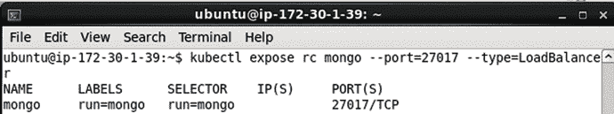

图 7-42。

Creating a Service Imperatively

使用以下命令列出服务。

```
kubectl get services

```

在图 7-43 中`mongo`服务被列为正在运行。

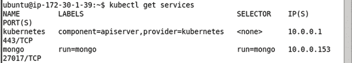

图 7-43。

Listing the Services including the mongo Service

交互式终端和 Mongo shell 可以开始创建 MongoDB 数据库和集合，以便在集合中添加和查询文档，正如在以声明方式创建 MongoDB 集群时所讨论的那样。

### 扩展集群

例如，要将群集扩展到 4 个副本，请运行以下命令。

```
kubectl scale rc mongo --replicas=4

```

输出“scaled”表示集群已被缩放，如图 7-44 所示。


图 7-44。

Scaling the Cluster created Imperatively

随后得到 POD。

```
kubectl get pods

```

列出四个吊舱，如图 7-45 所示。最初，一些 pod 可能显示为未运行或就绪。

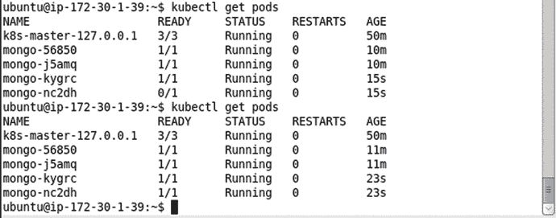

图 7-45。

Listing Pods after Scaling

要描述`mongo`服务，请运行以下命令。

```
kubectl describe svc mongo

```

除了服务端点之外，服务描述还包括服务标签、选择器，如图 7-46 所示，四个 pod 各有一个。

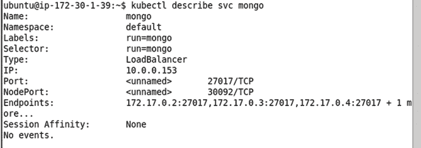

图 7-46。

Describing the Service mongo after Scaling

### 删除服务和复制控制器

可以使用以下命令删除`mongo`服务和`mongo`复制控制器。

```
kubectl delete service mongo
kubectl delete rc mongo

```

“mongo”服务和“mongo”复制控制器被删除，如图 7-47 所示。删除一个不会删除另一个；复制控制器与服务的分离是一个适合于发展一个而不必修改另一个的特性。

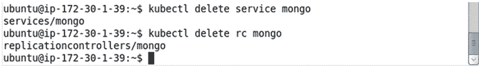

图 7-47。

Deleting the Service and the Replication Controller

## 摘要

在本章中，我们使用 Kubernetes 集群管理器来创建和编排一个 MongoDB 集群。我们强制性地和声明性地创建了一个复制控制器和一个服务。我们还演示了如何扩展集群。我们介绍了 Kubernetes 复制控制器的另外两个特性:卷和主机端口。这一章是关于在 MongoDB 中使用 Kubernetes 的，重点不是在 MongoDB 上；但如果要更详细地探究 MongoDB，请参考 Apress 的书 Pro MongoDB Development([`http://www.apress.com/9781484215999?gtmf=s`](http://www.apress.com/9781484215999?gtmf=s))。在下一章，我们将讨论另一个 NoSQL 数据库，Apache Cassandra。