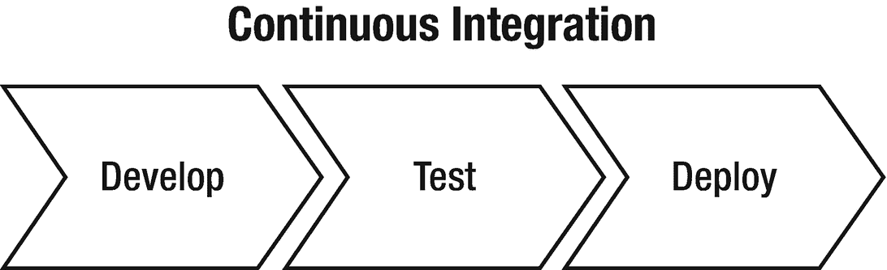
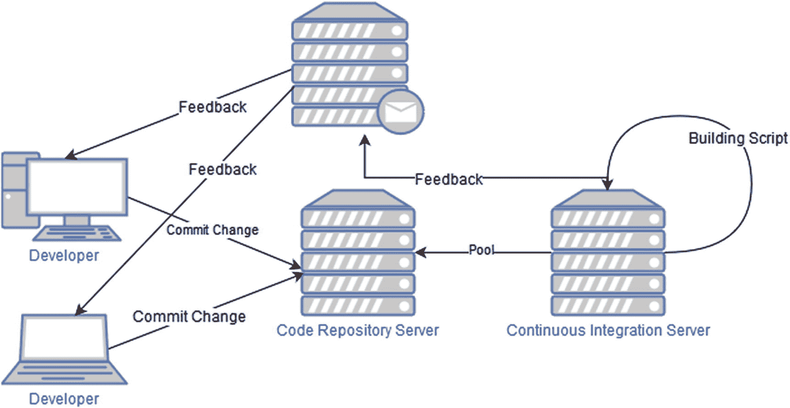
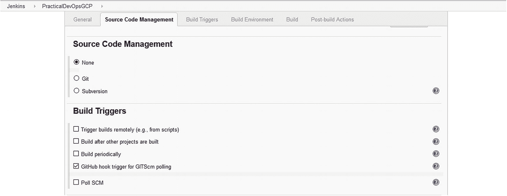
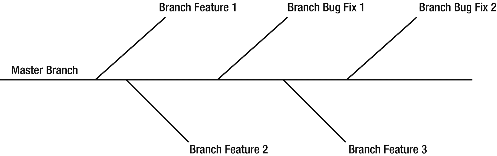
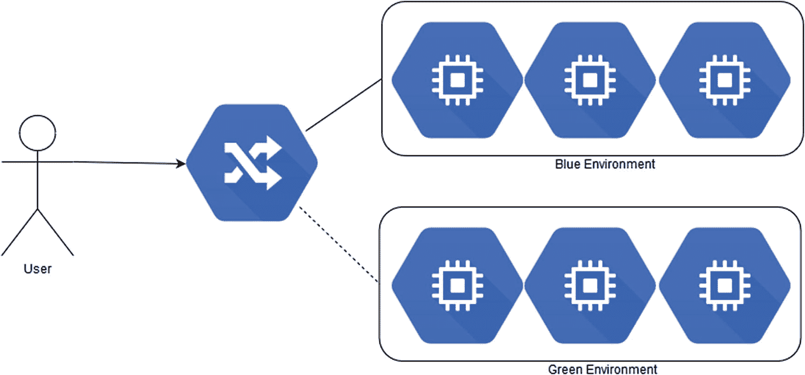
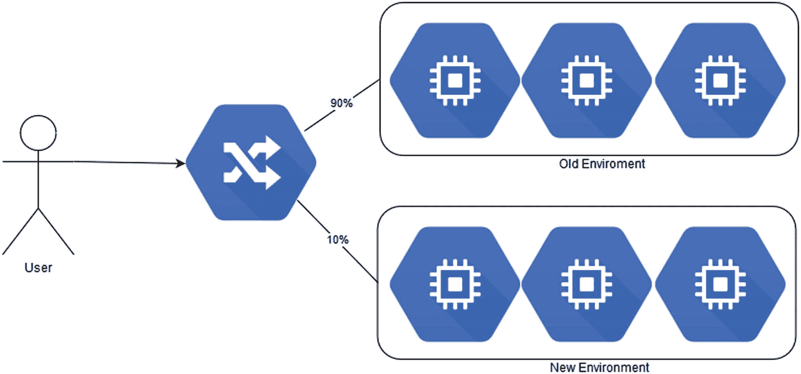
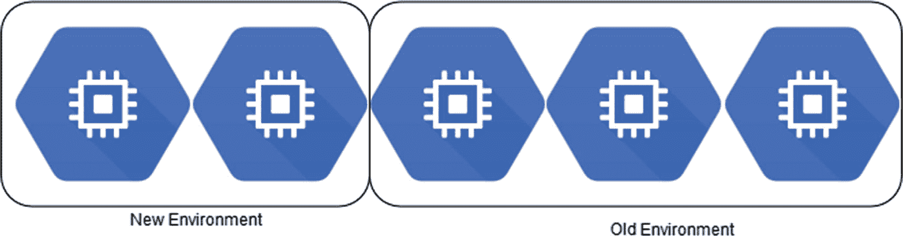

# 三、持续集成和交付简介

持续集成(CI)和持续交付(CD)日益流行。这是因为它们对于缩短上市时间和提高软件质量至关重要。

随着 CI 和 CD 的实践，每次我们从一个中央存储库发布软件，它都被构建并发布以进行测试。这意味着每天有数百次递送。CI 和 CD 是严格联系的，一个是另一个的延伸。这两种做法都有一些相关的成本和节省。在这一章中，我将介绍 CI 和 CD，并尝试说明它们对我们的 DevOps 之旅有多么重要。

## 持续集成的定义

CI 的定义很简单。这是一种开发实践，要求开发人员将代码集成到一个中央共享存储库中。每次开发人员提交代码时，它都会与其他代码集成，并通过测试的执行来验证。

每当我们将代码提交到集中共享的存储库时，CI 就开始了。这意味着每次我们改变一些东西，例如，一个 HTML 页面上的标签，或者一个变量，我们测试整个解决方案，因为我们在每次提交时都测试解决方案。我们可以在构建中更快更容易地找到错误并修复它们。我们在每次提交时所做的基本上是构建整个解决方案。

采用 CI 成本低。本质上，我们只需要一个有 Jenkins 的服务器，就可以开始使用了。CI 可以总结为三个简单的阶段(见图 3-1 )。



图 3-1

持续集成链

1.  发展

2.  试验

3.  部署

当我们有了 CI 之后，我们每次在我们的存储库中提交代码时都会执行这个循环。当我们使用 CI 时，我们每次都创建一个构建。这是 CI 的本质:我们每次提交代码时都有一个完整的软件生命周期。关于这一点有两种观点。通常，CI 向 QA 发布。

### 在持续集成场景中构建什么？

在 CI 场景中，构建不仅仅是编译软件。一个构建由发布软件所需的所有操作组成。构建本质上是一个将所有代码放在一起并验证所有代码都工作正常的过程。

如果我们考虑一个典型的项目，我们可以看到不同的人参与不同的领域。开发人员创建特性，并在必要时更改表的脚本。数据库管理员(DBA)放置脚本，并在数据库准备就绪时通知开发人员。从那里开始，开发人员继续开发。

在开发的最后，软件被集成和测试在一起。这可能需要数周的工作才能完成，如果出现错误，软件可能会返回给开发人员进行修复。这需要时间，并且会降低软件的质量。这是因为，在经典的项目管理专业(PMP)，又名瀑布，方法，质量是三个变量的结果:

*   范围

*   时间

*   费用

如果我们忽略了这三个变量中的任何一个，我们就会降低软件的质量。在 CI 场景中，所有 CI 流程都从提交存储库中的源代码开始。

可以通过以下简单步骤设计 CI 场景:

1.  开发人员提交存储库中的代码。

2.  CI 服务器汇集存储库，下载最后的代码，并开始测试。如果所有测试都通过了，服务器就编译它。

3.  CI 服务器通过电子邮件、slack 等发送通知。，并提供关于集成的反馈。

4.  CI 服务器继续汇集存储库，以检查新的更改。

图 3-2 显示了一个示例 CI 系统。在这里，我们可以看到我们有一个邮件服务器，用于向开发人员发送反馈。反馈对于一个好的 CI 系统是至关重要的，因为它提供了对构建的即时评论，开发人员可以使用它来更快地解决任何问题。



图 3-2

竞争情报系统

每当开发人员在存储库中提交代码时，这个循环就开始了，这意味着它每天会开始一百次。

### 代码库服务器

代码库服务器是我们存储软件的地方。这本质上是一个回购软件，像 Git 或 SVN。服务器可以是内部的，这意味着我们有一个内部服务器，也可以是外部的，在这种情况下，我们不直接管理服务器，例如，当我们将代码放入 Bitbucket 时。

一个好的 CI 系统必须有一个存储服务器。这基本上是我们流程的起点。每当开发人员提交时，我们就开始这个过程。我们可以在回购中有许多分支，但只有一个主分支，这实质上是我们每次集成其他分支的地方。

### 持续集成服务器

持续集成服务器负责在我们每次提交代码时运行集成脚本。为此，我们可以使用不同的软件，例如 Jenkins、Travis CI、TeamCity 等。

CI 服务器执行一些特定的操作。

1.  从存储库服务器检索代码

2.  将最后一次提交与旧软件合并

3.  对软件执行测试

4.  构建软件

5.  发送带有结果的反馈

没有必要拥有配置项服务器。我们可以用一个简单的脚本来执行这个操作，比如 Bash、Ant、Maven 或 Makefile。我们可以编写一个简单的脚本来合并和构建软件，如下所示:

```
#!/bin/bash
function integrate_code() {
    SOURCE=$1
    DEST=$2

    git checkout $DEST

    git pull --ff-only origin $DEST
    result=$?
    if [ $result -ne 0]
    then
        echo "Error in pull"
        exit 1
    fi

    git merge --ff-only $SOURCE --no-edit
    result=$?
    if [ $result -ne 0]
    then
        echo "Error in merge"
        exit 1
    fi

    git push origin $DEST
    result=$?
    if [ $result -ne 0]
    then
        echo "Error in a push"
        exit 1
    fi
    return 0
}

```

这个脚本将一个分支的代码与另一个分支的代码合并。这是一个非常简单的脚本，只是一个更复杂的构建系统的一部分。

当我们使用 CI 服务器时，我们可以减少需要维护的脚本数量，因为 CI 服务器以自动方式开始构建。例如，我们可以配置 Jenkins 以不同的方式开始构建(图 3-3 )。



图 3-3

Jenkins 构建触发器配置

从上图可以看出，我们可以把 Jenkins 和大部分的源码控制管理系统连接起来，比如 Git，Mercurial 等。，我们可以用不同的选项触发构建，例如 GitHub hook。这样，当我们在 Git 中提交软件时，Jenkins 会自动开始构建。通过添加到自动构建中，我们可以在某个时间进行构建，或者使用外部脚本来开始构建。

### 注意

当我们使用定期构建时，我们并没有真正使用持续集成方法，因为当软件提交给代码时，构建并没有开始。这种构建策略可能是好的，例如，当我们希望有一个可以与 CI 策略集成的每日构建时。

此外，有了 CI 服务器，我们就有了一个仪表板，从中我们可以看到哪些构建是好的，哪些构建是失败的。这可以为我们的软件提供即时的可视化状态报告。

## 持续交付

CD 是一种软件工程实践，用于在短周期内发布软件。这意味着每一次构建，我们都会创建整个软件的新构建。这并不意味着我们将软件发布到产品中，但是如果我们愿意，我们可以发布它。这就是持续交付和持续部署的区别。

### 注意

我们必须了解*连续交付*和*连续部署*的区别。概念是相似的，但是两者之间有本质的区别。通过连续交付，我们指的是创建构建的流水线，但不一定是我们打算发布到产品的流水线。通过持续部署，我们每次都将构建发布到生产环境中。持续交付和部署之间的这种相对较小的差异对公司的业务产生了很大的影响。

有了 CD 实践，我们总是有一个随时可用的构建。这允许 QA 团队立即开始测试有限数量的特性，并立即向开发团队提供反馈。这减少了修复问题的时间，并提高了软件本身的质量。当然这个更多的是看环境。在大多数具有 CI/CD 系统的环境中，我们并不真正需要 QA 团队来执行测试。

这种方法有助于降低成本。在开发生命周期中维护软件或解决问题肯定比在软件生产出来后修复问题更有效。此外，使用 CD，我们总是测试软件的一小部分，因为 CD 发生在每次提交中，因此降低了发布带有破坏性错误的软件的风险。

CD 背后的想法类似于通知 DevOps，但它们是两种不同的实践。DevOps 更专注于改变整个公司文化。相反，CD 专注于生产新的软件版本。然而，因为 DevOps 本质上代表了文化的变化，CD 和 CI 实践属于它的范围。CD(见图 3-4 )是 CI 的延伸，因为 CD 在 CI 的基础上又增加了一步。正因如此，要想有好的 CD 到位，就要有很强的 CI 基础。


图 3-4

连续 d 链

### 持续集成和持续交付之间的区别

CI 和 CD 是相似的，但是在这些实践之间有一些差异。CI 致力于将软件与每次提交集成起来。这发生在单元测试之后。

CD 扩展了 CI，因为它在软件的集成和测试完成后增加了另一层。CD 构建软件并为潜在的发布做准备。

CI 非常重视测试阶段。这对 CI 非常重要，尤其是当代码与主分支合并时。CI 的目标是在合并后不失去功能。

另一方面，CD 非常重视构建软件。有了 CD，我们可以决定每天发布新软件。2011 年，亚马逊平均每 11.6 秒发布一次新软件。这是每天发布的巨大数量。通过持续发布，我们可以自动化实现这一结果所需的任何步骤和过程。

### 持续交付的策略

为确保良好的 CD，我们必须具备以下条件:

*   良好的分支策略

*   强大的单元测试策略

*   自动测试阶段

*   自动代码升级

前面所有的实践都是紧密联系在一起的，有助于制作出好的、坚固的 CD。其中有些是和 CI 联系在一起的，比如分支策略和单元测试；其他人则更多地与 CD 联系在一起。

#### 良好的分支策略

在 CI 中，目标是将软件与主分支集成。考虑到这一点，我们可以制定我们的分支战略。

最常见的分支策略(图 3-5 )是为我们工作的每个特性/bug 创建一个分支。这样，我们可以将单个特征与主分支合并。



图 3-5

分支战略到位

因为我们对 bug 的每个特性都有不同的分支，所以我们可以在不破坏代码主线的情况下处理代码。这意味着在开发过程中，我们总是有一个可构建和潜在可发布的代码行。

当我们在我们的分支中发布软件时，我们对我们的分支执行单元测试。我们不仅测试我们开发的功能，而且测试整个系统。通过这种方式，我们可以对我们在代码中引入的任何错误获得即时反馈。

如果所有的测试都通过了，并且特性是绿灯，我们就可以开始将我们的分支与代码主线集成起来。当我们合并时，我们开始另一组测试。我们也可以开始一些代码分析，如果它是绿灯，我们可以发布一个具有新特性的新版本。

#### 强大的单元测试策略

为了有效，好的 CD 必须有强大的 CI，并且对于强大的 CI，我们必须有强大的单元测试策略。如果我们想要构建一个好的 CI 系统，单元测试是必不可少的，因为测试可以识别我们打算发布的产品中的错误。

单元测试不仅对于识别错误很重要，而且因为它可以用来验证业务需求。开发之前必须编写单元测试。这意味着我们必须编写通过单元测试的代码。这种技术被称为测试驱动开发(TDD)。使用 TDD，我们根据业务需求编写测试，然后开始编写代码。这确保了需求和我们发布的代码之间的正确关联。

TDD 通常与代码覆盖值相关联。这意味着我们要确保测试覆盖了一定比例的代码。代码覆盖率的一个很好的百分比大约是 85%。这基本上涵盖了所有的代码，我们可以非常确定我们的代码质量与这个百分比测试。

测试的另一个重要实践是*测试金字塔*。这个短语是一个隐喻，用来描述一个桶中不同粒度的测试。这个概念是由迈克·科恩在《T2 用敏捷取得成功》一书中定义的。当我们想到测试金字塔时，我们必须包括三种类型的测试。

*   单元测试(金字塔的底部)

*   服务测试(中间)

*   UI 测试(金字塔的顶端)

这个金字塔有助于测试软件的所有重要方面。建立一个测试金字塔是很重要的。这是因为它有助于捕捉大多数错误和设计更可靠的系统。

#### 自动测试阶段

测试对于保证代码的质量非常重要。除了单元测试，我们还可以进行另一种类型的测试。通常，我们有一个*集成测试*，用于检查所有软件是否与系统的其他组件正确集成。我们可以增加一个*验收测试*。这种测试被设计为在整个系统上执行。

当我们执行集成测试时，我们实质上移除了测试的所有模拟部分，而使用真实的系统。通常，我们在单元测试阶段创建模拟部件，因为我们还没有为测试准备好系统的任何部分。出于这个原因，我们为此创建了一个假的响应。

集成测试对于测试整个系统和验证我们的集成非常重要。如果在集成测试中出现任何错误，我们必须恢复代码的集成。

验收测试对于降低意外删除特性和构建不符合业务需求的风险是很重要的。通常，验收测试是由 QA 工程团队设计的，旨在测试与系统的任何集成。该测试通常测试系统的用户界面/UX，尽管它不是为了测试软件本身，而是更一般地，测试系统和与之相关的功能。

#### 自动代码升级

代码升级是持续发布的基础，因为它用于定义软件的什么版本可以发布。当测试阶段正确通过并且代码构建没有任何问题时，代码升级就发生了。

通常，像 Jenkins 这样的 CI 服务器有能力提升代码本身。一般来说，这是通过以特定的方式标记代码或者为发布创建新的分支来完成的。当我们发布一个版本时，我们本质上做的是在不同类型的服务器上发布代码。例如，我们将代码从开发服务器移动到登台服务器。例如，QA 工程团队可以使用不同的服务器来执行一些额外的手动测试。

当我们有一个 CI 系统时，通常我们有一个文件来定义工件。这个文件描述了所有的库和软件的每一部分的关系。这由术语“工件不变性”来描述，并由 Maven 来举例说明，使用它我们可以定义系统及其所有依赖项，以安装和构建软件。

#### 代码检查

另一个与 CI 和 CD 相关的重要实践是*代码检查*，也称为*林挺*。这种实践对于保持良好的代码架构师水平非常重要。

这种技术用于探索代码，并创建一个清晰的外观图片。例如，我们可以识别方法是否太长或太复杂。

我们可以使用 CI 来进行质量代码检查。以 Ruby 为例，我们可以使用 RuboCop。该工具分析代码并显示其中识别的所有错误。在 Python 中，我们可以使用 PEP8 来执行一些规则。这些规则的使用提高了软件的质量，因为所有的开发都遵循一些特定的规则。

对软件的另一个重要检查是*圈复杂度*。这是一种用于确定程序复杂性的度量。它通过方法测量独立线性路径的数量。这些是由条件分支的数量和复杂性决定的。当我们的圈复杂度较低时，这意味着该方法易于阅读、理解和测试。

## 持续集成和持续交付的优势

到目前为止，我已经讨论并介绍了 CI 和 CD 之间的区别。这两种实践都有一些成本和收益(见表 3-1 ),我们在采用它们的实践时必须考虑这些成本和收益。

表 3-1

CI 和 CD 的成本和收益

<colgroup><col class="tcol1 align-left"> <col class="tcol2 align-left"> <col class="tcol3 align-left"></colgroup> 
| 

实践

 | 

成本/变化

 | 

利益

 |
| --- | --- | --- |
| 连续累计 | 开发人员必须使用 TDD 实践来编写代码。代码必须与单元测试相关联。 | 因为我们测试每一个版本，我们可以减少我们在生产中发布的 bug 数量。 |
|   | 我们需要安装一个新的 CI 服务器，它必须用于监控回购，并在每次提交时开始构建。 | 一个 bug 很快被识别，这意味着它可以很快被修复。这加快了修复速度，当然也节省了资金 |
|   | 开发人员必须每天至少集成一次软件，这使得集成不会有太大的差异。 | 软件每天至少集成一次，这意味着我们每天至少可以发布一次软件。 |
|   | 我们对每一个构建的反馈必须到位。 | 有了 CI 服务器，我们可以减少测试时间，因为我们可以并行执行更多的测试，然后减少完成测试的时间。 |
|   |   | QA 团队可以减少测试单个功能所需的测试数量，这意味着我们可以花更多的时间来提高软件测试真实场景的质量。 |
| 持续交付 | 对于 CD，我们必须有强大的 CI，因为 CD 是 CI 的延伸。 | CD 减少了交付软件的时间，因为交付发生在每次过程结束的时候。 |
|   | 我们必须自动化部署软件的所有过程，并消除人工交互。 | 我们可以提高发布的数量，潜在地提高到每天一个以上的发布，而不是每六个月一个大的发布。这加快了客户提供的反馈，可以推动我们的发展。 |

从上表中我们可以看出，这两种实践都需要一些改变。这些变化与开发人员编写代码的方式以及它与基础设施的连接方式有关。

主要成本实质上是创建和维护 CI 服务器，因为我们必须为我们添加的每个新功能配置它。我们可以通过创建一个 Jenkinsfile 来降低这个成本。这是 Jenkins 的一项功能，允许我们为 CD 创建一个流水线。使用 Jenkinsfile，我们可以自动化并在存储库中存储我们的流水线流程。

## 设计持续集成和持续交付系统

为了建立一个完整的 CI 和 CD 系统，我们必须对我们的基础设施和架构进行一些更改。架构的变化与软件本身没有直接联系，更多的是我们生产和发布软件的方式。

我们必须做的第一个改变是如何编写代码。开发人员必须开始为我们发布的每个类或功能编写单元测试，但是为了真正有效，我们必须使用 TDD 技术。这是因为，否则，我们冒着编写测试来通过代码的风险，而不是测试我们想要实现的需求，这会降低 CI 的好处。

我们必须发起的另一个变化是迫使开发人员尽快集成软件——至少每天一次。否则，我们可以花更多的时间来集成软件和测试阶段，而修复一个 bug 可能需要很长时间。

我们还必须制定一些关于准则的规则。我们可以实现一个代码检查系统，使用像脸书开发的*推断*这样的工具，它可以检查多种语言，比如 C、C++和 Java，并生成一个报告指出一行代码有错误。这有助于提高软件的质量，减少潜在的错误。其他工具，如 PEP8 或 RuboCop，使用特定的语言，通常用于强制执行一些规则，这些规则涉及方法的复杂性、方法中执行的操作数量、方法或类的行数以及代码行的长度。这些规则有助于代码的可读性和可维护性。这不会直接提高代码的质量，但是有助于减少代码所需的维护时间。

我们必须为 CI 系统以及随后的 CD 系统做出的最重要的改变是构建软件的自动脚本。这个脚本必须用来产生一些自动操作来编译和构建软件，更重要的是，必须能够从命令行启动。

要创建脚本，我们可以使用 Maven、Ant 或 MSBuild 等软件，也可以使用 Bash 或 PowerShell 中的简单命令行脚本。语言并不重要，但我们必须有一些东西，每次在相同的条件下构建时，我们都可以从这些东西开始，并且总是产生相同的结果。

CI 服务器中最重要的变化是 CI 和 CD 实践的构建块。有很多应用可以用于此目的。有些是免费的，如 Jenkins，其他人需要专业使用许可证，如 Travis CI。

创建一个良好的 CI 和 CD 系统，必须坚持一些原则。

*   经常提交代码。对代码的每一个小的更新都必须被提交和测试。

*   不要用提交来破坏代码。在第一次提交时，执行本地构建和测试，因为我们提交的代码不会停止 CI 的循环。

*   开发单元测试。每个提交都必须与一个强单元测试相关联，因为我们必须测试来验证代码。

*   创建用于自动构建软件的脚本。我们必须减少人工交互，这意味着我们必须为构建软件创建一个脚本，并确保它每次都能工作，从而为我们的系统提供所需的一致性。

*   为不同的环境构建软件。使用 CD 系统，软件开发有不同的阶段。通常，我们有一个开发服务器，一个试运行/测试服务器，以及一个或多个生产服务器。每个环境都有不同的特征，当然还有连接参数。我们必须创建一个系统来在这些环境中构建软件。

*   为软件发布设计流水线。为了提高质量，我们必须创建一个在每个阶段自动提升软件的脚本。

*   设计一个在每个阶段发布软件的策略。因为涉及到不同的阶段，我们必须为软件发布设计一个策略和架构。例如，当软件在开发中构建并且测试通过时，这必须在这个阶段进行推广。通过这样做，我们可以轻松地创建一个 Docker 映像，在注册表中发布，并通过软件进行编排，在 stage 中发布。

这些原则是一个好的 CI/CD 系统的基础。当然，它们必须适应特定的公司需求，但是，总的来说，如果我们遵循这些原则，我们一定会减少人与人之间的互动，并建立一个良好的 CI/CD 系统。

### 构建持续集成和持续交付流水线

要建立一个好的 CI 和 CD 系统，我们必须创建一个流水线。有了流水线，我们可以定义构建软件的必要步骤，并最终将它发布到产品中。

当我们构建软件时，我们可以识别不同的阶段。每个阶段负责软件的特定验证。基本流水线由三个阶段组成。

1.  发展

2.  脚手架

3.  生产

当我们定义一个流水线时，我们实际上创建了一个系统，当某个条件具备时，将软件从一种状态提升到另一种状态。这个过程必须以编程方式管理，以便可以轻松地更改/更新，并减少人工交互。今天，有很多软件我们可以使用，例如，GoCD、Travis CI、GitBucket、Circle CI 和 Jenkins。

所有这些软件都可以用来可视化地创建一个流水线，其中包含我们想要的软件的不同阶段。它大部分支持某种类型的脚本语言。拥有一个流水线脚本是很重要的，因为我们可以将脚本保存在软件仓库中。如果我们必须创建另一个环境，我们只需下载脚本。

为了在 Jenkins 中创建这样的脚本，我们使用 Jenkinsfile。有了这个文件，我们可以为我们的流水线定义所有我们想要的步骤，当然，使用它来将软件从一个阶段提升到另一个阶段。下面是一个 Jenkinsfile 的例子(清单 3-1 ):

```
pipeline {
    agent any

    stages {
        stage('Build') {
            steps {
                echo 'Building..'
            }
        }
        stage('Test') {
            steps {
                echo 'Testing..'
            }
        }
        stage('Deploy') {
            steps {
                echo 'Deploying....'
            }
        }
    }
}

Listing 3-1A Basic Example of a Jenkinsfile

```

从文件中，我们可以定义不同的阶段和不同的代理，这对我们的 CI/CD 系统很重要。不同的阶段可以有不同的工作参数。比如系统访问密码的 DB 连接。在阶段部分，我们可以准备我们的系统来获取这个值，并在不同的阶段改变响应行为。并非每个 CI 系统都只有三个阶段，但它们是一个很好的起点。

我们 CI/CD 系统的另一个重要部分是反馈系统。这实际上是一封发送给用户的关于构建状态的电子邮件。这条消息非常重要，因为开发人员可以做出反应并修复构建中任何损坏的部分。电子邮件可以非常简单。它必须只包括版本号、发生的错误和失败的测试。这些信息有助于开发人员识别问题并更快地修复它们。如果 n-build 无法抄送给团队领导，系统必须上报电子邮件。

### 持续数据库集成

当我们发布软件时，通常我们有一个数据库，当我们改变软件时，我们在其中存储数据。这可能与数据结构的变化有关，例如，一个新表。在这种情况下，重要的是建立一个持续的数据库集成，通常称为*数据库迁移*。

持续数据库集成是指每次我们发布软件时，发布和重建所有数据库并用新数据填充数据库的过程。

遵循这个过程可以确保我们有一个总是与最后一个代码保持一致的数据库，当然，也提供了一组新的测试数据。这个过程的另一个好处是，它可以在我们每次发布软件时识别数据库的任何问题。为了利用这个过程，我们可以为数据操作语言(DML)和数据定义语言(DDL)创建和维护脚本。这个脚本必须存储在软件 repo 中，就像系统中的每一段代码一样，然后由 DBA 团队审查批准或拒绝。

要采用这一流程，我们可以在构建过程中遵循以下简单步骤:

1.  删除整个数据库。这样，每次我们构建软件时，我们都有一个全新的数据库。

2.  在代码报告中维护 DML 和 DDL 脚本。创建数据库的脚本必须在代码报告中，并在我们每次发布软件时集成。

3.  有一个重新创建数据库的阶段。因为我们不断地集成数据库，所以我们的流水线必须有一个创建和维护数据库的阶段。

4.  对 DML 和 DDL 脚本进行代码审查。DBA 团队必须意识到我们在数据库中进行的任何更改，这样我们就可以轻松地识别任何相关的问题。此外，我们必须进行代码审查，以确保更新不会破坏数据库。

5.  确保测试数据总是对齐的。因为我们可以改变数据库结构，所以我们必须调整测试数据以反映我们在数据库中所做的改变。

当我们自动化这个过程时，我们可以简单地通过调用重新创建数据库的过程来容易地修复数据的任何问题。这保证了一组数据总是正确的，并消除了与系统中错误数据相关的问题的可能性。当然，与 CI/CD 中的每个过程一样，这必须适应您的系统。不是所有的系统每次都有完整的数据库版本。这必须是一个主要基于你正在工作的系统的决定。

### 注意

数据库迁移并不总是简单的。在某些情况下，这个过程可能非常危险。例如，如果您在金融部门工作，您不希望每次发布软件时都销毁并重新创建数据库。

使用现代开发框架，如 Rails。网等。，我们可能使用对象关系映射(ORM)。这通常包括一个称为代码优先的过程，这意味着我们创建代码，并在此基础上生成数据库。在生产中，不建议这样做。在这种情况下，采用持续的数据库集成有助于保持对数据库的持续控制。

### 连续测试和检查

一个公司想要通过建立一个 CI 和 CD 系统来实现的主要目标是提高发布软件的质量。为确保这一点，良好的 CI 和 CD 系统必须具备持续测试和持续检查。

持续测试的范围是在每次发布时创建可靠的软件。为了实现这一点，我们创建了不同类型的测试，这些测试可以在每次构建软件时自动执行。

我们自动化的第一种测试是单元测试。每次我们编译和构建软件时，都必须执行这个测试。这个测试是测试软件发布和质量的第一步。单元测试还可以检查我们软件的代码覆盖率。代码覆盖率对于理解我们软件的代码行被覆盖和测试的百分比是很重要的。

代码覆盖率的百分比没有具体的最佳数字，但是好的代码覆盖率被认为在 80%到 90%之间。清楚的是，要编写一个好的单元测试，要有效地测试功能，而不仅仅是实现代码覆盖率。代码覆盖到位的原因主要有两个。

*   它提高了单元测试的质量，确保在测试阶段覆盖更多的代码和拦截更多的错误。

*   它让我们确信，当我们开发一个新的特性时，我们不会在生产环境中发布一个新的 bug。

单元测试只是我们测试系统的第一步。我们必须在系统中包括的另一个测试是*集成测试*。这种类型的测试旨在用真实的组件测试软件。这个测试阶段发生在单元测试之后，并使用真实数据来执行它。在单元测试期间，我们可以模拟一些数据。例如，当我们必须与外部 web 服务通信时，集成测试将不同的组件组合在一起，并一起测试所有的软件。

### 注意

集成测试是持续集成的一个重要阶段，因为它负责测试整个系统，而不仅仅是我们开发的代码。当我们开始集成测试时，我们实际上将不同的软件放在一起，并删除测试中使用的任何模拟库。在这一阶段，我们主要使用真实数据来测试系统，看看它是否能与新软件配合使用。

测试的最后阶段由*验收测试*或*验证测试*组成。这个测试阶段由 QA 工程团队设计，从用户的角度测试系统。这意味着在有接口的情况下，测试本质上是在接口上设计的。这个测试阶段的目标是验证用户需求并确认它们。在这个阶段，我们已经建立了测试金字塔，可以很容易地使用它进行测试。

除了不同的测试阶段，另一个重要的阶段是*代码检查*。这个阶段是对代码的检查，使用一组规则来生成关于软件本身的报告。代码检查可以分为两个不同的阶段。

*   代码审查:这个阶段在最终集成之前就已经存在了。

*   静态代码分析:这个阶段发生在我们集成软件的时候。

代码审查是代码检查的第一阶段。在代码审查期间，代码必须首先得到另一个开发人员的批准，才能集成到主分支中。团队的其他成员审查代码并留下反馈。代码开发人员记下笔记，根据评论调整代码，并要求再次评审。当所有的注释都被处理后，代码可以被批准并最终合并到主分支中。

静态代码分析由两个不同的阶段组成。第一种情况发生在开发人员执行本地提交时。在这个阶段，代码可以通过一些规则进行验证。例如，这些规则检查以下内容:

*   方法的复杂性

*   每种方法的行

*   每行的字符数

*   对方法或类的注释

有更多的工具可用于进行这种分析，例如 Python 中的 PEP8，不同的语言可以应用不同类型的规则。

我们对代码进行的另一种类型的分析是静态代码分析。这种分析的目的是突出与代码直接相关的问题。有不同的工具可以做到这一点，但它通常是由自动化工具执行的。这对于识别代码中可能出现的潜在运行时错误并在发布到产品之前修复它们是很重要的。当所有的分析和测试都被执行后，代码就可以最终构建并准备发布了。

## 准备发布版本

CI/CD 系统的最后一步是为构建准备发布。这遵循一些简单的规则。

*   识别存储库中的代码。

*   创建构建报告。

*   将构建放在共享位置。对于大多数现代软件来说，我们可以为我们的工件建立一个联系，允许我们在每个系统中重建软件。

这些基本规则可以用来确定软件是否已经准备好进行构建。一个现成的构建可以更快地发布到产品中，或者在我们的 QA 环境中。

### 识别存储库中的代码

识别存储库中的代码对于理解我们何时有一个生产就绪的构建非常重要。我们可以用不同的方法识别代码。

*   *在 repo 中创建一个标签*:识别 repo 中最后一个构建代码的最快方法就是简单地识别代码。

*   *标记代码*:一种更复杂的识别代码的方式是标记。这意味着在 repo 中创建一个标记，其值用于标识版本。

*   *创建分支*:另一种识别代码的方法是创建一个新的分支。这类似于标记技术，只是我们使用了分支。

为了识别代码，我们必须创建具有唯一名称的软件。要创建名称，我们可以使用如下命名约定:

```
PracticalDevOpsGP.1.1.0

```

我们创建的命名约定使用以下语法: *<特性>。<重大发布>。<次要发布>。<构建编号>* 。我们在构建的时候，本质上只改变了编号的最后一个版本，比如 PracticalDevOpsGP.1.1.1，1.1.2 等。与所有其他功能一样，这必须由 CI/CD 系统以自动方式创建。

### 创建构建报告

构建报告包括我们在构建之后发布的重要信息。该报告必须考虑技术人员以外的工作人员，以便报告中的内容能够被普遍理解。

为了使构建报告有效，它们必须包括以下信息:

*   版本的名称

*   发布的功能

*   从哪里获得发布

该报告可以采用自动生成消息的形式，由 CI/CD 系统生成，并在每次发布就绪时发送给特定的用户列表。在构建过程中可以很容易地包含该字段。最棘手的部分可能是发布的特性，但与此相关的数据可以通过简单地将 CI 系统与维护和设计软件的系统连接起来来收集。例如，通过将 Jenkins 与吉拉联系起来，我们可以确定我们还在努力联系什么任务。这样，当 Jenkins 收到构建的代码时，它可以包含特性的描述，这可以添加到我们的报告中。

报告可以用来识别特性，当然，QA 团队也可以用来识别计划发布的特性和实际发布的特性之间的差异。

### 将构建放在共享位置

当我们完成构建时，我们必须与其他团队共享它。我们把构建放在哪里取决于我们用来发布软件的策略。

例如，如果我们发布一个 WAR 或 MSI 文件，我们可以将软件直接放在共享服务器中。例如，如果我们想要创建一个 Docker 映像，这个映像必须在一个内部注册表中发布，该注册表用于检索要构建的最后一个映像。

我们必须记住一个非常简单的概念:构建的不变性。当 QA 测试一个特定的构建版本并验证它时，我们必须发布 QA 中使用的构建版本。系统不需要进行另一次构建；它只是使用 QA 中传递的文件进行发布。

### 发布构建

发布构建是我们 CI/CD 系统的最后一个阶段。构建版本并不仅仅用于生产，而是可以用于限制服务器的数量，与生产服务器镜像，一些客户可以在其上尝试新功能。这种类型的服务器被称为*金丝雀服务器*。

### 注意

Canary 服务器限制允许客户使用某项功能的服务器数量。canary 服务器的使用是为了减少产品中潜在的错误，并获得关于发布的真实反馈。因为 canary 服务器与产品发布中使用的服务器相同，所以我们可以使用它来获得关于软件质量的反馈。例如，我们可以看到软件如何在实时环境中工作，并拦截生产中出现的内存泄漏和其他错误。

另一个重要的考虑是，当我们在云中发布 SaaS 时，我们如何发布。我们不希望客户在使用软件时受到任何干扰。要做到这一点，我们必须确定发布软件的具体方式，并确保软件本身的可靠性。

在其他情况下，我们可以安排软件维护窗口。在特定的时间，我们实质上停止了软件的功能，并发布了软件本身的新版本。

### 注意

有了 CD，我们不必每次都在产品中发布软件。这个特性是 CD 的一部分，了解这一点很重要。

为了在不中断功能的情况下发布软件，我们可以通过一些特定的过程来发布它。最常用的包括

*   蓝色/绿色部署

*   金丝雀部署

*   增量部署

这些技术的主要目标是不中断软件的功能，并尽可能快地拦截基础设施和软件的潜在问题。

#### 蓝色/绿色部署

蓝/绿部署是一种降低停机风险的软件发布技术。它被称为“蓝色/绿色”，因为我们发布了两个生产环境:一个称为蓝色，另一个称为绿色。

使用蓝/绿部署，我们只有一个实时环境。光盘系统在非实时环境中发布软件的新版本。当软件准备好并经过测试后，它将被安装在另一个环境中，然后切换到生产环境中。对于蓝/绿部署，我们本质上有两个相似的环境，我们只需在两者之间切换(参见图 3-6 )。



图 3-6

蓝色/绿色部署

蓝/绿部署有一些好处，也有一些代价。借助蓝/绿部署，我们可以在出现错误的情况下轻松回滚环境，因为我们始终有一个可用于生产的环境。

成本与我们必须牢记的一些建筑设计有关。第一个问题涉及数据库。当我们发布软件时，在进行蓝/绿部署之前，我们可能需要修改表格。首先，我们必须释放数据库。当我们发布了数据库之后，我们就可以切换环境了。

我们必须记住的另一个要点是用户会话和软件可以使用的其他数据。我们必须有一个环境共用的缓存，以便不丢失这些信息，并允许毫无问题地使用这些信息。

#### 金丝雀部署

金丝雀部署旨在降低与释放相关的风险。我们在基础设施的一小部分中发布软件，这意味着只有很小比例的客户会被这个版本所影响。如果失败，我们可以很容易地回滚发布。该版本旨在增加用户数量。我们在一定时间后递增用户数量，这样就不会达到 100%(见图 3-7 )。



图 3-7

金丝雀部署

这种类型的部署可以与蓝/绿部署相关联。区别在于我们如何切换基础架构。我们创建我们的新环境，当我们满意时，我们开始释放新服务器中的用户子集。

Canary deployment 用于从有限数量的用户那里提供关于部署的即时反馈。这有助于在没有完全回滚的情况下识别和解决问题，因为我们只向有限数量的用户发布。在由于任何问题导致回滚的情况下，我们可以只向少数服务器发布。

canary 部署的另一个好处与用户数量的缓慢增长有关。当我们发布新功能时，为了分析内存的使用情况和与功能相关的其他问题，用户的缓慢增加是首选。同时，允许为软件创建特定的监控值。

#### 增量部署

当我们希望生产中只有一个硬件时，使用增量部署(图 3-8 )。通过这种技术，我们一次只发布给一定比例的用户，例如，5%的用户。当我们对第一个版本感到满意时，我们转向另一组用户。



图 3-8

增量部署流程

增量部署过程仅用于一种硬件。这是因为一次只使用软件的一小部分。这种类型的部署的好处与我们发布的少量服务器有关。

因此，我们可以更好地监控特性，立即识别软件的任何问题，并调整基础设施或代码来解决问题。

## 结论

在这一章中，我讨论了 CI 和 CD。这两种技术都是 DevOps 的核心，也是云部署的基础。

CI 和 CD 是两种紧密联系的实践。这是因为一个是另一个的进化。重要的是要花时间来充分理解这些实践，以便正确地实施它们。

这两种实践都要求我们开发软件和设计软件的方式发生彻底的改变。我们必须对开发者施加一些压力，让他们遵循 CI 和 CD 的指导方针。

另一方面，一个好的 CI 和 CD 系统提高了我们软件的质量，并有助于将发布增加到一年一两次以上。