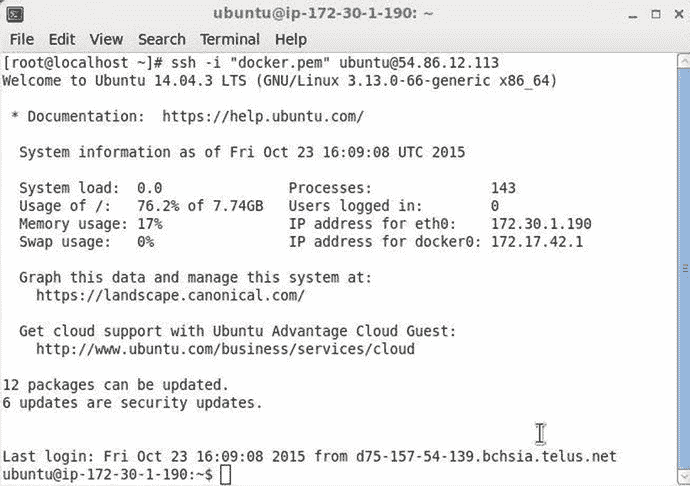

# 一、你好，Docker

Docker 是一个开发、打包和运行可移植分布式应用的开放标准平台。使用 Docker，开发人员和系统管理员可以在任何平台(如 PC、云、数据中心或虚拟机)上构建、发布和运行应用。在开发和运行应用时，获取软件应用所需的所有依赖项(包括代码、运行时库以及系统工具和库)通常是一项挑战。Docker 通过将应用所需的所有软件(包括依赖项)打包到一个称为 Docker 镜像的软件单元中，简化了应用的开发和执行，该镜像可以在任何平台和环境上运行。

Docker 映像与虚拟设备(也是软件映像(虚拟机映像))的不同之处在于，虽然每个虚拟机映像运行在单独的客户操作系统上，但 Docker 映像运行在同一个操作系统内核中。Docker 软件运行在一个被称为 Docker 容器的隔离环境中，它包含自己的文件系统和环境变量。Docker 容器相互隔离，并与底层操作系统隔离。

软件应用的 Docker 容器包括运行软件所需的所有内容，并且如果需要，文件可以从主机 OS 复制到 Docker 容器。由于应用可能需要其他软件来开发链接的应用，所以 Docker 容器可以被链接，这使得来自另一个 Docker 容器的环境变量和软件对 Docker 容器可用。

Docker 利用 docker 文件来构建映像。Dockerfile 由所有指令组成，例如下载什么软件、运行什么命令、暴露哪些网络端口、将哪些文件和目录添加到文件系统以及设置哪些环境变量。通过提供入口点，可以使停靠映像成为可执行的。可以通过提供 Docker 文件来构建 Docker 映像，或者可以从 Docker Hub ( [`https://hub.docker.com/`](https://hub.docker.com/) )下载预构建的 Docker 映像。Dockerfile 支持的完整指令集可以在[`docs.docker.com/engine/reference/builder/`](http://docs.docker.com/engine/reference/builder/)找到。

在这一章中，我们将在 Linux 上安装 Docker 引擎，下载 Hello World Docker 镜像，并为 Hello World 应用运行 Docker 容器。我们使用 Linux 是因为我们使用的其他一些软件，比如 Apache Hadoop，只在 Linux 上受支持(包括开发和生产)。我们使用了两个常用的 Linux 发行版，Red Hat 7 和 Ubuntu 14，但是任何支持的安装( [`https://docs.docker.com/v1.8/installation/`](https://docs.docker.com/v1.8/installation/) )都可以使用。

*   设置环境
*   在 Red Hat 7 上安装 Docker
*   卸载 Docker
*   安装特定的 Docker 版本
*   在 Ubuntu 上安装坞站
*   启动 Docker 服务
*   查找 Docker 服务状态
*   运行 Docker Hello World 应用
*   下载 Docker 映像
*   在 Docker 容器中运行应用
*   列出正在运行的 Docker 容器
*   在命令行上访问应用输出
*   在浏览器中访问应用输出
*   停止 Docker 容器
*   移除 Docker 容器
*   移除 Docker 映像
*   停止 Docker 服务

## 设置环境

我们将使用基于 Linux 的 Amazon EC2 实例来部署 Docker 和 Docker 映像。Linux 需要支持 64 位软件。我们使用了两种不同的 64 位(必需的)Amazon 机器映像(AMIs):

Ubuntu Server 14.04 LTS (HVM), SSD Volume Type - ami-d05e75b8 64 bit   Red Hat Enterprise Linux version 7.1 (HVM), EBS General Purpose (SSD) Volume Type (ami-12663b7a) 64 bit  

一个基于 Ubuntu AMI 的 Amazon EC2 实例如图 1-1 所示。

图 1-1。

Amazon EC2 Instance Based on Ubuntu AMI

为了连接到 Amazon EC2 实例，使用公共 IP 地址。公共 IP 地址可以从 EC2 控制台获取，如图 1-2 所示。

图 1-2。

Obtaining the Public IP Address

使用 SSH 和公共 IP 地址连接到 Amazon EC2 Ubuntu 实例，使用下面的命令，其中`docker.pem`是私钥格式。pem)由亚马逊 EC2 生成。

`ssh -i "docker.pem" ubuntu@54.86.12.113`

Ubuntu 实例的连接如图 1-3 所示。

图 1-3。

Connecting to Ubuntu Instance on Amazon EC2 from Local Host

如果使用 Red Hat AMI，连接 Amazon EC2 实例的命令会略有不同。使用“ec2-user”用户代替用户“ubuntu”。例如，使用下面的命令连接到 Linux 实例，其中`docker.pem`是私钥格式(。pem)由亚马逊 EC2 生成。

`ssh -i "docker.pem"` `ec2-user@54.175.182.96`

RHEL 7.1 实例的连接如图 1-4 所示。

图 1-4。

Connecting to RHEL Instance

运行以下命令，查看 Linux 体系结构是否支持 64 位软件。

`uname -r`

图 1-5 输出中的 x86_64 表示支持 64 位。

图 1-5。

Finding Architecture Support

## 在 Red Hat 7 上安装 Docker

在 Red Hat 上安装 Docker 有两种不同的方法:用 yum 安装或用脚本安装。使用 yum 安装需要用户添加 yum repo，这可能比脚本选项更复杂。我们已经使用了 Docker 安装脚本来安装 Docker。

作为拥有`sudo`或 root 权限的用户，使用以下命令更新本地存储库包。

`sudo yum update`

运行 Docker 安装脚本来安装 Docker 引擎。

`curl -sSL`[`https://get.docker.com/`](https://get.docker.com/)

对接发动机安装如图 1-6 所示。

图 1-6。

Installing Docker Engine

在启动 Docker 服务之前，应该修改`docker.service`文件来禁用 Docker 启动超时。`docker.service`文件在`/usr/lib/systemd/system`目录中，该目录设置了权限。运行 sudo 命令或将文件复制到没有权限集的目录中。例如，用下面的命令将`docker.service`复制到`root`目录。

`cp /usr/lib/systemd/system/docker.service .`

在 vi 编辑器中打开`docker.service`文件。

`vi docker.service`

或者以 sudo 的身份打开`docker.service`文件。

`sudo vi /usr/lib/systemd/system/docker.service`

在`[Service]`标题的`docker.service`中添加以下一行。

`TimeoutStartSec=0`

更新后的`docker.service`如图 1-7 所示。

图 1-7。

Updated docker.service

如果`docker.service`被复制到另一个目录，用下面的命令将文件复制回`/usr/lib/systemd/system`目录。

`sudo cp docker.service  /usr/lib/systemd/system/docker.service`

刷新更改以加载新配置。

`sudo systemctl daemon-reload`

在红帽上安装 Docker 的所有选项都在[`docs . Docker . com/engine/installation/rhel/`](http://docs.docker.com/engine/installation/rhel/)讨论。

## 卸载 Docker

如果在本章和后面的章节中要用到 Docker，可以跳过这一节。要卸载 Docker，请运行以下命令来列出已安装的 Docker 引擎。

`yum list installed | grep docker`

使用以下命令删除 Docker 引擎和 Docker 目录。

`sudo yum -y remove docker-engine.x86_64`

`rm -rf /var/lib/docker`

## 安装特定的 Docker 版本

要安装 Docker 的特定版本，请下载并安装该版本的 rpm。比如安装 Docker 1.7.0 如下。

`curl -O -sSL`[`https://get.docker.com/rpm/1.7.0/centos-6/RPMS/x86_64/docker-engine-1.7.0-1.el6.x86_64.rpm`](https://get.docker.com/rpm/1.7.0/centos-6/RPMS/x86_64/docker-engine-1.7.0-1.el6.x86_64.rpm)

`sudo yum localinstall --nogpgcheck docker-engine-1.7.0-1.el6.x86_64.rpm`

## 在 Ubuntu 上安装坞站

以下版本的 Ubuntu 支持 docker:Ubuntu Wily 15.10、Ubuntu Vivid 15.04、Ubuntu Trusty 14.04 (LTS)和 Ubuntu Precise 12.04 (LTS)。无论版本如何，Docker 都需要 64 位操作系统，最低 Linux 内核版本为 3.10。要找到内核版本，请在 Ubuntu 终端中运行以下命令。

`uname –r`

内核版本输出为 3.13，如图 1-8 ，安装 Docker 没问题。

图 1-8。

Outputting Kernel Version

在 Ubuntu 上安装 Docker 引擎之前，从以下命令开始更新 apt 源代码。

`sudo apt-key adv --keyserver hkp://pgp.mit.edu:80 --recv-keys 58118E89F3A912897C070ADBF76221572C52609D`

在“更新你的 apt 源”( [`http://docs.docker.com/engine/installation/ubuntulinux/`](http://docs.docker.com/engine/installation/ubuntulinux/) )第六节。需要你基于 Ubuntu 版本更新`/etc/apt/sources.list.d/docker.list`。使用以下命令可以找到 Ubuntu 发行版。

`lsb_release –a`

对于 Ubuntu Trusty，下面一行被添加到`/etc/apt/sources.list.d/docker.list`文件中。

`deb`[`https://apt.dockerproject.org/repo`](https://apt.dockerproject.org/repo)

更新`/etc/apt/sources.list.d/docker.list`文件后运行以下命令。

`sudo apt-get update`

`sudo  apt-get purge lxc-docker*`

`sudo  apt-cache policy docker-engine`

使用以下命令安装 Ubuntu 的先决条件。

`sudo apt-get update`

`sudo apt-get install linux-image-generic-lts-trusty`

重启系统。

`sudo reboot`

主机系统重新启动后，使用以下命令安装 Docker。

`sudo apt-get update`

`sudo apt-get install docker-engine`

## 启动 Docker 服务

不管 Linux 发行版是什么，用下面的命令启动 Docker 服务。

`sudo service docker start`

Docker 通过 systemctl 启动，如图 1-9 中 OK 消息所示。

图 1-9。

Starting Docker Service

## 查找 Docker 服务状态

要验证 Docker 服务的状态，请运行以下命令。

`sudo service docker status`

如果 Docker 服务正在运行，则应输出如图 1-10 所示的消息 Active: active (running)。

图 1-10。

Finding Docker Service Status

## 运行 Docker Hello World 应用

要测试 Docker，使用下面的`docker run`命令运行 Hello World 应用。

`sudo docker run hello-world`

`docker run`命令将在后面的章节中介绍。如果`hello-world`应用运行良好，应该会生成图 1-11 中的输出，该输出是在 Red Hat 7 上生成的。

图 1-11。

Running hello-world Application

在 Ubuntu 上，对`hello-world`运行相同的命令。

`sudo docker run hello-world`

如图 1-12 所示，输出“你好，来自 Docker”消息。

图 1-12。

Running hello-world on Ubuntu

## 下载 Docker 映像

当我们使用`docker run`命令运行`hello-world`应用时，Docker 映像`hello-world`被下载，用于`HelloWorld`应用的 Docker 容器启动。当用于 Docker 映像的 Docker 容器启动时，可以自动下载 Docker 映像，或者可以单独下载 Docker 映像。`docker pull`命令用于下载 Docker 镜像。例如，运行以下命令下载 Docker 映像`tutum/hello-world`，这是打包成 Docker 映像的另一个`HelloWorld`应用。

`sudo docker pull tutum/hello-world`

Docker 映像是预先构建的，不需要构建。Docker 图片`tutum/hello-world:latest`被下载，如图 1-13 所示。后缀`:latest`是 Docker 映像的标签，指定了映像版本，默认情况下会下载最新版本。

图 1-13。

Downloading tutum:hello-world:latest

使用以下命令列出下载的 Docker 映像。

`sudo docker images`

除了之前可能已经安装的其他映像之外，`tutum/hello-world` Docker 映像被列出，如图 1-14 所示。

图 1-14。

Listing Docker Images

## 在 Docker 容器中运行应用

`docker run`命令用于在一个单独的容器中运行一个进程，这是应用的另一个术语。`docker run`命令的语法如下。

`docker run [OPTIONS] IMAGE[:TAG|@DIGEST] [COMMAND] [ARG...]`

唯一需要的命令参数是 Docker 映像。Docker 容器可以在分离模式(或后台)或前台模式下启动。在分离模式下，进程的 stdin、stdout 和 stderr 流与运行`docker run`命令的命令行分离。要在分离模式下启动容器，设置`–d=true`或仅设置`–d`。默认模式是前台模式，在这种模式下，容器在前台启动，stdin、stdout 和 stderr 流连接到主机命令行控制台。`–name`选项可用于指定 Docker 容器的名称。`–p`选项用于为容器中运行的进程指定一个端口。例如，使用`–d`参数在分离模式下为`tutum/hello-world`映像启动一个 Docker 容器，使用`–p`参数将容器名设为`helloapp`，将应用运行的端口设为 80。

`sudo docker run -d -p 80 --name helloapp tutum/hello-world`

Docker 容器启动，如图 1-15 所示。

图 1-15。

Running an Application in a Docker Container

可以启动交互式外壳或终端(tty)来运行应用于在容器中运行的进程的命令。交互终端启动时，`–i`和`–t`命令参数一起使用或组合为`–it`。关于`docker run`命令的完整语法，参见 [`http://docs.docker.com/engine/reference/run/`](http://docs.docker.com/engine/reference/run/) 。

## 列出正在运行的 Docker 容器

要列出正在运行的 Docker 容器，请运行以下命令。

`sudo docker ps`

`helloapp`容器被列出，如图 1-16 所示。容器 id 也被分配给容器。在所有 docker 命令中，如`docker stop`、`docker start`，可以使用容器名或容器 id。

图 1-16。

Listing only the Docker Containers that are Running

在 PORTS 列中，分配给容器中端口 80 上运行的进程的外部端口被列为 32768。当从容器外部访问`helloapp`应用时，必须使用 32768 端口(不是端口 80)。也可以使用`docker port`命令列出外部端口。

`sudo docker port 82171f7ade46`

端口 32768 被列出，如图 1-17 所示。0.0.0.0 主机 IP 地址意味着本地机器上的所有 IP 地址。

图 1-17。

Listing Port

要列出所有正在运行或已退出的 Docker 容器，请运行以下命令。

`sudo docker ps –a`

## 在命令行上访问应用输出

curl 工具可用于连接运行`helloapp`的主机和端口。运行以下命令来访问外部端口 32768 上的应用。

`curl` `http://localhost:32768`

`helloapp`生成的 HTML 在主机中得到输出，如图 1-18 所示。

图 1-18。

Output from helloapp Application

## 在浏览器中访问应用输出

然而，使用 curl 工具访问生成 HTML 输出的应用并不总是最好的方法。在本节中，我们将在浏览器中访问`helloapp`。如果浏览器与运行 Docker 容器的主机在同一台机器上，url `http://localhost:32768`可以用来显示应用输出。但是如果浏览器在不同的主机上，就像本章中的例子一样，Amazon EC2 实例的公共 DNS 必须用来访问应用。公共 DNS 可以从亚马逊 EC2 控制台获得，如图 1-19 所示。

图 1-19。

Finding Public DNS

使用公共 DNS，通过 URL [`http://ec2-54-86-12-113.compute-1.amazonaws.com:32768/`](http://ec2-54-86-12-113.compute-1.amazonaws.com:32768/) 在远程浏览器中访问`helloapp`，该浏览器可以运行在 Windows 操作系统上。Docker 容器`helloapp`中运行的应用生成的输出显示在浏览器中，如图 1-20 所示。

图 1-20。

Displaying Output from helloapp in a Browser

## 停止 Docker 容器

Docker 容器可以用`docker stop`命令停止。例如，用下面的命令停止`helloapp`容器。

`sudo docker stop helloapp`

Docker 容器被停止。随后运行`docker ps`命令列出正在运行的容器。如图 1-21 所示`helloapp`容器未列出。

图 1-21。

Stopping a Container

## 移除 Docker 容器

Docker 容器可通过`docker rm`命令移除。例如，用下面的命令删除`helloapp`容器。

`sudo docker rm helloapp`

在移除容器之前，必须停止 Docker 容器。

## 移除 Docker 映像

要删除 Docker 映像，请运行 docker rmi 命令。例如，运行以下命令删除 Docker 映像 tutum/hello-world。

`sudo docker rmi tutum/hello-world`

在删除 Docker 映像之前，必须停止并删除所有访问 Docker 映像的容器。有时，一些未完全下载的 Docker 映像可以用`docker images`命令列出。此类 Docker 映像没有指定名称，而是被列为`<>`。所有这样的悬挂映像都可以用下面的命令删除。

`sudo docker rmi $(sudo docker images -f "dangling=true" -q)`

如图 1-22 中的输出所示，多个 Docker 映像被移除。

图 1-22。

Removing Dangling Docker Images

## 停止 Docker 服务

要停止 Docker 服务，请运行以下命令。

`sudo service docker stop`

可以使用以下命令再次启动 Docker 服务。

`sudo service docker start`

或者，可以使用以下命令重新启动正在运行的 Docker 服务。

`sudo service docker restart`

## 摘要

在本章中，我们介绍了 Docker 引擎。我们在两个 Linux 发行版上安装了 Docker:Red Hat 7 和 Ubuntu，但 Docker 也可能安装在其他 Linux 发行版上。对于支持的 Docker 安装操作系统，请参考[`docs.docker.com/v1.8/installation/`](http://docs.docker.com/v1.8/installation/)。我们讨论了下载 Docker 映像、使用 Docker 映像运行 Docker 容器、从远程浏览器访问 Docker 容器应用，以及停止和删除 Docker 容器和 Docker 映像。在下一章，我们将在 Docker 容器中运行 Linux。