# 四、使用 MySQL 数据库

MySQL 是最常用的开源关系数据库。MySQL 在某些方面类似于 Oracle 数据库，例如数据库将用户保存在授权表中。但是 MySQL 在某些方面也不同于 Oracle 数据库:

MySQL does not have roles and privileges have to be granted individually to users.   Database and table names are case-insensitive in Oracle but are case sensitive if the underlying OS is case-sensitive.   MySQL provides a default value for columns that do not allow a NULL value and a value is not provided explicitly in the `INSERT` statement, if the strict mode is not enabled. Oracle database does not generate a default value for columns with the NOT NULL constraint.   MySQL database supports `AUTO_INCREMENT` for a column while a Sequence is used in Oracle Database.   Some of the data types in MySQL are different. For example, MySQL does not support the `VARCHAR2` data type.  

在本章中，我们将在 Docker 容器中运行 MySQL 数据库。本章包括以下几节。

*   设置环境
*   启动 MySQL CLI Shell
*   设置要使用的数据库
*   创建数据库表
*   添加表格数据
*   查询表
*   列出数据库和表格
*   离开 TTY 终点站
*   启动另一个 MySQL 服务器实例
*   列出 Docker 容器日志

## 设置环境

本章需要以下软件。

*   -Docker 引擎(使用 1.8 版)
*   MySQL 数据库的 Docker 映像

使用 Amazon EC2 实例的公共 IP 地址登录到该实例。

`ssh -i "docker.pem" ec2-user@52.91.169.69`

启动 Docker 服务。

`sudo service docker start`

验证 Docker 服务正在运行。

`sudo service docker status`

如图 [4-1](#Fig1) 所示，来自`docker start`命令的输出应该正常，并且来自`docker status`命令的输出对于活动字段应该是活动的(运行中)。

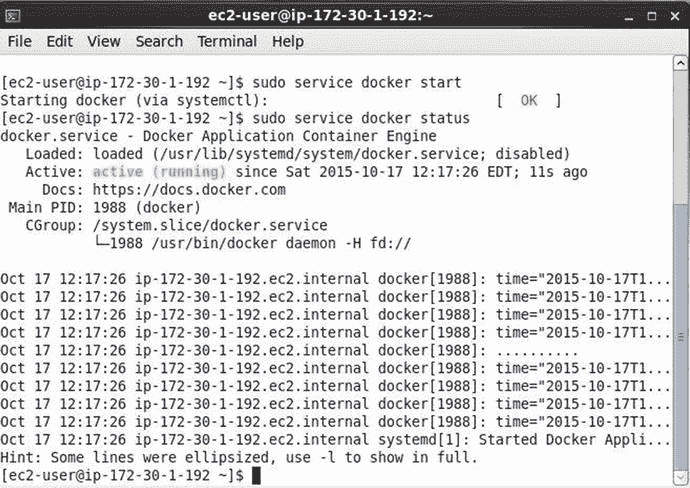

图 4-1。

Starting Docker Service and verifying Status

Docker Hub 提供了一个官方的 Docker 映像。使用以下命令下载 Docker 映像。

`sudo docker pull mysql`

最新的 Docker 映像`mysql:latest`被下载，如图 [4-2](#Fig2) 所示。

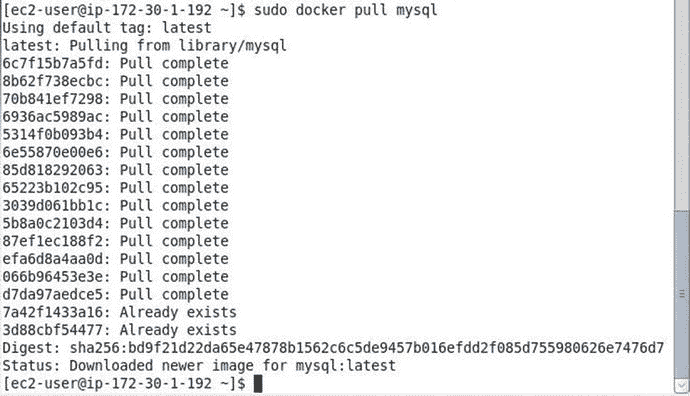

图 4-2。

Downloading Docker Image for MySQL Database

使用以下命令列出 Docker 映像。

`sudo docker images`

`mysql`映像被列出，如图 [4-3](#Fig3) 所示。

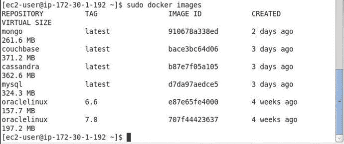

图 4-3。

Listing Docker Image for MySQL Database

## 启动 MySQL 服务器

在这一节中，我们将在 Docker 容器中运行 MySQL 数据库。MySQL 数据库默认使用`/var/lib/mysql`目录存储数据，但是也可以使用另一个目录。我们将使用`/mysql/data`目录来存储 MySQL 数据。创建`/mysql/data`目录，并将其权限设置为全局(777)。

`sudo mkdir -p /mysql/data`

`sudo chmod -R 777 /mysql/data`

`/mysql/data`目录被创建，如图 [4-4](#Fig4) 所示。

图 4-4。

Creating the Data Directory

当运行`docker run`命令在 Docker 容器中启动 MySQL 时，可能会指定某些环境变量，如下表所述。

<colgroup><col> <col> <col></colgroup> 
| 环境变量 | 描述 | 需要 |
| --- | --- | --- |
| MYSQL _ ROOT _ 密码 | “root”用户的密码。 | 是 |
| MYSQL _ 数据库 | 创建数据库 | 不 |
| MYSQL _ 用户，MYSQL _ 密码 | 指定用户名和密码以创建新用户。用户被授予对 MYSQL_DATABASE 变量中指定的数据库的超级用户权限。如果设置了用户名和密码，则必须同时设置这两者。 | 不 |
| MYSQL _ ALLOW _ EMPTY _ 密码 | 指定是否允许“root”用户拥有空密码。 | 不 |

除了`MYSQL_ROOT_PASSWORD`环境变量，所有其他变量都是可选的，但是我们将使用所有环境变量运行一个 MySQL 实例容器。我们将使用以下命令参数运行`docker run`命令。

<colgroup><col> <col></colgroup> 
| 命令参数 | 价值 |
| --- | --- |
| MYSQL _ ROOT _ 密码 | '' |
| MYSQL _ 数据库 | mysqldb |
| MYSQL _ 用户，MYSQL _ 密码 | mysql，mysql |
| MYSQL _ ALLOW _ EMPTY _ 密码 | 是 |
| -v | /mysql/data:/var/lib/mysql |
| 名字 | mysqldb |
| -d |   |

环境变量用`–e`指定。运行下面的`docker run`命令在 Docker 容器中启动一个 MySQL 实例。

`sudo docker run -v /mysql/data:/var/lib/mysql --name mysqldb -e MYSQL_DATABASE='mysqldb' -e MYSQL_USER='mysql' -e MYSQL_PASSWORD='mysql' -e MYSQL_ALLOW_EMPTY_PASSWORD='yes' -e MYSQL_ROOT_PASSWORD='' -d mysql`

`docker run`命令的输出如图 [4-5](#Fig5) 所示。

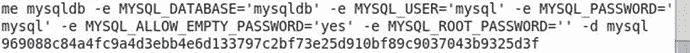

图 4-5。

Running MySQL Database in a Docker Container

运行以下命令，列出正在运行的 Docker 容器。

`sudo docker ps`

运行 MySQL 数据库实例的 Docker 容器`mysqldb`如图 [4-6](#Fig6) 所示。

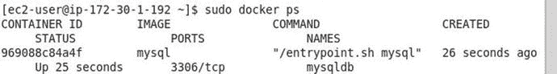

图 4-6。

Listing Docker Containers

## 启动 MySQL CLI Shell

接下来，我们将登录 MySQL CLI shell。但是首先我们需要启动一个交互式终端来运行`mysql`命令来启动 MySQL CLI。使用以下命令启动交互式终端或 shell。

`sudo docker exec -it mysqldb bash`

在交互式终端中运行以下命令。

`mysql`

MySQL CLI 启动，如图 [4-7](#Fig7) 所示。

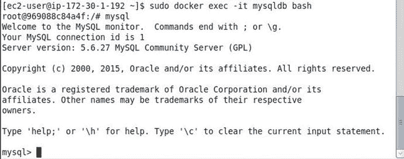

图 4-7。

Starting MySQL CLI

也可以使用容器 id 而不是容器名称来启动交互式终端。

`sudo docker exec -it 969088c84a4f bash`

## 设置要使用的数据库

使用“use”命令设置数据库。默认情况下，Docker 容器中启动的 MySQL 数据库不提供“测试”数据库。如果运行“use test”命令，将输出以下错误消息。

`mysql> use test`

`ERROR 1049 (42000): Unknown database 'test'`

当我们用`docker run`命令启动 MySQL 数据库的 Docker 容器时，我们创建了一个名为“mysqldb”的数据库。使用以下命令将数据库设置为“mysqldb”。

`mysql> use mysqldb`

前面命令的输出如下。数据库被设置为“mysqldb”，如图 [4-8](#Fig8) 所示。

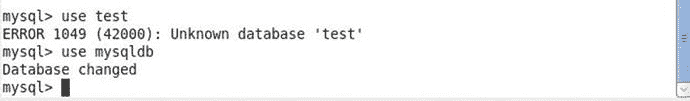

图 4-8。

Setting Database to mysqldb

## 创建数据库表

接下来，创建一个名为“Catalog”的数据库表，其中包含列 CatalogId、Journal、Publisher、Edition、Title 和 Author。运行以下 SQL 语句。

`mysql> CREATE TABLE Catalog(CatalogId INTEGER PRIMARY KEY,Journal VARCHAR(25),Publisher VARCHAR(25),Edition VARCHAR(25),Title VARCHAR(45),Author VARCHAR(25));`

`Catalog`表被创建，如图 [4-9](#Fig9) 所示。

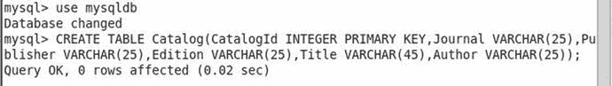

图 4-9。

Creating a MySQL Database Table

## 添加表格数据

使用以下 INSERT 语句将数据添加到目录表中。

`mysql> INSERT INTO Catalog VALUES('1','Oracle Magazine','Oracle Publishing','November December 2013','Engineering as a Service','David A. Kelly');`

一行数据被添加到目录表中，如图 [4-10](#Fig10) 所示。

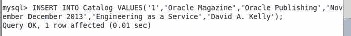

图 4-10。

Adding a Row of Data to MySQL Table

## 查询表

接下来，用 SQL 查询查询目录表。以下 SELECT 语句选择目录表中的所有数据。

`mysql> SELECT * FROM Catalog;`

添加的一行数据被列出，如图 [4-11](#Fig11) 所示。

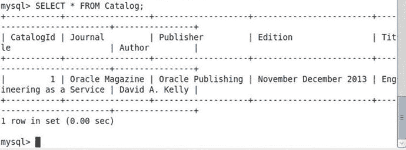

图 4-11。

Running a SQL Query

在本章使用的操作系统(RHEL 7.1 操作系统)上，MySQL 表名区分大小写。如果使用了表名`Catalog`的变体，就会产生错误。例如，在 SQL 查询中使用表名`CATALOG`，会产生如图 [4-12](#Fig12) 所示的错误。

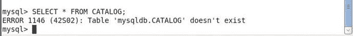

图 4-12。

The table name is Case-sensitive in MySQL

## 列出数据库和表格

可以在 MySQL CLI 中使用以下命令列出 MySQL 服务器实例中的数据库。

`mysql> show databases;`

数据库被列出，包括新创建的数据库“mysqldb”，如图 [4-13](#Fig13) 所示。

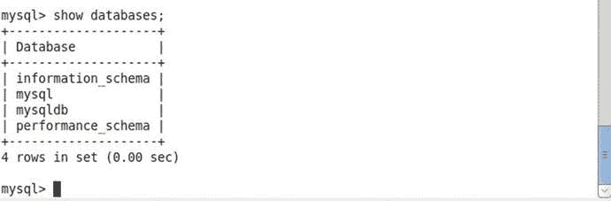

图 4-13。

Listing MySQL Databases

## 离开 TTY 终点站

使用“Exit”命令退出 MySQL CLI。

`mysql> exit`

`Bye`

使用“Exit”命令退出交互式 shell 或 tty。

`root@969088c84a4f:/# exit`

`exit`

前面命令的输出如图 [4-14](#Fig14) 所示。

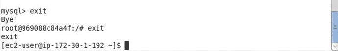

图 4-14。

Exiting MySQL CLI

## 停止 Docker 容器

用`docker` `stop`命令停止 Docker 容器。

`[ec2-user@ip-172-30-1-192 ∼]$ sudo docker stop 969088c84a4f`

`969088c84a4f`

随后，用`docker ps`命令列出正在运行的 Docker 容器。`mysqldb`容器没有被列出。

`sudo docker ps`

`[ec2-user@ip-172-30-1-192 ∼]$ sudo docker ps`

`CONTAINER ID      IMAGE      COMMAND      CREATED      STATUS      PORTS      NAMES`

在下一节中，我们将创建另一个 MySQL 服务器实例，就像我们在本章前面创建 MySQL 服务器实例一样。但是我们不能使用与现有容器相同的容器名。如果 Docker 容器名称不同，则可以启动运行 MySQL 数据库或任何其他软件的另一个 Docker 容器。如果我们创建一个 Docker 容器来运行另一个名为“mysqldb”的 MySQL 服务器，就会产生一个错误。例如，运行下面的`docker run`命令创建另一个名为“mysqldb”的容器。

`sudo docker run --name mysqldb -e MYSQL_ROOT_PASSWORD=mysql -d mysql`

下面的错误会得到输出。

`Error response from daemon: Conflict. The name "mysqldb" is already in use by container 969088c84a4f. You have to delete (or rename) that container to be able to reuse that name.`

要创建一个名为“mysqldb”的新 Docker 容器，首先删除已经用`docker rm`命令创建的“mysqldb”容器。容器 id 或容器名称可用于容器的 docker 命令，如`stop`、`start`和`rm`。

`sudo docker rm 969088c84a4f`

## 启动另一个 MySQL 服务器实例

删除“mysqldb”容器后，用`docker run`命令再次创建容器。我们将以不同的方式创建新的“mysqldb”容器。为第二次运行`docker run`命令指定不同的环境变量。仅指定所需的环境变量`MYSQL_ROOT_PASSWORD`，并将其值设置为“mysql”。

`sudo docker run --name mysqldb -e MYSQL_ROOT_PASSWORD=mysql -d mysql`

随后，使用以下命令启动交互式 shell。

`sudo docker exec -it 113458c31ce5 bash`

在交互式 shell 中使用以下命令登录 MySQL CLI。

`mysql –u root –p mysql`

指定“root”用户的密码，即`mysql`。MySQL CLI 启动如图 [4-15](#Fig15) 所示。

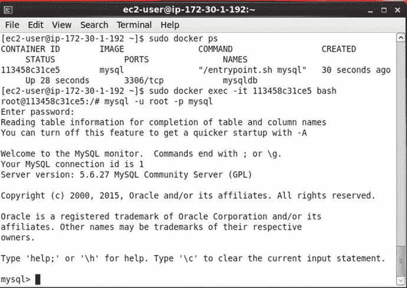

图 4-15。

Using a Password to Start MySQL CLI

也可以发出如下的`mysql`命令。

`mysql –u root –p`

指定“mysql”用户的密码。MySQL CLI 启动如图 [4-16](#Fig16) 所示。

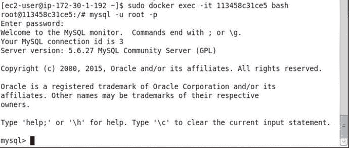

图 4-16。

Alternative mysql Login command

下面的`mysql`命令不会启动 MySQL CLI。

`root@113458c31ce5:/# mysql -u root`

将生成以下错误。

`ERROR 1045 (28000): Access denied for user 'root'@'localhost' (using password: NO)`

用`show databases`命令列出数据库。默认数据库包括“mysql”数据库，如图 [4-17](#Fig17) 所示。之前,“mysqldb”数据库也与`show databases`命令一起列出，因为“mysqldb”数据库是在运行`docker run`命令时创建的。

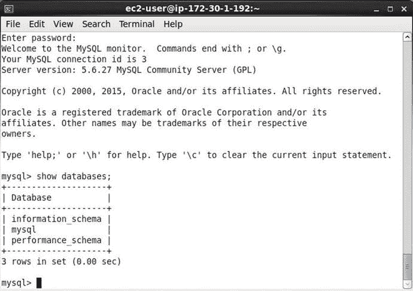

图 4-17。

Listing the Default Databases

使用“使用 mysql”命令将数据库设置为“mysql”数据库，如图 [4-18](#Fig18) 所示。

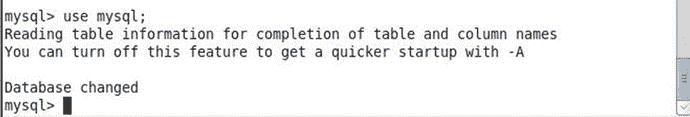

图 4-18。

Using the mysql Database

用`show tables`命令列出`mysql`数据库中的数据库表，如图 [4-19](#Fig19) 所示。

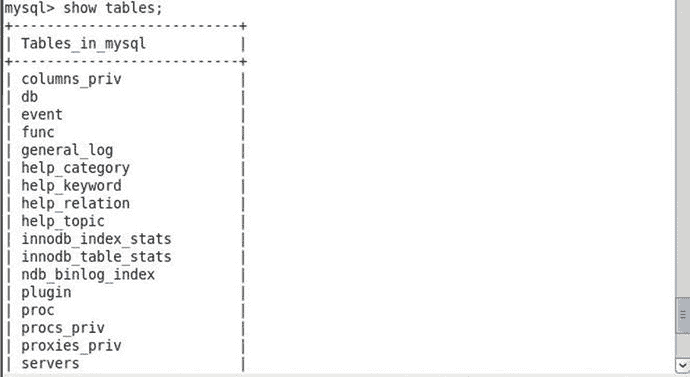

图 4-19。

Listing Tables

## 列出 Docker 容器日志

接下来，用`docker` `logs`命令列出`mysqldb`容器的日志。

`sudo docker logs -f mysqldb`

`mysqldb`容器的日志列表如图 [4-20](#Fig20) 所示。

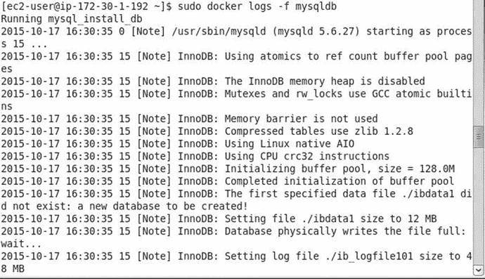

图 4-20。

Listing Docker Container Log

## 摘要

在这一章中，我们使用 Docker 镜像在 Docker 容器中运行 MySQL 服务器。我们运行了两种不同的`docker run`命令；一个包括所有可能为“mysql”映像设置的环境变量，另一个只包括必需的环境变量。在下一章中，我们将讨论在 Docker 上运行 MongoDB。