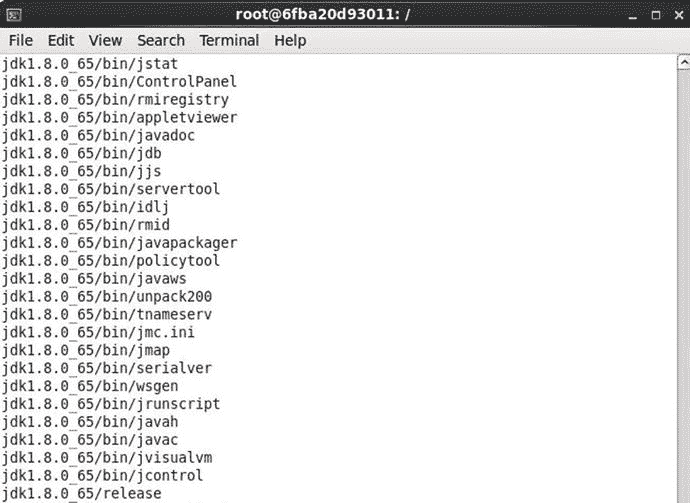
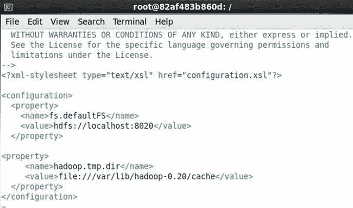

# 十一、使用 Apache Sqoop

Apache Sqoop 是一个 Hadoop 生态系统框架，用于将批量数据从关系数据库(RDBMS)传输到 Hadoop 分布式文件系统(HDFS)、Apache HBase 和 Apache Hive。Sqoop 还支持从 HDFS 到 RDBMS 的批量数据传输。Sqoop 支持的直接数据传输路径如图 11-1 所示。Sqoop 支持 HSQLDB(版本 1.8.0 以上)、MySQL(版本 5.0 以上)、Oracle(版本 10.2.0)和 PostgreSQL(版本 8.3 以上)，也可以用于其他关系数据库，如 IBM DB2 数据库和版本。Sqoop 使用 JDBC 进行数据传输，并且要求安装 Java，JDBC 驱动程序 jar 位于运行时类路径中。

图 11-1。

Direct Transfer Paths supported by Sqoop

在本章中，我们将使用 Apache Sqoop 从 MySQL 数据库导入数据到 HDFS。我们还将从 HDFS 导出数据回 MySQL 数据库表。

*   设置环境
*   启动 Docker 容器
*   启动交互式终端
*   创建 MySQL 表
*   将 MySQL JDBC Jar 添加到 Sqoop 类路径
*   配置 Apache Hadoop
*   用 Sqoop 将 MySQL 表数据导入 HDFS
*   导入 HDFS 的列表数据
*   用 Sqoop 从 HDFS 导出到 MySQL
*   查询导出的数据
*   停止和移除 Docker 容器

## 设置环境

本章需要以下软件。

*   -Docker 引擎(版本 1.8)
*   MySQL 数据库的 Docker 映像
*   cdh 的坞站映像

SSH 连接到 Amazon EC2 实例。

`ssh -i "docker.pem"` `ec2-user@54.175.13.99`

如果尚未安装 Docker，则按照第一章所述安装 Docker。启动 Docker 服务，并验证 Docker 是否已经启动。

`sudo service docker start`

`sudo service docker status`

从[下载`jdk-8u65-linux-x64.gz`。甲骨文。com/tech network/Java/javase/downloads/JDK 8-downloads-2133151。html](http://www.oracle.com/technetwork/java/javase/downloads/jdk8-downloads-2133151.html) 。由于 JDK 下载需要 BSD 许可才能被接受，使用`wget`或类似软件下载文件会使下载命令成为非标准命令。使用浏览器下载`jdk-8u65-linux-x64.gz`,并使用如下的`scp`命令复制到 EC2 实例。

`scp -i "docker.pem" /jdk-8u65-linux-x64.gz ec2-user@54.175.13.99:/`

我们需要为本章下载两个 Docker 映像，因为 CDH 的 Docker 映像包括 Apache Sqoop，但不包括 MySQL Server。使用 docker pull 命令下载`mysql` Docker 映像。

`sudo docker pull mysql`

下载 svds/cdh 坞站映像。

`sudo docker pull svds/cdh`

用`docker images`命令列出 Docker 映像。

`sudo docker images`

`mysql`和`svds/cdh` Docker 映像都应该被列出，如图 11-2 所示。

图 11-2。

Listing Docker Images Required for Apache Sqoop with MySQL Database

## 启动 Docker 容器

mysql 和 svds/cdh Docker 映像已经在前面的章节中分别讨论过，并用于启动 Docker 容器。但是，使用两个 Docker 映像略有不同，需要链接两个 Docker 容器。在本节中，我们将启动两个独立的 Docker 容器:`cdh`用于`cdh` Docker 映像，而`mysqldb`用于`mysql` Docker 映像。对于`mysqldb`容器，为 MySQL 存储的数据创建一个目录，并将其权限设置为 global (777)。

`sudo mkdir -p /mysql/data`

`sudo chmod -R 777 /mysql/data`

前面的命令将在连接到 Amazon EC2 实例时运行，如图 11-3 所示。

图 11-3。

Creating Directory for MySQL Data

下表讨论了`docker run`命令中使用的环境变量，表 11-1 。

表 11-1。

Environment Variables for a Docker container based on mysql Docker Image

<colgroup><col> <col> <col></colgroup> 
| 环境变量 | 描述 | 价值 |
| --- | --- | --- |
| MYSQL _ 数据库 | 要创建的 MySQL 数据库实例。 | mysqldb |
| MYSQL_USER | 创建的数据库的用户名。 | 关系型数据库 |
| MYSQL_PASSWORD | 创建的数据库的密码。 | 关系型数据库 |
| MYSQL _ ALLOW _ EMPTY _ 密码 | 是否允许空密码。 | 不 |
| MYSQL _ ROOT _ 密码 | “root”用户的密码。 | 关系型数据库 |

运行下面的`docker run`命令来启动 MySQL 数据库的 Docker 容器。环境变量只在`docker run`命令中设置，而不在 bash shell 中设置。

`sudo docker run -v /mysql/data:/var/lib/mysql --name mysqldb -e MYSQL_DATABASE='mysqldb' -e MYSQL_USER='mysql' -e MYSQL_PASSWORD='mysql' -e MYSQL_ALLOW_EMPTY_PASSWORD='no' -e MYSQL_ROOT_PASSWORD='mysql' -d mysql`

运行下面的`docker run`命令来启动 svds/cdh 映像软件的 Docker 容器，它包括 Apache Sqoop，并使用`--link`命令参数将该容器与运行 MySQL 数据库的`mysqldb`容器链接起来。

`sudo docker run  -d --name cdh --link mysqldb svds/cdh`

列出正在运行的 Docker 容器。

`sudo docker ps`

前面命令的输出如图 11-4 所示。cdh 和 mysqldb 容器都被列为已启动。

图 11-4。

Starting Docker Containers for CDH and MySQL

## 启动交互式终端

启动 Docker 容器后，为每个 Docker 容器启动交互终端(tty)。使用以下命令启动 mysqldb 容器的交互式 shell。

`sudo docker exec -it mysqldb bash`

使用以下命令启动 cdh 容器的交互式 shell。

`sudo docker exec -it cdh bash`

## 创建 MySQL 表

在本节中，我们将登录 MySQL CLI 并创建一个数据库表，该表将通过 Apache Sqoop 导入 HDFS。运行以下命令登录 MySQL CLI。

`mysql –u mysql –p`

出现如图 11-5 所示的`mysql>`提示。

图 11-5。

Starting the MySQL CLI Shell

将数据库设置为“mysqldb”。

`use mysqldb`

使用`GRANT`选项将`mysqldb`数据库上的所有权限授予`mysql`用户。

`GRANT ALL PRIVILEGES ON mysqldb.* TO 'mysql'@'%' IDENTIFIED BY 'mysql' WITH GRANT OPTION;`

在`mysqldb`数据库上设置权限，如图 11-6 所示。

图 11-6。

Setting Privileges on mysqldb Database

接下来，创建一个名为`wlslog`的数据库表，其中包含列`time_stamp`、`category`、`type`、`servername`、`code`和`msg`。`PRIMARY KEY`栏需要包含在`sqoop import`工具中，以便将数据导入 HDFS。在 MySQL CLI 中运行以下 SQL 命令。

`CREATE TABLE wlslog(time_stamp VARCHAR(255) PRIMARY KEY,category VARCHAR(255),type VARCHAR(255),servername VARCHAR(255), code VARCHAR(255),msg VARCHAR(255));`

名为`wlslog`的数据库表被创建，如图 11-7 所示。

图 11-7。

Creating a MySQL Database Table

向`wlslog`表添加数据。运行下面的`INSERT` SQL 语句将数据添加到`wlslog`表中。

`INSERT INTO wlslog(time_stamp,category,type,servername,code,msg) VALUES('Apr-8-2014-7:06:16-PM-PDT','Notice','WebLogicServer','AdminServer','BEA-000365','Server state changed to STANDBY');`

`INSERT INTO wlslog(time_stamp,category,type,servername,code,msg) VALUES('Apr-8-2014-7:06:17-PM-PDT','Notice','WebLogicServer','AdminServer','BEA-000365','Server state changed to STARTING');`

`INSERT INTO wlslog(time_stamp,category,type,servername,code,msg) VALUES('Apr-8-2014-7:06:18-PM-PDT','Notice','WebLogicServer','AdminServer','BEA-000365','Server state changed to ADMIN');`

`INSERT INTO wlslog(time_stamp,category,type,servername,code,msg) VALUES('Apr-8-2014-7:06:19-PM-PDT','Notice','WebLogicServer','AdminServer','BEA-000365','Server state changed to RESUMING');`

`INSERT INTO wlslog(time_stamp,category,type,servername,code,msg) VALUES('Apr-8-2014-7:06:20-PM-PDT','Notice','WebLogicServer','AdminServer','BEA-000361','Started WebLogic AdminServer');`

`INSERT INTO wlslog(time_stamp,category,type,servername,code,msg) VALUES('Apr-8-2014-7:06:21-PM-PDT','Notice','WebLogicServer','AdminServer','BEA-000365','Server state changed to RUNNING');`

前面 SQL 语句的输出如图 11-8 所示。

图 11-8。

Running INSERT SQL Statements

运行以下 SQL 查询来列出添加的数据。

`SELECT * FROM wlslog;`

如图 11-9 所示，列出 6 行数据。

图 11-9。

Running a SQL Query

我们需要为`sqoop export`工具创建另一个数据库表，将数据从 HDFS 导出到 MySQL 数据库。因为`wlslog`表已经有数据，所以创建另一个名为`WLSLOG_COPY`的表，它与`wlslog`表有相同的表定义。在 MySQL CLI 中运行以下 SQL 脚本。

`CREATE TABLE WLSLOG_COPY(time_stamp VARCHAR(255) PRIMARY KEY,category VARCHAR(255),type VARCHAR(255),servername VARCHAR(255), code VARCHAR(255),msg VARCHAR(255));`

`WLSLOG_COPY`表被创建，如图 11-10 所示。

图 11-10。

Creating MySQL Table WLSLOG_COPY

## 将 MySQL JDBC Jar 添加到 Sqoop 类路径

我们需要将 MySQL JDBC jar 添加到 Apache Sqoop 类路径中。启动 cdh 容器的交互式终端(如果尚未启动)。

`sudo docker exec -it cdh bash`

在交互式 shell 中，下载 MySQL-connector-Java-5 . 1 . 37 . jar，并将 jar 复制到/usr/lib/sqoop/lib 目录。

`wget`[`http://central.maven.org/maven2/mysql/mysql-connector-java/5.1.37/mysql-connector-java-5.1.37.jar`T3】](http://central.maven.org/maven2/mysql/mysql-connector-java/5.1.37/mysql-connector-java-5.1.37.jar)

`cp mysql-connector-java-5.1.37.jar /usr/lib/sqoop/lib`

前面命令的输出如图 11-11 所示。

图 11-11。

Adding MySQL JDBC Jar to Sqoop Classpath

## 设置 JAVA_HOME 环境变量

为了运行 Apache Sqoop，我们需要设置`JAVA_HOME`环境变量。但是，首先我们需要将 jdk-8u65-linux-x64.gz 文件复制到运行包括 Apache Sqoop 在内的 CDH 框架的 Docker 容器中。我们之前下载了 jdk-8u65-linux-x64.gz。使用以下命令将 jdk-8u65-linux-x64.gz 文件复制到 Docker 容器，其中容器 id 从图 11-12 中的`docker ps`命令的输出中获得。

`sudo docker cp jdk-8u65-linux-x64.gz 49d774f8f1fe:/jdk-8u65-linux-x64.gz`

jdk-8u65-linux-x64.gz 文件被复制到 Docker 容器“cdh”中，如图 11-12 所示。

图 11-12。

Copying the JDK gz File to Docker Container

前面的命令将从 Amazon EC2 实例中运行。启动 cdh 容器的交互式 shell。

`sudo docker exec -it cdh bash`

使用以下命令列出 Docker 容器根目录中的文件。

`ls –l`

jdk-8u65-linux-x64.gz 文件被列出，如图 11-13 所示。

图 11-13。

Listing the files in Docker Container’s root Directory

提取 jdk-8u65-linux-x64.gz 文件。

`tar -xv jdk-8u65-linux-x64.gz`

那个。gz 文件被提取，如图 11-14 所示。

图 11-14。

Extracting the JDK .gz File

我们需要在`hadoop-env.sh`文件中设置`JAVA_HOME`环境变量。要找到`hadoop-env.sh`文件的目录，运行以下命令。

`find –name hadoop-env.sh`

包含`hadoop-env.sh`文件的不同目录被列出，如图 11-15 所示。

图 11-15。

Finding the hadoop-env.sh File

在 vi 编辑器中打开`./etc/hadoop/conf.psuedo/hadoop-env.sh`文件，并添加下面的`export`语句。

`export JAVA_HOME=./jdk1.8.0_65`

`hadoop-env.sh`文件中的前述语句如图 11-16 所示。用`:wq`命令保存文件。

图 11-16。

Setting the JAVA_HOME Environment Variable

## 配置 Apache Hadoop

Apache Hadoop MapReduce 框架可以在三种模式下启动:`local`、`classic`和`yarn`。在“本地”模式下，MapReduce 在 Java 进程中运行。在经典模式下，MapReduce 使用 MapReduce1 框架运行。在 yarn 模式下，MapReduce 使用 MapReduce2 框架(也称为 YARN)运行。要使用的 MapReduce 框架是在`mapred-site.xml`配置文件的`mapreduce.framework.name`设置中设置的，该文件与`hadoop-env.sh`、`./etc/hadoop/conf.psuedo`目录在同一个目录下。因为 yarn 和 classic 框架需要比本地更多的内存，所以将`mapreduce.framework.name`设置为本地。

`<property>`

`<name>mapreduce.framework.name</name>`

`<value>local</value>`

`</property>`

`mapreduce.framework.name`设置如图 11.17 所示。

图 11-17。

Setting the MapReduce Framework to local

同时在`hdfs-site.xml`配置文件中设置以下(表 11-2 )配置属性。

表 11-2。

Configuration Properties for hdfs-site.xml

<colgroup><col> <col> <col></colgroup> 
| 配置属性 | 描述 | 价值 |
| --- | --- | --- |
| dfs.permissions .超级用户组 | 设置超级用户组 | 大数据 |
| dfs . namenode . name . dir | 设置 NameNode 存储目录 | file:///data/1/dfs/nn |
| dfs.replication | 设置复制级别 | one |
| dfs .权限 | 是否要检查权限 | 错误的 |

下面列出了`hdfs-site.xml`配置设置。

`<configuration>`

`<property>`

`<name>dfs.permissions.superusergroup</name>`

`<value>hadoop</value>`

`</property>`

`<property>`

`<name>dfs.namenode.name.dir</name>`

`<value>file:///data/1/dfs/nn</value>`

`</property>`

`<property>`

`<name>dfs.replication</name>`

`<value>1</value>`

`</property>`

`<property>`

`<name>dfs.permissions</name>`

`<value>false</value>`

`</property>`

`</configuration>`

`hdfs-site.xml`配置文件如图 11-18 所示。

图 11-18。

The hdfs-site.xml Configuration File

我们需要在`dfs.namenode.name.dir`属性中创建 NameNode 存储目录集。创建`/data/1/dfs/nn`目录并将其权限设置为全局(777)。

`sudo mkdir -p /data/1/dfs/nn`

`sudo chmod -R 777 /data/1/dfs/nn`

创建用户组`hadoop`和用户`hadoop`。

`groupadd hadoop`

`useradd hadoop`

我们需要在`core-site.xml`文件中设置以下(表 11-3 )配置属性。

表 11-3。

Configuration Properties for core-site.xml

<colgroup><col> <col> <col></colgroup> 
| 配置属性 | 描述 | 价值 |
| --- | --- | --- |
| fs.defaultfs(默认设置) | URI 这个名字 | hdfs://localhost:8020 |
| hadoop.tmp.dir | Hadoop 临时目录 | file:///var/lib/Hadoop-0.20/cache |

列出了`core-site.xml`配置设置:

`<configuration>`

`<property>`

`<name>fs.defaultFS</name>`

`<value>hdfs://10.0.2.15:8020</value>`

`</property>`

`<property>`

`<name>hadoop.tmp.dir</name>`

`<value>file:///var/lib/hadoop-0.20/cache</value>`

`</property>`

`</configuration>`

`core-site.xml`文件如图 11-19 所示。用`:wq`保存文件。

图 11-19。

The core-site.xml Configuration File

在`hadoop.tmp.dir`目录中创建目录集，并将其权限设置为全局(777)。

`mkdir -p /var/lib/hadoop-0.20/cache`

`chmod -R 777  /var/lib/hadoop-0.20/cache`

我们还需要使用下面的命令将 HDFS 的`/`目录的权限设置为 global (777)。

`sudo -u hdfs hdfs dfs -chmod 777 /`

## 用 Sqoop 将 MySQL 表数据导入 HDFS

在本节中，我们将使用`sqoop import`命令将 MySQL 数据库表数据导入到 HDFS。通过从 cdh 容器的交互 shell 中运行`sqoop help`命令，可以列出 sqoop 工具支持的不同命令，如图 11-20 所示。`import`命令用于将一个表从关系数据库导入到 HDFS。

图 11-20。

Running the sqoop help Command

运行`sqoop import`命令需要生成访问关系数据库的代码。代码可以在运行`sqoop import`命令时直接生成，也可以在使用`sqoop codegen`命令运行`sqoop import`命令之前生成。运行下面的`sqoop codegen`命令来生成与数据库记录交互的代码。

`sudo -u hdfs sqoop codegen --connect "jdbc:mysql://e414f8c41d0b:3306/mysqldb"   --password "mysql" --username "mysql" --table "wlslog"`

`–u` hdfs 将用户指定为`hdfs`。命令参数在表 11-4 中讨论。

表 11-4。

Command Parameters for the hdfs Command

<colgroup><col> <col> <col></colgroup> 
| 参数 | 描述 | 价值 |
| --- | --- | --- |
| -连接 | 连接到 MySQL 数据库的连接 url。主机名是运行 MySQL 的容器 id。 | " JDBC:MySQL://e 414 F8 c41 d0s had:3306/mysqldb " |
| -密码 | 连接 MySQL 的密码。建议使用非 root 用户。 | " mysql " |
| -用户名 | 连接到 MySQL 的用户名。 | " mysql " |
| -桌子 | 要从中导入的 MySQL 表 | " wlslog " |

与数据库交互所需的代码在`wlslog.jar`文件中生成，如图 11-21 所示。

图 11-21。

Output from the codegen Command

接下来，以用户`hdfs`的身份运行`sqoop import`命令。用`–libjars`选项在类路径中添加`wlslog.jar`文件。

`sudo -u hdfs sqoop import -libjars /tmp/sqoop-hdfs/compile/6348ef9539c8ad2bee9ba1875a62c923/wlslog.jar  --connect "jdbc:mysql://e414f8c41d0b:3306/mysqldb"   --password "mysql" --username "mysql" --table "wlslog" --columns "time_stamp,category,type,servername,code,msg" --target-dir "/mysql/import" –verbose`

其他命令参数在表 11-5 中讨论。

表 11-5。

Command Parameters for sqoop import

<colgroup><col> <col> <col></colgroup> 
| 参数 | 描述 | 价值 |
| --- | --- | --- |
| -连接 | 连接到 MySQL 数据库的连接 url。主机名是运行 MySQL 的容器 id。 | " JDBC:MySQL://e 414 F8 c41 d0s had:3306/mysqldb " |
| -密码 | 连接 MySQL 的密码。建议使用非 root 用户。 | " mysql " |
| -用户名 | 连接到 MySQL 的用户名。 | " mysql " |
| -列 | 要导入的列 | 时间戳，类别，类型，服务器名，代码，消息 |
| -桌子 | 要从中导入的 MySQL 表 | " wlslog " |
| -目标方向 | 要导入的 HDFS 目录 | "/mysql/import " |

`sqoop import`命令的输出如图 11-22 所示。

图 11-22。

Output from sqoop import

`sqoop import`命令的详细输出如下:

`root@08b338cb2a90:/# sudo -u hdfs sqoop import -libjars /tmp/sqoop-hdfs/compile/6348ef9539c8ad2bee9ba1875a62c923/wlslog.jar  --connect "jdbc:mysql://e414f8c41d0b:3306/mysqldb"   --password "mysql" --username "mysql" --table "wlslog" --columns "time_stamp,category,type,servername,code,msg" --target-dir "/mysql/import" -verbose`

`15/10/22 00:07:07 INFO sqoop.Sqoop: Running Sqoop version: 1.4.5-cdh5.4.3`

`ConnManager`

`15/10/22 00:07:10 INFO tool.CodeGenTool: Beginning code generation`

`15/10/22 00:07:10 DEBUG manager.SqlManager: Execute getColumnInfoRawQuery : SELECT t.* FROM `wlslog` AS t LIMIT 1`

`15/10/22 00:07:10 DEBUG manager.SqlManager: No connection paramenters specified. Using regular API for making connection.`

`15/10/22 00:07:11 DEBUG manager.SqlManager: Using fetchSize for next query: -2147483648`

`15/10/22 00:07:11 INFO manager.SqlManager: Executing SQL statement: SELECT t.* FROM `wlslog` AS t LIMIT 1`

`15/10/22 00:07:11 DEBUG manager.SqlManager: Found column time_stamp of type [12, 255, 0]`

`15/10/22 00:07:11 DEBUG manager.SqlManager: Found column category of type [12, 255, 0]`

`15/10/22 00:07:11 DEBUG manager.SqlManager: Found column type of type [12, 255, 0]`

`15/10/22 00:07:11 DEBUG manager.SqlManager: Found column servername of type [12, 255, 0]`

`15/10/22 00:07:11 DEBUG manager.SqlManager: Found column code of type [12, 255, 0]`

`15/10/22 00:07:11 DEBUG manager.SqlManager: Found column msg of type [12, 255, 0]`

`15/10/22 00:07:11 DEBUG orm.ClassWriter: selected columns:`

`15/10/22 00:07:11 DEBUG orm.ClassWriter:   time_stamp`

`15/10/22 00:07:11 DEBUG orm.ClassWriter:   category`

`15/10/22 00:07:11 DEBUG orm.ClassWriter:   type`

`15/10/22 00:07:11 DEBUG orm.ClassWriter:   servername`

`15/10/22 00:07:11 DEBUG orm.ClassWriter:   code`

`15/10/22 00:07:11 DEBUG orm.ClassWriter:   msg`

`15/10/22 00:07:11 DEBUG manager.SqlManager: Using fetchSize for next query: -2147483648`

`15/10/22 00:07:11 INFO manager.SqlManager: Executing SQL statement: SELECT t.* FROM `wlslog` AS t LIMIT 1`

`15/10/22 00:07:11 DEBUG manager.SqlManager: Found column time_stamp of type VARCHAR`

`15/10/22 00:07:11 DEBUG manager.SqlManager: Found column category of type VARCHAR`

`15/10/22 00:07:11 DEBUG manager.SqlManager: Found column type of type VARCHAR`

`15/10/22 00:07:11 DEBUG manager.SqlManager: Found column servername of type VARCHAR`

`15/10/22 00:07:11 DEBUG manager.SqlManager: Found column code of type VARCHAR`

`15/10/22 00:07:11 DEBUG manager.SqlManager: Found column msg of type VARCHAR`

`15/10/22 00:07:11 DEBUG orm.ClassWriter: Writing source file: /tmp/sqoop-hdfs/compile/3c3425a2eecf819af8fe8f4eabd40468/wlslog.java`

`15/10/22 00:07:11 DEBUG orm.ClassWriter: Table name: wlslog`

`15/10/22 00:07:11 DEBUG orm.ClassWriter: Columns: time_stamp:12, category:12, type:12, servername:12, code:12, msg:12,`

`15/10/22 00:07:11 DEBUG orm.ClassWriter: sourceFilename is wlslog.java`

`15/10/22 00:07:11 DEBUG orm.CompilationManager: Found existing /tmp/sqoop-hdfs/compile/3c3425a2eecf819af8fe8f4eabd40468/`

`15/10/22 00:07:11 INFO orm.CompilationManager: HADOOP_MAPRED_HOME is /usr/lib/hadoop-mapreduce`

`15/10/22 00:07:11 DEBUG orm.CompilationManager: Returning jar file path /usr/lib/hadoop-mapreduce/hadoop-mapreduce-client-core.jar:/usr/lib/hadoop-mapreduce/hadoop-mapreduce-client-core-2.6.0-cdh5.4.3.jar`

`15/10/22 00:07:17 DEBUG orm.CompilationManager: Could not rename /tmp/sqoop-hdfs/compile/3c3425a2eecf819af8fe8f4eabd40468/wlslog.java to /./wlslog.java`

`15/10/22 00:07:17 INFO orm.CompilationManager: Writing jar file: /tmp/sqoop-hdfs/compile/3c3425a2eecf819af8fe8f4eabd40468/wlslog.jar`

`15/10/22 00:07:17 DEBUG orm.CompilationManager: Scanning for .class files in directory: /tmp/sqoop-hdfs/compile/3c3425a2eecf819af8fe8f4eabd40468`

`15/10/22 00:07:17 DEBUG orm.CompilationManager: Got classfile: /tmp/sqoop-hdfs/compile/3c3425a2eecf819af8fe8f4eabd40468/wlslog.class -> wlslog.class`

`15/10/22 00:07:17 DEBUG orm.CompilationManager: Finished writing jar file /tmp/sqoop-hdfs/compile/3c3425a2eecf819af8fe8f4eabd40468/wlslog.jar`

`15/10/22 00:07:17 WARN manager.MySQLManager: It looks like you are importing from mysql.`

`15/10/22 00:07:17 WARN manager.MySQLManager: This transfer can be faster! Use the --direct`

`15/10/22 00:07:17 WARN manager.MySQLManager: option to exercise a MySQL-specific fast path.`

`15/10/22 00:07:17 INFO manager.MySQLManager: Setting zero DATETIME behavior to convertToNull (mysql)`

`15/10/22 00:07:17 DEBUG manager.MySQLManager: Rewriting connect string to jdbc:mysql://e414f8c41d0b:3306/mysqldb?zeroDateTimeBehavior=convertToNull`

`15/10/22 00:07:17 DEBUG manager.CatalogQueryManager: Retrieving primary key for table 'wlslog' with query SELECT column_name FROM INFORMATION_SCHEMA.COLUMNS WHERE TABLE_SCHEMA = (SELECT SCHEMA()) AND TABLE_NAME = 'wlslog' AND COLUMN_KEY = 'PRI'`

`15/10/22 00:07:17 DEBUG manager.CatalogQueryManager: Retrieving primary key for table 'wlslog' with query SELECT column_name FROM INFORMATION_SCHEMA.COLUMNS WHERE TABLE_SCHEMA = (SELECT SCHEMA()) AND TABLE_NAME = 'wlslog' AND COLUMN_KEY = 'PRI'`

`15/10/22 00:07:17 INFO mapreduce.ImportJobBase: Beginning import of wlslog`

`15/10/22 00:07:17 INFO Configuration.deprecation: mapred.job.tracker is deprecated. Instead, use mapreduce.jobtracker.address`

`15/10/22 00:07:17 INFO Configuration.deprecation: mapred.jar is deprecated. Instead, use mapreduce.job.jar`

`15/10/22 00:07:17 DEBUG db.DBConfiguration: Securing password into job credentials store`

`15/10/22 00:07:17 DEBUG mapreduce.DataDrivenImportJob: Using table class: wlslog`

`15/10/22 00:07:17 DEBUG mapreduce.DataDrivenImportJob: Using InputFormat: class com.cloudera.sqoop.mapreduce.db.DataDrivenDBInputFormat`

`15/10/22 00:07:18 INFO Configuration.deprecation: mapred.map.tasks is deprecated. Instead, use mapreduce.job.maps`

`15/10/22 00:07:19 INFO jvm.JvmMetrics: Initializing JVM Metrics with processName=JobTracker, sessionId=`

`15/10/22 00:07:20 DEBUG db.DBConfiguration: Fetching password from job credentials store`

`15/10/22 00:07:20 INFO db.DBInputFormat: Using read commited transaction isolation`

`15/10/22 00:07:20 DEBUG db.DataDrivenDBInputFormat: Creating input split with lower bound '1=1' and upper bound '1=1'`

`15/10/22 00:07:20 INFO mapreduce.JobSubmitter: number of splits:1`

`15/10/22 00:07:21 INFO mapreduce.JobSubmitter: Submitting tokens for job: job_local2065078437_0001`

`15/10/22 00:07:25 INFO mapreduce.Job: The url to track the job:` `http://localhost:8080/`

`15/10/22 00:07:25 INFO mapreduce.Job: Running job: job_local2065078437_0001`

`15/10/22 00:07:25 INFO mapred.LocalJobRunner: OutputCommitter set in config null`

`15/10/22 00:07:25 INFO output.FileOutputCommitter: File Output Committer Algorithm version is 1`

`15/10/22 00:07:25 INFO mapred.LocalJobRunner: OutputCommitter is org.apache.hadoop.mapreduce.lib.output.FileOutputCommitter`

`15/10/22 00:07:26 INFO mapred.LocalJobRunner: Waiting for map tasks`

`15/10/22 00:07:26 INFO mapred.LocalJobRunner: Starting task: attempt_local2065078437_0001_m_000000_0`

`15/10/22 00:07:26 INFO output.FileOutputCommitter: File Output Committer Algorithm version is 1`

`15/10/22 00:07:26 INFO mapred.Task:  Using ResourceCalculatorProcessTree : [ ]`

`15/10/22 00:07:26 DEBUG db.DBConfiguration: Fetching password from job credentials store`

`15/10/22 00:07:26 INFO db.DBInputFormat: Using read commited transaction isolation`

`15/10/22 00:07:26 INFO mapred.MapTask: Processing split: 1=1 AND 1=1`

`15/10/22 00:07:26 DEBUG db.DataDrivenDBInputFormat: Creating db record reader for db product: MYSQL`

`15/10/22 00:07:26 INFO mapreduce.Job: Job job_local2065078437_0001 running in uber mode : false`

`15/10/22 00:07:26 INFO mapreduce.Job:  map 0% reduce 0%`

`15/10/22 00:07:27 INFO db.DBRecordReader: Working on split: 1=1 AND 1=1`

`15/10/22 00:07:27 DEBUG db.DataDrivenDBRecordReader: Using query: SELECT `time_stamp`, `category`, `type`, `servername`, `code`, `msg` FROM `wlslog` AS `wlslog` WHERE ( 1=1 ) AND ( 1=1 )`

`15/10/22 00:07:27 DEBUG db.DBRecordReader: Using fetchSize for next query: -2147483648`

`15/10/22 00:07:27 INFO db.DBRecordReader: Executing query: SELECT `time_stamp`, `category`, `type`, `servername`, `code`, `msg` FROM `wlslog` AS `wlslog` WHERE ( 1=1 ) AND ( 1=1 )`

`15/10/22 00:07:27 DEBUG mapreduce.AutoProgressMapper: Instructing auto-progress thread to quit.`

`15/10/22 00:07:27 DEBUG mapreduce.AutoProgressMapper: Waiting for progress thread shutdown…`

`15/10/22 00:07:27 INFO mapreduce.AutoProgressMapper: Auto-progress thread is finished. keepGoing=false`

`15/10/22 00:07:27 DEBUG mapreduce.AutoProgressMapper: Progress thread shutdown detected.`

`15/10/22 00:07:27 INFO mapred.LocalJobRunner:`

`15/10/22 00:07:27 INFO mapred.Task: Task:attempt_local2065078437_0001_m_000000_0 is done. And is in the process of committing`

`15/10/22 00:07:27 INFO mapred.LocalJobRunner:`

`15/10/22 00:07:27 INFO mapred.Task: Task attempt_local2065078437_0001_m_000000_0 is allowed to commit now`

`15/10/22 00:07:27 INFO output.FileOutputCommitter: Saved output of task 'attempt_local2065078437_0001_m_000000_0' to hdfs://localhost:8020/mysql/import/_temporary/0/task_local2065078437_0001_m_000000`

`15/10/22 00:07:27 INFO mapred.LocalJobRunner: map`

`15/10/22 00:07:27 INFO mapred.Task: Task 'attempt_local2065078437_0001_m_000000_0' done.`

`15/10/22 00:07:27 INFO mapred.LocalJobRunner: Finishing task: attempt_local2065078437_0001_m_000000_0`

`15/10/22 00:07:27 INFO mapred.LocalJobRunner: map task executor complete.`

`15/10/22 00:07:28 INFO mapreduce.Job:  map 100% reduce 0%`

`15/10/22 00:07:28 INFO mapreduce.Job: Job job_local2065078437_0001 completed successfully`

`15/10/22 00:07:28 INFO mapreduce.Job: Counters: 23`

`File System Counters`

`FILE: Number of bytes read=17796154`

`FILE: Number of bytes written=18238016`

`FILE: Number of read operations=0`

`FILE: Number of large read operations=0`

`FILE: Number of write operations=0`

`HDFS: Number of bytes read=0`

`HDFS: Number of bytes written=615`

`HDFS: Number of read operations=4`

`HDFS: Number of large read operations=0`

`HDFS: Number of write operations=3`

`Map-Reduce Framework`

`Map input records=6`

`Map output records=6`

`Input split bytes=87`

`Spilled Records=0`

`Failed Shuffles=0`

`Merged Map outputs=0`

`GC time elapsed (ms)=306`

`CPU time spent (ms)=0`

`Physical memory (bytes) snapshot=0`

`Virtual memory (bytes) snapshot=0`

`Total committed heap usage (bytes)=138571776`

`File Input Format Counters`

`Bytes Read=0`

`File Output Format Counters`

`Bytes Written=615`

`15/10/22 00:07:28 INFO mapreduce.ImportJobBase: Transferred 615 bytes in 9.6688 seconds (63.6064 bytes/sec)`

`15/10/22 00:07:28 INFO mapreduce.ImportJobBase: Retrieved 6 records.`

`root@08b338cb2a90:/#`

## 导入 HDFS 的列表数据

要在`/mysql/import`目录中列出用`sqoop import`工具生成的文件，运行以下命令。

`sudo -u hdfs hdfs dfs -ls /mysql/import`

列出两个文件:`_SUCCESS`，表示`sqoop import`命令成功完成，`part-m-00000`，导入数据如图 11-23 所示。

图 11-23。

Listing Files Generated by sqoop import

用以下命令列出数据文件`part-m-00000`中的数据。

`sudo -u hdfs hdfs dfs -cat /mysql/import/part-m-00000`

用`sqoop import`工具导入的数据如图 11-24 所示。

图 11-24。

Listing Data imported by Sqoop

## 用 Sqoop 从 HDFS 导出到 MySQL

接下来，我们将把导入 HDFS 的数据导出回 MySQL 数据库。一般来说，`sqoop export`工具将一组文件从 HDFS 导出回 RDBMS，其中目标表已经存在于数据库中，输入文件将被读取并根据“用户指定”值中指定的分隔符解析成一组记录。

与数据库交互所需的代码可在`sqoop export`命令期间或在`sqoop export`命令之前生成。我们将在使用`sqoop codegen`命令运行`sqoop export`命令之前生成代码，如下所示。

`sudo -u hdfs sqoop codegen --connect "jdbc:mysql://e414f8c41d0b:3306/mysqldb"   --password "mysql" --username "mysql" --table "WLSLOG_COPY"`

命令参数与在`sqoop import`命令之前运行的`sqoop codegen`命令相同，除了表名是`WLSLOG_COPY`而不是`wlslog`。`sqoop export`命令所需的代码在`WLSLOG_COPY.jar`文件中生成，如图 11-25 所示。

图 11-25。

Running the sqoop codegen Command

接下来，运行`sqoop export`命令，用`–libjars`选项将`WLSLOG_COPY.jar`添加到类路径中。除了`–table`为“WLSLOG_COPY”和用`--export-dir`选项代替`--target-dir`外，其他命令参数与`sqoop import`命令相同。`--export-dir`选项中的目录应与`sqoop import`命令的`--data-dir`选项中的目录相同。

`sudo -u hdfs sqoop export  -libjars /tmp/sqoop-hdfs/compile/047d0687acbb2298370a7b461cdfdd2e/WLSLOG_COPY.jar --connect "jdbc:mysql://e414f8c41d0b:3306/mysqldb"   --password "mysql" --username "mysql"  --export-dir "/mysql/import" --table "WLSLOG_COPY"   --verbose`

`sqoop export`命令的输出如图 11-26 所示。

图 11-26。

Output from the sqoop export command

`sqoop export`命令的详细输出如下:

`root@08b338cb2a90:/# sudo -u hdfs sqoop export  -libjars /tmp/sqoop-hdfs/compile/047d0687acbb2298370a7b461cdfdd2e/WLSLOG_COPY.jar --connect "jdbc:mysql://e414f8c41d0b:3306/mysqldb"   --password "mysql" --username "mysql"  --export-dir "/mysql/import" --table "WLSLOG_COPY"   --verbose`

`15/10/22 00:13:52 INFO sqoop.Sqoop: Running Sqoop version: 1.4.5-cdh5.4.3`

`15/10/22 00:13:54 INFO tool.CodeGenTool: Beginning code generation`

`15/10/22 00:13:54 DEBUG manager.SqlManager: Execute getColumnInfoRawQuery : SELECT t.* FROM `WLSLOG_COPY` AS t LIMIT 1`

`15/10/22 00:13:54 DEBUG manager.SqlManager: No connection paramenters specified. Using regular API for making connection.`

`15/10/22 00:13:55 DEBUG manager.SqlManager: Using fetchSize for next query: -2147483648`

`15/10/22 00:13:55 INFO manager.SqlManager: Executing SQL statement: SELECT t.* FROM `WLSLOG_COPY` AS t LIMIT 1`

`15/10/22 00:13:55 DEBUG manager.SqlManager: Found column time_stamp of type [12, 255, 0]`

`15/10/22 00:13:55 DEBUG manager.SqlManager: Found column category of type [12, 255, 0]`

`15/10/22 00:13:55 DEBUG manager.SqlManager: Found column type of type [12, 255, 0]`

`15/10/22 00:13:55 DEBUG manager.SqlManager: Found column servername of type [12, 255, 0]`

`15/10/22 00:13:55 DEBUG manager.SqlManager: Found column code of type [12, 255, 0]`

`15/10/22 00:13:55 DEBUG manager.SqlManager: Found column msg of type [12, 255, 0]`

`15/10/22 00:13:55 DEBUG orm.ClassWriter: selected columns:`

`15/10/22 00:13:55 DEBUG orm.ClassWriter:   time_stamp`

`15/10/22 00:13:55 DEBUG orm.ClassWriter:   category`

`15/10/22 00:13:55 DEBUG orm.ClassWriter:   type`

`15/10/22 00:13:55 DEBUG orm.ClassWriter:   servername`

`15/10/22 00:13:55 DEBUG orm.ClassWriter:   code`

`15/10/22 00:13:55 DEBUG orm.ClassWriter:   msg`

`15/10/22 00:13:55 DEBUG manager.SqlManager: Using fetchSize for next query: -2147483648`

`15/10/22 00:13:55 INFO manager.SqlManager: Executing SQL statement: SELECT t.* FROM `WLSLOG_COPY` AS t LIMIT 1`

`15/10/22 00:13:55 DEBUG manager.SqlManager: Found column time_stamp of type VARCHAR`

`15/10/22 00:13:55 DEBUG manager.SqlManager: Found column category of type VARCHAR`

`15/10/22 00:13:55 DEBUG manager.SqlManager: Found column type of type VARCHAR`

`15/10/22 00:13:55 DEBUG manager.SqlManager: Found column servername of type VARCHAR`

`15/10/22 00:13:55 DEBUG manager.SqlManager: Found column code of type VARCHAR`

`15/10/22 00:13:55 DEBUG manager.SqlManager: Found column msg of type VARCHAR`

`15/10/22 00:13:55 DEBUG orm.ClassWriter: Writing source file: /tmp/sqoop-hdfs/compile/715ce1218221b63dfffd800222f863f0/WLSLOG_COPY.java`

`15/10/22 00:13:55 DEBUG orm.ClassWriter: Table name: WLSLOG_COPY`

`15/10/22 00:13:55 DEBUG orm.ClassWriter: Columns: time_stamp:12, category:12, type:12, servername:12, code:12, msg:12,`

`15/10/22 00:13:55 DEBUG orm.ClassWriter: sourceFilename is WLSLOG_COPY.java`

`15/10/22 00:13:55 DEBUG orm.CompilationManager: Found existing /tmp/sqoop-hdfs/compile/715ce1218221b63dfffd800222f863f0/`

`15/10/22 00:13:55 INFO orm.CompilationManager: HADOOP_MAPRED_HOME is /usr/lib/hadoop-mapreduce`

`15/10/22 00:13:55 DEBUG orm.CompilationManager: Returning jar file path /usr/lib/hadoop-mapreduce/hadoop-mapreduce-client-core.jar:/usr/lib/hadoop-mapreduce/hadoop-mapreduce-client-core-2.6.0-cdh5.4.3.jar`

`15/10/22 00:14:02 INFO mapreduce.ExportJobBase: Beginning export of WLSLOG_COPY`

`15/10/22 00:14:02 INFO Configuration.deprecation: mapred.job.tracker is deprecated. Instead, use mapreduce.jobtracker.address`

`15/10/22 00:14:02 INFO Configuration.deprecation: mapred.jar is deprecated. Instead, use mapreduce.job.jar`

`15/10/22 00:14:04 DEBUG mapreduce.JobBase: Using InputFormat: class org.apache.sqoop.mapreduce.ExportInputFormat`

`15/10/22 00:14:04 DEBUG db.DBConfiguration: Securing password into job credentials store`

`15/10/22 00:14:04 INFO jvm.JvmMetrics: Initializing JVM Metrics with processName=JobTracker, sessionId=`

`15/10/22 00:14:06 INFO input.FileInputFormat: Total input paths to process : 1`

`15/10/22 00:14:06 DEBUG mapreduce.ExportInputFormat: Target numMapTasks=4`

`15/10/22 00:14:06 DEBUG mapreduce.ExportInputFormat: Total input bytes=615`

`15/10/22 00:14:06 DEBUG mapreduce.ExportInputFormat: maxSplitSize=153`

`15/10/22 00:14:06 INFO input.FileInputFormat: Total input paths to process : 1`

`15/10/22 00:14:06 DEBUG mapreduce.ExportInputFormat: Generated splits:`

`15/10/22 00:14:06 DEBUG mapreduce.ExportInputFormat:   Paths:/mysql/import/part-m-00000:0+153 Locations:08b338cb2a90:;`

`15/10/22 00:14:06 DEBUG mapreduce.ExportInputFormat:   Paths:/mysql/import/part-m-00000:153+153 Locations:08b338cb2a90:;`

`15/10/22 00:14:06 DEBUG mapreduce.ExportInputFormat:   Paths:/mysql/import/part-m-00000:306+153 Locations:08b338cb2a90:;`

`15/10/22 00:14:06 DEBUG mapreduce.ExportInputFormat:   Paths:/mysql/import/part-m-00000:459+78,/mysql/import/part-m-00000:537+78 Locations:08b338cb2a90:;`

`15/10/22 00:14:06 INFO mapreduce.JobSubmitter: number of splits:4`

`15/10/22 00:14:06 INFO Configuration.deprecation: mapred.map.tasks.speculative.execution is deprecated. Instead, use mapreduce.map.speculative`

`15/10/22 00:14:06 INFO mapreduce.JobSubmitter: Submitting tokens for job: job_local1198888838_0001`

`15/10/22 00:14:11 INFO mapreduce.Job: The url to track the job:` `http://localhost:8080/`

`15/10/22 00:14:11 INFO mapreduce.Job: Running job: job_local1198888838_0001`

`15/10/22 00:14:11 INFO mapred.LocalJobRunner: OutputCommitter set in config null`

`15/10/22 00:14:11 INFO mapred.LocalJobRunner: OutputCommitter is org.apache.sqoop.mapreduce.NullOutputCommitter`

`15/10/22 00:14:11 INFO mapred.LocalJobRunner: Waiting for map tasks`

`15/10/22 00:14:11 INFO mapred.LocalJobRunner: Starting task: attempt_local1198888838_0001_m_000000_0`

`15/10/22 00:14:11 DEBUG mapreduce.CombineShimRecordReader: ChildSplit operates on: hdfs://localhost:8020/mysql/import/part-m-00000`

`15/10/22 00:14:11 DEBUG db.DBConfiguration: Fetching password from job credentials store`

`15/10/22 00:14:12 DEBUG mapreduce.CombineShimRecordReader: ChildSplit operates on: hdfs://localhost:8020/mysql/import/part-m-00000`

`15/10/22 00:14:12 DEBUG mapreduce.AutoProgressMapper: Instructing auto-progress thread to quit.`

`15/10/22 00:14:12 DEBUG mapreduce.AutoProgressMapper: Waiting for progress thread shutdown...`

`15/10/22 00:14:12 INFO mapreduce.AutoProgressMapper: Auto-progress thread is finished. keepGoing=false`

`15/10/22 00:14:12 DEBUG mapreduce.AutoProgressMapper: Progress thread shutdown detected.`

`15/10/22 00:14:12 INFO mapred.LocalJobRunner:`

`15/10/22 00:14:12 DEBUG mapreduce.AsyncSqlOutputFormat: Committing transaction of 1 statements`

`15/10/22 00:14:12 INFO mapred.Task: Task:attempt_local1198888838_0001_m_000000_0 is done. And is in the process of committing`

`15/10/22 00:14:12 INFO mapred.LocalJobRunner: map`

`15/10/22 00:14:12 INFO mapred.Task: Task 'attempt_local1198888838_0001_m_000000_0' done.`

`15/10/22 00:14:12 INFO mapred.LocalJobRunner: Finishing task: attempt_local1198888838_0001_m_000000_0`

`15/10/22 00:14:12 INFO mapred.LocalJobRunner: Starting task: attempt_local1198888838_0001_m_000001_0`

`15/10/22 00:14:12 INFO mapred.Task:  Using ResourceCalculatorProcessTree : [ ]`

`15/10/22 00:14:12 INFO mapred.MapTask: Processing split: Paths:/mysql/import/part-m-00000:0+153`

`15/10/22 00:14:12 DEBUG mapreduce.CombineShimRecordReader: ChildSplit operates on: hdfs://localhost:8020/mysql/import/part-m-00000`

`15/10/22 00:14:12 DEBUG db.DBConfiguration: Fetching password from job credentials store`

`15/10/22 00:14:12 DEBUG mapreduce.AutoProgressMapper: Instructing auto-progress thread to quit.`

`15/10/22 00:14:12 DEBUG mapreduce.AutoProgressMapper: Waiting for progress thread shutdown...`

`15/10/22 00:14:12 INFO mapreduce.AutoProgressMapper: Auto-progress thread is finished. keepGoing=false`

`15/10/22 00:14:12 DEBUG mapreduce.AutoProgressMapper: Progress thread shutdown detected.`

`15/10/22 00:14:12 INFO mapred.LocalJobRunner:`

`15/10/22 00:14:12 DEBUG mapreduce.AsyncSqlOutputFormat: Committing transaction of 1 statements`

`15/10/22 00:14:12 INFO mapred.Task: Task:attempt_local1198888838_0001_m_000001_0 is done. And is in the process of committing`

`15/10/22 00:14:12 INFO mapred.LocalJobRunner: map`

`15/10/22 00:14:12 INFO mapred.Task: Task 'attempt_local1198888838_0001_m_000001_0' done.`

`15/10/22 00:14:12 INFO mapred.LocalJobRunner: Finishing task: attempt_local1198888838_0001_m_000001_0`

`15/10/22 00:14:12 INFO mapred.LocalJobRunner: Starting task: attempt_local1198888838_0001_m_000002_0`

`15/10/22 00:14:12 INFO mapreduce.Job: Job job_local1198888838_0001 running in uber mode : false`

`15/10/22 00:14:12 INFO mapred.Task:  Using ResourceCalculatorProcessTree : [ ]`

`15/10/22 00:14:12 INFO mapred.MapTask: Processing split: Paths:/mysql/import/part-m-00000:153+153`

`15/10/22 00:14:12 DEBUG mapreduce.CombineShimRecordReader: ChildSplit operates on: hdfs://localhost:8020/mysql/import/part-m-00000`

`15/10/22 00:14:12 INFO mapreduce.Job:  map 100% reduce 0%`

`15/10/22 00:14:12 DEBUG db.DBConfiguration: Fetching password from job credentials store`

`15/10/22 00:14:12 DEBUG mapreduce.AutoProgressMapper: Instructing auto-progress thread to quit.`

`15/10/22 00:14:12 DEBUG mapreduce.AutoProgressMapper: Waiting for progress thread shutdown...`

`15/10/22 00:14:12 INFO mapreduce.AutoProgressMapper: Auto-progress thread is finished. keepGoing=false`

`15/10/22 00:14:12 DEBUG mapreduce.AutoProgressMapper: Progress thread shutdown detected.`

`15/10/22 00:14:12 INFO mapred.LocalJobRunner:`

`15/10/22 00:14:12 DEBUG mapreduce.AsyncSqlOutputFormat: Committing transaction of 1 statements`

`15/10/22 00:14:12 INFO mapred.Task: Task:attempt_local1198888838_0001_m_000002_0 is done. And is in the process of committing`

`15/10/22 00:14:12 INFO mapred.LocalJobRunner: map`

`15/10/22 00:14:12 INFO mapred.Task: Task 'attempt_local1198888838_0001_m_000002_0' done.`

`15/10/22 00:14:12 INFO mapred.LocalJobRunner: Finishing task: attempt_local1198888838_0001_m_000002_0`

`15/10/22 00:14:12 INFO mapred.LocalJobRunner: Starting task: attempt_local1198888838_0001_m_000003_0`

`15/10/22 00:14:12 INFO mapred.Task:  Using ResourceCalculatorProcessTree : [ ]`

`15/10/22 00:14:12 INFO mapred.MapTask: Processing split: Paths:/mysql/import/part-m-00000:306+153`

`15/10/22 00:14:12 DEBUG mapreduce.CombineShimRecordReader: ChildSplit operates on: hdfs://localhost:8020/mysql/import/part-m-00000`

`15/10/22 00:14:12 DEBUG db.DBConfiguration: Fetching password from job credentials store`

`15/10/22 00:14:12 DEBUG mapreduce.AutoProgressMapper: Instructing auto-progress thread to quit.`

`15/10/22 00:14:12 DEBUG mapreduce.AutoProgressMapper: Waiting for progress thread shutdown...`

`15/10/22 00:14:12 INFO mapreduce.AutoProgressMapper: Auto-progress thread is finished. keepGoing=false`

`15/10/22 00:14:12 DEBUG mapreduce.AutoProgressMapper: Progress thread shutdown detected.`

`15/10/22 00:14:12 INFO mapred.LocalJobRunner:`

`15/10/22 00:14:12 DEBUG mapreduce.AsyncSqlOutputFormat: Committing transaction of 1 statements`

`15/10/22 00:14:12 INFO mapred.Task: Task:attempt_local1198888838_0001_m_000003_0 is done. And is in the process of committing`

`15/10/22 00:14:12 INFO mapred.LocalJobRunner: map`

`15/10/22 00:14:12 INFO mapred.Task: Task 'attempt_local1198888838_0001_m_000003_0' done.`

`15/10/22 00:14:12 INFO mapred.LocalJobRunner: Finishing task: attempt_local1198888838_0001_m_000003_0`

`15/10/22 00:14:12 INFO mapred.LocalJobRunner: map task executor complete.`

`15/10/22 00:14:13 INFO mapreduce.Job: Job job_local1198888838_0001 completed successfully`

`15/10/22 00:14:13 INFO mapreduce.Job: Counters: 23`

`File System Counters`

`FILE: Number of bytes read=71190614`

`FILE: Number of bytes written=72948608`

`FILE: Number of read operations=0`

`FILE: Number of large read operations=0`

`FILE: Number of write operations=0`

`HDFS: Number of bytes read=4068`

`HDFS: Number of bytes written=0`

`HDFS: Number of read operations=86`

`HDFS: Number of large read operations=0`

`HDFS: Number of write operations=0`

`Map-Reduce Framework`

`Map input records=6`

`Map output records=6`

`Input split bytes=576`

`Spilled Records=0`

`Failed Shuffles=0`

`Merged Map outputs=0`

`GC time elapsed (ms)=0`

`CPU time spent (ms)=0`

`Physical memory (bytes) snapshot=0`

`Virtual memory (bytes) snapshot=0`

`Total committed heap usage (bytes)=576782336`

`File Input Format Counters`

`Bytes Read=0`

`File Output Format Counters`

`Bytes Written=0`

`15/10/22 00:14:13 INFO mapreduce.ExportJobBase: Transferred 3.9727 KB in 8.722 seconds (466.4067 bytes/sec)`

`15/10/22 00:14:13 INFO mapreduce.ExportJobBase: Exported 6 records.`

`root@08b338cb2a90:/#`

## 查询导出的数据

从 HDFS 导出到 MySQL 后，在 MySQL CLI 中使用下面的`SELECT`语句查询导出的数据。

`select * from WLSLOG_COPY;`

导出的六行数据列表如图 11-27 所示。

图 11-27。

Querying Exported Data in WLSLOG_COPY

## 停止和移除 Docker 容器

要移除`mysqldb`和`cdh`容器，必须首先停止容器。用`docker` `stop`命令停止`mysqldb`容器。

`sudo docker stop mysqldb`

用`docker rm`命令移除`mysqldb`容器。

`sudo docker rm mysqldb`

`mysqldb`容器停止移动，如图 11-28 所示。

图 11-28。

Stopping and Removing Docker Container for MySQL Database

同样，停止并移除`cdh`容器。

`sudo docker stop cdh`

`sudo docker rm cdh`

`cdh`容器停止移动，如图 11-29 所示。

图 11-29。

Stopping and Removing Docker Container for CDH

## 摘要

在这一章中，我们使用 CDH 和 MySQL 数据库的 Docker 镜像来运行两个独立但链接的 Docker 容器。我们在 Docker 容器中创建了一个 MySQL 数据库，并在 CDH 容器中运行了`sqoop import`工具，将数据从 MySQL 导入到 HDFS。随后，我们运行`sqoop export`工具从 HDFS 导出到 MySQL 数据库。在下一章，我们将讨论 ApacheKafka。