# 十二、使用 ApacheKafka

Apache Kafka 是一个基于发布-订阅模型的消息传递系统。Kafka 集群由一个或多个称为代理的服务器组成。Kafka 将信息按“主题”分类。生产者产生消息并将消息发布到主题。消费者订阅特定的主题并消费发布到该主题的消息的提要。发布到主题的消息不必在产生时就消费，而是在主题中存储可配置的持续时间。消费者可以选择从一开始就消费主题中的消息。Apache ZooKeeper 服务器用于协调 Kafka 集群。Kafka 式的建筑如图 [12-1](#Fig1) 所示。

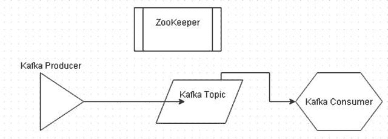

图 12-1。

Apache Kafka Architecture

Apache Kafka 不直接基于 Apache Hadoop，也不使用 Apache Hadoop。但是 Kafka 可以被用作 Apache 水槽的源头、渠道或水槽。在本章中，我们将利用 Docker 映像在 Docker 容器中运行 Apache Kafka。本章包括以下几节。

*   设置环境
*   为 Apache Kafka 启动 Docker 容器
*   查找 IP 地址
*   列出 Kafka 的日志
*   创造一个 Kafka 主题
*   启动 Kafka 制作人
*   启动 Kafka 消费者
*   生产和消费消息
*   停止和移除 Docker 容器

## 设置环境

本章需要以下软件。

*   -Docker(版本 1.8)
*   Apache ZooKeeper 的 Docker 映像(最新版本)
*   Apache Kafka 的 Docker 映像(最新版本)

连接到将要安装软件的 Amazon EC2 实例；公共 IP 地址对于不同的用户是不同的。

`ssh -i "docker.pem" ec2-user@52.91.168.33`

安装 Docker 并启动 Docker 服务。

`sudo service docker start`

OK 信息表示对接器已经启动，如图 [12-2](#Fig2) 所示。

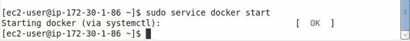

图 12-2。

Starting Docker Service

下载 Apache ZooKeeper 的 Docker 图片`dockerkafka/zookeeper`。

`sudo docker pull dockerkafka/zookeeper`

Docker 镜像被下载，如图 [12-3](#Fig3) 所示。

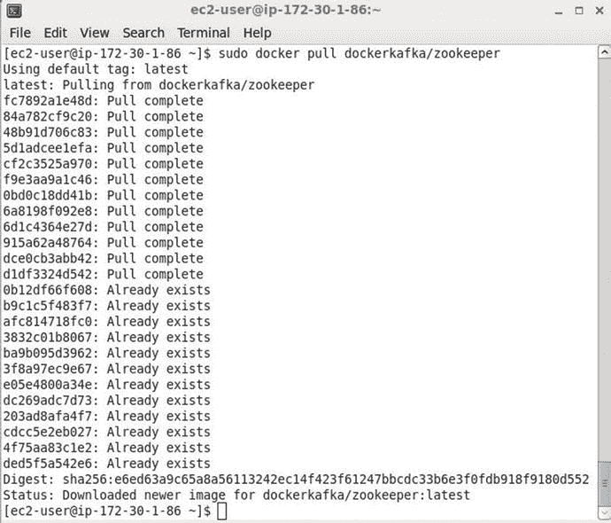

图 12-3。

Downloading dockerkafka/zookeeper Docker Image

选择下载`dockerkafka/zookeeper`映像是因为相应的 dockerkafka/kafka 映像也是可用的。也下载 Docker 映像`dockerkafka/kafka`。

`sudo  docker pull dockerkafka/kafka`

Docker 映像`dockerkafka/kafka`被下载，如图 [12-4](#Fig4) 所示。

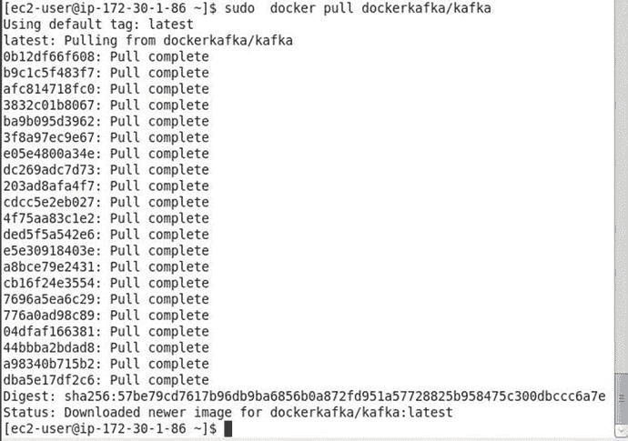

图 12-4。

Downloading the dockerkafka/kafka Docker Image

## 为 Apache Kafka 启动 Docker 容器

我们需要启动 Apache ZooKeeper 和 Apache Kafka 容器，因为 Kafka 集群需要这两个容器。首先，使用下面的`docker` `run`命令启动 Apache ZooKeeper 的 Docker 容器，其中 ZooKeeper 的端口设置为 2181。Docker 容器使用`–d`选项在分离模式下启动。

`sudo docker run -d --name zookeeper -p 2181:2181  dockerkafka/zookeeper`

接下来，使用`dockerkafka/kafka`映像启动 Kafka 服务器的 Docker 容器。将 Kafka 服务器的端口指定为 9092，并使用`–link`参数将 Kafka 容器与运行 ZooKeeper 的容器链接起来。

`sudo docker run --name kafka  -p 9092:9092 --link zookeeper:zookeeper  dockerkafka/kafka`

用`docker ps`命令列出正在运行的容器。

`sudo docker ps`

两个容器，一个用于 Apache ZooKeeper，另一个用于 Apache Kafka，如图 [12-5](#Fig5) 所示。

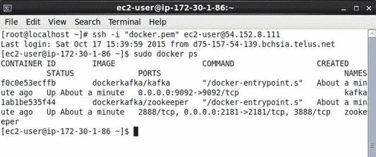

图 12-5。

Listing Running Docker Containers

## 查找 IP 地址

要运行 Kakfa 生产者和消费者，我们需要找到运行 ZooKeeper 的 Docker 容器的 IP 地址和运行 Kafka 服务器的 Docker 容器的 IP 地址。运行以下两个命令来导出`ZK_IP`和`KAFKA_IP`环境变量。

`export ZK_IP=$(sudo docker inspect --format '{{ .NetworkSettings.IPAddress }}' zookeeper)`

`export KAFKA_IP=$(sudo docker inspect --format '{{ .NetworkSettings.IPAddress }}' kafka)`

随后，回显`ZK_IP`和`KAFKA_IP`变量。`ZK_IP`输出为`172.17.0.1`，`KAFKA_IP`输出为 172.17.0.2，如图 [12-6](#Fig6) 所示。我们将在后续章节中使用这些 IP 地址。

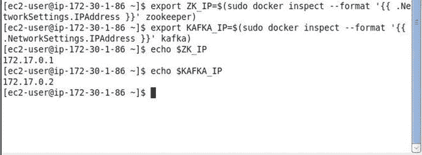

图 12-6。

Finding IP Addresses for Zookeeper and Kafka Servers

## 列出 Kafka 的日志

用`docker` `logs`命令输出 Docker 容器“kafka”的日志。

`sudo docker logs -f kafka`

输出表明 Kafka 服务器已经启动，如图 [12-7](#Fig7) 所示。

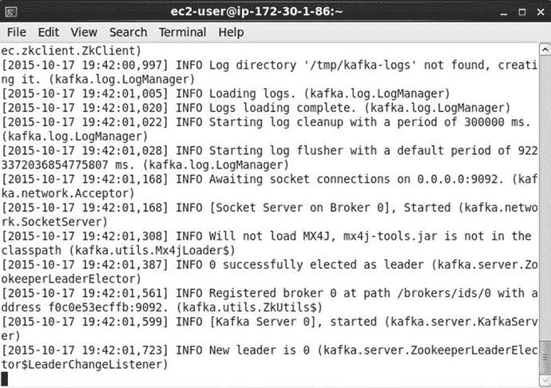

图 12-7。

Listing Kafka Logs

在随后的部分中，我们将创建一个 Kafka 主题，启动一个 Kafka 生产者，启动一个 Kafka 消费者，并在 Kafka 生产者处产生要在 Kafka 主题处发布的消息，并在 Kafka 消费者处消费这些消息。

## 创造一个 Kafka 主题

首先，我们需要创建一个 Kafka 主题来发布消息。使用以下命令启动交互式终端。

`sudo docker exec -it kafka bash`

用`kafka-topics.` `sh –create`命令在交互终端创建一个 Kafka 主题。用`–topic`选项指定要创建的主题为“测试”。将 ZooKeeper 地址指定为之前获取的 ZooKeeper 的 IP 地址，并在环境变量`ZK_IP`中设置。将 ZooKeeper 端口指定为 2181。使用`--partitions`选项将分区数量设置为 1，使用`--replication-factor`选项将复制因子设置为 1。

`kafka-topics.sh --create --topic test --zookeeper 172.17.0.1:2181 --replication-factor 1 --partitions 1`

该命令的输出被创建为“测试”主题，如图 [12-8](#Fig8) 所示。

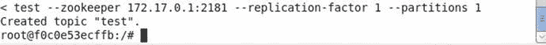

图 12-8。

Creating a Kafka topic

## 启动 Kafka 制作人

接下来，从运行 kafka 服务器的“Kafka”容器的交互终端使用以下命令启动 Kafka 生成器。代理列表被指定为`172.17.0.2:9092`，其中 IP 地址是之前导出的环境变量`KAFKA_IP`。Kafka 服务器监听的端口是 9092。通过`–topic`选项将消息发布的主题设置为“测试”。

`kafka-console-producer.sh --topic test --broker-list 172.17.0.2:9092`

Kafka producer 控制台启动，如图 [12-9](#Fig9) 所示。

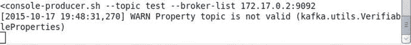

图 12-9。

Starting the Kafka Producer

## 启动 Kafka 消费者

对于 kafka 消费者控制台，我们需要为“Kafka”容器启动另一个交互式终端。

`sudo docker exec -it kafka bash`

运行以下命令来启动 Kafka 消费者控制台，以使用通过`–topic`选项指定的发布到“test”主题的消息。ZooKeeper `host:port`用`–zookeeper`选项设置为`172.17.0.1:2181`，其中 IP 地址为环境变量`ZK_IP`，端口为 2181。`--from-beginning`选项意味着从一开始就要使用消息。

`kafka-console-consumer.sh --topic test --from-beginning --zookeeper 172.17.0.1:2181`

Kafka 消费者控制台启动，如图 [12-10](#Fig10) 所示。

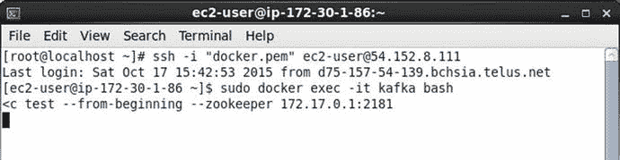

图 12-10。

Starting the Kafka Consumer

## 生产和消费消息

在本节中，我们将把消息从 Kafka 生产者发布到在我们启动生产者时配置的 Kafka 主题“test ”,并在也订阅了“test”主题的 Kafka 消费者处消费这些消息。

如图 [12-11](#Fig11) 所示，在制作人控制台发布一条消息“Docker 的 Kafka 你好”。单击 Enter 导航到控制台中的下一行。

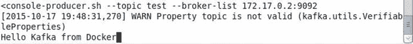

图 12-11。

Producing a Message at the Kafka Producer

发布到“测试”主题的消息在 Kafka 消费者处被消费，并在消费者控制台中被输出，如图 [12-12](#Fig12) 所示。

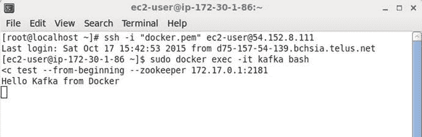

图 12-12。

Consuming Messages at the Consumer

类似地，从 Kafka 生产者发布更多消息到“测试”主题，如图 [12-13](#Fig13) 所示。

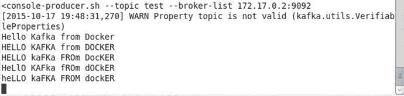

图 12-13。

Producing More Messages at the Producer

消息在 Kafka 消费者控制台得到输出，如图 [12-14](#Fig14) 所示。

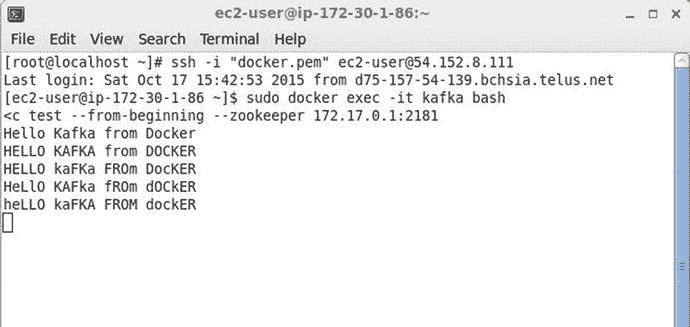

图 12-14。

Consumming Messages

## 停止和移除 Docker 容器

要停止 Docker 容器，运行`docker stop`命令。按如下方式停止“kafka”容器。

`sudo docker stop kafka`

“kafka”容器可以用`docker rm`命令删除。

`sudo docker rm kafka`

同样，停止并删除 Docker 容器“zookeeper”。

`sudo docker stop zookeeper`

`sudo docker rm zookeeper`

## 摘要

在本章中，我们使用了 Apache ZooKeeper 和 Apache Kafka 的 Docker 容器来运行链接到 Apache ZooKeeper 进程的 Kafka 服务器进程。我们创建了一个 Kafka 主题，启动了一个 Kafka 生产者，启动了一个 Kafka 消费者，从 Kafka 生产者向主题发布消息，并在消费者处消费这些消息。在下一章，我们将讨论使用 Apache Solr 和 Docker。