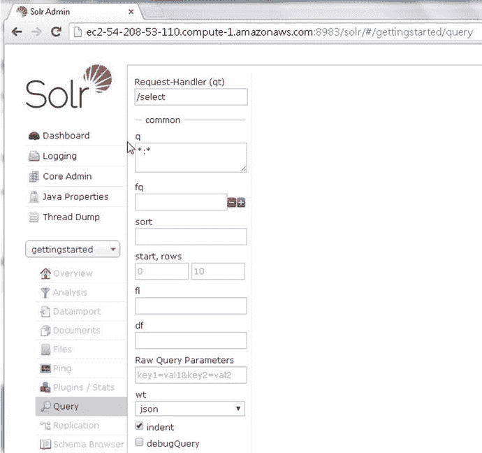

# 十三、使用 Apache Solr

Apache Solr 是一个基于 Apache Lucene(一个文本搜索引擎库)的开源搜索平台。Apache Solr 是可伸缩的和可靠的，并提供索引和查询服务。Cloudera 搜索基于 Apache Solr。在本章中，我们将使用 Apache Solr 的官方 Docker 映像在 Docker 容器中运行 Apache Solr。本章包括以下几节。

*   设置环境
*   启动 Apache Solr 服务器的 Docker 容器
*   启动交互式外壳
*   登录 Solr 管理控制台
*   创建核心管理索引
*   加载样本数据
*   在 Solr 管理控制台中查询 Apache Solr
*   使用 REST API 客户端查询 Apache Solr
*   删除数据
*   列出日志
*   停止 Apache Solr 服务器

## 设置环境

本章需要以下软件。

*   -Docker 引擎(版本 1.8)
*   apache solr 的 docker image

我们将使用一个基于 Ubuntu Server 14.04 LTS (HVM)的 Amazon EC2 实例，SSD 卷类型- ami-d05e75b8。使用用户名“ubuntu”和 Amazon EC2 实例的公共 IP 地址登录 Amazon EC2 实例。

`ssh -i "docker.pem"` `ubuntu@54.208.53.110`

Amazon EC2 上的 Ubuntu 实例被登录，如图 13-1 所示。

图 13-1。

Logging in to Ubuntu on AmazonEC2

按照第一章所述，在 Ubuntu 上安装 Docker。启动 Docker 服务。如果 Docker 已经启动，则输出一条消息“start:Job is has running:Docker”。

`sudo service docker start`

Docker 服务状态可以通过以下命令输出。

`sudo service docker status`

如图 13-2 所示，输出一条指示 docker 进程正在运行的消息。

图 13-2。

Starting and Finding Docker Service Status

接下来，用`docker` `pull`命令下载 Apache Solr 的官方 Docker 映像。

`sudo docker pull solr`

如图 13-3 所示下载 Docker 镜像。

图 13-3。

Downloading Docker Image solr

## 启动 Apache Solr 服务器的 Docker 容器

要启动 Apache Solr 服务器，请运行`docker run`命令，并将端口用`–p`指定为 8983。用`–name`选项指定容器名为“solr_on_docker”，这是任意的。`–d`命令参数使 Docker 容器以分离模式运行。

`sudo docker run -p 8983:8983  -d --name  solr_on_docker  solr`

用`docker ps`命令列出正在运行的 Docker 容器。

`sudo docker ps`

运行 Apache Solr 的 Docker 容器被列出，包括分配给容器的容器 id，如图 13-4 所示。

图 13-4。

Starting Docker Container for Apache Solr

运行`docker` `logs`命令来输出 Docker 容器的日志。docker 命令中可以使用容器名或容器 id。

`sudo docker logs -f 8061f79d1f16`

容器日志表明 Apache Solr 服务器已经启动，如图 13-5 所示。

图 13-5。

Listing Docker Container Log

## 启动交互式 Shell

以用户“solr”的身份启动 Docker 容器的交互式 shell。

`sudo docker exec -it –user=solr solr_on_docker bash`

交互式 shell(或 tty)启动，如图 13-6 所示。

图 13-6。

Starting TTY

Apache Solr 命令可以在交互终端中运行。

## 登录 Solr 管理控制台

如果运行 Apache Solr 服务器的 Docker 容器运行在不同于管理控制台的主机上，则使用运行 Docker 引擎和 Docker 容器的 Amazon EC2 实例的公共 DNS 名称。从 Amazon EC2 管理控制台获取公共 DNS。公共 DNS 为`ec2-54-208-53-110.compute-1.amazonaws.com`，如图 13-7 所示。

图 13-7。

Finding the Public DNS

使用 URL [`http://ec2-54-208-53-110.compute-1.amazonaws.com:8983/`](http://ec2-54-208-53-110.compute-1.amazonaws.com:8983/) 访问 Apache Solr 管理控制台。仪表板如图 13-8 所示。

图 13-8。

Logging in to Solr Admin Console

## 创建核心索引

接下来，创建一个核心，这是要存储在 Apache Solr 中的数据的索引。从 tty 运行`bin/solr create_core`命令来创建一个名为`gettingstarted`的内核。

`bin/solr create_core -c gettingstarted`

一个名为“gettingstarted”的新内核被创建，如图 13-9 所示。

图 13-9。

Creating a Core called “gettingstarted”

在 Solr 管理控制台中，选择核心管理，如图 13-10 所示。

图 13-10。

Selecting Core Admin

在型芯选择器中选择`gettingstarted`型芯，如图 13-11 所示。

图 13-11。

Selecting the gettingstarted Core

如图 13-12 所示，在空白处选择概览选项卡。会列出索引统计信息，如版本、文档数、最大文档数和已删除数。

图 13-12。

Displaying the Overview of the gettingstarted Core

## 加载样本数据

Apache Solr 支持 XML、JSON 和 CSV 格式的文档索引。我们将使用 XML 格式进行索引。根元素必须是`<add/>`，并且每个文档必须包含在`<doc/>`元素中。`id`字段是必填的。我们将索引下面的 XML 格式文档。将文件存储为`solr.xml`。

`<add>`

`<doc>`

`<field name="id">SOLR1000</field>`

`<field name="name">Solr, the Enterprise Search Server</field>`

`<field name="manu">Apache Software Foundation</field>`

`<field name="cat">software</field>`

`<field name="cat">search</field>`

`<field name="features">Advanced Full-Text Search Capabilities using Lucene</field>`

`<field name="features">Optimized for High Volume Web Traffic</field>`

`<field name="features">Standards Based Open Interfaces - XML and HTTP</field>`

`<field name="features">Comprehensive HTML Administration Interfaces</field>`

`<field name="features">Scalability - Efficient Replication to other Solr Search Servers</field>`

`<field name="features">Flexible and Adaptable with XML configuration and Schema</field>`

`<field name="features">Good unicode support: héllo (hello with an accent over the e)</field>`

`<field name="price">0</field>`

`<field name="popularity">10</field>`

`<field name="inStock">true</field>`

`<field name="incubationdate_dt">2006-01-17T00:00:00.000Z</field>`

`</doc>`

`</add>`

将 solr.xml 复制到 Docker 容器中的`/opt/solr`目录。从 Ubuntu 主机而不是 Docker 容器运行下面的`docker cp`命令，将`solr.xml`文档复制到 id 为`8061f79d1f16`的 Docker 容器，该容器运行 Apache Solr 服务器。容器 id 可以从`docker ps`命令的输出中获得。

`sudo docker cp solr.xml 8061f79d1f16:/opt/solr/solr.xml`

`solr.xml`文档被复制到 Docker 容器中的`/opt/solr`目录，如图 13-13 所示。

图 13-13。

Copying solr.xml to DockerContainer

使用以下命令启动交互式终端(tty)。

`sudo docker exec -it –user=solr solr_on_docker bash`

从`/opt/solr`目录运行以下命令，列出目录中的文件和目录。`solr.xml`应被列出，如图 13-14 所示。

图 13-14。

Listing the solr.xml File in Docker Container

运行以下命令将 solr.xml 发布到`gettingstarted`索引。

`bin/post -c gettingstarted ./solr.xml`

`solr.xml`文件被索引，如图 13-15 所示。

图 13-15。

indexing solr.xml

## 在 Solr 管理控制台中查询 Apache Solr

可以从 Solr 管理控制台查询索引文档。选择查询页签，如图 13-16 所示。

图 13-16。

Selecting the Query tab

请求处理程序(qt)应该设置为`/select`，查询应该设置为*。*选择索引中的所有文件，如图 13-17 所示。起始索引设置为 0，要选择的行数设置为 10。将`wt`(响应编写器)设置为`json`，以 JSON 格式返回查询到的文档。其他支持的格式有 XML 和 CSV。

图 13-17。

The /select Request Handler

点击执行查询，如图 13-18 所示。

图 13-18。

Clicking on Execute Query

查询结果返回为 JSON，如图 13-19 所示。

图 13-19。

JSON Response from Query

版本字段被添加到返回的 JSON 文档中，如图 13-20 所示。

图 13-20。

The _version_ field added automatically

## 使用 REST API 客户端查询 Apache Solr

Apache Solr 索引的文档也可以使用 REST 客户端访问，比如`curl`。例如，从“solr”容器的交互终端运行下面的`curl`命令，查询`gettingstarted`索引中的所有文档。

`curl` `http://ec2-54-208-53-110.compute-1.amazonaws.com:8983/solr/gettingstarted/select?q=*%3A*&wt=json&indent=true`

在`gettingstarted`索引中被索引的所有文档得到如图 13-21 所示的输出。

图 13-21。

Running a REST Client Query

再比如，查询文档中带有“Lucene”的所有文档。

`curl "``http://ec2-54-208-53-110.compute-1.amazonaws.com:8983/solr/gettingstarted/select?wt=json&indent=true&q=Lucene`

由于被索引的单个文档中包含“Lucene ”,因此该文档将被返回，如图 13-22 所示。

图 13-22。

Running a REST Client Query using term ‘Lucene’

要查询具有特定字段文本的文档，请使用`q`参数中的`field=text`格式。例如，搜索“名称”字段中带有“Lucene”的所有文档。

`curl "``http://ec2-54-208-53-110.compute-1.amazonaws.com:8983/solr/gettingstarted/select?wt=json&indent=true&q=name:Lucene`

由于索引中的单个文档的名称字段不包含“Lucene ”,因此没有返回任何文档，如图 13-23 所示。

图 13-23。

Running a REST Client Query with “Lucene” in “name” Field

还可以使用 REST 客户端执行短语搜索。例如，搜索短语“企业搜索”。

`curl "``http://ec2-54-208-53-110.compute-1.amazonaws.com:8983/solr/gettingstarted/select?wt=json&indent=true&q=\"Enterprise+Search`

由于单个文档中包含“企业搜索”，因此该文档将返回，如图 13-24 所示。

图 13-24。

Running a REST Query using a Phrase

## 删除数据

要删除文档，请运行与发布文档相同的工具，即发布工具。使用 XML `<delete><id></id></delete>`指定要删除的文档 id。要删除的索引由`–c`选项指定。

`bin/post -c gettingstarted -d "<delete><id>SOLR1000</id></delete>"`

如图 13-25 所示，id 为`SOLR1000,`的被索引的单个文档被删除。

图 13-25。

Deleting a Single Document

随后，运行与之前相同的 curl 命令来搜索所有文档。

`curl` `http://ec2-54-208-53-110.compute-1.amazonaws.com:8983/solr/gettingstarted/select?q=*%3A*&wt=json&indent=true`

没有找到如图 13-26 所示的文件，因为唯一索引的文件已被删除。

图 13-26。

REST Query does not list any Document after deleting the only document

删除唯一的索引文档后，在 Solr 管理控制台中运行一个查询，没有返回任何文档，如返回的 JSON 文档中的字段值 0 所示，如图 13-27 所示。

图 13-27。

Query in Sole Admin Console does not list any document after Deleting the only Document

## 列出日志

Apache Solr 服务器上运行的所有命令的 Docker 容器日志可以使用`docker logs`命令输出。

`sudo docker logs -f solr_on_docker`

Docker 容器日志的输出如图 13-28 所示。

图 13-28。

Listing Docker Container Logs

## 停止 Apache Solr 服务器

可以用`docker ps`命令列出正在运行的 Docker 容器。`solr_on_docker`容器列为运行中，如图 13-29 所示。

图 13-29。

Listing Running Docker Containers

要停止`solr_on_docker`容器，运行`docker stop`命令，如图 13-30 所示。

`sudo docker stop solr_on_docker`

运行`docker ps`命令再次列出正在运行的 Docker 容器。`solr_on_docker`容器没有被列出。

图 13-30。

Stopping Docker Container for Apache Solr

Docker 映像仍然会用`docker images`命令列出，如图 13-31 所示。

图 13-31。

Listing Docker Image for a stopped Docker Container

如果要删除 Docker 映像，首先必须在停止后删除 Docker 容器`solr_on_docker`。

`sudo docker rm solr_on_docker`

`sudo docker rm solr`

## 摘要

在本章中，我们使用 Apache Solr 的官方 Docker 映像在 Docker 容器中运行 Apache Solr 服务器。我们创建了一个核心索引，并向该索引发布了一个文档。随后，我们从 Solr 管理控制台和 REST 客户端工具 curl 查询文档。在下一章，我们将和 Docker 讨论 Apache Spark。