# 三、使用 Google 容器注册表的容器映像管理

在本章中，将向读者介绍谷歌容器注册(GCR)服务，他们将了解以下内容:

*   Google 容器注册中心简介

*   设置 Google 容器注册表

*   将 Docker 映像推入 GCP 容器注册表

*   管理和保护 GCP 容器注册表

## Google 容器注册中心简介

Container Registry 是管理 Docker 映像、执行漏洞分析以及控制哪些用户可以访问哪些映像的单一位置。GCR 为 CI/CD 和安全性提供了广泛的集成功能，从而使开发人员和管理员能够以安全的策略驱动方式轻松管理映像。它提供了在您提交代码到云资源仓库、GitHub 或 Bitbucket 时自动构建和推送映像到私有注册表的特性。

Google Container Registry 提供了在软件部署周期的早期阶段检测漏洞的功能。它可以评估容器映像对于部署是否安全。Google Container Registry 使用与二进制授权的本机集成来定义策略，并防止部署与设置的策略冲突的映像。它可以触发容器映像的自动锁定，从而禁止将有风险的映像部署到 Google Kubernetes 引擎。借助区域性私有存储库，您可以将映像存储在欧洲、亚洲或美国的计算实例附近，并访问 Google 的全球网络，以实现快速部署。以下是 GCR 的主要特征:

*   **漏洞扫描:**此功能支持扫描 Docker 映像容器，以识别漏洞。它可以识别 Ubuntu、Debian 和 Alpine 的软件包漏洞。

*   **标记:**标记映像可确保更好的可管理性。从 GCP 控制台可以轻松地添加和删除标记。

*   **在代码或标签改变时构建触发器:** GCR 允许在代码库的代码或标签改变时自动构建触发容器映像。此功能还提供了构建详细信息的整合视图，例如源步骤、日志和步骤。

## 设置 Google 容器注册表

设置 GCR 非常简单明了。以下步骤解释了如何快速设置 GCR 服务。

在第二章[中，你学习了如何创建谷歌计算引擎。我们将使用同一个计算引擎实例来演示从 GCP 容器注册中心提取映像和将映像推送到该注册中心。对于本演示以及`Pull`和`Push`命令的执行，我们必须首先在计算引擎实例上安装 Docker 版本 18.03。按照以下步骤安装 Docker。](02.html)

图 3-1

更新列表包命令

*   **第一步:**登录之前创建的虚拟机。

*   **步骤 2:** 运行下面的命令来更新现有的包列表。

*   **命令:** `sudo apt update`(图 [3-1](#Fig1) )

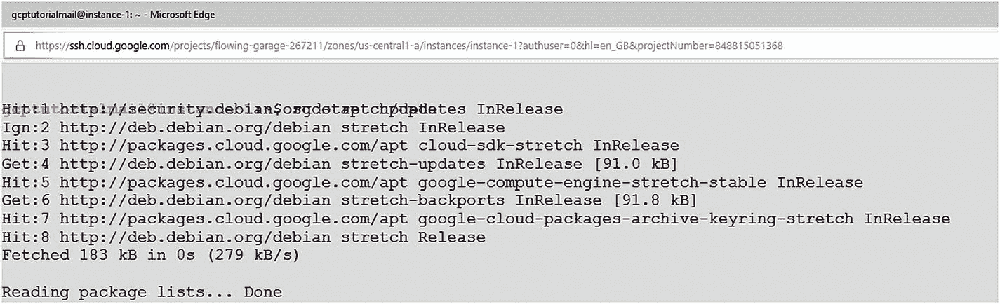

图 3-2

更新列表包输出

*   **输出:**前面命令的结果如下(图 [3-2](#Fig2) )。

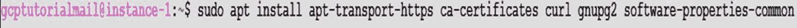

图 3-3

软件包安装命令

*   **第三步**:安装几个先决条件包，允许`apt`在 HTTPS 上使用包。

*   **命令:** `sudo apt install apt-transport-https ca-certificates curl gnupg2 software-properties-common`(图 [3-3](#Fig3) )

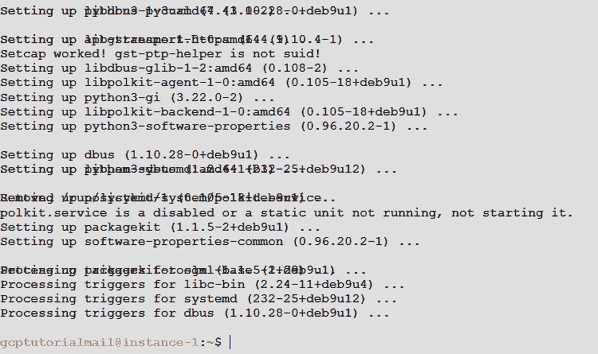

图 3-5

包安装输出

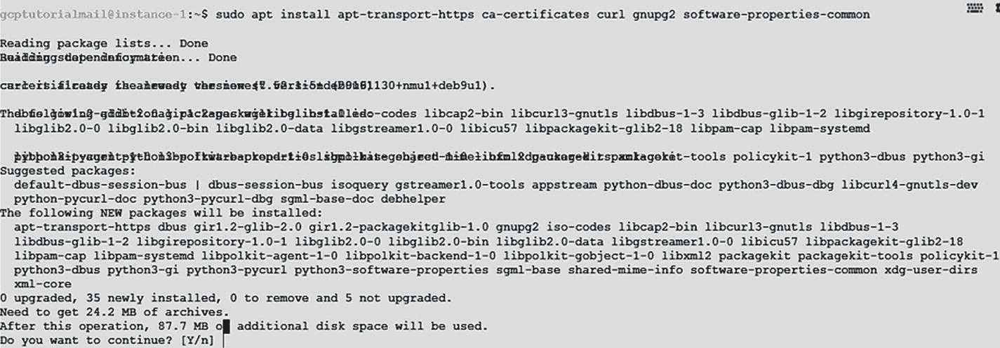

图 3-4

包安装输出

*   **输出:**前面命令的结果如下(图 [3-4](#Fig4) 和 [3-5](#Fig5) )。

*   输入 y。

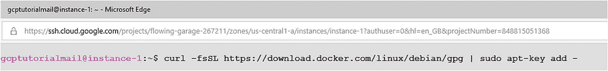

图 3-6

添加 GPG 键盘命令

*   第 4 步:将官方 Docker 存储库的 GPG 密钥添加到您的系统中。

*   **命令:** `curl -fsSL` [`https://download.docker.com/linux/debian/gpg`](https://download.docker.com/linux/debian/gpg) `| sudo apt-key add –`(图 [3-6](#Fig6) )

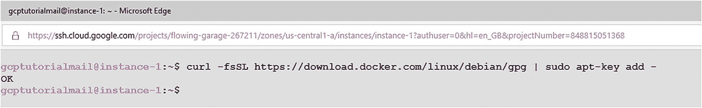

图 3-7

添加 GPG 键输出

*   **输出:**前面命令的结果如下(图 [3-7](#Fig7) )。

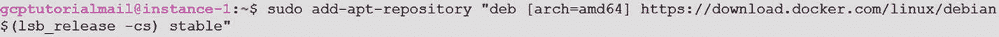

图 3-8

将 Docker 存储库添加到 ATP 命令和输出中

*   **步骤 5** :将 Docker 存储库添加到 APT 源代码中。

*   **命令:** `sudo add-apt-repository "deb [arch=amd64]` [`https://download.docker.com/linux/debian`](https://download.docker.com/linux/debian) `$(lsb_release -cs) stable"`(图 [3-8](#Fig8) )

图 3-9

更新包命令

*   **步骤 6** :用新添加的 repo 中的 Docker 包更新包数据库。

*   **命令:** `sudo apt update`(图 [3-9](#Fig9) )

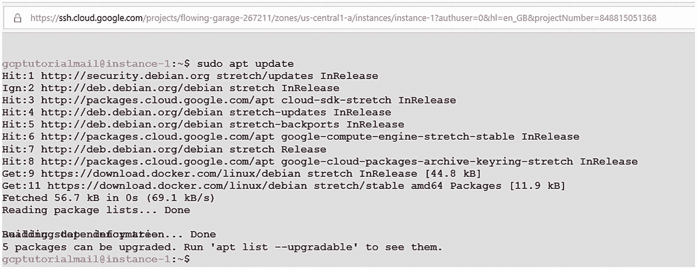

图 3-10

更新包输出

*   **输出**:前面命令的结果如下(图 [3-10](#Fig10) )。

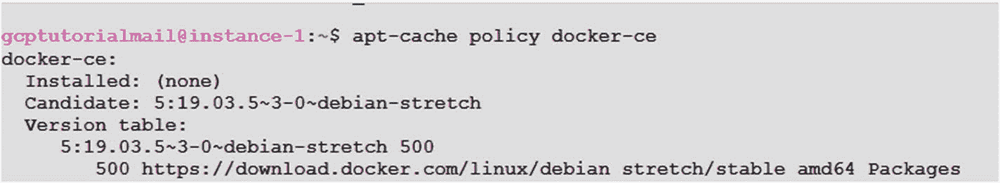

图 3-11

正在安装 Docker 策略

*   **第 7 步**:执行以下命令安装 Docker repo。

*   **命令:** `apt-cache policy docker-ce`

*   **输出**:结果如下(图 [3-11](#Fig11) )。

图 3-12

安装 Docker 命令

*   **第 8 步**:最后，通过执行以下命令安装 Docker。

*   **命令:** `sudo apt install docker-ce`(图 [3-12](#Fig12) )

图 3-13

安装 Docker 输出

*   **输出**:结果如图 [3-13](#Fig13) 所示。

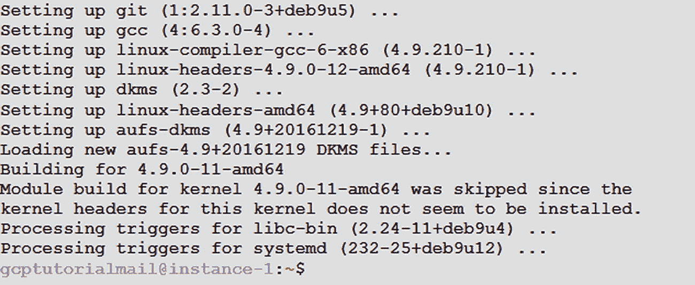

图 3-14

安装 Docker 输出—续

*   输入 Y(图 [3-14](#Fig14) )。

图 3-15

验证安装 Docker 命令/输出

*   **步骤 9** :通过执行下面的查询，验证 Docker 已经成功安装。

*   **命令/输出:** `sudo systemctl status docker`(图 [3-15](#Fig15) )

图 3-16

`sudo`特权命令

*   要在没有`sudo`的情况下执行 Docker 命令，请执行以下操作:

*   **步骤 1** :执行以下查询。

*   **命令:** `sudo usermod -aG docker ${USER}`(图 [3-16](#Fig16) )

图 3-17

验证 Docker 组权限

*   **第二步**:注销再登录，看应用效果。通过键入以下命令，确认您的用户现在已添加到 Docker 组中:

*   **命令/输出:** `id –nG`(图 [3-17](#Fig17) )

## 将 Docker 映像推入 GCP 容器注册表

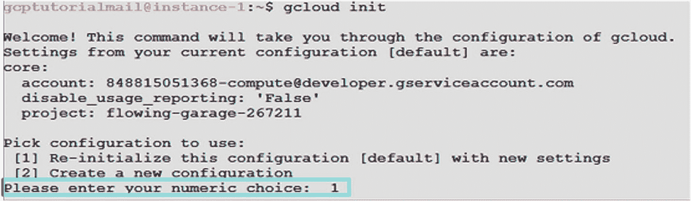

图 3-18

正在初始化 Google 帐户

*   **第一步:**使用之前创建的帐户 ID 登录。在我们的例子中，我们使用 gcptutorialmail@gmail.com 将映像推送到 GCP 注册中心。使用以下命令重新初始化，并在出现提示时输入 1 来选择配置。

*   **命令/输出:** `gcloud init`(图 [3-18](#Fig18) )

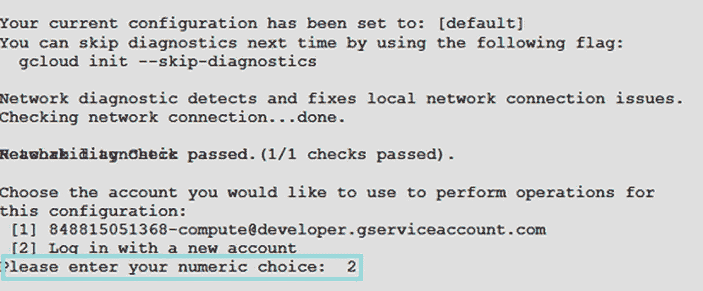

图 3-19

正在初始化 Google 帐户

*   **第二步:**选择选项 2，配置账户进行图片上传操作(图 [3-19](#Fig19) )。

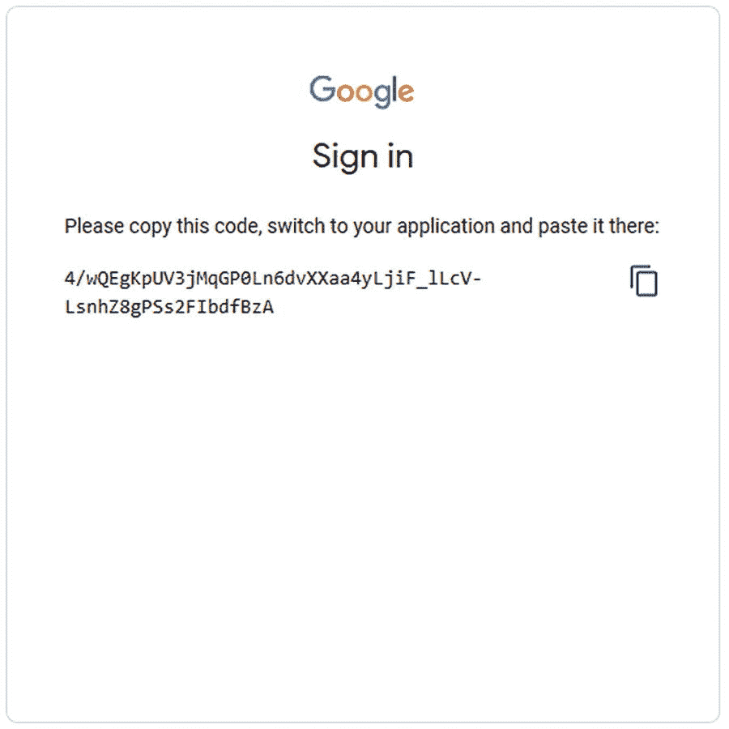

图 3-21

登录代码

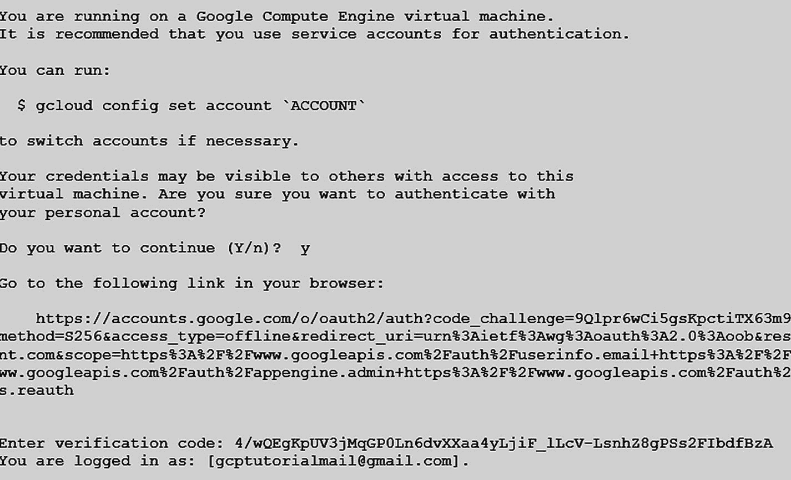

图 3-20

初始化 Google 帐户—续

*   **第三步:**输入“2”后，会要求你继续，输入“y”，在浏览器上打开屏幕显示的链接，复制验证码，粘贴到“输入验证码:”的屏幕上，你就成功登录了(图 [3-20](#Fig20) 和 [3-21](#Fig21) )。

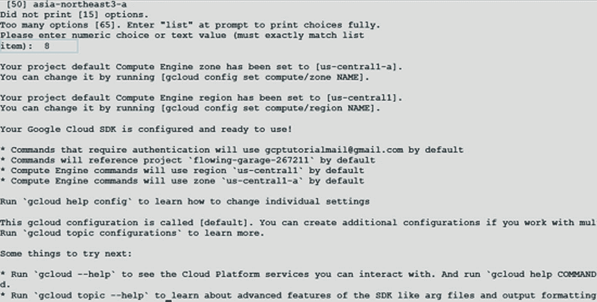

图 3-22

计算引擎区域

*   **步骤 4:** 在步骤 3 之后，系统将要求您从显示的列表中选择计算引擎区域。输入相应的数字。在我们的例子中，`us-central1`的数字是 8(图 [3-22](#Fig22) )。

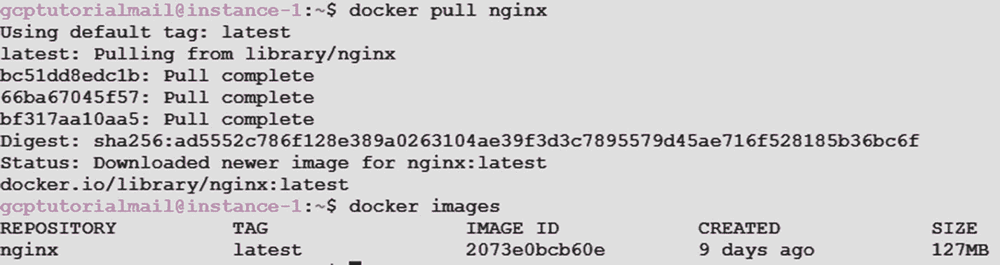

图 3-23

计算引擎区域—续

*   现在，将映像推入 GCP 容器注册表的 CLI 设置已经准备就绪。

*   **第 5 步:**在第 4 步之后，为了测试将映像推入 GCP 容器注册中心，我们将首先从 Docker Hub 下载一个示例`nginx`映像。使用以下命令检查下载。

*   **命令:** 1) `docker pull nginx`这将从公共 Docker Hub 中拉出映像`nginx`；2) `docker images`这将列出本地机器上存在的映像。

*   **输出**:前面命令的结果如下(图 [3-23](#Fig23) )。

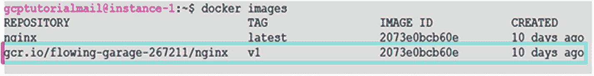

图 3-24

映像列表

*   **步骤 6:** 在步骤 5 之后，我们必须标记映像，以将其上传到容器注册表。标记后，可以使用以下第二个命令将其列出。

*   **命令:** 1) `docker tag nginx gcr.io/flowing-garage-267211/nginx:v1`这将在映像被推入 GCP 容器之前对其进行标记，该映像需要成为版本和映像。

*   2) `docker images`这将列出本地机器中存在的所有映像。

*   **输出**:前一条命令的结果如下(图 [3-24](#Fig24) )。

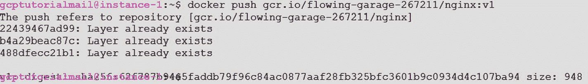

图 3-25

Docker 推送映像

*   **步骤 7:** 在步骤 6 之后，我们现在将把映像推入容器注册中心，使用下面的命令来标记需要被版本化的映像，以便它可以被推入 GCP 容器。

*   **命令:** `docker push gcr.io/flowing-garage-267211/nginx:v1`

*   **输出**:前一条命令的结果如下(图 [3-25](#Fig25) )。

图 3-26

映像导航

*   可以通过 GCP 控制台在容器注册表中查看该映像。导航到工具➤容器注册➤映像，如图 [3-26](#Fig26) 所示。

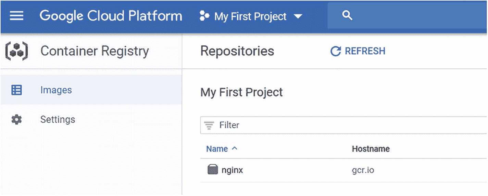

图 3-27

推送映像视图

*   点击映像链接，以下页面将显示映像列表(图 [3-27](#Fig27) )。

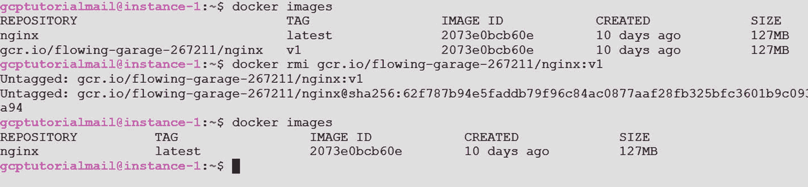

图 3-28

移除映像

*   **步骤 8:** 在步骤 7 之后，我们将从 GCP 容器注册中心提取映像。

*   在此之前，我们将删除本地虚拟机上的可用映像。

*   **命令:** 1) `docker images` 2) `docker rmi gcr.io/flowing-garage-267211/nginx:v1` 3) `docker images`

*   **输出:**前面命令的结果如下(图 [3-28](#Fig28) )。

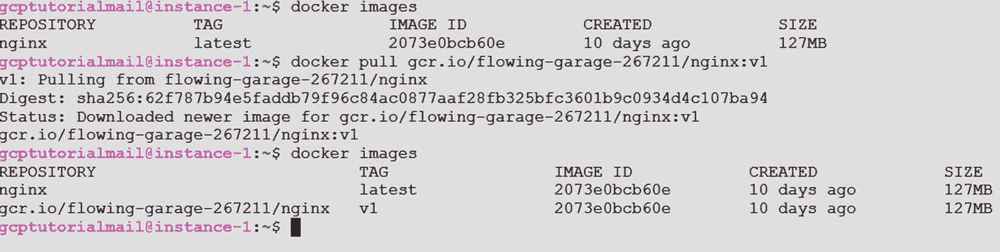

图 3-29

拉动映像

*   **步骤 9:** 在步骤 8 之后，我们将使用以下命令从 GCP 容器注册中心获取映像。

*   **命令:** 1) `docker images` 2) `docker pull gcr.io/flowing-garage-267211/nginx:v1` 3) `docker images`

*   **输出:**下面的快照显示本地机器上没有映像。使用前面的命令，我们从 GCP 容器注册表中提取映像(图 [3-29](#Fig29) )。

## 管理和保护 GCP 容器注册表

### 将映像复制到新注册表

让我们想象一个场景，来自另一个项目的用户需要访问我们在实践练习中使用的项目中的映像。为了演示这个用例，我们将首先使用以下步骤创建另一个项目。

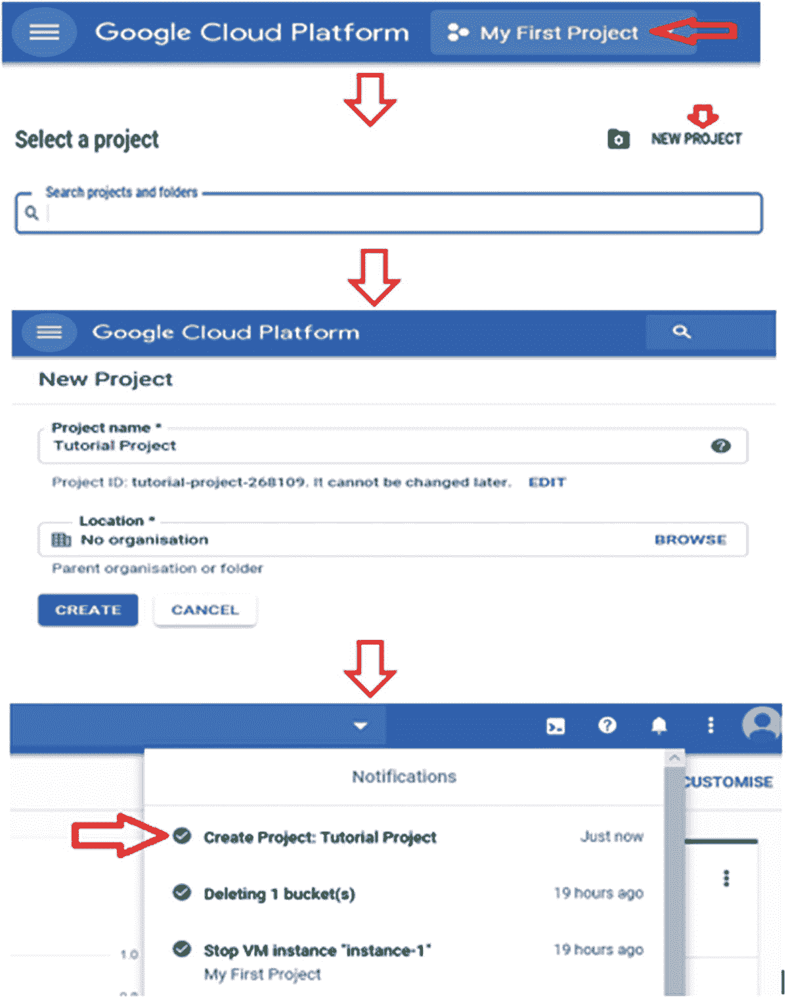

图 3-30

创建新项目

*   **步骤 1:** 点击项目名称，如下图所示，打开选择项目窗口。单击新项目链接。输入项目名称(在本例中为“教程项目”)，然后单击 Create 按钮。弹出通知将显示消息“创建项目:教程项目”(图 [3-30](#Fig30) )。

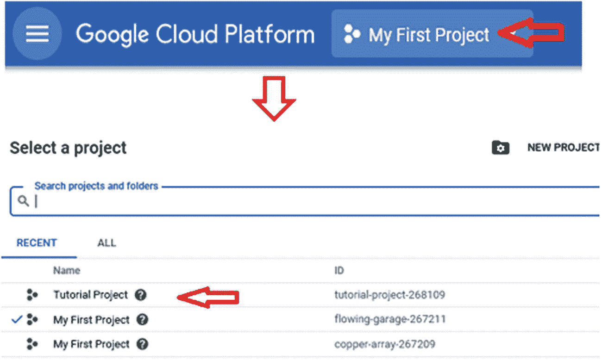

图 3-31

新项目列表视图

*   **第二步:**再次点击项目名称下拉菜单，新建的项目将出现在选择项目窗口中(图 [3-31](#Fig31) )。

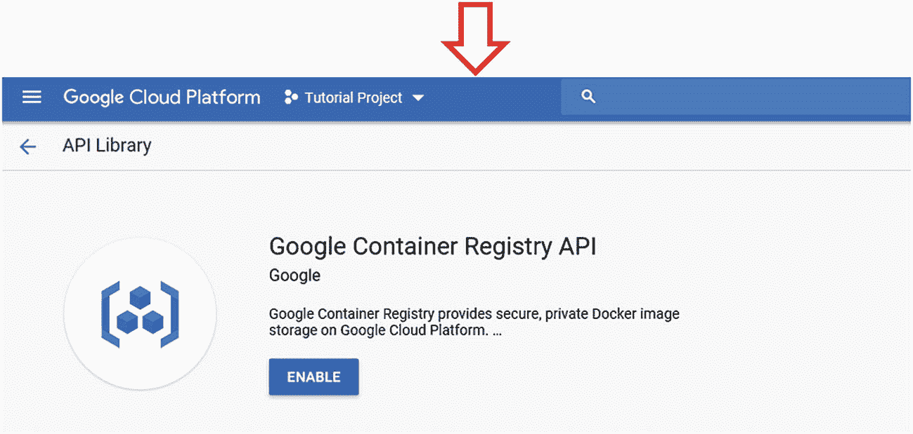

图 3-34

API 仪表板导航—续

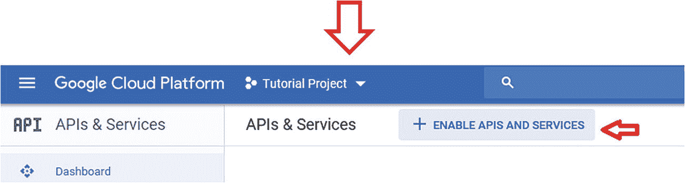

图 3-33

API 仪表板导航—续

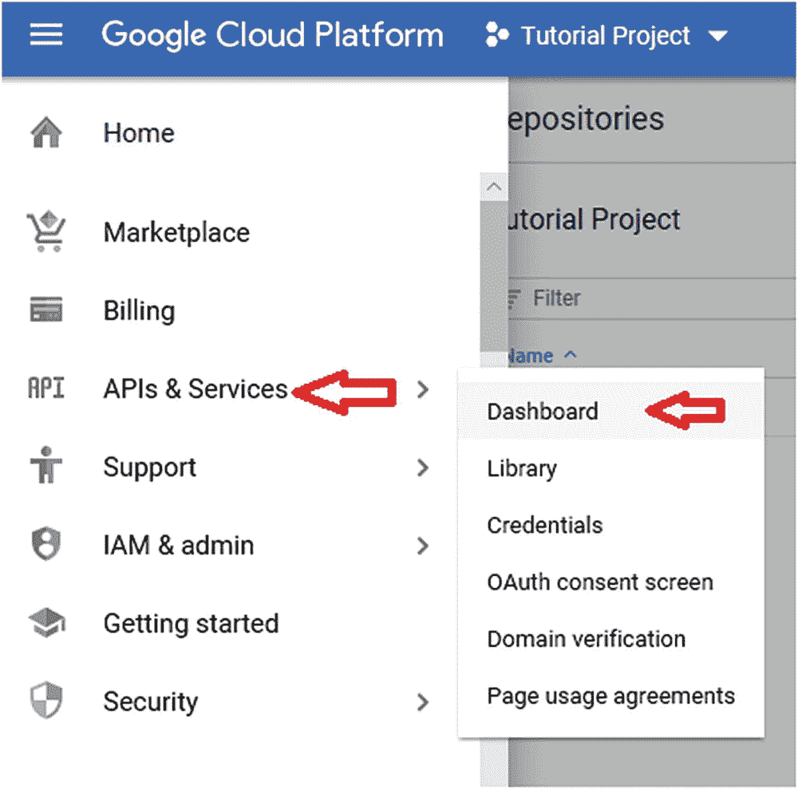

图 3-32

API 仪表板导航

*   **步骤 3:** 如果您可以访问两个注册表，那么可以使用命令行将一个映像从一个注册表复制到另一个注册表。现在尝试将项目“我的第一个项目”的容器注册表中的`nginx:v1`映像复制到新创建的项目“教程项目”的容器注册表中

*   要执行复制操作，您必须*为新项目(教程项目)启用* API 注册表。为此，进入 API 仪表板屏幕，如图 [3-32](#Fig32) 、 [3-33](#Fig33) 和 [3-34](#Fig34) 所示。

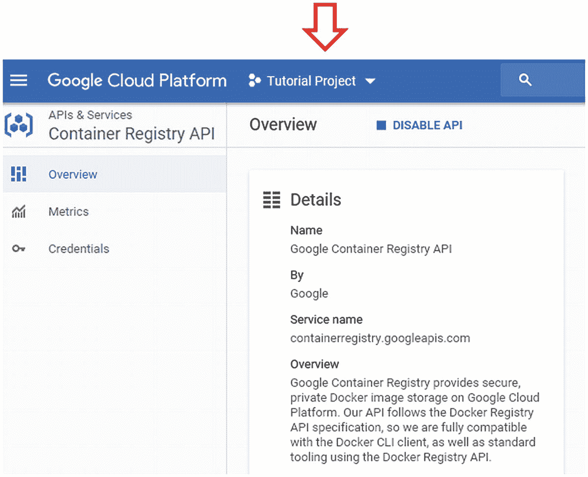

图 3-35

API 仪表板导航—续

*   单击启用按钮。

*   现在，针对教程项目启用了 API 服务(图 [3-35](#Fig35) )。

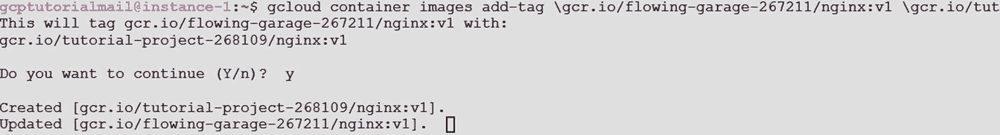

图 3-36

将映像复制到存储库输出

*   **步骤 4:** 在步骤 3 之后，运行下面的命令，将镜像复制到教程项目容器的注册表中。

*   **命令:** `gcloud container images add-tag \gcr.io/flowing-garage-267211/nginx:v1 \gcr.io/tutorial-project-268109/nginx:v1`

*   **输出:**结果如下所示(图 [3-36](#Fig36) )。

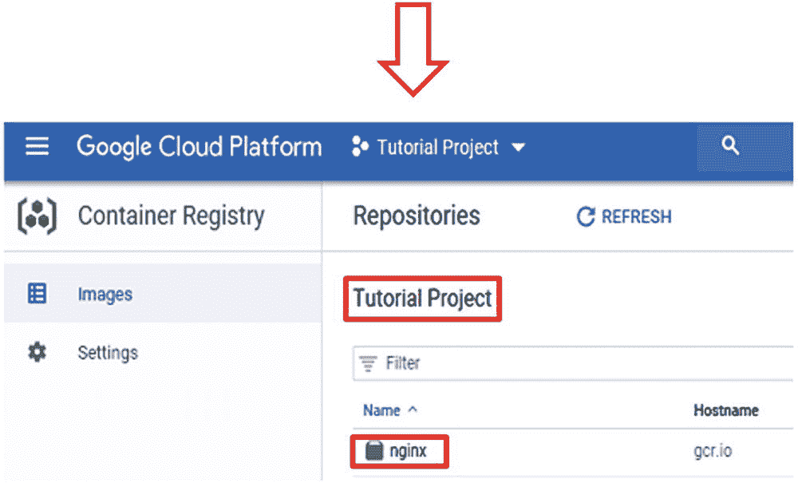

图 3-38

粘贴到教程项目

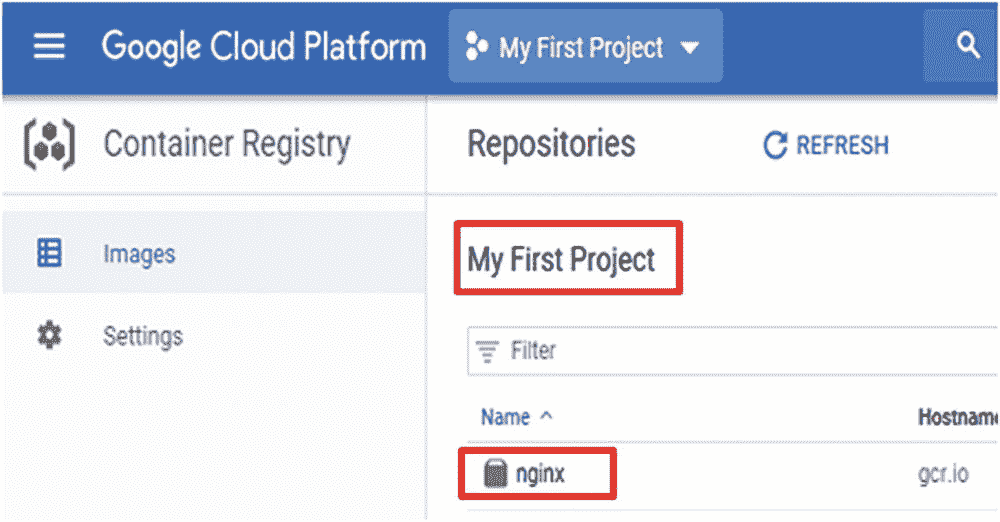

图 3-37

从我的第一个项目复制

*   执行命令后，映像从一个项目复制到另一个项目。参见图 [3-37](#Fig37) 和 [3-38](#Fig38) 获取快照。

### 从容器注册表中删除映像

要演示从 GCP 容器注册表中删除映像，请运行以下命令。

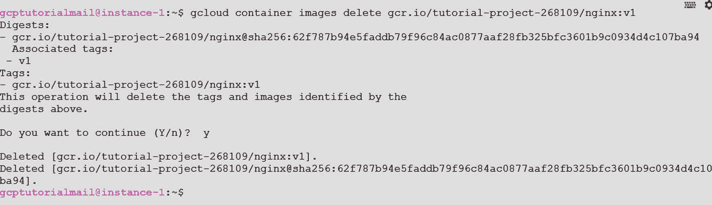

图 3-39

映像已从注册表中删除

*   **命令:** `gcloud container images delete gcr.io/tutorial-project-268109/nginx:v1`

*   **输出:**结果如图 [3-39](#Fig39) 所示。

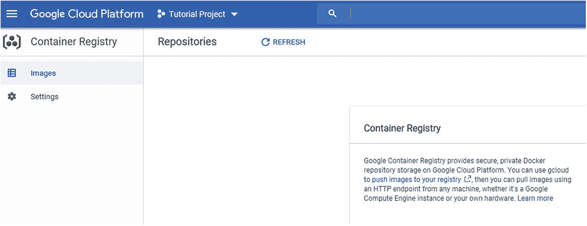

图 3-40

空白映像注册表视图

*   删除后，可以检查一下教程项目的 GCP 容器注册表会不会显示任何映像(图 [3-40](#Fig40) )。

### 漏洞扫描映像

映像漏洞可能会对现有系统产生巨大影响。这可能导致整个系统故障或系统被恶意利用。GCP 的容器分析服务提供映像元数据的漏洞扫描和存储。容器分析对容器注册表中的映像存储运行扫描，并监控扫描的漏洞报告，以保持其更新。容器分析是一个两阶段的过程。

1.  每当一个新的映像被推入容器注册表时，容器分析服务就根据容器清单扫描该映像的漏洞并存储元数据。每次将映像重新上传到容器注册表中时，都会更新相同的元数据，从而跟踪映像扫描漏洞报告。这个过程被称为*增量扫描*。

2.  接下来，它对扫描映像的元数据进行持续监控，以检测新的漏洞。它不断检查和更新漏洞信息，创建新的事件，并删除不再有效的事件。这个过程叫做连续分析。

漏洞结果是映像的漏洞事件列表。它还包含扫描的严重级别，分为严重、高、中、低和最低。

现在让我们为上传到容器注册表中的示例应用映像设置漏洞扫描。

### 设置漏洞扫描

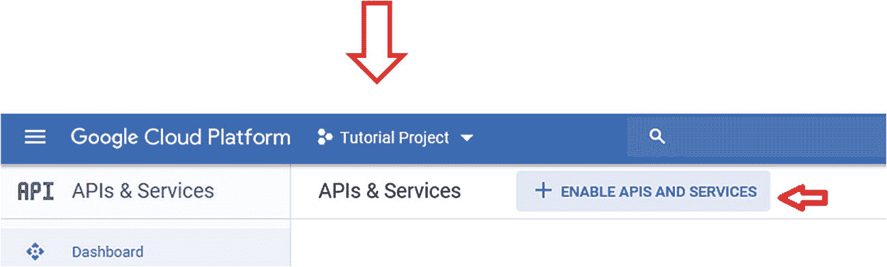

图 3-42

API 仪表板导航 API 和服务

图 3-41

API 仪表板导航

*   **步骤 1:** 要启用镜像的漏洞扫描，必须启用项目的容器扫描 API。遵循这些步骤(图 [3-41](#Fig41) 和 [3-42](#Fig42) )。

图 3-43

API 仪表板—容器扫描 API

*   搜索容器扫描 API(图 [3-43](#Fig43) )。

图 3-44

API 仪表板导航—容器扫描 API—续

*   点击启用(图 [3-44](#Fig44) )。

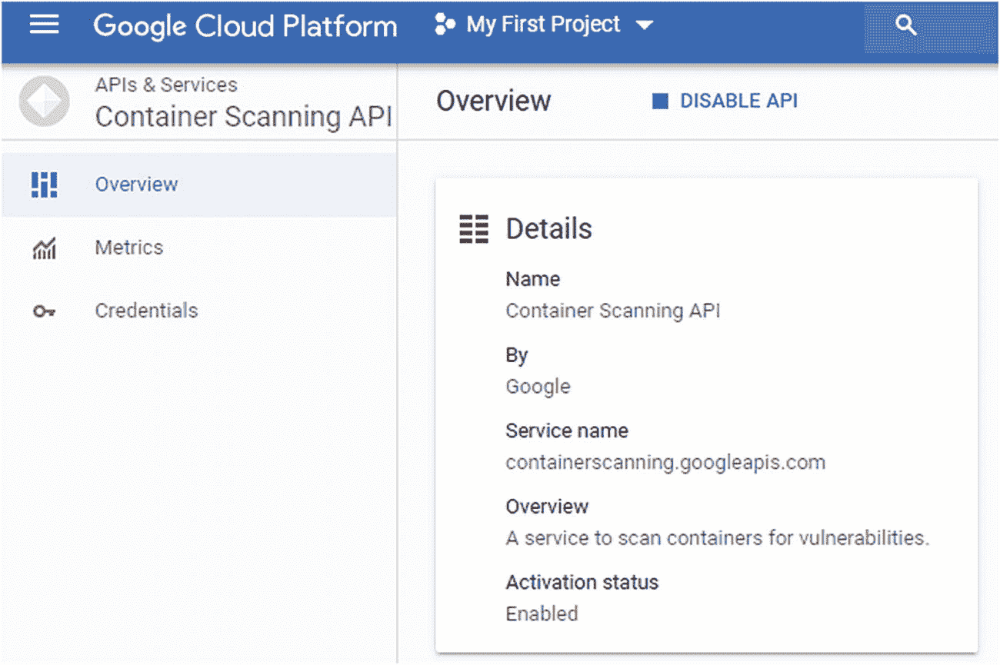

图 3-45

API 仪表板导航—启用容器服务 API

*   现在，我的第一个项目启用了容器扫描 API 服务(图 [3-45](#Fig45) )。

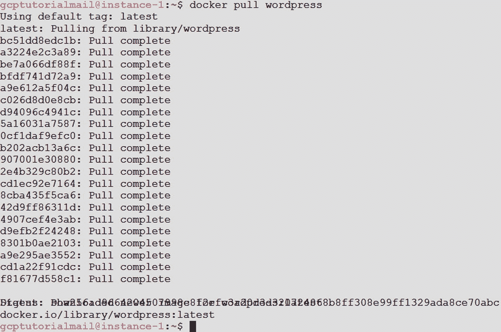

图 3-46

拉动 Docker 映像

*   **第二步:**在第一步之后，从 Docker Hub 中拉出一个应用镜像(如 wordpress)进行漏洞扫描(图 [3-46](#Fig46) )。

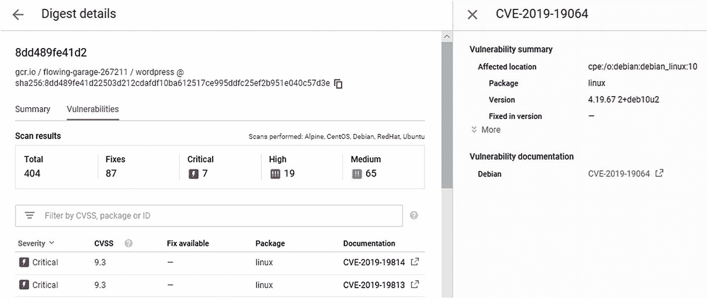

图 3-52

映像漏洞详细信息

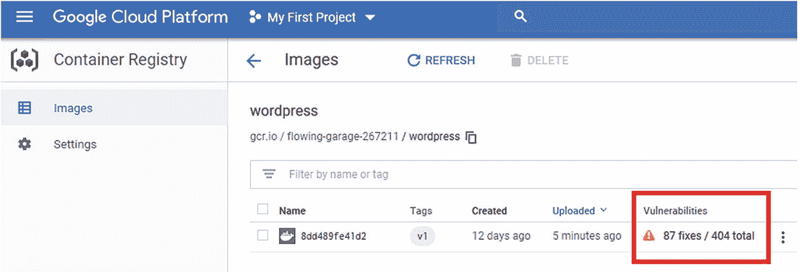

图 3-51

映像漏洞

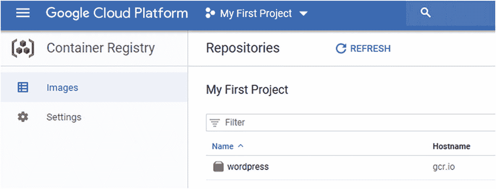

图 3-50

映像检查

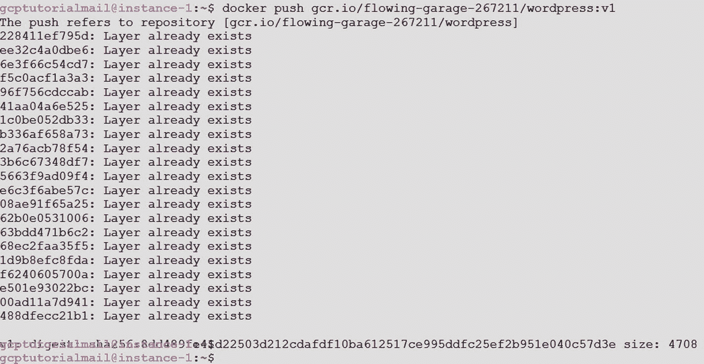

图 3-49

映像被推入存储库

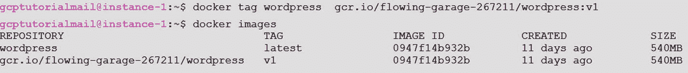

图 3-48

映像标签

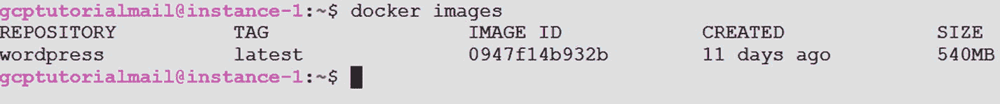

图 3-47

映像列表

*   **步骤 4:** 在步骤 3 之后，检查 GCP 控制台上的映像。你可以看到“漏洞”列出现在 wordpress 图片行中。点击“修复/全部”链接，查看图片漏洞扫描详情(图 [3-50](#Fig50) 、 [3-51](#Fig51) 、 [3-52](#Fig52) )。

1.  在存储库中推送映像(图 [3-49](#Fig49) )。

1.  标签映像(图 [3-48](#Fig48) )。

*   **步骤 3:** 检查本地机器上的映像下载，标记映像，并将其推入容器注册表，这将自动触发容器映像扫描，如下所示:

*   **命令:** 1 `) docker images` 2) `docker tag wordpress gcr.io/flowing-garage-267211/wordpress:v1` 3) `docker push gcr.io/flowing-garage-267211/wordpress:v1`

*   **输出**:
    1.  获取映像列表(图 [3-47](#Fig47) )。

## 摘要

在本章中，您了解了 GCP 容器注册中心，如何设置容器注册中心，以及如何从 GCP 容器注册中心获取和推送映像。在下一章中，您将看到如何在开始应用部署之前设置 GKE 网络元素。