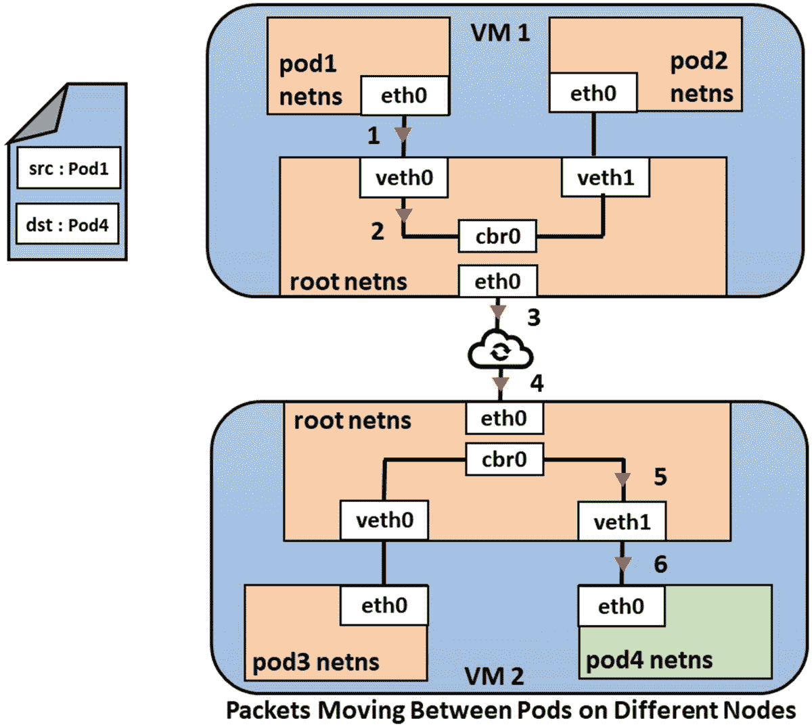
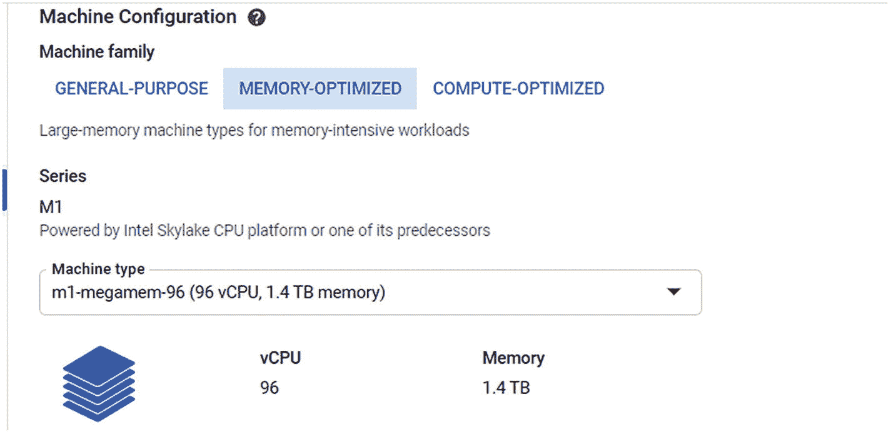

# 四、GKE 网络

本章解释了如何在 GKE 建立网络环境，还涵盖了使用各种场景的每个子组件的各种使用案例。讨论了以下主题:

*   Google Kubernetes 引擎介绍(GKE)

*   GKE 网络术语

*   容器之间的通信

*   同一节点上的 pod 之间的通信

*   不同节点上的 pod 之间的通信

*   pod 与服务的通信

*   pod 与互联网的通信(外部世界)

*   服务的负载均衡

*   从外部负载均衡器到服务的通信

*   从内部负载均衡器到服务的通信

*   GKE 群组的部署

## Google Kubernetes 引擎介绍(GKE)

GKE 是谷歌云平台(GCP)的平台即服务(PaaS)组件，是托管在 GCP 的 Kubernetes 的托管版本。它有助于管理部署环境，包括扩展和容器化应用。

GKE 使用 Kubernetes 开源集群管理系统。Kubernetes 层提供了管理机制，例如执行管理任务、设置策略和监控部署工作负载的健康状况。GKE 集群还用于部署和管理应用。

### Google Cloud 上的 Kubernetes

GKE 为集群管理提供了各种高级功能，包括:

*   一种节点池功能，用于指定群集中的节点子集，以便于管理

*   集群节点实例的自动扩展

*   节点群集软件的自动升级

*   一个自动修复节点来维护其健康和可用性

*   使用 GCP stack driver(Google Operations)记录和监控集群可见性

GKE 集群需要至少有一个 Kubernetes 的主组件和工作组件。以下是 GKE 集群生态系统的主要组成部分:

*   **集群主机:**该组件运行 Kubernetes 控制面板进程，包括调度程序、API 服务器和其他控制器。集群主服务器的生命周期由 GKE 管理。

*   **集群主机和 Kubernetes API:** 与集群主机的任何交互都由 Kubernetes API 调用来管理，以执行只读或读/写操作。对集群主服务器的传入 API 请求通过运行在集群主服务器上的 Kubernetes API 进程进行管理。最终用户可以通过 Rest API 调用、kubectl 或 GCP 控制台触发 Kubernetes API 调用。

*   **节点:**Kubernetes 集群的 Worker 节点通常被称为节点。节点是由 GKE 根据用户在配置时提供的配置自动创建的单个计算引擎虚拟机实例。利用一个节点来运行由一个或多个 pod 组成的服务，以运行应用。一个节点通常包括容器运行时和 Kubernetes 节点代理(kubelet ),它与集群主节点通信以执行各种管理任务。
    *   **节点机器的类型:**节点有不同类型的标准计算引擎机器类型。默认类型是 n1-standard-1，有一个虚拟 CPU 和 3.75GB 内存。通过以下链接，您可以访问可用机器类型的详细信息: [`https://cloud.google.com/compute/docs/machine-types`](https://cloud.google.com/compute/docs/machine-types) 。

    *   **节点操作系统镜像:**节点使用[专用操作系统镜像](https://cloud.google.com/kubernetes-engine/docs/concepts/node-images)，例如 Linux RHEL 和 Ubuntu，用于运行容器。创建群集时，用户可以选择在节点池中使用哪种类型的操作系统映像。

*   **节点池:**一组具有相同配置类型的节点。池中的每个节点都有一个 Kubernetes 节点标签`cloud.google.com/gke-nodepool`，它的值是节点池的名称。节点池可以包含一个或多个节点。创建集群时，可以指定节点的数量和类型，这将成为默认的节点池。我们可以向群集中添加不同大小和类型的额外自定义节点池。任何给定节点池中的所有节点都彼此相同。

*   **节点映像:**创建 GKE 集群或节点池时，我们必须选择在每个节点上运行的操作系统映像。GKE 为集群提供了以下节点映像选项:
    *   人的本质

    *   Windows 操作系统

    *   谷歌的容器优化操作系统

    *   使用 containerd 的容器优化操作系统

    *   带有容器的 ubuntu

GKE 提供了各种类型的集群，在创建集群时可以从中进行选择。一旦创建，集群的类型就不能更改。以下是可以使用 GKE 创建的集群类型:

*   **单区集群:**

    单区域集群使用单个主节点，也称为控制面板，在单个区域中运行，并管理在同一区域中运行的节点上的工作负载。根据托管应用工作负载的可用性和弹性要求，在设置 GKE 集群时可以利用以下任一选项。

*   **多区域集群:**

    多区域群集使用在单个区域中运行的控制面板的单个副本，并且具有在多个区域中运行的节点。

*   **区域集群:**

    在给定区域内，在多个区域和节点中运行的控制面板的多个副本也在控制面板的副本运行的每个区域上运行。

GKE 中的网络类似于虚拟化和云环境中的网络，但是因为容器是不同的部署模型，所以底层网络元素也不同。GKE 联网的目的是确保在 Pods 中运行的各种服务之间进行通信，它还应该支持与容器生态系统之外的其他服务的连接。当我们使用 GKE 部署基于微服务的应用时，我们必须在 GCP 上规划我们的网络，以确保满足所有特定于容器的要求。用户现在必须设计 GKE 网络，重点关注 pod、服务和外部接口之间的连接。

GKE 的高级软件定义网络支持通过声明性配置管理的许多功能，包括路由、IP 过滤规则、防火墙规则等。让我们从 GKE 的一些网络概念开始。

## GKE 网络术语

在讨论 GKE 的网络之前，读者应该了解用于识别 Google Kubernetes 网络组件的各种术语。

### 网络命名空间

网络命名空间提供与底层主机网络接口隔离的逻辑网络。网络命名空间充当网络栈的副本，并为在命名空间下运行的进程提供独立环境的假象。

### 虚拟以太网设备

虚拟以太网设备就像是将 Pod 连接到节点的真实以太网的隧道。该隧道的两端在节点侧由 vethX 表示，在 Pod 侧由 ethX 表示，其中 X 对应于适当位置的设备数量。

### 布里奇斯

网桥的工作原理是第 2 层(L2)级交换，将数据从一个 Pod 传输到集群中的另一个 Pod。网桥维护转发表，其中保存了先前获取的 MAC 地址和端口的映射，并使用 MAC 地址执行 L2 传输。

### Iptables

Iptables 用于处理网络和端口转发规则集。它使用内核级的“netfilter”规则来配置 Kubernetes 服务的所有路由。

### 服务

服务是服务于单一目的的 pod 的集合。例如，一个应用可以有一个应用和一个 DB 层，对应于后端的多个 pod。这些 pod 将被归入不同的类别，并通过服务进行通信。

这样，如果后端发生任何 Pod 更改，应用层服务仍然能够与数据库层服务对话，因为应用环境和数据库环境之间的交互点是通过服务进行的。App-Db 交互如图 4-1 所示。

图 4-1

应用-数据库交互

### 多维数据集代理

Kube-proxy 是 Kubernetes 中一个重要的二进制文件，它运行在集群中的每个节点上，并构成 Kubernetes 控制面板的一部分。它负责将流量从服务路由到特定的 pod。它将服务中的所有流量分流，并将其路由到正确的节点。在 Kubernetes 版本 1.2 中，kube-proxy 现在拥有对 iptables 的权限，并且可以将 netfilter 规则插入到节点名称空间中。反过来，网络过滤器将流量重定向到服务。

### HTTP(S)负载均衡器

Google Cloud 的外部 HTTP(S)负载均衡器是一个全球分布式负载均衡器，用于在互联网上公开应用。它部署在全球范围内的 Google Presence Points(pop ),为用户提供低延迟的 HTTP(S)连接。任播路由用于负载均衡器 IPs，允许互联网路由确定到其最近的 Google 负载均衡器的最低成本路径。

GKE 入口部署外部 HTTP(S)负载均衡器，为作为后端的 pod 提供本地全局负载均衡。

### 节点端口

节点端口服务是将外部流量直接发送到您的服务的最原始的方式。顾名思义，NodePort 在所有节点(虚拟机)上打开一个特定的端口，发送到该端口的任何流量都会被转发到该服务。

### GKE IP 地址分配

GKE 分配的 IP 地址类型包括:

*   **节点 IP:** 分配给给定节点的 IP 地址称为节点 IP。每个节点从群集的虚拟专用云(VPC)网络接收一个 IP 地址。此 IP 地址支持与群集中其他节点的通信。这个 IP 地址也被控制组件 kubelet 和 kube-proxy 用来连接到控制面板 Kubernetes API 服务器。

该节点还接收要分配给在该节点上运行的 pod 的 IP 地址池。默认情况下，GKE 为此分配一个/24 CIDR 块。

*   **Pod IP:** 分配给给定 Pod 的 IP 地址称为 Pod IP。该 IP 地址由该 Pod 中运行的所有容器共享，它用于将这些容器连接到集群中的其他 Pod。

*   **集群 IP:** 分配给服务的 IP 地址称为集群 IP。该地址是从群集的 VPC 网络分配的。Kubernetes 从集群的可用服务 IP 地址池中为每个服务分配一个稳定的 IP 地址。集群 IP 在集群中是唯一的，不会改变。仅当从群集中删除服务时，才会释放 IP 地址。

当 Pod 部署在节点上时，GKE 会在节点的 Linux 内核中为 Pod 创建一个网络名称空间。网络命名空间使用虚拟网络接口(VNI)将节点的物理网络与 Pod 连接起来。这使得通信流能够从 Pod 通过主机的物理网络。这充当在同一节点上运行的 pod 的网桥，并且还被 pod 用来向节点外发送分组。

在 Pod 中运行的所有容器都使用 Pod 的网络命名空间来访问网络。所有容器都连接到同一个网络接口。

默认情况下，每个单元都可以连接到群集中的其他单元。您可以通过配置设置对其进行限制。通过使用服务 IP 而不是 POD IP 来启用对服务的访问，因为 POD 可以被 GKE 破坏和创建。服务具有稳定的 IP 地址和端口，并提供跨 pod 的负载均衡。

Pods 和服务之间的连接由运行在每个节点上的 kube-proxy 组件管理。

## 容器之间的通信

在这一节中，我们将介绍容器如何在 Pod 内部相互通信。初始化时，每个 Pod 都会收到一个唯一的 IP 和网络名称空间。如前所述，pod 共享相同的名称空间，并使用 localhost 相互通信。因为名称空间是共享的，所以基于配置容器的不同端口进行通信。图 4-2 中描述了一个多容器容器。

图 4-2

多容器容器

## 同一节点上的 pod 之间的通信

Kubernetes 中的每个 Pod 都被分配了一个 IP 地址，Pod 之间的通信就是在这个 IP 地址上进行的。集群中的每个 Pod 都有自己的名称空间，它与节点根名称空间交互，以便与其他 Pod 通信。

每个 Pod 接收一个名为 eth0 的虚拟以太网设备。此 eth0 连接到主机节点(VM)中的虚拟以太网设备。从容器到 pod 的流量通过这个虚拟连接。

当一个 Pod 启动与另一个 Pod 的通信时，它向自己的 eth0 发出请求，eth 0 通过隧道将消息发送到机器节点的虚拟以太网设备。

现在我们知道了请求如何到达根名称空间，下一个问题是数据如何从根名称空间流向另一个 Pod。这是通过网桥实现的。

网桥的工作原理与提供 L2 级交换机并使用地址解析协议(ARP)来发现 MAC 地址的原理相同。网桥将收到的消息广播给所有连接的设备，并将做出响应的设备的 MAC 地址存储在一个表中。连接过程如下:

1.  从容器生成到达 Pod eth0 的请求。

2.  该请求通过虚拟以太网设备隧道传输到相应的虚拟 vethx 接口。

3.  从那里，请求经过一个桥，该桥维护节点内所有连接的 Pod 的记录，并将请求传输到目的地 Pod。

4.  该请求会发送到与目标 Pod 建立的虚拟以太网设备。

使用桥连接命名空间如图 4-3 所示。

图 4-3

使用桥连接命名空间

## 不同节点上的 pod 之间的通信

在本节中，我们将使用从“同一节点上的 pod 之间的通信”一节中获得的知识来查看消息请求如何在放置在两个不同节点上的两个不同 pod 之间流动，如下面的数据包流图所示(图 4-4 )。

图 4-4

不同节点上的 pod 之间的数据包移动

在图 4-4 中，pod1 正试图与位于不同节点上的 pod4 通信。

该请求将由 pod1 中的容器生成，它将到达 pod1 的虚拟以太网 eth0，并通过隧道到达根名称空间中存在的网桥。

网桥将根据 ARP 找到相关的目的地 Pod。请求将失败，因为目标驻留在不同的节点上。

网桥最终会将数据包发送到位于虚拟机网络接口控制器(NIC)eth 0 节点上的默认网关，数据包从这里进入跨越 GKE 集群的底层 GKE 网络。这是底层节点或虚拟机所在的网络。

默认情况下，GCP 为专用 IP 网络提供反欺骗保护，但是对于 GKE 集群中的节点，反欺骗功能被禁用，通过该功能，网络中的流量可以到达与集群关联的其他节点。

在集群虚拟机部署期间，GKE 会启用以下设置:

*   每个节点虚拟机都被配置为路由器。

*   对虚拟机禁用反欺骗保护。

*   为节点中的每个虚拟机添加一个静态路由，以便数据包从节点的 NIC eth0 通过相关路由进入 GCP 云网络。数据包到达目的节点的 eth0，然后通过网桥和虚拟以太网设备将其发送到目的 pod4。

## pod 与服务的通信

Kubernetes 中的服务扮演着关键的角色，因为它们在 Pods 之上提供了一个抽象层。初始化时会向服务提供一个群集 IP。

Pod 和服务之间的通信遵循不同于 Pod-Pod 通信的方法(图 4-5 )。

图 4-5

pod 和服务之间的数据包移动

信息包沿着相同的路线(如前几节所述)到达网桥。对于 Kubernetes 中的服务级事件通信，数据包在从 eth0 进入默认网关路由之前，会通过 iptables 进行过滤，其中数据包的目的地会更改为后端的相关 Pod。

因此，通过服务，Kubernetes 提供集群负载均衡，将流量路由到连接到服务后端的各种 Pods。

## pod 与互联网的通信(外部世界)

在本节中，我们将讨论 pod 与外界之间的数据流，如下图所示(图 4-6 )。

图 4-6

将数据包从 pod 路由到互联网

数据分组的路径是相当相同的，直到它到达网桥，在那里 ARP 将失败，并且数据将被发送到节点的以太网端，即 veth0。如果我们按照传统的方式将数据包从节点以太网端发送到外部世界(互联网)，数据包必然会失败，因为私有云网络内的互联网网关网络地址转换(NAT)只能理解 VM 地址。

在将数据传递到节点以太网设备之前，iptables 会执行源 NAT，并将数据包源从 Pod IP 更改为节点 VM-IP，以便网络网关能够以正确的方式对其进行处理。数据将到达互联网网关，在那里将执行另一个 NAT，以将来源从 VM-IP 更改为外部 IP，因此，数据包将到达公共互联网。相同的反向路径将有助于数据包到达目的地 Pod。在每一步都将执行 IP 拆除，其中 IP 地址将被转换，并且分组源和目的地将被改变，直到到达正确的 Pod。

## 服务的负载均衡

为了使服务可以从网络和/或集群外部访问，并获取服务内部的数据，GKE 使用三种类型的负载均衡器来控制访问。一个服务可以同时使用多种类型的负载均衡器。

### 外部负载均衡器

外部负载均衡器管理来自群集外部和 VPC 环境外部的流量，并使用一般 GCP 环境转发规则将流量路由到指定节点。通过在服务定义中将服务的“类型”字段设置为负载均衡器，可以初始化外部负载均衡器。当带有负载均衡器的服务被初始化时，GCP 云控制器启动为该服务创建负载均衡器，并返回一个*外部 IP* 地址，该地址可被提供给外部系统，以便通过该负载均衡器与服务进行交互。

### 内部负载均衡器(TCP/UDP)负载均衡器

内部负载均衡器管理来自 GKE 集群外部，但来自在 GCP 建立的虚拟云环境内部的流量。

### HTTP(s)负载均衡器(在第 7 层)

这是另一种类型的外部负载均衡器，它使用 GKE 的入口资源管理服务和基于 RESTful web 服务 API 的应用之间的流量。

## 从外部负载均衡器到服务的通信

通过互联网从 IP 通告到外部网络的流量被转发到负载均衡器，然后被发送到连接到集群的所有节点，因为它不理解容器组件和底层网络(如服务)。

节点上的 Iptables 规则将使用 kube-proxy 在集群内设置的内部负载均衡规则，将数据包分成两部分，并将其发送到正确的目的地 Pod。图 4-7 描述了数据包如何从互联网发送到服务。

图 4-7

从互联网发送到服务的数据包

### 内部负载均衡器

内部负载均衡器被初始化，以便在驻留在集群外部但与集群内的服务在同一 Google cloud 网络上的应用之间提供通信流。服务定义中指定的注释和类型初始化内部负载均衡器。

内部负载均衡器从群集的 VPC 子网接收 IP 地址，而不是外部 IP 地址。VPC 网络中的应用或服务可以使用此 IP 地址与群集中的服务进行通信。

初始化内部负载均衡器的语法对应于服务定义中的以下模式。

*   `annotations:`
    *   `cloud.google.com/load-balancer-type: "Internal"`

*   `type: LoadBalancer`

## 从内部负载均衡器到服务的通信

从内部负载均衡器到服务的通信采用以下路径。

图 4-8

从外部节点发送到服务的数据包

1.  来自驻留在 Google Cloud 环境中的源/应用的流量到达负载均衡器。

2.  作为一个 GCP 负载均衡器，它不能看到底层的 Kubernetes 组件(如服务、Pods 等)。)，内部负载均衡器上的传入流量将被发送到特定节点。

3.  当流量到达给定节点时，该节点使用其 iptables NAT 表来选择一个 Pod，即使该 Pod 在不同的节点上，并将数据包发送到目的节点，如图 4-8 所示。

### HTTP(S)负载均衡器

为了允许基于 REST API 的应用与集群中的服务进行交互，使用了 HTTP(S)负载均衡器。它在网络的 HTTP/HTTPS 协议范围内工作，并向服务公开来自集群外部的 HTTP/HTTPS 协议路由。

HTTP(S)负载均衡器提供一个稳定的 IP 地址，您可以使用它将请求路由到各种后端服务。

在 GKE 集群中，通过创建 Kubernetes 入口对象来创建和配置 HTTP(S)负载均衡器。入口对象必须与一个或多个服务对象相关联，每个服务对象与一组 pod 相关联。

为了让入口对象工作，Kubernetes 主节点必须为服务分配一个端口。这样，定向到群集节点端口的任何流量都将被发送到服务。

为了公开节点端口以接受流量，入口对象由 GKE 入口控制器初始化，该控制器创建 Google Cloud HTTP(S)负载均衡器，并根据初始化的入口对象中定义的内容对其进行配置，为所有其他后端服务提供稳定的 IP 地址。

### 从 HTTP(S)负载均衡器到服务的通信

HTTP 负载均衡器与服务之间的通信遵循与外部负载均衡器相似的路径，但略有不同，如下所述:

图 4-9

将 HTTP/HTTPS 协议流量从外部路由到服务

*   主要区别在于，入口将允许您执行基于 URL 的服务和相关 pod 路由。

*   这里，源是试图访问基于 URL 的路径的客户端 IP，例如`/dryicelabs/ *`。流量将到达由 GKE 入口控制器初始化的谷歌云负载均衡器。

*   根据 GCLB 上的负载共享配置，流量将从负载均衡器(源)定向到位于负载均衡器后面的一个节点(目标)端口。

*   当我们声明一个服务定义时，我们指定一个*节点端口*。这将在集群中的每个节点上分配一个端口，该端口将代理对服务的请求。

*   在节点 3，iptables 拦截流量，目的地更改为 Pod3，它位于一个服务中，该服务响应正确的 NodePort 请求。

*   数据包最终将遵循内部路由方法从节点 3 到达正确的 Pod3，因为 Pod4 和 Pod5 属于侦听不同端口的服务。(参见图 4-9 。)

## GKE 群组的部署

在本节中，您将学习如何使用 GCP 控制台创建 GKE 集群和配置网络选项，同时设置集群。为了满足设置集群的先决条件，请执行以下步骤。

图 4-10

库页引擎

1.  导航到谷歌云控制台中的 Kubernetes 引擎页面(图 4-10 )。

图 4-11

选择一个项目

1.  创建或选择一个项目。在我们的例子中，我们将选择先前创建的“教程项目”(图 4-11 )。

图 4-12

立方引擎 tab

1.  在 GCP 控制台中，导航至左栏中的 Kubernetes 引擎选项卡(图 4-12 )。

图 4-13

创建集群选项

1.  点击集群选项卡并选择创建集群(图 4-13 )。

### 集群基础

图 4-14

区域选择选项

1.  在为“群集基本信息”显示的第一个选项卡中，指定群集的名称和位置类型。

    GKE 为集群提供了两种位置类型:地带和区域。

    **区域:**选择区域位置类型将显示组织计算引擎中可用的区域列表(图 4-14 )。

    在位置类型中选择一个区域会将集群的组件(主节点+节点)放在一个区域环境中。

**区域:**区域位置类型表示集群组件将跨越多区域环境(默认情况下，区域集群创建三个主控制器，跨越三个不同的区域)。如果选中，区域位置类型将显示所有可用区域的位置(图 4-15 )。

图 4-15

区域选择选项

图 4-16

节点位置选择选项

1.  指定节点位置将节点放置在选定的位置类型中。

    通过选择多个区域可以提高可用性(图 4-16 )。

图 4-17

主版本选择选项

1.  选择群集的主版本。在主版本选择框中有两个选项:发布通道和静态版本。

    为了自动更新集群，用户可以选择发布频道。

    要手动更新集群，请选择静态版本(图 4-17 )，并在下拉框中选择适合 GKE 集群的版本。

### 节点池

在 GKE 中，默认情况下，将创建一个至少包含一个节点池的新群集。节点池是在该群集中创建的节点组的模板。创建群集后，可以添加和删除更多的节点池，其过程如下所述。

图 4-28

节点安全详细信息

图 4-27

网络详细信息

图 4-26

CPU 平台和 GPU 详细信息

图 4-25

机器配置详细信息

图 4-24

CPU 平台和 GPU 详细信息

图 4-23

内存优化详细信息

图 4-22

网络详细信息

*   **服务账户**:运行在 VM 上的应用使用服务账户调用 Google Cloud APIs。使用控制台菜单上的权限创建服务帐户，或者使用默认服务帐户(如果可用)。

*   **访问范围**:选择授予虚拟机的 API 访问类型和级别。默认为对存储和服务管理的只读访问权限、对云日志记录和监控的写访问权限以及对服务控制的读/写访问权限。

*   **屏蔽选项**:屏蔽功能包括可信的 UEFI 固件和 vTPM，并附带用于 GKE 节点的安全引导和完整性监控选项。
    *   **启用完整性监控**:完整性监控允许您使用云监控来监控和验证受保护节点的运行时引导完整性。

    *   **启用安全启动**:安全启动有助于保护您的节点免受启动级和内核级恶意软件和 rootkits 的攻击。

*   **节点安全**:下一个选项卡指定节点池的安全设置(图 4-28 )。

*   **计算优化**:如果您的工作负载需要更高的计算处理能力，请选择此选项(图 4-25 、 4-26 和 4-27 )。

*   **内存优化**:如果您想要内存更高的机器，请选择此选项。机器类型的选择取决于您计划在集群上运行的工作负载的类型。如果您的工作负载需要比 CPU 处理能力更高的内存，您可以选择内存优化型(图 4-23 和 4-24 )。

*   **联网**:(见图 4-22 。)
    *   **每个节点的最大单元数**:指定每个节点的最大单元数。默认值为 110。

    *   **网络标签**:标签代表应用于每个节点的防火墙规则。

*   **Machine family**: We will select a general-purpose machine from the relevant tab (Figure 4-20 & Figure 4-21).

    

    图 4-21

    CPU 平台和 GPU 详细信息

    

    图 4-20

    机器配置详细信息

1.  Specify the name and version of the nodes in the cluster (Figure 4-18).

    

    图 4-18

    节点池详细信息

2.  接下来的列对应于群集中的基本节点设置，即
    *   **大小**:集群中的节点数

    *   **启用自动缩放**:如果启用，该功能将动态创建或删除节点。

    *   **启用自动升级**:自动节点升级有助于使节点保持最新版本的 Kubernetes。

    *   **启用自动修复**:如果选中此设置，将监控节点，并在遇到任何错误时开始修复节点。

    *   **启用激增升级**:激增升级会在短时间内创建额外的节点，以减少升级造成的中断。

    *   **设置**:下一个选项卡对应于使用前面的节点池创建新节点时的设置。

    *   **Image Type**: Users can select customized images from the drop-down for the created nodes (Figure 4-19).

        

        图 4-19

        映像类型下拉菜单

#### 节点元数据

当使用现有节点池创建新节点时，将使用节点元数据设置。它包括以下设置(图 4-29 )。

图 4-29

无间隙标签

*   **Kubernetes 标签**:这些标签应用于这个节点池中的每个 Kubernetes 节点。Kubernetes 节点标签可以在节点选择器中使用，以控制如何将工作负载调度到您的节点。

*   **节点污点**:这些设置将应用于该节点池中的每个 Kubernetes 节点。Kubernetes 污点可以与容忍度一起使用，以控制如何将工作负载调度到您的节点。

*   **GCE 实例元数据**:这些项目将出现在该节点池中每个节点的计算引擎实例元数据中。

#### 自动化

此设置为自动维护、自动扩展和自动配置设置了群集级别的标准。编辑节点池以实现自动化，例如自动扩展、自动升级和修复(图 4-30 )。

图 4-30

自动化细节

*   **启用维护窗口**:要指定定期维护的时间，启用维护窗口。通常，例行的 Kubernetes 引擎维护可能随时在集群上运行。

*   **维护排除**:为了指定不进行常规、非紧急维护的时间，最多设置三个维护排除。通常，例行的 Kubernetes 引擎维护可能随时在集群上运行。

*   **启用垂直窗格自动缩放**:垂直窗格自动缩放会自动分析和调整容器的 CPU 请求和内存请求。

*   **启用节点自动配置**:所有节点用于计算总群集资源，包括非自动扩展节点池中的节点。对所有自动扩展的节点池实施限制，包括您手动创建的节点池。

#### 建立关系网

控制台中的网络栏将对应于 pod 中的应用如何在集群内外进行通信(图 4-31 )。

图 4-31

网络细节

第一项检查对应于环境中群集的可访问性，并提供两种选择:

*   **私有集群**:私有集群提供隔离节点连接互联网/外部世界的能力。私有集群中的节点没有公共 IP。

*   **公共集群**:公共集群中的节点将拥有与之相关联的公共 IP。

*   **网络和子网**:用户可以选择将托管集群的网络和子网详细信息。Kubernetes 集群所在的网络和子网决定了它能够与哪些其他计算引擎资源进行通信。

#### 高级网络选项

图 4-32

高级网络细节

*   **启用 VPC 本地流量路由**(使用别名 IP):如果用户希望集群使用[别名 IP 范围](https://cloud.google.com/vpc/docs/alias-ip)进行通信并将流量从一个 pod 路由到另一个 pod，则可以启用该设置，从而提供与谷歌云平台服务的更安全的本地集成(图 4-32 )。

*   **自动创建二级范围**:默认情况下，该设置使 Kubernetes 引擎能够管理集群使用的二级范围。

*   **Pod 地址范围**:集群中的所有 Pod 都被分配一个该范围内的 IP 地址。输入网络范围内的一个范围。如果留空，将从网络中选取默认范围

*   **每个节点的最大 Pods 数**:该值用于优化将集群的 IP 地址范围划分为节点级别的子范围。

*   **服务地址范围**:集群服务将从这个 IP 地址范围中分配一个 IP 地址。

*   **启用节点内可见性**:启用节点内可见性使您的节点内 Pod 到 Pod 流量对 GCP 网络结构可见。通过此功能，您可以对节点内流量使用 VPC 流量日志记录或其他 VPC 功能。

*   **Enable node local DNS cache**:node local DNS cache 通过在集群节点上运行 DNS 缓存代理作为 daemonSet 来提高集群 DNS 性能。此设置在 1.15 版和更高版本中可用。

*   **启用 HTTP 负载均衡**:需要 HTTP 负载均衡附加组件来使用带有 Kubernetes 入口的 Google 云负载均衡器。如果启用，将安装一个控制器来协调将负载均衡配置更改应用到您的 GCP 项目。

*   **启用主授权网络**:可以启用主授权网络来阻止不受信任的非 GCP 源 IP 通过 HTTPS 访问 Kubernetes 主服务器。

*   **启用网络策略**:Kubernetes 网络策略 API 允许集群管理员指定允许哪些 Pods 相互通信。

#### 安全

默认情况下，安全性包括 IAM 处理的集群认证和 Google 管理的加密。它包括以下部件(图 4-33 )。

图 4-33

安全细节

*   **启用二进制授权**:二进制授权允许对部署到 Kubernetes 集群的映像进行策略控制。

*   **启用屏蔽 GKE 节点**:屏蔽 GKE 节点为加入集群的节点提供强加密身份。

*   **启用应用层秘密加密**:使用您在[云 KMS](https://console.cloud.google.com/security/kms%253Fproject%253Dsymbolic-nation-276012) 中管理的密钥保护您在 etcd 中的秘密。秘密已经在存储层加密了。

*   **启用工作负载标识**:这允许您从 Kubernetes 引擎工作负载安全地连接到 Google APIs。

*   **启用 GKE Google Groups**:GKE Google Groups 允许您将角色授予 G Suite Google Group 的所有成员。

*   **启用传统授权**:启用传统授权以支持现有集群或工作流的集群内权限。阻止完全的 RBAC 支持。

*   **启用基本身份验证**:基本身份验证允许用户使用用户名和密码向群集进行身份验证，该用户名和密码在传输时可能不保密。禁用后，您仍然可以使用客户端证书或 [IAM](https://cloud.google.com/kubernetes-engine/docs/how-to/iam-integration) 向集群进行身份验证。

*   **发布客户端证书**:客户端使用这个 base 64 编码的公共证书向集群端点进行身份验证。证书不会自动轮换。它们很难撤销。为了最大限度地提高安全性，请禁用此选项。您仍然可以使用基本身份认证(不推荐)或 [IAM](https://cloud.google.com/kubernetes-engine/docs/how-to/iam-integration) 向集群进行身份认证。

#### [计]元数据

该选项卡对应于可以添加来组织集群的数据(图 4-34 )。

图 4-34

元数据详细信息

#### 特征

创建集群时，您可以为其添加各种功能，如监控、计量和仪表板，以维护集群(图 4-35 )。

图 4-35

功能详情

*   **启用针对 Anthos 的云运行**:针对 Anthos 的云运行使您能够使用云运行体验轻松地将无状态应用和功能部署到该集群。Cloud Run for Anthos 可根据请求自动管理底层资源并扩展您的应用。

*   **启用 Kubernetes 引擎监控** : Kubernetes 引擎监控通过将事件、系统指标和日志汇总到一个视图中来提高可观察性。

*   **启用云 TPU** :这用于加速集群中的机器学习工作负载。

*   **Enable Kubernetes Dashboard(add-on)**:这是一个用于 Kubernetes 集群的 web UI。

*   **启用 GKE 使用情况计量** : GKE 使用情况计量允许您查看您的集群的资源使用情况，按 Kubernetes 名称空间和标签进行分类，并将使用情况归属于有意义的实体。

*   **Enable Istio** :这是一个服务网格，在 Kubernetes 引擎中运行的服务之间提供监控、流量控制和安全性。如果启用，Istio 组件将安装在您的集群中。

*   **启用应用管理器**:这是一个 GKE 控制器，用于管理应用的生命周期。

*   **启用计算引擎持久磁盘 CSI 驱动程序**:启用计算引擎持久磁盘 CSI 驱动程序的自动部署和管理。此功能是使用 gcePersistentDisk 树内卷插件的替代方法。

#### 集群管理仪表板

集群管理控制面板提供了所有已创建集群的摘要列表。上面创建的集群可以从下面查看(图 4-36 )。

图 4-36

集群管理仪表板

在第五章中，我们不会删除使用前面的配置创建的集群，而是使用同一个集群来部署 sock-shop 应用。

## 摘要

在本章中，我们讲述了 GKE 网络的基础知识，并学习了如何根据最佳实践，使用所需的各种设置来设置 GKE 集群。在下一章中，我们将介绍 GKE 上的应用部署。