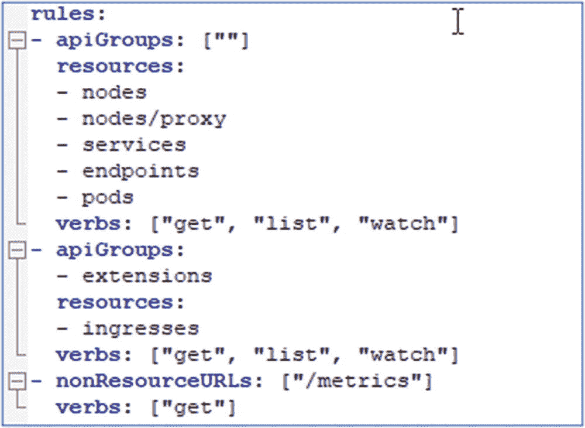
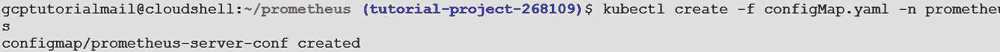

# 九、将 Prometheus 用于 GKE 监控

本章提供了指导您使用 Prometheus 进行 GKE 监控的实际操作步骤。此外，它还包括以下内容:

表 9-1

节点导出器

<colgroup><col class="tcol1 align-left"> <col class="tcol2 align-left"> <col class="tcol3 align-left"></colgroup> 
| 

**名称**

 | 

**描述**

 | 

OS

 |
| --- | --- | --- |
| 阿尔普 | 暴露来自`/proc/net/arp`的 ARP 统计 | Linux 操作系统 |
| 启动时间 | 暴露从`kern.boottime sysctl`得出的系统启动时间 | 达尔文，Dragonfly，FreeBSD，NetBSD，OpenBSD，Solaris |
| 中央处理器 | 公开 CPU 统计数据 | 达尔文，蜻蜓，FreeBSD，Linux，Solaris |
| 硬件服务 | 公开 CPU 频率统计信息 | Linux，Solaris |
| diskstats | 公开磁盘 I/O 统计信息 | 达尔文，Linux，OpenBSD |
| 文件系统 | 显示文件系统统计信息，如使用的磁盘空间 | 达尔文，蜻蜓，FreeBSD，Linux，OpenBSD |
| hwmon！hwmon | 暴露来自`/sys/class/hwmon/`的硬件监控和传感器数据 | Linux 操作系统 |
| 内存信息 | 公开内存统计信息 | 达尔文，蜻蜓，FreeBSD，Linux，OpenBSD |
| getclass(获取类) | 从`/sys/class/net/`暴露网络接口信息 | Linux 操作系统 |
| 子系统 | 显示网络接口统计信息，如传输的字节数 | 达尔文，蜻蜓，FreeBSD，Linux，OpenBSD |
| 显示网络连接 | 显示来自`/proc/net/netstat`的网络统计数据。这是和`netstat -s`一样的信息。 | Linux 操作系统 |
| 网络文件系统 | 显示来自`/proc/net/rpc/nfs`的 NFS 客户端统计数据。这是和`nfsstat -c`一样的信息。 | Linux 操作系统 |
| 服务器 | 展示来自`/proc/net/rpc/nfsd`的 NFS 内核服务器统计数据。这是和`nfsstat -s`一样的信息。 | Linux 操作系统 |
| 显示操作系统信息 | 公开 uname 系统调用提供的系统信息 | 达尔文，FreeBSD，Linux，OpenBSD |

图 9-8

配置映射 YAML 文件组件和子组件

图 9-7

为 Prometheus 创建集群角色和集群角色绑定

图 9-6.4

群集角色 YAML 文件组件和子组件

图 9-6.3

群集角色 YAML 文件组件

图 9-6.2

群集角色 YAML 文件演练

图 9-6.1

为 Prometheus 监控创建新的命名空间

图 9-6

Prometheus 监控的命名空间创建

图 9-5

验证克隆的文件

图 9-4.4

从 GitHub 克隆 Prometheus 代码

图 9-4.3

导航到`prometheus`目录

图 9-4.2

创建`prometheus`目录

图 9-4.1

移动到`gcptutorialmail`目录

图 9-4

创建`gcptutorialmail`目录

图 9-3

Prometheus 部署流程

图 9-2

YAML 文件构建块

图 9-1

Prometheus 建筑

*   Prometheus 概述

*   Prometheus 建筑

*   Prometheus on Google Kubernetes Engine

*   在 Kubernetes 集群上设置 Prometheus

*   出口商

## 介绍

Prometheus 是一项监控服务，为 IT 团队提供在 GCP 和 AWS 公共云上运行的应用和虚拟机的性能数据。它包括专门针对 Kubernetes 操作符的功能和 Kubernetes 的其他特性，比如 CPU 和内存利用率。可以按基础架构、工作负载和容器查看集群信息。

在本章中，你将学习如何安装 Prometheus。我们将使用在第 [8](08.html) 章中部署在 GKE 集群上的 Sock Shop 应用，并配置 Prometheus 来监控 GKE 集群，并提取与 CPU 利用率等相关的各种矩阵。

## Prometheus 概述

基于容器的技术正在影响基础设施管理服务的元素，如备份、修补、安全性、高可用性、灾难恢复等。监控就是这样一个元素，它随着容器技术的发展而突飞猛进。Prometheus 是最常作为开源监控和警报解决方案出现的容器监控工具之一。Prometheus 最初是在 SoundCloud 构思的，慢慢地，它成为了容器监控最受欢迎的工具之一。它主要是用 Go 语言编写的，并且是第一批云计算基础毕业项目之一。

Prometheus 支持基于键-值对的多维数据模型，这有助于收集作为时间序列数据的容器监控。它还提供了一种强大的查询语言，称为 Prometheus 查询语言(PromQL)。PromQL 允许实时选择和汇总时间序列数据。这些数据既可以作为图形、表格数据查看，也可以由外部系统通过 API 调用使用。Prometheus 还支持与第三方系统的各种集成，用于报告、警报、仪表板和导出器，从各种来源获取数据。

## Prometheus 建筑

现在让我们看看 Prometheus 架构的核心组件。图 [9-1](#Fig1) 展示了 Prometheus 的架构及其主要组件。

### Prometheus 服务器

这是一个主要的中央组件服务器，它从多个节点收集指标并将它们存储在本地。Prometheus 服务器的工作原理是抓取，即调用它被配置为监控的各种节点的指标端点。它定期收集这些指标，并将它们存储在本地。

Prometheus 服务器抓取并存储指标。这意味着您的应用必须公开一个指标可用的端点，并指示 Prometheus 服务器如何抓取它。

请注意，Prometheus 服务器使用了一个持久层，它是服务器的一部分，在文档中没有明确提到。服务器的每个节点都是自治的，不依赖于分布式存储。Prometheus 进行刮擦的时间是不确定的。因此，如果您的用例需要精确的逐秒抓取，Prometheus 可能不是一个好的选择。此外，Prometheus 毫无保留地专注于 HTTP。如果您在一个不使用 HTTP 的基于 SOAP 或基于 RPC 的整体环境中操作，您可能会遇到集成挑战。Prometheus 主要是一个拉动式系统；但是，它也提供了推送功能，这将在下一节中解释。

### Prometheus 推进网关

Prometheus 直接或通过中间推送网关从仪表化的应用中抓取指标。请将此视为一种缓冲形式。它接受并存储推送的指标，并为 Prometheus 公开一个可废弃的 API。Pushgateway 支持短期作业，以防节点不公开 Prometheus 服务器可以从中收集指标的端点。它捕获数据，将数据转换为 Prometheus 数据格式，然后将数据推送到 Prometheus 服务器。

### 出口商

导出器运行在受监控的主机上，该主机从第三方系统(如 Linux 服务器、MySQL 守护进程等)获取现有指标。)并将它们导出到 Prometheus 中的 metric 并将数据推送到 Prometheus 服务器。

### Alertmanager

Prometheus 有一个名为 Alertmanager 的警报模块，用于发送警报并将其路由到正确的接收者集成，如电子邮件、Slack 等。

### 网络用户界面

web UI 允许用户访问、可视化和绘制存储的数据。Prometheus 提供了自己的 UI，但是您也可以配置其他可视化工具，如 Grafana，使用 PromQL 访问 Prometheus 服务器。

### 关键容器监控功能

以下是 Prometheus 为容器监控提供的主要功能。

#### 多维数据模型

该模型基于键值对，类似于 Kubernetes 本身用标签组织基础设施元数据的方式。它允许灵活和准确的时间序列数据，为其 PromQL 提供动力。

#### 可访问格式和协议

公开 Prometheus 度量是一项非常简单的任务。指标是人类可读的，采用自我解释的格式，并使用标准的 HTTP 传输发布。您可以通过使用您的 web 浏览器来检查指标是否被正确公开。

#### 服务发现

Prometheus 服务器负责定期抓取目标，因此应用和服务不必担心发出数据(指标是提取的，而不是推送的)。Prometheus 服务器有几种自动发现刮擦目标的方法。一些服务器可以配置为过滤和匹配容器元数据，使它们非常适合短暂的 Kubernetes 工作负载。

#### 模块化和高度可用的组件

指标收集、警报、图形可视化等。由不同的可组合服务执行。所有这些服务都旨在支持冗余和分片。

#### 本地查询语言支持

如概述中所述，Prometheus 提供了一种函数式查询语言 PromQL，允许用户实时选择和汇总时间序列数据。表达式的结果可以在 Prometheus 的表达式浏览器中表示为图形或表格数据，也可以由外部系统通过 HTTP API 使用。

#### 支持仪表板和报告

Prometheus 支持与各种报告解决方案(如 Grafana 和 Splunk)集成，以获得运营使用的 Kubernetes 指标视图。这简化了用于库存管理、性能管理和事件管理的容器生态系统的操作管理任务。

## Prometheus on Google Kubernetes Engine

在第 [8](08.html) 章中，在部署我们的 Sock Shop 应用时，我们使用了一个 YAML 配置文件来提供在目标/工作者节点上部署应用所需的细节。在安装 Prometheus 和 Alertmanager 之前，我们想让您了解一下 YAML 文件结构的基本知识。YAML 是一种人类可读的数据序列化语言。它通常用于配置文件和存储或传输数据的应用中。YAML 是专门为常见情况创建的，例如:

*   配置文件

*   日志文件

*   跨语言数据共享

*   复杂的数据结构

在高层次上，以下是 YAML 文件的构建块，如图 [9-2](#Fig2) 所示。

*   **键值对:**YAML 文件中条目的基本类型是键值对。在键和冒号之后，有一个空格，然后是值。

*   **数组/列表:**列表的名字下有许多条目。列表的元素以“-”开头

*   **字典/地图:**一种更复杂的 YAML 文件是字典或地图。

现在，Kubernetes 的资源，比如 pod、服务和部署，都是通过使用 YAML 文件来创建的。在接下来的部分中，我们将通过使用一个 YAML 文件来介绍部署资源的创建，并且将为您提供一个在其中使用的关键字段的概述。

现在让我们从设置 Prometheus 和 Alertmanager 开始。在本练习中，我们将使用第 [8](08.html) 章中设置的相同容器环境。

## 在 Kubernetes 集群上设置 Prometheus

让我们开始在 Kubernetes 环境中设置 Prometheus。图 [9-3](#Fig3) 概述了部署 Prometheus 时我们将遵循的任务流程。

Prometheus 部署的步骤顺序如下:

1.  我们将首先在工作项目中连接到 Cloud Shell。

2.  然后我们将从 GitHub 克隆配置文件。

3.  然后，我们将使用在 Google Cloud Shell 中预配置的 kubectl 在 GKE 集群上创建一个名称空间。

4.  我们将在 GKE 群集上创建群集角色和群集角色绑定。

5.  我们将创建配置映射，然后在 GKE 集群上使用此配置映射部署 Prometheus。

6.  然后，我们将为最终用户访问 Prometheus 创建一个服务。

7.  最后，我们将使用命令行和 web 浏览器访问测试 Prometheus 部署的状态。

### 在 GKE 上安装和设置 Prometheus

#### 从 GitHub 克隆 Prometheus 代码

在从 GitHub 克隆 Prometheus 之前，首先，我们将在`/home`目录下创建`gcptutorialmail`文件夹，在`gcptutorialmail`下，我们将创建`prometheus`文件夹。这个`prometheus`文件夹包含了在 GKE 安装 Prometheus 所需的所有配置文件。

*   **步骤 1:** 执行以下命令，创建`gcptutorialmail`和`prometheus`文件夹。

*   **命令:**

*   `cd /home`

*   `mkdir gcptutorialmail`

*   **输出:**图 [9-4](#Fig4) 显示前一条命令的输出。

*   通过执行以下命令导航到`gcptutorialmail`文件夹。

*   **命令**:

*   `cd /gcptutorialmail`

*   **输出:**图 [9-4.1](#Fig5) 显示了前一条命令的输出。

*   现在，通过执行以下命令，在`gcptutorialmail`下创建`prometheus`文件夹。

*   **命令:** `mkdir prometheus`

*   **输出:**图 [9-4.2](#Fig6) 显示了前一条命令的输出。

*   通过执行以下命令，导航到`prometheus`文件夹。

*   **命令:** `cd /prometheus`

*   **输出:**图 [9-4.3](#Fig7) 显示了前一条命令的输出。

*   **第二步**:通过执行以下命令，从 GitHub ( [`https://github.com/dryice-devops/gcp-prometheus.git`](https://github.com/dryice-devops/gcp-prometheus.git) )克隆代码。

*   **命令:** `git clone` [`https://github.com/dryice-devops/gcp-prometheus.git`](https://github.com/dryice-devops/gcp-prometheus.git)

*   **输出:**图 [9-4.4](#Fig8) 显示了前一条命令的输出。

*   **验证克隆的文件**:从 GitHub 克隆文件后，您会看到以下文件:

*   `clusterRole.yaml`

*   `configMap.yaml`

*   `prometheus-deployment.yaml`

*   要验证前面的配置文件是否成功克隆到本地`prometheus`文件夹，请执行以下命令。

*   **命令** : `ll`

*   **输出**:图 [9-5](#Fig9) 显示前一条命令的输出。

#### 创建命名空间

要安装 Prometheus，第一步是在现有集群中创建一个单独的名称空间，用于逻辑隔离。为此，请执行以下步骤:

*   **步骤 1:** 在创建名称空间之前，确保使用以下命令连接到 GKE 集群名称`clustertutorial`。

*   **命令:** `gcloud container clusters get-credentials clustertutorial --zone us-central1-a --project tutorial-project-268109`

*   **输出:**图 [9-6](#Fig10) 显示前一条命令的输出。

*   **步骤 2:** 在 tutorial 项目的 Cloud Shell 上执行以下命令，从`prometheus`目录创建一个名为`prometheus`的新名称空间。

*   **命令:** `kubectl create namespace prometheus`

*   **输出:**图 [9-6.1](#Fig11) 显示了前一条命令的输出。

#### 群集角色 YAML 文件

让我们深入到`prometheus`文件夹中的集群角色 YAML 文件(`clusterRole.yaml`)的内容，以理解该部分及其相关性。该文件有两个部分:`ClusterRole`和`ClusterRoleBinding`。

##### 集群角色部分

###### apiVersion(堆叠版本)

文件的初始部分包含定义 Kubernetes API 版本的字段，通过该字段与 Kubernetes API 服务器进行交互。它通常用于创建对象。apiVersion 会有所不同，这取决于您环境中的 Kubernetes 版本。我们使用下面的 API version:`ClusterRole`的`rbac.authorization.k8s.io/v1beta1`。

###### 种类

`kind`字段定义了 Kubernetes 对象的类型，例如集群角色、部署、服务、pod 等。在我们的例子中，我们使用的是`ClusterRole`。

###### 元数据

此部分在文件中定义了名称子组件。`name`字段指定对象的名称。在我们的例子中，我们使用`prometheus`作为`name`，如图 [9-6.2](#Fig12) 所示。

###### 规则

规则是可以在属于不同 API 组(也称为遗留组)的一组资源上执行的一组操作(动词)。在我们的例子中，我们正在创建一个规则，允许用户在节点、代理、服务、端点和属于核心(在 YAML 文件中用`" "`表示)、应用和扩展的 pod 上执行几个操作。API 组规则有几个子组件元素。

*   `resources`:该字段定义了各种 Kubernetes 资源。

*   `verbs`:该字段定义了要对资源执行的操作。

*   这是一组用户应该有权访问的部分 URL。非资源 URL 没有命名空间。此字段仅适用于从群集角色绑定引用的群集角色。规则既可以应用于 API 资源(如`"pods"`或`"secrets"`)也可以应用于非资源 URL 路径(如`"/api"`)，但不能两者都应用，如图 [9-6.3](#Fig13) 。

##### 群集角色绑定部分

###### apiVersion(堆叠版本)

文件的初始部分包含定义 Kubernetes API 版本的字段，通过该字段与 Kubernetes API 服务器进行交互。它通常用于创建对象。API 版本会有所不同，这取决于您环境中的 Kubernetes 版本。对于集群角色绑定，我们使用下面的 API: `rbac.authorization.k8s.io/v1beta1`。

###### 种类

Kind 字段定义 Kubernetes 对象的类型，例如集群角色、部署、服务、pod 等。在我们的例子中，我们使用 ClusterRoleBinding。

###### 元数据

此部分在文件中定义了名称子组件。名称字段指定对象的名称。在我们的例子中，我们使用`prometheus`作为`name`。

*   `roleRef`:在这个字段中，我们将 Prometheus 集群角色绑定到监控名称空间内 Kubernetes 提供的默认服务帐户。这一部分还包含更多的子组件。
    *   `apiGroup`:该字段定义 rbac.authorization.k8s.io API 与 API 组交互

    *   `kind`:该字段定义了对象类型。

    *   `name`:集群角色的名称，如`prometheus`。

*   `Subjects`:这个部分定义了必须访问 Kubernetes API 的一组用户和进程。这一部分还包含更多的子组件。
    *   `kind:`该字段定义了服务账户的对象类型。

    *   由于每个 Kubernetes 安装都有一个名为 default 的服务帐户，它与每个正在运行的 Pod 相关联，所以我们使用相同的帐户:default。

    *   `namespace:`该字段定义了集群角色绑定的名称空间名称，例如，monitoring(我们在“创建名称空间”一节中创建的)，如图 [9-6.4](#Fig14) 所示。

现在，我们将为 Prometheus 创建刚刚创建的集群角色和集群角色绑定。

*   **步骤 1:** 在`prometheus`文件夹下创建角色，在教程项目的云 Shell 上使用下面的命令。

*   **命令:**

*   `kubectl create -f clusterRole.yaml`

*   **输出:**图 [9-7](#Fig15) 显示前一条命令的输出。

#### 创建配置图

ConfigMap 将用于从映像内容和警报规则中分离任何配置工件，这些内容和规则将作为`prometheus.yaml`和`prometheus.rules`文件安装到`/etc/prometheus`中的 Prometheus 容器中。

*   **步骤 1:** 我们将使用`prometheus`文件夹中的配置映射 YAML 文件来创建`ConfigMap`。现在让我们回顾一下 YAML 文件的内容。`ConfigMap`合并了数据段下的`prometheus.rules`和`prometheus.yaml`文件。

*   `apiVersion`:文件的初始部分定义了 Kubernetes 的 apiVersion 与 Kubernetes API 服务器交互的字段。它通常用于创建对象。apiVersion 会有所不同，这取决于您环境中的 Kubernetes 版本。

*   `kind`:`kind`字段定义了 Kubernetes 对象的类型，如集群角色、部署、服务、pod 等。我们使用`ConfigMap`作为宾语。

*   `metadata`:该部分具有在包含配置图数据的文件中定义的`name`子组件。
    *   `name` **:** 该字段具有配置图的名称。在我们的例子中，我们使用的是`prometheus-server-conf`。

    *   `labels` **:** 该字段定义了 ConfigMap 的标签，如`prometheus-server-conf`。

    *   `namespace` **:** 该字段定义将在其中创建 ConfigMap 的名称空间，例如监控，如图 [9-8](#Fig16) 所示。

*   `data`:该字段定义了`prometheus.rules`和`prometheus.yml`的内容，并在运行时将它们的信息传递给`ConfigMap`。

*   `prometheus.rules` **:** 此部分包含用于根据各种条件(例如，内存不足、磁盘空间不足等)生成警报的警报规则。我们选择了高 Pod 内存使用率。

*   `prometheus.yml` **:** Prometheus 通过一个配置文件进行配置，这个文件就是`prometheus.yml`。配置文件定义了与抓取作业及其实例相关的所有内容，以及要加载的规则文件。`prometheus.yml`包含所有有助于动态发现 Kubernetes 集群中运行的 pod 和服务的配置。以下是我们的 Prometheus 刮擦配置中的刮擦作业:
    *   `kubernetes-apiservers`:从 API 服务器获取所有的指标。

    *   `kubernetes-nodes`:此作业将收集所有 Kubernetes 节点指标。

    *   `kubernetes-pods`:如果 Pod 元数据用`prometheus.io/scrape`和`prometheus.io/port`注释进行了注释，将会发现所有的 Pod 指标。

    *   `kubernetes-cadvisor`:收集所有 cAdvisor 指标。

    *   `kubernetes-service-endpoints` **:** 如果服务元数据被标注了`prometheus.io/scrape`和`prometheus.io/port`标注，那么所有的服务端点都将被废弃。它将使用黑盒监控。

*   `prometheus.rules`:包含向预警管理器发送预警的所有预警规则。
    *   `global` **:** 全局配置指定在所有其它配置环境中有效的参数。`global`具有各种子组件，如下所示:
        *   `scrape_interval`:默认多长时间刮一次目标。我们选择 20 秒作为例子。

        *   `evaluation_interval`:刮取请求超时之前的时间长度。我们选择 20 秒作为例子。

    *   `rule_files`**:** This specifies a list of globs. Rules and alerts are read from all matching files that we defend under `prometheus.rules` and the path defined as `/etc/prometheus/prometheus.rules`, as shown in Figure [9-9](#Fig17).

        

        图 9-9

        配置映射 YAML 文件字段和子字段

*   **步骤 2:** 执行以下命令，从`prometheus`文件夹创建配置图。

*   **命令:** `kubectl create -f config-map.yaml –n prometheus`

*   **Output:** Figure [9-10](#Fig18) shows the output of the preceding command.

    

    图 9-10

    为 Prometheus 创建配置图

#### Prometheus 部署

在为 Prometheus 部署设置了角色、配置和环境之后，执行以下步骤在 GKE 上创建的 Kubernetes 集群上安装 Prometheus。

为了在 Kubernetes 集群上部署 Prometheus，我们将使用`prometheus`文件夹中的`prometheus-deployment.yaml`文件。

我们将使用来自 Docker hub 的官方 Prometheus Docker 映像 v2.12.0。在这种配置中，Prometheus ConfigMap 挂载作为一个文件放在`/etc/Prometheus`中。

以下是 Prometheus 部署文件的详细信息:

*   `apiVersion` **:** 该文件的开始部分定义了 Kubernetes 的 apiVersion 与 Kubernetes API 服务器交互的字段。它通常用于创建对象。apiVersion 根据您环境中的 Kubernetes 版本而有所不同。

*   `kind`**:**`kind`字段定义了 Kubernetes 对象的类型，例如集群角色、部署、服务、pod 等。我们将该对象用作部署。

*   `metadata` **:** 本节有文件中定义的名称子组件。
    *   该字段指定服务对象的名称，例如 prometheus-deployment。

    *   `namespace`: This field specifies the namespace of the service object, e.g., monitoring, as shown in Figure [9-11](#Fig19).

        

        图 9-11

        Prometheus 部署 YAML 文件演练

*   `spec` **:** 该字段指定服务。
    *   `replicas`:该字段提供特定情况下可用的 pod 数量的数据。

    *   `selector`:本节提供服务选择器的详细信息。
        *   `matchLabels` **:** This is the name that will be used to match and identify the service, as shown in Figure [9-12](#Fig20).

            

            图 9-12

            Prometheus 部署 YAML 文件演练

*   `template`:服务使用的端口类型
    *   `metadata` : `name`将用于匹配和识别服务。
        *   `labels`:一个键值对，附加在对象上，用于指定识别属性
            *   `app` =键

            *   `prometheus-server` =值

前述内容如图 [9-13](#Fig21) 所示。

图 9-38

黑盒度规

图 9-37

出口商名单

图 9-36

端口更新

图 9-35

获取黑盒导出器服务详细信息

图 9-34

安装黑盒导出器—续

图 9-33

安装黑盒导出器

图 9-32

节点度量

图 9-31

出口商名单

图 9-30

Prometheus 屏幕

图 9-29

端口转发

图 9-28

得到 Prometheus 号的名字

图 9-27

服务列表

图 9-26

节点导出器设置

图 9-25

服务列表

图 9-24

节点导出器安装—续

图 9-23

节点导出器安装

图 9-22

Prometheus 屏幕

图 9-21

Prometheus 屏幕

图 9-20

转发到端口 8080

图 9-19

端口转发运行 Prometheus

图 9-18

Prometheus 部署—续

图 9-17

Prometheus 部署

图 9-16

Prometheus 部署 YAML 文件演练—续

图 9-15

Prometheus 部署 YAML 文件演练—续

图 9-14

Prometheus 部署 YAML 文件演练—续

图 9-13

Prometheus 部署 YAML 文件演练—续

*   `Spec`:
    *   `containers`:容器对象的详细信息
        *   `name` **:** 容器的名称

        *   `image` **:** 映像配版本

        *   `args` **:** 创建容器时使用的参数
            *   `"--config.file=/etc/prometheus/prometheus.yml"`部署时要使用的文件名

            *   这决定了 Prometheus 在哪里写它的数据库

        *   `ports`**:T2**
            *   `containerport`–应用监听端口如图 [9-14](#Fig22) 所示。

*   **卷装载**:存储卷允许将现有的存储卷装载到您的 Pod 中。创建了两个`volumeMounts`:`prometheus-config-volume`和`prometheus-storage-volume`。`prometheus-config-volume`将使用我们的配置图来管理`prometheus.yml`。通过`prometheus-storage-volume`，我们创建了一个`emptyDir`来存储 Prometheus 数据。
    *   **名称:**这是卷的名称。

    *   **mouthPath:** 定义贴装路径，如图 [9-15](#Fig23) 所示。

*   卷(volume):这是一个包含数据的目录，运行在一个 Pod 中的所有容器都可以访问该目录中的数据，这些数据被装载到每个容器的文件系统中。它的寿命与 Pod 的寿命相同。将卷生命周期与容器生命周期分离，允许卷在容器崩溃和重新启动后继续存在。此外，卷可以由主机的文件系统或永久块存储卷支持，如 [AWS EBS](https://aws.amazon.com/ebs/) 或分布式文件系统。
    *   `name` **:** 卷名

    *   `configMap` **:** 使用 ConfigMap 的卷
        *   `defaultMode`

        *   `name`必须使用的配置图的定义名称。

        *   `name:`

        *   `emptyDir` **:** 当一个 Pod 被分配到一个节点时，第一次创建`emptyDir`卷，并且只要该 Pod 在我们用来存储 Prometheus 数据的那个节点上运行，该卷就存在，如图 [9-16](#Fig24) 所示。

按照下面的步骤，在 Kubernetes 集群上安装 Prometheus。

*   **第一步:**从`prometheus`目录执行以下命令。

*   **命令:** `kubectl apply -f prometheus-deployment.yaml -n prometheus`

*   **输出:**图 [9-17](#Fig25) 显示了前一条命令的输出。

要验证部署，请使用以下命令列出 Pod。

*   **命令:** `kubectl get pods -n prometheus`

*   **输出:**图 [9-18](#Fig26) 显示前一条命令的输出。

*   **步骤 2:** 要使服务能够访问 Prometheus UI，请使用带有我们之前收到的 Prometheus Pod 名称的端口转发命令。

*   **命令:** `kubectl port-forward prometheus-deployment-78fb5694b4-m46rq 8080:9090 -n prometheus`

*   **输出:**图 [9-19](#Fig27) 是端口转发的输出。它将设置 Grafana 在端口 9090 上运行。

*   **第三步**。要测试 Prometheus 部署的状态，请在将端口更改为 8080 后，转到 Cloud Shell 中的 web 预览来访问 UI。进入网页预览➤换港➤ 8080，如图 [9-20](#Fig28) 和 [9-21](#Fig29) 所示。

#### 出口商

导出器帮助从应用/Kubernetes 服务获取状态/日志/指标，并向 Prometheus 提供数据。它们类似于市场上其他监控工具中的适配器或插件。Prometheus 提供了一份官方和外部捐助的出口商名单。让我们通过访问下面的: [`https://prometheus.io/docs/instrumenting/exporters/`](https://prometheus.io/docs/instrumenting/exporters/) 来探索一些对容器基础设施监控有用的方法。

### 节点导出器

节点导出器是一个 Prometheus 导出器，用于获取 Unix/Linux 内核公开的硬件和操作系统指标。它是用 Go 语言编写的，带有可插拔的度量收集器。收集器根据操作系统类型的使用情况而有所不同。表 [9-1](#Tab1) 提供了几个例子。

#### 使用 Helm 图在 Prometheus 安装节点导出器

要安装节点导出器，需要 Helm 和 Helm 杆。头盔和 Helm 杆预配置了第 7 章的“部署 Grafana”一节中解释的云壳。

*   **步骤 1:** 执行以下命令来更新 Tiller 并分配一个服务帐户角色。

*   **命令:** `helm init --service-account tiller --history-max 200 –upgrade`

*   现在运行下面的命令，验证 Helm 和 Helm 杆是否运行顺畅。现在，您应该可以看到客户机和服务器的版本信息。

*   **命令:** `helm version`

*   **输出:**图 [9-22](#Fig30) 显示前一条命令的输出。

*   **第二步:**执行以下命令。它将从下面的 GitHub URL 下载导出器，并在 GKE 集群上安装节点导出器。

*   [T2`https://github.com/helm/charts/tree/master/stable/prometheus-node-exporter`](https://github.com/helm/charts/tree/master/stable/prometheus-node-exporter)

*   **命令:** `helm install --name node-exporter stable/prometheus-node-exporter`

*   **输出:**数字 [9-23](#Fig31) 和 [9-24](#Fig32) 显示前一条命令的输出。

*   **步骤 3:** 现在让我们使用下面的命令来验证节点导出器服务是否正在运行。

*   **命令:** `kubectl get svc`

*   **输出:**图 [9-25](#Fig33) 显示前一条命令的输出。

`node-exporter-prometheus-node-exporter`服务应该是可见的并且处于运行状态，如图 9-25 中突出显示的。还要注意服务的集群 IP，因为它将在下一步中使用。

*   **步骤 6:** 在 Prometheus UI 中，登录并导航到状态，然后导航到 Prometheus 上的目标，验证节点导出程序。然后执行下面的命令。

*   `$ kubectl port-forward prometheus-deployment-78fb5694b4-7z6dd 8080:9090 -n prometheus`

*   用黄色突出显示的代码是 Prometheus 的 Pod 名称，您可以通过执行以下命令获得它。

*   **命令:** `kubectl get pod -n prometheus`

*   **输出:**前一条命令的输出如图 [9-28](#Fig36) 所示。

*   端口转发的输出如图 [9-29](#Fig37) 所示。

*   在浏览器中打开 Prometheus，在状态下拉菜单下进入目标，如图 [9-30 所示。](#Fig38)

*   搜索`node-exporter`并确认其状态为 UP，如图 [9-31](#Fig39) 所示。

*   **步骤 7:** 现在让我们执行一个查询，开始收集和显示节点指标。单击图表选项卡。在表达式部分(文本框)下，键入“node_load15”并点击执行按钮，如图 [9-32](#Fig40) 所示。

*   `kubectl delete configmaps prometheus-server-conf -n=prometheus`

*   `kubectl create -f config-map.yaml`

*   `kubectl delete deployment prometheus-deployment -n prometheus`

*   `kubectl apply -f prometheus-deployment.yaml -n prometheus`

*   **步骤 4** :下一步是配置上一步安装的节点导出器。

*   导航到`prometheus`文件夹并打开`config-map.yaml`文件。在`scarpe_config`剖面下，找到`job name`和`static_configs`的`job_name: node_exporter`剖面和细节，如图 [9-26](#Fig34) 所示。

*   `job_name`:该字段表示节点导出器的作业名称。我们使用值`node-exporter`作为`job_name`。

*   `static_configs` **:** 这个部分有一个名为`targets`的小节。“目标”是指作业目标 10.81.13.221(群集 IP)和 9100，即运行节点导出的服务端口。您可以使用以下命令来验证您的集群 IP 和端口信息。

*   **命令:** `kubectl get svc`

*   **输出:**图 [9-27](#Fig35) 显示了前一条命令的输出。

*   **步骤 5:** 执行以下命令，以反映在之前步骤中对 Prometheus ConfigMap 所做的更改。

*   **命令:**

节点导出器主要用于监控容器基础设施的基础元素，而不是流程/服务。

### 黑盒导出器

黑盒导出器用于监控利用 HTTP、HTTPS(通过 HTTP 探测器)、DNS、TCP 和 ICMP 的网络端点。它用于黑盒监控场景，在这种场景中，从外部源执行对目标的监控，并且监控解决方案的主人不了解目标系统的内部结构细节。以下是配置黑盒导出器的步骤。

*   **步骤 5:** 从`prometheus`文件夹中执行以下命令，以验证 Prometheus 配置图和部署是否顺利运行。

*   **命令:** `kubectl get all -n= prometheus`

*   **第六步:**通过 [`https://8080-dot-10790352-dot-devshell.appspot.com/targets`](https://8080-dot-10790352-dot-devshell.appspot.com/targets) 登录 Prometheus GUI 查看`blackbox_http`终点，如图 [9-37](#Fig45) 所示。

*   **第 7 步:**单击 Prometheus GUI 中的 Graph 并执行以下查询，通过连接 Sock Shop 应用 URL 的阶段 [`http://34.70.226.32:80`](http://34.70.226.32) 和作业`"blackbox"`(图 [9-38](#Fig46) 中显示的 Sock Shop 应用 URL 在您的情况下可能会有所不同)来获得 HTTP 请求的持续时间。

*   **查询**:

*   `probe_http_duration_seconds{instance="http://34.70.226.32/",job="blackbox",phase="connect"}`

*   `$kubectl delete configmaps prometheus-server-conf -n=prometheus`

*   `$kubectl create -f configMap.yaml`

*   `$kubectl delete deployment prometheus-deployment -n prometheus`

*   `$kubectl apply -f prometheus-deployment.yaml -n prometheus`

*   **步骤 1:** 导航到`prometheus`文件夹，执行下面的 Helm 命令，安装黑盒导出器。黑盒导出器内容将从以下 GitHub 网址下载: [`https://github.com/helm/charts/tree/master/stable/prometheus-blackbox-exporter`](https://github.com/helm/charts/tree/master/stable/prometheus-blackbox-exporter) 。

*   **命令:** `helm install --name blackbox-exporter stable/prometheus-blackbox-exporter`

*   **输出:**数字 [9-33](#Fig41) 和 [9-34](#Fig42) 显示前一条命令的输出。

*   **步骤 2:** 从`prometheus`文件夹中执行以下命令，获取在 Prometheus ConfigMap 文件中配置黑盒导出器所需的黑盒服务细节，例如 clusterip (10.81.9.39)和 port (9115/TCP)。

*   **命令:** `kubectl get svc`

*   **输出:**图 [9-35](#Fig43) 显示前一条命令的输出。

*   **步骤 3:** 现在让我们在 Prometheus 中通过 Blackbox exporter 配置 HTTP 探针。导航到`prometheus`文件夹并打开`configMap.yaml`。找到名为“`job_name: 'blackbox'`的部分，并修改以下条目:
    *   `job_name` **:** 该字段表示作业的名称，在我们的例子中是`blackbox`。

    *   `metrics_path` **:** 该字段表示用于从目标应用获取度量的 HTTP 资源路径。

    *   `params` **:** 该部分下有一个名为`modules`的子部分。我们使用该模块进行 HTTP 200 响应监控。

    *   `static_configs` **:** 这个部分有一个名为`targets`的小节。在`targets`下面提到的网址是指你要监控的应用的网址。您可以用我们在第 [8](08.html) 章中部署的 sock Shop 应用 URL 来替换它。
        *   `relabel_configs` **:** 在本节中，用我们之前取的黑盒服务 IP:port 值修改`replacement`下的 URL 条目，例如 10.81.9.39:9115，如图 [9-36](#Fig44) 所示。

*   **步骤 4:** 执行以下命令，应用来自`prometheus`文件夹的 Prometheus 配置图和部署中的更改。

## 摘要

在本章中，你学会了使用 Prometheus 来监视 GKE。在下一章中，通过动手练习，您将看到如何使用基于 CI/CD 的自动化流水线来启用容器监控。