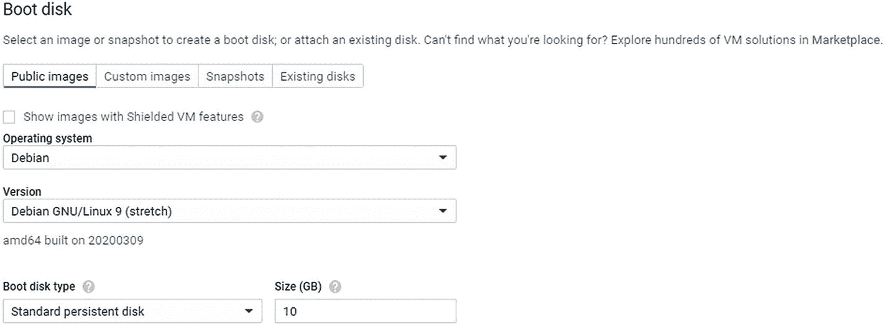
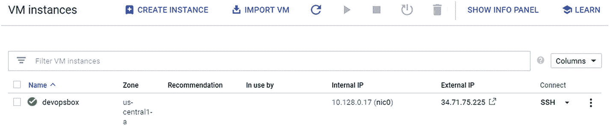
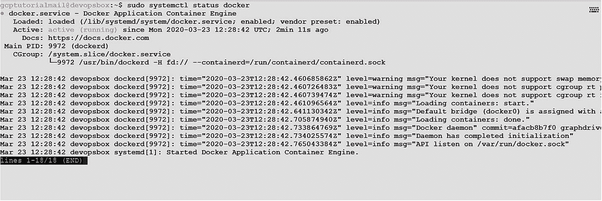

# 十、GKE 集群、应用和监控部署的自动化

本章提供了使用基础设施即代码(IaC)和 CI/CD 流水线来自动部署容器生态系统基础设施、应用和监控的实际操作步骤，包括以下内容:

*   清理 GKE 环境命名空间

*   安装 Jenkins

*   为 Jenkins Slave 创建服务

*   GKE 供应、应用部署和 Sysdig 代理，使用 Jenkins 流水线

*   从 Jenkins 流水线中删除 GKE 集群。

## 介绍

随着新平台和不断变化的技术的兴起，建立基础架构并在其上部署应用变得越来越复杂和耗时。此外，使用手动方法设置应用和基础架构增加了人为错误和安全风险的可能性。此外，一旦完成了基础设施的供应和应用部署，还必须管理其他方面，如可维护性、可伸缩性、容错性能等。

IaC 或基础设施即代码的兴起使得应用服务的重建从源代码存储库、应用数据备份和混合云 IaaS 或 PaaS 资源开始。我们利用基础架构和应用组件的规范定义，以可预测的方式调配和管理我们的基础架构。这意味着一个应用，不管它的环境或者托管在哪里，都可以完全从零开始，用一个预定义的需求列表来构建。同样的代码可以在生产、试运行和本地开发环境中运行。

另一个主要好处是构建的一致性。如果您必须管理多个环境，如开发、QA、试运行、生产等。，从相同的代码基础上构建它们，确保它们都以完全相同的方式运行，并遵守相同的策略/标准集。

以下是 IaC 工具如何操作的高级视图(图 [10-1](#Fig1) ):


图 10-1

IaC 如何工作

1.  您在文件中描述了所需的基础架构资源(例如，具有三个公共子网的虚拟网络，其中一个子网上的计算实例连接了一个数据块卷)。我们不需要描述如何创建资源，因为 IaC 解决方案管理着这种复杂性，并为开发人员或基础设施运营团队提供了一个抽象视图来关注服务定义部分。

2.  IaC 工具通常会扫描描述服务定义代码，并在创建新资源之前验证资源是否已经存在。

3.  如果资源不存在，则创建它们。

4.  如果资源已经具有相同的属性，则不采取任何操作(因为您所期望的已经存在)。

5.  如果找到有差异的匹配资源，IaC 工具会认为您希望对它们进行更改，并使更改发生。

6.  在任何情况下，该工具都不会抛出错误/失败/创建意外的重复资源，因为这些操作是等幂的。

随着 DevOps 的不断发展，开发人员找到了加强 IaC 和容器集成的方法，因为它们是相辅相成的。容器将 IaC 作为核心组件合并到开发周期中。

我们可能需要配置一个容器协调器，比如 Kubernetes，以保持一定数量的映像副本运行，我们可能需要其他基础设施和资源，比如负载均衡器、DNS 条目、TLS 证书、仪表板、警报和日志记录。云中的容器化应用可能看起来像下图(图 [10-2](#Fig2) )，其中容器映像只是整个应用的一部分。


图 10-2

容器映像之外的容器化应用组件

完整的应用通常是容器映像和包含所有这些配置的 IaC 模板的组合。该映像捆绑了应用的所有依赖项，比如系统库，所以理想情况下，它应该在开发和生产环境中完全相同地运行。但是，如果环境是手动部署的，那么由于配置的差异，同一映像可能无法跨多个环境工作。现在，为了让应用表现相同，在这些环境中使用完全相同的基础架构配置也很重要。

通过在 CI/CD 流水线中使用 IaC 解决方案，我们现在可以轻松管理基础架构和应用组件的配置和修改，而无需担心配置不匹配、安全风险、人为错误等问题。图 [10-3](#Fig3) 显示了我们发布流程的一个简化示例。


图 10-4

编排应用和 sydig 代理安装


图 10-3

CI/CD 流水线利用 IaC 自动监控容器

IaC 模板包含与容器相关的配置和底层基础设施(例如，负载均衡器)。在流水线的“构建”阶段，构建并推送容器映像，并将新容器映像的唯一 ID 作为代码模板插入到基础结构中。流水线的每个阶段，如“开发”和“生产”，然后部署相同的基础设施作为代码模板。这可确保每个环境都以可预测、标准化和加速的方式部署，并根据要求提供所有必需的控制和最佳实践。同样的概念现在可以扩展到还包括启用操作控制，如监控、安全、备份等。确保在任何环境中部署应用服务时，其所有必要的操作组件集成都可用。

在接下来的部分中，我们将带您进行一次实践练习，以使用`gcloud`命令行界面工具和 Jenkins。在本章的后面，我们还将介绍使用 Jenkins 的应用部署场景。

## 清理 GKE 环境命名空间

在我们开始之前，让我们清理一下在第 9 章中创造的 GKE 环境。清理之后，我们将在 Jenkins 中设置自动化流程，以创建集群、防火墙、应用部署、Sysdig 代理安装和集群删除。首先，我们将删除 GCP 现有的 GKE 集群名称`clustertutorial`,我们在前面章节中提到的 Sock Shop 应用，以及 Sysdig 代理，它是在前面章节中手动配置的。

登录到 GCP 控制台，导航到 Kubernetes 引擎，然后单击集群。接下来，选中集群名称的复选框:start with clustertutorial，然后点击页面顶部最右侧的 Delete 按钮，删除集群，如图 [10-5](#Fig5) 所示。


图 10-5

GKE 集群集群教程删除

### 环境设置

在本节中，我们将使用`gcloud`来创建/删除 GKE 集群和防火墙规则。Sysdig 将用于监控容器生态系统。为了协调所有这些步骤，我们将使用 Jenkins。

在安装 Jenkins(版本 2.2.4.5)之前，我们将首先在 GCP 创建一个 VM，然后在 VM 上安装 Java、kubectl 和 Docker。


图 10-6

GCP 计算引擎

*   **第一步:**登录 GCP 控制台，导航到计算引擎，选择虚拟机实例，如图 [10-6](#Fig6) 所示。


图 10-7

用于创建虚拟机的 GCP 虚拟机实例

*   **步骤 2:** 一旦虚拟机实例页面打开，点击创建实例按钮，创建一个新的虚拟机(图 [10-7](#Fig7) )。


图 10-8

GCP 虚拟机实例创建

*   **步骤 3:** 选择任何合适的名称(例如，我们将我们的虚拟机命名为 devopsbox)，并选择区域 us-central1(爱荷华州)和区域 us-central 1-a(图 [10-8](#Fig8) )。



图 10-8.2

在 GCP 创建虚拟机—续


图 10-8.1

在 GCP 创建虚拟机

*   **步骤 4:** 创建一个机器类型为 n1-standard-2 的虚拟机(图 [10-8.1](#Fig9) 和 [10-8.2](#Fig10) )。


图 10-8.3

在 GCP 创建虚拟机—续

*   **步骤 5:** 为服务帐户选择应用引擎默认值，并选中防火墙部分中的允许 HTTP 流量。单击“create”按钮，以调配虚拟机。这将确保我们可以从外部网络访问我们的 Jenkins 实例，如图 [10-8.3](#Fig11) 所示。



图 10-8.4

在 GCP 创建虚拟机—续

*   **第 6 步:**一旦创建了一个新的虚拟机，你会在虚拟机实例页面看到同样的内容，如图 [10-8.4](#Fig12) 所示。


图 10-8.5

连接虚拟机

*   **第七步:**要连接新创建的虚拟机，点击开始，然后在浏览器窗口中选择打开，如图 [10-8.5](#Fig13) 所示。

### 设置停靠站

现在，我们将在 GCP 虚拟机上使用 19.03.8 版本的 Docker CE 来建立基于 Docker 的容器生态系统。


图 10-9.1

Docker 安装—续


图 10-9

Docker 设备

*   **步骤 1** :通过执行以下命令来更新包。结果将如图 [10-9](#Fig14) 和 [10-9.1](#Fig15) 所示。

```
$ sudo apt update

```


图 10-9.3

Docker 安装—续


图 10-9.2

Docker 设备

*   **步骤 2** :通过执行以下命令，安装其他必备包。结果将如图 [10-9.2](#Fig16) 和 [10-9.3](#Fig17) 所示。

```
$ sudo apt install apt-transport-https ca-certificates curl gnupg2 software-properties-common

```


图 10-9.4

坞站安装-contined

*   **步骤 3** :通过执行以下命令，为 Docker 存储库添加一个 GPG 键。输出如图 [10-9.4](#Fig18) 所示。

```
$ curl -fsSL https://download.docker.com/linux/debian/gpg | sudo apt-key add –

```


图 10-9.5

Docker 设备

*   **步骤 4** :通过执行以下命令，将 Docker 存储库添加到 APT 源代码中。该命令的输出如图 [10-9.5](#Fig19) 所示。

```
$ sudo add-apt-repository "deb [arch=amd64] https://download.docker.com/linux/debian $(lsb_release -cs) stable"

```


图 10-9.6

Docker 安装—续

*   **步骤 5** :通过执行以下命令，用新添加的 repo 中的 Docker 包更新包数据库。结果如图 [10-9.6](#Fig20) 所示。

```
$ sudo apt update

```


图 10-9.8

Docker 安装—续


图 10-9.7

Docker 安装—续

*   **步骤 6** :执行以下命令，确保从 Docker repo 安装，而不是默认的 Debian repo。命令的结果如图 [10-9.7](#Fig21) 和 [10-9.8](#Fig22) 所示。

```
$ apt-cache policy docker-ce

```


图 10-9.10

Docker 社区版安装—续


图 10-9.9

Docker 社区版安装

*   **步骤 7** :运行以下命令安装 Docker 社区版 19.03.8。结果如图 [10-9.9](#Fig23) 和 [10-9.10](#Fig24) 所示。

```
$ sudo apt install docker-ce

```



图 10-9.11

检查 Docker 安装的状态

*   **步骤 8** :通过执行以下命令检查 Docker 服务的状态。该命令的结果如图 [10-9.11](#Fig25) 所示。

```
$ sudo systemctl status docker

```


图 10-9.12

Docker 安装— `username`增加

*   **第 9 步**:为了避免每次运行 Docker 命令时都键入`sudo`，通过执行以下命令将`username`添加到 Docker 组。结果如图 [10-9.12](#Fig26) 所示。

```
$ sudo usermod -aG docker ${USER}

```


图 10-9.13

验证 Docker 版本

*   **第 10 步**:验证更改，退出虚拟机，重新连接。

*   **步骤 11** :通过执行以下命令验证 Docker 版本。结果如图 [10-9.13](#Fig27) 所示。

```
$ docker version

```

### 设置 kubectl

为了在 GKE 上连接和部署应用和 Sysdig 代理，必须在 VM 上安装 kubectl。

*   **步骤 1** :执行以下命令安装 kubectl。


图 10-10

安装 kubectl

*   前面代码的输出如图 [10-10](#Fig28) 所示。

```
$ curl -LO https://storage.googleapis.com/kubernetes-release/release/`curl -s https://storage.googleapis.com/kubernetes-release/release/stable.txt`/bin/linux/amd64/kubectl

```


图 10-10.1

使 kubectl 可执行

*   **步骤 2** :用下面的命令使 kubectl 可执行。结果如图 [10-10.1](#Fig29) 所示。

```
$ chmod +x ./kubectl

```

*   **步骤 3** :用下面的命令将 kubectl 移动到 usr/local/bin。


图 10-10.2

kubectl 安装验证

*   **步骤 4** :通过执行以下命令来验证 kubectl 安装。结果如图 [10-10.2](#Fig30) 所示。

```
$ sudo mv ./kubectl /usr/local/bin/kubectl

```

```
$ kubectl version –client

```

### 安装 Java 开发工具包(JDK)

为了配置 Jenkins 从属服务器，需要在虚拟机上安装 JDK。执行以下步骤来安装 Java 版本 1.8.0_242。


图 10-11

JDK 装置

*   **步骤 1** :通过执行以下命令来更新包。结果如图 [10-11](#Fig31) 所示。

```
$ sudo apt-get update

```


图 10-11.1

JDK 装置

*   **第二步**:执行以下命令，安装 JDK。结果如图 [10-11.1](#Fig32) 所示。

```
$ sudo apt-get install default-jdk

```


图 10-11.2

JDK 安装—续

*   **第三步**:按 Y 键继续 Java 设置，如图 [10-11.2](#Fig33) 所示。


图 10-11.3

JDK 安装验证

*   **步骤 4** :通过执行以下命令来验证 Java 安装。结果如图 [10-11.3](#Fig34) 所示。

```
$ java -version

```

## 安装 Jenkins

为了协调 GKE 配置和应用部署，我们将使用 Jenkins 版本 2.204.1。执行以下步骤来安装和配置 Jenkins。


图 10-12

Jenkins 主目录安装

*   **第一步**:执行下面的命令创建`Jenkins_home directory`。这是 Jenkins 保存其所有配置和作业的地方，在用户的主目录下(例如，`/home/gcptutorial`)。命令的结果如图 [10-12](#Fig35) 所示。

```
$ mkdir Jenkins_home

```


图 10-12.2

Jenkins 安装—续


图 10-12.1

Jenkins 装置

*   **步骤 2** :执行以下命令安装 Jenkins。结果如图 [10-12.1](#Fig36) 和 [10-12.2](#Fig37) 所示。

```
$ docker run -d --name jenkins -p 8080:8080 -p 50000:50000 -v /home/gcptutorialmail/jenkins_home:/var/jenkins_home jenkins/jenkins:lts

```


图 10-12.3

获取 Jenkins 初始管理员密码

*   **步骤 3** :执行以下命令获取 Jenkins secrets 密码。结果如图 [10-12.3](#Fig38) 所示。

```
$ sudo cat jenkins-data/secrets/initialAdminPassword

```

我们必须设置防火墙规则，以允许端口 8080 和 50000 上的访问，从而连接 Jenkins 主服务器和它的从服务器。


图 10-13

防火墙规则页面

*   **步骤 1** :为 Jenkins 创建一个防火墙规则，允许虚拟机获得端口 8080 和 50000 的入站连接。进入 VPC 网络，点击防火墙规则，如图 [10-13](#Fig39) 所示。


图 10-13.1

为 Jenkins 创建防火墙规则

*   **第二步**:在防火墙页面点击创建防火墙规则，如图 [10-13.1](#Fig40) 所示。


图 10-14.2

为 Jenkins 创建防火墙规则—续


图 10-14.1

为 Jenkins 创建防火墙规则—续


图 10-14

为 Jenkins 创建防火墙规则—续

*   **第三步**:填写防火墙选项，如下:

*   **Name** :如前所述，选择一个有意义的名字，比如 firewall-rule-devopsbox。

*   **日志选项**:选择关闭。

*   **网络**:选择默认。

*   **优先级** : 1000

*   **交通方向**:入口

*   **匹配动作**:允许

*   **目标**:选择指定的目标标签，并将 devopsbox 作为该防火墙规则将应用的**目标标签**的名称。

*   **源 IP 范围**:前述的 0.0.0.0/0

*   **协议和端口**:选择指定的协议。

*   **端口**:选择 tcp 作为协议，上述端口 8080 和 50000。

*   点击创建按钮，如图 [10-14](#Fig41) 、 [10-14.1](#Fig42) 和 [10-14.2](#Fig43) 所示。


图 10-15

获取 Jenkins 外部 IP

*   **第 4 步**:要访问 Jenkins，导航至计算引擎并选择虚拟机实例。获取外部 IP，例如 34.71.75.255，并复制它。现在导航到网页浏览器中的新标签页，粘贴端口为 8080 的外部 URL(如`http://34.71.75.255:8080`)以打开 Jenkins 网页，如图 [10-15](#Fig44) 所示。


图 10-16

第一次访问 Jenkins 控制台

*   **第五步**:使用从“安装 Jenkins”部分的第三步“解锁 Jenkins”页面获取的 secrets 密码，点击继续按钮，如图 [10-16](#Fig45) 所示。


图 10-17

选择附加的 Jenkins 功能

*   **第六步**:点击安装建议插件选项，安装创建流水线所需的各种插件，如图 [10-17](#Fig46) 所示。


图 10-18

选择建议的 Jenkins 插件选项

*   **第七步**:点击继续进行，如图 [10-18](#Fig47) 。


图 10-19

Jenkins 第一个管理员用户设置

*   **第八步**:在弹出的表单上填写用户名、密码、全名、邮箱等详细信息，点击保存并继续，如图 [10-19](#Fig48) 所示。


图 10-20

Jenkins 实例配置页

*   **第九步**:点击保存完成继续，如图 [10-20](#Fig49) 。


图 10-21

Jenkins 准备好了。

*   **步骤 10** :点击开始使用 Jenkins 按钮完成安装，如图 [10-21](#Fig50) 所示。


图 10-22

第一次 Jenkins 控制台

*   您将看到 Jenkins 控制台的以下屏幕(图 [10-22](#Fig51) )。

### Jenkins 从机设置

执行以下步骤来设置 Jenkins 从属可执行文件。

*   **步骤 1** :通过 root 用户执行以下命令，导航到`/home directory of user and create sub directory jenkins_slave`，授予 700 权限。`Jenkins_node directory`将被 Jenkins 节点用来连接和执行命令。


图 10-22.2

设置 Jenkins 节点—续


图 10-22.1

设置 Jenkins 节点

*   **步骤 2** :导航到前面步骤中用于访问 Jenkins 的 Jenkins URL。使用您在前面步骤中设置的管理员密码。导航到管理 Jenkins➤管理节点➤新节点，如图 [10-22.1](#Fig52) 和 [10-22.2](#Fig53) 所示。

```
$ cd ~
$ mkdir jenkins_slave
$ chmod 700 jenkins_slave

```


图 10-23

设置 Jenkins 节点

*   **步骤 3** :使用以下值填写表格:

*   **名称**:使用您选择的任何名称。在我们的例子中，我们选择了前面提到的 devopsbox。

*   **描述**:使用任何有意义的描述，例如 devopsbox。

*   **:如前所述，我们输入了 1，来表示与这个 Jenkins 奴隶相关的执行者的数量。**

***   **远程根目录**:Jenkins slave 存储其工作空间和配置的文件夹路径。为此，我们创造了`/var/Jenkins_home`。

    *   **标签**:使用前面提到的 devopsbox 标签。

    *   **用途**:选择尽可能使用该节点。

    *   **启动方式**:连接主机选择启动代理。

    *   图 [10-23](#Fig54) 显示了用前面的值完成的表格。** 

 **

图 10-24

验证 Jenkins 节点

*   **第四步**:点击保存按钮，保存配置。

*   **步骤 5** :通过查看 Jenkins 控制台状态，验证代理配置成功。

*   代理已配置，但尚未与 Jenkins master 连接，如图 [10-24](#Fig55) 所示。


图 10-25

复制 Jenkins 节点的`agent.jar`链接 URL

*   **第六步**:连接 Jenkins master，点击 devopsbox 一次，打开代理页面，右键点击 agent.jar，复制链接地址，如图 [10-25](#Fig56) 所示。


图 10-27

虚拟机上 Jenkins `agent.jar`文件的下载完成


图 10-26

在虚拟机上下载 Jenkins `agent.jar`文件

*   **第 7 步**:现在登录虚拟机并导航到`jenkins_slave`目录，执行以下命令下载 Jenkins 从 jar。命令的结果如图 [10-26](#Fig57) 和 [10-27](#Fig58) 所示。

```
$ cd Jenkins_slave
$ wget http://35.192.203.53:8080/jnlpJars/agent.jar

```


图 10-28

验证虚拟机上的 Jenkins `agent.jar`文件

*   **步骤 8** :通过执行以下命令，验证`agent.jar`是否下载。结果如图 [10-28](#Fig59) 所示。

```
$ ls -ltr

```


图 10-29

更改虚拟机上 Jenkins `agent.jar`文件的权限

*   **步骤 9** :通过执行以下命令，将权限改为 700，并验证`agent.jar`的权限。结果如图 [10-29](#Fig60) 所示。

```
$ chmod 700 agent.jar
$ ls -ltr

```

## 为 Jenkins Slave 创建服务

现在，我们将创建基于 Linux 的服务，从 Jenkins 主机连接 Jenkins 从机。


图 10-31

在虚拟机上创建 Jenkins 从属服务—续


图 10-30

在虚拟机上创建 Jenkins 从属服务

*   **第一步**:导航到`/etc/systemd/system`目录，创建一个`jenkinsslave.service`文件。复制以下内容并保存文件，如图 [10-30](#Fig61) 和 [10-31](#Fig62) 所示。

```
[Unit]
Description=jenkinsslave
Wants=network-online.target
After=network-online.target
[Service]
Type=simple
ExecStart=/usr/bin/java -jar /home/gcptutorialmail/jenkins_slave/agent.jar -jnlpUrl http://35.225.33.158:8080/computer/devopsbox/slave-agent.jnlp \
-secret 24b23df5ca08cc4ece2f3a511e41ffc1c96729fc81ea8cdfb1786d6e11c47958 -workDir "/var/jenkins_home"
Restart=always
RestartSec=1
[Install]
WantedBy=multi-user.target

```


图 10-32

在虚拟机上创建 Jenkins 从属服务—续

*   **步骤 2** :要启动服务，通过执行以下命令切换到 root 用户。前面命令的结果如图 [10-32](#Fig63) 所示。

```
$ sudo su –

```


图 10-33

在虚拟机上启动/验证 Jenkins 从属服务的状态

*   **步骤 3** :执行以下命令，启动并验证服务。结果如图 [10-33](#Fig64) 所示。

```
$ systemctl start jenkinsslave
$ systemctl status jenkinsslave

```


图 10-34

从根用户虚拟机注销

*   **步骤 4** :执行以下命令，退出 root 用户会话。结果如图 [10-34](#Fig65) 所示。

```
$ exit

```


图 10-35

在 Jenkins 节点页面上验证 Jenkins 代理是否已连接

*   **步骤 5** :为了验证代理是否已连接并正在运行，导航到 Jenkins➤节点，然后单击 devopsbox。

*   你会看到代理已经连接，如图 [10-35](#Fig66) 所示。

## GKE 供应、应用部署和 Sysdig 代理，使用 Jenkins 流水线

现在，我们将创建 Jenkins 流水线`CICD-GKEProv-Sysdig`来自动化以下流程。


图 10-36

创建 Jenkins 流水线

*   **代码克隆**:从以下 GitHub 库克隆 Sock Shop 和 Sysdig 代理部署代码: [`https://github.com/dryice-devops/GCP.git`](https://github.com/dryice-devops/GCP.git) 。

*   **创建集群**:用`gcloud`在 GKE 创建一个 Kubernetes 集群`clustertutorial`。

*   **创建防火墙规则**:为 Sysdig 代理的端口 6443 创建一个入口/出口防火墙规则。

*   **部署应用**:通过 kubectl 在 EKS 上部署 Sock Shop 应用。

*   **部署 Sysdig 代理**:通过 kubectl 在 EKS 上部署 Sysdig 代理。

*   **步骤 1** :导航至以下网址，访问 Jenkins。使用在前面步骤中设置的管理员密码。点击新建项目，如图 [10-36](#Fig67) 所示。

*   **URL** : `http://EXTERNAL_IP:8080`


图 10-36.1

创建 Jenkins 流水线

*   **第二步**:填写表格。输入“CICD-GKEProv-Sysdig”作为项目名称，并选择 Pipeline，因为我们在 Jenkins 中使用 Pipeline 作为代码来自动化之前定义的流程。点击确定，如图 [10-36.1](#Fig68) 继续。


图 10-37

创作 Jenkins 剧本

*   **第三步**:点击 Pipeline，会显示一个脚本框，我们将在其中编写 Jenkins 脚本，如图 [10-37](#Fig69) 所示。


图 10-37.1

保存 Jenkins 脚本

*   **第四步**:将从 [`https://github.com/dryice-devops/GKE/blob/master/jenkinsfile-gke-creation`](https://github.com/dryice-devops/GKE/blob/master/jenkinsfile-gke-creation) 中取出的`jenkinsfile-gke-creation`文件的`jenkinsfile`复制到同一个脚本框中，然后点击保存按钮，如图 [10-37.1](#Fig70) 所示。

Jenkinsfile 的创建包括以下五个阶段:

1.  **从 GitHub** 克隆代码:在这个阶段，我们从下面的 GitHub 库克隆代码: [`https://github.com/dryice-devops/GCP.git`](https://github.com/dryice-devops/GCP.git) 。

    The repository contains the following files:
    1.  `complete-demo.yaml`:一个配置文件，包含 Kubernetes 上 Sock Shop 应用部署的细节，如第 [4 章](04.html)所述。

    2.  `sysdig-agent-clusterrole.yaml`:为 Sysdig 代理创建集群角色的配置文件。这在第 7 章中有所涉及。

    3.  `sysdig-agent-configmap.yaml`:为 Sysdig 代理创建 ConfigMap 的配置文件。这在第 7 章中有所解释。

    4.  `sysdig-agent-daemonset-v2.yaml`:为 Sysdig 代理创建 daemonset 的配置文件，在第 [7](07.html) 章中有所说明。

2.  **在 GKE 创建集群集群教程**:在这个阶段，我们使用下面的命令在 GKE 通过`gcloud`创建三个基于节点的 Kubernetes 集群，命名为`clustertutorial`。

`sh "gcloud container clusters create clustertutorial --num-nodes=3 --zone=us-central1-a"`


图 10-37.3

Jenkins 脚本中的入站/出站防火墙规则—续


图 10-37.2

Jenkins 脚本中的入站/出站防火墙规则

1.  **在 GKE** 创建入站/出站防火墙:在 Jenkinsfile 配置的第三阶段，我们将使用图 [10-37.2](#Fig71) 和图 [10-37.3](#Fig72) 所示的`gcloud`命令为 Sysdig 代理在端口 6443 上的入站和出站连接创建有状态防火墙规则。

2.  **在 GKE 集群**上部署应用:在这个阶段，我们将创建`sock-shop`名称空间，并在 GKE 集群上部署 Sock Shop 应用，方法是使用下面的 kubectl 命令。

    ```
    sh " export KUBECONFIG=~/.kube/config &&  kubectl create namespace sock-shop "

    sh " export KUBECONFIG=~/.kube/config && kubectl apply -f '${WORKSPACE}/complete-demo.yaml'  "

    ```

3.  在 GKE 部署 Sysdig:在这个阶段，我们通过 kubectl 在 GKE 部署 Sysdig 代理。
    1.  通过执行以下命令来创建`ns`名称空间:

        `sh " export KUBECONFIG=~/.kube/config && kubectl create ns sysdig-agent"`

    2.  在下面的命令中，您必须根据 Sysdig 设置访问键(用黄色突出显示)来更改访问键。

        `sh " export KUBECONFIG=~/.kube/config && kubectl create secret generic sysdig-agent --from-literal=access-key=effdab9c-9554-4274-9042-9e8331e1d78b -n sysdig-agent "`

    3.  通过执行以下命令，为 Sysdig 代理创建一个集群角色:

        `sh " export KUBECONFIG=~/.kube/config && kubectl apply -f '${WORKSPACE}/sysdig-agent-clusterrole.yaml' -n sysdig-agent "`

    4.  通过执行以下命令，在 GKE 集群中为 Sysdig 代理创建一个服务帐户:

        `sh " export KUBECONFIG=~/.kube/config && kubectl create serviceaccount sysdig-agent -n sysdig-agent "`

    5.  定义授予集群角色中的 Sysdig 代理角色的集群角色绑定。

        `sh " export KUBECONFIG=~/.kube/config && kubectl create clusterrolebinding sysdig-agent --clusterrole=sysdig-agent --serviceaccount=sysdig-agent:sysdig-agent "`

    6.  使用以下命令应用`sysdig-agent-configmap.yaml`文件。您不必更改该文件中的任何内容。

        `sh " export KUBECONFIG=~/.kube/config && kubectl apply -f '${WORKSPACE}/sysdig-agent-configmap.yaml' -n sysdig-agent"`

    7.  使用以下命令应用`daemonset-v2.yaml`文件。您不必更改该文件中的任何内容。

        `sh "export KUBECONFIG=~/.kube/config && kubectl apply -f '${WORKSPACE}/sysdig-agent-daemonset-v2.yaml' -n sysdig-agent"`


图 10-38

执行 Jenkins 脚本

*   **第五步**:点击【立即构建】执行 Jenkins 作业，如图 [10-38](#Fig73) 所示。


图 10-39.2

查看 Jenkins 日志中的应用和 Sysdig 代理部署—续


图 10-39.1

查看 Jenkins 日志中的应用和 Sysdig 代理部署—续


图 10-39

查看 Jenkins 日志，了解应用和 Sysdig 代理的部署情况

*   **步骤 6** :一旦作业成功执行，以下构建历史将以蓝色显示构建编号。如果有错误，它将是红色的。它还在阶段视图下显示了阶段。要查看日志，请单击内部版本号(#)。接下来，单击控制台输出。图 [10-39](#Fig74) 、 [10-39.1](#Fig75) 和 [10-39.2](#Fig76) 说明了上述情况。

在日志控制台中，向下滚动屏幕的四分之三，得到新创建的 EKS 节点的详细信息，如图 [10-39.3](#Fig77) 、 [10-39.4](#Fig78) 、 [10-39.5](#Fig79) 和 [10-39.6](#Fig80) 所示。


图 10-39.6

查看 Jenkins 日志中的应用和 Sysdig 代理部署—续


图 10-39.5

查看 Jenkins 日志中的应用和 Sysdig 代理部署—续


图 10-39.4

查看 Jenkins 日志中的应用和 Sysdig 代理部署—续


图 10-39.3

查看 Jenkins 日志中的应用和 Sysdig 代理部署—续


图 10-40

查看 GCP 控制台

*   **第 7 步**:导航到你的 GCP 账户控制台，点击计算。接下来，选择 Kubernetes 引擎，然后选择集群，如图 [10-40](#Fig81) 。


图 10-40.1

查看 GCP 控制台—续

*   您将看到 GKE `clustertutorial`集群处于活动状态。这是我们通过 Jenkins 和`gcloud`创建的同一个集群(参见图 [10-40.1](#Fig82) )。


图 10-40.2

从 GCP 控制台获取 Sock Shop 应用的 IP 地址

*   现在点击 Services & Ingress，获取 Sock Shop 应用的 URL，如图 [10-40.2](#Fig83) 所示。


图 10-40.4

打开袜子商店应用


图 10-40.3

从 GCP 控制台获取 Sock Shop 应用的 IP 地址—续

*   导航到前端服务并复制负载均衡器类型的端点，以便打开 Sock Shop 应用，如图 [10-40.3](#Fig84) 和 [10-40.4](#Fig85) 所示。


图 10-41

查看 Sysdig 控制台

*   **步骤 8** :现在让我们导航到 Sysdig 控制台，确认我们的 GKE 集群已经被添加到 Monitor 下。导航到 Sysdig 网址( [`https://sysdig.com/`](https://sysdig.com/) `)`，用你的凭证登录，如图 [10-41](#Fig86) 所示。


图 10-42

查看 Sysdig 控制台—续

*   导航浏览➤主机和容器，然后选择按容器概述，如图 [10-42](#Fig87) 所示。


图 10-43

查看 Sysdig 控制台—续

*   现在，根据图 [10-43](#Fig88) ，要验证 Sock Shop 应用是否已部署，请单击探索➤主机和容器➤容器限制。


图 10-44

查看 Sysdig 控制台—续

*   将指针悬停在已用 CPU 份额的图表上。您将看到袜子店容器名称(图 [10-44](#Fig89) )。


图 10-46

查看 Sysdig 控制台—续


图 10-45

查看 Sysdig 控制台—续

*   点击➤网络➤总览，如图 [10-45](#Fig90) 和 [10-46](#Fig91) 所示。


图 10-48

查看 Sysdig 控制台—续


图 10-47

查看 Sysdig 控制台—续

*   点击浏览➤容器化应用，获取容器化应用的详细信息，如图 [10-47](#Fig92) 和 [10-48](#Fig93) 所示。


图 10-49

查看 Sysdig 控制台—续

*   选择任何以`weaveworksdemos`开头的容器，以获取其详细信息，例如，输入与输出网络字节、按应用/端口划分的网络字节等。(图 [10-49](#Fig94) )。

## 从 Jenkins 流水线中删除 GKE 集群

为了自动化 GKE 集群的清理过程，我们将创建一个 Jenkins 流水线，使用`gcloud`来清理集群。

要设置流水线，请在删除 GKE 集群`clustertutorial`和 Sysdig 代理的入口/出口防火墙规则后执行以下步骤。


图 10-50

通过 Jenkins 清理 GKE 集群

*   **第一步**:打开 Jenkins(网址:`http://EXTERNAL_IP:8080`)点击新项目(图 [10-50](#Fig95) )。


图 10-51

通过 Jenkins 清理 GKE 集群—续

*   **步骤 2** :填写表格，输入“删除-GKE-集群”作为项目名称，并选择流水线，因为我们在 Jenkins 中使用流水线作为代码来自动执行之前定义的清理过程。接下来，点击确定按钮(图 [10-51](#Fig96) )。


图 10-52

通过 Jenkins 清理 GKE 集群—删除`clustertutorial`

*   **第三步**:从下面的 GitHub 资源库中复制`jenkinsfile-delete-gke`文件中的代码: [`https://github.com/dryice-devops/GKE`](https://github.com/dryice-devops/GKE) 。将文件粘贴到脚本部分，然后单击保存按钮。

*   在这个 Jenkins 文件中，我们使用`gcloud`命令删除名为`clustertutorial`的 GKE 集群以及创建的名为`sysdig-agent-inbound-firewall-rule`和`sysdig-agent-outbound-firewall-rule`的入站和出站防火墙规则，方法是执行以下命令(另请参见图 [10-52](#Fig97) )。

*   `sh "echo 'Y' | gcloud container clusters delete clustertutorial --zone=us-central1-a"`

*   `sh "gcloud compute firewall-rules delete sysdig-agent-inbound-firewall-rule"`

*   `sh "gcloud compute firewall-rules delete sysdig-agent-outbound-firewall-rule"`


图 10-53

通过 Jenkins 清理 GKE 集群—立即构建

*   **第四步**:点击【立即构建】执行 Jenkins 作业，如图 [10-53](#Fig98) 所示。


图 10-57

通过 Jenkins 清理 GKE 集群—控制台输出


图 10-56

通过 Jenkins 清理 GKE 集群—控制台输出


图 10-55

通过 Jenkins 清理 GKE 集群—单击内部版本号查看日志


图 10-54

通过 Jenkins 清理 GKE 集群—构建历史

*   **步骤 5** :一旦作业成功执行，将显示构建历史。阶段显示在阶段视图下(图 [10-54](#Fig99) )。要查看日志，点击内部版本号，如图 [10-55](#Fig100) 所示。点击控制台输出(图 [10-56](#Fig101) ，输出结果如图 [10-57](#Fig102) 所示。


图 10-58

通过 Jenkins 清理 GKE 集群—与删除的防火墙规则相关的输出

*   在日志控制台中，向下滚动屏幕以获得关于被删除的集群和防火墙规则的信息(图 [10-58](#Fig103) )。


图 10-59

清理 GCP 仪表板中的 GKE 集群

*   **第 6 步**:导航到你的 GCP 账户控制台，点击计算。选择 Kubernetes 引擎，然后选择集群。您将看到 GKE 集群名称`clustertutorial`正在被删除(图 [10-59](#Fig104) )。


图 10-60

清理 GCP 仪表板中的 GKE 集群—续

*   等待 5-10 分钟，以完全删除集群。一旦它被删除，您将看到以下屏幕(图 [10-60](#Fig105) )。

## 摘要

在本章中，我们提供了使用云原生`gcloud`命令行工具作为 IaC 解决方案和 Jenkins 作为 CI/CD 解决方案的步骤，以自动化容器基础设施的部署，通过 Sysdig 代理实现监控，并最终部署容器化的应用，从而得出本书的结论。我们在本书中涵盖了 GKE 生命周期管理的各个方面，并试图让有实践经验的读者理解 GKE 管理背后的核心概念，包括网络、安全、监控、自动化等。**